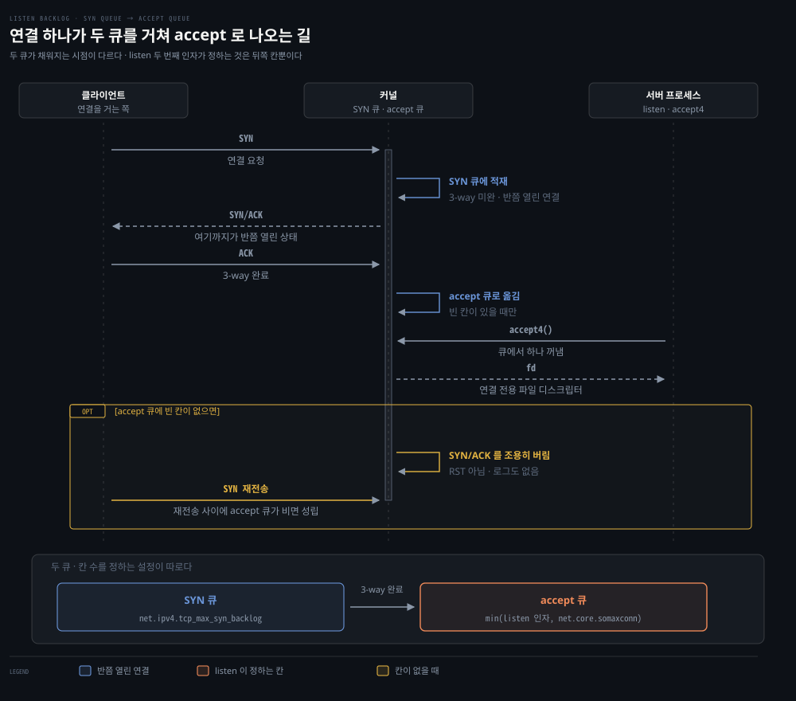
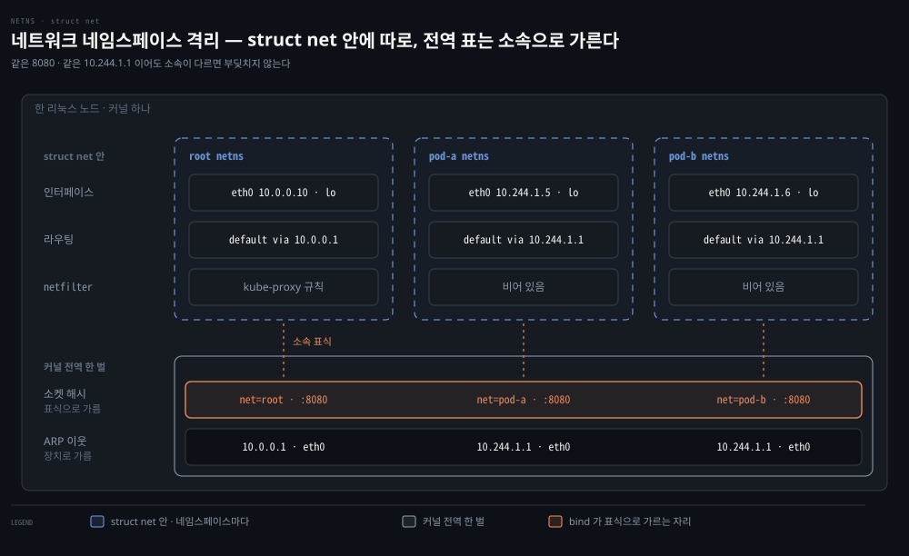
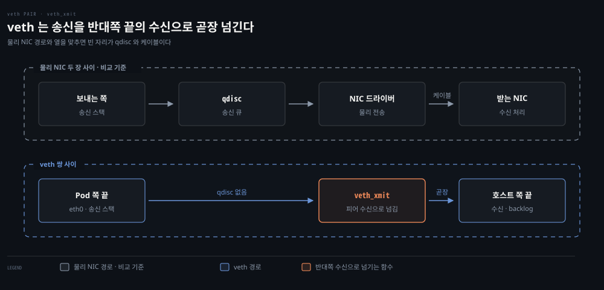
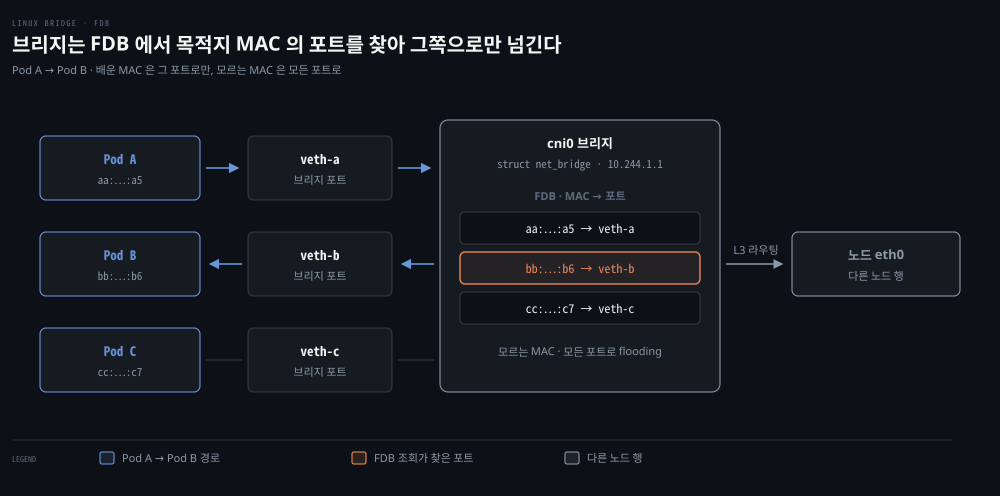

# 커널이 패킷을 주고받는 자리 — 소켓·인터페이스·veth·브리지

---

## 핵심 요약
> 이 편 전체가 매달린 하나의 생각은 **"애플리케이션은 파일(소켓)만 보고, 패킷은 전부 커널이 다룬다"**입니다.

웹 서버는 소켓을 만들어 바인딩하고 커널의 알림을 기다릴 뿐입니다. 패킷과 데이터 스트림 사이의 번역은 커널의 몫입니다. 커널이 패킷을 주고받는 창구가 네트워크 인터페이스이고, 컨테이너마다 격리된 네임스페이스는 veth 쌍과 브리지가 잇습니다. 그 길목에서 패킷을 판정하는 Netfilter·Conntrack·라우팅은 [02-02](./02-02.%EC%BB%A4%EB%84%90%EC%9D%B4%20%ED%8C%A8%ED%82%B7%EC%9D%84%20%ED%8C%90%EC%A0%95%ED%95%98%EB%8A%94%20%EC%B8%B5%20%E2%80%94%20Netfilter%C2%B7Conntrack%C2%B7%EB%9D%BC%EC%9A%B0%ED%8C%85.md)가 이어받습니다.


## 학습 목표
> 애플리케이션이 커널에 네트워크를 맡기는 자리(소켓)와 패킷이 드나드는 인터페이스·가상 배선을 나눠, 각 자리가 무엇을 정하는지 짚을 수 있는 상태를 목표로 합니다.

이 내용을 읽고 나면:

1. strace 출력에서 서버가 소켓을 만들고 요청을 기다리는 syscall 순서를 짚을 수 있습니다.
2. loopback 인터페이스가 보안 경계가 아닌 이유를 CVE 사례로 설명할 수 있습니다.
3. 네트워크 네임스페이스가 무엇을 따로 두고 무엇을 소속으로 가르는지 짚어, 같은 포트를 겹쳐 쓸 수 있는 이유를 설명할 수 있습니다.
4. 브리지와 veth 쌍이 네트워크 네임스페이스를 잇는 방식을 그릴 수 있습니다.

아래는 커널이 패킷을 다루는 자리를 주제별로 배치한 지도입니다. 점선 안이 이 편이 다루는 소켓과 격리·배선이고, 그 아래 훅·연결 추적·라우팅은 02-02 가 이어받습니다. 위쪽 애플리케이션은 01장이 다룹니다. 각 칸에 적힌 번호가 본문에서 그것을 다루는 곳입니다.


## 1. 서버가 요청을 받기까지 — 소켓과 syscall
> 우리가 쓰는 건 `net.Listen` 한 줄이지만, 그 뒤에서 커널은 소켓을 만들고 포트를 예약하고 대기 큐를 겁니다. 이 분업선을 알아야 접속 지연·포트 충돌 같은 문제가 내 코드 탓인지 커널 설정 탓인지 가릅니다.

### 풀려는 문제

웹 서버를 짜면 요청을 받는 코드는 사실상 이게 전부입니다.

```bash
# 내가 쓰는 코드 — 요청을 받는 부분은 이 세 줄뿐입니다
ln, _ := net.Listen("tcp", ":8080")     # 창구를 연다
for {
    conn, _ := ln.Accept()              # 손님을 하나 받는다
    go handle(conn)                     # 그 손님에게 응답한다
}
```

너무 짧아서 그 뒤에 무슨 일이 벌어지는지 볼 일이 없습니다. 그런데 운영에 들어가면 이런 증상을 만납니다. 트래픽이 몰리자 접속이 **거부되진 않는데 느려집니다.** 배포하려니 `Address already in use` 로 뜨질 않습니다. root 로 안 돌렸더니 80번 포트에 못 붙습니다. 이 증상들의 원인은 전부 첫 줄이 커널에 남긴 것들 안에 있는데, 한 줄만 보고는 손댈 곳을 못 찾습니다.

### 애플리케이션은 소켓만, 나머지는 커널

그래서 파고드는 게 이겁니다. 그 한 줄이 커널에 무엇을 시키는가. 여기 원칙이 하나 있습니다. **애플리케이션은 소켓만 보고, 패킷 처리는 전부 커널이 합니다.** 프로그램은 네트워크 카드를 직접 만지지 못하고 커널에게 부탁만 합니다.

두 낱말을 풀어 둡니다. 그 부탁이 **시스템 호출(syscall)** 이고, 부탁의 결과로 받는 번호표가 **파일 디스크립터(fd)** 입니다. 리눅스는 소켓도 파일로 다루므로, 창구를 열면 정수 하나를 돌려주고 이후 그 번호로 창구를 가리킵니다.

### strace 로 들여다보기

그 분업을 눈으로 확인하는 도구가 `strace` 입니다. 프로세스가 커널에 거는 syscall 을 가로채 순서대로 찍어 주므로, "이 프로그램이 커널에 무엇을 부탁했는가"를 시간순으로 보여 줍니다. 앞의 `net.Listen` 한 줄을 strace 로 뜨면 이렇게 나옵니다.

```bash
# net.Listen 한 줄이 커널에 실제로 건 부탁들 (인자 일부는 줄여 적었습니다)
socket(AF_INET6, SOCK_STREAM|SOCK_CLOEXEC|SOCK_NONBLOCK, IPPROTO_IP) = 3   # 창구를 연다 — fd 3
setsockopt(3, SOL_IPV6, IPV6_V6ONLY, [0], 4) = 0                           # IPv4+IPv6 모두 수신
bind(3, {sin6_port=htons(8080), "::" ...}) = 0                             # 8080, 모든 주소에
listen(3, 128)                                                             # 대기 큐를 걸고 연다
epoll_create1(EPOLL_CLOEXEC) = 4                                           # 알림 창구 — fd 4
epoll_ctl(4, EPOLL_CTL_ADD, 3, ...) = 0                                    # fd 3 을 fd 4 에 등록
epoll_wait(4, ...)                                                         # 여기서 잠든다
```

> `epoll_wait` 가 보는 fd 4 가 어디서 왔는지 드러나도록 `epoll_create1` 과 `epoll_ctl` 을 함께 실었습니다.

각 줄의 인자가 무엇을 정하는지 짚어 둡니다.

- `socket(계열, 방식, 프로토콜)`: 차례로 주소 계열, 통신 방식, 프로토콜입니다. `SOCK_STREAM` 이 TCP 를 뜻하고 `IPPROTO_IP` 는 "방식에 맞는 기본 프로토콜"이라는 의미입니다. 반환값 `3` 이 새로 받은 fd 입니다.
- `setsockopt(fd, 계층, 옵션, 값, 길이)`: fd 3 의 IPv6 계층(`SOL_IPV6`) 옵션 하나를 끕니다. 뒤의 `[0]` 과 `4` 가 설정할 값과 그 값의 바이트 길이입니다.
- `bind(fd, 주소구조체, 길이)`: fd 3 에 주소를 붙입니다. 구조체 안이 포트와 주소이고 `::` 는 어떤 주소로든 받겠다는 와일드카드입니다.
- `listen(fd, 백로그)`: 둘째 인자가 대기 칸 수입니다. 이 값이 뒤에서 접속 지연을 설명합니다.[^somaxconn]
- `epoll_ctl(알림fd, 명령, 대상fd, 관심사건)`: 알림 창구 fd 4 에 듣는 소켓 fd 3 을 등록(`EPOLL_CTL_ADD`)합니다.
- `epoll_wait(알림fd, 사건배열, 최대개수, 대기시간)`: 등록한 fd 중 무엇이든 준비될 때까지 기다립니다.

여기서 strace 는 흐름을 읽으려고 잠깐 붙이는 것입니다. 운영 중인 프로세스에 붙이면 값이 비쌉니다. 현재 구현은 `ptrace(2)` 의 breakpoint 기반이라 모든 syscall 진입·반환에서 멈춥니다. 저자 예에서 `dd` 는 2.7GB/s 에서 37.3MB/s 로, 73배 느려졌습니다. 주요 옵션과 오버헤드가 훨씬 낮은 `perf trace` 는 [05-03. 애플리케이션 — 관측 도구·gotchas](../../../02_os/book/systems-performance/05-03.%EC%95%A0%ED%94%8C%EB%A6%AC%EC%BC%80%EC%9D%B4%EC%85%98%20%E2%80%94%20%EA%B4%80%EC%B8%A1%20%EB%8F%84%EA%B5%AC%C2%B7gotchas.md) §3 이 다룹니다.

### 읽어내기 — 세 부탁이 남기는 것

앞의 두 코드블록을 겹쳐 보면 `net.Listen` 한 줄이 `socket` → `bind` → `listen` 세 부탁으로 펼쳐진 게 보입니다. 내가 쓴 건 한 줄인데 커널에는 세 부탁이 들어간 겁니다. `Accept()` 는 연결이 온 뒤 `accept4` 로 이어집니다. 앞의 세 부탁이 커널에 무엇을 남기고, 그게 어떤 증상으로 이어지는지가 아래 그림입니다.


**비유하면 관공서 민원 창구를 여는 일**입니다.

- `socket` — 창구 자리(fd)를 배정받는다
- `bind` — 그 창구에 "8080번 담당" 번호패를 걸어 포트를 예약한다
- `listen` — "줄 서세요" 하고 문을 연다

여기서 앞의 증상 둘이 설명됩니다.

- **`Address already in use`** — `bind` 는 포트를 예약합니다. 한 포트는 임자가 하나뿐이라, 이미 그 포트를 쓰는 프로세스가 있으면 두 번째 `bind` 가 실패합니다. 배포 시 옛 프로세스가 안 죽었거나 포트가 겹친 것이지 코드 버그가 아닙니다.
- **80번 포트에 못 붙음** — 1~1023(well-known port)은 바인딩에 root 권한이 필요합니다. 뚫려도 넘어갈 권한을 줄이려고 보통 8080 같은 비특권 포트에서 듣고 외부용 80·443 은 로드밸런서나 Kubernetes Service 로 넘깁니다. (`0.0.0.0`·`[::]` 은 와일드카드 주소로, 머신이 어떤 IP 를 받을지 미리 모르는 채 노출할 때 씁니다.)

세 번째 증상, **접속 지연**은 `listen` 의 두 번째 인자에 있습니다. 이 값은 **수립이 끝났지만 아직 `accept` 로 받아 가지 않은 연결**을 담아 두는 칸 수로, 위 그림이 accept 큐라고 적은 칸이 그것입니다. 그런데 연결이 거쳐 가는 칸은 하나가 아닙니다. 아래 그림이 두 칸을 시간순으로 폅니다.



> 원서 밖 보강: SYN 큐와 `tcp_max_syn_backlog`·`tcp_abort_on_overflow` 는 책에 없는 내용입니다. 책은 백로그를 한 덩어리로만 다루는데, 그러면 "넘치면 거절"이라는 오해가 남아 정작 실무에서 만나는 접속 지연을 설명하지 못합니다.

SYN 만 받고 3-way 가 안 끝난 반쯤 열린 연결은 **SYN 큐**에 따로 쌓입니다. `listen` 의 두 번째 인자가 정하는 것은 뒤쪽 accept 큐뿐이고, 그나마 실제 칸 수는 그 인자와 `net.core.somaxconn` 중 작은 값입니다. 앞 칸과 뒤 칸을 서로 다른 설정이 정하니, 백로그를 늘렸는데도 나아지지 않으면 어느 칸이 모자란지부터 갈라야 합니다.

accept 큐가 넘칠 때의 동작은 직관과 다릅니다. 커널은 연결을 **거절하지 않고 SYN/ACK 를 조용히 버립니다.** 즉시 RST 로 끊는 건 `net.ipv4.tcp_abort_on_overflow` 를 1로 켠 경우뿐이고 기본값은 0입니다. **그래서 백로그 부족은 "연결 거부"가 아니라 접속 지연으로 먼저 드러납니다.** 에러 로그가 남지 않아서, 원리를 모르면 큐 설정 대신 엉뚱한 곳을 뒤집니다.

### 창구를 연 뒤 — 기다리는 순환

문을 열었으니 이제 손님을 기다립니다. 여기서 하나를 분명히 해야 합니다. **서버가 멈춰 서 있는 자리는 `listen` 이 아닙니다.** `listen` 은 한 번 부르면 곧바로 돌아오는 호출입니다. 문을 열어 두는 설정일 뿐, 거기 머무르지 않습니다.

멈추는 자리는 그다음입니다. 창구를 열어 두고 마냥 서서 지켜보면 CPU 만 태우므로, 커널에게 **"손님이 오면 깨워 줘"** 라고 맡기고 잠듭니다. 그 알림 장치가 `epoll` 이고 실제로 잠드는 자리가 `epoll_wait` 입니다. 앞 strace 에서 출력이 끊긴 곳이 바로 여기입니다.


그림의 세 칸이 서버가 도는 한 바퀴입니다. `epoll_wait` 에서 자다가 accept 큐에 새 연결이 들어오면 커널이 깨웁니다. 서버는 `accept4` 로 연결을 꺼내면서 **그 연결만의 새 fd** 를 받습니다. 이 fd 는 듣는 창구 fd 와 별개입니다. 창구는 계속 열려 있고 손님마다 상담 번호표가 따로 나오는 셈입니다. 응답을 그 fd 에 쓰면 커널이 패킷으로 바꿔 내보내고, 서버는 다시 `epoll_wait` 로 돌아갑니다. 왼쪽 위의 자기 루프가 그 사이 새 연결이 없으면 깨지 않고 계속 자는 경우입니다.

받은 연결에는 KEEPALIVE 를 켜고 프로브 간격을 180초로 두는 것이 보통입니다. KEEPALIVE 는 "이 연결이 아직 살아 있나"를 주기적으로 찔러 보는 장치로, 상대가 조용히 사라진 죽은 연결을 오래 붙들지 않으려는 것입니다.


## 2. 네트워크 인터페이스 — loopback은 보안 경계가 아니다
> `127.0.0.1` 바인딩은 접근 제어가 아닙니다. 라우팅 설정에 따라 원격이 loopback에 닿을 수 있고, CVE-2020-8558이 그 대가를 보여 줬습니다.


### 풀려는 문제

DB 를 `127.0.0.1` 에만 바인딩해 두고 "어차피 이 호스트 안에서만 닿으니 안전하다"고 여기는 관행이 흔합니다. 인증을 느슨하게 두기도 하고요. 이 가정이 **참인가**가 이 절의 물음입니다.

### 인터페이스에 주소가 붙는다

컴퓨터는 네트워크 인터페이스로 외부와 통신합니다. 인터페이스는 물리적(Ethernet 카드)일 수도, 호스트나 하이퍼바이저가 제공하는 가상일 수도 있습니다. IP 주소는 인터페이스에 할당되며 하나의 인터페이스에 여러 주소를 붙일 수 있습니다. `ifconfig` 또는 `ip` 명령으로 전체 인터페이스와 설정(IP·MAC·MTU·RX/TX 통계)을 확인합니다. 컨테이너 런타임은 호스트의 Pod마다 가상 인터페이스를 만들기 때문에, 실제 Kubernetes 노드에서 이 목록은 훨씬 깁니다.

loopback(lo)은 같은 호스트 안 통신 전용 인터페이스로 표준 주소는 `127.0.0.1`입니다. 여기로 보낸 패킷은 호스트를 떠나지 않고, `127.0.0.1`에서 듣는 프로세스는 같은 호스트의 프로세스만 접근할 수 있습니다.

### CVE-2020-8558 — 원격이 127.0.0.1 에 닿은 사건

그런데 저자들은 이 바인딩을 보안 경계로 믿지 말라고 경고하며 Kubernetes의 과거 취약점 CVE-2020-8558을 듭니다. kube-proxy가 만든 규칙 탓에 일부 원격 시스템이 `127.0.0.1`에 도달할 수 있었던 사건입니다. 컨트롤 플레인 노드에서 이 구멍이 열리면 같은 네트워크의 머신이 "localhost는 신뢰할 수 있다"는 가정을 악용해 API 서버로 클러스터를 장악할 수 있었습니다.

절 첫머리 그림의 점선 안이 "여기는 로컬 전용"이라고 믿는 구간입니다. 화살표가 그 선을 넘어 들어가는 것이 이 사건의 전부입니다. 인접 호스트가 보낸 패킷은 노드 NIC까지는 평범하게 도착하고, 노드 설정이 로컬 주소로 가는 길을 허용해 둔 탓에 `127.0.0.1`에 닿습니다.

### 접근을 정하는 것은 라우팅과 방화벽이다

**바인딩 주소는 누가 접근할 수 있는지를 정하지 않습니다.** 그것을 정하는 것은 라우팅과 방화벽 규칙입니다. 로컬 전용이 필요하면 주소로 믿지 말고 규칙으로 막아야 합니다.


## 3. 네트워크 네임스페이스 — 격리의 실체는 커널 안 struct net
> 컨테이너 셋이 한 노드에서 같은 8080 을 쓸 수 있는 것은 커널이 격리를 두 방식으로 하기 때문입니다. 인터페이스·라우팅·netfilter 는 네임스페이스마다 `struct net` 안에 따로 두고, 소켓 해시와 ARP 표는 전역 한 벌을 항목의 소속으로 가려 봅니다.

### 풀려는 문제

한 호스트에서 컨테이너 여럿을 돌린다고 합시다. 각 컨테이너는 자기 인터페이스와 IP 를 가진 채 서로 격리돼야 하고, 그러면서도 밖으로는 나갈 수 있어야 합니다. 그런데 물리 NIC 은 호스트에 하나뿐입니다. 어떻게 하나의 물리 카드를 여럿이 격리된 채 나눠 쓸까요?

답이 두 부품입니다. 격리는 **네트워크 네임스페이스**가 맡고, 격리된 네임스페이스를 밖과 잇는 배선은 veth 쌍(소프트웨어 랜선)과 브리지(소프트웨어 스위치)가 맡습니다. 이 절이 격리를, §4 가 배선을 다룹니다.

네트워크 네임스페이스는 인터페이스·라우팅 테이블·방화벽 규칙을 한 벌씩 따로 갖는 격리된 네트워크 공간입니다. 같은 호스트 안에 있어도 네임스페이스가 다르면 서로의 인터페이스가 보이지 않아, 각자 독립된 머신처럼 동작합니다. 이름이 같아 헷갈리지만 Kubernetes의 namespace(리소스를 논리적으로 묶는 이름표)와는 별개 개념입니다. 이 정의 자체는 책에 없고 이해를 돕기 위해 덧붙인 것입니다.

### 무엇이 격리되는가 — struct net 안에 따로, 전역 표는 소속으로 가른다
> 원서 밖 보강입니다. 커널 소스(`struct net`)와 `ip-netns(8)` 을 근거로 `02_os/networking` 에서 이관했습니다(2026-09-21).

리눅스 서버는 부팅할 때부터 기본 네임스페이스 하나를 갖고, 컨테이너를 만들면 한 벌을 더 만듭니다. 커널이 네임스페이스 하나를 표현하는 객체가 `struct net` 입니다. 다만 앞 정의의 "한 벌씩"이 모두 이 객체 안에 들어 있지는 않습니다. 자료구조에 따라 격리하는 방식이 둘로 갈립니다.

인터페이스 목록(`struct net_device` 리스트)과 loopback 장치, 라우팅 테이블, netfilter 훅은 `struct net` 안에 네임스페이스마다 한 벌씩 있습니다. 소켓 해시와 ARP 이웃 테이블은 커널 전체가 한 벌을 함께 쓰는 대신, 조회할 때 같은 네임스페이스의 항목만 봅니다. 소켓 항목은 소속 네임스페이스 표식을 달고 있고, ARP 항목은 자기가 매달린 장치로 소속이 정해집니다.[^netns-tables]



세 네임스페이스가 모두 8080 을 쥐고 있어도 충돌하지 않는 근거가 소켓 해시의 표식입니다. `bind` 가 포트 임자를 찾을 때 자기 네임스페이스 표식이 붙은 항목만 비교하므로, 옆 네임스페이스의 8080 은 비교 대상에 오르지 않습니다. 두 Pod 의 ARP 항목이 똑같이 `10.244.1.1` 과 `eth0` 이어도 부딪치지 않는 것은 두 `eth0` 이 이름만 같은 서로 다른 장치이기 때문입니다.

### 만들기와 들어가기 — unshare 는 만들고 setns 는 들어간다

```bash
ip netns add demo                         # /var/run/netns/demo 생성
ip netns list
ip netns exec demo ip addr                # 그 네임스페이스에서 명령 실행
nsenter --net=/var/run/netns/demo bash    # 셸로 진입
```

- `ip netns add`는 새 `struct net`을 만드는 쪽입니다. 내부적으로 자식에서 `unshare(CLONE_NEWNET)`으로 새 네임스페이스를 만든 뒤, `/proc/self/ns/net`을 `/var/run/netns/<이름>` 아래에 bind-mount해 살려 둡니다. `setns(2)`는 *만드는* 게 아니라 *이미 있는* 네임스페이스에 *들어가는* syscall이라, `ip netns exec`가 이걸 씁니다.
- `/var/run/netns/<이름>`은 그 네임스페이스를 잡아 두는 마운트 포인트일 뿐이고, 실제 격리 단위는 커널 안의 `struct net` 객체입니다.

컨테이너 런타임은 보통 `/var/run/netns/`에 등록하지 않고 자기 프로세스가 잡고 있는 fd만으로 네임스페이스를 유지합니다. K8s에서 Pause 컨테이너의 PID를 알면 `nsenter -t <PID> -n`으로 그 Pod의 네임스페이스에 들어갈 수 있습니다.


## 4. veth 와 브리지 — 네임스페이스를 잇는 배선
> §3 의 네임스페이스를 밖과 잇는 배선이 veth 쌍이고, 여러 쌍을 한 호스트 안에서 묶는 스위치가 브리지입니다. Kubernetes의 Pod 네트워킹이 이 조합 위에 섭니다.


### veth 쌍 — 한 장치의 두 끝을 두 네임스페이스에 건다

새 네임스페이스에는 loopback 말고는 인터페이스가 없어 그대로는 밖과 통하지 않습니다. 여기에 선을 넣는 부품이 **veth** 입니다. veth는 로컬 Ethernet 터널로, 항상 쌍으로 만들어집니다. 한쪽 장치로 전송한 패킷은 즉시 반대쪽 장치에 수신되고, 어느 한쪽이 죽으면 쌍 전체의 링크가 내려갑니다. 네임스페이스끼리 또는 네임스페이스와 호스트가 통신해야 할 때 veth를 씁니다.

```bash
# 네임스페이스 둘을 만들고 veth 쌍으로 잇습니다
ip netns add net1
ip netns add net2
ip link add veth1 netns net1 type veth peer name veth2 netns net2
```

위 그림의 점선이 네임스페이스 경계입니다. veth를 상자 두 개로 그리지 않고 경계를 가로지르는 하나로 둔 이유는 실제로 그렇기 때문입니다. 직접 만들어 보면 두 끝이 이름에 서로를 답니다. `veth2@veth1` 과 `veth1@veth2` 처럼 `@` 뒤가 상대를 가리키고, 두 끝이 서로 다른 네임스페이스에 있으면 이름 대신 인덱스 번호로 바뀝니다. Pod 안에서 자기 네트워크 카드처럼 보이는 `eth0` 도 실제로는 이런 쌍의 한쪽 끝입니다.

위 명령은 두 끝을 만들면서 곧바로 네임스페이스에 넣었습니다. 따로 지정하지 않으면 인터페이스는 명령을 실행한 네임스페이스에 생깁니다. `ip link set <iface> netns <ns>` 로 다른 네임스페이스로 옮길 수 있고, 옮기고 나면 원래 네임스페이스에서는 더 이상 보이지 않습니다. CNI 가 veth 쌍의 한쪽 끝을 Pod 네임스페이스로 옮기는 동작이 이것입니다. Kubernetes 가 CNI 와 함께 컨테이너의 네임스페이스·인터페이스·IP 를 관리하는 방식은 3장에서 자세히 다룹니다.

### veth 사이에는 케이블도 qdisc 도 없습니다

veth 의 한쪽이 보낸 패킷은 무엇을 거쳐 반대쪽에 닿을까요? 물리 NIC 두 장 사이라면 송신 큐(qdisc)에 줄을 섰다가 드라이버를 거쳐 케이블을 탑니다. veth 쌍 사이에는 케이블이 없고, veth 는 기본으로 송신 큐를 두지 않는 장치라 qdisc 도 거치지 않습니다.[^veth-noqueue] 송신 함수 `veth_xmit` 가 반대쪽 끝의 RX 경로(NAPI/GRO backlog)로 패킷을 곧장 넘깁니다.



이 모델 덕분에 veth는 빠릅니다. 다만 패킷이 두 번의 softirq를 타며 CPU 캐시 미스가 날 수 있습니다.

그래서 대량 트래픽 환경에서는 veth 대신 macvlan 또는 ipvlan을 쓰는 패턴이 검토됩니다. 둘의 차이는 MAC을 다루는 방식입니다. macvlan은 서브 인터페이스마다 별도 MAC을 주고, ipvlan은 부모 인터페이스의 MAC을 공유한 채 L3에서 나눕니다.

### 브리지는 MAC 을 배워서 전달합니다 — FDB

브리지 인터페이스는 한 호스트 안에 L2 네트워크를 만들어, 호스트 안 인터페이스들 사이에서 네트워크 스위치처럼 동작합니다. Pod 가 자기 인터페이스를 가진 채 노드의 인터페이스를 거쳐 바깥 네트워크와 통신하도록 잇는 자리입니다. 현실 네트워크가 여러 컴퓨터를 스위치에 꽂아 묶듯, 리눅스는 여러 veth 를 브리지 하나에 꽂아 여러 Pod 를 같은 네트워크로 묶습니다. 브리지에 물리는 것은 veth 쌍의 한쪽 끝뿐이라 `bridge link` 에는 물린 쪽만 나옵니다.

> 여기부터는 원서 밖 보강입니다. `bridge(8)` 을 근거로 `02_os/networking` 에서 이관했습니다(2026-09-21).

Linux bridge는 `struct net_bridge`로 표현되며, 안에 forwarding database(FDB)를 갖습니다. 같은 bridge에 꽂힌 인터페이스에서 source MAC을 본 적이 있으면 그 MAC이 어느 포트에서 왔는지 FDB에 학습됩니다. 다음 패킷이 그 MAC으로 향할 때 곧장 해당 포트로 전달됩니다. 아직 학습되지 않은 MAC은 모든 포트로 flooding해 답을 찾습니다.



```bash
bridge link show
bridge fdb show br cni0
ip -d link show cni0
```

bridge는 STP(Spanning Tree Protocol)도 지원하지만 컨테이너 환경에서는 보통 비활성화합니다. STP가 켜지면 listening·learning 두 단계를 거치느라, 노드를 다시 부팅했을 때 forwarding 시작 전 30초 정도 지연이 생깁니다.

### 이 배선이 이어지는 곳 — 02-02 의 전달 판정과 02-05 실습

[02-02 §1](./02-02.%EC%BB%A4%EB%84%90%EC%9D%B4%20%ED%8C%A8%ED%82%B7%EC%9D%84%20%ED%8C%90%EC%A0%95%ED%95%98%EB%8A%94%20%EC%B8%B5%20%E2%80%94%20Netfilter%C2%B7Conntrack%C2%B7%EB%9D%BC%EC%9A%B0%ED%8C%85.md) 에서 목적지가 Pod 주소로 바뀐 패킷은 결국 이 veth 를 건너 Pod 네임스페이스로 들어갑니다. 노드 네임스페이스에서 보면 목적지가 자기 주소가 아니므로 전달이고, veth 를 지나 Pod 네임스페이스에 도착한 뒤에는 그쪽에서 다시 "목적지가 나"가 되어 로컬로 올라갑니다. 같은 패킷이 네임스페이스에 따라 전달이기도 하고 로컬이기도 한 것이 이 배선 때문입니다.

이 배선을 실제로 지어 보는 절차는 [02-05 실습편](./02-05.%EC%BB%A4%EB%84%90%20%EB%84%A4%ED%8A%B8%EC%9B%8C%ED%82%B9%20%EC%8B%A4%EC%8A%B5%20%E2%80%94%20veth%C2%B7%EB%B8%8C%EB%A6%AC%EC%A7%80%C2%B7%ED%8F%AC%EC%9B%8C%EB%94%A9%EC%9D%84%20%EC%86%90%EC%9C%BC%EB%A1%9C%20%EC%A7%93%EA%B8%B0.md) §2 가 다룹니다. 네임스페이스를 만들어 veth 의 두 끝을 갈라 넣고, 양쪽에 IP 를 할당해 두 네임스페이스가 ping 으로 통신하는 것까지 확인합니다.


## 심화 학습
> 책 밖에서 보강한 내용입니다. 출처를 함께 남깁니다.

- CVE-2020-8558의 원인은 kube-proxy가 설정하는 `route_localnet=1` 커널 파라미터였습니다. 상세 경위는 [Kubernetes 이슈 #90259](https://github.com/kubernetes/kubernetes/issues/90259)에 기록돼 있습니다. 다만 책은 문제 패킷이 `127.0.0.1`과 같은 네트워크로 취급되는 loopback 장치에서 왔으니 엄밀히는 "Martian 패킷이 필터링되지 않은 사례"가 아니라고 봅니다.


## 면접에서 받을 만한 질문

> 먼저 스스로 답을 소리 내어 말해 본 뒤, 아래 §정답 섹션을 펼쳐 맞춰 봅니다.

1. loopback(`127.0.0.1`) 바인딩이 보안 경계가 아닌 이유는? (CVE 사례)
2. veth는 왜 항상 쌍으로 만들어집니까?

### 적용 문제 — 조건이 바뀌면 결과가 어떻게 달라지는가

앞의 두 문항이 "무엇인가"를 묻는다면 아래 문항은 "그래서 이 경우는 어떻게 되는가"를 묻습니다. 본문에서 배운 것만으로 풀 수 있습니다.

**A. strace 한 토막에서 fd 를 가릅니다.**

```bash
socket(AF_INET6, SOCK_STREAM|SOCK_NONBLOCK, IPPROTO_IP) = 3
bind(3, {sin6_port=htons(8080), "::" ...}) = 0
listen(3, 4096)                             = 0
epoll_create1(EPOLL_CLOEXEC)                = 4
epoll_ctl(4, EPOLL_CTL_ADD, 3, ...)         = 0
epoll_wait(4, ...
```

fd 3 과 fd 4 는 각각 무엇이고, 이 프로세스는 지금 어디에서 멈춰 있습니까? 잠시 뒤 `accept4(3, ...) = 7` 이 찍혔다면 fd 7 은 무엇입니까?


## 정답 (자답 후 펼치기)

> 위 질문에 먼저 스스로 답해 본 뒤 읽는 편이 낫습니다. 답을 떠올리려 애쓰는 과정이 기억에 남는 자리를 만들기 때문입니다.

읽고 넘어가도 배우는 것이 없지는 않지만, 자답을 거친 쪽이 다시 꺼내 쓰기 쉽습니다. 아래를 읽었다고 이해가 끝난 것도 아닙니다. 이해 여부는 학습자가 자기 말로 다시 설명해 봐야 확인됩니다.

### 정답 1 — loopback 비보안경계
`127.0.0.1` 바인딩은 보안 경계가 아닙니다. CVE-2020-8558처럼 라우팅 설정에 따라 원격 머신이 `127.0.0.1`에 닿으면 "localhost는 신뢰할 수 있다"는 가정을 악용해 API 서버까지 장악할 수 있었습니다.

### 정답 2 — veth 쌍
터널의 양 끝이기 때문입니다. 한쪽에 쓴 패킷이 즉시 반대쪽에서 수신되는 구조라, 네임스페이스 안쪽 끝과 바깥쪽(호스트·브리지) 끝을 하나씩 맡아 격리된 네임스페이스에 네트워크를 공급합니다.

### 정답 A — 듣는 fd 와 연결 fd, 그리고 멈춘 자리

fd 3 은 듣는 소켓입니다. `socket` 이 만들고 `bind` 로 8080 을 예약한 뒤 `listen` 으로 연 창구입니다. fd 4 는 소켓이 아니라 알림 창구(epoll 인스턴스)로, `epoll_create1` 이 따로 만든 것입니다. 지금 프로세스는 `epoll_wait(4, ...)` 에서 멈춰 있습니다. fd 7 은 `accept4` 가 꺼낸 그 연결 하나만의 fd 이고, fd 3 과 별개로 새로 생깁니다.

자주 나오는 오해는 서버가 `listen` 에서 기다린다고 보는 것입니다. `listen` 은 한 번 부르면 곧바로 돌아오는 설정 호출이고, 실제로 잠드는 자리는 `epoll_wait` 입니다. 또 하나는 `accept4` 가 fd 3 을 재사용한다고 보는 것인데, 창구는 계속 열려 있어야 하므로 연결마다 새 번호가 나옵니다.


## 핵심 개념 체크리스트
> 아래를 막힘없이 답할 수 있으면 다음 편으로 넘어가도 좋습니다. 답이 막히는 항목이 있으면 그 절만 다시 봅니다.
- [ ] bind→listen→epoll_wait→accept4 흐름에서 각 syscall의 역할을 말할 수 있는가?
- [ ] 듣는 소켓 fd 와 연결마다 새로 나는 fd 를 가를 수 있는가?
- [ ] 비특권 포트 + 인프라 리다이렉트 관행의 보안 근거를 설명할 수 있는가?
- [ ] `127.0.0.1` 바인딩이 접근 제어가 아니고, 접근을 정하는 것이 라우팅과 방화벽인 이유를 말할 수 있는가?
- [ ] 네임스페이스마다 `struct net` 안에 따로 두는 것과 전역 한 벌을 소속으로 가르는 것을 구분하고, 세 Pod 가 같은 8080 을 쓸 수 있는 이유를 말할 수 있는가?
- [ ] veth 쌍과 브리지가 네임스페이스를 어떻게 잇는지, 브리지가 FDB 로 포트를 고르는 과정을 말할 수 있는가?


## 참고 자료
- 《Networking and Kubernetes: A Layered Approach》(James Strong·Vallery Lancey, O'Reilly, 2021, ISBN 978-1492081654) Ch2
- [Kubernetes 이슈 #90259 — CVE-2020-8558](https://github.com/kubernetes/kubernetes/issues/90259)
- 이전 편: [01-03. IP·라우팅·Ethernet](./01-03.IP%C2%B7%EB%9D%BC%EC%9A%B0%ED%8C%85%C2%B7Ethernet%20%E2%80%94%20%ED%8C%A8%ED%82%B7%EC%9D%B4%20%EA%B8%B8%EC%9D%84%20%EC%B0%BE%EB%8A%94%20%EB%B2%95.md)
- 다음 편: [02-02. 커널이 패킷을 판정하는 층](./02-02.%EC%BB%A4%EB%84%90%EC%9D%B4%20%ED%8C%A8%ED%82%B7%EC%9D%84%20%ED%8C%90%EC%A0%95%ED%95%98%EB%8A%94%20%EC%B8%B5%20%E2%80%94%20Netfilter%C2%B7Conntrack%C2%B7%EB%9D%BC%EC%9A%B0%ED%8C%85.md)


## 각주
> 본문에서 숫자 하나를 특정하면 환경이 달라질 때 틀리는 자리입니다. 그 값이 어디서 오는지를 여기 둡니다.

[^somaxconn]: 백로그 값은 환경마다 다릅니다. go1.26 + Ubuntu 26.04 실측은 `listen(4, 4096)` 입니다. Go 가 `net.core.somaxconn` 값을 그대로 넘기고, 그 커널 기본값이 옛 리눅스는 128·요즘 배포판은 4096 이기 때문입니다. 책의 128 은 옛 기본값 기준입니다. `SOCK_NONBLOCK`+`epoll` 과 `IPV6_V6ONLY=0`(dual-stack) 도 go net 패키지의 표준 동작입니다.

[^netns-tables]: 커널 소스(torvalds/linux master, 2026-09-21 조회) 기준입니다. `struct net` 에 `dev_base_head`(인터페이스 목록)·`loopback_dev`·`ipv4.fib_table_hash`(라우팅)·`nf`(netfilter 훅)가 있습니다. TCP 는 전역 `tcp_hashinfo` 하나를 쓰고, 포트 점유를 담는 bind 버킷(`struct inet_bind_bucket`)에 소속 네임스페이스 `ib_net` 을 둡니다. `inet_bind_bucket_match()` 는 `net_eq()` 로 이것부터 비교합니다. 새 네임스페이스에 연결 해시만 따로 주는 `net.ipv4.tcp_child_ehash_entries` 가 있지만, 설정하지 않으면 전역 해시를 그대로 씁니다. ARP 는 전역 `arp_tbl` 하나를 쓰고, 항목인 `struct neighbour` 에는 네임스페이스 필드 없이 `dev` 만 있어 장치가 소속을 정합니다. 출처: [net_namespace.h](https://git.kernel.org/pub/scm/linux/kernel/git/torvalds/linux.git/tree/include/net/net_namespace.h) · [inet_hashtables.c](https://git.kernel.org/pub/scm/linux/kernel/git/torvalds/linux.git/tree/net/ipv4/inet_hashtables.c) · [tcp_ipv4.c](https://git.kernel.org/pub/scm/linux/kernel/git/torvalds/linux.git/tree/net/ipv4/tcp_ipv4.c) · [neighbour.h](https://git.kernel.org/pub/scm/linux/kernel/git/torvalds/linux.git/tree/include/net/neighbour.h)

[^veth-noqueue]: `drivers/net/veth.c` 의 `veth_setup()` 이 장치에 `IFF_NO_QUEUE` 를 켜고, `net/sched/sch_generic.c` 는 이 플래그가 켜진 장치에 기본 qdisc 로 `noqueue` 를 붙입니다. `tc qdisc add` 로 qdisc 를 따로 붙이면 그때부터는 거칩니다. 출처: [veth.c](https://git.kernel.org/pub/scm/linux/kernel/git/torvalds/linux.git/tree/drivers/net/veth.c) · [sch_generic.c](https://git.kernel.org/pub/scm/linux/kernel/git/torvalds/linux.git/tree/net/sched/sch_generic.c)
