# iptables·IPVS·eBPF — kube-proxy를 이해하는 세 기술

---

## 핵심 요약
> 이 편 전체가 매달린 하나의 생각은 **"테이블은 무엇을 하는지, 체인은 언제 하는지를 정한다 — 그리고 그 리스트 순회 구조의 한계가 IPVS와 eBPF를 불렀다"입니다.**

iptables는 모든 패킷에 수십~수천 개의 if 문을 순서대로 들이대는 구조라, 서비스가 수천 개인 Kubernetes 클러스터에서는 규칙 갱신에 몇 시간이 걸리는 병목이 됩니다. 그래서 kube-proxy는 IPVS 모드를 내장했고, Cilium은 eBPF로 kube-proxy 자체를 대체합니다.


## 학습 목표
> 세 기술을 나란히 아는 데서 멈추지 않고, 규모가 어디서 무너지는지를 수치로 들어 무엇을 고를지 판단하는 상태를 목표로 합니다.

이 내용을 읽고 나면:

1. iptables의 테이블·체인·규칙 3계층과 실행 순서(체인 먼저, 그 안에서 Raw→Mangle→NAT→Filter)를 설명할 수 있습니다.
2. terminating 타깃과 non-terminating 타깃을 구분하고 서브체인의 ACCEPT가 최종 결정이 아닌 이유를 말할 수 있습니다.
3. MASQUERADE와 DNAT 확률 fan-out이 Kubernetes 서비스에서 어떻게 쓰이는지 실물 체인으로 보일 수 있습니다.
4. iptables 로드밸런싱의 규모 한계를 수치로 들고 IPVS의 모드들과 비교할 수 있습니다.
5. eBPF가 Netfilter 방식과 구조적으로 무엇이 다른지, Cilium이 왜 그것을 택했는지 설명할 수 있습니다.

아래는 이 편 전체를 "iptables의 구조를 익힌 뒤 그 한계에 부딪히고, 두 갈래 답을 보는" 흐름으로 이은 지도입니다. 각 단계 오른쪽의 절 번호가 본문에서 그것을 다루는 곳입니다. 색이 붙은 곳은 한계를 가리키는 한 군데뿐이고 경고입니다. 규칙 16만 개 갱신에 5시간이라는 수치가 IPVS와 eBPF를 부른 이유라 표시했습니다.

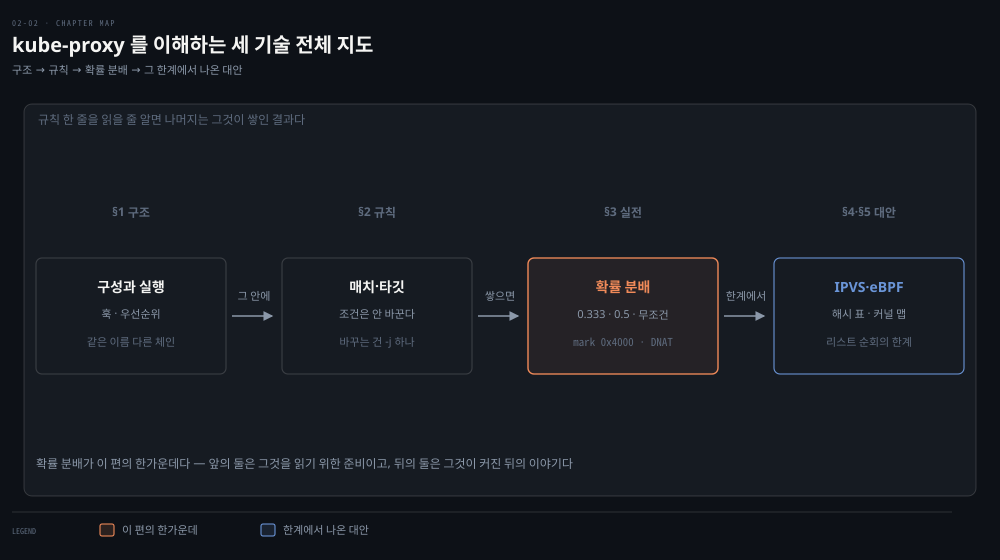


## 1. iptables의 3계층 — 테이블·체인·규칙
> 테이블은 무엇을 하는지, 체인은 언제 하는지를 정합니다. 실행 순서는 통념과 반대로 체인이 먼저이고 테이블은 그 안에서 평가됩니다.

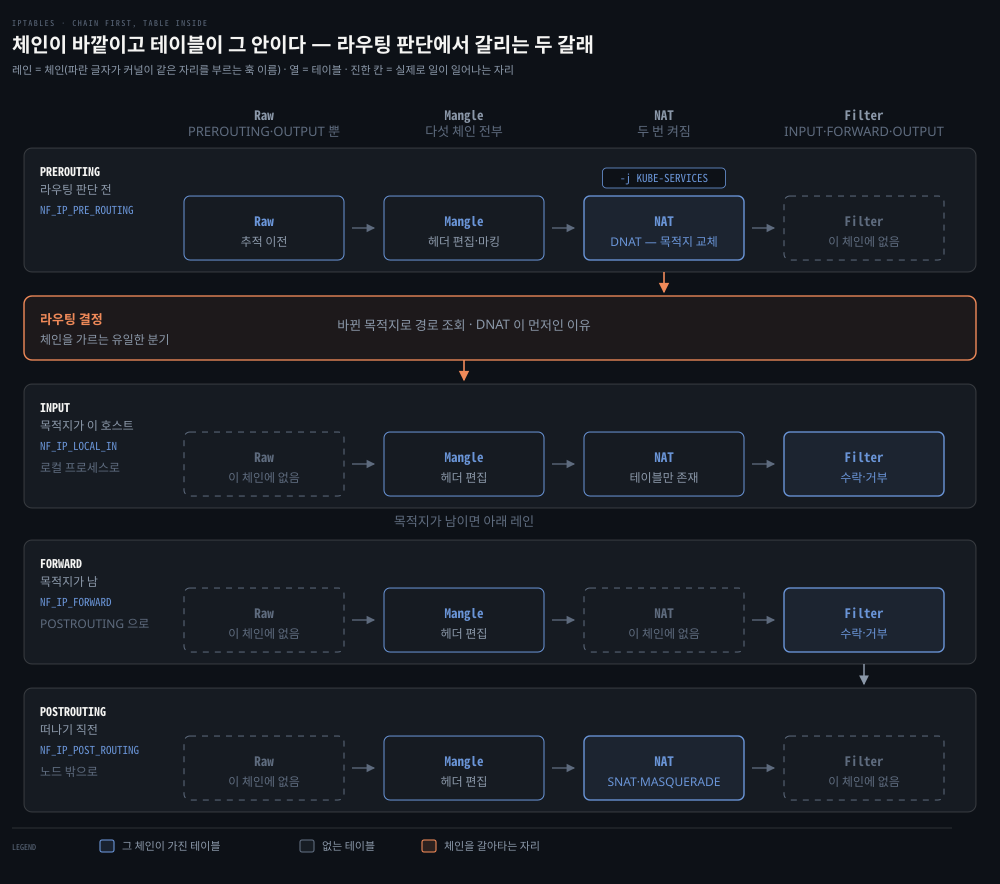

레인 하나가 체인 하나이고, 레인 안의 칸이 그 체인에서 순서대로 평가되는 테이블입니다. 점선 칸은 그 체인에 없는 테이블이라 건너뜁니다. 주황색으로 표시한 자리가 레인을 갈아타는 유일한 지점입니다. 레인 머리에 이름이 둘 적혀 있는데, 위가 iptables가 부르는 체인 이름이고 아래 파란 글자가 커널이 같은 자리를 부르는 Netfilter 훅 이름입니다.

칸을 세로로 맞춰 두었으므로 열 하나가 테이블 하나입니다. 이 배치에서 두 가지가 드러납니다. 하나는 NAT 열이 맨 위 레인과 맨 아래 레인에서 두 번 켜진다는 것입니다. 같은 테이블인데 평가되는 시점이 둘이므로, 실제 순서는 체인 순서와 테이블 순서의 곱입니다. 다른 하나는 Filter 열이 켜지는 자리가 DNAT 뒤라는 것입니다. 판정할 때 보이는 목적지가 이미 바뀐 주소인 이유가 여기 있습니다.

라우팅 결정 아래로 레인이 둘 놓인 것은 거기서 길이 갈리기 때문입니다. 목적지가 이 호스트면 INPUT 을 거쳐 로컬 프로세스로 올라가고, 남의 것이면 FORWARD 를 거쳐 POSTROUTING 으로 나갑니다. 둘은 나란한 단계가 아니라 택일입니다.

### 풀려는 문제

클러스터에서 서비스가 안 닿아 노드에 들어가 `iptables -S` 를 쳐 보면 수천 줄이 쏟아집니다. 그 안에 kubelet 과 kube-proxy 가 만든 규칙이 섞여 있는데, 어느 줄이 언제 평가되는지를 모르면 목록을 끝까지 읽어도 원인에 닿지 못합니다. 직접 규칙을 하나 넣어 보면 문제가 더 분명해집니다 — 분명히 추가했는데 아무 효과가 없거나, 엉뚱한 트래픽까지 막습니다.

규칙이 *어디에* 놓이는지가 곧 *언제* 평가되는지를 정하기 때문입니다. 그 자리를 정하는 것이 테이블과 체인이고, 둘의 관계는 이름에서 짐작하는 것과 순서가 반대입니다. 3계층과 실행 순서를 먼저 세워 두면 수천 줄짜리 목록이 읽을 수 있는 구조로 바뀝니다.

**iptables는 Netfilter를 이용해 패킷을 가로채고 변형합니다.** 방화벽·감사 로그·패킷 변형과 재라우팅, 심지어 조악한 연결 fan-out까지 가능합니다. Kubernetes 컴포넌트 중 kubelet과 kube-proxy가 iptables 규칙을 생성하므로, 대부분의 클러스터에서 Pod와 노드의 접근·라우팅을 이해하려면 iptables를 알아야 합니다.

구조는 계층적입니다 — 테이블이 체인을 담고, 체인이 규칙을 담습니다.

| 테이블 | 책임 |
|--------|------|
| Filter | 패킷의 수락·거부 (방화벽) |
| NAT | 출발지·목적지 IP 주소 변경 |
| Mangle | NAT가 아닌 범용 헤더 편집, iptables 전용 메타데이터 "마킹" |
| Raw | 연결 추적(Conntrack) 이전의 패킷 변형 — 주 용도는 특정 패킷의 추적 비활성화 |
| Security | SELinux 전용 (SELinux 미사용 머신에는 해당 없음) |

체인은 규칙의 목록입니다. 최상위 체인 5개는 PREROUTING·INPUT·FORWARD·OUTPUT·POSTROUTING이며, [전편](./02-01.%EC%BB%A4%EB%84%90%EC%9D%B4%20%ED%8C%A8%ED%82%B7%EC%9D%84%20%EB%8B%A4%EB%A3%A8%EB%8A%94%20%EB%B2%95%20%E2%80%94%20%EC%86%8C%EC%BC%93%C2%B7Netfilter%C2%B7Conntrack%C2%B7%EB%9D%BC%EC%9A%B0%ED%8C%85.md)의 Netfilter 훅 5개에 이름만 바꿔 그대로 대응됩니다.

같은 자리를 부르는 이름이 둘이라는 뜻입니다. 커널 코드가 그 지점을 부르는 이름이 훅이고, iptables가 같은 지점을 부르는 이름이 체인입니다.

- `PREROUTING` = `NF_IP_PRE_ROUTING`
- **`INPUT` = `NF_IP_LOCAL_IN`**
- `FORWARD` = `NF_IP_FORWARD`
- `OUTPUT` = `NF_IP_LOCAL_OUT`
- `POSTROUTING` = `NF_IP_POST_ROUTING`

위 도식의 `INPUT` 레인은 전편에서 `LOCAL_IN`이라 부른 그 자리입니다. 다섯 쌍의 대응표는 전편 §4에 있습니다.

어느 체인에 규칙을 넣느냐가 곧 그 규칙이 언제 평가되는지를 정합니다.

실행 순서가 이 절의 핵심입니다. "테이블이 체인을 담는다"는 통념과 달리 실행은 체인이 먼저입니다 — 패킷이 어떤 체인을 발화시키면, 그 체인 안에서 테이블 순서(Raw → Mangle → NAT → Filter)로 규칙이 평가됩니다. 인바운드 패킷의 실행 순서는 위 그림과 같고, 라우팅 결정에서 목적지가 이 호스트인지에 따라 INPUT 과 FORWARD 로 갈립니다.

모든 체인이 모든 테이블을 담지는 않습니다. Raw 테이블은 iptables에 "들어오는" 패킷만 다루므로 **PREROUTING**과 **OUTPUT** 체인만 갖는 식입니다. NAT 테이블에는 방향 제약도 있습니다 — **DNAT**는 **PREROUTING·OUTPUT**에서만, **SNAT**는 **INPUT·POSTROUTING**에서만 수행할 수 있습니다. 라우팅 결정 전에 목적지를 바꿔야(DNAT) 커널이 새 목적지로 라우팅할 수 있기 때문입니다.

어느 테이블이 어느 체인에 존재하는지를 한 표로 보면 제약이 한눈에 잡힙니다.

| 테이블 | PREROUTING | INPUT | FORWARD | OUTPUT | POSTROUTING |
|--------|:---:|:---:|:---:|:---:|:---:|
| Raw | O | | | O | |
| Mangle | O | O | O | O | O |
| NAT (DNAT) | O | | | O | |
| NAT (SNAT) | | O | | | O |
| Filter | | O | O | O | |
| Security | | O | O | O | |

> 원서 대비 단서: 위 표의 `NAT (SNAT)` 행이 INPUT 에 O 를 준 것은 책 표기를 따른 것이지만, 실무에서 **SNAT 의 자리는 POSTROUTING 하나**로 보는 편이 맞습니다. 
>
> nat 테이블의 INPUT 체인은 뒤늦게 추가된 것이고 거기서 SNAT 를 쓰는 경우는 거의 없습니다. `MASQUERADE` 는 아예 POSTROUTING 전용입니다 — 나가는 인터페이스가 정해진 뒤에야 "그 인터페이스의 주소"를 알 수 있으니 당연한 제약입니다. 위 도식의 INPUT 레인에 있는 `NAT` 칸을 "테이블만 존재"로 적어 둔 것도 같은 이유이니, 그 자리의 nat 은 "SNAT 하는 곳"이 아니라 "nat 테이블이 존재하는 칸"으로 읽으십시오.

빈칸이 곧 "그 자리에서는 그 일을 할 수 없다"는 뜻입니다. Filter 가 POSTROUTING 에 없으므로 패킷이 떠나는 마지막 순간에 방화벽으로 막을 수는 없고, Raw 가 두 칸뿐인 것은 연결 추적 이전 시점이 그 둘밖에 없기 때문입니다.

표는 어느 칸이 비었는지를 보여 주지만 왜 비었는지는 말하지 않습니다. 빈칸의 이유는 전부 하나의 축에서 나옵니다.

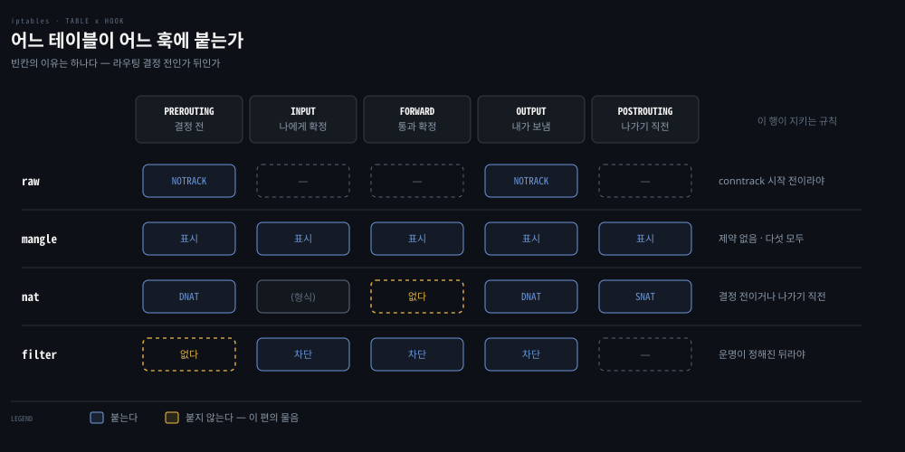

nat 은 주소를 바꿉니다. 주소가 바뀌면 커널이 계산해 둔 경로가 달라지므로, 결정을 내리기 전이거나 이미 내보내기 직전이라야 합니다. FORWARD 는 그 중간입니다. 결정은 끝났고 아직 떠나지는 않은 자리라, 여기서 목적지를 바꾸면 앞서 정해 둔 경로와 어긋납니다. nat 에 FORWARD 가 없는 것이 그래서입니다.

filter 는 반대편에 섭니다. 통과시킬지 말지는 이 패킷의 운명이 정해진 뒤라야 뜻이 섭니다. PREROUTING 은 결정 전이라 나에게 오는 것인지 남에게 가는 것인지 아직 모릅니다. 남은 셋(INPUT·FORWARD·OUTPUT)이 정확히 그 운명 세 가지입니다 — 나에게 온다, 나를 통과한다, 내가 보낸다. filter 가 셋인 이유이고 더 있을 수 없는 이유입니다.


앞의 두 표가 나란히 놓인 사실이라면, 위 도식은 그 사실들이 어떻게 포개지는지를 보인 것입니다. 바깥 링이 체인이고 그 안쪽이 테이블, 가장 안쪽이 규칙입니다. 한 겹 들어갈 때마다 대상이 좁아집니다 — 체인 다섯 중 INPUT 하나를 열었고, 그 안의 테이블 중 Filter 하나를 다시 열었습니다. 진하게 쓴 이름이 다음 겹에서 열어 볼 항목입니다.

가운데 띠에서 흐리게 쓴 Raw 와 Security 는 INPUT 에 없는 테이블입니다. 순서 화살표가 Mangle → NAT → Filter 셋 사이에만 그어진 것은 그래서입니다. 위 존재 표의 빈칸이 도식에서는 화살표의 끊김으로 나타난 셈입니다.

가장 안쪽이 실제로 필터링이 일어나는 자리입니다. 규칙 한 줄은 왼쪽의 매치 조건과 가운데의 타깃으로 갈립니다. 평가는 위에서 아래로 내려가다 처음 걸리는 하나에서 멈춥니다.

색이 갈라지는 것은 그 "멈춤"의 뜻이 다르기 때문입니다. 초록은 이 체인의 평가가 끝나는 것입니다. 파랑은 타깃을 실행하고도 다음 규칙으로 이어집니다. 빨강은 패킷이 거기서 버려지는 것입니다. 이 갈림을 다음 절에서 다시 봅니다.

> 원문 정오: 책의 표 2-5와 일부 표는 FORWARD 체인을 "NAT"로 인쇄했습니다. 같은 장의 표 2-7과 `iptables -L` 출력이 보여 주듯 다섯 체인은 PREROUTING·INPUT·FORWARD·OUTPUT·POSTROUTING입니다.

한 가지 전환 경고도 있습니다. 저자들은 Kubernetes와 nftables 전환 사이에 알려진 문제가 많다며, nftables 기반 iptables를 당분간 피하라고 강하게 권합니다.

이 권고는 2021년 기준이고 지금은 상황이 뒤집혔습니다. 주요 배포판에서 nftables 백엔드는 "일부가 채택하는 중"이 아니라 사실상 기본값입니다. `iptables -V`를 실행하면 `(nf_tables)`가 붙어 나옵니다. 회피가 선택지가 아니게 된 셈이며, 이후 변화는 심화 학습에서 이어 갑니다.

### 값을 바꾸는 테이블이 먼저인 이유

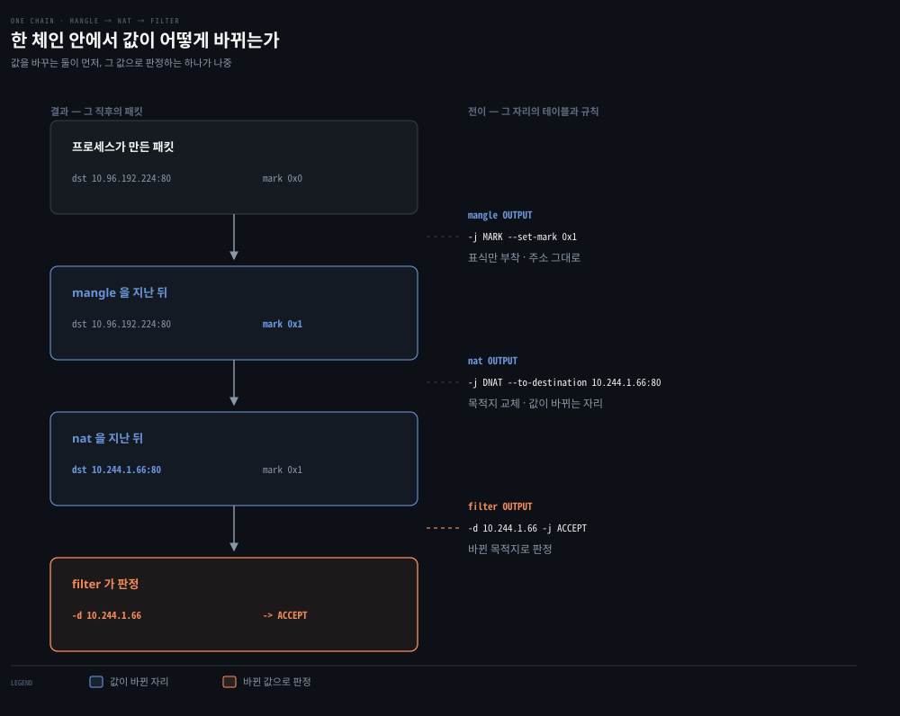

왼쪽이 그 테이블을 지난 직후의 패킷이고 오른쪽이 그 자리에서 평가되는 규칙입니다. 상자마다 색이 붙은 값이 그 칸에서 바뀐 것입니다.

순서를 목록으로 외우면 금방 잊습니다. 값이 어떻게 바뀌는지를 따라가면 그 순서가 필연이라는 것이 보입니다. mangle 은 표식을 붙이고 nat 은 목적지를 갈아치웁니다. 둘 다 패킷을 *바꾸는* 일이고, filter 는 그 결과를 *읽어* 통과 여부만 정합니다.

filter 가 앞에 섰다면 어떻게 될까요. 아직 DNAT 이 일어나지 않았으니 filter 는 ClusterIP 를 보게 됩니다. Pod IP 로 써 둔 허용 규칙은 발화하지 않습니다. 규칙은 맞는데 왜 안 되는지를 찾게 되는 자리입니다. **값을 바꾸는 쪽이 먼저이고 그 값으로 결정하는 쪽이 나중입니다.**

같은 모양을 앞 편에서 이미 봤습니다. DNAT 이 라우팅 결정보다 먼저 일어나야 커널이 새 목적지로 길을 찾을 수 있다는 것도 이 규칙의 다른 얼굴입니다.

도식이 OUTPUT 체인을 고른 데는 이유가 있습니다. 위 표에서 mangle·nat·filter 를 모두 가진 체인은 INPUT 과 OUTPUT 둘뿐입니다.


## 2. 규칙 — 매치와 타깃, 그리고 종결의 미묘함
> ACCEPT는 자기 체인 안에서만 종결입니다. 서브체인에서 통과한 패킷을 부모 체인이 다시 거부할 수 있다는 점이 디버깅에서 자주 발목을 잡습니다.

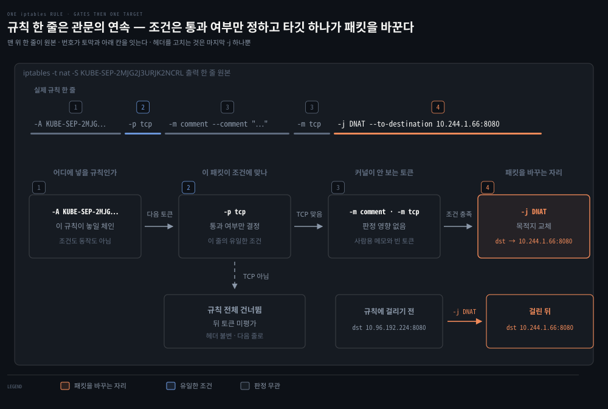

### 풀려는 문제

앞 절이 규칙이 놓이는 자리를 정리했다면, 이제 규칙 한 줄 자체를 읽어야 합니다. 그런데 실물은 `-p tcp -m comment --comment "..." -m tcp -j DNAT --to-destination ...` 처럼 토큰이 길게 이어져 어디까지가 조건이고 어디부터가 동작인지 한눈에 안 들어옵니다.

읽는 법을 모르면 디버깅에서 더 곤란해집니다. 서브체인에서 ACCEPT 에 걸린 것을 확인하고 "통과했다"고 판단했는데 패킷이 여전히 막히는 장면이 대표적입니다. 조건과 타깃을 가르는 규칙과 종결이 어디까지 유효한지를 알아야 이 오독을 피합니다.

커널은 규칙을 토큰 단위로 왼쪽에서 오른쪽으로 훑습니다. 위 그림 맨 위 줄이 `iptables -t nat -S KUBE-SEP-2MJG2J3URJK2NCRL` 이 뱉은 문자열 그대로이고, 그 아래 네 칸이 그것을 네 토막으로 끊어 각 토막이 하는 일을 적은 것입니다. 토막 위의 번호와 칸의 번호가 같은 것끼리 짝입니다.

`-p tcp`는 관문입니다. 패킷을 읽어 통과 여부만 정하고 헤더는 건드리지 않습니다. `-m comment`는 커널이 아예 무시하는 사람용 표식이고, `-m tcp`는 판정 도구를 여는 토큰이라 둘 다 아무 일도 하지 않습니다.

바꾸는 것은 맨 끝 `-j DNAT --to-destination` 하나뿐입니다. 목적지가 `10.96.192.224:8080`에서 `10.244.1.66:8080`으로 이때 바뀝니다. 조건이 몇 개든 패킷을 바꾸는 것은 마지막 `-j` 하나뿐이라는 점이 규칙을 읽는 요령입니다.

도식에서 아래로 갈라지는 점선이 관문에서 떨어졌을 때의 경로입니다. 조건 하나만 어긋나도 뒤의 토큰은 아예 평가되지 않고 규칙 전체가 없었던 것처럼 넘어갑니다. 규칙이 수천 개일 때 이 판정이 패킷마다 반복된다는 점이 뒤에서 다룰 규모 문제의 뿌리입니다.

규칙은 매치 조건과 액션(타깃)의 조합입니다. "포트 22로 가는 패킷이면 버려라"처럼 조건이 맞으면 타깃을 실행하고, 아니면 다음 규칙으로 넘어갑니다. 매치에 쓰는 조건은 다음과 같습니다.

- 출발지 `-s`, 목적지 `-d`
- 프로토콜 `-p`
- 입력·출력 인터페이스 `-i`, `-o`
- Conntrack 상태 `-m state --state NEW,ESTABLISHED` — RELATED·INVALID도 같은 자리에 쓸 수 있습니다

타깃은 조건이 맞았을 때 실행할 동작입니다. 자주 쓰는 것은 다음과 같습니다.

| 타깃 | 테이블 | 동작 |
|------|--------|------|
| ACCEPT | Filter | 패킷을 계속 진행시킴 |
| DROP | Filter | 조용히 폐기 — 외부에서는 패킷이 도착한 적 없는 것처럼 보임 |
| REJECT | Filter | 폐기하고 거부 사유를 회신 |
| DNAT / SNAT | NAT | 목적지 / 출발지 주소 변경 |
| MASQUERADE | NAT | 출발지를 지정 인터페이스의 주소로 변경 — 주소를 미리 몰라도 되는 SNAT |
| (점프) `-j <체인명>` | 전체 | 다른 체인을 실행하고 끝나면 부모 체인 계속 |
| LOG | Filter·Mangle | 커널 로그 기록 |
| MARK | **Mangle 전용** | Netfilter용 정수 마킹 |
| AUDIT | Filter·Mangle | 수락·폐기·거부 기록 |
| RETURN | 전체 | 현재 (서브)체인 처리 중단, 부모 체인은 계속 |

표의 점프 행이 서브체인을 만드는 수단입니다. `-j` 뒤에 빌트인 타깃 대신 체인 이름을 적으면 그 체인으로 넘어가고, 그 체인이 끝나면 원래 자리로 돌아옵니다.

### 종결은 어디까지인가

타깃이 실행되면 그 자리에서 평가가 멈춥니다. 그런데 "멈춘다"가 두 가지 뜻으로 갈립니다. 이 구분을 놓치면 디버깅에서 엉뚱한 곳을 파게 됩니다.

- **패킷의 운명이 정해지는 것** — `DROP`과 `REJECT`는 여기서 끝입니다. 뒤에 어떤 규칙이 남아 있어도 그 패킷은 다시 평가되지 않습니다.
- **이 체인만 끝나는 것** — `ACCEPT`와 `RETURN`은 지금 있는 체인의 평가만 멈춥니다. 그 체인이 서브체인이었다면 부모 체인으로 돌아가 다음 규칙부터 이어서 평가합니다.

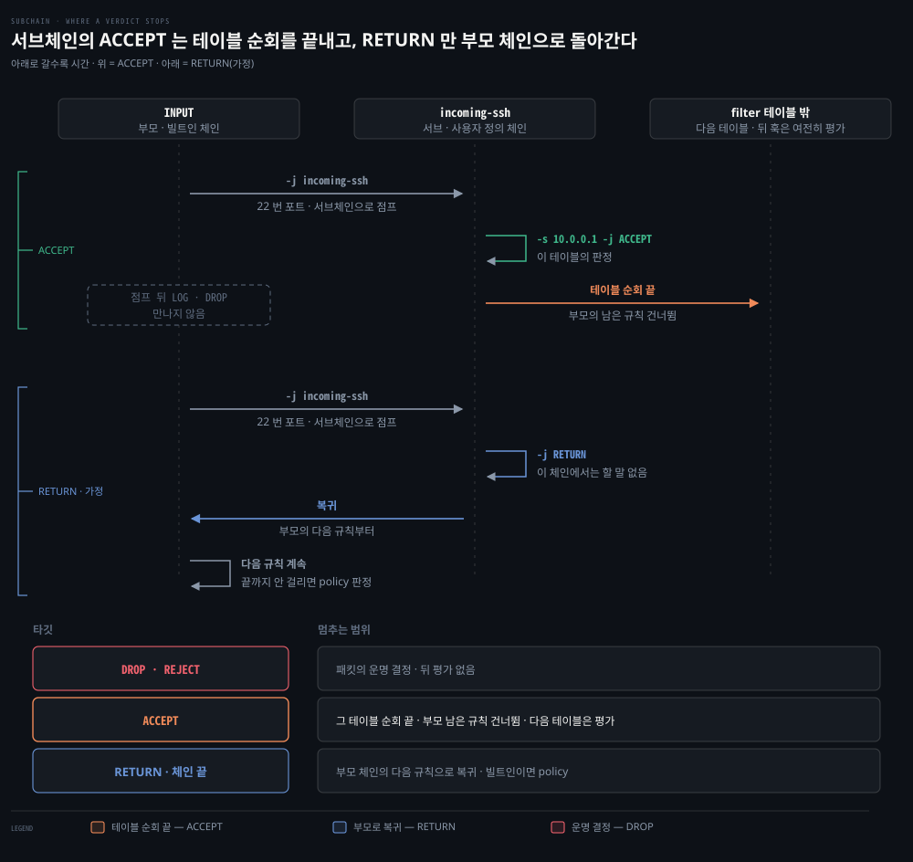

둘째가 발목을 잡는 장면은 이렇습니다. `incoming-ssh` 서브체인에서 `ACCEPT`에 걸린 것을 로그로 확인하고 "여기는 통과했구나" 하며 다른 곳을 뒤졌는데, 정작 패킷을 막은 것은 부모 `INPUT` 체인에 남아 있던 뒤쪽 규칙이었습니다. 서브체인의 `ACCEPT`는 **그 체인이 낸 의견**이지 최종 판정이 아닙니다.

`RETURN`도 같은 자리에 있습니다. 다만 `ACCEPT`가 "이 체인에서는 문제없다"라면 `RETURN`은 "이 체인에서는 할 말이 없다"에 가깝고, 둘 다 부모 체인으로 돌아간다는 결과는 같습니다.

> 원문 정오: 책은 RETURN을 본문에서 종결 타깃으로 분류하고 표 2-9에서는 아니라고 적어 서로 어긋납니다. 위 두 갈래가 동작 기준입니다 — 한 체인에 대해서는 종결이고 패킷 전체에 대해서는 아닙니다.

서브체인의 용도는 규칙을 함수처럼 묶어 재사용하는 것입니다. 조직화가 성능에 직결된다는 점도 함께 봅니다 — iptables는 사실상 모든 패킷에 수십·수백·수천 개의 if 문을 실행하므로 패킷 지연·CPU·처리량에 측정 가능한 영향을 줍니다. 체인을 잘 짜면 중복 검사를 줄일 수 있지만, Pod가 많은 서비스에서의 성능 문제는 구조적이라 IPVS·eBPF 같은 대안이 매력적으로 됩니다.

### 사용자 체인은 세 줄이 다 있어야 산다

"서브체인"이라는 말은 그 체인이 이미 있다고 전제합니다. 그런데 내장 체인과 달리 사용자 체인은 저절로 생기지 않습니다.


내장 체인 다섯은 커널이 이미 갖고 있고 커널이 부릅니다. 사용자 체인에는 세 줄이 필요합니다. 이름을 만드는 선언(`-N`), 그 안에 넣는 규칙(`-A <내 체인>`), 그리고 내장 체인에서 그리로 점프하는 줄(`-A PREROUTING -j <내 체인>`)입니다.

셋 중 마지막이 가장 자주 빠집니다. 선언과 규칙만 있으면 `iptables -S` 에 멀쩡히 보이는데 아무 패킷도 그 체인에 닿지 않습니다. 문법도 맞고 목록에도 있으니 눈으로는 이상을 찾을 수 없습니다. 새 체인을 만들 수는 있어도 새 훅은 만들 수 없다는 것이 이 제약의 뿌리입니다.

`iptables-save` 출력에서는 콜론 줄이 둘을 가릅니다. `:PREROUTING ACCEPT [93:5148]` 처럼 정책이 적혀 있으면 내장이고, `:KUBE-SERVICES - [0:0]` 처럼 그 자리가 `-` 이면 사용자 체인입니다. 정책이 없다는 것은 끝까지 아무것도 안 걸렸을 때 스스로 판정하지 않고 부른 자리로 돌아간다는 뜻이라, 앞에서 본 `RETURN` 의 동작과 같은 말입니다.

```bash
# SSH 방화벽 서브체인 예제 (원문 Example 2-6)
iptables -N incoming-ssh                          # 서브체인 생성
iptables -A incoming-ssh -s 10.0.0.1 -j ACCEPT    # 특정 IP 허용
iptables -A incoming-ssh -s 10.0.0.2 -j ACCEPT
iptables -A incoming-ssh -j LOG --log-level info --log-prefix "ssh-failure"
iptables -A incoming-ssh -j DROP                  # 나머지는 기록 후 폐기
iptables -A INPUT -p tcp --dport 22 -j incoming-ssh
```

### 규칙을 운용할 때 걸리는 것들

책이 경고 상자로 따로 세워 둔 함정이 하나 있습니다. `iptables`와 `ip6tables`는 완전히 분리된 도구라 IPv4 규칙은 IPv6 트래픽에 적용되지 않습니다. 듀얼 스택 환경에서 방화벽 규칙을 IPv4에만 넣고 IPv6를 빠뜨리면 IPv6 경로로 우회하는 트래픽이 무방비로 열립니다. 규칙을 넣을 때는 양쪽을 함께 점검합니다.

규칙에 하나도 걸리지 않은 패킷은 그 체인의 기본 정책(policy)을 따릅니다. 기본값은 ACCEPT이고 `iptables -P INPUT DROP`처럼 바꿉니다. 기본 정책을 DROP으로 두고 허용할 것만 여는 방식이 방화벽의 정석이지만, 원격 접속 중이라면 SSH 허용 규칙을 먼저 넣지 않고 정책부터 바꾸면 자기 연결이 끊깁니다.

iptables 규칙은 재시작하면 사라집니다. `iptables-save`·`iptables-restore`로 보존하며, 방화벽 도구 대부분은 시스템 시작 때마다 자기 규칙을 다시 만드는 방식으로 이를 감춥니다.


## 3. 실전 — MASQUERADE와 Kubernetes식 확률 fan-out
> kube-proxy의 서비스 로드밸런싱은 확률을 매긴 DNAT 규칙의 나열입니다. 부하 피드백이 없고 연결 수명 동안 고정되므로 장수 연결에서 쏠림이 생깁니다.


### 풀려는 문제

앞 두 절이 문법이었다면 이 절은 그 문법으로 쓰인 실물입니다. Kubernetes 를 쓰다 보면 설명이 안 되는 장면을 만납니다. Pod 가 자기 IP 를 갖고 있는데 클러스터 밖 서버의 로그에는 노드 IP 로 찍힙니다. Service 주소 하나로 보낸 요청이 매번 다른 Pod 에 도착하는데, 정작 그 분배를 하는 로드밸런서는 어디에도 없습니다.

둘 다 nat 테이블의 규칙이 하는 일입니다. 출발지를 바꾸는 쪽이 MASQUERADE 이고, 목적지를 확률로 고르는 쪽이 kube-proxy 가 깔아 둔 DNAT 사슬입니다. 실물 규칙을 순서대로 따라가 보면 그 분배가 어떤 성질을 갖는지도 함께 드러납니다.

### MASQUERADE — 출발지를 갈아입히는 SNAT

MASQUERADE는 SNAT의 한 종류입니다. SNAT가 "출발지를 이 주소로 바꿔라"라고 값을 직접 적는 것이라면, **MASQUERADE는 "출발지를 나가는 인터페이스의 주소로 바꿔라"라고 자리를 가리킵니다.** 실제 값은 패킷이 나갈 때 커널이 그 인터페이스에서 읽어 채웁니다.

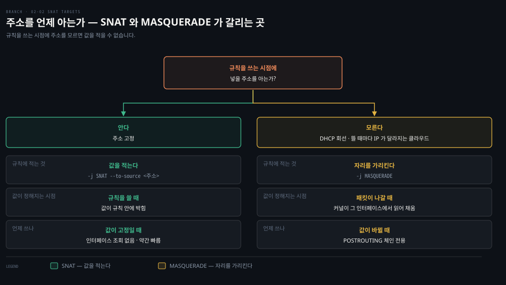

왼쪽이 주소를 아는 경우이고 오른쪽이 모르는 경우입니다. 세 칸을 위에서 아래로 읽으면 규칙에 적는 것, 값이 정해지는 시점, 그래서 언제 쓰는지가 차례로 나옵니다.

주소를 미리 적지 않아도 된다는 점이 이 타깃이 따로 있는 이유입니다. DHCP로 주소를 받는 회선이나 노드가 뜰 때마다 IP가 달라지는 클라우드에서는 규칙을 쓰는 시점에 넣을 값이 없습니다. 반대로 값이 고정이라면 매번 인터페이스를 조회하지 않는 SNAT가 약간 더 빠릅니다.

놓을 수 있는 자리도 하나뿐입니다. 나가는 인터페이스가 정해진 뒤라야 "그 인터페이스의 주소"를 알 수 있으므로 POSTROUTING 체인 전용입니다. 아래가 가장 단순한 형태로, `eth0`으로 나가는 모든 패킷의 출발지를 `eth0`의 주소로 갈아입힙니다.

```bash
iptables -t nat -A POSTROUTING -o eth0 -j MASQUERADE
```

Kubernetes가 이것을 쓰는 이유는 Pod IP가 클러스터 밖에서 통하지 않기 때문입니다. Pod는 `10.244.1.11` 같은 고유 IP를 갖지만 그 대역은 클러스터 안에서만 라우팅됩니다. 그대로 내보내면 응답이 돌아올 길이 없습니다. 출발지를 노드 IP로 갈아입히면 응답은 노드까지 돌아오고, 노드의 conntrack이 그것을 원래 Pod로 되돌립니다. 클러스터 밖 서버의 로그에 Pod IP가 아니라 노드 IP가 찍히는 것이 이 갈아입히기의 흔적입니다.

그런데 kube-proxy가 만드는 MASQUERADE는 위 한 줄처럼 단순하지 않습니다. 갈아입힐지 말지를 정하는 자리와 실제로 주소를 바꾸는 자리가 서로 다른 체인에 떨어져 있습니다. 패킷 하나가 nat 테이블을 지나는 동안 어느 규칙에 걸리고 어느 필드가 바뀌는지를 위 그림이 따라갑니다.

위 그림의 띠 두 개가 그 서로 다른 자리입니다. 위 띠가 라우팅 판단 전의 PREROUTING이고 아래 띠가 나가기 직전의 POSTROUTING입니다. 그 사이에 라우팅 판단이 놓입니다.

띠 안에서 오른쪽 아래로 내려간 계단은 나란한 단계가 아닙니다. `-j`로 한 겹씩 점프해 들어간 깊이입니다. 오른쪽 칸은 그 직후의 패킷 상태이고, 값은 kind 클러스터에서 Pod `10.244.1.11`이 ClusterIP `10.96.192.224:8080`으로 보낸 요청을 `conntrack -E`로 잡아 옮긴 것입니다.

두 체인 사이를 잇는 것이 mark `0x4000`입니다. `KUBE-MARK-MASQ`가 `-j MARK --set-xmark 0x4000/0x4000`으로 표시를 붙입니다. 한참 뒤 `KUBE-POSTROUTING`이 그 표시를 보고 판정합니다. 표시가 없으면 `-j RETURN`으로 그냥 내보냅니다. 표시가 있으면 그것을 지운 뒤 `MASQUERADE --random-fully`를 실행합니다.

표시를 붙일지 말지는 `KUBE-SVC` 체인의 첫 규칙이 정합니다. 조건이 `! -s 10.244.0.0/16`이라 **Pod 대역에서 온 패킷은 여기에 걸리지 않습니다.** 그래서 Pod가 Service를 부를 때는 목적지만 바뀌고 출발지는 그대로 남습니다.

노드에서 같은 ClusterIP를 부르면 결과가 갈립니다. 출발지 `172.21.0.2`는 Pod 대역이 아니므로 조건에 걸려 표시가 붙고, POSTROUTING에서 출발지가 `10.244.1.1:39387`로 재작성됩니다. 포트까지 바뀐 것은 `--random-fully` 때문입니다. 도식 아래 띠에서 노란색으로 갈라진 쪽이 이 경우입니다.

### 확률 fan-out — 백엔드를 고르는 계산

연결 수준 로드밸런싱(정확히는 연결 fan-out)은 DNAT 규칙과 랜덤 선택의 조합입니다. 백엔드가 n개면 i번째 규칙의 확률을 1/(n-i+1)로 줘야 균등해집니다.

확률이 규칙마다 다른 이유는 규칙이 순서대로 평가되기 때문입니다. i번째 규칙에 도달했다는 것은 앞의 규칙에서 전부 안 걸렸다는 뜻입니다. 그 시점에 남은 후보는 n-i+1개입니다. 남은 후보 중 하나를 고르는 조건부 확률이 1/(n-i+1)입니다. 이것을 앞에서부터 곱해 나가면 각 백엔드의 최종 선택 확률이 정확히 1/n로 같아집니다. 백엔드 4개면 0.25 → 0.33 → 0.5 → 무조건이 됩니다. 마지막 규칙에 확률이 없는 것은 거기까지 왔다면 후보가 하나뿐이기 때문입니다. kube-proxy가 서비스마다 만드는 KUBE-SVC 체인이 정확히 이 모양입니다.

```bash
# 백엔드 4개짜리 서비스의 KUBE-SVC 체인 (원문 예시)
Chain KUBE-SVC-I7EAKVFJLYM7WH25 (1 references)
KUBE-SEP-LXP5RGXOX6SCIC6C  ... statistic mode random probability 0.25000000000
KUBE-SEP-XRJTEP3YTXUYFBMK  ... statistic mode random probability 0.33332999982
KUBE-SEP-OMZR4HWUSCJLN33U  ... statistic mode random probability 0.50000000000
KUBE-SEP-EELL7LVIDZU4CPY6  ...
```

출력의 `0.33332999982`가 본문의 `0.33`과 정확히 맞지 않는 것은 계산 오류가 아니라 반올림입니다. 원문도 이 자리에서 "확률 값 하나에 반올림 오차가 보인다"고 짚습니다. 커널이 확률을 부동소수로 환산해 저장하기 때문이며, 실제 분배에는 영향을 주지 않습니다.

엔드포인트가 셋인 서비스의 규칙을 실제로 뽑아 보면 이 계산이 그대로 들어 있습니다.

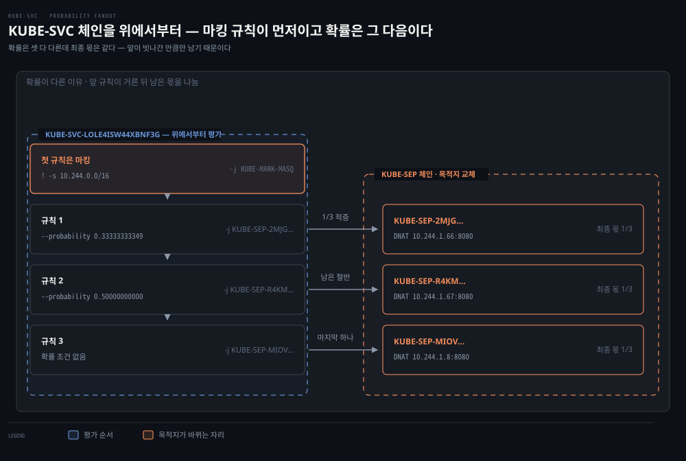

왼쪽 경계가 KUBE-SVC 체인이고 오른쪽이 실제로 목적지를 바꾸는 KUBE-SEP 체인입니다. 확률 규칙보다 앞에 앞 절의 마킹 규칙이 한 줄 놓여 있다는 점을 같이 봅니다. 오른쪽 짝이 없는 첫 행이 그것입니다.

확률 규칙은 그 아래부터입니다. 규칙 1은 1/3로 적중합니다. 거기서 탈락한 2/3가 규칙 2로 내려와 절반씩 갈립니다. 규칙 2의 실제 몫은 2/3 × 1/2 이라 역시 1/3이고, 마지막에 남은 몫도 1/3입니다. 확률 조건이 규칙마다 다른데 최종 결과가 같아지는 것이 이 구조의 요점입니다. 값은 전부 실제 규칙에서 옮긴 것입니다.

### 왜 체인을 둘로 나눴나

확률 규칙과 DNAT 를 한 체인에 몰아 넣으면 안 되는지 물을 수 있습니다. 백엔드마다 두 줄이면 끝날 일로 보입니다.


`statistic` 매치는 그것이 붙은 규칙 한 줄에서만 굴러갑니다. 그런데 뽑힌 뒤에 할 일이 두 줄입니다. 헤어핀을 대비한 표시 한 줄과 목적지를 바꾸는 DNAT 한 줄입니다. 합친 설계라면 같은 확률을 두 줄에 각각 적어야 하고, 그러면 두 번 따로 굴러갑니다. 앞줄이 A 를 뽑고 뒷줄이 B 를 뽑는 순간 A 를 표시하고 B 로 보내는 일이 생깁니다.

한 번의 판정을 여러 동작으로 잇는 방법은 점프뿐입니다. 확률 규칙의 타깃을 엔드포인트 체인으로 두면 뽑힌 뒤의 두 줄은 조건 없이 순서대로 실행됩니다. `KUBE-SEP` 이 따로 있는 것은 정리나 성능을 위해서가 아니라 이 구조가 아니면 안 되기 때문입니다.

### 응답 경로 — conntrack 이 규칙을 대신한다

여기까지가 요청 한 방향입니다. 응답은 같은 길을 거꾸로 오지만 규칙을 다시 평가하지 않습니다. DNAT를 한 순간 커널이 conntrack에 항목을 하나 만들어 두었기 때문입니다.

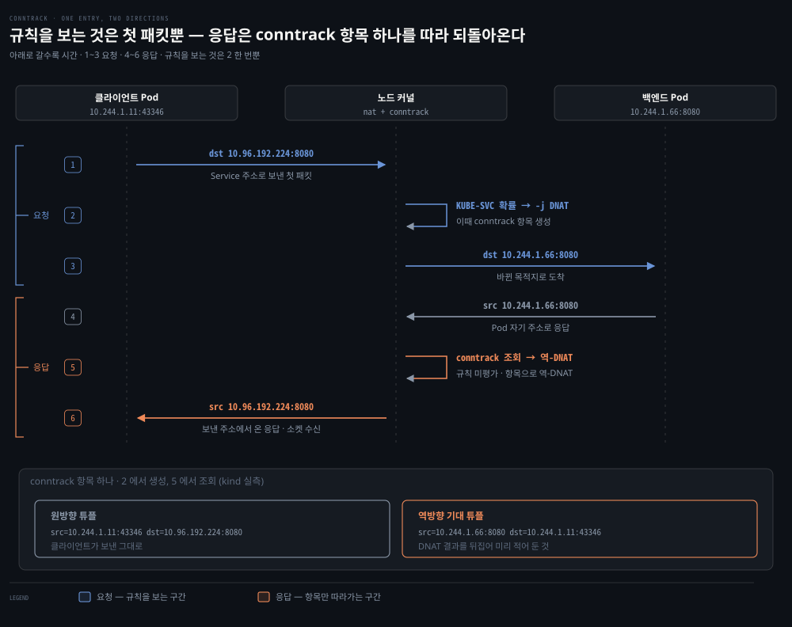

위 그림이 요청과 응답을 한 화면에 놓은 이유가 여기 있습니다. "역방향"이라는 말은 원방향이 있어야 뜻이 서기 때문입니다. 1~3이 요청이고 4~6이 응답이며, 규칙을 평가하는 것은 2 한 번뿐입니다.

아래 띠가 `conntrack -E`로 잡은 실제 항목입니다. 한 항목이 튜플 두 개를 쥐고 있습니다. 원방향은 클라이언트가 보낸 그대로(`dst=10.96.192.224 dport=8080`)이고, 역방향 기대 튜플은 DNAT 결과를 뒤집은 것(`src=10.244.1.66 sport=8080`)입니다.

Pod가 보낸 응답이 이 역방향 튜플과 맞으면 커널이 항목을 찾아 출발지를 `10.96.192.224:8080`으로 되돌립니다. 클라이언트 소켓은 자기가 보낸 주소에서 응답이 온 것으로 보므로 연결이 성립합니다. `KUBE-SVC` 체인의 확률 규칙은 이 과정에서 한 번도 평가되지 않습니다.

규칙을 보는 것은 연결의 첫 패킷뿐이라는 뜻입니다. 다음 문단의 약점이 여기서 나옵니다.

이 방식의 약점은 두 가지입니다. 백엔드 부하에 대한 피드백이 없고, DNAT 결과가 연결의 수명 동안 유지됩니다. 장수 연결이 흔하면 특정 백엔드에 클라이언트가 눌어붙습니다. 원문의 예가 gRPC입니다 — 레플리카 2개로 시작한 gRPC 서비스가 스케일아웃해도, HTTP/2 연결을 재사용하는 기존 클라이언트는 처음의 2개에 계속 붙어 부하가 쏠립니다.

이 쏠림을 어떻게 다룰지는 [04-02 §4](./04-02.CNI%EC%99%80%20kube-proxy%20%E2%80%94%20Pod%20%EB%84%A4%ED%8A%B8%EC%9B%8C%ED%81%AC%EC%9D%98%20%EB%B0%B0%EC%84%A0%EA%B3%B5%EA%B3%BC%20%EB%A1%9C%EB%93%9C%EB%B0%B8%EB%9F%B0%EC%84%9C.md)가 정본입니다. 거기에 세 단으로 따라가는 도식과 kube-proxy 세 모드 비교표가 있습니다. 모드를 바꿔도 왜 안 풀리는지는 그 표의 마지막 행이 보입니다. 이 편은 그 성질이 어디서 나오는지, 곧 DNAT 결과가 conntrack 에 박혀 연결 수명 동안 유지된다는 데까지만 다룹니다.


## 4. IPVS — 로드밸런싱을 위해 태어난 L4
> 리스트 순회의 한계가 수치로 드러나는 절입니다. 규칙 16만 개에 5시간이 걸리는 지점에서 해시 기반 조회와 밸런싱 모드 선택이 대안이 됩니다.

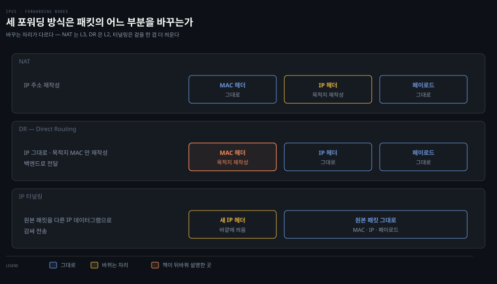

### 풀려는 문제

앞 절의 확률 fan-out 은 서비스가 몇 개일 때는 잘 돕니다. 문제는 규모가 커질 때입니다. 서비스와 Pod 가 늘면 노드마다 쌓이는 규칙이 만 단위가 되고, 그 리스트는 패킷마다 순회되며 규칙 하나를 더할 때도 통째로 교체됩니다. 배포를 눌렀는데 트래픽이 언제 새 Pod 로 넘어갈지 알 수 없는 상태가 됩니다.

이 절은 그 한계를 먼저 수치로 못 박고, 조회 자료구조를 리스트에서 해시로 바꾼 IPVS 가 무엇을 다르게 하는지를 봅니다. 분배 전략이 랜덤 하나뿐이던 자리에 모드 선택이 생기는 것도 여기서부터입니다.

IPVS(IP Virtual Server)는 Linux의 L4 연결 로드밸런서입니다. 랜덤 라우팅 하나뿐인 iptables와 달리 여러 밸런싱 모드를 지원합니다.

아래 여섯 개는 IPVS 전체가 아니라 **kube-proxy 문서가 예시로 드는 것**입니다. "노출하는 여섯 개"라고 읽으면 안 됩니다. `--ipvs-scheduler` 플래그는 받은 문자열을 IPVS 에 그대로 넘기기 때문에 화이트리스트가 없습니다. 가중 라운드로빈(`wrr`)·가중 최소연결(`wlc`)·지역성 기반(`lblc`·`lblcr`)·Maglev 해시(`mh`)도 지정할 수 있습니다.

| 모드 | 코드 | 동작 |
|------|------|------|
| Round-robin | rr | 다음 호스트로 순환 배분 |
| Least connection | lc | 열린 연결이 가장 적은 호스트로 |
| Destination hashing | dh | 목적지 주소 기반 결정적 배분 |
| Source hashing | sh | 출발지 주소 기반 결정적 배분 |
| Shortest expected delay | sed | 연결 수/가중치 비율이 가장 낮은 호스트로 |
| Never queue | nq | 연결 없는 호스트 우선, 없으면 sed |

패킷 포워딩 방식은 세 가지를 지원합니다. 위 그림이 셋을 나란히 놓고 각각 패킷의 어느 부분을 건드리는지 보인 것입니다.

- **NAT**: 주소를 재작성합니다
- **DR**(Direct Routing): IP는 그대로 둔 채 목적지 MAC만 바꿔 백엔드로 넘깁니다
- **IP 터널링**: 원본 패킷을 다른 IP 데이터그램으로 감싸 보냅니다

> 원문 정오: 책은 DR을 "IP 데이터그램 캡슐화", IP 터널링을 "MAC 주소 재작성"으로 설명하는데 둘이 서로 뒤바뀌었습니다. 캡슐화하는 쪽이 IP 터널링이고 MAC만 고쳐 같은 L2 안에서 넘기는 쪽이 DR입니다. 세션 어피니티도 지원하는데 Kubernetes에서는 `Service.spec.sessionAffinity`로 노출됩니다 — 어피니티 시간 창 안의 반복 연결은 같은 호스트로 갑니다.

iptables가 로드밸런서로서 못 버티는 지점을 원문은 수치로 보여 줍니다.

- 노드 수 — 5,000노드 클러스터에서 NodePort 서비스 2,000개 × Pod 10개면 워커 노드마다 최소 20,000개의 iptables 레코드가 생깁니다.
- 갱신 시간 — 서비스 5,000개(규칙 40,000개)에서 규칙 1개 추가에 11분, 서비스 20,000개(규칙 160,000개)면 5시간이 걸립니다.
- 지연 — 패킷마다 규칙 리스트를 매칭될 때까지 순회해야 하고, 거대한 리스트에 규칙을 넣고 빼는 것 자체가 무거운 연산입니다.

`ipvsadm`으로 직접 만들 수도 있습니다. `-A`로 가상 서비스를 추가하고 `-a`로 백엔드를 붙입니다.

```bash
# least-connection 가상 서비스를 만들고 백엔드 둘을 같은 가중치로 붙입니다
ipvsadm -A -t 1.1.1.1:80 -s lc
ipvsadm -a -t 1.1.1.1:80 -r 2.2.2.2 -m -w 100
ipvsadm -a -t 1.1.1.1:80 -r 3.3.3.3 -m -w 100
```


## 5. eBPF(extended Berkeley Packet Filter) — 커널 안에서 직접 실행되는 프로그램
> eBPF는 커널과 유저스페이스를 오가지 않고 커널 안에서 패킷을 직접 처리합니다. Cilium이 kube-proxy 자체를 대체할 수 있는 근거가 이 구조 차이입니다.

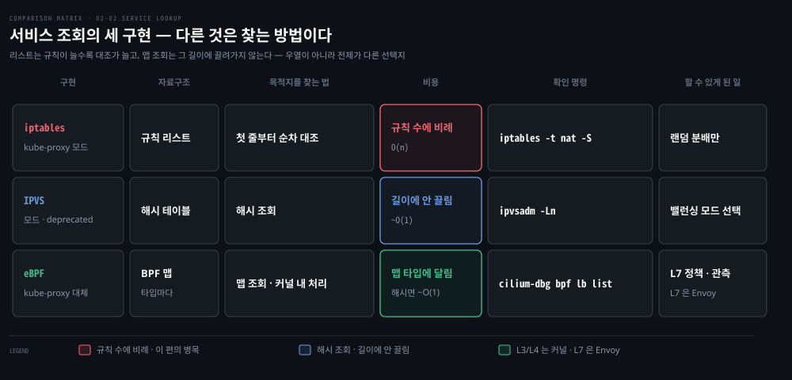

### 풀려는 문제

**IPVS 로 조회 비용은 해결됩니다. 그런데도 남는 것이 있습니다. 규칙을 만들고 고치는 주체는 여전히 유저스페이스의 kube-proxy 이고, 판단할 수 있는 것은 주소와 포트까지입니다.** <u>"이 경로로 오는 요청만" 같은 조건은 L4 규칙으로 표현되지 않습니다.</u>

그래서 질문이 바뀝니다 — 규칙을 커널에 *넣는* 대신 프로그램을 커널 안에서 *돌리면* 어떤가. 그것이 eBPF 이고, Cilium 이 kube-proxy 를 대체할 수 있다고 말하는 근거가 이 구조 차이입니다.

**eBPF는 샌드박스된 특수 프로그램을 커널 안에서 실행하는 시스템입니다.** Netfilter·iptables처럼 커널과 유저스페이스를 오가지 않는다는 점이 구조적 차이입니다.

전신인 BPF(Berkeley Packet Filter)는 패킷 필터링용이었고 tcpdump가 대표 사용처입니다. tcpdump에 필터를 지정하면 그것이 BPF 프로그램으로 컴파일되어 커널이 그 필터로 패킷을 거릅니다. 결과는 맵으로 tcpdump에 전달됩니다. 맵은 BPF 프로그램이 데이터를 교환하는 키-값 자료구조입니다.


위 레인이 유저스페이스이고 아래가 커널입니다. **경계를 넘는 곳이 둘뿐이라는 것이 이 그림의 요점입니다.** 로드할 때 `bpf()` 시스템콜로 제어가 한 번 내려가고, 그 뒤로는 맵을 통해 데이터만 올라옵니다. 붙은 프로그램은 이벤트마다 커널 안에서만 돕니다. Netfilter 와 iptables 가 패킷마다 경계를 오가는 것과 갈리는 자리입니다.

주황으로 표시한 2 번이 관문입니다. 여기서 걸리면 프로그램은 아예 붙지 못하고 로드가 실패합니다. 아래 두 띠는 그 관문이 무엇을 보는지와 4 번에서 붙을 수 있는 자리를 미리 펼쳐 둔 것이고, 각각 다음 소절과 그 뒤에서 다룹니다.

### verifier — "샌드박스"가 실제로 뜻하는 것

위 문단의 "샌드박스된"을 그냥 지나치면 eBPF가 왜 쓸 만한지가 안 잡힙니다. 프로그램을 로드하면 커널의 **verifier**가 그것을 통째로 정적 검사합니다. 돌려 보고 판단하는 것이 아니라, 실행하기 전에 가능한 경로를 미리 훑어 다음을 확인합니다.[^verifier]

- 끝나는 것이 보장되는가 — 초기 eBPF는 제어 흐름 그래프에서 반복을 찾아 통째로 거부했고, 지금은 상한이 증명되는 유계 루프만 받습니다
- 메모리 접근이 허용 범위 안인가 — 스택·맵·패킷 버퍼의 경계와 정렬을 검사하고 그 밖을 건드리면 거부합니다
- 쓰지도 않은 자리를 읽지 않는가 — 한 번도 쓴 적 없는 레지스터나 스택 칸은 읽을 수 없습니다
- 부르는 것이 커널이 허용한 helper 함수인가 — 프로그램 종류마다 부를 수 있는 함수 목록이 따로 정해져 있습니다

**그래서 이것이 무슨 문제를 풀어 주는가**가 핵심입니다. verifier는 성능을 주지 않습니다. 성능은 커널과 유저스페이스를 오가지 않는 것과 해시 조회에서 나옵니다. verifier가 푸는 것은 **신뢰 문제**입니다.

커널 안에서 코드를 돌리는 방법은 원래 커널 모듈뿐이었고, 모듈은 버그 하나가 시스템 전체를 내립니다. 무한 루프면 그 CPU가 멈추고 잘못된 포인터면 커널 패닉입니다. 그래서 새 커널 코드를 프로덕션 노드에 넣는 일은 사람의 리뷰와 신뢰에 기댄 큰 결심이었습니다.

verifier는 그 결심을 기계 검사로 바꿉니다. 검사를 통과한 프로그램은 커널을 멈추거나 죽이지 못한다는 것이 로드 시점에 보장되므로, 커널을 다시 빌드하지도 재부팅하지도 않고 실행 중인 커널에 기능을 넣을 수 있습니다. Cilium이 노드마다 커널 모듈을 배포하는 대신 프로그램을 붙이는 것으로 kube-proxy를 대체할 수 있는 것이 이 보장 덕입니다.

대가는 표현력입니다. 검사를 통과하려면 프로그램이 제약을 받아들여야 합니다 — 무한 루프 금지, 스택 크기 상한, 임의 커널 함수 호출 금지. eBPF로 못 쓰는 프로그램이 있는 것은 언어가 약해서가 아니라 **검사를 통과할 수 있는 것만 쓰게 되어 있기 때문**입니다.

**eBPF 프로그램은 syscall에 직접 접근해 감시·차단할 수 있고, 소켓 필터 외에도 붙을 자리가 많습니다**.

- kprobes — 커널 내부 동적 추적
- uprobes — 유저스페이스 추적
- tracepoints — 커널 정적 추적, kprobes보다 버전 간 안정적
- perf_events — 시간 샘플링
- XDP — 드라이버 수준에서 패킷에 직접 작용하는 전용 프로그램

Kubernetes에서 eBPF를 쓰는 이유를 원문은 네 갈래로 정리합니다.

1. **성능** — 해시 테이블 조회 대 iptables 리스트 순회. 서비스가 늘수록 순회할 규칙 리스트가 커지고, 증분 갱신이 없어 규칙 하나를 더해도 전체 리스트를 교체해야 합니다(서비스 20,000개 = 규칙 160,000개 = 5시간의 근원).
2. **추적** — cgroup-bpf(Linux 4.10+)로 Pod·컨테이너 수준 네트워크 통계를 모을 수 있습니다.
3. **감사** — kubectl exec 세션에서 실행된 명령을 기록하는 프로그램을 붙일 수 있습니다.
4. **보안** — seccomp 필터를 eBPF로 작성할 수 있고, Falco 같은 컨테이너 런타임 보안 도구가 eBPF를 씁니다.

가장 흔한 사용처는 Cilium입니다. **Cilium은 CNI이자 서비스 구현체로, 서비스 IP를 Pod로 매핑하는 iptables 규칙을 쓰는 kube-proxy를 대체합니다.** eBPF로 모든 패킷을 커널 안에서 직접 가로채 라우팅하므로 더 빠르고, L7 로드밸런싱까지 가능합니다.

> 💬 **비유**: 세 기술의 차이는 공항 보안 검색의 진화와 비슷합니다. iptables는 검색 요원이 규정집을 첫 장부터 한 장씩 넘기며 대조하는 방식입니다 — 규정이 16만 줄이면 승객마다 그만큼 오래 걸립니다. 
>
> IPVS는 로드밸런싱 전담 창구를 따로 두고 배분 전략(순환·최소 대기줄)을 고르는 방식입니다. eBPF는 검색대 자체에 프로그램을 심어 규정집 조회를 해시 색인 한 번으로 끝내는 방식입니다.

세 세대가 무엇을 바꿨는지는 결국 "어떻게 찾는가"로 요약됩니다.

위 그림 왼쪽이 세대와 그 세대가 쓰는 자료구조이고, 오른쪽이 목적지를 찾는 방법과 그 비용입니다. 각 세대를 눈으로 확인하는 명령도 함께 적었습니다 — `iptables -t nat -S`, `ipvsadm -Ln`, `cilium-dbg bpf lb list` 순입니다.

리스트는 규칙이 늘수록 대조 횟수가 함께 늘지만 해시는 규칙 수와 무관합니다. 앞 절의 16만 규칙 5시간이 여기서 나옵니다.

세대가 넘어갈 때마다 할 수 있는 일도 늘었습니다. iptables 단계에서는 분배 전략이 랜덤 하나뿐이었습니다. IPVS에서 밸런싱 모드 선택이 생겼고, eBPF에 와서야 L7 정책과 관측까지 들어왔습니다.


## 심화 학습
> 책 밖에서 보강한 내용입니다. 출처를 함께 남깁니다.

- 책(2021)의 "nftables 기반 iptables를 피하라"는 권고는 이후 상황이 바뀌었습니다. Kubernetes 1.29부터 kube-proxy에 nftables 모드가 알파로 들어와 1.33에서 GA가 됐고, iptables 모드의 성능 한계를 정면으로 겨눈 구현입니다. [Kubernetes 블로그 — nftables mode for kube-proxy](https://kubernetes.io/blog/2025/02/28/nftables-kube-proxy/)가 배경과 벤치마크를 정리합니다. 책의 경고는 "nftables 백엔드로 구동되는 iptables 호환 계층"에 대한 것이었고, 이것은 kube-proxy가 nftables를 직접 말하는 별개 구현이라는 점을 구분해야 합니다.
- kube-proxy IPVS 모드의 공식 설명과 요구 사항(커널 모듈 등)은 [kube-proxy 레퍼런스](https://kubernetes.io/docs/reference/command-line-tools-reference/kube-proxy/)와 [Kubernetes 블로그 — IPVS-Based In-Cluster Load Balancing Deep Dive](https://kubernetes.io/blog/2018/07/09/ipvs-based-in-cluster-load-balancing-deep-dive/)에 있습니다. 원문 수치(160,000 룰 5시간)도 이 계열 벤치마크에서 나왔습니다.
- Cilium의 kube-proxy 대체 구성은 [Cilium 공식 문서 — Kubernetes without kube-proxy](https://docs.cilium.io/en/stable/network/kubernetes/kubeproxy-free/)에서 실제로 따라 해 볼 수 있습니다. BPF 로드밸런싱 표를 직접 들여다보는 명령은 [`cilium-dbg bpf lb list`](https://docs.cilium.io/en/stable/cmdref/cilium-dbg_bpf_lb_list/)입니다. Cilium 1.16에서 디버그 명령이 `cilium-dbg`로 분리되면서 이름이 바뀌었으므로, 옛 자료의 `cilium bpf lb list`를 그대로 치면 동작하지 않습니다.
- 본문 §3의 mark `0x4000`은 책에 없는 내용이라 kind 클러스터(v1.35.0)에서 직접 뽑아 확인했습니다. 비트 위치는 `--iptables-masquerade-bit`으로 바꿉니다. 실행 중인 바이너리에 `kube-proxy --help`를 걸면 "the bit of the fwmark space to mark packets requiring SNAT with (default 14)"로 나오고, `1 << 14`이 곧 `0x4000`입니다. 플래그 목록은 [kube-proxy 레퍼런스](https://kubernetes.io/docs/reference/command-line-tools-reference/kube-proxy/)에 정리돼 있습니다.


## 결정 치트시트
> 서비스 프록시 기술 선택은 규모와 요구 기능으로 가릅니다.

| 상황 | 선택 | 이유 |
|------|------|------|
| 서비스·엔드포인트 수가 적고 표준 구성 | iptables 모드 | 어디서나 동작하는 기본값, 이해·디버깅 자료가 가장 많음 |
| 서비스 수천 개 이상, 규칙 갱신이 느려짐 | IPVS 모드 | 해시 기반 조회 + 다양한 밸런싱 모드 |
| L7 정책·관측·최고 성능까지 필요 | eBPF (Cilium) | kube-proxy 대체, 커널 내 직접 라우팅, L7 로드밸런싱 |
| 장수 연결(gRPC)의 부하 쏠림 | 프록시 모드 교체로는 부족 | 연결 단위 분배라는 성질이 IPVS 도 같기 때문. 무엇으로 접근할지는 [04-02 §4](./04-02.CNI%EC%99%80%20kube-proxy%20%E2%80%94%20Pod%20%EB%84%A4%ED%8A%B8%EC%9B%8C%ED%81%AC%EC%9D%98%20%EB%B0%B0%EC%84%A0%EA%B3%B5%EA%B3%BC%20%EB%A1%9C%EB%93%9C%EB%B0%B8%EB%9F%B0%EC%84%9C.md) |


## 면접에서 받을 만한 질문

> 먼저 스스로 답을 소리 내어 말해 본 뒤, 아래 §정답 섹션을 펼쳐 맞춰 봅니다.

1. iptables를 한 문장으로 정의하면? 테이블·체인·규칙 3계층은 각각 무엇을 정합니까?
2. iptables 실행 순서는? DNAT는 왜 특정 체인에서만 가능합니까?
3. 서브체인에서 ACCEPT된 패킷이 결국 거부될 수 있는 이유는?
4. DROP과 REJECT는 어떻게 다르고 언제 무엇을 씁니까?
5. kube-proxy IPVS 모드가 있는데 왜 Cilium 같은 eBPF 구현이 또 필요합니까?
6. eBPF의 verifier는 무엇을 검사하고, 그 검사가 있어서 무엇이 가능해집니까?

### 빈칸 채우기 — iptables 3계층과 순서

iptables의 3계층에서 기능을 정하는 것은 `(1)____`, 평가 시점을 정하는 것은 `(2)____`, 조건과 타깃을 담는 것은 `(3)____`입니다. 실행은 체인 먼저, 그 안에서 `(4)____`→Mangle→NAT→Filter 순서로 평가합니다.


## 정답 (자답 후 펼치기)

> 위 §면접에서 받을 만한 질문의 5개에 *먼저 자답한 뒤* 아래를 읽으세요. 자답 없이 먼저 읽으면 학습 효과가 0입니다.

### 정답 1 — iptables 정의와 3계층

iptables는 Netfilter 훅 위에서 테이블·체인·규칙의 3계층으로 패킷을 필터링·변형하는 도구이고, kube-proxy의 기본 서비스 구현이 이것으로 만들어집니다. 테이블은 기능(Filter/NAT/Mangle/Raw/Security), 체인은 평가 시점(Netfilter 훅 5개에 대응), 규칙은 매치 조건과 타깃의 조합을 정합니다.

### 정답 2 — 실행 순서와 DNAT

실행은 체인 먼저, 그 안에서 Raw→Mangle→NAT→Filter입니다. DNAT는 목적지를 바꾸는 변환이라 라우팅 결정 *전*에 끝나야 하므로 PREROUTING·OUTPUT에서만 가능합니다. 라우팅 이후에 목적지를 바꾸면 이미 정해진 경로와 어긋납니다.

### 정답 3 — 서브체인 ACCEPT

ACCEPT는 자기 체인 안에서만 종결이기 때문입니다. 서브체인이 끝나면 부모 체인이 평가를 재개하고, 부모 체인의 뒤 규칙(예: 포트 80 REJECT)이 그 패킷을 잡을 수 있습니다. 전체 종결은 built-in 체인의 policy나 DROP까지 가야 확정됩니다.

### 정답 4 — DROP vs REJECT

DROP은 조용히 버려 상대에게 패킷이 도착한 적 없는 것처럼 보이고, REJECT는 거부 사유를 회신합니다. 외부 공격 표면에는 정보를 주지 않는 DROP을, 내부 서비스 간에는 빠른 실패를 돕는 REJECT를 쓰는 경우가 많습니다.

### 정답 5 — IPVS가 있는데 왜 eBPF

IPVS는 L4 밸런싱의 규모 문제를 풀지만 여전히 Netfilter 경로와 kube-proxy 아키텍처 안에 있습니다. eBPF 구현(Cilium)은 커널 안에서 패킷을 직접 처리해 경로 자체를 줄이고, L7 인지 정책·관측까지 한 계층에서 제공합니다.

### 정답 6 — verifier가 푸는 것

verifier는 로드 시점에 프로그램을 통째로 정적 검사합니다. 끝나는 것이 보장되는지, 메모리 접근이 경계 안인지, 쓰지 않은 자리를 읽지 않는지, 허용된 helper 함수만 부르는지를 봅니다. 이 검사가 푸는 것은 성능이 아니라 **신뢰**입니다. 커널을 죽이지 못한다는 보장이 로드 시점에 서므로, 커널을 다시 빌드하거나 재부팅하지 않고 실행 중인 커널에 기능을 넣을 수 있습니다. 대가는 표현력이고, 무한 루프나 임의 커널 함수 호출은 포기해야 합니다.

### 정답 빈칸 — (1)`테이블` (2)`체인` (3)`규칙` (4)`Raw`

테이블이 기능, 체인이 평가 시점, 규칙이 조건+타깃이고, 한 체인 안에서는 Raw→Mangle→NAT→Filter 순으로 평가합니다.


## 핵심 개념 체크리스트
> 열 항목을 막힘없이 답할 수 있으면 다음 편으로 넘어가도 좋습니다.
- [ ] 테이블 5종의 책임과 체인 5종의 발화 시점을 짝지을 수 있는가?
- [ ] iptables 체인 이름과 Netfilter 훅 이름이 같은 자리를 가리킨다는 것을 `INPUT`·`NF_IP_LOCAL_IN`으로 말할 수 있는가?
- [ ] "체인 먼저, 테이블은 그 안에서"의 실행 순서를 인바운드 패킷 예로 말할 수 있는가?
- [ ] MASQUERADE와 SNAT의 차이(주소를 미리 아는가)를 설명할 수 있는가?
- [ ] KUBE-SVC 체인의 확률값(0.25→0.33→0.5→무조건)이 왜 그렇게 계산되는지 아는가?
- [ ] iptables 규모 한계의 수치 근거(20,000 서비스 = 160,000 룰 = 5시간)를 들 수 있는가?
- [ ] MASQUERADE가 mark 0x4000을 매개로 두 체인에 걸쳐 일어나는 이유를 말할 수 있는가?
- [ ] 응답 패킷이 KUBE-SVC 규칙을 다시 평가하지 않는 이유를 conntrack으로 설명할 수 있는가?
- [ ] eBPF의 attach point 중 XDP가 다른 것들과 어떻게 다른지 아는가?
- [ ] verifier가 검사하는 것과, 그 검사가 성능이 아니라 신뢰를 푼다는 점을 말할 수 있는가?


## 참고 자료
- 《Networking and Kubernetes: A Layered Approach》(James Strong·Vallery Lancey, O'Reilly, 2021, ISBN 978-1492081654) Ch2
- [Netfilter/iptables 공식 문서](https://www.netfilter.org/documentation/)
- [eBPF 공식 사이트](https://ebpf.io/)
- [Cilium — Kubernetes without kube-proxy](https://docs.cilium.io/en/stable/network/kubernetes/kubeproxy-free/)
- 이전 편: [02-01. 커널이 패킷을 다루는 법](./02-01.%EC%BB%A4%EB%84%90%EC%9D%B4%20%ED%8C%A8%ED%82%B7%EC%9D%84%20%EB%8B%A4%EB%A3%A8%EB%8A%94%20%EB%B2%95%20%E2%80%94%20%EC%86%8C%EC%BC%93%C2%B7Netfilter%C2%B7Conntrack%C2%B7%EB%9D%BC%EC%9A%B0%ED%8C%85.md)
- 다음 편: [02-03. Linux 네트워크 진단 도구](./02-03.Linux%20%EB%84%A4%ED%8A%B8%EC%9B%8C%ED%81%AC%20%EC%A7%84%EB%8B%A8%20%EB%8F%84%EA%B5%AC%20%E2%80%94%20%EA%B3%84%EC%B8%B5%20%EC%88%9C%EC%84%9C%EB%8C%80%EB%A1%9C%20%EC%88%98%EC%82%AC%ED%95%98%EA%B8%B0.md)


## 각주
> 본문이 한 줄로 지나간 판정 기준의 출처를 여기 둡니다.

[^verifier]: 검사 항목의 정본은 커널 문서 [eBPF verifier](https://docs.kernel.org/bpf/verifier.html) 입니다. 문서가 명시하는 것은 넷입니다. 반복을 찾는 제어 흐름 그래프 검사와 도달 불가 명령 검출, load/store 에 쓸 수 있는 레지스터 종류와 그 경계·정렬 검사, "한 번도 쓰지 않은 레지스터는 읽을 수 없다", 프로그램 종류마다 따로 정해지는 helper 함수 목록입니다. 명령 수 상한과 스택 크기의 구체적 값은 커널 버전과 권한에 따라 달라져 본문에 숫자로 적지 않았습니다.
