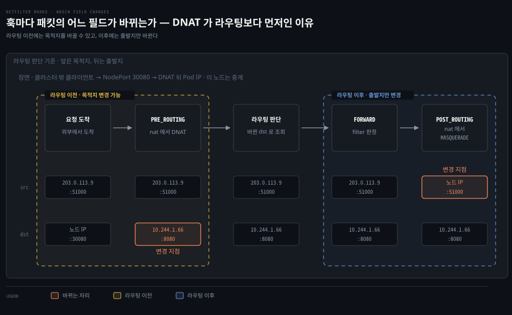
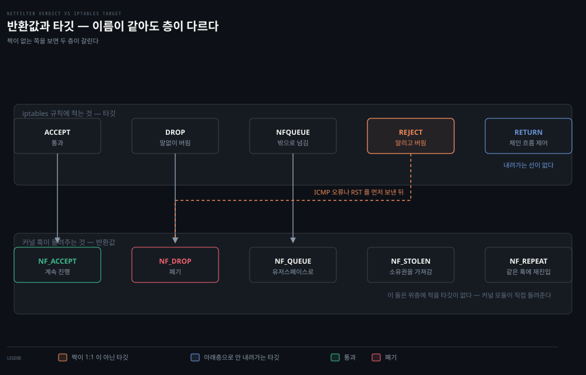
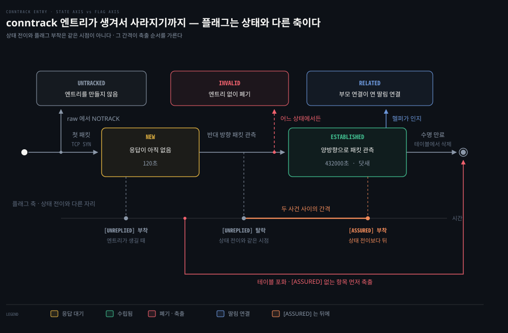
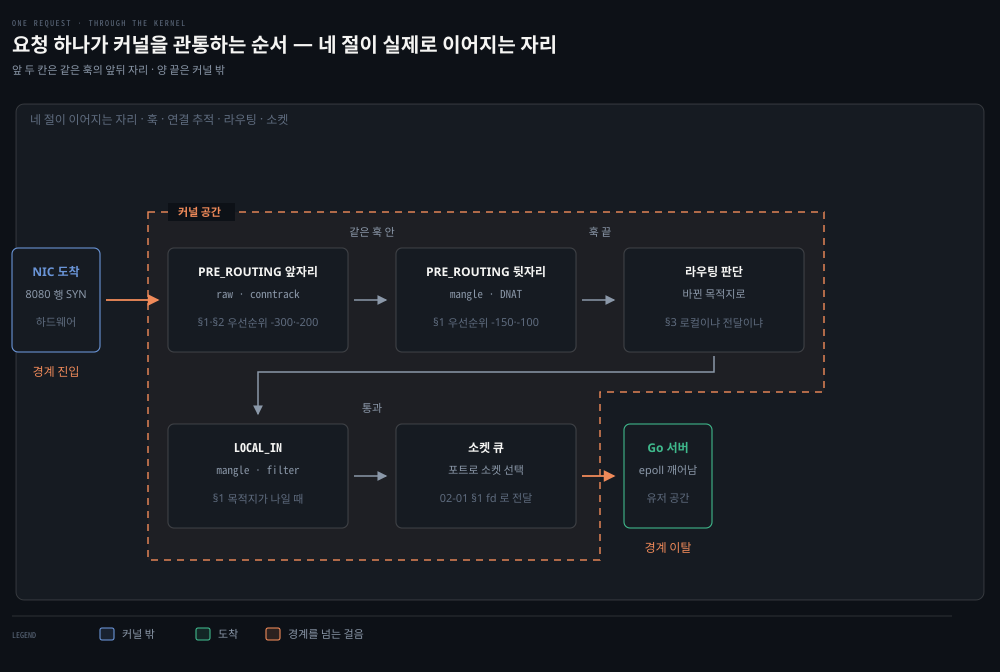

# 커널이 패킷을 판정하는 층 — Netfilter·Conntrack·라우팅

---

## 핵심 요약
> 이 편 전체가 매달린 하나의 생각은 "패킷이 커널을 지나는 길목마다 훅이 걸려 있고, 연결 추적과 라우팅이 그 패킷의 다음을 정한다"입니다.

패킷이 커널을 지나는 길목마다 Netfilter 훅이 걸려 있습니다. Conntrack이 연결 상태를 추적하고 라우팅 테이블이 다음 행선지를 정합니다. Kubernetes의 방화벽·NAT·서비스 로드밸런싱이 전부 이 세 층 위에 서 있습니다. 애플리케이션이 소켓으로 커널에 닿는 자리와 네임스페이스를 잇는 배선은 [02-01](./02-01.%EC%BB%A4%EB%84%90%EC%9D%B4%20%ED%8C%A8%ED%82%B7%EC%9D%84%20%EC%A3%BC%EA%B3%A0%EB%B0%9B%EB%8A%94%20%EC%9E%90%EB%A6%AC%20%E2%80%94%20%EC%86%8C%EC%BC%93%C2%B7%EC%9D%B8%ED%84%B0%ED%8E%98%EC%9D%B4%EC%8A%A4%C2%B7veth%C2%B7%EB%B8%8C%EB%A6%AC%EC%A7%80.md)이 다룹니다.


## 학습 목표
> 커널이 패킷을 판정하는 자리를 훅·연결 추적·라우팅 세 층으로 나눠, 각 층이 무엇을 결정하는지 짚을 수 있는 상태를 목표로 합니다.

이 내용을 읽고 나면:

1. 라우팅 판단이 "이 네임스페이스에서 로컬로 받을지 다른 곳으로 넘길지"를 가른다는 것을 설명할 수 있습니다.
2. Netfilter 훅 5개가 패킷의 출발지·목적지에 따라 어떤 순서로 발화하는지 추적할 수 있습니다.
3. Conntrack의 5-tuple flow와 상태 4종을 방화벽·NAT 동작과 연결할 수 있습니다.
4. 조건이 바뀌었을 때(목적지가 DNAT로 바뀌었을 때, 백엔드가 같은 노드일 때) 경로가 어떻게 달라지는지 예측할 수 있습니다.

아래는 커널이 패킷을 다루는 자리를 주제별로 배치한 지도입니다. 점선 안이 이 편이 다루는 훅·연결 추적·라우팅이고, 그 위 소켓과 배선은 02-01 이 다룹니다. 아래쪽 NIC 는 커널 밖입니다. 각 칸에 적힌 번호가 본문에서 그것을 다루는 곳입니다.


## 1. Netfilter — 커널 속 다섯 개의 검문소
> 패킷이 지나는 훅 조합은 출발지와 목적지가 이 호스트인지 두 질문으로 정해집니다. iptables 체인 5개가 이 훅 5개에 그대로 대응합니다.



### 풀려는 문제

방화벽 규칙("22번은 사내에서만")이나 NAT("서비스 주소를 백엔드로")를 걸고 싶다고 합시다. 그 규칙을 검사하는 코드는 패킷이 커널을 지나는 길 **어딘가**에 끼어들어야 합니다. 문제는 그 길이 하나가 아니라는 점입니다. 나에게 들어오는 패킷, 내가 내보내는 패킷, 나를 거쳐 남에게 가는 중계 패킷이 서로 다른 길을 탑니다.

그래서 "들어오는 것만 막고 싶다", "중계되는 것만 걸러야 한다" 같은 요구를 만족시키려면 검사 지점이 **여러 군데** 필요합니다. 그 지점들이 어디이고 각각 어떤 패킷이 지나는지가 이 절입니다. Netfilter 가 그 지점들을 미리 마련해 둔 프레임워크입니다.

### 먼저 — 라우팅 판단이 무엇을 가르는가

훅 이름을 외우기 전에 그 사이에 끼어 있는 판단 하나를 알아야 합니다. 패킷이 들어오면 커널은 "이 패킷을 이 네임스페이스에서 로컬로 받을 것인가, 다른 곳으로 넘길 것인가"를 정합니다. 이것이 라우팅 판단이고, 뒤에 나오는 INPUT 과 FORWARD 의 갈림이 전적으로 이 판단의 결과입니다.

판단 기준은 목적지 주소입니다. 목적지가 이 네임스페이스에 붙은 주소 중 하나면 로컬로 올립니다. 아니면 라우팅 테이블을 보고 다음 홉으로 넘깁니다. 경로를 고르는 자세한 규칙은 §3 이 맡고, 여기서는 "로컬이냐 전달이냐를 가른다"는 역할만 쥐고 갑니다.

이 편에서 **호스트**와 **로컬**은 같은 것을 가리킵니다. 지금 이 패킷을 처리하는 네트워크 네임스페이스입니다. [02-01 §3](./02-01.%EC%BB%A4%EB%84%90%EC%9D%B4%20%ED%8C%A8%ED%82%B7%EC%9D%84%20%EC%A3%BC%EA%B3%A0%EB%B0%9B%EB%8A%94%20%EC%9E%90%EB%A6%AC%20%E2%80%94%20%EC%86%8C%EC%BC%93%C2%B7%EC%9D%B8%ED%84%B0%ED%8E%98%EC%9D%B4%EC%8A%A4%C2%B7veth%C2%B7%EB%B8%8C%EB%A6%AC%EC%A7%80.md) 에서 본 것처럼 노드와 Pod 는 서로 다른 네임스페이스를 갖기 때문에, 같은 패킷이라도 노드 네임스페이스에서는 "전달"이고 Pod 네임스페이스에서는 "로컬"일 수 있습니다. 아래에서 호스트라고 하면 특별히 밝히지 않는 한 노드의 기본 네임스페이스를 뜻합니다.

### 훅 다섯과 그것을 정하는 두 질문

Netfilter는 Linux 2.3 개발 커널에서 만들어져 2.4부터 정식 포함된 패킷 처리 프레임워크입니다(2.3 은 개발 브랜치입니다). 핵심은 커널 훅입니다 — 프로그램이 특정 훅에 등록하면, 커널이 해당하는 패킷마다 그 프로그램을 호출합니다. 프로그램은 패킷을 버리라고 지시하거나 수정된 패킷을 돌려줄 수 있어서, 유저스페이스 프로그램이 커널 대신 패킷을 다룰 수 있게 됩니다. Netfilter는 iptables와 함께 설계됐는데, 커널 코드와 유저스페이스 코드를 분리하려는 목적이었습니다.

훅은 다섯 개이고 각각 iptables 체인 이름과 1:1로 대응됩니다. 다만 이 대응은 **이름의 대응이지 개수의 대응이 아닙니다.** 모든 iptables 테이블이 체인 다섯 개를 다 갖지는 않습니다. 어느 테이블이 어느 훅에 붙는지는 [02-03 §1](./02-03.iptables%C2%B7IPVS%C2%B7eBPF%20%E2%80%94%20kube-proxy%EB%A5%BC%20%EC%9D%B4%ED%95%B4%ED%95%98%EB%8A%94%20%EC%84%B8%20%EA%B8%B0%EC%88%A0.md)의 존재 표가 다룹니다.

이 편에서 raw 테이블이 필요한 자리는 §2 의 추적 제외(`NOTRACK`) 하나입니다. raw 는 Conntrack **이전**에 발화하는 유일한 테이블이라, "추적을 시작하지 말라"고 말할 수 있는 곳이 여기밖에 없습니다.

| Netfilter 훅 | iptables 체인 | 발화 시점 |
|--------------|--------------|----------|
| NF_IP_PRE_ROUTING | PREROUTING | 외부 시스템에서 패킷이 도착했을 때 |
| NF_IP_LOCAL_IN | INPUT | 패킷의 목적지 IP가 이 머신일 때 |
| NF_IP_FORWARD | FORWARD | 출발지도 목적지도 이 머신이 아닐 때 (남 대신 라우팅해 주는 패킷) |
| NF_IP_LOCAL_OUT | OUTPUT | 이 머신에서 만들어진 패킷이 나갈 때 |
| NF_IP_POST_ROUTING | POSTROUTING | 출처와 무관하게 패킷이 머신을 떠날 때 |

> 원문 정오: 책의 표 2-1·2-5는 NF_IP_FORWARD의 체인을 "NAT"로 인쇄했지만 같은 장 표 2-7과 `iptables -L` 예시는 FORWARD입니다. Netfilter 훅 이름(NF_IP_FORWARD) 그대로 FORWARD가 맞습니다.

어떤 패킷이 어느 훅을 지나는지는 두 가지 질문으로 정해집니다 — 출발지가 이 호스트인가, 목적지가 이 호스트인가.

### 사례 A — 주소를 바꾸지 않는 가장 단순한 길

가장 단순한 경우부터 봅니다. 밖에서 온 요청이 이 호스트에서 도는 서버로 바로 가는 경우입니다. 클라이언트가 `노드 IP:8080` 으로 보내고, 그 포트에서 [02-01 §1](./02-01.%EC%BB%A4%EB%84%90%EC%9D%B4%20%ED%8C%A8%ED%82%B7%EC%9D%84%20%EC%A3%BC%EA%B3%A0%EB%B0%9B%EB%8A%94%20%EC%9E%90%EB%A6%AC%20%E2%80%94%20%EC%86%8C%EC%BC%93%C2%B7%EC%9D%B8%ED%84%B0%ED%8E%98%EC%9D%B4%EC%8A%A4%C2%B7veth%C2%B7%EB%B8%8C%EB%A6%AC%EC%A7%80.md) 의 Go 서버가 듣고 있습니다. 주소를 바꾸는 규칙은 하나도 걸려 있지 않습니다.

패킷이 PRE_ROUTING 을 지나면 라우팅 판단이 목적지를 봅니다. 목적지가 이 호스트의 주소이므로 로컬로 받기로 정해집니다. 그래서 LOCAL_IN 을 지나 소켓 큐로 올라갑니다. 02-01 §1 에서 본 대로 `epoll_wait` 에서 자던 서버가 깨어납니다. FORWARD 는 지나지 않습니다.

```bash
# 사례 A — NAT 없음. 목적지가 바뀌지 않으므로 라우팅 판단이 "로컬" 을 고른다
클라이언트 → 노드 IP:8080 → PRE_ROUTING → [라우팅 판단: 목적지가 나] → LOCAL_IN → 소켓
```

여기까지가 훅의 최소 동작입니다. 주소가 그대로이므로 라우팅 판단도 헷갈릴 것이 없습니다.

### 사례 B — 목적지가 바뀌면 경로가 달라진다

이제 조건을 하나 바꿉니다. 목적지 주소를 도중에 바꾸면 무엇이 달라지는지 보는 것이 이 사례입니다. 사례 A 와는 다른 조건이므로 둘을 섞어 읽지 않습니다.

주소를 바꾸는 장치의 이름을 먼저 둡니다. **NAT(Network Address Translation)** 는 패킷의 주소를 바꿔치기하는 일이고 방향이 둘입니다.

- **DNAT** — 목적지 주소를 바꿉니다. 서비스 주소로 온 패킷을 실제 백엔드로 돌릴 때 씁니다.
- **SNAT** — 출발지 주소를 바꿉니다. 사설망의 여러 호스트가 공인 IP 하나로 나갈 때 씁니다.
- **MASQUERADE** — SNAT 중에서 바꿀 주소를 미리 적지 않고 나가는 인터페이스에 붙은 주소로 알아서 바꾸는 형태입니다. 주소가 고정되지 않은 환경에서 쓰며, 아래 사례 B 와 Kubernetes 노드가 이것을 씁니다.

이 셋이 Conntrack 과 어떻게 얽히는지는 §2 가 이어받습니다.

장면은 클러스터 밖 클라이언트가 노드의 NodePort 30080 으로 보내는 경우입니다. 이 사례가 성립하는 조건을 먼저 적습니다.

| 조건 | 이 사례의 값 |
|---|---|
| 클러스터 | kind (예제 주소는 그 기본 대역에서 뽑았습니다) |
| kube-proxy 모드 | iptables |
| 백엔드 Pod 위치 | **요청을 받은 노드가 아닌 다른 노드** |
| `externalTrafficPolicy` | `Cluster` (기본값) |

이 조건은 2026-09-20 에 kind 2노드 클러스터로 직접 확인했습니다. 아래 경로와 §2 의 conntrack 값은 그 실측에서 뜬 것입니다.

PRE_ROUTING 에서 DNAT 가 걸려 목적지가 `노드 IP:30080` 에서 Pod 주소 `10.244.1.66:8080` 으로 바뀝니다. 라우팅 판단은 바뀐 뒤의 주소로 경로를 찾습니다. 목적지가 더 이상 이 노드의 주소가 아니므로 로컬로 받을 수 없고, 다른 노드로 넘겨야 합니다. 그래서 이 패킷은 INPUT 이 아니라 FORWARD 로 갑니다.

```bash
# 사례 B — DNAT 로 목적지가 바뀐다. 라우팅 판단이 "전달" 을 고른다
클라이언트 → 노드 IP:30080 → PRE_ROUTING(DNAT: → 10.244.1.66:8080)
           → [라우팅 판단: 목적지가 내가 아님] → FORWARD → POST_ROUTING → 다른 노드
```

DNAT 가 라우팅 판단보다 뒤에 있었다면 이미 정해진 경로로 엉뚱한 곳에 갔을 것입니다. 순서가 이렇게 정해진 이유가 이 한 장면에 드러납니다.

조건이 바뀌면 무엇이 달라지는지 갈라 둡니다. 헷갈리기 쉬운 것은 백엔드 Pod 가 *같은 노드* 에 있을 때인데, 이때도 FORWARD 입니다. 같은 랩에서 노드를 바꿔 가며 훅 카운터를 재 봤고 두 경우 모두 FORWARD 만 올라갔습니다.

기준이 Pod 의 물리적 위치가 아니라 DNAT 뒤의 목적지 주소가 이 네임스페이스의 것인가이기 때문입니다. Pod 는 02-01 §3 에서 본 대로 별도 네임스페이스를 가지므로, 같은 노드에 있어도 목적지는 노드 IP 가 아니라 `10.244.1.66` 입니다. 노드 네임스페이스에서 보면 자기 주소가 아니니 전달입니다. veth 를 건너 Pod 네임스페이스에 도착한 뒤 그쪽에서 로컬이 됩니다.

달라지는 것은 나가는 쪽입니다. 다른 노드로 넘길 때는 노드 밖으로 나가므로 POST_ROUTING 에서 MASQUERADE 가 걸립니다. 같은 노드의 Pod 로 갈 때는 노드를 떠나지 않아 출발지를 위장할 이유가 적습니다.

`externalTrafficPolicy=Local` 이면 다른 노드의 Pod 가 후보에서 빠집니다. 애초에 같은 노드로만 가고 출발지를 보존하려고 MASQUERADE 도 걸지 않습니다.

같은 서비스에서 이 값만 바꿔 Pod 가 보는 클라이언트 주소를 확인하면 차이가 그대로 드러납니다. `Local` 에서는 요청을 보낸 노드 주소가 그대로 보이고, `Cluster` 에서는 노드의 브리지 주소로 바뀌어 보입니다.

여기 적은 경로는 위 표의 조건에서 성립하는 것이고, 모든 CNI·서비스 설정의 공통 동작이 아닙니다.

| 출발지 | 목적지 | 훅 순서 |
|--------|--------|--------|
| 로컬 머신 | 로컬 머신 | LOCAL_OUT → POST_ROUTING → (재진입) PRE_ROUTING → LOCAL_IN |
| 로컬 머신 | 외부 머신 | LOCAL_OUT → POST_ROUTING |
| 외부 머신 | 로컬 머신 | PRE_ROUTING → LOCAL_IN |
| 외부 머신 | 외부 머신 | PRE_ROUTING → FORWARD → POST_ROUTING |

> 원문 정오: 책의 표 2-2 는 첫 행을 `LOCAL_OUT → LOCAL_IN` 두 훅으로 인쇄했습니다. 같은 장 본문이 재진입을 설명하므로 표 쪽이 축약이고, 위 표에는 실제로 발화하는 네 훅을 적었습니다. 이 편의 치트시트와 정답도 네 훅 기준으로 맞춰져 있습니다.

두 질문이 만드는 네 갈래를 한 장으로 편 것이 아래 그림입니다. 절 첫머리의 그림이 네 조합 중 "외부→외부" 하나만 따라간 것과 달리, 여기서는 훅 다섯 개가 모두 나오고 어느 갈래가 무엇을 건너뛰는지가 함께 보입니다.


`LOCAL_`이 붙은 두 훅만 주소 한쪽이 고정됩니다. LOCAL_IN은 목적지가, LOCAL_OUT은 출발지가 이 호스트이고 나머지 셋에는 그런 제약이 없습니다. 헷갈리기 쉬운 자리는 `LOCAL`의 뜻입니다. 이것은 *누가 만들었는가*가 아니라 **이 호스트가 종점인가 기점인가**를 가리키므로, 남이 보낸 패킷이라도 목적지가 나이면 LOCAL_IN입니다. 둘이 한 경로에 같이 나타나는 것은 자기 자신에게 보내는 경우뿐이고, 그때만 훅을 넷 지납니다.

> 💬 **비유**: Netfilter 훅은 공항의 검문소입니다. 입국(PREROUTING)·입국 심사(INPUT)·환승(FORWARD)·출국 수속(OUTPUT)·탑승구(POSTROUTING) 중 어디를 지날지는 승객(패킷)의 출발지·목적지가 정합니다. 국내선 환승객이 입국 심사를 건너뛰듯, 남을 대신 라우팅하는 패킷은 INPUT을 지나지 않습니다.

여기까지가 §1 의 기본 경로입니다. 훅이 어디에 있는지, 무엇이 INPUT 과 FORWARD 를 가르는지, NAT 가 왜 라우팅보다 앞에 있어야 하는지까지 왔습니다. 처음 읽는다면 아래 네 소절을 건너뛰고 [§2 Conntrack](#2-conntrack--패킷을-연결로-묶는-눈) 으로 가도 이어집니다.

아래 네 소절은 규칙 목록을 아무리 뒤져도 원인이 안 나오는 차단, iptables 에 적는 이름과 커널이 받는 값의 층 차이, 한 훅에 여럿이 등록될 때의 순서, 그리고 iptables 밖에서 같은 훅을 쓰는 것들을 다룹니다. 실제로 그런 증상을 만났을 때 돌아오면 됩니다.

### 심화 1 · Martian 검사와 rp_filter — iptables 에 안 보이는 차단

자기 자신에게 보내는 패킷은 LOCAL_OUT과 POST_ROUTING을 지나 인터페이스를 "떠났다가" 재진입해, 외부 패킷처럼 PRE_ROUTING과 LOCAL_IN을 다시 지납니다. 이 재진입 구조와 얽힌 위협이 **Martian packet**, 곧 출발지 주소가 "불가능한" 패킷입니다. 외부에서 왔는데 출발지가 `127.0.0.1`인 패킷이 그 예이고, Linux는 인터페이스에 존재할 수 없는 출발지의 패킷을 기본적으로 걸러 냅니다.

이름이 이어져 나와 하나로 읽히기 쉽지만 **Martian 검사와 reverse path filter는 별개**입니다.


규칙을 아무리 뒤져도 원인이 안 나오는 종류의 차단은 위 그림 아래쪽 레인에서 나옵니다. 두 검사가 각각 무엇을 보는지는 다음 표가 가릅니다.

| 장치 | 무엇을 보는가 | 스위치 |
|------|-------------|--------|
| Martian 검사 | 주소 자체가 그 인터페이스에 있을 수 없는가 (`127.0.0.0/8`이 `eth0`으로 들어옴) | 기본 동작 · 로그는 `log_martians` |
| reverse path filter | 출발지로 라우팅을 거꾸로 조회해 되돌아갈 경로가 들어온 인터페이스와 맞는가 | `net.ipv4.conf.<인터페이스>.rp_filter` |

rp_filter가 받는 값은 셋이고, 둘은 RFC 3704 가 정의한 이름을 그대로 씁니다.

| 값 | 판정 | 커널 문서의 이름 |
|---:|------|----------------|
| `0` | 검사하지 않음 | No source validation |
| `1` | 되돌아가는 **최적** 경로가 들어온 인터페이스와 맞아야 통과 | RFC3704 Strict Reverse Path |
| `2` | 아무 인터페이스로든 출발지에 닿을 수만 있으면 통과 | RFC3704 Loose Reverse Path |

**기본값은 0 입니다.** 다만 커널 문서 자신이 "일부 배포판은 시작 스크립트에서 켠다"고 덧붙입니다. 켠 기억이 없는데 켜져 있는 것이 이상한 상태가 아닙니다.

"거꾸로 조회한다"가 패킷을 되돌려 보내 본다는 뜻으로 읽히기 쉽습니다. 커널은 아무것도 내보내지 않습니다. 이미 갖고 있는 라우팅 테이블을 한 번 더 볼 뿐입니다. 평소에는 목적지 주소를 넣어 조회하던 그 테이블에 이번에는 출발지 주소를 넣습니다. 길을 실제로 재 보는 `traceroute` 와는 다른 일입니다.

인터페이스가 둘인 노드에서 판정을 따라가 보겠습니다.

```bash
# ip route — 대역 둘이 인터페이스 하나씩에 걸려 있고 기본 경로는 eth0 쪽입니다
default via 10.0.1.254 dev eth0
10.0.1.0/24 dev eth0 proto kernel scope link src 10.0.1.1
10.0.2.0/24 dev eth1 proto kernel scope link src 10.0.2.1
```

여기에 출발지가 `10.0.1.50` 인 패킷이 `eth1` 로 들어옵니다. 커널은 그 출발지로 테이블을 조회합니다. `10.0.1.0/24` 가 `eth0` 에 걸려 있으니 되돌아갈 경로는 `eth0` 입니다. 들어온 곳과 나갈 곳이 어긋나므로 값이 `1` 이면 이 패킷은 여기서 사라집니다. 값이 `2` 면 어느 인터페이스로든 닿기는 하니 통과합니다.

커널이 어느 쪽을 고르는지는 같은 조회를 손으로 해 보면 드러납니다.

```bash
# ip route get 10.0.1.50 — eth1 로 들어온 패킷이라면 어긋납니다
10.0.1.50 dev eth0 src 10.0.1.1 uid 0

# ip route get 10.0.2.50 — eth1 로 들어온 패킷이라면 맞습니다
10.0.2.50 dev eth1 src 10.0.2.1 uid 0
```

`dev` 뒤에 적힌 인터페이스가 판정의 전부입니다. 이것이 패킷이 들어온 인터페이스와 같으면 통과하고 다르면 버립니다. 그 사이에 `iptables` 규칙은 한 줄도 개입하지 않습니다.

값이 어디에 적히는지부터 갈라 둬야 합니다. `/proc/sys/net/ipv4/conf/` 를 열면 인터페이스 이름 말고 두 가지가 더 있습니다.

```bash
# ls /proc/sys/net/ipv4/conf/ — eth0·eth1 은 인터페이스이고 앞의 둘은 아닙니다
all  default  eth0  eth1  lo
```

`eth0` 처럼 이름이 붙은 디렉토리는 그 인터페이스 하나의 설정입니다. `all` 은 모든 인터페이스에 함께 걸리는 손잡이라, 커널 문서가 "is special, changes the settings for all interfaces" 라고 적습니다.[^ip-sysctl] `default` 는 앞으로 생길 인터페이스가 물려받을 초기값입니다.

`default` 는 이미 있는 인터페이스를 건드리지 않습니다. 값을 바꾼 뒤에 만들어진 것부터 달라집니다.

```bash
# default 를 1 로 올린 직후 세 파일을 읽은 값입니다 (커널 7.0.14)
conf/default/rp_filter  1
conf/eth0/rp_filter     0    # 이미 있던 인터페이스는 그대로입니다
conf/eth2/rp_filter     1    # 그 뒤에 만든 것만 물려받습니다
```

Pod 가 뜰 때마다 veth 가 새로 생기는 환경에서 이 차이가 드러납니다. `default` 를 고쳐 두면 그 뒤에 뜨는 Pod 의 인터페이스부터 반영됩니다. 이미 떠 있던 Pod 는 옛 값을 그대로 씁니다.

여기서 끄려다 못 끄는 자리가 하나 나옵니다. **인터페이스에 실제로 적용되는 값은 `conf/all` 과 `conf/<인터페이스>` 중 큰 쪽입니다.**

> "The max value from conf/{all,interface}/rp_filter is used when doing source validation on the {interface}."[^ip-sysctl]

그래서 `conf/eth0/rp_filter` 를 0으로 내려도 `conf/all/rp_filter` 가 1이면 eth0 은 여전히 엄격 모드로 돕니다. 한쪽만 보고 껐다고 판단하면 어긋납니다. 비대칭 라우팅을 쓰는 노드에서 통신이 한 방향만 되는 증상이 이 조합에서 자주 나옵니다.

읽어서 확인할 때도 파일 하나로는 모자랍니다. `all` 에 쓴 값이 인터페이스 파일로 내려 적히지는 않기 때문입니다.

```bash
# all 을 1 로 올린 뒤 두 파일을 읽은 값입니다 (커널 7.0.14)
conf/all/rp_filter   1
conf/eth0/rp_filter  0    # 파일은 0 인데 eth0 은 엄격 모드로 돕니다
```

`conf/eth0/rp_filter` 만 읽고 이 인터페이스는 꺼져 있다고 판단하면 틀립니다. 두 파일을 같이 읽고 큰 쪽을 취해야 그 인터페이스가 실제로 도는 모드가 나옵니다.

걸러낸 패킷을 로그로 보려면 `log_martians` 를 켜는데, **이 스위치는 결합 규칙이 다릅니다.** `conf/{all,interface}` 중 하나라도 켜져 있으면 켜집니다. rp_filter 는 최댓값, log_martians 는 OR 입니다. 반대로 이 필터링을 끄면, "localhost발 트래픽은 더 신뢰할 만하다"고 가정하는 서비스가 있는 호스트에서 큰 위험이 됩니다.

짝이 되는 스위치가 하나 더 있습니다. `route_localnet` 을 켜면 커널이 라우팅할 때 loopback 주소를 **출발지로든 목적지로든** martian 으로 보지 않습니다. 기본값은 꺼짐입니다. kube-proxy가 이 값을 켜서 생긴 것이 CVE-2020-8558이고, 경위는 [02-01 심화 학습](./02-01.%EC%BB%A4%EB%84%90%EC%9D%B4%20%ED%8C%A8%ED%82%B7%EC%9D%84%20%EC%A3%BC%EA%B3%A0%EB%B0%9B%EB%8A%94%20%EC%9E%90%EB%A6%AC%20%E2%80%94%20%EC%86%8C%EC%BC%93%C2%B7%EC%9D%B8%ED%84%B0%ED%8E%98%EC%9D%B4%EC%8A%A4%C2%B7veth%C2%B7%EB%B8%8C%EB%A6%AC%EC%A7%80.md#심화-학습)에서 다룹니다.

### 심화 2 · 반환값과 타깃 — 층이 둘이다

훅에 등록된 프로그램은 반환값으로 패킷의 운명을 정합니다. 여기서 층을 하나 갈라 둬야 합니다. 아래 표는 **커널이 받는 반환값**이고, 우리가 `iptables`에 적는 `ACCEPT`·`DROP`은 **타깃**입니다.

이름이 겹쳐 같아 보이지만 같은 층이 아닙니다. 타깃 쪽에는 반환값에 짝이 없는 것도 있어서, `RETURN`은 체인을 빠져나오라는 흐름 제어이고 `REJECT`는 동작 여러 개를 묶은 것입니다.



짝이 어긋나는 두 자리를 그림이 가릅니다. `RETURN` 은 커널에 갈 반환값 자체가 없습니다. 체인을 어디까지 읽을지를 정하는 iptables 안쪽의 흐름 제어라 Netfilter 까지 내려가지 않습니다. `REJECT` 는 반대로 반환값 하나에 대응하지 않습니다. 거절을 알리는 패킷을 만들어 보낸 **뒤에** 버리는 두 동작이라, 커널이 받는 것은 결국 `NF_DROP` 입니다.

| 반환값 | 뜻 | 쓰이는 자리 |
|--------|-----|-----------|
| `NF_ACCEPT` | 처리를 계속 진행 | `-j ACCEPT` |
| `NF_DROP` | 더 처리하지 않고 폐기 | `-j DROP`. 상위 비트에 errno를 실을 수 있어(`NF_DROP_ERR`), 로컬에서 나간 패킷이면 소켓에 오류로 돌아간다 |
| `NF_QUEUE` | 유저스페이스 프로그램에 넘김 | `-j NFQUEUE`. 상위 비트가 큐 번호(`NF_QUEUE_NR`)라 큐를 여럿 둘 수 있다 |
| `NF_STOLEN` | 이후 훅을 실행하지 않고 소유권을 가져감 | 커널 안에서 패킷을 붙잡아 두고 나중에 따로 처리할 때. 부른 쪽은 그 패킷을 더 건드리지 않는다 |
| `NF_REPEAT` | 그 훅에 재진입시켜 다시 처리 | 첫 통과에서 패킷을 바꿔 놓고, 바뀐 값으로 다시 판정해야 할 때 |

`-j DROP`과 `-j REJECT`가 갈리는 곳도 여기입니다. DROP은 아무 말 없이 사라져 보낸 쪽이 타임아웃까지 기다리고, REJECT는 ICMP 오류나 TCP RST를 먼저 보낸 뒤 버려서 즉시 실패합니다.

위 값들은 이 환경의 커널 헤더(`/usr/include/linux/netfilter.h`, 커널 7.0.14)에서 확인한 것입니다.

한 가지는 책이 쓰인 뒤에 바뀌었습니다. 요즘 배포판의 `iptables` 명령은 legacy 백엔드가 아니라 nftables 백엔드로 동작합니다. `iptables -V`가 `(nf_tables)`로 답하는 것이 그 표시입니다. 다만 훅 다섯 개는 Netfilter 프레임워크 자체의 것이라 백엔드가 바뀌어도 그대로입니다. nftables의 base chain도 같은 훅에 등록되고, 달라진 것은 규칙을 표현하고 저장하는 방식뿐입니다.

### 심화 3 · 한 훅에 여럿이 등록된다 — 순서는 우선순위 숫자가 정한다

앞에서 프로그램이 훅에 등록하면 커널이 그것을 호출한다고 했습니다. 그런데 한 훅에 등록하는 프로그램이 하나뿐이라는 보장은 없습니다. iptables 의 테이블들부터가 각자 따로 등록된 별개의 콜백입니다.

여럿이 등록되면 순서가 필요합니다. 그 순서를 정하는 것이 우선순위 정수입니다. netfilter 프로젝트 위키는 "Within a given hook, Netfilter performs operations in order of increasing numerical priority" 라고 적습니다.[^nfprio] 숫자가 작을수록 먼저 불립니다.

값은 커널 헤더에 상수로 박혀 있습니다. 아래는 이 환경의 `/usr/include/linux/netfilter_ipv4.h` 에서 `enum nf_ip_hook_priorities` 를 그대로 뽑은 것입니다.

| 우선순위 | 상수 | 그 자리에 등록되는 것 |
|---:|---|---|
| -400 | `NF_IP_PRI_CONNTRACK_DEFRAG` | 조각난 패킷 재조립 |
| -300 | `NF_IP_PRI_RAW` | raw 테이블 |
| -200 | `NF_IP_PRI_CONNTRACK` | 연결 추적 |
| -150 | `NF_IP_PRI_MANGLE` | mangle 테이블 |
| -100 | `NF_IP_PRI_NAT_DST` | nat 테이블의 DNAT |
| 0 | `NF_IP_PRI_FILTER` | filter 테이블 |
| 50 | `NF_IP_PRI_SECURITY` | security 테이블 |
| 100 | `NF_IP_PRI_NAT_SRC` | nat 테이블의 SNAT |
| 300 | `NF_IP_PRI_CONNTRACK_HELPER` | 프로토콜 헬퍼 |

이 표가 다음 편의 테이블 순서를 설명합니다. [02-03 §1](./02-03.iptables%C2%B7IPVS%C2%B7eBPF%20%E2%80%94%20kube-proxy%EB%A5%BC%20%EC%9D%B4%ED%95%B4%ED%95%98%EB%8A%94%20%EC%84%B8%20%EA%B8%B0%EC%88%A0.md) 은 한 체인 안에서 Raw → Mangle → NAT → Filter 순으로 평가된다고 말합니다. 그것은 iptables 가 따로 정한 규칙이 아닙니다. 네 테이블이 -300 · -150 · -100 · 0 이라는 서로 다른 숫자로 같은 훅에 등록돼 있고, 커널이 숫자 순으로 부르는 것뿐입니다.

raw 가 Conntrack 이전인 것도 관례가 아니라 숫자 차이입니다. raw 는 -300 이고 연결 추적은 -200 입니다. 100 만큼 앞서 있으므로 raw 에서 `NOTRACK` 을 걸면 추적이 시작되기 전에 말할 수 있습니다. §2 의 추적 제외가 raw 에서만 되는 이유가 이것입니다.

연결 추적이 한 자리가 아니라는 점도 표에 드러납니다. 재조립이 -400 이고 본체가 -200 이며 헬퍼가 300 입니다. 확정 단계인 `NF_IP_PRI_CONNTRACK_CONFIRM` 은 정수 최댓값이라 맨 마지막입니다. 기능 하나가 훅 여러 지점에 나뉘어 등록돼 있습니다.

### 심화 4 · iptables 말고 이 프레임워크를 쓰는 것들

Netfilter 는 iptables 전용 장치가 아닙니다. 같은 훅 위에 올라타는 것이 더 있습니다.

**nftables** 는 같은 훅에 base chain 을 등록하는 다른 프론트엔드입니다. 위 표의 자리마다 nftables 키워드(`raw`·`mangle`·`dstnat`·`filter`·`security`·`srcnat`)가 있고 숫자는 iptables 테이블과 같습니다.

**유저스페이스 프로그램**은 `NF_QUEUE` 로 넘어온 패킷을 직접 판정합니다. 그 통로를 여는 라이브러리가 libnetfilter_queue 입니다. 공식 설명은 "a userspace library providing an API to packets that have been queued by the kernel packet filter" 입니다.[^nfqueue] 넘겨받은 프로그램은 판정을 돌려주거나 고친 패킷을 커널에 다시 넣을 수 있습니다. 커널 규칙으로 표현하기 어려운 판정을 밖에서 내리는 길입니다.

**ingress 훅**은 위 다섯 개 목록 밖입니다. Linux 4.2 에서 추가됐고, 다른 훅과 달리 특정 네트워크 인터페이스에 붙습니다.[^nfprio] prerouting 보다도 먼저 걸리므로 아주 이른 필터링에 씁니다. 이 절이 훅을 다섯 개라고 한 것은 iptables 가 쓰는 고전 IPv4 훅을 말한 것입니다. 프레임워크 전체는 그보다 큽니다.

나머지 둘은 다음 편이 맡습니다. IPVS 도 이 훅 위에 올라탄 L4 로드밸런서이고([02-03 §4](./02-03.iptables%C2%B7IPVS%C2%B7eBPF%20%E2%80%94%20kube-proxy%EB%A5%BC%20%EC%9D%B4%ED%95%B4%ED%95%98%EB%8A%94%20%EC%84%B8%20%EA%B8%B0%EC%88%A0.md)), eBPF 만 훅을 거치지 않아 이 계보 밖입니다([02-03 §5](./02-03.iptables%C2%B7IPVS%C2%B7eBPF%20%E2%80%94%20kube-proxy%EB%A5%BC%20%EC%9D%B4%ED%95%B4%ED%95%98%EB%8A%94%20%EC%84%B8%20%EA%B8%B0%EC%88%A0.md)).


## 2. Conntrack — 패킷을 연결로 묶는 눈
> 방화벽의 방향성과 NAT는 둘 다 **Conntrack** 위에 섭니다. 패킷을 연결로 묶어 봐야 "이건 응답인가 새 시도인가"를 가릴 수 있기 때문입니다.



### 풀려는 문제

**Conntrack은 머신을 오가는 연결의 상태를 추적하는 Netfilter 구성 요소입니다.** 왜 필요할까요? **방화벽 관점에서는 응답과 임의 패킷을 구분하게 해 줍니다.** "밖으로 나가는 연결은 허용하되, 기존 연결의 일부가 아닌 인바운드 패킷은 차단"이 가능해지는 근거가 Conntrack입니다.

> 💬 **비유**: 앞 절의 공항을 이어 가면, Conntrack은 검문소 직원이 들고 있는 탑승객 명단입니다. 
>
> 명단이 없으면 직원은 눈앞의 사람만 보고 판단해야 해서 "아까 나간 그 여행객이 돌아온 것"과 "처음 보는 사람"을 구분하지 못합니다. 명단이 있어야 "나가는 사람은 다 보내되 명단에 없이 들어오는 사람은 막는다"는 규칙이 성립합니다.

§1 에서 이름만 둔 SNAT·DNAT 가 여기서 Conntrack 과 만납니다. NAT 는 아예 Conntrack 위에서 동작합니다. 패킷이 연결에 자동으로 묶이므로 같은 SNAT/DNAT 변환을 일관되게 적용할 수 있고, 로드밸런서가 연결을 특정 백엔드에 고정(pinning)하는 것도 이 덕분입니다. **kube-proxy가 iptables로 서비스 로드밸런싱을 구현할 수 있는 바탕이기도 합니다.** 연결 추적이 없다면 모든 패킷을 결정론적으로 같은 목적지에 재매핑해야 하는데, 백엔드 목록이 변하는 환경에서는 불가능합니다.

### 무엇으로 한 연결이라고 묶는가 — 5-tuple 과 양방향

Conntrack은 연결을 5-tuple(출발지 주소·출발지 포트·목적지 주소·목적지 포트·L4 프로토콜)로 식별하고 이를 flow라고 부릅니다. flow는 튜플을 키로 해시 테이블에 저장됩니다. 키 공간이 클수록 메모리를 더 쓰는 대신 같은 키에 연결 리스트로 묶이는 flow가 줄어 조회가 빨라집니다.

한 연결에는 방향이 둘이므로 엔트리 한 줄에 튜플도 둘 들어갑니다. 요청 방향 튜플과 그에 대응하는 응답 방향 튜플입니다. 주소를 바꾸지 않는 §1 사례 A 라면 응답 튜플은 요청 튜플을 그대로 뒤집은 값입니다. 그런데 NAT 가 걸리면 이 뒤집기가 성립하지 않고, 그 자리가 바로 아래 소절입니다.

최대 flow 수는 `net.netfilter.nf_conntrack_max`로, 해시 크기는 `/sys/module/nf_conntrack/parameters/hashsize`로 설정합니다. 공간이 바닥나면 새 연결을 만들 수 없게 됩니다. 인터넷에 직접 노출된 호스트라면 짧거나 불완전한 연결을 쏟아부어 Conntrack을 고갈시키는 것이 손쉬운 DoS 방법이 됩니다.

### NAT가 걸리면 응답 줄이 달라진다

`conntrack -L`로 현재 flow를 볼 수 있습니다. flow 항목에는 기대 응답 패킷(expected return packet)의 튜플이 함께 실리는데, 보통은 출발·목적지가 뒤집힌 형태지만 NAT 뒤에서는 다를 수 있습니다.

"다를 수 있다"가 이 절에서 가장 중요한 한 줄입니다. 아래 그림이 §1 사례 B 와 같은 조건(kind · kube-proxy iptables 모드 · 백엔드 Pod 가 다른 노드 · `externalTrafficPolicy=Cluster`)에서 그 두 줄이 실제로 어떤 값을 갖는지 폅니다.

이 조건에서는 DNAT 만 걸리는 것이 아닙니다. 패킷을 다른 노드로 넘기면서 출발지를 노드 주소로 바꾸는 MASQUERADE(§1 에서 이름을 둔 SNAT 의 한 형태)가 함께 걸립니다. 응답이 원래 클라이언트가 아니라 이 노드로 돌아오게 만들어야 변환을 되돌릴 수 있기 때문입니다. `externalTrafficPolicy=Local` 이면 출발지를 보존하려고 이 MASQUERADE 를 걸지 않으므로 아래 두 번째 줄의 값이 달라집니다.


가운데 점선 줄이 "단순히 뒤집었다면 이랬을 값"입니다. 맨 아래가 실제로 적히는 값입니다. 두 필드가 모두 어긋나 있는데, 어긋난 이유는 각각 다릅니다.

**DNAT가 응답의 출발지를 정하고 MASQUERADE가 응답의 목적지를 정합니다.** 요청에서 목적지를 Pod로 바꿔 놨으니 응답은 그 Pod에서 옵니다. 요청에서 출발지를 노드로 위장해 놨으니 응답은 노드로 돌아옵니다.

그래서 응답 패킷이 도착하면 커널은 규칙을 다시 고르지 않습니다. 두 번째 줄로 조회해 두 변환을 한 번에 되돌립니다. 로드밸런서의 백엔드 고정(pinning)은 이 한 줄이 실체이고 kube-proxy가 iptables만으로 서비스 로드밸런싱을 하는 것도 여기에 기댑니다.

### 테이블에 실제로 적히는 것 — 상태와 플래그

Conntrack은 커널 모듈(`nf_conntrack`)이 로드되고 관련 규칙이 있을 때 동작합니다. 활성 여부는 보통 `lsmod | grep nf_conntrack`로 봅니다. 다만 `lsmod`가 비어 있다고 기능이 없는 것은 아닙니다. 커널에 빌트인된 경우에는 모듈 목록에 뜨지 않으므로, `/proc/net/nf_conntrack`이나 `conntrack -L`의 응답으로 확인하는 편이 확실합니다.

> 원서 대비 갱신: 책은 `nf_conntrack_ipv4` 모듈을 언급하지만, 커널 4.19에서 이 모듈은 `nf_conntrack`으로 통합됐습니다. sysctl 경로도 `/proc/sys/net/nf_conntrack_max`보다 `net.netfilter.nf_conntrack_max`가 현재 정식 이름입니다.

주로 쓰는 flow 상태는 4종이며, **Conntrack 의 상태는 TCP 의 상태와 별개**라는 점이 중요합니다. 낮은 계층에만 살아서가 아닙니다. Conntrack 은 L3·L4 헤더를 모두 읽고 프로토콜별 상태 기계(TCP 는 `nf_conntrack_proto_tcp`)를 따로 굴립니다. 즉 **자기 상태 기계를 별도로 갖기 때문에** 값이 TCP 상태 기계와 어긋나는 것입니다. 그래서 `ss` 가 보여주는 TCP 상태와 `conntrack -L` 이 보여주는 상태가 같은 연결에서도 다르게 찍힙니다.

| 상태 | 의미 | 예 |
|------|------|-----|
| NEW | 유효한 패킷이 오갔지만 응답은 아직 없음 | TCP SYN 수신 |
| ESTABLISHED | 양방향으로 패킷 관측 | SYN 수신 후 SYN/ACK 송신 |
| RELATED | 기존 연결과 메타데이터로 묶인 추가 연결 | FTP가 데이터 연결을 추가로 여는 경우 |
| INVALID | 패킷 자체가 무효이거나 어떤 상태와도 맞지 않음 | 선행 연결 없는 TCP RST |

위 넷이 주로 쓰는 상태지만 전부는 아닙니다. **UNTRACKED** 가 하나 더 있습니다. raw 테이블에서 `NOTRACK` 으로 추적을 명시적으로 제외한 패킷이 여기에 들어갑니다(아래 Conntrack 고갈 대응이 쓰는 수단입니다). 규칙에서 상태를 매치하는 `iptables -m conntrack --ctstate` 가 받는 값은 다음과 같습니다.

`NEW` · `ESTABLISHED` · `RELATED` · `INVALID` · `UNTRACKED` · `SNAT` · `DNAT`.

표만 보면 상태가 이름처럼 보이지만, 실제로는 테이블에 적힌 한 줄이고 거기에는 남은 수명과 플래그가 함께 붙습니다. 절 첫머리 그림이 그 한 줄의 일생입니다. 위 축이 상태 전이, 아래 축이 플래그가 붙고 떨어지는 시점인데, 축을 둘로 가른 데는 이유가 있습니다. `[UNREPLIED]` 는 상태 전이와 **같은 시점**에 떨어지지만 `[ASSURED]` 는 **그보다 뒤**, TCP 라면 양방향으로 데이터가 실제로 오간 뒤에 붙습니다. 상태 하나에 플래그 하나가 짝지어 있는 것이 아닙니다.

그 간격이 실무에서 갈리는 자리는 테이블이 꽉 찼을 때입니다. 커널이 **`[ASSURED]` 가 없는 항목을 먼저 버리므로**, 아직 데이터가 오가지 않은 연결은 수명을 다 채우지 못하고 축출됩니다.

수명 값은 프로토콜과 상태마다 다릅니다. 그림의 120초와 432000초는 이 환경에서 `sysctl net.netfilter.nf_conntrack_tcp_timeout_*` 로 확인한 값입니다. 각각 `..._syn_sent` 와 `..._established` 이고, 조정은 `net.netfilter.nf_conntrack_*_timeout_*` 계열로 합니다. UDP나 미완성 연결은 훨씬 짧습니다.

RELATED·INVALID·UNTRACKED 는 주 경로의 다음 단계가 아니라 곁가지입니다. 그림에서도 주 경로 위 레인에 따로 두고, 갈라지는 자리에서만 선을 올렸습니다.

### UDP 는 종료 신호가 없어 타이머로만 지워집니다
> 원서 밖 보강입니다. 커널 `nf_conntrack` sysctl 과 Cisco 공개 사례를 근거로 `02_os/networking` 에서 이관했습니다(2026-09-21).

TCP는 FIN/RST 같은 종료 신호로 conntrack 항목을 빠르게 정리하지만, UDP는 종료 신호가 없어서 타이머가 0에 닿을 때까지 항목이 살아남습니다. UDP 기본 수명은 두 가지로 나뉩니다. 한쪽 방향 패킷만 봤거나 짧은 흐름이면 30초(`nf_conntrack_udp_timeout`) 후 사라집니다. 양방향 패킷이 모두 확인되어 `ASSURED` 플래그가 붙으면 stream 수명 120초(`nf_conntrack_udp_timeout_stream`)로 연장됩니다.

### 그 갱신이 항목을 영영 안 지우는 자리

Cisco 실무 사례에서 일부 DNS 요청이 간헐적으로 사라지는 증상이 보고됐고, 원인은 conntrack의 stream 120초 갱신 로직이었습니다. 같은 출발지·포트로 30초 간격마다 패킷이 도착하면 stream TTL이 매번 120초로 재설정되어 항목이 영원히 사라지지 않습니다. 항목이 살아 있으니 새 흐름이라도 옛 매핑을 따라가 엉뚱한 백엔드로 향하거나 매핑 충돌로 drop이 발생합니다. iptables 규칙을 아무리 들여다봐도 증상이 잡히지 않는 이유는 문제가 규칙이 아니라 그 위의 conntrack에 있기 때문입니다.

이런 증상은 `dmesg | grep -i conntrack`로 커널 로그에서 테이블 포화 메시지와 drop 카운터를 확인하는 것이 첫 단추입니다. 평소엔 비어 있어야 정상이고, 카운터가 증가하면 `nf_conntrack_max` 상향이나 stream 타임아웃 조정을 검토합니다.

### UDP 가 폭주하면 테이블이 먼저 찹니다
> 원서 밖 보강입니다. 커널 `nf_conntrack` sysctl 문서를 근거로 `02_os/networking` 에서 이관했습니다(2026-09-21).

첫째, `nf_conntrack_max`를 올립니다. 이 값은 노드 메모리에 비례해 자동 계산됩니다(`nf_conntrack_buckets × 4`, buckets는 RAM에서 산정).

포화가 잦은 환경에서는 수동으로 수 배 키워 여유를 줍니다. 정해진 배수가 있는 건 아니고 트래픽에 맞춰 조정하는 튜닝입니다.

```bash
sysctl -w net.netfilter.nf_conntrack_max=1048576
```

둘째, DNS 캐시(NodeLocal DNS Cache)를 도입해 노드 외부 conntrack 엔트리 발생 자체를 줄입니다. 원인을 줄이는 쪽이라 근본 대처에 가깝습니다. [04-03](./04-03.NetworkPolicy%EC%99%80%20DNS%20%E2%80%94%20%ED%81%B4%EB%9F%AC%EC%8A%A4%ED%84%B0%20%EC%95%88%EC%9D%98%20%EB%B0%A9%ED%99%94%EB%B2%BD%EA%B3%BC%20%EC%9D%B4%EB%A6%84.md) §5 가 DNS 질의 수를 줄이는 처방을 다룹니다.


## 3. 라우팅 — 어디로 보낼지 정하는 마지막 판단
> 경로 선택은 테이블 고르기(`ip rule`) → 구체성 → metric 세 단계입니다. "테이블은 하나"라고만 알면 CNI 가 왜 여러 라우팅 테이블을 만드는지 설명이 안 됩니다.



### 풀려는 문제

**패킷 하나가 도착하면 커널은 "이걸 어느 인터페이스로 내보낼까"를 매번 정해야 합니다.** 틀리면 패킷이 엉뚱한 길로 가거나 버려지는데 라우팅 테이블은 평소 눈에 안 띕니다. "핑은 되는데 특정 대역만 안 닿는다", "CNI 를 깔았더니 경로가 꼬였다" 같은 문제는 이 규칙을 알아야 손댑니다. 그래서 커널이 무엇을 보고 경로를 고르는지가 이 절입니다.

목적지가 같은 네트워크가 아니면 더 가까운 호스트에 넘기는 수밖에 없고, 그 지도가 라우팅 테이블입니다. 알려진 서브넷을 게이트웨이 IP와 인터페이스에 매핑하며 **`ip route`**(= `ip route show`)로 확인합니다.

책이 쓰는 `route -n` 은 net-tools 계열의 deprecated 명령이라 최신 배포판에는 아예 없는 경우가 많습니다. 특정 목적지가 실제로 어느 경로를 타는지는 `ip route get <주소>` 가 커널에게 직접 물어보는 방법입니다. 전형적인 머신에는 로컬 네트워크 경로와 기본 경로(`0.0.0.0/0`) 두 개가 있습니다.

선택 규칙은 세 단계입니다. 흔히 "구체성 → metric" 두 단계로 요약되지만, 그 **앞에 테이블을 고르는 단계**가 있습니다.

1. **정책 라우팅 규칙** — `ip rule` 이 우선순위(priority) 낮은 순으로 평가되며, 어느 라우팅 테이블을 볼지 정합니다. 라우팅 테이블은 하나가 아닙니다(`main`·`local`·사용자 정의). 이 단계가 있어야 "출발지가 이 대역이면 다른 게이트웨이로" 같은 규칙이 성립합니다.
2. **최장 프리픽스 매칭(구체성)** — 고른 테이블 안에서 매칭 서브넷이 가장 좁은 경로를 택합니다. `10.0.0.1`행 패킷은 `0.0.0.0/0` 보다 좁은 `10.0.0.0/24` 경로에 항상 매칭됩니다.
3. **metric** — 구체성이 같으면 가중치가 낮은 쪽을 택합니다.

1번 단계를 빼고 보면 "테이블은 하나"라는 잘못된 그림이 남습니다. 일부 CNI 플러그인은 바로 이 라우팅 테이블과 `ip rule` 을 적극적으로 활용합니다.

이 판단이 **한 번으로 끝나지 않는** 자리도 있습니다. nat OUTPUT 이나 mangle OUTPUT 에서 목적지나 mark 가 바뀌면 커널은 그 뒤에 **재라우팅(reroute)** 을 수행해 경로를 다시 계산합니다. 그래서 로컬에서 나가는 패킷에 DNAT 를 걸어도 새 목적지로 제대로 갈 수 있습니다. 반면 LOCAL_IN 은 이미 "목적지가 나"라는 판단이 끝난 뒤의 훅이라, 그 자리에서 목적지를 바꿔도 되돌릴 경로 계산이 없습니다.

두 편의 여섯 절을 따로 읽으면 각 층이 무엇을 하는지는 알지만 순서가 잡히지 않습니다. 외부에서 온 요청 하나가 02-01 §1 과 이 편의 세 절을 실제로 어떤 순서로 지나는지가 위 그림의 순서입니다.

각 칸에 붙은 절 번호가 본문에서 그것을 다룬 곳입니다. 점선 밖의 두 칸이 커널 밖입니다. 패킷은 하드웨어에서 커널로 들어와 유저 공간으로 빠져나갑니다.

눈여겨볼 곳은 라우팅 판단의 위치입니다. PRE_ROUTING과 Conntrack을 지난 **뒤에야** 목적지가 나인지 정해지고, 그 결과로 LOCAL_IN을 탈지 FORWARD로 갈지가 갈립니다. §1의 훅 조합이 "출발지·목적지가 이 호스트인가"라는 두 질문으로 정해진다고 한 것이 이 순서 때문입니다. 마지막 두 칸은 다시 02-01 §1로 돌아옵니다. 커널이 소켓을 고르고 알림을 주면, 그때부터는 애플리케이션이 파일을 읽는 일이 됩니다.

### 다음 홉의 MAC 은 neighbor 표가 답합니다 — NUD 일곱 상태
> 원서 밖 보강입니다. `ip-neighbour(8)` 과 Calico felix 구현을 근거로 `02_os/networking` 에서 이관했습니다(2026-09-21).

경로를 골랐다고 프레임이 곧장 나가지는 않습니다. §3 의 세 단계가 "어느 인터페이스의 어느 다음 홉"까지 정해 주면, 그 홉의 MAC 을 채우는 마지막 한 칸이 남습니다. 여기서 막히면 라우팅은 멀쩡한데 패킷만 안 나갑니다.

라우팅이 next-hop IP를 정하면, 그 IP의 MAC을 알아야 실제로 프레임을 보낼 수 있습니다. 이 IP→MAC 대응을 관리하는 커널 자료구조가 `struct neigh_table`입니다.

각 항목은 지금 얼마나 믿을 만한지를 나타내는 NUD(Neighbour Unreachability Detection) 상태를 갖습니다.

| 상태 | 의미 |
|------|------|
| `INCOMPLETE` | 해석 중 (ARP 요청 보내고 응답 대기) |
| `REACHABLE` | 최근에 확인됨, 믿을 수 있음 |
| `STALE` | 유효하지만 오래됨, 다음 사용 시 재확인 |
| `DELAY` | 재탐색 전 잠깐 대기 |
| `PROBE` | 능동적으로 재확인 중 |
| `FAILED` | 해석 실패 |
| `PERMANENT` | 정적 항목, 만료되지 않음 |

`ip neigh`로 현재 상태를 볼 수 있습니다.

```bash
ip neigh show
ip neigh show dev eth0
```

Calico가 이 상태를 활용합니다. 노드 간 통신용 next-hop 항목을 `PERMANENT`로 주입하는데, Calico felix의 `vxlanfdb`가 `NUD_PERMANENT`로 심습니다.

일반 ARP 캐시처럼 시간이 지나 만료되면 노드 사이 통신이 ARP 타임아웃으로 끊기는데, 정적 항목으로 못 박아 그 사고를 막는 것입니다. 핑 로스 장애에서 `ip neigh` 항목이 `PERMANENT`인지부터 보는 이유가 여기 있습니다.


## 심화 학습
> 책 밖에서 보강한 내용입니다. 출처를 함께 남깁니다.

- Conntrack 고갈은 실제 Kubernetes 운영 장애의 단골입니다. 노드의 `nf_conntrack_max` 초과 시 "nf_conntrack: table full, dropping packet" 커널 로그와 함께 간헐적 연결 실패가 나타납니다. Cloudflare의 [conntrack 튜닝 글](https://blog.cloudflare.com/conntrack-tales-one-thousand-and-one-flows/)이 진단·튜닝 관점을 보여 줍니다.


## 결정 치트시트
> "이 패킷이 어느 훅을 지나는가"는 두 질문으로 끝납니다.

| 출발지가 이 호스트? | 목적지가 이 호스트? | 지나는 훅 |
|--------------------|--------------------|----------|
| 예 | 예 | OUTPUT → POSTROUTING → (재진입) PREROUTING → INPUT |
| 예 | 아니오 | OUTPUT → POSTROUTING |
| 아니오 | 예 | PREROUTING → INPUT |
| 아니오 | 아니오 | PREROUTING → FORWARD → POSTROUTING |

NAT 규칙을 놓을 자리도 여기서 갈립니다 — 목적지를 바꾸는 DNAT 는 **라우팅 판단보다 앞에 있는 훅**, 곧 PREROUTING 과 OUTPUT 에만 놓을 수 있습니다. 이미 경로가 정해진 뒤에 목적지를 바꿔 봐야 패킷은 옛 경로로 갑니다. OUTPUT 뒤에 따라붙는 재라우팅은 §3 이 다룹니다.


## 면접에서 받을 만한 질문

> 먼저 스스로 답을 소리 내어 말해 본 뒤, 아래 §정답 섹션을 펼쳐 맞춰 봅니다.

1. Netfilter를 한 문장으로 정의하면? 패킷이 지나는 훅 조합은 무엇으로 결정됩니까?
2. 방화벽이 "나가는 건 되고 들어오는 건 안 되게" 할 수 있는 원리는 무엇입니까?
3. Conntrack 테이블이 가득 차면 어떤 증상이 나고, 어떻게 대응합니까?

### 적용 문제 — 조건이 바뀌면 결과가 어떻게 달라지는가

앞의 세 문항이 "무엇인가"를 묻는다면 아래 셋은 "그래서 이 경우는 어떻게 되는가"를 묻습니다. 본문에서 배운 것만으로 풀 수 있습니다.

**A. DNAT 전후 목적지로 경로를 판단합니다.**

노드 IP 가 `192.168.0.10` 인 호스트에 패킷이 도착했습니다. 목적지는 `192.168.0.10:30080` 입니다.

1. PRE_ROUTING 에 DNAT 규칙이 **없다면** 이 패킷은 INPUT 과 FORWARD 중 어디로 갑니까?
2. DNAT 가 목적지를 `10.244.1.66:8080`(다른 노드의 Pod)으로 바꿨다면 어디로 갑니까?
3. 2번에서 DNAT 가 라우팅 판단 *뒤*에 걸렸다면 무엇이 잘못됩니까?
4. 2번의 Pod 가 *같은 노드* 에 있었다면 INPUT 과 FORWARD 중 어디로 갑니까?

**B. conntrack 튜플에서 주소 변화를 읽습니다.**

§1 사례 B 와 같은 조건(kube-proxy iptables 모드 · 백엔드 Pod 가 다른 노드 · `externalTrafficPolicy=Cluster`)에서 엔트리 한 줄이 이렇게 적혔습니다.

```bash
# 요청 방향
src=203.0.113.9 dst=192.168.0.10 sport=51000 dport=30080
# 응답 방향
src=10.244.1.66 dst=192.168.0.10 sport=8080 dport=51000
```

응답 줄이 요청 줄의 단순한 뒤집기가 아닙니다. `src` 와 `dst` 가 각각 왜 그 값이 됐는지 설명하십시오.

**C. 라우팅 표에서 고를 경로를 판단합니다.**

```bash
# ip rule
0:      from all lookup local
100:    from 10.244.1.0/24 lookup 200
32766:  from all lookup main

# table main
default via 192.168.0.1 dev eth0
10.0.0.0/24 dev eth1

# table 200
default via 192.168.0.254 dev eth0
```

출발지가 `10.244.1.66` 이고 목적지가 `10.0.0.5` 인 패킷은 어느 경로를 탑니까? 출발지가 `192.168.0.10` 이었다면 어떻게 달라집니까?

### 빈칸 채우기 — 훅 순서

패킷 출발지·목적지 조합에 따라 훅 순서가 정해집니다. 외부→로컬은 `(1)____` → `(2)____`, 로컬→외부는 `(3)____` → `(4)____`, 남을 대신 라우팅하는 외부→외부는 PRE_ROUTING → `(5)____` → POST_ROUTING입니다.


## 정답 (자답 후 펼치기)

> 위 질문에 먼저 스스로 답해 본 뒤 읽는 편이 낫습니다. 답을 떠올리려 애쓰는 과정이 기억에 남는 자리를 만들기 때문입니다.

읽고 넘어가도 배우는 것이 없지는 않지만, 자답을 거친 쪽이 다시 꺼내 쓰기 쉽습니다. 아래를 읽었다고 이해가 끝난 것도 아닙니다. 이해 여부는 학습자가 자기 말로 다시 설명해 봐야 확인됩니다.

### 정답 1 — Netfilter 정의와 훅 조합

Netfilter는 패킷이 커널을 통과하는 다섯 지점에 훅을 걸어, 유저스페이스 프로그램이 패킷의 통과·폐기·변형을 결정하게 하는 Linux 커널 프레임워크입니다. 지나는 훅 조합은 "출발지가 호스트인가, 목적지가 호스트인가" 두 질문으로 결정됩니다. 로컬에서 로컬로 보내면 나갔다가 재진입해 네 훅을 모두 지납니다.

### 정답 2 — 방화벽 방향성

Conntrack이 패킷을 연결 단위로 추적하기 때문입니다. 인바운드 패킷이 기존 flow의 ESTABLISHED·RELATED 상태에 속하면 응답으로 허용하고, 어떤 flow에도 속하지 않으면 신규 시도로 보고 차단합니다.

### 정답 3 — Conntrack 고갈

새 연결을 만들 수 없게 되어 간헐적 연결 실패가 발생합니다. 짧은 연결을 대량으로 만드는 워크로드나 외부 노출 호스트에서 잘 터지고 `nf_conntrack_max` 상향이나 불필요한 트래픽 추적 제외(Raw 테이블 NOTRACK)로 대응합니다.

### 정답 A — DNAT 전후의 경로

1. INPUT 입니다. 목적지 `192.168.0.10` 이 이 호스트의 주소이므로 라우팅 판단이 로컬 수신을 고릅니다.
2. FORWARD 입니다. DNAT 가 목적지를 다른 노드의 Pod 주소로 바꿨고, 라우팅 판단은 바뀐 뒤의 주소를 보므로 더 이상 "목적지가 나"가 아닙니다.
3. 라우팅 판단이 옛 목적지(`192.168.0.10`)로 경로를 정해 버립니다. 로컬 수신으로 결론이 나 INPUT 으로 올라간 뒤에 목적지만 Pod 주소로 바뀌므로, 패킷은 갈 곳을 잃습니다. DNAT 를 PRE_ROUTING 과 OUTPUT 에만 놓을 수 있는 이유가 이것입니다.

4. 그래도 FORWARD 입니다. Pod 는 별도 네임스페이스라 같은 노드에 있어도 목적지는 노드 IP 가 아니라 `10.244.1.66` 이고, 노드 네임스페이스에서 보면 자기 주소가 아니기 때문입니다. 달라지는 것은 경로가 아니라 나갈 때 MASQUERADE 가 걸리느냐입니다.

자주 나오는 오해는 목적지 포트(30080)가 이 노드의 것이니 INPUT 이라고 보는 것입니다. 판단 기준은 포트가 아니라 라우팅 판단 시점의 목적지 주소입니다. 또 하나는 Pod 가 같은 노드에 있으면 로컬이라고 보는 것인데, 기준은 물리적 위치가 아니라 네임스페이스입니다.

### 정답 B — 응답 줄의 두 필드가 어긋난 이유

`src=10.244.1.66` 은 DNAT 때문입니다. 요청에서 목적지를 그 Pod 로 바꿔 놨으니 응답은 그 Pod 에서 옵니다.

`dst=192.168.0.10` 은 MASQUERADE 때문입니다. 패킷을 다른 노드로 넘기면서 출발지를 노드 주소로 바꿨으므로, 응답도 원래 클라이언트가 아니라 그 노드로 돌아옵니다. 두 변환이 각각 응답의 한쪽 끝을 정한 것입니다.

응답이 도착하면 커널은 규칙을 다시 고르지 않고 이 줄로 조회해 두 변환을 한 번에 되돌립니다.

자주 나오는 오해는 응답 줄을 요청 줄의 기계적인 뒤집기로 보는 것입니다. 뒤집기가 성립하는 것은 NAT 가 없을 때뿐입니다. 또 하나는 이 값이 모든 Kubernetes 환경의 공통 동작이라고 보는 것인데, `externalTrafficPolicy=Local` 이면 MASQUERADE 가 걸리지 않아 `dst` 가 클라이언트 주소로 남습니다.

### 정답 C — ip rule 이 테이블을 먼저 고른다

출발지가 `10.244.1.66` 이면 우선순위 100 규칙(`from 10.244.1.0/24`)에 걸려 테이블 200 을 봅니다. 테이블 200 에는 기본 경로 하나뿐이므로 `192.168.0.254` 게이트웨이로 나갑니다. 목적지 `10.0.0.5` 에 더 구체적인 경로가 `main` 에 있어도 그 테이블을 아예 보지 않습니다.

출발지가 `192.168.0.10` 이면 100 규칙의 `from` 조건에 안 맞아 32766 규칙으로 내려가 `main` 을 봅니다. 거기서는 `10.0.0.0/24` 가 기본 경로보다 구체적이므로 `eth1` 로 나갑니다.

자주 나오는 오해는 구체성부터 따지는 것입니다. 구체성 비교는 테이블을 고른 뒤 그 테이블 안에서 하는 일이고, 테이블 선택이 먼저입니다. 일부 CNI 가 라우팅 테이블을 여러 개 만드는 것이 이 단계를 쓰기 때문입니다.

### 정답 빈칸 — (1)`PRE_ROUTING` (2)`LOCAL_IN` (3)`LOCAL_OUT` (4)`POST_ROUTING` (5)`FORWARD`

외부→로컬은 PRE_ROUTING → LOCAL_IN, 로컬→외부는 LOCAL_OUT → POST_ROUTING, 포워딩은 PRE_ROUTING → FORWARD → POST_ROUTING입니다.


## 핵심 개념 체크리스트
> 아래를 막힘없이 답할 수 있으면 다음 편으로 넘어가도 좋습니다. 답이 막히는 항목이 있으면 그 절만 다시 봅니다.
- [ ] 라우팅 판단이 로컬 수신과 전달을 가른다는 것을 설명할 수 있는가?
- [ ] 같은 패킷이 노드 네임스페이스에서는 전달이고 Pod 네임스페이스에서는 로컬일 수 있는 이유를 말할 수 있는가?
- [ ] DNAT 가 라우팅 판단보다 앞에 있어야 하는 이유를 사례로 보일 수 있는가?
- [ ] Netfilter 훅 5개와 iptables 체인의 대응을 외우고 있는가?
- [ ] 패킷 출발지·목적지 조합 4가지의 훅 순서를 재구성할 수 있는가?
- [ ] `LOCAL_IN`과 `LOCAL_OUT`에서 주소의 어느 쪽이 고정되는지 말할 수 있는가?
- [ ] Martian 검사와 rp_filter가 별개이고 둘 다 `iptables -L`에 안 보이는 이유를 아는가?
- [ ] Conntrack 상태 4종과 TCP 상태가 별개인 이유를 아는가?
- [ ] 라우팅 선택이 `ip rule` → 구체성 → metric 세 단계인 것을 예시로 보일 수 있는가?


## 참고 자료
- 《Networking and Kubernetes: A Layered Approach》(James Strong·Vallery Lancey, O'Reilly, 2021, ISBN 978-1492081654) Ch2
- [Netfilter 공식 문서](https://www.netfilter.org/documentation/)
- 이전 편: [02-01. 커널이 패킷을 주고받는 자리](./02-01.%EC%BB%A4%EB%84%90%EC%9D%B4%20%ED%8C%A8%ED%82%B7%EC%9D%84%20%EC%A3%BC%EA%B3%A0%EB%B0%9B%EB%8A%94%20%EC%9E%90%EB%A6%AC%20%E2%80%94%20%EC%86%8C%EC%BC%93%C2%B7%EC%9D%B8%ED%84%B0%ED%8E%98%EC%9D%B4%EC%8A%A4%C2%B7veth%C2%B7%EB%B8%8C%EB%A6%AC%EC%A7%80.md)
- 다음 편: [02-03. iptables·IPVS·eBPF](./02-03.iptables%C2%B7IPVS%C2%B7eBPF%20%E2%80%94%20kube-proxy%EB%A5%BC%20%EC%9D%B4%ED%95%B4%ED%95%98%EB%8A%94%20%EC%84%B8%20%EA%B8%B0%EC%88%A0.md)


## 각주
> 본문에서 숫자 하나를 특정하면 환경이 달라질 때 틀리는 자리입니다. 그 값이 어디서 오는지를 여기 둡니다.

[^nfprio]: 우선순위 규칙과 ingress 훅 설명의 출처는 netfilter 프로젝트 위키 [Netfilter hooks](https://wiki.nftables.org/wiki-nftables/index.php/Netfilter_hooks) 입니다. 표의 숫자는 이 환경의 커널 헤더 `/usr/include/linux/netfilter_ipv4.h`(커널 7.0.14, alpine `linux-headers`)에서 `enum nf_ip_hook_priorities` 를 직접 읽어 대조했습니다. 위키의 값(raw -300 · mangle -150 · dstnat -100 · filter 0 · security 50 · srcnat 100)과 헤더 값이 일치합니다.

[^nfqueue]: [libnetfilter_queue](https://www.netfilter.org/projects/libnetfilter_queue/index.html), netfilter.org. 인용한 두 구절은 "a userspace library providing an API to packets that have been queued by the kernel packet filter" 와 "issuing verdicts and/or reinjecting altered packets to the kernel nfnetlink_queue subsystem" 입니다.
[^ip-sysctl]: 인용한 구절과 `conf/all` 의 설명은 커널 문서 [ip-sysctl](https://docs.kernel.org/networking/ip-sysctl.html) 의 IPv4 절입니다 (2026-09-20 조회, `torvalds/linux` master 의 `Documentation/networking/ip-sysctl.rst` 원문과 대조). 같은 문서의 IPv4 절은 `conf/interface` 와 `conf/all` 둘만 적고 `conf/default` 설명은 IPv6 절에만 있어서, 본문의 `default` 동작과 파일 값들은 커널 7.0.14 의 네트워크 네임스페이스에서 직접 확인했습니다.
