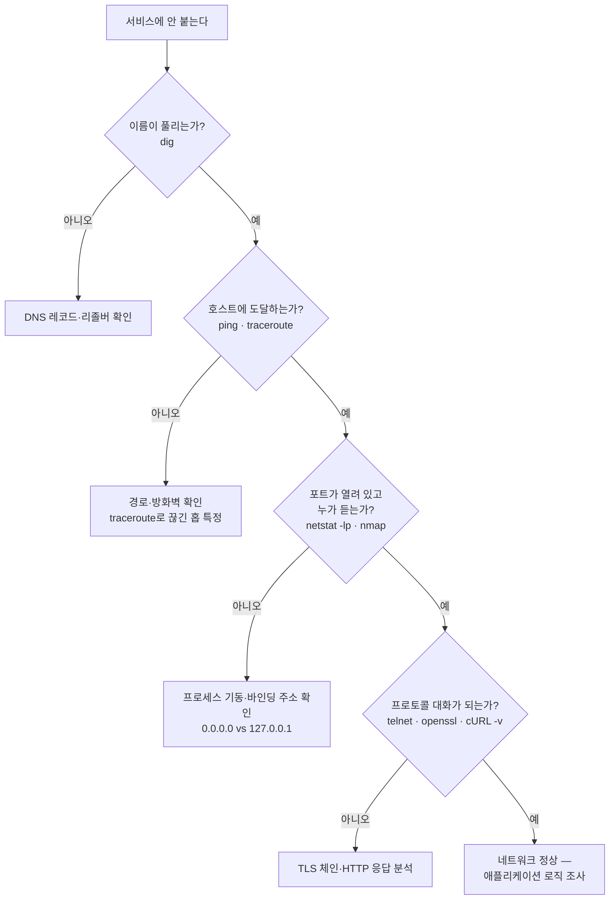

# Linux 네트워크 진단 도구 — 계층 순서대로 수사하기

## 핵심 요약
> 이 편 전체가 매달린 하나의 생각은 "네트워크 진단은 계층 순서대로 좁혀 가는 수사"입니다.
> 이름이 풀리는가(dig), 도달하는가(ping·traceroute), 포트가 열려 있고 누가 듣는가(netstat·nmap), 프로토콜 대화가 되는가(telnet·netcat·openssl·cURL) — 이 순서로 도구를 골라 쓰면 "어디까지는 되고 어디서부터 안 되는지"가 체계적으로 드러납니다. 단, Kubernetes Service는 ICMP를 지원하지 않으므로 ping이 항상 실패한다는 함정 하나는 미리 알아야 합니다.

## 학습 목표

이 내용을 읽고 나면:

1. 증상(연결·DNS·포트·TLS·HTTP)별로 첫 번째로 꺼낼 도구를 고를 수 있습니다.
2. traceroute가 TTL을 조작해 경로를 알아내는 원리를 설명할 수 있습니다.
3. Kubernetes Service에 ping이 실패하는 이유와 대안을 말할 수 있습니다.
4. netstat로 특정 포트에서 듣는 프로세스를 찾을 수 있습니다.
5. openssl s_client와 cURL로 TLS 문제를 진단하는 절차를 수행할 수 있습니다.

## 수사 순서 한눈에



K8s 함정 하나를 먼저 박아 둡니다 — 위 흐름에서 대상이 Kubernetes Service라면 ping 단계를 건너뛰어야 합니다. 이유는 §2에서 설명합니다.

## 1. 시작 전 보안 경고 — 진단 도구는 공격 도구다

여기 나오는 모든 도구는 공격자가 시스템을 탐색하고 접근을 넓히는 데 그대로 쓸 수 있습니다. 저자들은 머신에 네트워킹 도구를 가능한 한 적게 설치해 두는 것을 모범 관행으로 꼽습니다. 공격자가 직접 바이너리를 내려받을 수는 있지만 최소한 마찰은 늘어납니다.

setuid 비트가 그 근거 중 하나입니다. 파일에 setuid가 설정되면 실행한 사용자가 아니라 파일 소유자의 권한으로 실행됩니다(권한 표기에서 `x` 대신 `s`). ping·nmap 같은 도구가 raw 패킷 전송을 위해 일부 시스템에서 setuid를 쓰는데, 공격자가 자기 복사본을 내려받으면 root 권한 없이는 시스템 설치본(setuid 포함)만큼 할 수 있는 일이 줄어듭니다.

## 2. 도달 확인 — ping과 traceroute

ping은 ICMP ECHO_REQUEST 패킷을 보내 호스트 간 연결을 확인하는 가장 단순한 도구입니다. `ping <주소>` 형태로 쓰고 `-c <횟수>`로 전송 수를 제한합니다.

Kubernetes 사용자에게 중요한 함정이 하나 있습니다 — Kubernetes Service는 TCP와 UDP만 지원하고 ICMP는 지원하지 않습니다. 그래서 Service에 대한 ping은 항상 실패합니다. 연결 확인은 telnet이나 cURL 같은 상위 도구로 해야 하며, 개별 Pod는 네트워크 구성에 따라 ping이 닿을 수도 있습니다. 방화벽·라우터가 ICMP를 걸러내도록 설정될 수 있다는 점도 함께 기억해 둘 부분입니다.

traceroute는 한 호스트에서 다른 호스트까지의 경로를 홉 단위로 보여 줍니다. 원리가 재치 있습니다 — 1장에서 본 TTL을 역이용합니다. TTL을 1로 시작해 1씩 올려 가며 패킷을 보내면, TTL을 0으로 깎은 각 라우터가 TIME_EXCEEDED 패킷을 자기 주소로 회신하므로 경로상의 호스트가 한 줄씩 드러납니다. 응답이 없으면 `*`로 표시되는데, TIME_EXCEEDED 회신을 거부하는 호스트나 중간 방화벽이 원인일 수 있습니다. 기본 프로토콜은 UDP이고 `-P`로 TCP·ICMP를 고를 수 있습니다.

## 3. 이름 확인 — dig

dig는 명령줄 DNS 조회 도구입니다. `dig <도메인>`이 기본형이고 CNAME·A·AAAA 레코드를 보여 줍니다. 가장 흔한 사용법은 레코드 타입 지정으로, `dig <도메인> <타입>` 형식입니다(예: `dig kubernetes.io TXT`).

응답에서는 status(`NOERROR`·`NXDOMAIN` 등), ANSWER SECTION, 응답한 서버(SERVER)를 읽으면 "어느 DNS가 뭐라고 답했는지"가 확정됩니다. `-p`로 비표준 포트를 지정할 수 있고, 특정 DNS 서버에 물으려면 `dig @서버 <도메인>` 표기를 씁니다.

> 원문 정오: 책의 표 2-15는 `-b`를 "질의를 보낼 대상 주소"로 설명하지만, dig 매뉴얼 기준 `-b`는 질의의 출발지(source) IP 주소를 지정하는 옵션입니다. 대상 서버 지정은 `@서버` 표기가 맞습니다.

## 4. 포트와 소켓 — netstat와 nmap

netstat는 머신의 네트워크 스택과 연결 정보를 폭넓게 보여 줍니다. 인자 없이 실행하면 연결된 소켓 전부를, `-a`는 리스닝 소켓까지 전부를, `-l`은 리스닝만 보여 줍니다. 실무에서 가장 잦은 용법은 "이 포트에서 누가 듣고 있나"입니다.

```console
$ sudo netstat -lp | grep 3000
tcp6    0    0 [::]:3000    [::]:*    LISTEN    613/grafana-server
```

`-l`(listening)과 `-p`(program)의 조합이며, 프로세스 정보를 다 보려면 sudo가 필요할 수 있습니다. 출력의 로컬 주소가 `0.0.0.0`인지 `127.0.0.1`인지로 "밖에서 접근 가능한가"도 함께 판별됩니다. `-t`/`-u`로 TCP/UDP만, `-s`로 프로토콜 통계를 봅니다.

nmap은 포트 스캐너입니다. `nmap <대상>`(도메인·IP·CIDR)으로 열린 포트와 추정 서비스를 빠르게 요약합니다. 원격에서 어떤 서비스가 보이는지 즉시 알려 주므로 노출되면 안 되는 서비스를 찾는 손쉬운 방법이고, 같은 이유로 공격자가 애용하는 도구이기도 합니다. `-A`는 OS·버전 탐지까지 켭니다.

## 5. 프로토콜 대화 — telnet·netcat·openssl·cURL

여기서부터는 연결 위에서 실제 프로토콜을 말해 보는 단계입니다.

telnet은 `telnet <주소> <포트>`로 연결해 대화형 입력을 제공합니다. 텍스트 기반 프로토콜 서버를 디버깅하는 고전으로, HTTP/1 서버에 `HEAD / HTTP/1.1`을 직접 타이핑해 응답 헤더를 받아볼 수 있습니다. 도구를 제대로 쓰려면 해당 애플리케이션 프로토콜을 알아야 한다는 전제가 붙습니다.

netcat(`nc`)은 연결·데이터 전송·리스닝을 다 하는 다목적 도구입니다. telnet과 비슷하게 서버에 붙을 수 있지만 stdin 파이프를 받으므로 요청을 파일로 만들어 흘려 넣는 식의 자동화가 쉽습니다. 서버나 클라이언트를 "수동으로" 돌려 무슨 일이 일어나는지 들여다볼 때 유용합니다.

openssl은 TLS 진단의 종결자입니다. 여러 도구가 TLS 오류를 잡아내지만 디버깅 정보의 깊이는 openssl이 가장 풍부합니다. 핵심 용법은 `openssl s_client -connect <호스트>:443`으로, 인증서 체인·발급자·협상된 프로토콜과 cipher(예: TLSv1.3, TLS_AES_256_GCM_SHA384)·검증 결과(Verify return code)를 전부 보여 줍니다. 자체 서명 CA는 `-CAfile <경로>`로 지정해 검증할 수 있습니다.

cURL은 HTTP·HTTPS를 비롯한 여러 프로토콜의 데이터 전송 도구입니다. 기본 동작은 GET이고 자주 쓰는 옵션은 다음과 같습니다.

- `-L` — 리다이렉트 따라가기 (기본은 따라가지 않음 — `curl kubernetes.io`가 본문 대신 리다이렉트 안내만 돌려주는 이유)
- `-X <verb>` — 특정 HTTP 메서드 (예: `-X DELETE`)
- `-d <데이터>` — 본문 전송. URL 인코딩, JSON, `@파일` 모두 가능
- `-H <헤더>` — 명시적 헤더 추가
- `-v` — 상세 출력. TCP 연결부터 TLS 핸드셰이크 단계, 요청·응답 헤더까지 보여 줘 L7 디버깅에 특히 값짐

cURL은 브라우저처럼 인증서 체인을 호스트의 CA 목록과 대조하므로 TLS 문제도 드러냅니다 — 만료된 인증서 사이트에 붙으면 `curl: (60) SSL certificate problem: certificate has expired`로 실패하고, `-v`를 붙이면 어느 핸드셰이크 단계에서 알림이 났는지까지 보입니다.

> 💬 **비유**: 진단 도구 세트는 병원의 검사 순서와 비슷합니다. ping은 맥박 확인이고 traceroute는 혈관 조영술입니다 — 어디까지 피가 도는지 봅니다. dig는 환자 차트 조회(이름↔번호 대조)이고, netstat·nmap은 청진기로 어느 장기(포트)가 활동 중인지 듣는 단계입니다. telnet·openssl·cURL은 문진입니다 — 실제로 대화(프로토콜)를 걸어 보고 대답의 어디가 이상한지 확인합니다. 맥박도 안 뛰는데 문진부터 시작하면 시간만 잃습니다.

## 심화 학습
> 책 밖에서 보강한 내용입니다. 출처를 함께 남깁니다.

- netstat는 net-tools 패키지 소속이고, 현대 배포판의 표준 대체는 iproute2의 [`ss`](https://man7.org/linux/man-pages/man8/ss.8.html)입니다(`ss -lntp`가 `netstat -lntp`에 대응). 이 책의 netstat 용법은 ss에 거의 그대로 이식됩니다.
- 컨테이너에는 이런 도구가 없는 경우가 대부분입니다(최소 이미지 관행 — 이 편 §1 보안 경고와 같은 이유). Kubernetes 1.25에서 GA가 된 임시(ephemeral) 컨테이너를 이용해 `kubectl debug --image=nicolaka/netshoot`처럼 진단 도구를 주입하는 것이 표준 우회입니다 — [kubectl debug 공식 문서](https://kubernetes.io/docs/tasks/debug/debug-application/debug-running-pod/) 참조.
- 이 편의 도구를 K8s에서 쓰는 순서는 형제 개념 노트 축과 이어집니다 — 클러스터 쪽 진단은 [`08_cloud/kubernetes`](../../kubernetes/README.md) 운영 문서들이 SSOT입니다.

## 결정 치트시트
> 원문 표 2-12의 케이스별 도구 선택에 K8s 함정 하나를 더했습니다.

| 확인하려는 것 | 도구 |
|--------------|------|
| 연결성 | traceroute, ping, telnet, netcat |
| 포트 스캔 | nmap |
| DNS 레코드 | dig (+ 연결성 도구들) |
| HTTP/1 | cURL, telnet, netcat |
| HTTPS | openssl, cURL |
| 듣고 있는 프로그램 | netstat (`sudo netstat -lp`) |
| Kubernetes Service 연결성 | telnet·cURL — ping은 ICMP라 항상 실패 |

## 면접에서 받을 만한 질문

> 먼저 스스로 답을 소리 내어 말해 본 뒤, 아래 §정답 섹션을 펼쳐 맞춰 봅니다.

1. traceroute를 한 문장으로 정의하면? TTL과 TIME_EXCEEDED로 어떻게 경로를 알아냅니까?
2. 네트워크 진단은 왜 계층 순서로 좁혀야 합니까? 그 순서는?
3. Kubernetes Service에 ping이 항상 실패하는 이유는? 그럼 무엇으로 확인합니까?
4. 서비스가 안 붙을 때 어떤 순서로 도구를 씁니까?
5. TLS 오류가 의심될 때 cURL과 openssl 중 무엇을 씁니까? traceroute의 `* * *`는 경로 단절입니까?

### 빈칸 채우기 — 진단 계층 순서

진단은 좁혀 가는 순서입니다. 이름은 `①____`, 도달은 `②____`·traceroute, 포트는 `③____`·nmap, 프로토콜은 telnet·openssl·`④____`로 확인합니다.

## 정답 (자답 후 펼치기)

> 위 §면접에서 받을 만한 질문의 5개에 *먼저 자답한 뒤* 아래를 읽으세요. 자답 없이 먼저 읽으면 학습 효과가 0입니다.

### 정답 1 — traceroute 정의

traceroute는 TTL을 1부터 올려 보내며 각 라우터의 TIME_EXCEEDED 회신으로 경로상 홉을 한 줄씩 알아내는 경로 진단 도구입니다. TTL이 0이 된 지점의 라우터가 발신자에게 TIME_EXCEEDED를 돌려주므로, TTL을 1·2·3…으로 늘리면 첫 홉부터 목적지까지 한 홉씩 드러납니다.

### 정답 2 — 계층 순서로 진단

다음 순서로 좁혀야 "어디서부터 안 되는지"가 나옵니다.

1. 이름 — dig
2. 도달 — ping·traceroute
3. 포트 — netstat·nmap
4. 프로토콜 — telnet·openssl·cURL

위 계층이 안 되면 아래는 볼 필요가 없으므로, 순서대로 가면 실패 지점을 빠르게 격리할 수 있습니다.

### 정답 3 — K8s Service와 ping

Kubernetes Service는 TCP·UDP만 지원하므로 ping(ICMP)이 항상 실패합니다. Service가 죽어서가 아니라 프로토콜을 안 받는 것이라, Service 연결 확인은 telnet·cURL 같은 TCP 기반 도구로 합니다. 개별 Pod IP로는 ping이 될 수 있습니다.

### 정답 4 — 서비스 진단 순서

먼저 이름이 풀리는지 dig로, 호스트에 도달하는지 ping·traceroute로 확인합니다. 도달하면 netstat로 대상 포트에서 프로세스가 실제로 듣는지(그리고 `0.0.0.0`인지 `127.0.0.1`인지) 보고, 마지막으로 telnet·cURL로 프로토콜 수준 응답을 확인합니다.

### 정답 5 — cURL vs openssl, `* * *`

빠른 확인은 `curl -v`로 충분합니다. 인증서 체인·cipher 협상까지 파고들려면 `openssl s_client -connect`가 가장 상세합니다. traceroute의 `* * *`는 경로 단절이 아닐 수 있습니다. 해당 홉이 TIME_EXCEEDED 회신을 거부하거나 방화벽이 회신을 막았을 뿐일 수 있고, 그 뒤 홉이 정상 표시되면 트래픽은 통과하고 있다는 뜻입니다.

### 정답 빈칸 — ①`dig` ②`ping` ③`netstat` ④`cURL`

이름은 dig, 도달은 ping·traceroute, 포트는 netstat·nmap, 프로토콜은 telnet·openssl·cURL로 확인합니다.

## 핵심 개념 체크리스트
- [ ] 증상별 첫 도구 선택 표를 안 보고 재구성할 수 있는가?
- [ ] traceroute의 TTL 트릭을 TIME_EXCEEDED와 함께 설명할 수 있는가?
- [ ] K8s Service에 ping이 실패하는 이유를 프로토콜 수준에서 말할 수 있는가?
- [ ] `netstat -lp` 출력에서 리스닝 주소의 보안 함의를 읽을 수 있는가?
- [ ] `openssl s_client` 출력에서 확인할 세 가지(체인·cipher·검증 코드)를 아는가?

## 참고 자료
- 《Networking and Kubernetes: A Layered Approach》(James Strong·Vallery Lancey, O'Reilly, 2021, ISBN 978-1492081654) Ch2
- [cURL 공식 문서](https://curl.se/docs/)
- [kubectl debug — 실행 중인 Pod 디버깅](https://kubernetes.io/docs/tasks/debug/debug-application/debug-running-pod/)
- 이전 편: [02-02. iptables·IPVS·eBPF](./02-02.iptables%C2%B7IPVS%C2%B7eBPF%20%E2%80%94%20kube-proxy%EB%A5%BC%20%EC%9D%B4%ED%95%B4%ED%95%98%EB%8A%94%20%EC%84%B8%20%EA%B8%B0%EC%88%A0.md)
