# iptables·IPVS·eBPF — kube-proxy를 이해하는 세 기술

---

## 핵심 요약
> 규칙이 놓이는 자리가 평가 시점을 정하고, 규칙을 리스트로 훑는 구조의 비용이 IPVS와 eBPF라는 다른 조회 방식을 불렀습니다.

iptables는 패킷이 도달한 훅에서 규칙 목록을 위에서부터 대조하므로, 서비스가 늘면 훑을 목록도 길어집니다. 그래서 kube-proxy는 해시로 찾는 IPVS 모드를 더했고 Cilium은 eBPF 프로그램을 커널에 붙여 kube-proxy를 대체합니다. 셋은 진화 단계가 아니라 전제와 운영 부담이 다른 선택지입니다. kube-proxy에는 nftables 모드도 있습니다.


## 학습 목표
> 세 기술을 나란히 아는 데서 멈추지 않고, 비용이 어디서 커지는지를 조회와 갱신으로 갈라 무엇을 고를지 판단하는 상태를 목표로 합니다.

이 내용을 읽고 나면:

1. iptables의 구성(테이블 → 체인 → 규칙)과 실행(훅에 등록된 처리가 우선순위 순으로)을 갈라 설명하고, 같은 이름의 체인이 테이블마다 따로 있다는 것을 말할 수 있습니다.
2. 타깃이 멈추는 범위를 넷(비종결·체인·테이블·패킷)으로 가르고, 서브체인의 ACCEPT가 그 테이블 순회는 끝내도 패킷의 최종 결정은 아닌 이유를 말할 수 있습니다.
3. Service 하나의 실물 체인을 따라가며 확률 DNAT가 균등 분배가 되는 이유, 후속·응답 패킷이 백엔드를 다시 고르지 않는 이유, MASQUERADE가 어떤 패킷에만 걸리는지를 설명할 수 있습니다.
4. iptables 로드밸런싱의 비용을 조회 비용과 갱신 비용으로 가르고, IPVS가 어느 쪽을 겨눴는지 설명할 수 있습니다.
5. eBPF가 규칙 대신 무엇을 커널에 넣는지, Cilium이 kube-proxy를 어디까지 대체하는지 설명할 수 있습니다.

아래 지도는 이 편의 흐름입니다. iptables의 구조를 익히고 그 규칙으로 만든 서비스 분배를 본 뒤 그 한계에서 나온 대안으로 갑니다. 주황 상자가 이 편의 중심인 확률 분배이고, 파란 상자가 그 한계에서 나온 대안입니다.

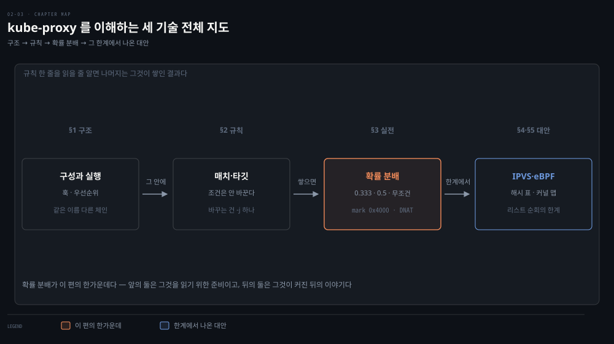


## 1. iptables의 두 축 — 구성(테이블·체인·규칙)과 실행(훅·우선순위)
> 규칙은 테이블이 체인을, 체인이 규칙을 담는 구조로 조직됩니다. 실행은 그 포함 관계를 따르지 않고, 패킷이 도달한 훅에 등록된 처리들이 우선순위 순으로 돕니다.

### 풀려는 문제

클러스터에서 서비스가 안 닿아 노드에서 `iptables -S` 를 쳐 보면 kubelet 과 kube-proxy 가 만든 규칙이 수천 줄 나옵니다. 어느 줄이 언제 평가되는지 모르면 목록을 끝까지 읽어도 원인에 닿지 못합니다. 직접 넣은 규칙이 아무 효과가 없거나 엉뚱한 트래픽까지 막는 일도 생깁니다.

원인은 규칙이 놓인 자리가 평가 시점을 정한다는 데 있습니다. 그 자리는 규칙을 조직하는 구조와 실제로 도는 순서라는 두 축으로 정해지는데, 둘은 서로 다릅니다. 한 그림으로 외우면 "테이블 안에 체인이 있는데 실행은 체인이 먼저"처럼 앞뒤가 맞지 않는 문장이 나옵니다.

iptables는 Netfilter 훅으로 패킷을 가로채고 변형합니다. 방화벽·감사 로그·패킷 변형과 재라우팅은 물론 조악한 연결 fan-out도 이 구조로 합니다.

### 구성 — 테이블이 체인을, 체인이 규칙을 담는다

구성은 포함 관계입니다. 테이블이 체인을 담고, 체인이 규칙을 담습니다. `iptables -t nat -A PREROUTING ...` 에서 `-t` 로 테이블을 고르고 그 안의 체인을 지정하는 문법이 이 구조 그대로입니다.

| 테이블 | 책임 |
|--------|------|
| Filter | 패킷의 수락·거부 (방화벽) |
| NAT | 출발지·목적지 IP 주소 변경 |
| Mangle | NAT가 아닌 범용 헤더 편집, iptables 전용 메타데이터 "마킹" |
| Raw | 연결 추적(Conntrack)보다 먼저 도는 테이블 — 주 용도는 특정 패킷을 추적에서 빼는 것 |
| Security | SELinux 같은 보안 모듈이 쓰는 강제 접근 제어(MAC) 규칙 — 쓰지 않는 머신에서는 비어 있음 |

체인은 규칙의 목록입니다. 빌트인 체인의 이름 다섯은 [전편](./02-01.%EC%BB%A4%EB%84%90%EC%9D%B4%20%ED%8C%A8%ED%82%B7%EC%9D%84%20%EB%8B%A4%EB%A3%A8%EB%8A%94%20%EB%B2%95%20%E2%80%94%20%EC%86%8C%EC%BC%93%C2%B7Netfilter%C2%B7Conntrack%C2%B7%EB%9D%BC%EC%9A%B0%ED%8C%85.md)의 Netfilter 훅 5개와 짝을 이룹니다.

- `PREROUTING` = `NF_IP_PRE_ROUTING`
- `INPUT` = `NF_IP_LOCAL_IN`
- `FORWARD` = `NF_IP_FORWARD`
- `OUTPUT` = `NF_IP_LOCAL_OUT`
- `POSTROUTING` = `NF_IP_POST_ROUTING`

위 목록은 체인 다섯 개가 아니라 이름 다섯 개의 목록입니다. 테이블마다 자기 체인을 따로 갖기 때문에 `mangle` 의 `INPUT` 과 `filter` 의 `INPUT` 은 이름만 같은 별개의 체인입니다. `iptables -t mangle -A INPUT ...` 과 `iptables -t filter -A INPUT ...` 이 서로 다른 목록에 줄을 붙이는 것도 그래서입니다. `-t` 를 빼면 filter 로 가므로, mangle 에 넣을 생각으로 `-t` 를 빠뜨리면 엉뚱한 체인에 규칙이 쌓입니다.

둘이 공유하는 것은 목록이 아니라 자리입니다. 두 체인 모두 `NF_IP_LOCAL_IN` 훅에 걸려 같은 시점에 불리고, 그래서 이름이 같습니다. "INPUT 체인"이라고 말할 때는 어느 테이블의 INPUT 인지를 붙여야 뜻이 하나로 정해집니다.

### 실행 — 훅에 등록된 처리가 우선순위 순으로 돈다

패킷이 훅 하나에 도달하면 그 훅에 등록된 처리들이 우선순위 순으로 실행됩니다. 커널 입장에서는 훅 하나에 콜백 여러 개가 등록돼 있고, 각자 가진 우선순위 정수가 작은 것부터 부를 뿐입니다. 테이블이 체인을 담는다고 해서 테이블부터 도는 것도, 체인부터 도는 것도 아닙니다.

iptables 테이블의 우선순위는 raw -300, mangle -150, nat 의 DNAT -100, filter 0, security 50, nat 의 SNAT 100 입니다. 사이사이에 iptables 것이 아닌 처리도 끼어 있습니다. 조각 재조립이 -400, 연결 추적이 -200 이고, 연결 추적의 확정 단계는 정수 최댓값이라 맨 끝에 돕니다.[^prio] 전편의 우선순위 표에서 iptables 자리를 추린 것입니다.

그러니 흔히 외우는 Raw → Mangle → NAT → Filter 는 규칙이 아니라 -300 · -150 · -100 · 0 을 크기순으로 늘어놓은 결과입니다. 모든 훅의 공통 순서도 아닙니다. 그 훅에 실제로 등록된 것만 돌기 때문입니다.

INPUT 훅을 예로 들면 raw 도 연결 추적(-200)도 등록돼 있지 않습니다. 연결 추적은 이 패킷을 PREROUTING 에서 이미 봤기 때문입니다. INPUT 에서는 mangle · filter · security 가 돈 다음 nat 이 돌고, 맨 끝에 확정 단계가 남습니다. INPUT 의 nat 은 출발지를 바꾸는 SNAT 자리라 우선순위가 100 이므로 filter 의 0, security 의 50 보다 뒤입니다.[^hook-ops] POSTROUTING 훅에는 filter 가 없어 mangle 다음이 nat 의 SNAT 입니다.

순서를 외우는 대신 "이 훅에 무엇이 등록돼 있고 그 숫자가 몇인가"를 물으면 어느 훅에서든 답이 나옵니다. 어느 테이블이 어느 훅에 체인을 두는지는 다음과 같습니다.

| 테이블 | PREROUTING | INPUT | FORWARD | OUTPUT | POSTROUTING |
|--------|:---:|:---:|:---:|:---:|:---:|
| Raw | O | | | O | |
| Mangle | O | O | O | O | O |
| NAT (DNAT) | O | | | O | |
| NAT (SNAT) | | O | | | O |
| Filter | | O | O | O | |
| Security | | O | O | O | |

`NAT (SNAT)` 행의 INPUT 칸이 켜져 있지만 실무에서 SNAT 의 자리는 POSTROUTING 하나로 보는 편이 맞습니다. nat 테이블의 INPUT 체인은 뒤늦게 추가된 것이고 거기서 SNAT 를 쓰는 경우는 드뭅니다.

빈칸은 "그 자리에서는 그 일을 할 수 없다"는 뜻입니다. 이유는 대부분 연결 추적과 라우팅 결정을 기준으로 한 시점에서 나옵니다.

- raw 는 연결 추적보다 먼저 돌아야 추적에서 뺄 패킷을 고를 수 있습니다. 연결 추적이 시작되는 자리가 PREROUTING(들어온 패킷)과 OUTPUT(이 호스트가 만든 패킷) 둘이라 raw 도 그 둘에만 있습니다.[^tables]
- nat 은 주소를 바꾸고, 주소가 바뀌면 커널이 계산해 둔 경로가 달라집니다. 그래서 목적지를 바꾸는 DNAT 는 커널이 바뀐 목적지로 경로를 찾을 수 있는 PREROUTING·OUTPUT 에서만 씁니다. 출발지를 바꾸는 SNAT 는 경로가 정해진 뒤인 POSTROUTING·INPUT 에서만 씁니다.[^ipt-targets] 이 호스트가 만든 패킷은 OUTPUT 의 nat 이 목적지를 바꾸면 그 뒤에 경로를 다시 찾습니다.[^hook-ops] FORWARD 는 결정은 끝났고 아직 떠나지 않은 자리라, 여기서 목적지를 바꾸면 정해 둔 경로와 어긋나므로 nat 에는 FORWARD 가 없습니다.
- `MASQUERADE` 는 POSTROUTING 전용입니다. 나가는 인터페이스가 정해진 뒤에야 "그 인터페이스의 주소"를 알 수 있기 때문입니다.
- filter 는 통과시킬지를 정하므로 패킷의 운명이 정해진 뒤라야 뜻이 섭니다. PREROUTING 에서는 나에게 오는 것인지 남에게 가는 것인지 아직 모릅니다. INPUT·FORWARD·OUTPUT 이 나에게 온다·나를 통과한다·내가 보낸다는 세 운명에 대응하고, filter 는 이 세 자리에 있습니다. 떠나는 순간인 POSTROUTING 에는 filter 가 없어 거기서는 방화벽으로 막지 못합니다.

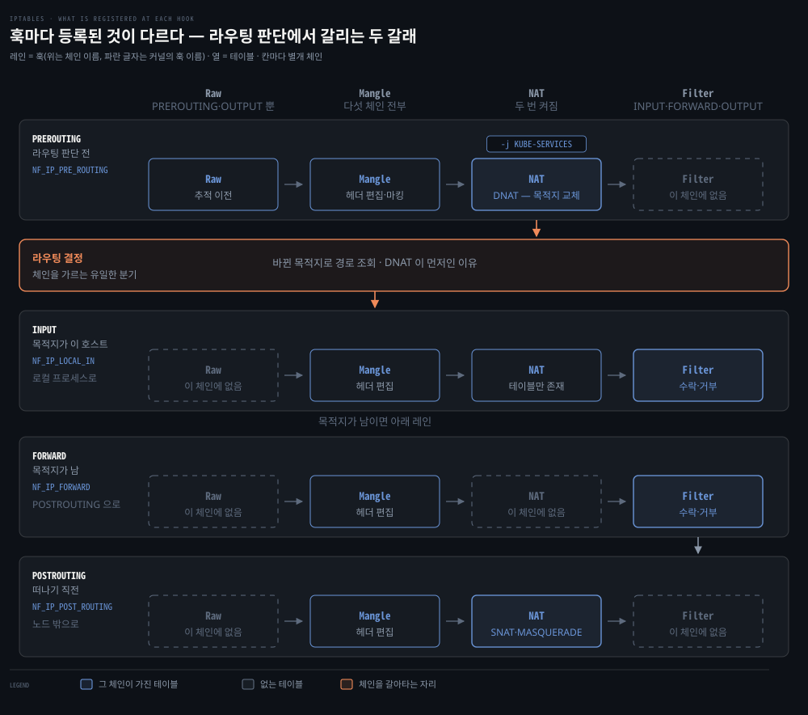

레인 하나가 훅 하나, 열 하나가 테이블 하나입니다. 점선 칸은 그 훅에 등록되지 않은 테이블입니다. 볼 것은 둘입니다. NAT 가 라우팅 결정 앞(DNAT)과 뒤(SNAT)에서 한 번씩 켜진다는 것, 그리고 Filter 가 DNAT 뒤에 와서 이미 바뀐 목적지로 판정한다는 것입니다. 라우팅 결정 아래의 INPUT 과 FORWARD 는 나란한 단계가 아니라 택일입니다. 이 호스트가 만든 패킷이 지나는 OUTPUT 레인은 이 도식에 없습니다. 레인 안 화살표는 열 순서를 따를 뿐이라, INPUT 에서 nat 이 filter 뒤에 도는 실제 순서와는 다릅니다.

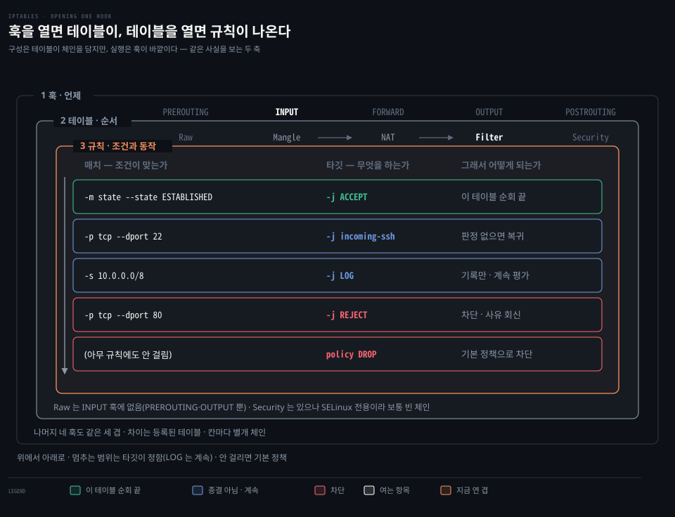

실행 축으로 한 겹씩 들어간 그림입니다. 바깥이 훅 자리(INPUT), 가운데가 그 자리에서 우선순위 순으로 도는 테이블, 가장 안쪽이 filter 가 가진 규칙 목록입니다. 구성에서는 테이블이 바깥이지만 실행에서는 훅이 바깥이라는 점이 두 축의 차이입니다. 가운데 띠의 화살표는 NAT 를 Filter 앞에 두지만, INPUT 에서 nat 은 우선순위 100 이라 실제로는 filter·security 뒤에 돕니다. 흐린 Security 는 없는 것이 아니라 SELinux 를 쓰지 않아 비어 있을 뿐입니다. 가장 안쪽 목록은 위에서 아래로 평가됩니다. 걸린 규칙에서 멈추는지 계속 가는지는 타깃이 정합니다(§2).

### 실행의 예 — OUTPUT 훅에서 값을 바꾸는 테이블이 먼저 돈다

이 호스트의 프로세스가 ClusterIP 로 패킷을 보내면 OUTPUT 훅에서 mangle · nat · filter 가 차례로 돕니다. OUTPUT 의 nat 은 목적지를 바꾸는 DNAT 자리(-100)라 mangle 과 filter 사이에 옵니다. 같은 세 테이블이 INPUT 에서는 nat 이 맨 뒤로 가므로, 순서는 테이블이 아니라 훅에 등록된 숫자가 정합니다. 아래 세 칸은 하나의 체인이 아니라 mangle 의 OUTPUT · nat 의 OUTPUT · filter 의 OUTPUT 이라는 서로 다른 세 체인입니다.


왼쪽이 그 테이블을 지난 직후의 패킷이고 오른쪽이 그 자리에서 평가되는 규칙입니다. mangle 은 표식을 붙이고 nat 은 목적지를 갈아치웁니다. 둘 다 패킷을 바꾸는 일이고, filter 는 그 결과를 읽어 통과 여부만 정합니다. 앞의 raw 는 연결 추적을 켤지만 정하고 이 값들을 건드리지 않아 뺐습니다. mangle 규칙은 순서를 보이려고 든 예이지 kube-proxy 가 넣는 규칙은 아닙니다.

filter 가 앞섰다면 아직 DNAT 전이라 ClusterIP 를 보게 되고, Pod IP 로 써 둔 허용 규칙은 발화하지 않습니다. 규칙은 맞는데 왜 안 되는지 찾게 되는 상황입니다. 값을 바꾸는 쪽이 먼저이고 그 값으로 결정하는 쪽이 나중입니다. DNAT 가 라우팅 결정보다 먼저 일어나야 커널이 새 목적지로 길을 찾을 수 있다는 것도 같은 원리입니다.


## 2. 규칙 한 줄 읽기와 타깃의 종결 범위
> 규칙은 조건이 모두 맞을 때 타깃 하나를 실행합니다. 그 뒤 평가가 멈추는 범위는 타깃마다 다음 줄로 계속·이 체인만·이 테이블만·패킷 전체의 넷으로 갈립니다.

### 풀려는 문제

앞 절이 규칙이 놓이는 자리를 정리했다면, 이제 규칙 한 줄을 읽어야 합니다. 실물은 `-p tcp -m comment --comment "..." -m tcp -j DNAT --to-destination ...` 처럼 토큰이 길게 이어져 어디까지가 조건이고 어디부터가 동작인지 한눈에 들어오지 않습니다.

읽는 법을 모르면 디버깅에서 멈춤의 범위를 뭉뚱그리게 됩니다. 규칙에 한 번 걸리면 무조건 거기서 끝난다고 보거나, 서브체인에서 ACCEPT 된 뒤에도 부모 체인 규칙이 돈다고 보거나, 한 테이블에서 ACCEPT 됐으니 통과가 확정됐다고 보는 오독이 모두 여기서 나옵니다.

### 규칙 읽기 — 조건은 거르고 타깃 하나가 패킷을 바꾼다

규칙은 매치 조건과 타깃의 조합입니다. 커널은 토큰을 왼쪽에서 오른쪽으로 훑고, 조건이 모두 맞으면 타깃을 실행합니다. 조건 하나만 어긋나도 뒤 토큰은 평가하지 않고 그 규칙 전체를 없었던 것처럼 넘어갑니다.


맨 윗줄이 `iptables -t nat -S KUBE-SEP-2MJG2J3URJK2NCRL` 출력 원본입니다. 번호가 같은 토막과 아래 칸이 짝입니다. `-p tcp` 는 패킷을 읽어 통과 여부만 정하고 헤더는 건드리지 않습니다. `-m comment` 는 항상 참인 사람용 메모이고, `-m tcp` 는 뒤에 `--dport` 같은 옵션이 붙지 않아 더 거르는 것이 없습니다. 패킷을 바꾸는 것은 맨 끝 `-j DNAT --to-destination` 하나입니다. 목적지가 `10.96.192.224:8080` 에서 `10.244.1.66:8080` 으로 이때 바뀝니다.

규칙이 수천 개면 이 대조가 패킷마다 반복됩니다. §4 에서 다룰 조회 비용이 여기서 나옵니다.

토큰에 붙는 옵션은 역할로 묶으면 긴 한 줄도 읽힙니다. 위쪽 일곱은 규칙을 어디에 놓고 어떻게 볼지를 정합니다. 가운데 넷은 패킷을 거르고, 마지막 하나가 실행할 동작을 고릅니다.

| 옵션 | 하는 일 |
|------|---------|
| `-t <테이블>` | 다룰 테이블을 고릅니다 — 생략하면 filter 입니다 |
| `-N <체인>` | 사용자 체인을 만듭니다 |
| `-A <체인>` | 그 체인 맨 뒤에 규칙을 붙입니다 |
| `-I <체인> [번호]` | 맨 앞(또는 지정한 번호 자리)에 규칙을 끼웁니다 |
| `-D <체인>` | 규칙을 지웁니다 |
| `-P <체인> <타깃>` | 빌트인 체인의 기본 정책을 바꿉니다 |
| `-S` · `-L` | 규칙을 나열합니다 — `-S` 는 명령 형태, `-L` 은 표 형태 |
| `-s` · `-d` | 출발지 · 목적지 주소로 거릅니다 |
| `-p` | 프로토콜로 거릅니다 (`-p tcp --dport 22`) |
| `-i` · `-o` | 들어온 · 나갈 인터페이스로 거릅니다 |
| `-m <모듈>` | 매치 확장 모듈을 엽니다 (`-m state`, `-m statistic`, `-m comment`) |
| `-j <타깃 또는 체인>` | 조건이 맞았을 때 실행할 동작이거나, 넘어갈 체인 이름입니다 |

`-m` 이 여는 모듈 가운데 연결 추적 상태 매치가 특히 자주 보입니다. `-m state --state NEW,ESTABLISHED` 처럼 쓰고 RELATED·INVALID 도 같은 자리에 올 수 있습니다. `state` 는 `conntrack` 모듈의 부분집합이라 `-m conntrack --ctstate` 로도 같은 상태를 봅니다.[^ipt-state]

타깃은 조건이 맞았을 때 실행할 동작입니다. 자주 쓰는 것은 다음과 같고, 멈추는 범위는 다음 소절에서 한 번에 봅니다.

| 타깃 | 쓸 수 있는 자리 | 동작 |
|------|----------------|------|
| ACCEPT | 제약 없음 (주로 filter) | 패킷을 통과시킴 |
| DROP | 제약 없음 (주로 filter) | 조용히 폐기 — 외부에서는 패킷이 도착한 적 없는 것처럼 보임 |
| REJECT | filter 의 INPUT·FORWARD·OUTPUT | 폐기하고 거부 사유를 회신 |
| DNAT | nat 의 PREROUTING·OUTPUT | 목적지 주소 변경 |
| SNAT | nat 의 POSTROUTING·INPUT | 출발지 주소 변경 |
| MASQUERADE | nat 의 POSTROUTING | 출발지를 나가는 인터페이스의 주소로 변경 — 주소를 미리 몰라도 되는 SNAT |
| (점프) `-j <체인명>` | 제약 없음 | 다른 체인으로 넘어감 |
| RETURN | 제약 없음 | 부른 체인으로 돌아감 |
| LOG · AUDIT | 제약 없음 | 커널 로그 기록 · 수락·폐기·거부의 감사 기록 |
| MARK | 제약 없음 | 패킷에 정수 표식을 붙임 — fwmark 라우팅에 쓰려면 mangle 의 PREROUTING·OUTPUT 이어야 함[^mark] |

체인 제약이 있는 타깃은 그 체인에서만 불리는 사용자 체인에서도 쓸 수 있습니다.[^ipt-targets]

### 타깃의 종결 범위 — 다음 줄·이 체인·이 테이블·패킷 전체

규칙에 걸리면 타깃이 실행되지만, 그 뒤 평가가 어디까지 멈추는지는 타깃마다 다릅니다. 범위는 넷이고 아래로 갈수록 넓어집니다.[^ipt-targets]

- 아무것도 멈추지 않는 비종결 타깃 — `LOG`·`MARK`·`AUDIT` 는 자기 일만 하고 같은 체인의 다음 규칙으로 내려갑니다. 걸렸다는 사실이 평가를 끝내지 않습니다.
- 이 체인만 끝내는 `RETURN` — 지금 체인만 멈추고 부모 체인의 다음 규칙으로 돌아갑니다. 서브체인 끝까지 아무 규칙에도 안 걸려도 부모로 돌아갑니다. 빌트인 체인에서 쓰면 그 체인의 정책(policy)이 판정합니다.
- 이 테이블의 순회를 끝내는 `ACCEPT` — 서브체인에서 걸려도 부모 체인의 남은 규칙까지 건너뛰고 그 테이블을 빠져나갑니다. 같은 훅의 다음 테이블과 뒤 훅은 이 패킷을 여전히 평가합니다.
- 패킷의 운명을 정하는 `DROP`·`REJECT` — 뒤에 어떤 규칙이 남아 있어도 그 패킷은 다시 평가되지 않습니다.

그래서 규칙 목록을 읽을 때는 "여기 걸렸으니 끝"이라고 단정하기 전에 그 타깃이 어느 범위에서 멈추는지부터 봅니다. `LOG` 줄 뒤에 `DROP` 줄이 따로 놓이는 것도 LOG 가 비종결이라서입니다. 로그만 남기고 다음 줄로 내려가 거기서 버리므로, 한 줄로 합칠 수 없어 두 줄입니다.

ACCEPT 의 범위는 두 방향으로 헷갈립니다. 서브체인에서 ACCEPT 된 패킷은 부모 체인의 뒤쪽 규칙을 만나지 않습니다. 반대로 한 테이블에서 ACCEPT 됐다고 통과가 확정된 것도 아니어서, mangle 이 받아 준 패킷을 같은 훅의 filter 가 버릴 수 있습니다. ACCEPT 는 그 테이블이 낸 판정이지 패킷 전체의 최종 판정이 아닙니다.

`-A` 와 `-I` 의 차이도 여기서 드러납니다. 이미 `ACCEPT` 가 놓인 체인에 `-A` 로 차단 규칙을 덧붙이면, 그 `ACCEPT` 에 걸린 패킷은 뒤에 붙인 줄에 닿지 못합니다. 기존 규칙보다 먼저 보게 하려면 `-I` 로 앞에 끼웁니다.

### 사용자 체인 incoming-ssh 세우기 — 선언·규칙·호출 세 줄

서브체인은 규칙을 함수처럼 묶어 재사용하는 수단입니다. `-j` 뒤에 빌트인 타깃 대신 체인 이름을 적으면 그 체인으로 넘어가고, 그 체인이 판정 없이 끝나면 원래 자리로 돌아옵니다. 그런데 내장 체인과 달리 사용자 체인은 저절로 생기지 않습니다.

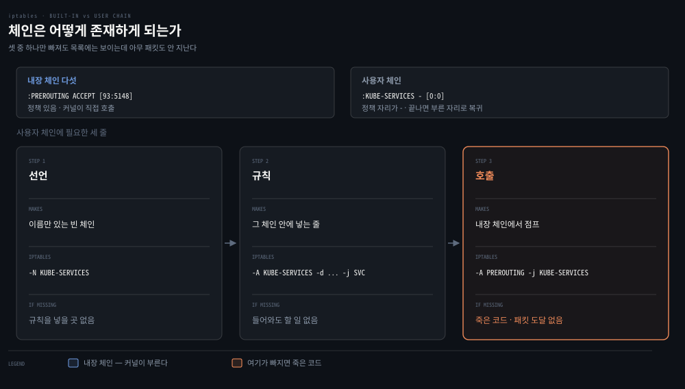

내장 체인 다섯은 커널이 이미 갖고 있고 커널이 부릅니다. 사용자 체인에는 이름을 만드는 선언(`-N`), 그 안에 넣는 규칙(`-A <내 체인>`), 내장 체인에서 그리로 점프하는 호출(`-A <내장 체인> -j <내 체인>`) 세 줄이 필요합니다. SSH 접속을 거르는 서브체인 `incoming-ssh` 를 세 줄로 세우면 이렇게 되고, 다음 소절이 이 체인을 추적합니다.

```bash
# 문법을 보이기 위한 설명용 예제입니다 — 주소는 실측값이 아닙니다
iptables -N incoming-ssh                              # 선언 — 서브체인 생성

iptables -A incoming-ssh -s 10.0.0.1 -j ACCEPT        # 규칙 — 특정 IP 허용
iptables -A incoming-ssh -s 10.0.0.2 -j ACCEPT
iptables -A incoming-ssh -j LOG --log-level info --log-prefix "ssh-failure"
iptables -A incoming-ssh -j DROP                      # 나머지는 기록 후 폐기

iptables -A INPUT -p tcp --dport 22 -j incoming-ssh   # 호출 — 내장 체인에서 점프
```

셋 중 호출 줄이 가장 자주 빠집니다. 선언과 규칙만 있으면 `iptables -S` 에 멀쩡히 보이는데 아무 패킷도 그 체인에 닿지 않습니다. 새 체인은 만들 수 있어도 새 훅은 만들 수 없으므로, 사용자 체인은 내장 체인이 불러 줘야만 실행됩니다.

`iptables-save` 출력에서는 콜론 줄이 둘을 가릅니다. `:PREROUTING ACCEPT [93:5148]` 처럼 정책이 적혀 있으면 내장이고, `:KUBE-SERVICES - [0:0]` 처럼 그 자리가 `-` 이면 사용자 체인입니다. 사용자 체인은 정책이 없어서 끝까지 아무것도 안 걸리면 스스로 판정하지 않고 부른 자리로 돌아갑니다. `RETURN` 과 같은 동작입니다.

### SSH 규칙 추적 — RETURN 은 부모로 돌아가고 ACCEPT 는 테이블을 끝낸다

위 체인에 출발지만 달리한 SSH 패킷을 넣으면 종결 범위가 갈리는 자리가 드러납니다. 아래 도식은 시간이 위에서 아래로 흐르며, 위 구간이 `ACCEPT` 경우이고 아래 구간이 마지막 줄을 `-j RETURN` 으로 바꾼 가정입니다.


| 출발지 | 평가되는 줄 | 결과 |
|---|---|---|
| `10.0.0.1` | 첫 `-s 10.0.0.1 -j ACCEPT` 에 걸림 | filter 순회가 끝나 부모 `INPUT` 의 뒤쪽 규칙을 만나지 않음. 같은 훅의 뒤 테이블(security·nat)은 여전히 평가 |
| `10.0.0.9` | ACCEPT 두 줄 불일치, `LOG` 에서 기록하고 계속, `DROP` 에 걸림 | 서브체인 안에서 폐기되고 패킷의 운명이 정해짐 |
| `10.0.0.9`, 마지막 줄이 `RETURN` 이라면 | ACCEPT 두 줄 불일치, `LOG` 에서 계속, `RETURN` 에 걸림 | 부모 `INPUT` 의 다음 규칙부터 이어서 평가하고, 끝까지 안 걸리면 `INPUT` 의 정책이 판정 |

셋째 줄이 `RETURN` 의 성질입니다. 한 체인에 대해서는 종결이지만 패킷에 대해서는 판정이 아니라 자리 이동이라, 돌아간 부모 체인에 무엇이 남았느냐에 따라 결과가 달라집니다.

### 규칙을 운용할 때 걸리는 것들

`iptables` 와 `ip6tables` 는 완전히 분리된 도구라 IPv4 규칙은 IPv6 트래픽에 적용되지 않습니다. 듀얼 스택 환경에서 방화벽 규칙을 IPv4 에만 넣으면 IPv6 경로로 우회하는 트래픽이 무방비로 열리므로, 규칙을 넣을 때는 양쪽을 함께 점검합니다.

규칙에 하나도 걸리지 않은 패킷은 그 체인의 기본 정책을 따릅니다. 기본값은 ACCEPT 이고 `iptables -P INPUT DROP` 처럼 바꿉니다. 기본 정책을 DROP 으로 두고 허용할 것만 여는 방식이 방화벽의 정석이지만, 원격 접속 중에 SSH 허용 규칙보다 정책을 먼저 바꾸면 자기 연결이 끊깁니다.

iptables 규칙은 재시작하면 사라집니다. `iptables-save`·`iptables-restore` 로 보존하며, 방화벽 도구 대부분은 시스템 시작 때마다 자기 규칙을 다시 만드는 방식으로 이를 감춥니다.

원서에는 없지만 같은 결의 함정이 하나 더 있습니다. 차단 규칙을 새로 넣었는데 이미 맺어진 연결은 그대로 흐릅니다. filter 규칙은 그 연결의 모든 패킷에 대해 매번 평가되므로, 원인은 평가를 건너뛰어서가 아니라 새 규칙에 닿기 전에 평가가 끝나서입니다. 방화벽 체인 앞쪽에는 보통 이런 줄이 놓여 있습니다.

```bash
iptables -A INPUT -m conntrack --ctstate ESTABLISHED,RELATED -j ACCEPT
```

기존 연결의 패킷은 이 줄에서 `ESTABLISHED` 로 맞고, 타깃이 `ACCEPT` 라 filter 순회가 거기서 끝납니다. 뒤에 `-A` 로 붙인 차단 규칙은 이 줄 아래에 있어 매 패킷마다 도달하지 못합니다.

해법도 순서로 풉니다. `-I` 로 그 `ACCEPT` 보다 앞에 끼우면 기존 연결의 패킷도 새 규칙을 먼저 만납니다. 규칙 위치를 바꾸지 않겠다면 `conntrack -D` 로 해당 항목을 지웁니다. 그러면 다음 패킷이 `ESTABLISHED` 로 분류되지 않아 위 줄에 걸리지 않고 아래로 내려갑니다.


## 3. kube-proxy의 Service 규칙 — 확률 DNAT와 조건부 MASQUERADE
> kube-proxy의 서비스 로드밸런싱은 확률을 매긴 DNAT 규칙의 나열입니다. 백엔드는 연결의 첫 패킷에서 한 번 골라 연결이 끝날 때까지 재사용하므로, 부하 피드백이 없고 장수 연결에서 쏠림이 생깁니다.

### 풀려는 문제

Kubernetes 를 쓰다 보면 설명이 안 되는 장면을 만납니다. Service 주소 하나로 보낸 요청이 매번 다른 Pod 에 도착하는데, 그 분배를 하는 로드밸런서는 어디에도 없습니다. Pod 는 자기 IP 를 갖고 있는데 클러스터 밖 서버의 로그에는 노드 IP 로 찍힙니다. 둘 다 nat 테이블의 규칙이 하는 일입니다. 목적지를 확률로 고르는 쪽이 kube-proxy 가 깔아 둔 DNAT 사슬이고, 출발지를 바꾸는 쪽이 MASQUERADE 입니다.

### 따라갈 사례 — default/web, 백엔드 셋

이 절은 사례 하나를 끝까지 따라갑니다. 조건이 바뀌면 지나는 훅도 걸리는 규칙도 달라지므로 조건부터 적습니다. 아래 값은 kind v1.35.0 클러스터에서 실제로 뽑은 것입니다.

| 항목 | 값 |
|------|-----|
| Service | `default/web` · 타입 `ClusterIP` · `10.96.192.224:8080` |
| 백엔드 Pod | `10.244.1.66:8080` · `10.244.1.67:8080` · `10.244.1.8:8080` (셋) |
| 클라이언트 (기본 사례) | 같은 노드의 Pod `10.244.1.11` |
| Pod CIDR | `10.244.0.0/16` |
| 노드 IP | `172.21.0.2` (Docker 브리지) |
| 프록시 모드 | kube-proxy `iptables` |

클라이언트 Pod 가 보내면 패킷은 PREROUTING 훅으로 들어옵니다. 같은 노드의 프로세스가 보내면 PREROUTING 을 지나지 않고 OUTPUT 훅에서 시작하므로 걸리는 규칙도 다릅니다. 이 절은 Pod 발신을 본줄기로 삼고, 노드 발신은 MASQUERADE 를 설명할 때 대조군으로만 씁니다.

따라가는 순서는 DNAT 하나만 있는 최소 경로, 백엔드를 고르는 확률 계산, 첫·후속·응답 패킷, 그리고 조건부 MASQUERADE 와 헤어핀입니다. 앞의 셋이 요청을 백엔드에 닿게 하는 뼈대이고, 마지막은 그 위에 얹는 확장입니다.

### 최소 DNAT 경로 — KUBE-SERVICES에서 KUBE-SEP까지

클라이언트 Pod 가 `10.96.192.224:8080` 으로 첫 패킷을 보내면 PREROUTING 훅의 nat 테이블에서 체인 세 개를 차례로 지납니다.

```bash
# 첫 패킷이 지나는 nat 체인 — kind 실측 체인 이름, 규칙은 필요한 토큰만 남긴 요약
-A PREROUTING -j KUBE-SERVICES
-A KUBE-SERVICES -d 10.96.192.224/32 -p tcp --dport 8080 -j KUBE-SVC-LOLE4ISW44XBNF3G
-A KUBE-SVC-LOLE4ISW44XBNF3G -m statistic --mode random --probability 0.33333333349 -j KUBE-SEP-2MJG2J3URJK2NCRL
-A KUBE-SEP-2MJG2J3URJK2NCRL -p tcp -j DNAT --to-destination 10.244.1.66:8080
```

`KUBE-SERVICES` 는 ClusterIP 로 서비스 체인을 고르고 `KUBE-SVC-…` 는 백엔드 체인을 고릅니다. 실제 주소를 바꾸는 것은 `KUBE-SEP-…` 입니다. 체인을 세 번 갈아타는 동안 헤더는 그대로이고, 목적지는 마지막 DNAT 에서 한 번 바뀝니다. `KUBE-SVC` 체인의 첫 줄에는 확률 규칙보다 앞선 마킹 규칙이 있고 `KUBE-SEP` 에도 DNAT 앞에 헤어핀용 표시 줄이 있습니다. 둘 다 Pod 발신의 이 요청에는 걸리지 않아 여기서는 뺐고 마지막 두 소절에서 다룹니다.

### 조건부 확률 — 1/3 → 1/2 → 무조건이 균등 분배가 된다

백엔드가 셋인데 `KUBE-SVC` 의 확률은 규칙마다 0.333, 0.5, 조건 없음으로 다릅니다. 규칙이 순서대로 평가되기 때문입니다. i번째 규칙에 도달했다는 것은 앞 규칙에서 전부 안 걸렸다는 뜻이고, 그 시점에 남은 후보는 n-i+1개입니다. 그래서 i번째 규칙에는 남은 후보 중 하나를 고르는 조건부 확률 1/(n-i+1)을 적습니다. 마지막 규칙에 확률이 없는 것은 거기까지 왔다면 후보가 하나뿐이기 때문입니다.

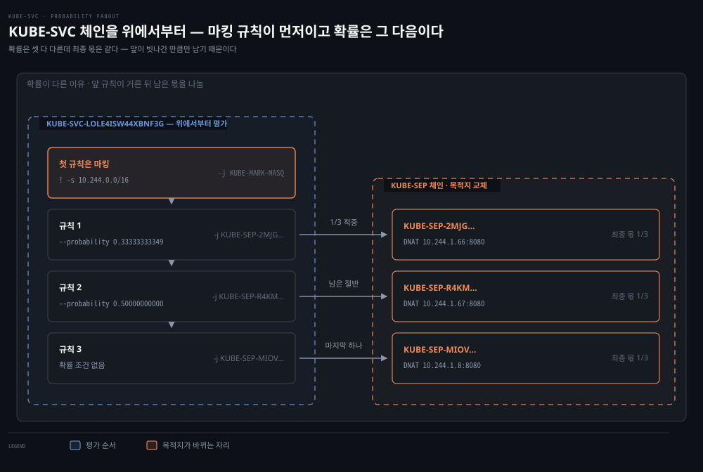

왼쪽이 위에서부터 평가되는 KUBE-SVC 체인이고 오른쪽이 목적지를 바꾸는 KUBE-SEP 체인입니다. 첫 행은 확률과 무관한 마킹 규칙입니다. 곱셈으로 따라가면 규칙 1은 1/3로 적중합니다. 탈락한 2/3가 규칙 2에서 절반씩 갈려 2/3 × 1/2 = 1/3을 받고, 마지막에 남은 몫도 1/3입니다. 확률 조건은 규칙마다 다른데 최종 몫이 같아지는 것이 이 구조의 요점입니다.

`0.33333333349` 가 1/3 과 끝자리가 다른 것은 계산 오류가 아닙니다. kube-proxy 는 확률을 소수 열 자리로 적고, `statistic` 매치는 그 값을 부동소수가 아니라 2^31 단위의 정수로 저장합니다. 그 정수를 십진수로 되돌려 찍으면서 끝자리가 어긋납니다. 오차는 2^-31 수준이라 분배가 눈에 띄게 치우칠 크기는 아닙니다.[^statistic]

### 첫·후속·응답 패킷 — 백엔드는 첫 패킷에서 한 번 고른다

확률 규칙이 매 패킷마다 굴러간다면 같은 연결의 패킷이 서로 다른 Pod 로 흩어질 것입니다. 실제로는 conntrack 이 NAT 변환을 기억하므로, 백엔드를 고르는 일은 연결의 첫 패킷에서 한 번만 일어납니다. 첫 패킷에서 일어나는 일은 순서대로 셋입니다.

1. 연결 추적(-200)이 패킷을 보고, 기존 흐름에 속하지 않으면 새 항목을 잡아 둡니다.
2. nat 의 DNAT(-100)가 규칙을 평가해 백엔드를 고르고, 그 변환을 항목에 붙입니다.
3. 패킷이 로컬로 올라가기 직전(INPUT)이나 노드를 떠나기 직전(POSTROUTING)의 맨 끝에서 확정 단계가 항목을 확정합니다.[^hook-ops]

항목을 만드는 것은 DNAT 가 아니라 그보다 먼저 도는 연결 추적입니다. 이 순서에서 NAT 변환을 처음 결정하는 일과 그것을 적용하는 일이 갈립니다. 항목이 없는 첫 패킷에서만 nat 체인이 평가돼 백엔드가 정해지고, 뒤의 패킷들은 규칙을 다시 고르지 않고 저장된 변환을 적용받습니다.


1~3이 요청, 4~6이 응답이며 nat 규칙을 평가하는 것은 2 한 번뿐입니다. 아래 띠가 `conntrack -E` 로 잡은 실제 항목으로, 한 항목이 튜플 두 개를 쥡니다. 원방향은 클라이언트가 보낸 그대로(`dst=10.96.192.224 dport=8080`)이고, 역방향 기대 튜플은 DNAT 결과를 뒤집은 것(`src=10.244.1.66 sport=8080`)입니다.

Pod 가 보낸 응답이 이 역방향 튜플과 맞으면 커널은 항목을 찾아 출발지를 `10.96.192.224:8080` 으로 되돌립니다. 클라이언트 소켓은 자기가 보낸 주소에서 응답이 왔다고 보므로 연결이 성립합니다. 한 연결의 패킷은 세 처지로 갈립니다.

| | 첫 패킷 (요청) | 후속 패킷 (요청) | 응답 패킷 |
|---|---|---|---|
| conntrack 항목 | 없음 → 새로 만듦 | 원방향 튜플로 찾음 | 역방향 튜플로 찾음 |
| 백엔드 선택 | `KUBE-SVC` 확률 규칙이 고름 | 안 고름 — 저장된 값 적용 | 안 고름 — 저장된 값을 뒤집어 적용 |
| 목적지/출발지 | dst 를 백엔드로 (DNAT) | dst 를 같은 백엔드로 | src 를 ClusterIP 로 (역-DNAT) |

고정되는 것은 nat 변환이지 규칙 평가 전체가 아닙니다. filter 규칙은 후속 패킷에서도 매번 평가되며, 기존 연결이 새 차단 규칙에 안 걸리는 것은 §2 에서 본 대로 앞쪽 `ESTABLISHED` 허용 줄에서 순회가 먼저 끝나기 때문입니다. 겉보기 증상은 "기존 연결은 새 규칙의 영향을 안 받는다"로 같아도 메커니즘이 다릅니다.

### 결정 재사용의 결과 — 장수 연결 쏠림과 롤링 업데이트

이 방식에는 약점이 둘 있습니다. 백엔드 부하에 대한 피드백이 없고, DNAT 결과가 연결의 수명 동안 유지됩니다. 장수 연결이 흔하면 특정 백엔드에 클라이언트가 눌어붙습니다. 원서의 예가 gRPC 입니다. 레플리카 2개로 시작한 gRPC 서비스가 스케일아웃해도, HTTP/2 연결을 재사용하는 기존 클라이언트는 처음의 2개에 계속 붙어 부하가 쏠립니다.

같은 성질이 롤링 업데이트에서도 드러납니다. 백엔드 목록이 바뀌면 kube-proxy 가 `KUBE-SVC` 체인을 갱신하지만, 이미 열린 연결은 갱신된 규칙을 보지 않습니다. conntrack 항목에 갱신 전 결정이 그대로 적혀 있기 때문입니다.

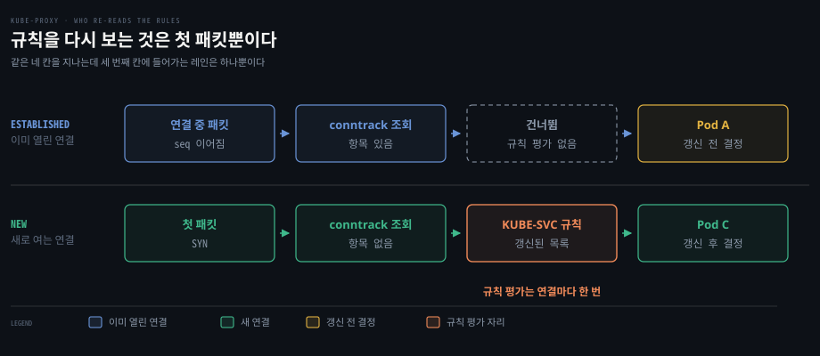

두 레인이 같은 네 칸을 지나는데, 세 번째 칸의 `KUBE-SVC` 규칙에 들어가는 것은 새 연결 레인뿐입니다. 이미 열린 연결이 건너뛰는 것은 nat 의 `KUBE-SVC` 규칙이지 filter 규칙이 아닙니다. 그래서 "규칙은 맞는데 일부만 옛 Pod 로 간다"는 증상에서 확인할 것은 규칙이 아니라 항목입니다. `iptables -t nat -L` 로 체인이 갱신된 것을 확인해도 그것은 새 연결의 이야기이고, 옛 Pod 로 가는 연결은 `conntrack -L` 에 남아 있다가 항목이 만료되거나 연결이 끊겨야 새 규칙을 지납니다.

쏠림을 어떻게 다룰지는 [04-02 §4](./04-02.CNI%EC%99%80%20kube-proxy%20%E2%80%94%20Pod%20%EB%84%A4%ED%8A%B8%EC%9B%8C%ED%81%AC%EC%9D%98%20%EB%B0%B0%EC%84%A0%EA%B3%B5%EA%B3%BC%20%EB%A1%9C%EB%93%9C%EB%B0%B8%EB%9F%B0%EC%84%9C.md)가 정본이고, 모드를 바꿔도 왜 안 풀리는지도 그곳의 세 모드 비교표가 보입니다. 이 편은 그 성질이 DNAT 결과가 conntrack 에 남아 연결 수명 동안 유지된다는 데서 나온다는 것까지만 다룹니다.

### MASQUERADE — 나가는 인터페이스의 주소로 바꾸는 SNAT

이제 출발지 쪽입니다. MASQUERADE 는 SNAT 의 한 종류입니다. SNAT 가 "출발지를 이 주소로 바꿔라"라고 값을 직접 적는다면, MASQUERADE 는 "출발지를 나가는 인터페이스의 주소로 바꿔라"라고 자리를 가리킵니다. 실제 값은 패킷이 나갈 때 커널이 그 인터페이스에서 읽어 채웁니다.

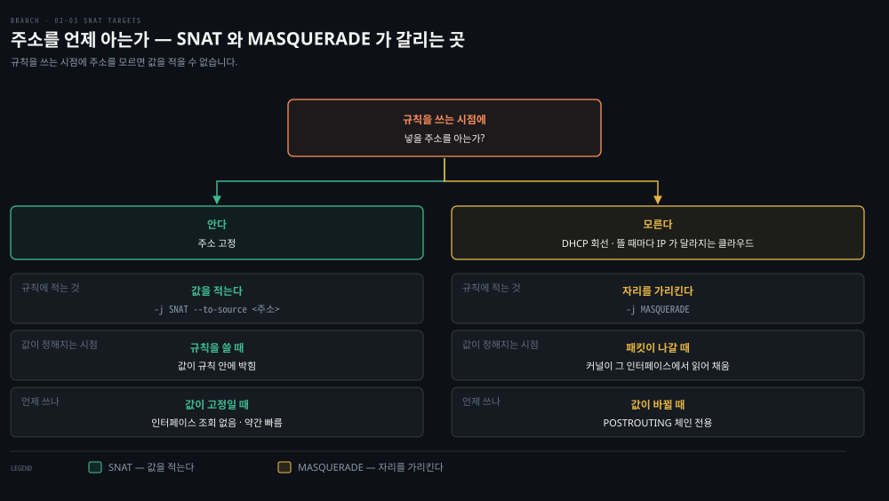

세 칸을 위에서 아래로 읽으면 규칙에 적는 것, 값이 정해지는 시점, 쓰는 때가 차례로 나옵니다. DHCP 로 주소를 받는 회선이나 노드가 뜰 때마다 IP 가 달라지는 클라우드에서는 규칙을 쓰는 시점에 넣을 값이 없어 MASQUERADE 를 씁니다. 반대로 값이 고정이라면 매번 인터페이스를 조회하지 않는 SNAT 가 약간 더 빠릅니다.

가장 단순한 형태는 아래 한 줄입니다. `eth0` 으로 나가는 모든 패킷의 출발지를 `eth0` 의 주소로 바꿉니다.

```bash
iptables -t nat -A POSTROUTING -o eth0 -j MASQUERADE
```

Kubernetes 가 이것을 쓰는 이유는 Pod IP 가 클러스터 밖에서 통하지 않기 때문입니다. Pod 는 `10.244.1.11` 같은 고유 IP 를 갖지만 그 대역은 클러스터 안에서만 라우팅되므로, 그대로 내보내면 응답이 돌아올 길이 없습니다. 출발지를 노드 IP 로 바꾸면 응답은 노드까지 돌아오고, 노드의 conntrack 이 그것을 원래 Pod 로 되돌립니다. 클러스터 밖 서버의 로그에 Pod IP 가 아니라 노드 IP 가 찍히는 것이 이 흔적입니다.

### 조건부 MASQUERADE — mark 0x4000이 두 훅을 잇는다

kube-proxy 의 MASQUERADE 는 위 한 줄처럼 단순하지 않습니다. 출발지를 바꿀지 정하는 자리와 실제로 바꾸는 자리가 서로 다른 훅의 체인에 떨어져 있고, 둘을 mark `0x4000` 이 잇습니다.

- 정하는 자리는 `KUBE-SVC` 체인의 첫 규칙입니다. ClusterIP 로 가는 패킷 가운데 `! -s 10.244.0.0/16` 에 맞는 것을 `KUBE-MARK-MASQ` 로 보내고, 거기서 `-j MARK --set-xmark 0x4000/0x4000` 으로 표시를 붙입니다.[^kube-proxy-src]
- 바꾸는 자리는 한참 뒤 POSTROUTING 의 `KUBE-POSTROUTING` 입니다. 표시가 없으면 `-j RETURN` 으로 그냥 내보내고, 있으면 표시를 지운 뒤 `MASQUERADE --random-fully` 를 실행합니다.

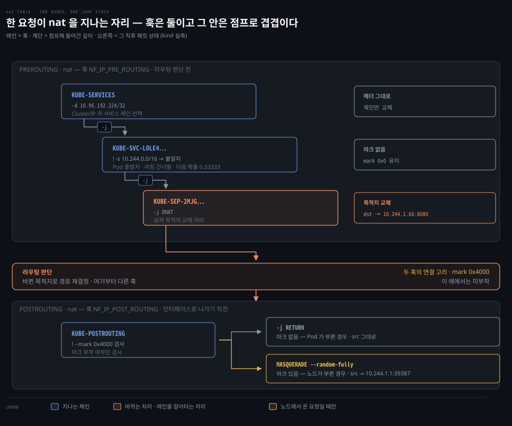

위 띠가 라우팅 판단 전의 PREROUTING, 아래 띠가 나가기 직전의 POSTROUTING 입니다. 띠 안의 계단은 나란한 단계가 아니라 `-j` 로 한 겹씩 점프해 들어간 깊이이고, 오른쪽 칸이 그 직후 패킷 상태(`conntrack -E` 실측)입니다. 아래 띠의 노란 갈래는 노드 발신 패킷입니다. 이 패킷은 위 PREROUTING 띠가 아니라 OUTPUT 훅에서 DNAT 됩니다.

조건이 `! -s 10.244.0.0/16` 이라 Pod 대역에서 온 패킷에는 표시가 붙지 않습니다. 그래서 Pod 가 Service 를 부르면 목적지만 바뀌고 출발지는 그대로 남습니다. 노드에서 같은 ClusterIP 를 부르면 출발 조건 두 가지가 달라 결과가 갈립니다. 출발지 `172.21.0.2` 는 Pod 대역 밖이라 표시가 붙고, 노드가 만든 패킷이라 DNAT 가 OUTPUT 훅의 nat 체인에서 일어납니다. 그 뒤 POSTROUTING 에서 출발지가 `10.244.1.1:39387` 로 바뀌는데, 포트까지 바뀐 것은 `--random-fully` 때문입니다.

| | Pod 발신 (본줄기) | 노드 발신 (대조군) |
|---|---|---|
| 출발지 | `10.244.1.11` — Pod 대역 안 | `172.21.0.2` — Pod 대역 밖 |
| DNAT 이 일어나는 훅 | PREROUTING | OUTPUT |
| `! -s 10.244.0.0/16` | 안 걸림 | 걸림 |
| mark `0x4000` | 안 붙음 | 붙음 |
| POSTROUTING | `RETURN` — 출발지 그대로 | MASQUERADE — 출발지가 노드 주소로 |

같은 ClusterIP 에 같은 요청을 보내도 출발 조건이 다르면 다른 규칙을 지납니다. 둘을 한 경로로 합쳐 외우면 "Pod 가 Service 를 부를 때도 SNAT 된다"는 틀린 그림이 생깁니다.

### 헤어핀과 KUBE-SEP — 확률을 한 번만 굴리려고 체인을 나눈다

헤어핀(hairpin)은 Pod 가 자기가 속한 Service 를 불러 결국 자기에게 되돌아오는 경우입니다. 머리핀처럼 왔던 길로 굽어 돌아온다는 뜻입니다. 출발지와 도착지가 같은 Pod 가 되어 출발지를 그대로 두면 응답이 어긋나므로, kube-proxy 는 이 경우에도 표시를 붙여 MASQUERADE 를 태웁니다. 그 표시 줄이 엔드포인트 체인에 있습니다.

```bash
# 백엔드 10.244.1.66 의 엔드포인트 체인 — 요약. 첫 줄은 출발지가 이 백엔드 자신일 때(헤어핀)만 걸린다
-A KUBE-SEP-2MJG2J3URJK2NCRL -s 10.244.1.66/32 -j KUBE-MARK-MASQ
-A KUBE-SEP-2MJG2J3URJK2NCRL -p tcp -j DNAT --to-destination 10.244.1.66:8080
```

확률 규칙과 이 두 줄을 한 체인에 몰아 넣지 않고 `KUBE-SVC` 와 `KUBE-SEP` 으로 나눈 까닭은 `statistic` 매치가 굴러가는 단위에 있습니다.

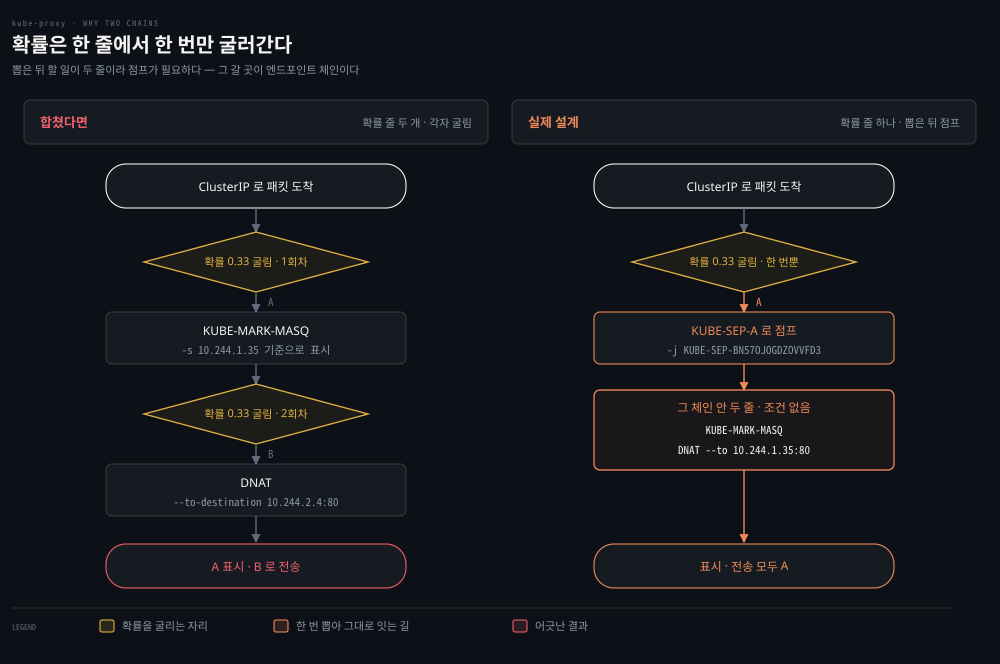

`statistic` 매치는 그것이 붙은 규칙 한 줄에서만 굴러갑니다. 뽑힌 뒤 할 일이 표시 줄과 DNAT 줄 둘인데, 합친 설계라면 같은 확률을 두 줄에 각각 적어야 하고 두 번 따로 굴러갑니다. 앞줄이 A 를 뽑고 뒷줄이 B 를 뽑으면 A 기준으로 표시하고 B 로 보내는 일이 생깁니다. 도식의 주소는 설명용이라 위 사례 값과 다릅니다.

한 줄에 타깃은 하나뿐이므로, 한 번 뽑은 결과로 여러 줄을 실행하려면 그 줄들을 모은 체인으로 점프하는 방법이 가장 직접적입니다. 확률 규칙의 타깃을 엔드포인트 체인으로 두면, 그 안의 두 줄은 확률을 다시 굴리지 않고 순서대로 평가됩니다.


## 4. IPVS — 조회 비용을 해시로 줄인 L4 로드밸런서
> iptables 로드밸런싱의 비용은 패킷마다 드는 조회 비용과 규칙을 고칠 때 드는 갱신 비용 둘입니다. IPVS는 조회 자료구조를 리스트에서 해시로 바꿔 앞쪽을 겨눴고, 백엔드를 고르는 방식도 선택할 수 있게 했습니다.

### 풀려는 문제

앞 절의 확률 fan-out 은 서비스가 몇 개일 때는 잘 돕니다. 서비스와 Pod 가 늘면 노드마다 쌓이는 규칙이 만 단위가 되고, 그 리스트를 패킷마다 순회해야 합니다. 원서가 쓰이던 시기에는 규칙 하나를 더할 때도 룰셋을 통째로 교체해, 배포를 눌렀는데 트래픽이 언제 새 Pod 로 넘어갈지 알 수 없다는 불만도 나왔습니다. 두 불만은 원인이 다른 두 비용에서 나옵니다.

### 조회 비용과 갱신 비용 — 원인이 다르면 해법도 다르다

조회 비용은 구조에서 나옵니다. 규칙이 리스트라 패킷마다 매칭될 때까지 위에서부터 훑어야 하고, 서비스가 늘면 훑을 길이도 늡니다. KEP-3866 도 규칙 수는 서비스 수에 비례하고 모든 패킷이 그 규칙들을 통과해야 한다고 적습니다.[^kep3866] 규모는 곱셈으로 가늠됩니다. 원서의 예로 5,000노드 클러스터에 NodePort 서비스 2,000개 × Pod 10개면 워커 노드마다 최소 20,000개의 레코드가 쌓입니다.

갱신 비용은 규칙을 고칠 때 드는 값입니다. 원서는 서비스 5,000개(규칙 40,000개)에서 규칙 하나를 더하는 데 11분이 걸린다는 수치를 듭니다.[^old-bench] 이 수치는 규칙 하나를 고칠 때 룰셋 전체를 다시 쓰던 방식을 전제로 합니다. Kubernetes v1.28 부터 iptables 모드는 실제로 바뀐 Service·EndpointSlice 자리만 고치므로, 이 수치를 지금 환경에 그대로 대입하지 않습니다.[^minsync]

외울 것은 숫자가 아니라 원인입니다. 조회가 느려지는 이유는 자료구조가 리스트라서이고, 갱신이 느렸던 이유는 부분 갱신이 없어서였습니다. 원인이 다르므로 해법도 갈립니다. 조회 쪽은 자료구조를 해시로 바꿔야 풀립니다. 갱신 쪽은 같은 iptables 안에서도 부분 갱신으로 상당 부분 풀렸습니다.

### IPVS의 선택지 — 스케줄러와 포워딩 방식

IPVS(IP Virtual Server)는 Linux 의 L4 연결 로드밸런서입니다. 가상 서비스를 해시 테이블로 찾고, 랜덤 하나뿐인 iptables 와 달리 백엔드를 고르는 스케줄러를 고를 수 있습니다. 이 절은 원서의 논지를 따라 IPVS 를 다룹니다. 다만 kube-proxy 의 IPVS 모드는 폐기 예정이라 새로 고를 대상은 아닙니다(결정 치트시트).

| 스케줄러 | 코드 | 동작 |
|------|------|------|
| Round-robin | rr | 다음 호스트로 순환 배분 |
| Least connection | lc | 열린 연결이 가장 적은 호스트로 |
| Source hashing | sh | 출발지 주소 기반 결정적 배분 |

원서는 목적지 해싱·최단 예상 지연·무대기(dh·sed·nq)를 더해 여섯을 싣습니다. IPVS 자체는 wrr·wlc 같은 가중치 변형이나 Maglev 해싱인 mh 처럼 더 많은 스케줄러를 갖습니다.[^ipvs-fwd]

호스트를 고른 뒤 같은 호스트에 붙여 두는 세션 어피니티도 IPVS 가 합니다. Kubernetes 에서는 `Service.spec.sessionAffinity` 로 노출되며, 어피니티 시간 창 안의 반복 연결은 같은 호스트로 갑니다.

패킷을 백엔드로 넘기는 포워딩 방식은 셋이고, 패킷의 서로 다른 부분을 바꿉니다.[^ipvs-fwd]

- NAT: 주소를 재작성합니다.
- DR(Direct Routing): IP 는 그대로 둔 채 목적지 MAC 만 바꿔 백엔드로 넘깁니다.
- IP 터널링: 원본 IP 데이터그램을 다른 IP 데이터그램으로 감싸 보냅니다.


행마다 색이 바뀐 칸이 그 방식이 건드리는 부분입니다. NAT 는 IP 헤더, DR 은 MAC 헤더, 터널링은 바깥에 씌운 새 IP 헤더입니다. 범례의 "책이 뒤바꿔 설명한 곳"은 원서가 DR 과 터널링의 설명을 서로 바꿔 적은 자리이며 각주에 원문을 남겼습니다.

`ipvsadm` 으로 직접 만들 수도 있습니다. `-A` 로 가상 서비스를 추가하고 `-a` 로 백엔드를 붙입니다.

```bash
# least-connection 가상 서비스를 만들고 백엔드 둘을 같은 가중치로 붙입니다
# 주소는 문법을 보이기 위한 설명용 값이며 위 kind 사례와 무관합니다
ipvsadm -A -t 1.1.1.1:80 -s lc
ipvsadm -a -t 1.1.1.1:80 -r 2.2.2.2 -m -w 100
ipvsadm -a -t 1.1.1.1:80 -r 3.3.3.3 -m -w 100
```

### L4가 고르는 단위 — 연결 하나에 한 번

IPVS 를 L4 라 부르는 것은 백엔드를 고르는 판단이 연결이 맺어질 때 한 번 일어나고, 그 위에 실리는 요청은 몇 개든 같은 곳으로 가기 때문입니다. §3 에서 conntrack 항목이 그 한 번의 결과를 붙들던 것과 같은 성질입니다. 스케줄러를 `rr` 에서 `lc` 로 바꿔도 고르는 방법이 달라질 뿐 고르는 횟수는 그대로입니다.

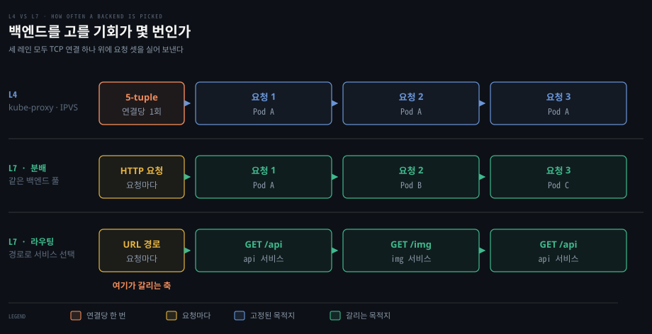

세 레인 모두 연결 하나 위에 요청 셋을 싣고, 갈리는 것은 첫 칸입니다. L4 는 5-tuple 을 보고 연결당 한 번 고르므로 요청 셋이 전부 같은 Pod 로 갑니다. L7 은 요청을 열어 보므로 요청마다 다시 고릅니다.

L7 레인이 둘인 것은 L7 이 하는 일이 둘이라서입니다. 둘째 레인은 같은 백엔드 풀 안에서 요청을 나누는 일이고, 셋째 레인은 URL 경로를 보고 서비스를 고르는 일입니다. L4 와 대비되는 축은 둘째 쪽이라, Ingress 에서 먼저 떠오르는 경로 라우팅만으로 L7 을 이해하면 이 대비가 흐려집니다. 연결 단위라는 성질이 kube-proxy 세 모드에서 어떻게 드러나는지는 [04-02 §4](./04-02.CNI%EC%99%80%20kube-proxy%20%E2%80%94%20Pod%20%EB%84%A4%ED%8A%B8%EC%9B%8C%ED%81%AC%EC%9D%98%20%EB%B0%B0%EC%84%A0%EA%B3%B5%EA%B3%BC%20%EB%A1%9C%EB%93%9C%EB%B0%B8%EB%9F%B0%EC%84%9C.md)가 정본입니다.


## 5. eBPF와 Cilium — 규칙 대신 검증된 프로그램을 커널에 붙인다
> eBPF는 정해진 규칙 대신 verifier를 통과한 프로그램을 커널 훅에 붙이고, 맵으로 상태를 찾습니다. Cilium은 그 위에서 kube-proxy의 L3/L4 서비스 처리를 대체하고, L7은 유저스페이스의 Envoy로 넘깁니다.

### 풀려는 문제

IPVS 로 조회 비용은 줄었지만, 커널에 넣을 수 있는 것은 여전히 정해진 규칙 문법입니다. 판단은 커널이 미리 제공하는 매치·타깃과 자료구조를 조합하는 범위 안에서만 표현할 수 있습니다. 그래서 질문이 바뀝니다. 정해진 문법의 규칙을 커널에 넣는 대신, 검사를 통과한 프로그램을 짜서 커널 안에서 돌리면 어떨까요? 그 답이 eBPF 입니다. Cilium 은 그 위에서 kube-proxy 를 대체합니다.

### 프로그램과 맵 — 제어는 유저스페이스, 데이터 처리는 커널

eBPF(extended Berkeley Packet Filter)는 샌드박스된 프로그램을 커널 안에서 실행하는 시스템입니다. 프로그램은 커널 훅에 붙어 이벤트마다 돌고, 맵은 커널과 유저 공간이 데이터를 주고받는 eBPF 의 저장소입니다.[^bpfmaps] 전신인 classic BPF(cBPF)는 tcpdump 가 쓰는 패킷 필터였고 맵이 없습니다. 자세한 내용은 심화 학습에 있습니다.

eBPF 와 iptables 의 차이를 "iptables 는 패킷마다 커널과 유저 공간을 오가고 eBPF 는 그러지 않는다"로 잡으면 틀립니다. 두 쪽 모두 제어는 유저스페이스에서, 데이터 처리는 커널 안에서 합니다.

| 갈래 | 하는 일 | 유저스페이스가 개입하는가 | iptables | eBPF |
|------|---------|------|------|------|
| 제어 (control) | 규칙·맵을 설치하고 갱신 | 개입함 | `iptables` 명령이 룰셋을 씀 | `bpf()` 시스템콜로 프로그램·맵을 올림 |
| 데이터 (data) | 실제 트래픽을 처리 | 개입하지 않음 | 커널이 규칙을 평가 | 커널이 붙은 프로그램을 실행 |

iptables 에서 패킷의 판정을 유저스페이스에 넘기는 것은 `NFQUEUE` 타깃을 명시적으로 걸었을 때뿐이고, man 페이지도 그것을 이 타깃의 고유 동작으로 따로 적습니다. 로그용 사본을 유저스페이스 로깅 백엔드로 보내는 `NFLOG` 도 있지만 판정은 넘기지 않습니다.[^nfqueue] kube-proxy 가 유저스페이스 프로세스인 것도 제어 쪽 이야기로, 규칙을 써 넣을 뿐 패킷을 직접 만지지 않습니다. 둘의 차이는 넣을 수 있는 것이 고정된 규칙 문법인가 임의의 프로그램인가, 그리고 찾는 자료구조가 리스트인가 맵인가에 있습니다.

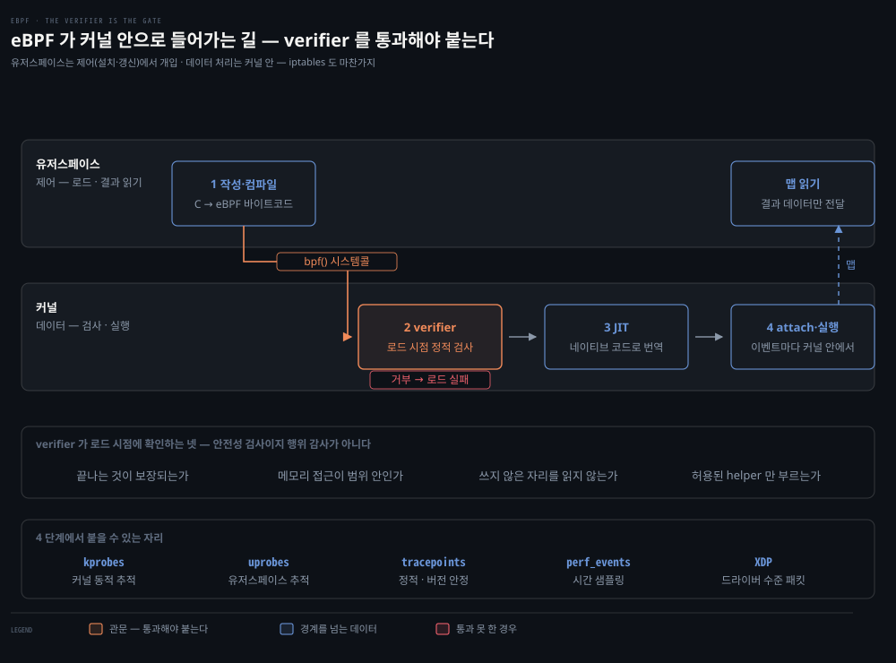

위가 유저스페이스, 아래가 커널이고 번호 순으로 읽습니다. `bpf()` 시스템콜로 제어가 내려가고, 붙은 프로그램은 이벤트마다 커널 안에서 돕니다. 결과는 맵을 통해 올라옵니다. 핵심은 2번 verifier 가 관문이라는 점입니다. 여기서 거부되면 프로그램은 붙지 못하고 로드가 실패합니다.

### verifier — 검사를 통과한 프로그램만 붙는다

프로그램을 로드하면 커널의 verifier 가 그것을 통째로 정적 검사합니다. 돌려 보고 판단하는 것이 아니라, 실행하기 전에 가능한 경로를 미리 훑어 다음을 확인합니다.[^verifier]

- 끝나는 것이 보장되는가 — 초기 eBPF는 제어 흐름 그래프에서 반복을 찾아 통째로 거부했고, 지금은 상한이 증명되는 유계 루프만 받습니다
- 메모리 접근이 허용 범위 안인가 — 스택·맵·패킷 버퍼의 경계와 정렬을 검사하고 그 밖을 건드리면 거부합니다
- 쓰지도 않은 자리를 읽지 않는가 — 한 번도 쓴 적 없는 레지스터나 스택 칸은 읽을 수 없습니다
- 부르는 것이 커널이 허용한 helper 함수인가 — 프로그램 종류마다 부를 수 있는 함수 목록이 따로 정해져 있습니다

verifier 가 푸는 것은 성능이 아니라 신뢰이고, 성능은 맵 조회 쪽 이야기입니다. 커널 안에서 코드를 돌리는 방법은 원래 커널 모듈뿐이었습니다. 모듈은 버그 하나가 시스템 전체를 내립니다. 무한 루프면 그 CPU 가 멈추고 잘못된 포인터면 커널 패닉입니다. 그래서 새 커널 코드를 프로덕션 노드에 넣는 일은 사람의 리뷰와 신뢰에 기댄 큰 결심이었습니다.

verifier 는 그 결심을 기계 검사로 바꿉니다. 검사에 걸리면 프로그램은 아예 붙지 못하므로, 커널을 다시 빌드하거나 재부팅하지 않고 실행 중인 커널에 기능을 넣는 일이 현실적인 선택이 됩니다. Cilium 이 노드마다 커널 모듈을 배포하는 대신 프로그램을 붙여 kube-proxy 를 대체할 수 있는 배경입니다. 다만 이것이 커널 장애가 불가능해진다는 뜻은 아니며, eBPF 공식 사이트는 범위를 이렇게 한정합니다.[^verifier-scope]

> "The verifier is meant as a safety tool, checking that programs are safe to run. It is not a security tool inspecting what the programs are doing."

대가는 표현력입니다. 검사를 통과하려면 프로그램이 무한 루프 금지, 스택 크기 상한, 임의 커널 함수 호출 금지 같은 제약을 받아들여야 합니다. verifier 가 모든 경로를 끝까지 따져 볼 수 있도록 프로그램의 복잡도에도 상한이 있습니다. eBPF 로 못 쓰는 프로그램이 있는 것은 언어가 약해서가 아니라 검사를 통과할 수 있는 것만 쓰게 되어 있기 때문입니다.

### 네트워크 어태치 지점 — XDP·TC·소켓 훅

eBPF 프로그램은 소켓 필터 말고도 붙을 자리가 많고, 붙는 자리가 곧 패킷 경로의 어디서 도는지를 정합니다.

| 어태치 지점 | 도는 시점 | 쓰임 |
|---|---|---|
| XDP | NIC 드라이버 직후, 드라이버가 지원하는 native 모드에서는 커널이 패킷 구조체(skb)를 만들기 전 | 가장 이른 처리 — 여기서 버린 패킷은 conntrack 을 거치지 않음 |
| TC ingress · egress | skb 를 만든 뒤. ingress 는 netfilter 의 PREROUTING 보다 앞 | Cilium 의 주된 데이터패스 |
| cgroup 소켓 훅 (connect · sendmsg 등) | 소켓 시스템콜 시점 | 연결 시점에 Service 주소를 바꾸는 소켓 수준 로드밸런싱 |
| kprobe · uprobe · tracepoint · perf_events | 커널·유저 함수 호출, 정적 추적점, 시간 샘플링 | 추적과 관측 — tracepoint 는 kprobe 보다 버전 간에 안정적 |

TC ingress 가 PREROUTING 보다 앞서 돌기 때문에, TC 에서 Service 변환을 끝낸 패킷은 그 변환을 위해 iptables 의 nat 규칙 목록을 훑지 않아도 됩니다. native 모드의 XDP 는 그보다 더 앞이라, 여기서 버리는 패킷은 커널이 패킷 구조체를 만드는 비용조차 치르지 않습니다.

### Cilium의 kube-proxy 대체 범위 — L3/L4는 커널, L7은 Envoy

eBPF 와 Cilium 은 같은 것이 아닙니다. eBPF 는 커널 기술이고, Falco 같은 런타임 보안 도구나 추적 도구도 그것을 씁니다. Cilium 은 그 위에 얹힌 CNI 소프트웨어입니다. 공식 문서도 eBPF 를 "a new Linux kernel technology"라 부르고 자신을 그것을 쓰는 소프트웨어로 소개합니다. Kubernetes 에서 eBPF 의 가장 흔한 사용처가 Cilium 입니다.

Cilium 이 kube-proxy 대신 처리하는 범위는 L3/L4 입니다. `ClusterIP`·`NodePort`·`LoadBalancer`·`externalIPs` 서비스와 `hostPort` 를 eBPF 프로그램이 커널 안에서 처리합니다.[^cilium-kpr] 노드 인터페이스의 TC 훅과 소켓 수준의 cgroup 훅에서 Service 변환을 하므로 kube-proxy 의 규칙 목록이 필요 없습니다.

조회는 리스트를 훑는 대신 BPF 맵에서 찾습니다. 다만 비용은 구현이 고른 맵 타입에 달렸습니다. 커널 문서가 드는 맵만 해도 해시·배열·블룸 필터·radix tree(LPM trie)가 있고, 최장 접두 매칭을 하는 LPM trie 는 해시처럼 한 번에 끝나지 않습니다.[^bpfmaps]

L7 은 같은 경로가 아닙니다. L7 정책이나 L7 로드밸런싱을 켜면 그 트래픽은 커널에서 끝나지 않고 유저스페이스의 Envoy 프록시로 넘어갑니다. 출발지 마스커레이드도 Cilium 문서가 eBPF 기반과 iptables 기반 구현을 나눠 둔 영역입니다.[^cilium-kpr] 그래서 "Cilium 이니까 전부 커널 안, netfilter 밖"은 L3/L4 Service 변환까지만 맞는 그림입니다.

### 세 구현을 나란히 — 차이는 찾는 방법과 넣을 수 있는 것

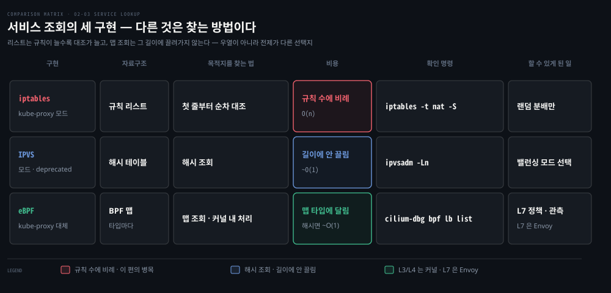

행이 구현이고 비용 열이 핵심입니다. 리스트는 규칙이 늘수록 대조 횟수가 늘지만 해시와 맵 조회는 그 길이에 끌려가지 않습니다. 할 수 있는 일도 갈립니다. iptables 의 분배 전략은 랜덤 하나입니다. IPVS 에는 스케줄러 선택이 있고, eBPF 구현에서는 Envoy 와 함께 L7 정책과 관측까지 들어옵니다. 다만 셋 모두 L4 에서는 연결마다 한 번 백엔드를 고르므로, §3 의 장수 연결 쏠림은 구현을 바꿔도 남습니다.

셋을 진화 단계로 읽지는 않는 편이 좋습니다. 셋은 나란히 살아 있는 선택지이고 같은 줄에 선 것도 아닙니다. iptables 와 IPVS 는 kube-proxy 의 모드이고 eBPF 구현은 kube-proxy 를 걷어내는 쪽이며, 그 사이에 kube-proxy 의 `nftables` 모드가 따로 있습니다. 실제 판단은 조회·갱신·상태 관리·전제 조건·운영 부담 다섯 축에서 갈립니다. 현재 상태와 함께 본 기준은 결정 치트시트에 있습니다.

> 💬 **비유**: 앞 편의 공항을 이어 가면, 검문소 직원이 든 규정집이 iptables 규칙 목록입니다. iptables 는 직원이 규정집을 첫 장부터 넘기며 대조하는 방식이라 규정이 길수록 승객 한 명당 시간이 늘어납니다. IPVS 는 배분 전략(순환·최소 대기줄)을 고르는 전담 창구를 따로 두는 방식이고, eBPF 는 검색대 자체에 프로그램을 심어 규정집 대신 색인에서 찾게 하는 방식입니다.
>
> 비유가 닿지 않는 곳도 있습니다. 세 경우 모두 판단은 검문소 안에서 끝나며, 직원이 매번 본부에 전화를 거는(유저스페이스로 올라가는) 그림이 아닙니다.


## 심화 학습
> 원서 밖에서 보강했거나 본문에서 옮겨 온 세부입니다. 개념은 본문, 버전 현황은 결정 치트시트, 출처는 각주에 둡니다.

- `iptables` 명령의 nftables 백엔드(`iptables-nft`)와 kube-proxy 의 `nftables` 모드는 다른 것입니다. `iptables -V` 에 `(nf_tables)` 가 붙어 나오면 `iptables` 문법은 그대로 두고 커널 API 만 nftables 로 바꾼 호환 계층을 쓰는 것입니다. `--proxy-mode=nftables` 는 kube-proxy 가 nftables 문법으로 규칙을 직접 쓰는 모드입니다. KEP-3866 은 이 구분을 "The `nf_tables` mode of `/sbin/iptables` will not save us" 절로 따로 설명합니다. 백엔드만 바꿔서는 nftables 의 맵 같은 기능을 쓸 수 없고 성능 개선도 대부분 가져오지 못하기 때문입니다.[^kep3866]
- eBPF 는 kube-proxy 의 모드가 아닙니다. KEP-3866 은 eBPF 기반 프록시 구현을 대안으로 검토했다가 채택하지 않은 기록을 "Create an eBPF-based proxy implementation" 항목에 남겼습니다. Cilium 같은 eBPF 구현은 kube-proxy 를 걷어내고 그 자리를 대신합니다.
- cBPF 와 tcpdump — `tcpdump -i em1 port 22` 같은 명령을 주면 libpcap 이 그것을 cBPF 프로그램으로 컴파일하고 `SO_ATTACH_FILTER` 로 커널에 붙여, 커널이 그 필터로 패킷을 거릅니다.[^cbpf] 걸러진 패킷이 tcpdump 로 올라오는 통로는 맵이 아니라 `PACKET_MMAP` 링 버퍼입니다. 커널 문서는 이것을 "a size configurable circular buffer mapped in user space"라 적고, 그 덕에 대부분의 경우 시스템콜 없이 패킷을 읽는다고 덧붙입니다.[^pktmmap]
- eBPF 의 다른 쓰임 — 원서는 cgroup-bpf(Linux 4.10+)로 Pod·컨테이너 수준 네트워크 통계를 모으는 추적, kubectl exec 세션에서 실행된 명령을 기록하는 감사, Falco 같은 런타임 보안 도구를 듭니다. 원서가 함께 드는 seccomp 는 작성 형식이 cBPF 입니다. 로드 인터페이스가 `sock_fprog` 라 cBPF 만 받고, 커널이 그것을 내부에서 eBPF 표현으로 바꿔 실행합니다.[^seccomp]
- TC 와 qdisc — TC 는 큐잉·셰이핑·필터링·policing 을 맡는 Linux 네트워크 계층의 훅이고, eBPF 가 가장 흔히 붙는 자리입니다. 인터페이스의 송신 쪽에는 qdisc(보통 `pfifo_fast` 또는 `fq_codel`)가 붙어 있고, 수신 쪽 ingress qdisc 는 `tc qdisc add dev <인터페이스> ingress` 로 추가해야 생깁니다.[^tc] qdisc 안에 class 와 filter 가 트리로 쌓이고 filter 가 패킷을 분류해 class 로 보냅니다. Cilium 은 노드 인터페이스의 ingress·egress TC 훅에 프로그램을 붙여 Service 변환·NetworkPolicy 평가·Pod 식별·메트릭 수집을 합니다.
- Cilium 의 kube-proxy 대체 구성은 [Cilium 공식 문서 — Kubernetes without kube-proxy](https://docs.cilium.io/en/stable/network/kubernetes/kubeproxy-free/)에서 따라 해 볼 수 있습니다. BPF 로드밸런싱 표를 들여다보는 명령은 [`cilium-dbg bpf lb list`](https://docs.cilium.io/en/stable/cmdref/cilium-dbg_bpf_lb_list/)입니다. 디버그 CLI 는 Cilium 1.15 에서 `cilium-dbg` 로 이름이 바뀌었으므로 옛 자료의 `cilium bpf lb list` 는 그대로 동작하지 않습니다.[^cilium-dbg]
- §3 의 mark `0x4000` 은 원서에 없는 내용이라 kind 클러스터(v1.35.0)에서 직접 뽑아 확인했습니다. 비트 위치는 `--iptables-masquerade-bit` 으로 바꿉니다. 실행 중인 바이너리의 `kube-proxy --help` 는 이 플래그를 "the bit of the fwmark space to mark packets requiring SNAT with (default 14)"라 설명합니다. `1 << 14` 가 `0x4000` 입니다. 플래그 목록은 [kube-proxy 레퍼런스](https://kubernetes.io/docs/reference/command-line-tools-reference/kube-proxy/)에 있습니다.
- 원서의 확률 예시는 백엔드가 넷인 서비스라 0.25 → 0.33 → 0.5 → 무조건입니다. §3 의 공식 1/(n-i+1)에 n=4 를 넣은 결과이고, 원서 출력의 `0.33332999982` 는 당시 kube-proxy 가 확률을 소수 다섯 자리(`0.33333`)로 적었기 때문에 나온 값으로, 1/3 과의 차이가 2^31 단위보다 훨씬 큽니다.[^statistic]

### 규칙 매칭과 eBPF 어태치를 확인하는 명령
> 원서 밖 보강입니다. `iptables-extensions(8)`·nftables wiki·`tc(8)`·`bpftool(8)` 을 근거로 `02_os/networking` 에서 옮겨 왔습니다.

규칙이 실제로 매칭되는지는 LOG 타깃이나 `nftrace` 로 봅니다.

```bash
iptables -t nat -A PREROUTING -d 10.96.50.20 -j LOG --log-prefix "MATCH: "
journalctl -kf | grep "MATCH:"

nft monitor trace
nft 'add rule inet filter input ip saddr 10.244.0.5 meta nftrace set 1'
```

TC 와 BPF 의 어태치 상태는 다음 명령으로 봅니다.

```bash
tc qdisc show dev eth0
tc filter show dev eth0 ingress
bpftool net show                            # 모든 BPF 어태치 포인트
bpftool prog show                           # 로드된 BPF 프로그램
bpftool map show
bpftool prog dump xlated id <prog_id>
cat /sys/kernel/debug/tracing/trace_pipe    # bpf_trace_printk 출력
```


## 결정 치트시트
> 우열이나 세대 순서가 아니라 조회·갱신·상태·전제·운영 부담 다섯 축으로 가릅니다. 버전 현황은 이 절에만 적습니다.

현황은 2026-09-21 에 Kubernetes 문서 최신판(v1.37)과 KEP 로 확인했습니다.[^minsync] Linux 에서 kube-proxy 가 고를 수 있는 모드는 `iptables`·`ipvs`·`nftables` 셋이고 Windows 는 `kernelspace` 하나입니다. 기본값은 여전히 `iptables` 이며, 문서는 앞으로 기본값을 `nftables` 로 바꿀 것이라 적습니다.

`nftables` 모드는 1.29 알파·1.31 베타를 거쳐 1.33 에서 GA 가 됐고 커널 5.13 이상을 요구합니다.[^kep3866] `ipvs` 모드는 v1.35 에 deprecated 됐으며 v1.40 부터 기본 비활성, v1.43 에 제거될 예정입니다.[^kep5495] Cilium 같은 eBPF 구현은 모드가 아니라 kube-proxy 를 대체하는 별개 선택지입니다.

| 상황 | 선택 | 이유 |
|------|------|------|
| 서비스·엔드포인트 수가 적고 표준 구성 | iptables 모드 | 기본값이고 자료와 디버깅 경험이 가장 많음. v1.28 부분 갱신으로 옛 갱신 지연 논거는 상당 부분 해소 |
| 규모가 커 조회·갱신 비용을 줄여야 하고 커널 5.13+ 를 쓸 수 있음 | nftables 모드 | iptables 모드의 구조적 한계를 정면으로 겨눈 후속 모드. 기본값이 아니므로 명시 지정 필요 |
| 기존 클러스터가 IPVS 모드로 운영 중 | 이전 계획을 세울 때 | deprecated 이고 비활성·제거 일정이 정해져 신규 채택 대상이 아님 |
| L7 정책·관측이 필요하고 CNI까지 바꿀 수 있음 | eBPF (Cilium) | kube-proxy 대체. L3/L4는 커널 안에서, L7은 Envoy 유저스페이스 프록시 경유. CNI 교체라 운영 부담이 가장 큼 |
| 장수 연결(gRPC)의 부하 쏠림 | 프록시 구현 교체로는 부족 | 연결 단위 분배라는 성질을 셋이 공유하기 때문. 무엇으로 접근할지는 [04-02 §4](./04-02.CNI%EC%99%80%20kube-proxy%20%E2%80%94%20Pod%20%EB%84%A4%ED%8A%B8%EC%9B%8C%ED%81%AC%EC%9D%98%20%EB%B0%B0%EC%84%A0%EA%B3%B5%EA%B3%BC%20%EB%A1%9C%EB%93%9C%EB%B0%B8%EB%9F%B0%EC%84%9C.md) |

다섯 축으로 나란히 놓으면 우열이 아니라 교환 관계가 보입니다.

| 축 | iptables | IPVS | nftables 모드 | eBPF (Cilium) |
|------|------|------|------|------|
| 조회 | 규칙 리스트 순차 대조 | 해시 테이블 | 맵·셋 기반 조회 | BPF 맵 조회 (맵 타입에 따라 비용이 다름) |
| 갱신 | v1.28부터 바뀐 자리만 | 커널 객체 단위 갱신 | 부분 갱신 전제로 설계 | 맵 항목 갱신 |
| 상태 관리 | conntrack | conntrack | conntrack | 자체 맵 + conntrack (구성에 따라) |
| 전제 조건 | 사실상 없음 | IPVS 커널 모듈 · deprecated | 커널 5.13+ | CNI 교체 · 커널 요구 높음 |
| 운영 부담 | 가장 낮음 | 낮으나 수명이 정해짐 | 낮음 | 가장 높음 (CNI·관측 스택까지 함께) |


## 면접에서 받을 만한 질문
> 먼저 스스로 답을 소리 내어 말해 본 뒤, 아래 §정답 섹션을 펼쳐 맞춰 봅니다.

1. **규칙 추적** — `INPUT` 체인(filter)이 아래 순서로 놓여 있습니다. 포트 22로 들어온 패킷이 `10.0.0.9`에서 왔다면, 실행되는 줄을 순서대로 모두 적고 마지막에 이 패킷이 어떻게 되는지 답하세요. `10.0.0.1`에서 왔다면 무엇이 달라집니까?

   ```bash
   iptables -A INPUT -p tcp --dport 22 -j LOG --log-prefix "ssh-try"
   iptables -A INPUT -p tcp --dport 22 -j incoming-ssh
   iptables -A INPUT -p tcp --dport 22 -j REJECT
   # incoming-ssh 체인
   iptables -A incoming-ssh -s 10.0.0.1 -j ACCEPT
   iptables -A incoming-ssh -j RETURN
   ```

2. **확률 계산** — 백엔드가 셋인 서비스의 KUBE-SVC 규칙은 1/3 → 1/2 → 조건 없음입니다. 세 값이 서로 다른데 세 백엔드가 각각 1/3씩 받는 이유를 곱셈으로 보이세요. 마지막 줄에 `probability 0.33333`을 적어 넣으면 무엇이 깨집니까?

3. **정보 재사용** — 같은 연결의 첫 요청 패킷·후속 요청 패킷·응답 패킷은 각각 무엇을 근거로 목적지(또는 출발지)를 정합니까? 셋 중 `KUBE-SVC` 체인의 확률 규칙을 실제로 평가하는 것은 무엇입니까?

4. **기존 연결 판단** — 운영 중 `-A INPUT -s 10.0.0.9 -j DROP`을 넣었는데 그 IP에서 이미 붙어 있던 SSH 세션이 끊기지 않습니다. "기존 연결은 filter 규칙을 평가하지 않기 때문"이라는 설명은 맞습니까? 실제로 무슨 일이 일어나는지 평가 순서로 설명하고, 끊으려면 무엇을 해야 하는지 두 가지를 드세요.

5. **경계 구분** — "iptables는 패킷마다 커널과 유저 공간을 오가지만 eBPF는 커널 안에서 끝낸다"는 설명의 어디가 틀렸습니까? 유저스페이스가 실제로 개입하는 자리는 각각 어디이고, iptables에서 패킷이 유저스페이스로 올라가는 예외는 무엇입니까?

6. **쏠림 진단** — gRPC 서비스를 스케일아웃했는데 새 Pod에 트래픽이 거의 안 갑니다. 원인 후보는 (가) 규칙 갱신이 늦어 새 엔드포인트가 아직 안 반영됨, (나) 기존 장수 연결이 옛 Pod에 고정됨 둘입니다. 둘을 어떻게 구분해 확인합니까? 프록시 구현을 IPVS나 eBPF로 바꾸면 각각 어느 쪽이 해결되고 어느 쪽이 남습니까?

### 빈칸 채우기 — 구성과 실행

구성으로 보면 `(1)____`이 체인을 담고 체인이 규칙을 담습니다. 실행으로 보면 패킷이 도달한 `(2)____`에 등록된 처리들이 `(3)____` 순으로 돕니다. 그래서 `mangle`의 INPUT과 `filter`의 INPUT은 이름이 같아도 `(4)____`입니다.


## 정답 (자답 후 펼치기)
> 위 여섯 문제와 빈칸에 먼저 답한 뒤 읽으세요. 먼저 답해 봐야 어디서 막혔는지가 드러나고, 모두 본문과 결정 치트시트로 풀립니다.

### 정답 1 — 규칙 추적

판정: `10.0.0.9` 에서 온 패킷은 `REJECT` 로 거부되고, `10.0.0.1` 에서 온 패킷은 filter 순회가 끝나 `REJECT` 에 닿지 않습니다.

`10.0.0.9` 일 때 평가를 거치는 줄은 다섯이고, 그중 3번은 조건이 안 맞아 타깃이 실행되지 않습니다.

1. `-j LOG` — 로그를 남기고 평가가 계속됩니다.
2. `-j incoming-ssh` — 서브체인으로 점프합니다.
3. `-s 10.0.0.1 -j ACCEPT` — 출발지가 안 맞아 걸리지 않고 다음 줄로 갑니다.
4. `-j RETURN` — 판정 없이 부모 체인으로 돌아옵니다.
5. `-j REJECT` — 점프한 줄의 다음 줄이라 여기 걸려, 거부 사유와 함께 버려집니다.

핵심 이유: LOG 는 비종결, RETURN 은 체인만 끝내고, ACCEPT 는 테이블 순회를 끝냅니다. `10.0.0.1` 은 3번의 `ACCEPT` 에 걸려 부모 체인의 `REJECT` 에 닿지 않습니다.

대표 오해: `LOG` 에서 평가가 끝난다고 보는 것, 그리고 `RETURN` 을 "허용"으로 읽는 것입니다. `RETURN` 은 판정이 아니라 자리 이동이라 부른 곳의 다음 줄로 돌아갈 뿐이고, 이 예제에서는 그 다음 줄이 `REJECT` 라 결국 막힙니다.

### 정답 2 — 확률 계산

판정: 세 백엔드가 각각 1/3 을 받습니다. 마지막 줄에 `0.33333` 을 적으면 세 규칙을 모두 빠져나가는 패킷이 생깁니다.

각 규칙에 도달할 확률에 그 규칙의 확률을 곱합니다.

- 규칙 1: 도달 확률 1 × 1/3 = 1/3
- 규칙 2: 도달 확률 (1 − 1/3) = 2/3, 여기에 × 1/2 = 1/3
- 규칙 3: 도달 확률 2/3 × (1 − 1/2) = 1/3, 조건이 없으므로 × 1 = 1/3

핵심 이유: 각 규칙은 전체가 아니라 남은 후보에 대한 조건부 확률을 적습니다. i번째에 도달했다면 후보가 n−i+1개 남았으므로 1/(n−i+1)이 되고, 마지막 줄의 "조건 없음"은 뺄셈으로 남은 몫을 받는 자리입니다.

대표 오해: 마지막 줄에도 1/3 을 적어야 공평하다고 보는 것입니다. 그러면 그 줄에서도 탈락한 패킷이 KUBE-SVC 체인 끝에 닿아 어느 백엔드로도 가지 못합니다.

### 정답 3 — 정보 재사용

판정: 확률 규칙을 실제로 평가하는 것은 첫 요청 패킷뿐입니다.

- 첫 요청 패킷 — conntrack 에 항목이 없어 nat 체인이 평가되고, `KUBE-SVC` 의 확률 규칙이 여기서 한 번 백엔드를 고릅니다. 그 결과가 항목에 기록됩니다.
- 후속 요청 패킷 — 원방향 튜플로 항목을 찾아 이미 정해진 변환을 적용합니다.
- 응답 패킷 — 역방향 기대 튜플로 같은 항목을 찾아 변환을 뒤집어 적용하고, 출발지가 백엔드 주소에서 ClusterIP 로 돌아갑니다.

핵심 이유: NAT 변환을 처음 결정하는 일과 적용하는 일이 다르고, conntrack 항목이 그 결정을 기억합니다.

대표 오해: "연결이 맺어지면 규칙을 아무것도 안 본다"로 넓히는 것입니다. 고정되는 것은 nat 변환이고, filter 규칙은 패킷마다 그대로 평가됩니다(정답 4).

### 정답 4 — 기존 연결 판단

판정: 맞지 않습니다. filter 규칙은 그 연결의 모든 패킷에 대해 매번 평가됩니다.

핵심 이유: 순서 문제입니다. 방화벽 체인 앞쪽의 `-m conntrack --ctstate ESTABLISHED,RELATED -j ACCEPT` 에 기존 연결의 패킷이 먼저 걸리고, `ACCEPT` 가 filter 순회를 끝냅니다. `-A` 로 뒤에 붙인 `DROP` 은 그 아래에 있어 도달하지 못합니다. 끊는 방법은 둘입니다. `-I` 로 그 `ACCEPT` 보다 앞에 규칙을 끼우거나, `conntrack -D` 로 해당 항목을 지워 다음 패킷이 `ESTABLISHED` 로 분류되지 않게 합니다.

대표 오해: 기존 연결이 filter 를 건너뛴다고 보는 것입니다. 평가를 건너뛴 것이 아니라 새 규칙까지 가기 전에 끝난 것입니다.

### 정답 5 — 경계 구분

판정: 앞부분이 틀렸습니다. iptables 도 패킷 처리는 커널 안에서 끝납니다.

핵심 이유: 유저스페이스가 개입하는 자리는 양쪽 다 제어입니다. iptables 는 `iptables` 명령(그리고 kube-proxy)이 규칙을 설치·갱신할 때, eBPF 는 `bpf()` 시스템콜로 프로그램과 맵을 올릴 때 개입합니다. iptables 에서 패킷의 판정이 유저스페이스로 넘어가는 예외는 `NFQUEUE` 타깃을 명시적으로 걸었을 때입니다. `NFLOG` 는 로그용 사본만 올려 보냅니다.

대표 오해: 둘의 차이를 "경계를 넘느냐"로 잡는 것입니다. 진짜 차이는 넣을 수 있는 것이 정해진 규칙 문법인가 임의의 프로그램인가, 그리고 찾는 자료구조가 리스트인가 맵인가입니다.

### 정답 6 — 쏠림 진단

판정: 규칙과 연결을 따로 보면 둘이 갈립니다. 프록시 구현을 바꾸면 갱신 지연은 줄어들 수 있지만 쏠림은 남습니다.

핵심 이유: 갱신 문제라면 노드에서 `iptables -t nat -S | grep <서비스>` 로 새 엔드포인트의 KUBE-SEP 규칙이 있는지 봅니다. 없으면 아직 반영되지 않은 것입니다. 규칙은 다 있는데 트래픽만 안 가면 쏠림 쪽이고, `conntrack -L` 로 옛 Pod 를 향한 항목이 오래 살아 있는지와 새로 맺는 연결은 잘 분산되는지를 봅니다. 갱신 비용은 구현마다 다르므로(§4, 치트시트의 "갱신" 행) 갱신 지연은 구현을 바꿔 줄일 수 있습니다. 반면 쏠림은 셋 모두가 연결 단위로 분배한다는 공통 성질에서 나옵니다(§3·§5).

대표 오해: IPVS 나 eBPF 로 바꾸면 쏠림도 풀린다고 보는 것입니다. 이미 맺어진 HTTP/2 연결은 iptables 든 IPVS 든 eBPF 든 중간에 옮겨지지 않습니다. 쏠림은 클라이언트 측 로드밸런싱이나 주기적 재연결처럼 연결 수명을 다루는 방법으로 접근합니다.

### 정답 빈칸 — (1)`테이블` (2)`훅` (3)`우선순위` (4)`서로 다른 체인`

구성에서는 테이블이 체인을, 체인이 규칙을 담습니다. 실행에서는 훅에 등록된 처리들이 우선순위 숫자가 작은 것부터 돕니다. 테이블마다 자기 체인을 따로 가지므로 이름이 같아도 규칙 목록은 별개이고, 두 체인이 공유하는 것은 목록이 아니라 같은 훅에 걸려 있다는 자리입니다.


## 핵심 개념 체크리스트
> 일곱 항목을 막힘없이 답할 수 있으면 다음 편으로 넘어가도 좋습니다. 수치를 외웠는지가 아니라 원인과 조건을 말할 수 있는지를 묻습니다.
- [ ] 테이블 5종의 책임과 훅 5종의 발화 시점을 짝지을 수 있는가?
- [ ] `mangle`의 INPUT과 `filter`의 INPUT이 왜 별개의 체인인지, 둘이 공유하는 것이 무엇인지 말할 수 있는가?
- [ ] 실행 순서를 "훅에 등록된 것이 우선순위 순으로"라고 설명하고, Raw→Mangle→NAT→Filter가 모든 훅의 공통 순서가 아닌 이유를 들 수 있는가?
- [ ] 규칙에 걸린 뒤 멈추는 범위 넷(비종결·체인·테이블·패킷)을 타깃 예와 함께 가를 수 있는가?
- [ ] MASQUERADE와 SNAT의 차이(주소를 미리 아는가)와, kube-proxy가 어떤 패킷에만 MASQUERADE를 거는지 설명할 수 있는가?
- [ ] §면접에서 받을 만한 질문 2·3·4·5 를 본문을 덮어 두고 답할 수 있는가? (확률 계산 · 정보 재사용 · 기존 연결 판단 · 경계 구분)
- [ ] 세 기술을 우열이 아니라 조회·갱신·상태 관리·전제 조건·운영 부담으로 비교할 수 있는가?


## 참고 자료
- 《Networking and Kubernetes: A Layered Approach》(James Strong·Vallery Lancey, O'Reilly, 2021, ISBN 978-1492081654) Ch2
- [Netfilter/iptables 공식 문서](https://www.netfilter.org/documentation/)
- [eBPF 공식 사이트](https://ebpf.io/)
- [Kubernetes — Virtual IPs and Service Proxies](https://kubernetes.io/docs/reference/networking/virtual-ips/)
- [Cilium — Kubernetes without kube-proxy](https://docs.cilium.io/en/stable/network/kubernetes/kubeproxy-free/)
- 이전 편: [02-01. 커널이 패킷을 다루는 법](./02-01.%EC%BB%A4%EB%84%90%EC%9D%B4%20%ED%8C%A8%ED%82%B7%EC%9D%84%20%EB%8B%A4%EB%A3%A8%EB%8A%94%20%EB%B2%95%20%E2%80%94%20%EC%86%8C%EC%BC%93%C2%B7Netfilter%C2%B7Conntrack%C2%B7%EB%9D%BC%EC%9A%B0%ED%8C%85.md)
- 다음 편: [02-04. Linux 네트워크 진단 도구](./02-04.Linux%20%EB%84%A4%ED%8A%B8%EC%9B%8C%ED%81%AC%20%EC%A7%84%EB%8B%A8%20%EB%8F%84%EA%B5%AC%20%E2%80%94%20%EA%B3%84%EC%B8%B5%20%EC%88%9C%EC%84%9C%EB%8C%80%EB%A1%9C%20%EC%88%98%EC%82%AC%ED%95%98%EA%B8%B0.md)


## 각주
> 본문이 한 줄로 지나간 판정 기준의 출처와, 확인하지 못한 범위를 여기 둡니다.

[^prio]: 커널 UAPI 헤더 [`include/uapi/linux/netfilter_ipv4.h`](https://git.kernel.org/pub/scm/linux/kernel/git/torvalds/linux.git/plain/include/uapi/linux/netfilter_ipv4.h) 의 `nf_ip_hook_priorities`. "NF_IP_PRI_CONNTRACK_DEFRAG = -400, NF_IP_PRI_RAW = -300, … NF_IP_PRI_CONNTRACK = -200, NF_IP_PRI_MANGLE = -150, NF_IP_PRI_NAT_DST = -100, NF_IP_PRI_FILTER = 0, NF_IP_PRI_SECURITY = 50, NF_IP_PRI_NAT_SRC = 100, … NF_IP_PRI_CONNTRACK_HELPER = 300, NF_IP_PRI_CONNTRACK_CONFIRM = __KERNEL_INT_MAX". 본문에 적지 않은 SELinux 용 -225·225 와 `RAW_BEFORE_DEFRAG`(-450)도 같은 열거형에 있습니다. 헬퍼용 `NF_IP_PRI_CONNTRACK_HELPER`(300)도 열거형에 남아 있지만, 현재 커널의 `nf_conntrack_proto.c` 는 헬퍼를 별도 훅이 아니라 확정 단계(`nf_confirm`) 안에서 부릅니다. (2026-09-21 조회)

[^hook-ops]: [`net/netfilter/nf_conntrack_proto.c`](https://git.kernel.org/pub/scm/linux/kernel/git/torvalds/linux.git/plain/net/netfilter/nf_conntrack_proto.c) 의 `ipv4_conntrack_ops` 는 넷을 등록합니다. PRE_ROUTING 과 LOCAL_OUT 에는 연결 추적 본체(`ipv4_conntrack_in`·`ipv4_conntrack_local`, `NF_IP_PRI_CONNTRACK`)를, POST_ROUTING 과 LOCAL_IN 에는 확정(`nf_confirm`, `NF_IP_PRI_CONNTRACK_CONFIRM`)을 겁니다. 인용: ".hook = nf_confirm, .pf = NFPROTO_IPV4, .hooknum = NF_INET_LOCAL_IN, .priority = NF_IP_PRI_CONNTRACK_CONFIRM,". nat 은 [`net/netfilter/nf_nat_proto.c`](https://git.kernel.org/pub/scm/linux/kernel/git/torvalds/linux.git/plain/net/netfilter/nf_nat_proto.c) 의 `nf_nat_ipv4_ops` 가 PRE_ROUTING·LOCAL_OUT 에 `NF_IP_PRI_NAT_DST`("Before packet filtering, change destination"), POST_ROUTING·LOCAL_IN 에 `NF_IP_PRI_NAT_SRC`("After packet filtering, change source")로 겁니다. LOCAL_OUT 의 `nf_nat_ipv4_local_fn` 은 목적지를 바꾼 뒤 `ip_route_me_harder` 로 경로를 다시 찾습니다. (2026-09-21 조회)

[^tables]: [iptables(8)](https://man7.org/linux/man-pages/man8/iptables.8.html) TABLES 절. raw 는 "This table is used mainly for configuring exemptions from connection tracking in combination with the NOTRACK target. It registers at the netfilter hooks with higher priority and is thus called before ip_conntrack, or any other IP tables.", security 는 "This table is used for Mandatory Access Control (MAC) networking rules … Mandatory Access Control is implemented by Linux Security Modules such as SELinux." 원서는 raw 가 두 체인뿐인 이유를 "the Raw table exists to manipulate packets 'entering' iptables"로 설명합니다. 본문은 man 페이지와 [^hook-ops] 의 등록 위치를 따라 연결 추적 앞이라는 이유로 적었습니다. (2026-09-21 조회)

[^ipt-targets]: iptables(8) man 페이지 [TARGETS](https://man7.org/linux/man-pages/man8/iptables.8.html) 절 "RETURN means stop traversing this chain and resume at the next rule in the previous (calling) chain." 과 netfilter [Packet Filtering HOWTO §7](https://www.netfilter.org/documentation/HOWTO/packet-filtering-HOWTO-7.html) "If a rule matches a packet and its target is one of these two [ACCEPT·DROP], no further rules are consulted: the packet's fate has been decided." (2026-09-16 조회). 자리 제약은 [iptables-extensions(8)](https://man7.org/linux/man-pages/man8/iptables-extensions.8.html) 이 타깃마다 적습니다. DNAT 는 "only valid in the nat table, in the PREROUTING and OUTPUT chains, and user-defined chains which are only called from those chains", SNAT 는 "in the POSTROUTING and INPUT chains", MASQUERADE 는 "only valid in the nat table, in the POSTROUTING chain", REJECT 는 "only valid in the INPUT, FORWARD and OUTPUT chains" 입니다. man 페이지는 REJECT 의 테이블을 적지 않지만, 커널 [`net/ipv4/netfilter/ipt_REJECT.c`](https://git.kernel.org/pub/scm/linux/kernel/git/torvalds/linux.git/plain/net/ipv4/netfilter/ipt_REJECT.c) 가 `.table = "filter"` 로 등록해 filter 에서만 쓸 수 있습니다. ACCEPT·DROP·LOG·AUDIT 에는 테이블 제약 문구가 없습니다. 원서 표 2-9 는 ACCEPT·DROP·REJECT 의 적용 테이블을 Filter 로, LOG·AUDIT·MARK·RETURN 을 All 로 적습니다. 본문 표는 REJECT 는 커널 제약을 따라 filter 로, ACCEPT·DROP 은 man 페이지를 따라 "제약 없음(주로 filter)"으로 적었습니다. (2026-09-21 조회)

[^ipt-state]: [iptables-extensions(8)](https://man7.org/linux/man-pages/man8/iptables-extensions.8.html) `state` 절 "The "state" extension is a subset of the "conntrack" module." (2026-09-21 조회)

[^mark]: [iptables-extensions(8)](https://man7.org/linux/man-pages/man8/iptables-extensions.8.html) `MARK` 절에는 다른 타깃들에 붙은 "only valid in the mangle table" 같은 제약 문구가 없습니다. 원문은 조건부입니다 — "It can, for example, be used in conjunction with routing based on fwmark (needs iproute2). If you plan on doing so, note that the mark needs to be set in either the PREROUTING or the OUTPUT chain of the mangle table to affect routing." 즉 mangle 요구는 fwmark 라우팅에 영향을 주려는 경우의 조건이지 타깃 전체의 제약이 아닙니다. §3 의 `KUBE-MARK-MASQ` 가 nat 테이블에서 `MARK` 를 쓰는 것이 이와 모순되지 않는 이유입니다. 그 표식은 라우팅을 바꾸려는 것이 아니라 뒤의 `KUBE-POSTROUTING` 이 읽을 판별용입니다. 참고로 nftables 위키는 `filter` 테이블에서 `meta mark set` 을 쓰는 예제를 싣고, nftables 자체는 "predefines no chains at all" 이라 고정 테이블 개념이 없습니다. (2026-09-20 조회)

[^statistic]: [iptables-extensions(8)](https://man7.org/linux/man-pages/man8/iptables-extensions.8.html) `statistic` 절 "[!] --probability p ... The supported granularity is in 1/2147483648th increments." 2147483648 = 2^31 입니다. 저장 형식은 커널 UAPI 헤더 [`include/uapi/linux/netfilter/xt_statistic.h`](https://git.kernel.org/pub/scm/linux/kernel/git/torvalds/linux.git/plain/include/uapi/linux/netfilter/xt_statistic.h) 의 `__u32 probability` 이고, 매칭은 [`net/netfilter/xt_statistic.c`](https://git.kernel.org/pub/scm/linux/kernel/git/torvalds/linux.git/plain/net/netfilter/xt_statistic.c) 의 `(get_random_u32() & 0x7FFFFFFF) < info->u.random.probability` 한 줄로, 전 구간 정수 연산입니다. 원서도 백엔드 넷 예시 출력을 두고 "you can see rounding errors in one of the probability numbers"라 적습니다. 확률 문자열은 kube-proxy 의 `computeProbability` 가 만들며, 현재 [master](https://github.com/kubernetes/kubernetes/blob/master/pkg/proxy/iptables/proxier.go) 는 `fmt.Sprintf("%0.10f", 1.0/float64(n))`, [release-1.10](https://github.com/kubernetes/kubernetes/blob/release-1.10/pkg/proxy/iptables/proxier.go) 은 `fmt.Sprintf("%0.5f", 1.0/float64(n))` 입니다. 원서의 `0.33332999982` 는 `0.33333` 을 2^31 단위로 바꾼 값이고, kind 의 `0.33333333349` 는 `0.3333333333` 을 바꾼 값입니다(2026-09-21 조회, 계산 대조). 반올림 오차가 분배에 미치는 영향을 평가한 공식 서술은 없어, "눈에 띄게 치우칠 크기는 아니다"는 단위 크기에서 끌어낸 해석입니다. (2026-09-20 조회)

[^kube-proxy-src]: kube-proxy iptables 프록시의 [`pkg/proxy/iptables/proxier.go`](https://github.com/kubernetes/kubernetes/blob/master/pkg/proxy/iptables/proxier.go). ClusterIP 마킹 줄은 `masqueradeAll` 이 꺼져 있고 로컬 트래픽 판별이 설정된 경우 `proxier.localDetector.IfNotLocal()` 조건으로 들어가며, 주석은 "This masquerades off-cluster traffic to a service VIP."입니다. 이 kind 클러스터에서는 그 조건이 `! -s 10.244.0.0/16` 으로 나타났고, `masqueradeAll` 을 켜면 조건 없이 표시합니다. 헤어핀 줄은 엔드포인트 체인에 "// Handle traffic that loops back to the originator with SNAT." 주석과 함께 `"-s", epInfo.IP(), "-j", string(kubeMarkMasqChain)` 로 들어갑니다. (2026-09-21 조회, master)

[^old-bench]: 원서 Ch2 "The time spent to add one rule when there are 5,000 services (40,000 rules) is 11 minutes. For 20,000 services (160,000 rules), it's 5 hours." 원서는 출처를 밝히지 않았습니다. kubernetes.io 의 [IPVS-Based In-Cluster Load Balancing Deep Dive](https://kubernetes.io/blog/2018/07/09/ipvs-based-in-cluster-load-balancing-deep-dive/)(2018)에는 이 수치가 없습니다. 측정에 쓴 커널·iptables 버전과 측정 방법은 확인하지 못했습니다. (2026-09-21 조회)

[^minsync]: [Virtual IPs and Service Proxies](https://kubernetes.io/docs/reference/networking/virtual-ips/) (조회 시 최신판 v1.37) 의 "Updating legacy minSyncPeriod configuration" 절. "Since Kubernetes v1.28, the iptables mode of kube-proxy uses a more minimal approach, only making updates where Services or EndpointSlices have actually changed." 같은 문서에서 모드 목록("On Linux nodes, the available modes for kube-proxy are: iptables … ipvs … nftables", Windows 는 kernelspace), 기본값("In Kubernetes 1.37, this is iptables, but a future version of Kubernetes will change the default to nftables."), nftables 모드의 커널 조건("requires kernel 5.13 or later"), ipvs 일정("Deprecated since Kubernetes v1.35 … disabled by default from Kubernetes v1.40 … fully removed in Kubernetes v1.43")을 확인했습니다. (2026-09-21 조회)

[^kep3866]: [KEP-3866 nftables proxy](https://github.com/kubernetes/enhancements/tree/master/keps/sig-network/3866-nftables-proxy) README. 규칙 수와 서비스 수의 비례 관계, `iptables` 명령의 nftables 백엔드가 왜 대안이 못 되는지를 다룬 "The `nf_tables` mode of `/sbin/iptables` will not save us" 절, eBPF 기반 프록시를 대안으로 검토했다가 채택하지 않은 "Create an eBPF-based proxy implementation" 기록이 모두 여기 있습니다. 단계는 `kep.yaml` 기준 1.29 알파 · 1.31 베타 · 1.33 stable 입니다. 커널 5.13 조건은 KEP 가 아니라 [^minsync] 의 문서에 있습니다. (2026-09-21 조회)

[^kep5495]: [KEP-5495 deprecate ipvs mode](https://github.com/kubernetes/enhancements/tree/master/keps/sig-network/5495-deprecate-ipvs-mode-in-kube-proxy). `kep.yaml` 은 `deprecated: "v1.35"`, README 는 "for the feature gate to go `Default: false` in 1.40 and `LockToDefault: true` in 1.43 (after which `ipvs` mode will no longer be available)."라 적습니다. 같은 README 의 1.43 단계 항목은 `LockToDefault: false` 로 적혀 있어 앞 문장과 어긋나는데, 원문 오타로 보이며 제거 시점 자체는 두 곳이 같습니다. (2026-09-21 조회)

[^ipvs-fwd]: 원서 Ch2 는 "DR encapsulates IP datagrams within IP datagrams." "IP tunneling directly routes packets to the backend server by rewriting the MAC address of the data frame…"로 두 방식의 설명을 서로 바꿔 적었습니다. 본문은 LVS 프로젝트 문서를 따릅니다. [VS/DR](http://www.linuxvirtualserver.org/VS-DRouting.html) "The load balancer simply changes the MAC address of the data frame to that of the chosen server", [VS/TUN](http://www.linuxvirtualserver.org/VS-IPTunneling.html) "IP tunneling (IP encapsulation) is a technique to encapsulate IP datagram within IP datagrams". `ipvsadm(8)` 도 `-g, --gatewaying` 을 "Use gatewaying (direct routing)", `-i, --ipip` 을 "Use ipip encapsulation (tunneling)"으로 적고, 스케줄러로 rr·wrr·lc·wlc·dh·sh·mh 등을 나열합니다. (2026-09-21 조회)

[^verifier]: 검사 항목의 정본은 커널 문서 [eBPF verifier](https://docs.kernel.org/bpf/verifier.html) 입니다. 문서가 명시하는 것은 넷입니다. 반복을 찾는 제어 흐름 그래프 검사와 도달 불가 명령 검출, load/store 에 쓸 수 있는 레지스터 종류와 그 경계·정렬 검사, "한 번도 쓰지 않은 레지스터는 읽을 수 없다", 프로그램 종류마다 따로 정해지는 helper 함수 목록입니다. 명령 수 상한과 스택 크기의 구체적 값은 커널 버전과 권한에 따라 달라져 본문에 숫자로 적지 않았습니다.

[^verifier-scope]: 범위 한정의 출처는 [ebpf.io — What is eBPF?](https://ebpf.io/what-is-ebpf/) 입니다. "The verifier is meant as a safety tool, checking that programs are safe to run. It is not a security tool inspecting what the programs are doing." 와 "Program must have a finite complexity. The verifier will evaluate all possible execution paths and must be capable of completing the analysis within the limits of the configured upper complexity limit." 를 인용했습니다. 종료 보장은 "bounded loops" 에 한정됩니다. 검증기 자체의 결함·JIT 단계의 문제·자원 소진을 한계로 열거한 공식 서술은 찾지 못했습니다. (2026-09-20 조회)

[^nfqueue]: [iptables-extensions(8)](https://man7.org/linux/man-pages/man8/iptables-extensions.8.html) `NFQUEUE` 항목. "This target passes the packet to userspace using the nfnetlink_queue handler. The packet is put into the queue identified by its 16-bit queue number. Userspace can inspect and modify the packet if desired. Userspace must then drop or reinject the packet into the kernel." 유저스페이스 전달이 이 타깃의 고유 동작으로 기술된다는 점이 근거입니다. 같은 man 페이지의 `NFLOG` 는 "the Linux kernel will pass the packet to the loaded logging backend to log the packet"으로, 로깅용이라 판정을 넘기지 않습니다. "일반 경로는 커널 안에서 끝난다"를 한 문장으로 단정한 공식 서술 자체는 찾지 못했고, 예외가 예외로 적힌다는 간접 근거까지가 확인된 범위입니다. (2026-09-20 조회)

[^cbpf]: [Documentation/networking/filter.rst](https://docs.kernel.org/networking/filter.html). "Issuing a high-level filter command like `tcpdump -i em1 port 22` passes through the libpcap internal compiler that generates a structure that can eventually be loaded via SO_ATTACH_FILTER to the kernel." 맵이 eBPF 쪽 개념이라는 것은 [Documentation/bpf/maps.rst](https://docs.kernel.org/bpf/maps.html) 의 "BPF 'maps' provide generic storage of different types for sharing data between kernel and user space" 로 대조했고, cBPF 의 자료구조(`struct sock_filter`)에는 맵이 없습니다. (2026-09-20 조회)

[^pktmmap]: [Documentation/networking/packet_mmap.rst](https://docs.kernel.org/networking/packet_mmap.html). "PACKET_MMAP provides a size configurable circular buffer mapped in user space ... This way reading packets just needs to wait for them, most of the time there is no need to issue a single system call." 같은 문서가 "Packet MMAP support was integrated into libpcap around the time of version 1.3.0" 이라고 적습니다. (2026-09-20 조회)

[^seccomp]: [seccomp(2)](https://man7.org/linux/man-pages/man2/seccomp.2.html) 가 받는 인자는 `struct sock_fprog` 로 cBPF 구조이고, "The BPF_H and BPF_B size modifiers are not supported" · `BPF_ABS` 주소 지정 같은 cBPF 제약이 함께 명시됩니다. 한편 [filter.rst](https://docs.kernel.org/networking/filter.html) 는 "seccomp BPF, classic socket filters, cls_bpf ... are all internally converted by the kernel into the new instruction set representation and run in the eBPF interpreter" 라고 적어, 작성 형식(cBPF)과 실행 형식(eBPF)이 갈린다는 것을 보입니다. 원서는 "Seccomp filters can be written in eBPF."라 적습니다. seccomp 전용 eBPF 프로그램 타입의 존재 여부는 미확인입니다. (2026-09-20 조회)

[^tc]: [tc(8)](https://man7.org/linux/man-pages/man8/tc.8.html) "The pfifo_fast qdisc is the automatic default in the absence of a configured qdisc." 와 "ingress This is a special qdisc as it applies to incoming traffic on an interface, allowing for it to be filtered and policed." [tc-bpf(8)](https://man7.org/linux/man-pages/man8/tc-bpf.8.html) 은 ingress 쪽 설치 예로 `tc qdisc add dev em1 handle ffff: ingress` 를 듭니다. "ingress qdisc 는 기본으로 붙지 않는다"를 직접 적은 문장은 찾지 못했고, 위 두 서술에서 끌어낸 판단입니다. `clsact` qdisc 의 man 문구는 확인하지 못했습니다. (2026-09-21 조회)

[^bpfmaps]: [Documentation/bpf/maps.rst](https://docs.kernel.org/bpf/maps.html). "There are several storage types available, including hash, array, bloom filter and radix-tree." Cilium 의 서비스 조회가 구체적으로 어느 맵 타입을 쓰는지는 공식 문서가 맵 이름과 용량 한도만 공개하고 타입을 명시하지 않아 미확인으로 둡니다. (2026-09-20 조회)

[^cilium-kpr]: Cilium 문서(조회 시 1.20.2). [Kubernetes without kube-proxy](https://docs.cilium.io/en/stable/network/kubernetes/kubeproxy-free/) 는 "handling of Kubernetes services of type ClusterIP, NodePort, LoadBalancer and services with externalIPs. As well, the eBPF kube-proxy replacement also supports hostPort"와 "relies upon the socket-LB feature which uses eBPF cgroup hooks to implement the service translation."을 적습니다. [eBPF Datapath Introduction](https://docs.cilium.io/en/stable/network/ebpf/intro/) 은 "The L7 Policy object redirects proxy traffic to a Cilium userspace proxy instance. Cilium uses an Envoy instance as its userspace proxy."라 적습니다. [Masquerading](https://docs.cilium.io/en/stable/network/concepts/masquerading/) 은 eBPF 구현을 "can be enabled with the bpf.masquerade=true helm option", iptables 구현을 "the legacy implementation that will work on all kernel versions"로 나누고 Helm 기본값은 `bpf.masquerade: false` 입니다. "켜지 않으면 iptables 를 쓴다"를 직접 적은 문장은 없어 그 부분은 간접 근거입니다. Hubble 의 L7 가시성도 [Layer 7 Protocol Visibility](https://docs.cilium.io/en/stable/observability/visibility/) 가 "This feature requires enabling L7 Proxy support."라 적는 프록시 경로입니다. (2026-09-21 조회)

[^cilium-dbg]: Cilium [v1.15.0 릴리스 노트](https://github.com/cilium/cilium/releases/tag/v1.15.0) "Rename the CLI for local Cilium API access to 'cilium-dbg'". 명령 자체는 [v1.16 cmdref](https://docs.cilium.io/en/v1.16/cmdref/cilium-dbg_bpf_lb_list/) 등에 "cilium-dbg bpf lb list"로 있습니다. (2026-09-21 조회)
