# 커널 네트워킹 실습 — veth·브리지·포워딩을 손으로 짓기

---


## 핵심 요약
> 이 편 전체가 매달린 하나의 생각은 **"2장에서 읽은 부품들은 명령 몇 줄로 직접 만들 수 있다"**입니다.

네트워크 네임스페이스 둘을 만들고 veth 쌍으로 브리지에 물리면 컨테이너 네트워킹의 뼈대가 그대로 나옵니다. 거기에 포워딩과 MASQUERADE 를 얹으면 Pod 가 밖으로 나가는 경로가 됩니다. 그 과정에서 세 번 실패했고, 실패 메시지가 각각 다른 계층을 가리켰습니다. 02-03 의 진단 사다리를 직접 만든 환경에 적용해 본 기록이기도 합니다.


## 학습 목표
> 읽어서 아는 것과 만들어서 아는 것 사이의 간격을 좁히는 것이 목표입니다.

이 실습을 마치면 다음을 할 수 있습니다.

1. `ip -d link` 출력에서 어떤 인터페이스가 veth 인지 가려내고 `@if<번호>` 가 무엇을 가리키는지 설명할 수 있습니다.
2. 네임스페이스 둘을 veth 쌍과 브리지로 이어 통신시킬 수 있습니다.
3. `via` 가 붙는 조건과 TTL 감소를 근거로 라우터를 거쳤는지 판별할 수 있습니다.
4. `conntrack -L` 의 튜플 두 줄을 읽고 NAT 전후의 차이를 설명할 수 있습니다.
5. 실패 메시지 세 종류를 계층에 대응시켜 다음에 볼 곳을 정할 수 있습니다.

실습 환경은 OrbStack Ubuntu VM 2대입니다. 스크립트는 학습 문서 밖에 둡니다 — `networking-and-kubernetes-lab` 저장소의 `netns-bridge/` 를 참조하십시오.


## 1. 깔려 있는 배선 읽기
> 새로 만들기 전에 지금 서 있는 바닥을 먼저 읽습니다. 그 바닥이 이미 veth 와 브리지로 만들어져 있습니다.

### 풀려는 문제

실습을 veth 만들기부터 시작하면 한 가지를 놓칩니다. **지금 쓰고 있는 VM 자체가 이미 그 방식으로 연결돼 있다**는 사실입니다. 남이 깔아 준 배선을 먼저 읽고 같은 것을 손으로 지으면, 만든 것이 어디에 쓰이는지가 함께 잡힙니다.

두 VM 의 주소는 이렇습니다.

```bash
ip -br addr show
```

```bash
ubuntu    eth0@if12   192.168.139.208/24   MAC ba:a0:4e:ba:08:ac
ubuntu2   eth0@if13   192.168.139.238/24   MAC 4a:05:d5:90:02:20
```

이름 뒤에 `@if12` 가 붙어 있습니다. 물리 랜카드라면 붙지 않는 표기입니다.

### eth0 은 물리 장치가 아닙니다

`-d` 를 붙이면 장치의 종류가 나옵니다.

```bash
ip -d link show eth0
```

```bash
2: eth0@if12: <BROADCAST,MULTICAST,UP,LOWER_UP> mtu 1500 ...
    link/ether ba:a0:4e:ba:08:ac brd ff:ff:ff:ff:ff:ff link-netnsid 0 ...
    veth addrgenmode eui64 numtxqueues 8 ...
    ^^^^
```

셋째 줄 맨 앞이 `veth` 입니다. `link/ether` 는 이더넷 계열 MAC 을 쓴다는 뜻이라 물리와 가상 모두에 찍히므로, 종류를 말해 주는 것은 셋째 줄입니다.

첫 줄 맨 앞 `2:` 가 이 장치의 인덱스입니다. **인덱스는 네임스페이스마다 따로 셉니다.** 그래서 `2` 는 VM 안에서의 번호이고 `@if12` 의 `12` 는 바깥 네임스페이스에서의 번호입니다.

두 VM 을 나란히 놓으면 이렇습니다.

| VM | 이름 | 자기 인덱스 | 짝 인덱스 |
|---|---|---|---|
| `ubuntu` | `eth0@if12` | 2 | 12 |
| `ubuntu2` | `eth0@if13` | 2 | 13 |

둘 다 자기 안에서는 2번인데 짝은 12와 13으로 다릅니다. 인덱스를 네임스페이스마다 따로 센다는 사실이 이 표에 그대로 나옵니다. 그리고 짝은 **이 VM 안에서 볼 수 없습니다.** 다른 네임스페이스에 있기 때문입니다.

### via 가 붙는 줄과 안 붙는 줄

라우팅 테이블은 네 줄뿐입니다.

```bash
ip route
```

```bash
default            via 192.168.139.1 dev eth0 proto dhcp src 192.168.139.208 metric 100
0.250.250.200      via 192.168.139.1 dev eth0 proto dhcp src 192.168.139.208 metric 100
192.168.139.0/24   dev eth0 proto kernel scope link src 192.168.139.208 metric 100
192.168.139.1      dev eth0 proto dhcp scope link src 192.168.139.208 metric 100
```

소켓 목록은 길었는데 라우팅은 네 줄입니다. **소켓은 통신 하나마다 생기고 라우팅 줄은 나가는 길마다 생기기 때문**입니다. 나가는 길이 `eth0` 하나뿐이니 줄도 몇 개 안 됩니다.

`via` 는 **다음 홉**을 뜻합니다. 직접 못 보내니 저 주소에게 넘기라는 지시입니다. `scope link` 는 그 반대로, 목적지가 같은 링크에 있으니 직접 실으라는 뜻입니다.

커널에게 직접 물으면 어느 줄을 쓸지 확정됩니다.

```bash
ip route get 192.168.139.238
```

```bash
192.168.139.238 dev eth0 src 192.168.139.208 uid 501
    cache
```

`via` 가 없습니다. `.238` 은 `default` 에도 걸리고 `192.168.139.0/24` 에도 걸리는데 커널이 더 좁은 쪽을 골랐습니다. 02-01 §6 의 구체성 우선 규칙이 여기서 실물로 확인됩니다.

### 두 테이블이 갈리는 자리

이웃 테이블은 IP 를 MAC 으로 번역합니다.

```bash
ip neigh
```

```bash
192.168.139.1   dev eth0 lladdr da:9b:d0:54:e0:02 STALE
192.168.139.238 dev eth0 lladdr 4a:05:d5:90:02:20 STALE
```

두 테이블의 역할이 이렇게 갈립니다.

| 테이블 | 답하는 질문 | 계층 |
|---|---|---|
| `ip route` | 어느 인터페이스로, 다음 홉은 누구인가 | L3 판단 |
| `ip neigh` | 그 IP 의 MAC 은 무엇인가 | L2 해결 |

목적지에 따라 어느 값이 달라지는지가 hop-by-hop 의 핵심입니다.

| 목적지 | 걸리는 줄 | 프레임에 적히는 MAC | IP 헤더 목적지 |
|---|---|---|---|
| `192.168.139.238` | `192.168.139.0/24` (via 없음) | `.238` 의 것 | `192.168.139.238` |
| `8.8.8.8` | `default via 192.168.139.1` | **게이트웨이의 것** | `8.8.8.8` 그대로 |

**MAC 은 홉마다 바뀌고 IP 는 끝까지 안 바뀝니다.** `8.8.8.8` 은 `ip neigh` 에 결코 나타나지 않습니다. 같은 링크에 없으니 물어볼 수조차 없기 때문입니다.

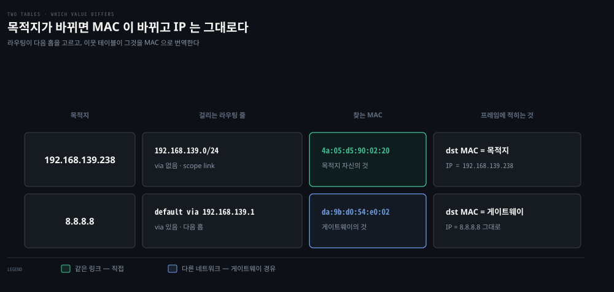


## 2. 한 호스트 안에 짓기
> 방금 읽은 구조를 손으로 재현합니다. 네임스페이스 둘, veth 쌍 둘, 브리지 하나입니다.

### 풀려는 문제

컨테이너는 각자 인터페이스와 IP 를 가진 채 격리돼야 하고 그러면서도 밖으로 나갈 수 있어야 합니다. 물리 NIC 은 하나뿐입니다. 이 조합을 만드는 부품이 네트워크 네임스페이스와 veth 쌍과 브리지입니다.

만들 배선은 이렇습니다. 대역은 VM 대역과 겹치지 않도록 `10.10.1.0/24` 를 씁니다.

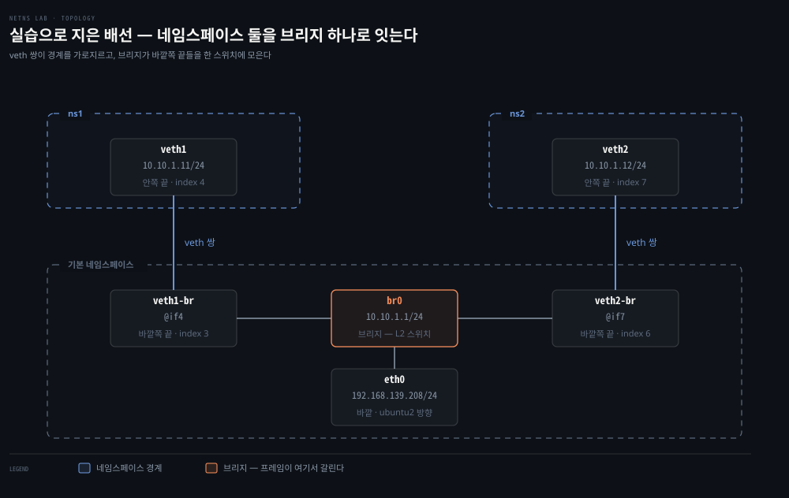

그림의 인덱스 번호는 아래에서 실제로 확인할 값입니다. 지금은 배선의 모양만 보아 두십시오.

### 만들고 옮기기

`ip link add` 로 veth 쌍을 만들면 **두 끝이 다 기본 네임스페이스에 생깁니다.** 그다음 한쪽만 옮깁니다. 처음부터 네임스페이스 안에 태어나지 않습니다.

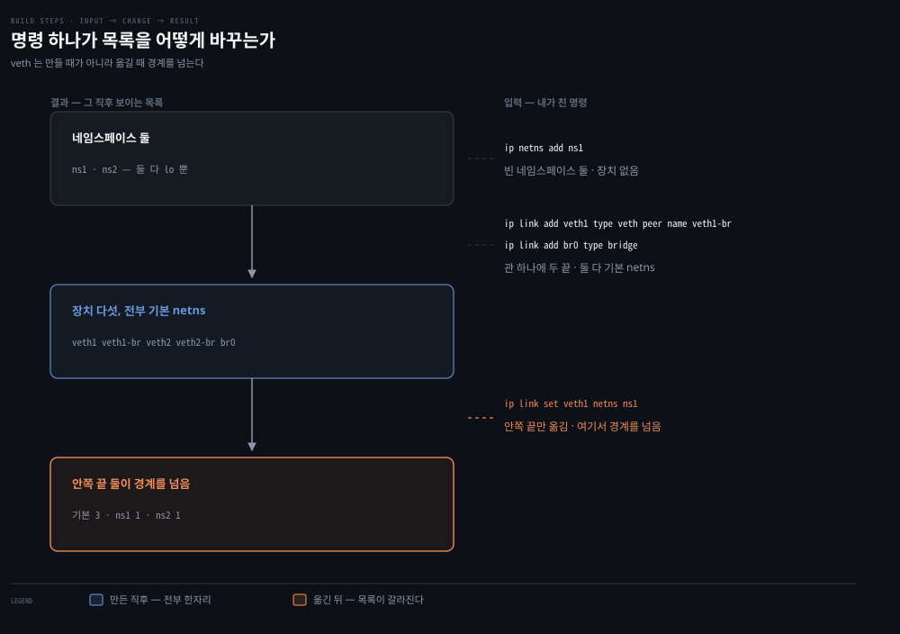

```bash
sudo ip netns add ns1
sudo ip netns add ns2

sudo ip link add veth1 type veth peer name veth1-br
sudo ip link add veth2 type veth peer name veth2-br

sudo ip link add br0 type bridge

sudo ip link set veth1 netns ns1
sudo ip link set veth2 netns ns2
```

만든 것은 다섯입니다. veth 끝 넷과 브리지 하나입니다. 그중 안쪽 끝 둘을 옮겼으니 기본 네임스페이스에는 셋만 남아야 합니다.

```bash
ip -br link
```

```bash
veth1-br@if4     DOWN    ba:f3:97:13:d3:e0
br0              DOWN    46:de:25:c3:8e:32
veth2-br@if7     DOWN    06:24:73:01:5e:8d
```

셋입니다. 그리고 이름이 바뀌었습니다. 옮기기 전에는 `veth1-br@veth1` 이었는데 이제 `veth1-br@if4` 입니다. **짝이 다른 네임스페이스로 갔으니 이름 대신 번호로 가리킵니다.** §1 에서 본 `eth0@if12` 와 같은 구조입니다.

안쪽 끝은 네임스페이스 안에서만 보입니다.

```bash
sudo ip netns exec ns1 ip -br link
```

```bash
lo          DOWN    00:00:00:00:00:00
veth1@if3   DOWN    d6:32:c7:ad:c8:e0
```

`ip netns exec <이름> <명령>` 은 그 네임스페이스 안에서 명령을 실행합니다. `ns1` 안에는 `lo` 와 `veth1` 둘뿐입니다. `eth0` 도 `br0` 도 안 보입니다. 격리가 그것입니다.

두 출력을 맞춰 보면 짝이 확인됩니다.

| 어디서 보나 | 이름 | 가리키는 인덱스 |
|---|---|---|
| 기본 netns | `veth1-br@if4` | 4 |
| `ns1` 안 | `veth1@if3` | 3 |

`veth1-br` 이 3번이고 `veth1` 이 4번입니다. **서로를 정확히 가리키고 있습니다.** §1 에서 `eth0@if12` 의 짝을 못 봐 답답했던 구조를, 여기서는 양쪽을 다 손에 쥐고 확인할 수 있습니다.

### 전기를 넣기

전부 `DOWN` 이고 주소도 없습니다. 브리지에 물리고 주소를 붙이고 링크를 올립니다.

```bash
sudo ip link set veth1-br master br0
sudo ip link set veth2-br master br0

sudo ip link set veth1-br up
sudo ip link set veth2-br up
sudo ip link set br0 up

sudo ip addr add 10.10.1.1/24 dev br0

sudo ip netns exec ns1 ip addr add 10.10.1.11/24 dev veth1
sudo ip netns exec ns1 ip link set veth1 up
sudo ip netns exec ns1 ip link set lo up

sudo ip netns exec ns2 ip addr add 10.10.1.12/24 dev veth2
sudo ip netns exec ns2 ip link set veth2 up
sudo ip netns exec ns2 ip link set lo up
```

브리지에 물린 것을 확인합니다.

```bash
bridge link
```

```bash
3: veth1-br@if4: <BROADCAST,MULTICAST,UP,LOWER_UP> mtu 1500 master br0 state forwarding
6: veth2-br@if7: <BROADCAST,MULTICAST,UP,LOWER_UP> mtu 1500 master br0 state forwarding
```

**바깥쪽 끝 둘만** `master br0` 로 나옵니다. 안쪽 끝은 나오지 않습니다. 브리지에 물리는 것은 한쪽 끝뿐이라는 02-01 §3 의 서술이 그대로입니다. `state forwarding` 은 스위치로 동작 중이라는 뜻입니다.

### 브리지는 홉이 아닙니다

```bash
sudo ip netns exec ns1 ping -c2 10.10.1.12
```

```bash
64 bytes from 10.10.1.12: icmp_seq=1 ttl=64 time=2.43 ms
64 bytes from 10.10.1.12: icmp_seq=2 ttl=64 time=0.124 ms
```

`ttl=64` 입니다. 라우터를 지나면 TTL 이 줄어드는데 그대로입니다. **브리지는 L2 스위치라 홉으로 세지 않습니다.**

라우팅 테이블도 그것을 말합니다.

```bash
sudo ip netns exec ns1 ip route
```

```bash
10.10.1.0/24 dev veth1 proto kernel scope link src 10.10.1.11
```

한 줄이고 `via` 가 없습니다. §1 에서 읽은 `192.168.139.0/24` 줄과 같은 모양입니다.

첫 패킷이 2.43ms 이고 둘째가 0.124ms 인 것도 읽을거리입니다. **첫 번째는 ARP 로 MAC 을 물어보느라 늦었습니다.** 이웃 테이블이 비어 있었기 때문입니다.

```bash
sudo ip netns exec ns1 ip neigh
```

```bash
10.10.1.12 dev veth1 lladdr fe:d6:8e:77:74:a4 STALE
```

`ns2` 의 `veth2` MAC 과 일치합니다. **게이트웨이 것이 아니라 목적지 것을 직접 얻었습니다.** `via` 가 없는 줄에 걸렸으니 당연한 결과입니다.


## 3. 호스트를 넘기
> 네임스페이스를 밖으로 내보내려면 세 가지가 필요합니다. 나갈 길, 중계 허가, 돌아올 길입니다.

### 풀려는 문제

`ns1` 은 같은 대역 안에서만 통합니다. 옆 VM 으로 나가려면 무엇이 더 필요한지가 이 절입니다. 세 가지가 각각 다른 곳에 있습니다.

| 필요한 것 | 어디에 |
|---|---|
| 나갈 길 | `ns1` 의 `default` 경로 |
| 중계 허가 | `ubuntu` 의 `ip_forward` |
| 돌아올 길 | `ubuntu2` 의 라우팅 테이블 |

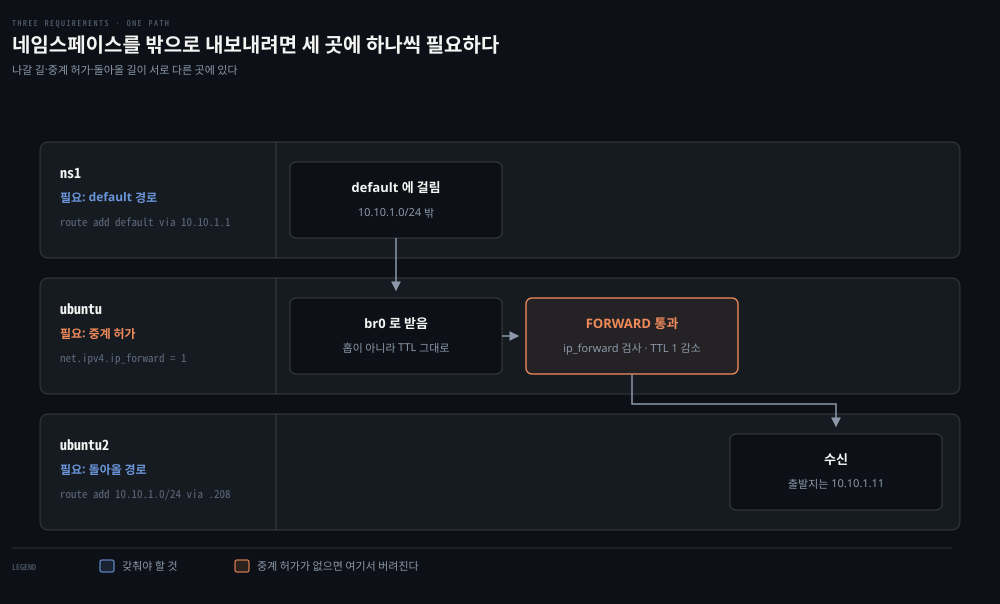

### 세 가지를 채우기

`ns1` 에 기본 경로를 넣습니다.

```bash
sudo ip netns exec ns1 ip route add default via 10.10.1.1
```

중계 허가는 확인부터 합니다.

```bash
sysctl net.ipv4.ip_forward
```

이 환경에서는 이미 `1` 이었습니다. OrbStack 이 그렇게 띄운 것으로 보입니다. 기본값은 `0` 이므로 다른 환경에서는 켜야 합니다.

```bash
sudo sysctl -w net.ipv4.ip_forward=1
```

이 스위치는 **목적지가 내가 아닌 패킷을 남에게 전달할 것인가**를 정합니다. `ns1` 이 보낸 패킷은 목적지가 `.238` 이라 `ubuntu` 것이 아닙니다. 02-01 §4 의 네 갈래 중 외부에서 외부로 가는 갈래이고 `FORWARD` 훅을 지납니다. 이 값이 `0` 이면 그 훅에 닿기도 전에 버려집니다.

돌아올 길은 `ubuntu2` 에 넣습니다.

```bash
sudo ip route add 10.10.1.0/24 via 192.168.139.208
```

`br0` 을 지정할 수는 없습니다. `br0` 은 `ubuntu` 안에만 있는 장치라 다른 머신에서는 이름조차 의미가 없습니다. `ubuntu2` 가 알아야 하는 것은 **그 대역으로 가려면 누구에게 넘기라**는 지시이고, 그것이 `via` 입니다.

`ubuntu` 에는 넣을 것이 없습니다. 두 대역을 다 소유하고 있기 때문입니다. `10.10.1.0/24` 는 `br0` 이 들고 `192.168.139.0/24` 는 `eth0` 이 듭니다.

### TTL 이 홉을 증명합니다

```bash
sudo ip netns exec ns1 ping -c2 192.168.139.238
```

```bash
64 bytes from 192.168.139.238: icmp_seq=1 ttl=63 time=1.05 ms
64 bytes from 192.168.139.238: icmp_seq=2 ttl=63 time=0.218 ms
```

`ttl=63` 입니다. §2 의 네임스페이스 사이 통신은 64였습니다.

| 경로 | TTL | 뜻 |
|---|---|---|
| `ns1` → `ns2` | 64 | 브리지만 지남, 홉 없음 |
| `ns1` → `.238` | 63 | `ubuntu` 를 라우터로 한 번 지남 |

**1이 줄었다는 것이 라우터를 거쳤다는 증거입니다.** `ip_forward` 가 실제로 무슨 일을 하는지가 이 한 자리에 찍힙니다.

### 사설 주소가 그대로 나갑니다

`ubuntu2` 에서 받는 쪽을 잡아 보면 무엇이 나가는지 확인됩니다.

```bash
sudo tcpdump -ni eth0 icmp -c4
```

```bash
IP 10.10.1.11 > 192.168.139.238: ICMP echo request, id 5163, seq 1, length 64
IP 192.168.139.238 > 10.10.1.11: ICMP echo reply, id 5163, seq 1, length 64
```

출발지가 `10.10.1.11` 입니다. **NAT 를 안 걸었으니 IP 는 바뀌지 않습니다.** `ubuntu2` 는 그 주소를 그대로 보고 그 주소로 답장을 보냅니다. `ubuntu2` 에 라우팅 줄을 넣어 준 이유가 여기서 확인됩니다. 그 줄이 없었다면 답장이 `.1` 게이트웨이로 새어 돌아오지 않았을 것입니다.

지금까지 확인한 변화를 한 줄에 놓으면 이렇게 됩니다.

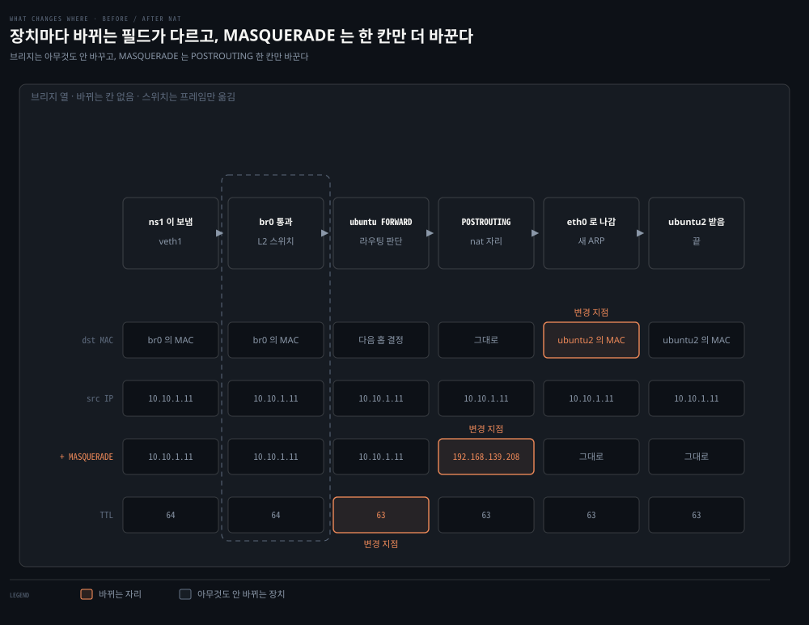

필드마다 바뀌는 자리가 다릅니다. TTL 은 라우팅이 정하고, 목적지 MAC 은 송신 직전 ARP 가 정합니다.

가운데 두 줄이 같은 경로의 NAT 전후입니다. 지금 상태가 위쪽 줄이라 사설 주소가 끝까지 그대로 갑니다. §5 에서 MASQUERADE 를 걸면 아래쪽 줄이 되어 `POSTROUTING` 한 칸만 노드 주소로 바뀝니다. 그 한 칸 때문에 상대는 `10.10.1.11` 이라는 주소를 아예 보지 못하게 됩니다.

브리지 열에는 바뀌는 칸이 하나도 없습니다. 스위치라는 말의 뜻이 빈 열로 드러납니다.


## 4. 세 번의 실패가 가리킨 계층
> 실패 메시지는 실패가 아니라 좌표입니다. 어느 계층에서 멈췄는지를 문구가 말해 줍니다.

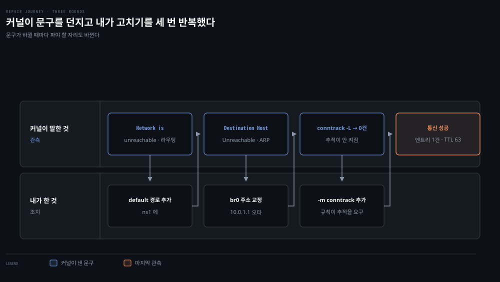

### 풀려는 문제

위 절차를 처음부터 매끄럽게 밟은 것이 아닙니다. 세 번 막혔고 원인이 모두 달랐습니다. 그런데 **증상 문구가 매번 다음에 볼 곳을 정확히 가리켰습니다.** 02-03 의 진단 사다리를 직접 만든 환경에 적용한 사례라, 이 절이 이 편에서 가장 다시 읽을 값이 있는 부분입니다.

### 첫 번째 — Network is unreachable

```bash
ping: connect: Network is unreachable
```

`ns1` 에 `default` 경로를 넣기 전에 밖으로 ping 한 결과입니다. **타임아웃이 아니라 즉시 실패**입니다. 패킷을 보내 보지도 못했다는 뜻입니다.

커널이 라우팅 테이블을 뒤졌는데 걸리는 줄이 없어 송신 자체를 거부했습니다. 그때 `ns1` 의 테이블에는 `10.10.1.0/24` 한 줄뿐이었고 `192.168.139.238` 은 그 대역에 들어가지 않습니다.

사다리로 보면 L3 도 아니고 그 아래입니다. 나가기도 전에 자기 커널이 막았습니다.

### 두 번째 — Destination Host Unreachable

```bash
From 10.10.1.11 icmp_seq=1 Destination Host Unreachable
```

앞의 것과 다른 실패입니다. **줄은 찾았고 보내려 했는데 다음 홉의 MAC 을 못 얻은 상태**입니다. 그리고 `From 10.10.1.11` 이 붙어 있습니다. `ns1` 자신이 이 에러를 냈다는 뜻입니다.

이웃 테이블을 보면 원인이 좁혀집니다.

```bash
sudo ip netns exec ns1 ip neigh
```

```bash
10.10.1.1  dev veth1 FAILED
10.10.1.12 dev veth1 lladdr fe:d6:8e:77:74:a4 STALE
```

`10.10.1.1` 이 `FAILED` 입니다. ARP 를 물었는데 아무도 답하지 않았습니다. 그러면 그 주소가 실제로 있는지 확인할 차례입니다.

```bash
ip -br addr show br0
```

```bash
br0    UP    10.0.1.1/24 fe80::44de:25ff:fec3:8e32/64
```

`10.0.1.1` 입니다. `10.10.1.1` 이 아닙니다. **`10` 이 하나 빠진 오타**였고, 그래서 `br0` 은 다른 대역에 있었으며 `ns1` 이 찾는 주소는 이 링크에 존재하지 않았습니다.

```bash
sudo ip addr del 10.0.1.1/24 dev br0
sudo ip addr add 10.10.1.1/24 dev br0
```

여기서 부수적으로 드러난 것이 하나 있습니다. **오타가 있는 동안에도 `ns1` 과 `ns2` 는 통했습니다.** 그때는 브리지를 스위치로만 썼기 때문입니다. 같은 장치가 게이트웨이 역할을 맡는 순간부터 IP 가 필요해집니다.

### 세 번째 — conntrack 이 0건

ping 이 통하는데 연결 추적 테이블이 비어 있었습니다.

```bash
conntrack v1.4.9 (conntrack-tools): 0 flow entries have been shown.
```

버그가 아니라 설계입니다. 02-01 §5 에 이미 적혀 있습니다.

> Conntrack은 커널 모듈이 로드되고 관련 규칙이 있을 때 동작합니다.

**연결 추적은 공짜가 아닙니다.** 모든 패킷을 테이블에 기록하는 일이라 비용이 듭니다. 그래서 커널은 누군가 필요로 할 때만 훅을 등록합니다. 당시 `iptables` 규칙이 하나도 없었으니 아무도 요구하지 않았습니다.

### 세 실패를 나란히 놓으면

| 증상 | 어디서 멈췄나 | 다음에 볼 곳 |
|---|---|---|
| `Network is unreachable` | 라우팅 판단 | `ip route` — 걸리는 줄이 있는가 |
| `Destination Host Unreachable` | ARP | `ip neigh` — MAC 을 얻었는가 |
| `timeout` (무응답) | 경로 어딘가 | `tcpdump` — 나가긴 했는가 |
| `Connection refused` | 상대 L4 | 도달은 성공, 그 포트에 소켓이 없음 |

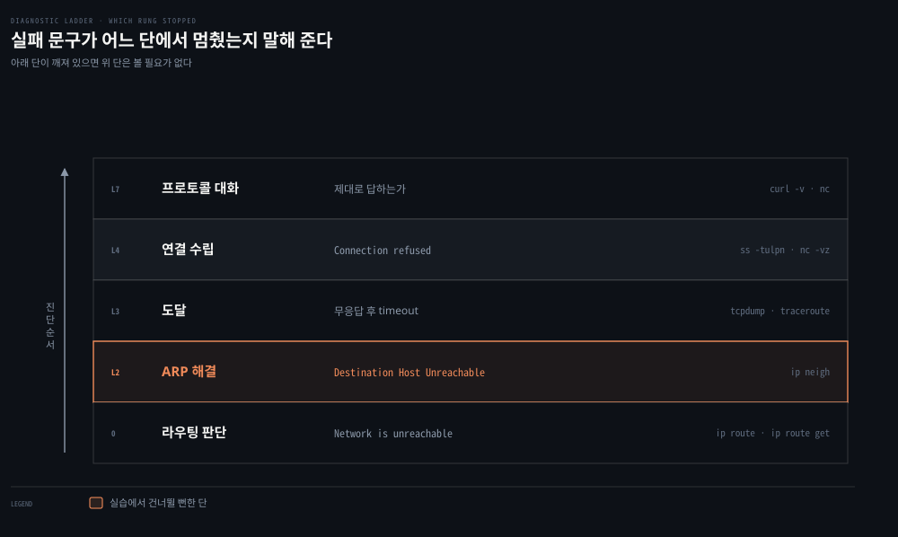

**같은 "안 된다"인데 문구가 다르면 파야 할 곳이 다릅니다.** 02-03 이 도구 목록이 아니라 순서에 관한 편인 이유가 여기 있습니다.


## 5. conntrack 은 요구가 있어야 켜진다
> 추적을 켜고 NAT 전후의 튜플을 대조합니다. 응답 방향 줄이 원본을 뒤집은 값이 아니게 되는 순간을 봅니다.

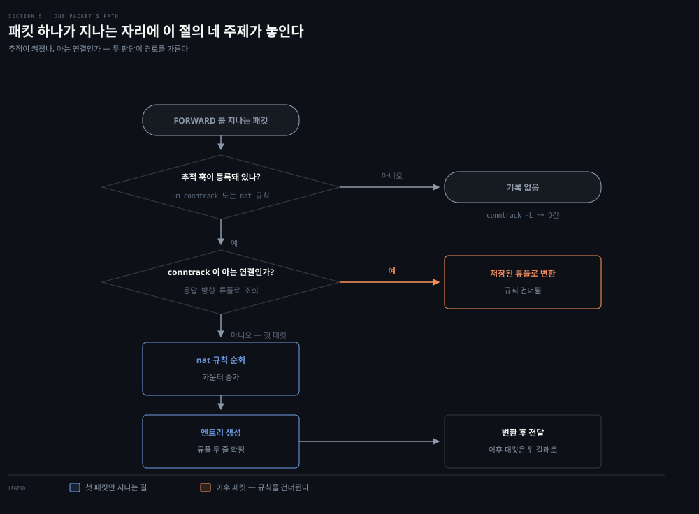

### 풀려는 문제

02-01 §5 에서 conntrack 엔트리에 튜플이 두 줄 실린다고 읽었습니다. 보통은 뒤집힌 형태지만 NAT 뒤에서는 다를 수 있다고도 했습니다. 그 "다를 수 있다"를 실물로 확인하는 것이 이 절입니다.

실험은 규칙을 하나씩 얹으며 세 번 관측했습니다.

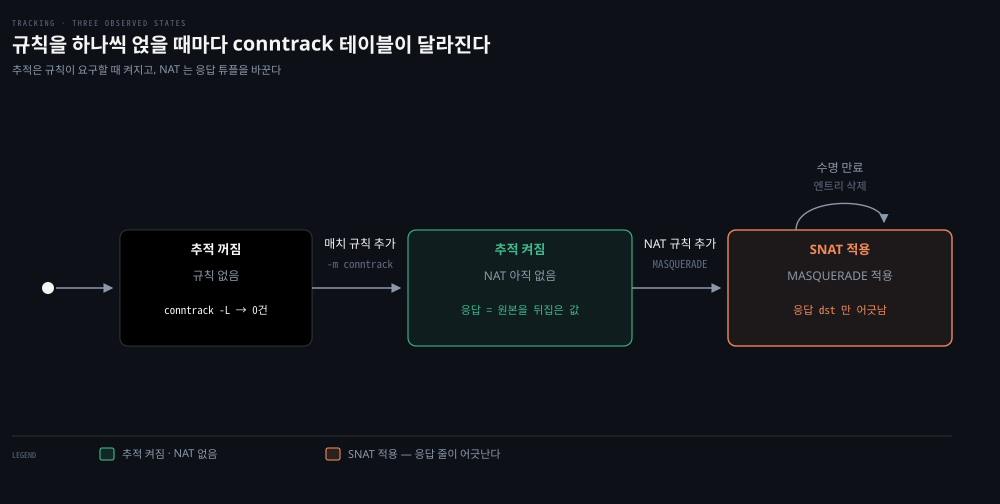

### 추적 켜기

연결 상태를 조건으로 쓰는 규칙을 하나 넣으면 커널이 추적을 시작합니다.

```bash
# 연결 상태를 조건으로 쓰겠다고 선언해 커널이 추적을 시작하게 합니다 — 막는 규칙은 아닙니다
sudo iptables -A FORWARD -m conntrack --ctstate ESTABLISHED,RELATED -j ACCEPT
```

플래그가 여기서 처음 몰려 나오니 한 줄을 토막 내 두겠습니다. 02-02 에서 세운 네 칸이 그대로 플래그가 됩니다.

| 토막 | 예 | 답하는 것 |
|------|-----|----------|
| 테이블 | `-t nat` | 어느 서랍인가 — 생략하면 `filter` |
| 명령 + 체인 | `-A POSTROUTING` | 무엇을, 어디에 |
| 조건 | `-s 10.10.1.0/24 -o eth0` | 어떤 패킷이면 |
| 할 일 | `-j MASQUERADE` | 무엇을 한다 |

읽는 요령이 하나 있습니다. **대문자 하나짜리는 명령입니다.** 소문자는 조건이고, `-j` 가 할 일입니다.

| 플래그 | 뜻 |
|--------|-----|
| `-A <체인>` | 체인 **끝**에 덧붙입니다. 순서가 곧 우선순위라 "끝에"가 의미를 갖습니다 |
| `-I` · `-D` | 맨 앞에 끼우거나 지웁니다. `-D` 는 추가할 때와 똑같이 적어야 지워집니다 |
| `-P <체인> <타깃>` | 규칙이 아니라 그 체인의 **기본 정책**을 정합니다 |
| `-m <모듈>` | 매치 **확장 모듈**을 불러옵니다 |
| `-n` · `-v` | 이름 풀이를 안 함 · 카운터와 인터페이스까지 보임 |

`-P` 에 조건도 `-j` 도 없는 것이 눈에 띕니다. 규칙 하나를 목록에 넣는 것이 아니라, **목록을 다 훑고도 아무것도 안 걸렸을 때** 무엇을 할지를 정하기 때문입니다. 그래서 `-P` 로 정한 값은 규칙 목록에 나타나지 않고 `iptables -L FORWARD -n` 의 맨 윗줄에 `(policy DROP)` 으로 붙습니다.

`-m` 은 따로 짚어야 합니다. iptables 코어가 아는 조건은 `-s`·`-d`·`-i`·`-o`·`-p` 뿐이고, 연결 상태 같은 것은 확장 모듈입니다. `-m conntrack` 이 그 모듈을 불러와야 `--ctstate` 라는 옵션이 생깁니다. 둘은 늘 짝이라 `-m` 없이 `--ctstate` 만 쓰면 오류가 납니다.

그리고 이것이 이 한 줄이 **추적을 켜는** 이유이기도 합니다. `-m conntrack` 을 불러오는 순간 커널은 누군가 연결 상태를 볼 작정임을 알게 됩니다. 나머지 문법과 규칙이 읽히는 순서는 [02-02 §1·§2](./02-02.iptables%C2%B7IPVS%C2%B7eBPF%20%E2%80%94%20kube-proxy%EB%A5%BC%20%EC%9D%B4%ED%95%B4%ED%95%98%EB%8A%94%20%EC%84%B8%20%EA%B8%B0%EC%88%A0.md)가 다룹니다.

이 규칙은 아무것도 막지 않습니다. `FORWARD` 체인의 기본 정책이 `ACCEPT` 라, 걸리는 패킷도 통과하고 안 걸리는 패킷도 정책으로 통과합니다. **목적은 차단이 아니라 커널에게 연결 상태를 볼 것이라고 알리는 것**입니다.

진짜 방화벽으로 쓰려면 정책을 뒤집어야 합니다.

```bash
# 기본을 차단으로 뒤집고 두 줄만 열어 방향성 있는 방화벽을 만듭니다
sudo iptables -P FORWARD DROP
sudo iptables -A FORWARD -m conntrack --ctstate ESTABLISHED,RELATED -j ACCEPT
sudo iptables -A FORWARD -s 10.10.1.0/24 -j ACCEPT
```

이 세 줄이 **안에서 나가는 것은 되고 밖에서 새로 들어오는 것은 안 되는** 방화벽입니다. 02-01 §5 의 "방화벽의 방향성은 Conntrack 위에 선다"가 이 모양입니다.

같은 세 줄인데 패킷에 따라 도착지가 갈립니다.

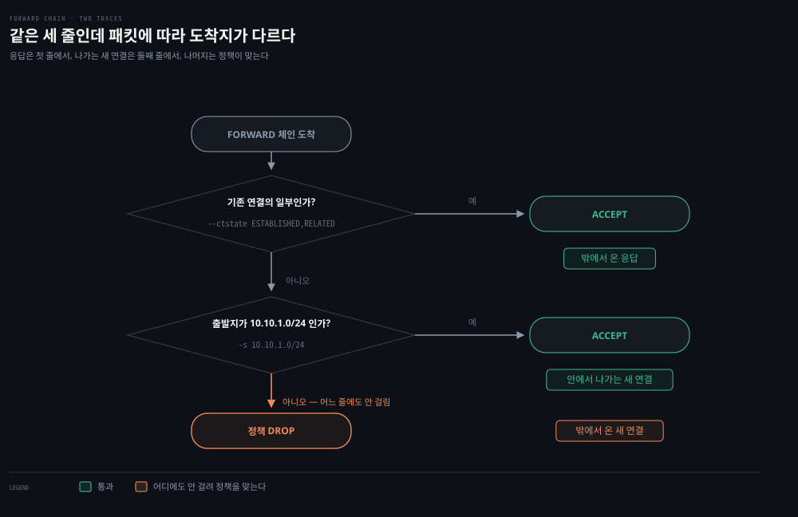

밖에서 온 새 연결만 어느 줄에도 안 걸려 정책을 맞습니다. 나머지 둘은 각각 첫 줄과 둘째 줄에서 통과합니다.

### NAT 없을 때 — 정확히 뒤집힌 두 줄

```bash
# ns1 에서 옆 노드로 보내고, 그 흐름이 테이블에 어떻게 적혔는지 바로 봅니다
sudo ip netns exec ns1 ping -c2 192.168.139.238 && sudo conntrack -L
```

```bash
icmp 1 29 src=10.10.1.11 dst=192.168.139.238 type=8 code=0 id=5321
          src=192.168.139.238 dst=10.10.1.11 type=0 code=0 id=5321 mark=0 use=1
```

한 줄에 `src=` 가 두 번 나옵니다. 앞이 원본 방향이고 뒤가 응답 방향입니다. `src` 와 `dst` 가 자리만 바뀌었습니다. **정확히 뒤집힌 값입니다.**

읽을거리가 몇 개 더 있습니다.

- `29` 는 남은 수명입니다. ICMP 기본 타임아웃이 30초라 방금 만들어진 항목입니다.
- `type=8` 과 `type=0` 은 ICMP echo request 와 reply 입니다. 포트가 없는 프로토콜이라 그 자리에 타입이 들어갑니다.
- `id=5321` 은 TCP 의 포트 대신 ICMP 를 연결로 묶는 식별자입니다.
- `[UNREPLIED]` 가 없습니다. 이미 답이 왔다는 뜻입니다.

한 줄이 어떤 부분들로 나뉘는지를 펴면 이렇게 됩니다.

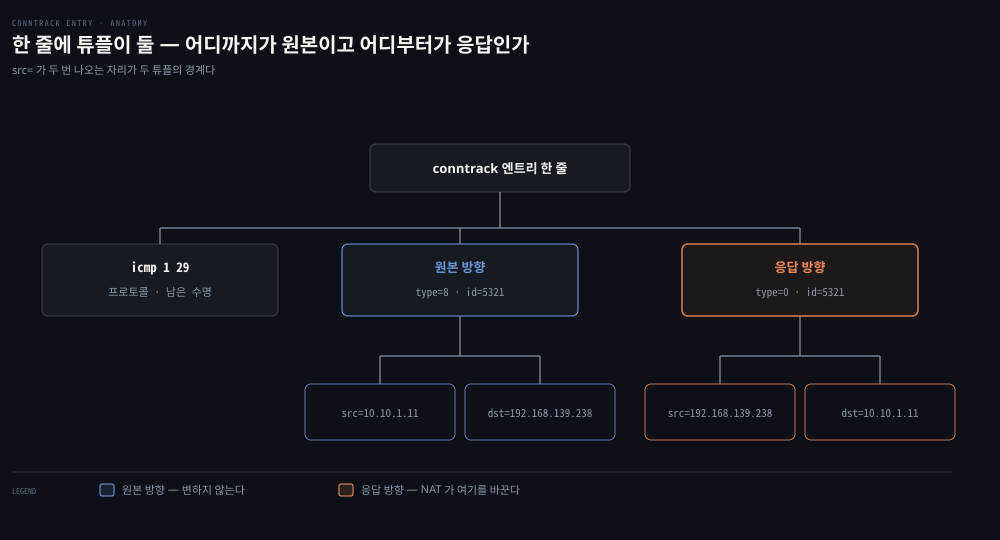

### MASQUERADE 를 걸면

나가는 패킷의 출발지를 위장합니다.

```bash
# eth0 로 나가는 10.10.1.0/24 출발지를 노드 주소로 위장합니다 — 나가기 직전 자리입니다
sudo iptables -t nat -A POSTROUTING -s 10.10.1.0/24 -o eth0 -j MASQUERADE
```

`nat` 테이블의 `POSTROUTING` 체인입니다. **출발지를 바꾸는 일은 라우팅 이후여도 되므로** 나가기 직전인 이 자리에 둡니다.

그리고 `ubuntu2` 의 라우팅 줄을 일부러 지웁니다.

```bash
# 상대의 돌아올 경로를 일부러 지웁니다 — 위장 뒤에는 없어도 통하는지 보려는 것입니다
sudo ip route del 10.10.1.0/24 via 192.168.139.208
```

```bash
# 옛 엔트리를 비우고 다시 보냅니다 — 안 비우면 NAT 이전 항목과 섞여 잘못 읽습니다
sudo conntrack -F
sudo ip netns exec ns1 ping -c2 192.168.139.238 && sudo conntrack -L
```

```bash
icmp 1 29 src=10.10.1.11 dst=192.168.139.238 type=8 code=0 id=5378
          src=192.168.139.238 dst=192.168.139.208 type=0 code=0 id=5378 mark=0 use=1
                              ^^^^^^^^^^^^^^^^^^
```

ping 은 여전히 통합니다. 라우팅 줄을 지웠는데도 통하는 이유는 **`ubuntu2` 가 이제 `10.10.1.11` 을 아예 보지 못하기** 때문입니다.

```bash
IP 192.168.139.208 > 192.168.139.238: ICMP echo request, id 5378, seq 1
IP 192.168.139.238 > 192.168.139.208: ICMP echo reply, id 5378, seq 1
```

### 어느 줄이 바뀌는가

두 결과를 나란히 놓으면 논지가 한눈에 들어옵니다.

| | 원본 방향 | 응답 방향 |
|---|---|---|
| NAT 없음 | `src=10.10.1.11 dst=192.168.139.238` | `src=192.168.139.238 dst=10.10.1.11` |
| MASQUERADE | `src=10.10.1.11 dst=192.168.139.238` | `src=192.168.139.238 dst=192.168.139.208` |
| | **그대로** | **바뀜** |

**원본 방향은 바뀌지 않습니다.** 패킷이 도착했을 때 생긴 그대로 기록됩니다. `ns1` 이 보낸 패킷의 출발지는 실제로 `10.10.1.11` 이었기 때문입니다.

그리고 그 줄이 남아 있어야 하는 이유가 있습니다. **되돌리려면 원본을 알아야 합니다.** 응답이 `.208` 로 오면 커널은 응답 튜플로 조회해 원래 `10.10.1.11` 것임을 알고 되돌려 보냅니다. 원본 줄이 그 복원표입니다.

바뀌는 것은 응답 방향입니다. `ubuntu2` 가 `.208` 로 답장할 것이므로, 커널이 기다려야 할 응답의 `dst` 도 그 값이어야 합니다. 02-01 §5 의 "응답 방향 튜플은 원본을 뒤집은 값이 아니라 변환된 주소를 담는다"가 이 한 필드입니다.

### 규칙은 첫 패킷에만 발화합니다

```bash
# -v 를 붙여야 규칙마다 몇 개가 걸렸는지(pkts)가 나옵니다
sudo iptables -t nat -L POSTROUTING -n -v
```

```bash
 pkts bytes target      prot opt in   out    source         destination
    1    84 MASQUERADE  all  --  *    eth0   10.10.1.0/24   0.0.0.0/0
```

ping 을 두 번 쳤는데 규칙에 걸린 것은 하나입니다. `84 bytes` 는 ICMP 요청 한 개 크기와 정확히 맞습니다.

**conntrack 이 엔트리를 만든 뒤로는 둘째 패킷이 nat 규칙을 거치지 않습니다.** 이미 아는 연결이니 규칙을 다시 고르지 않고 저장된 튜플로 바로 변환합니다. 02-01 §5 의 "NAT 는 아예 Conntrack 위에서 동작한다"가 이 숫자 하나로 증명됩니다.

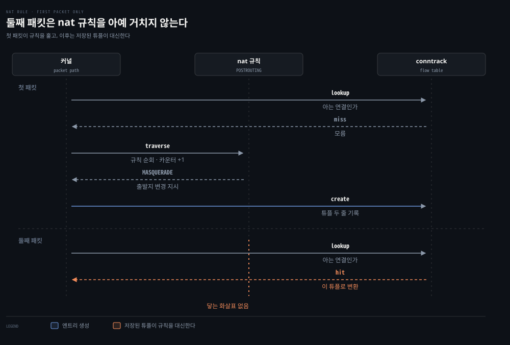

이것이 kube-proxy 가 iptables 만으로 서비스 로드밸런싱을 구현할 수 있는 바탕이기도 합니다. 백엔드를 확률로 고르는 일은 첫 패킷에서 한 번만 일어나고, 이후 그 연결의 모든 패킷은 같은 백엔드로 갑니다.


## 세팅을 한 번에
> 아래 절들은 명령을 하나씩 짚어 가며 설명합니다. 두 번째부터는 이 블록으로 같은 환경을 다시 세울 수 있습니다.

Linux 호스트 두 대가 필요하고, 실측은 OrbStack VM 두 대(`ubuntu` `192.168.139.208` · `ubuntu2` `192.168.139.238`)에서 했습니다. `ss`와 `ip`가 `netstat`·`ifconfig`를 대체했으므로 `iproute2` 하나면 둘 다 들어옵니다.

```bash
sudo apt install -y iproute2 iptables conntrack tcpdump netcat-openbsd dnsutils bridge-utils nmap curl
```

여러 줄을 붙여넣었는데 첫 줄만 실행되면 셸의 bracketed paste가 꺼진 것이니 `~/.inputrc`에 `set enable-bracketed-paste on`을 넣으십시오.

```bash
# 네임스페이스 N개 + veth 쌍 + 브리지 + 포워딩 + 추적 + MASQUERADE 를 한 번에
# N=2 는 이 편용, N=4 는 다음 편의 확률 사다리용입니다
N=2
sudo ip link add br0 type bridge && sudo ip link set br0 up && sudo ip addr add 10.10.1.1/24 dev br0
for n in $(seq 1 $N); do
  sudo ip netns add ns$n
  sudo ip link add veth$n type veth peer name veth$n-br     # 두 끝이 다 기본 netns 에 생긴다
  sudo ip link set veth$n netns ns$n                        # 안쪽 끝만 옮긴다 — 여기서 경계를 넘는다
  sudo ip link set veth$n-br master br0 && sudo ip link set veth$n-br up
  sudo ip netns exec ns$n ip addr add 10.10.1.1$n/24 dev veth$n
  sudo ip netns exec ns$n ip link set veth$n up && sudo ip netns exec ns$n ip link set lo up
  sudo ip netns exec ns$n ip route add default via 10.10.1.1
done
sudo sysctl -qw net.ipv4.ip_forward=1                                            # 중계 허가
sudo iptables -A FORWARD -m conntrack --ctstate ESTABLISHED,RELATED -j ACCEPT     # 추적 켜기
sudo iptables -t nat -A POSTROUTING -s 10.10.1.0/24 -o eth0 -j MASQUERADE         # 나가는 것 위장
```

**`10.10.1.1`을 `10.0.1.1`로 잘못 치지 않도록 주의하십시오.** 그 오타 하나가 §4의 두 번째 실패였습니다.

MASQUERADE를 걸었으므로 상대 호스트에 돌아올 경로는 필요 없습니다. NAT 없이 순수 포워딩을 보려면 마지막 줄을 빼고 상대에서 `sudo ip route add 10.10.1.0/24 via 192.168.139.208`을 칩니다.

```bash
# 원복 — 네임스페이스를 지워도 바깥쪽 veth 끝이 남는 경우가 있어 따로 지웁니다
sudo iptables -t nat -F POSTROUTING; sudo iptables -F FORWARD
for n in 1 2 3 4; do sudo ip netns del ns$n 2>/dev/null; sudo ip link del veth$n-br 2>/dev/null; done
sudo ip link del br0 2>/dev/null; sudo conntrack -F
ip -br link | grep -E 'veth|br0' || echo '원복 완료'
```

스크립트로도 두었습니다. `networking-and-kubernetes-lab` 저장소의 `netns-bridge/`에 `up.sh`(인자로 백엔드 수) · `verify.sh` · `down.sh` · 묶음별 랩 스크립트가 있습니다.


## 심화 학습
> 실습에서 곁가지로 드러났으나 본문 흐름에 넣지 않은 것들입니다.

- **`ip route get` 은 표를 읽는 대신 커널에게 묻습니다.** 여러 줄이 겹칠 때 어느 줄이 이기는지 눈으로 판단하지 않아도 됩니다. 구체성과 metric 을 모두 반영한 답이 나옵니다.
- **`ip_forward` 와 `conntrack -F` 는 둘 다 기본값을 가정하면 안 되는 값입니다.** `ip_forward` 는 컨테이너 런타임이 깔린 호스트에서 이미 1인 경우가 흔하고, `conntrack -F` 는 대조 실험 전에 쳐야 옛 엔트리가 결과를 오염시키지 않습니다.


## 결정 치트시트
> 실패 문구를 보고 다음에 볼 곳을 정하는 표입니다.

| 증상 | 멈춘 계층 | 확인 명령 |
|---|---|---|
| `Network is unreachable` | 라우팅 판단 | `ip route` · `ip route get <주소>` |
| `Destination Host Unreachable` | ARP | `ip neigh` · 그 주소가 실재하는지 |
| 무응답 후 타임아웃 | 경로 또는 방화벽 DROP | `tcpdump` 로 나가는지 확인 |
| `Connection refused` | 상대 L4 | 도달은 성공, `ss -tulpn` 으로 바인딩 확인 |
| TCP 는 붙는데 응답이 이상함 | L7 | `curl -v` · `nc` 로 직접 대화 |

`via` 유무를 판별하는 기준도 같이 둡니다.

| 상황 | 라우팅 줄 | 찾는 MAC |
|---|---|---|
| 목적지가 같은 링크 | `scope link`, `via` 없음 | 목적지의 MAC |
| 목적지가 다른 네트워크 | `via <게이트웨이>` | 게이트웨이의 MAC |


## 면접에서 받을 만한 질문

> 먼저 스스로 답을 소리 내어 말해 본 뒤, 아래 §정답 섹션을 펼쳐 맞춰 봅니다.

1. `eth0@if12` 에서 `12` 는 무엇의 번호이고 왜 이름이 아니라 번호입니까?
2. 브리지로 이은 두 네임스페이스 사이의 ping 에서 TTL 이 줄지 않는 이유는 무엇입니까?
3. `Network is unreachable` 과 `Destination Host Unreachable` 은 각각 어느 단계에서 나는 실패입니까?
4. conntrack 테이블이 비어 있는데 통신은 되는 상황을 어떻게 설명합니까?
5. MASQUERADE 를 걸면 conntrack 엔트리의 두 줄 중 어느 줄이 바뀌고, 나머지 줄은 왜 남아 있어야 합니까?

### 빈칸 채우기 — 세 가지 준비물

네임스페이스를 다른 호스트로 내보내려면 셋이 필요합니다. `ns1` 에는 `(1)____` 경로, 중계 호스트에는 `(2)____` 스위치, 상대 호스트에는 `(3)____` 가 필요합니다. 셋째 것은 `(4)____` 를 걸면 필요 없어집니다.


## 정답 (자답 후 펼치기)

> 위 §면접에서 받을 만한 질문의 5개에 먼저 자답한 뒤 아래를 읽으십시오.

### 정답 1 — 짝의 인덱스

`12` 는 veth 쌍의 반대쪽 끝 장치가 **바깥 네임스페이스에서 갖는 인덱스**입니다. 이름이 아니라 번호인 것은 인터페이스 이름이 네임스페이스 밖에서 보이지 않기 때문입니다. 인덱스는 보이므로 번호로 가리킵니다. 같은 네임스페이스 안에 두 끝이 있으면 `veth1-br@veth1` 처럼 이름으로 표기됩니다.

### 정답 2 — 브리지는 스위치입니다

브리지는 L2 에서 프레임을 옮길 뿐 IP 헤더를 건드리지 않습니다. TTL 을 줄이는 것은 라우터의 일이고, 라우터는 L3 에서 다음 홉을 다시 정하는 장치입니다. 실측에서 `ns1` 에서 `ns2` 는 64였고 `ubuntu` 를 라우터로 지난 크로스호스트는 63이었습니다.

### 정답 3 — 라우팅 실패와 ARP 실패

`Network is unreachable` 은 라우팅 테이블에 걸리는 줄이 없어 송신 자체를 거부한 것입니다. `Destination Host Unreachable` 은 줄은 찾았으나 다음 홉의 MAC 을 얻지 못한 것입니다. 전자는 L3 판단, 후자는 L2 해결에서 멈춘 것이라 확인할 테이블이 다릅니다.

### 정답 4 — 추적은 요구가 있을 때만 켜집니다

연결 추적은 모든 패킷을 테이블에 기록하는 비용이 드는 일이라, 커널은 이를 필요로 하는 규칙이 있을 때만 훅을 등록합니다. `iptables` 규칙이 하나도 없으면 통신은 되지만 추적은 하지 않습니다. `-m conntrack` 을 쓰는 규칙이나 NAT 규칙을 넣으면 그때부터 기록이 쌓입니다.

### 정답 5 — 응답 방향만 바뀝니다

원본 방향 줄은 패킷이 도착했을 때의 값 그대로 남습니다. 바뀌는 것은 응답 방향 줄이고, 상대가 위장된 주소로 답장할 것이므로 기다릴 응답의 `dst` 가 그 값이 됩니다. 원본 줄이 남아 있어야 하는 이유는 되돌리기 위해서입니다. 응답이 오면 커널이 응답 튜플로 조회해 원래 주소로 복원합니다.

### 정답 빈칸 — (1)`default` (2)`ip_forward` (3)돌아올 라우팅 경로 (4)`MASQUERADE`

`MASQUERADE` 를 걸면 상대가 사설 대역을 보지 못하므로 돌아올 경로를 알려 줄 필요가 없어집니다.


## 핵심 개념 체크리스트
> 여섯 항목을 막힘없이 답할 수 있으면 이 실습을 닫아도 좋습니다.
- [ ] `ip -d link` 출력에서 veth 를 가려내고 `@if<번호>` 를 설명할 수 있는가?
- [ ] veth 쌍을 만들어 네임스페이스로 옮기고 브리지에 물릴 수 있는가?
- [ ] `via` 유무로 프레임의 목적지 MAC 이 무엇이 될지 말할 수 있는가?
- [ ] TTL 값으로 라우터를 거쳤는지 판별할 수 있는가?
- [ ] 실패 문구 네 종류를 계층에 대응시킬 수 있는가?
- [ ] conntrack 엔트리의 두 줄을 읽고 NAT 전후 차이를 설명할 수 있는가?


## 참고 자료

- 실습 스크립트: `networking-and-kubernetes-lab` 저장소의 `netns-bridge/` 참조
- 이전 편: [02-03. Linux 네트워크 진단 도구](./02-03.Linux%20%EB%84%A4%ED%8A%B8%EC%9B%8C%ED%81%AC%20%EC%A7%84%EB%8B%A8%20%EB%8F%84%EA%B5%AC%20%E2%80%94%20%EA%B3%84%EC%B8%B5%20%EC%88%9C%EC%84%9C%EB%8C%80%EB%A1%9C%20%EC%88%98%EC%82%AC%ED%95%98%EA%B8%B0.md)
- 개념 정본: [02-01. 커널이 패킷을 다루는 법](./02-01.%EC%BB%A4%EB%84%90%EC%9D%B4%20%ED%8C%A8%ED%82%B7%EC%9D%84%20%EB%8B%A4%EB%A3%A8%EB%8A%94%20%EB%B2%95%20%E2%80%94%20%EC%86%8C%EC%BC%93%C2%B7Netfilter%C2%B7Conntrack%C2%B7%EB%9D%BC%EC%9A%B0%ED%8C%85.md)
