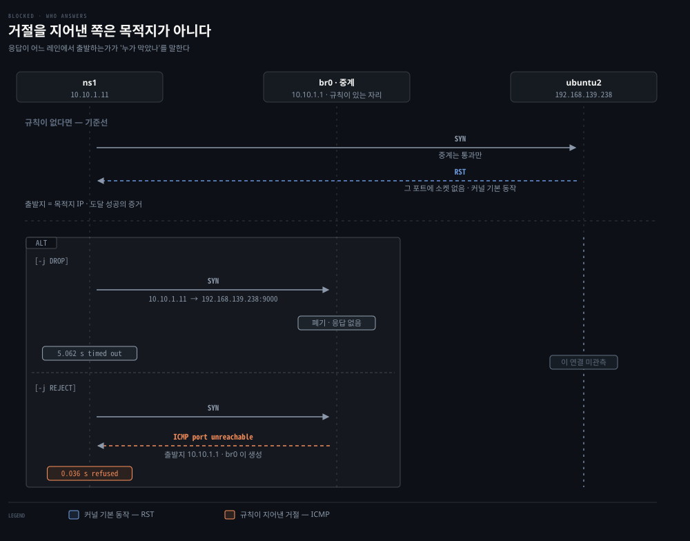
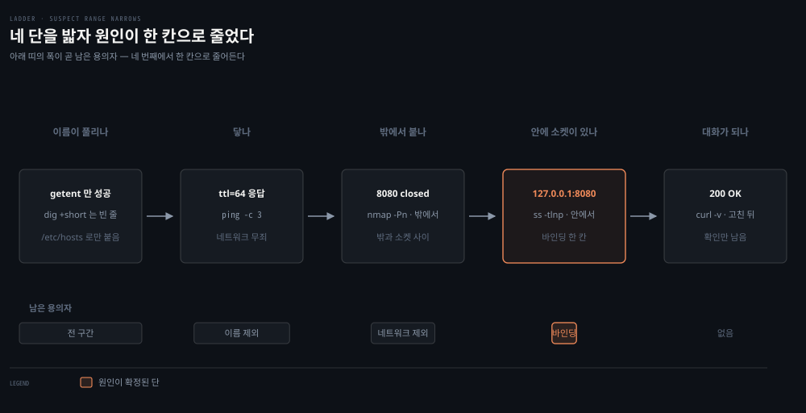
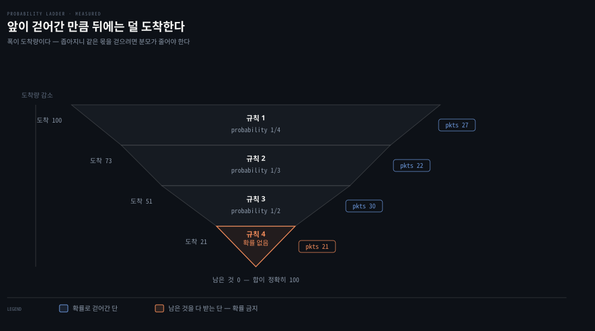

# 커널 네트워킹 실습 2 — 막고, 진단하고, 나누기

---


## 핵심 요약
> 이 편 전체가 매달린 하나의 생각은 **"같은 '안 된다'도 어떻게 막았느냐에 따라 다른 말을 남긴다"**입니다.

DROP은 침묵하고 REJECT는 거절을 지어 보냅니다. 그 차이가 진단에서 다음에 볼 곳을 정합니다. 고장을 하나 심어 두고 사다리로 좁혀 보면 네 단 만에 원인이 한 칸으로 줄고, 확률 사다리를 100번 돌려 보면 분모가 왜 줄어야 하는지가 숫자로 나옵니다.


## 학습 목표
> 앞 편이 배선을 지었다면 이 편은 그 위에서 막고, 재고, 나눕니다.

이 실습을 마치면 다음을 할 수 있습니다.

1. DROP과 REJECT가 남기는 응답과 걸리는 시간의 차이를 실측값으로 설명할 수 있습니다.
2. 거절 메시지의 출발지 IP를 읽어 누가 그것을 만들었는지 판별할 수 있습니다.
3. `getent`와 `dig`이 갈리는 상황을 진단 근거로 쓸 수 있습니다.
4. 밖에서 본 `closed`와 안에서 본 `LISTEN`이 동시에 참인 이유를 설명할 수 있습니다.
5. 확률 사다리의 분모가 줄어드는 이유를 도착량으로 계산할 수 있습니다.

환경은 [02-04](./02-04.%EC%BB%A4%EB%84%90%20%EB%84%A4%ED%8A%B8%EC%9B%8C%ED%82%B9%20%EC%8B%A4%EC%8A%B5%20%E2%80%94%20veth%C2%B7%EB%B8%8C%EB%A6%AC%EC%A7%80%C2%B7%ED%8F%AC%EC%9B%8C%EB%94%A9%EC%9D%84%20%EC%86%90%EC%9C%BC%EB%A1%9C%20%EC%A7%93%EA%B8%B0.md)의 세팅을 그대로 씁니다. 스크립트는 `networking-and-kubernetes-lab` 저장소의 `netns-bridge/`를 참조하십시오.


## 1. DROP과 REJECT — 같은 "안 된다"가 갈리는 곳
> 막는 방식이 두 가지이고, 어느 쪽을 쓰느냐가 상대가 받는 응답과 기다리는 시간을 바꿉니다.



### 풀려는 문제

`-j DROP`과 `-j REJECT`는 둘 다 패킷을 버립니다. 그런데 02-04 §4에서 정리한 진단 사다리는 "무응답 후 timeout"과 "Connection refused"를 서로 다른 단에 놓았습니다. 같은 차단인데 왜 증상이 갈리는지, 그리고 그 차이를 만드는 쪽이 누구인지가 이 절입니다.

상대 호스트에서 받을 자리를 먼저 띄웁니다.

```bash
# 9000 번에서 TCP 연결을 기다립니다. -k 는 하나가 끊겨도 계속 듣는다는 뜻입니다
nc -lk -p 9000
```

### 시간이 140배 차이 납니다

```bash
# 체인 맨 앞에 끼웁니다. -A 로 붙이면 기존 ACCEPT 규칙 아래로 가 아무 일도 안 일어납니다
sudo iptables -I FORWARD 1 -s 10.10.1.0/24 -p tcp --dport 9000 -j DROP
time sudo ip netns exec ns1 nc -vz -w5 192.168.139.238 9000
```

```bash
nc: connect to 192.168.139.238 port 9000 (tcp) timed out: Operation now in progress
real    0m5.062s
```

```bash
# 방금 넣은 1번 줄을 지우고 REJECT 로 바꿔 넣습니다
sudo iptables -D FORWARD 1
sudo iptables -I FORWARD 1 -s 10.10.1.0/24 -p tcp --dport 9000 -j REJECT
time sudo ip netns exec ns1 nc -vz -w5 192.168.139.238 9000
```

```bash
nc: connect to 192.168.139.238 port 9000 (tcp) failed: Connection refused
real    0m0.036s
```

**5.062초와 0.036초입니다.** 140배 차이인데, 5초는 서버가 느려서가 아니라 아무 답이 없어 `-w5`로 준 한도를 다 쓴 것입니다. `-w`를 안 줬다면 커널 재전송 정책대로 훨씬 더 기다렸을 것입니다.

운영에서 "느리다"는 신고가 방화벽 DROP 때문인 경우가 이래서 생깁니다. 차단인데 증상은 지연으로 나타납니다.

### 거절을 만든 쪽은 목적지가 아닙니다

REJECT를 건 상태에서 `ns1` 안쪽을 잡아 보면 답이 나옵니다.

```bash
# tcpdump 를 배경으로 먼저 띄웁니다 — 줄 끝의 & 가 그 뜻입니다
sudo ip netns exec ns1 timeout 6 tcpdump -ni veth1 'tcp port 9000 or icmp' &

# 뜨기를 기다렸다가 두드립니다. 순서가 바뀌면 SYN 을 놓쳐 아무것도 안 잡힙니다
sleep 1
sudo ip netns exec ns1 nc -vz -w3 192.168.139.238 9000
wait
```

```bash
IP 10.10.1.11.56920 > 192.168.139.238.9000: Flags [S], seq 436709605, length 0
IP 10.10.1.1 > 10.10.1.11: ICMP 192.168.139.238 tcp port 9000 unreachable, length 68
```

두 번째 줄을 두 토막으로 갈라 읽어야 합니다. `10.10.1.1 > 10.10.1.11`이 패킷의 출발지와 목적지이고, `192.168.139.238 tcp port 9000 unreachable`은 그 안에 담긴 내용입니다.

**출발지가 `10.10.1.1`입니다.** `br0`이고 곧 이 중계 호스트입니다. `192.168.139.238`은 봉투의 발신인이 아니라 편지의 내용입니다.

상대 호스트는 이 연결을 본 적도 없습니다. SYN이 나간 0.3ms 뒤에 답이 왔는데, 옆 노드까지 갔다 왔다면 그럴 수 없습니다. **REJECT는 막는 쪽이 거절을 지어내 보내는 타깃입니다.**

### 두 축을 갈라야 합니다

여기서 표를 하나 조심해야 합니다. "RST는 목적지, ICMP는 중간 장비"로 묶으면 틀립니다. 진짜 축은 다릅니다.

| 거절을 만든 계기 | 누가 | 무엇으로 |
|---|---|---|
| 커널의 **기본 동작** — 그 포트에 소켓이 없음 | 목적지 호스트 | **TCP RST** |
| **`-j REJECT` 규칙** | 그 규칙을 가진 아무 호스트 | **ICMP** (기본값) |

목적지 호스트의 `INPUT` 체인에 REJECT를 걸면 목적지가 ICMP를 보냅니다. 그러면 출발지 IP는 목적지의 것이 됩니다. 즉 **출발지 IP는 "중간이냐 끝이냐"만 갈라 주고, "규칙이냐 소켓 없음이냐"는 프로토콜이 갈라 줍니다.**

그리고 REJECT는 무엇으로 거절할지 고를 수 있습니다.

```bash
# 기본값은 ICMP 이지만 RST 로 위장할 수도 있습니다
-j REJECT --reject-with icmp-port-unreachable
-j REJECT --reject-with tcp-reset
```

`tcp-reset`을 쓰면 방화벽이 낸 거절인데 소켓 없음처럼 보입니다. 방화벽의 존재를 감추려는 설정이라, `tcpdump`만으로 100퍼센트 확정할 수는 없습니다.

### 방향에 따라 다르게 쓰는 이유

실무에서 밖에서 들어오는 것은 DROP을, 안에서 나가는 것을 막을 때는 REJECT를 권합니다. 같은 트레이드오프인데 어느 쪽이 이득인지가 방향에 따라 뒤집히기 때문입니다.

REJECT는 상대에게 정보를 줍니다. `refused`는 "없다"가 아니라 **"있는데 막혔다"**입니다. 포트를 훑는 쪽에서는 호스트가 살아 있다는 것과 방화벽 구조를 한 번에 얻습니다. DROP이면 침묵이라 살아 있는 호스트인지조차 흐려지고, 포트마다 타임아웃을 기다려야 해서 스캔 비용이 올라갑니다.

안에서 나가는 쪽은 상대가 내 사용자입니다. 숨길 이유가 없고, 침묵시키면 사람이 수십 초를 기다리다 "네트워크가 느리다"고 신고합니다.

| 방향 | 상대가 누구인가 | 고르는 값 | 사는 것과 파는 것 |
|---|---|---|---|
| 밖 → 안 | 모르는 사람 | `DROP` | 정보를 안 줌 · 상대가 오래 기다림 |
| 안 → 밖 | 내 사용자 | `REJECT` | 즉시 알려 줌 · 정보를 줌(상관없음) |


## 2. 사다리를 실제로 밟기
> 고장을 하나 심어 두고 02-04 §4의 사다리로 좁혀 봅니다. 네 단 만에 원인이 한 칸으로 줄어듭니다.



### 풀려는 문제

동료가 "`inventory.lab`의 8080 서비스가 안 붙는다"고 하고, 서버 담당자는 "우리 쪽에선 잘 돌아요"라고 합니다. 둘 다 맞는 말일 수 있는데, 그것을 확인하는 절차가 사다리입니다.

### 이름 — getent와 dig은 다른 곳을 봅니다

```bash
# 앱이 실제로 걷는 길 — nsswitch.conf 순서 그대로
getent hosts inventory.lab

# DNS 서버에만 묻는 길
dig +short inventory.lab
```

```bash
192.168.139.238 inventory.lab
                                  ← dig 은 빈 줄
```

리눅스의 이름 해석 순서는 `/etc/nsswitch.conf`의 `hosts: files dns`가 정합니다. 왼쪽부터 찾고 먼저 맞으면 끝냅니다. `getent`는 그 순서를 그대로 따르지만 `dig`은 `/etc/hosts`를 건너뛰고 DNS 서버에만 묻습니다.

그래서 둘을 나란히 놓는 것 자체가 진단이 됩니다.

| `getent` | `dig` | 뜻 |
|---|---|---|
| 성공 | 성공 | DNS로 정상 해석 |
| 성공 | 실패 | **`/etc/hosts`로 붙고 있다** |
| 실패 | 성공 | `nsswitch` 설정이나 캐시 문제 |

가운데 줄이 이 실습의 상태입니다. **이 호스트에서만 붙는다**는 뜻이기도 합니다. 다른 머신에는 그 `/etc/hosts` 줄이 없으니까요. "내 PC에선 되는데 서버에선 안 돼요"의 흔한 원인입니다.

`dig`을 쓰는 이유는 따로 있습니다. `getent`는 답만 주지만 `dig`은 과정을 줍니다. `+short`를 빼고 치면 `ANSWER SECTION`·`SERVER`·`Query time`과 상태 코드가 나와, DNS 자체가 고장 났을 때 서버가 안 답하는지(`SERVFAIL`) 그런 이름이 없는지(`NXDOMAIN`)가 갈립니다. 어느 서버에 물었는지는 `/etc/resolv.conf`가 정하고, 출력 아래쪽 `SERVER:`에도 찍힙니다.

### 안과 밖이 어긋나는 자리

```bash
# 밖에서 두드립니다. -Pn 은 핑으로 생사 확인을 먼저 하지 말라는 뜻입니다
nmap -Pn -p 8080,9000 inventory.lab
```

```bash
PORT     STATE  SERVICE
8080/tcp closed http-proxy
9000/tcp open   cslistener
```

```bash
# 같은 질문을 안에서 던집니다
ssh ubuntu2@orb "ss -tlnp | grep -E '8080|9000'"
```

```bash
LISTEN 0  5  127.0.0.1:8080  0.0.0.0:*  users:(("python3",pid=3044,fd=3))
LISTEN 0  1    0.0.0.0:9000  0.0.0.0:*  users:(("nc",pid=3021,fd=3))
```

**둘 다 참입니다.** `ss`는 "이 머신 안에서 8080을 붙잡은 프로세스가 있나"에 답했고, `nmap`은 "밖에서 8080에 TCP를 붙일 수 있나"에 답했습니다. 서로 다른 질문입니다.

그래서 서버 담당자의 "우리 쪽에선 잘 돌아요"는 거짓말이 아닙니다. 그 사람은 서버에 들어가 확인했을 것이고 그건 실제로 됩니다. 다만 **자기 자신에서만** 되는 것을 확인한 것입니다.

원인은 한 칸에 있습니다. 8080은 `127.0.0.1`에, 9000은 `0.0.0.0`에 붙어 있습니다. 방화벽은 무죄이고 애플리케이션 설정 문제입니다.

`nmap`이 내놓는 상태 세 가지도 §1과 이어집니다.

| 상태 | 반응 | 뜻 |
|---|---|---|
| `open` | SYN-ACK이 옴 | 누가 듣고 있음 |
| `closed` | **RST**가 옴 | 호스트는 살아 있고 그 포트에 소켓 없음 |
| `filtered` | 아무 답 없음 | 중간에서 DROP됨 |

`closed`와 `filtered`의 차이가 §1에서 만든 그 차이입니다. `nmap`은 그 판정을 대신해 줍니다.

### 꼭대기 — curl은 사다리를 한 화면에 보여줍니다

바인딩을 고치고 다시 오릅니다.

```bash
# 모든 인터페이스에 붙여 다시 띄웁니다
pkill -f 'http.server'; nohup python3 -m http.server 8080 --bind 0.0.0.0 >/dev/null 2>&1 &
```

```bash
curl -v -m3 http://inventory.lab:8080/
```

```bash
* Host inventory.lab:8080 was resolved.      ← 이름
* IPv4: 192.168.139.238                      ← 이름
* Trying 192.168.139.238:8080...             ← L3·L4
* Established connection ...                 ← L4
> GET / HTTP/1.1                             ← L7
< HTTP/1.0 200 OK                            ← L7
```

**`curl` 하나가 네 단을 다 밟았습니다.** 그래서 실무 순서는 사다리를 아래부터 오르는 것이 아니라, 위에서 한 번 찔러 보고 멈춘 지점부터 아래로 파는 것입니다. 사다리는 오르는 순서가 아니라 **어디를 팔지 정하는 지도**입니다.

`nmap`의 `open`과 `curl`의 `200`은 다른 사실입니다. `Established connection`까지가 `nmap`이 아는 전부이고, `GET`을 보내 `200 OK`를 받은 것은 `curl`만 한 일입니다. 소켓은 열려 있는데 앱이 500을 뱉거나 인증에서 막히면 `nmap`은 여전히 `open`이라고 합니다.

### 바인딩이 접근 범위라는 것

고친 뒤 응답에 딸려 온 것이 있습니다.

```bash
<h1>Directory listing for /</h1>
<li><a href=".bash_history">.bash_history</a></li>
<li><a href=".ssh/">.ssh/</a></li>
```

`python3 -m http.server`는 현재 디렉터리를 그대로 서빙합니다. `127.0.0.1`에 묶여 있을 때는 밖에서 못 봤는데, `0.0.0.0`으로 바꾸는 순간 홈 디렉터리가 네트워크에 열렸습니다.

**같은 프로세스, 같은 파일, 한 글자 차이로 노출 범위가 달라집니다.** 02-01 §2의 뒷면이기도 합니다. 루프백 바인딩은 보안 경계가 아니지만 접근 범위를 좁히는 수단이기는 하고, 그것 하나에만 기대면 위험하다는 것이 CVE-2020-8558이었습니다.

| 단 | 물은 것 | 답 | 좁혀진 범위 |
|---|---|---|---|
| 이름 | 주소로 풀리나 | `getent` 성공 · `dig` 실패 | `/etc/hosts`로만 붙음 |
| L3 | 닿나 | `ttl=64` | 네트워크 무죄 |
| L4 밖 | 붙나 | `closed` | 밖과 소켓 사이 |
| L4 안 | 소켓 있나 | 있는데 `127.0.0.1` | **바인딩** |
| L7 | 답하나 | 고친 뒤 `200 OK` | — |

L7까지 갈 필요가 없었습니다. 아래가 깨져 있으면 위는 볼 필요가 없다는 사다리의 원칙 그대로입니다.


## 3. 확률 사다리 — 고르게 나뉘는지 세어 보기
> 02-02 §3에서 예측만 하고 넘어간 `1/4 → 1/3 → 1/2 → 없음`이 실제로 균등한지 숫자로 확인합니다.



### 풀려는 문제

iptables 규칙은 위에서 아래로 훑고 첫 매치에서 끝납니다. 기억이 없으니 세지도 못합니다. 그 도구로 백엔드 넷에 고르게 나누려면 확률을 쓰는데, 확률을 모두 `1/4`로 두면 앞이 걷어간 만큼 뒤가 굶습니다. 그래서 분모가 줄어드는 사다리가 됩니다.

세는 방법이 요령입니다. 백엔드에서 받은 것을 세는 것이 아니라 **규칙의 `pkts` 카운터**를 읽습니다. 규칙마다 몇 번 걸렸는지가 그대로 분포입니다.

### 사다리를 걸고 100번 보냅니다

`up.sh 4`로 백엔드 넷을 만든 뒤입니다.

```bash
# 백엔드 넷을 띄우고 가짜 서비스 주소로 가는 길을 엽니다
for n in 1 2 3 4; do sudo ip netns exec ns$n sh -c "nohup nc -lk -p 8080 >/dev/null 2>&1 &"; done
sudo ip route add 10.10.9.9/32 dev br0
```

```bash
# 네 줄이 공유하는 조건과 확률 플래그를 먼저 묶습니다
MATCH=(-t nat -A OUTPUT -d 10.10.9.9 -p tcp --dport 80)   # 10.10.9.9:80 으로 가는 TCP 만 고른다
RAND=(-m statistic --mode random --probability)           # 바로 뒤에 오는 값이 통과 확률

# 분모가 4 → 3 → 2 로 줄고, 마지막 줄에만 확률이 없습니다 — 남은 것을 다 받는 자리입니다
sudo iptables "${MATCH[@]}" "${RAND[@]}" 0.25   -j DNAT --to-destination 10.10.1.11:8080
sudo iptables "${MATCH[@]}" "${RAND[@]}" 0.3333 -j DNAT --to-destination 10.10.1.12:8080
sudo iptables "${MATCH[@]}" "${RAND[@]}" 0.5    -j DNAT --to-destination 10.10.1.13:8080
sudo iptables "${MATCH[@]}"                     -j DNAT --to-destination 10.10.1.14:8080
```

묶은 것은 타자량뿐이고 규칙 자체는 달라지지 않습니다. 첫 줄을 펼치면 이렇습니다.

```bash
sudo iptables -t nat -A OUTPUT -d 10.10.9.9 -p tcp --dport 80 \
     -m statistic --mode random --probability 0.25 \
     -j DNAT --to-destination 10.10.1.11:8080
```

네 번째 줄에 `--probability`가 없다는 것이 이 절의 전부입니다. 그 빈자리가 "확률에 당첨된 수가 아니라 앞 셋이 다 빗나가고 남은 수"라는 뜻입니다.

```bash
# -Z 는 zero — 규칙은 그대로 두고 카운터만 비웁니다
sudo iptables -t nat -Z OUTPUT
for i in $(seq 100); do nc -z -w1 10.10.9.9 80 >/dev/null 2>&1; done
sudo iptables -t nat -L OUTPUT -n -v --line-numbers
```

### 합이 정확히 100입니다

```bash
Chain OUTPUT (policy ACCEPT 0 packets, 0 bytes)
num   pkts bytes target  prot opt  destination   ...
1       27  1620 DNAT    tcp  --   10.10.9.9     probability 0.25   to:10.10.1.11:8080
2       22  1320 DNAT    tcp  --   10.10.9.9     probability 0.3333 to:10.10.1.12:8080
3       30  1800 DNAT    tcp  --   10.10.9.9     probability 0.5    to:10.10.1.13:8080
4       21  1260 DNAT    tcp  --   10.10.9.9                        to:10.10.1.14:8080
```

**27 · 22 · 30 · 21이고 합이 100입니다.** 각 25 언저리이되 정확히 25는 아닙니다. 100번 시행에서 표준편차가 대략 `√(100 × 0.25 × 0.75) ≈ 4.3`이라 이 편차는 전부 1시그마 안팎입니다. 1,000번 돌리면 250에 훨씬 붙습니다.

각 규칙에 **도착하는 양**이 다르다는 것이 사다리의 근거입니다.

| 규칙 | 도착하는 양 | 던지는 확률 | 전체 대비 |
|---|---|---|---|
| 1 | 100퍼센트 | 1/4 | 25퍼센트 |
| 2 | 75퍼센트 | **1/3** | 25퍼센트 |
| 3 | 50퍼센트 | **1/2** | 25퍼센트 |
| 4 | 25퍼센트 | 없음 | 25퍼센트 |

앞 규칙이 걷어간 만큼 뒤에 덜 도착하므로, 남은 것 중의 비율을 올려야 전체에서 같아집니다. 넷을 다 `1/4`로 뒀다면 25 · 18.75 · 14 · 10.5로 뒤로 갈수록 굶었을 것입니다.

### 마지막 규칙의 카운터는 성격이 다릅니다

맨 윗줄의 `policy ACCEPT 0 packets`를 같이 보아야 합니다.

1번부터 3번까지는 "확률에 당첨된 수"이지만 **4번은 "앞 셋이 다 빗나간 수"**입니다. 확률을 던져 얻은 값이 아니라 뺄셈으로 남은 값입니다. 그래서 4번에 확률을 붙이면 일부가 어느 규칙에도 안 걸려 정책으로 새고, 서비스가 간헐적으로 죽습니다.

실제로 규칙 하나만 걸린 상태로 100번 보냈을 때 `policy ACCEPT 74 packets`가 찍혔습니다. 74번은 DNAT 없이 `10.10.9.9:80`으로 그냥 나갔고, 그 주소를 가진 장치가 없으므로 전부 타임아웃으로 죽었습니다.

백엔드가 n개면 `1/n → 1/(n-1) → … → 1/2 → 없음`이고, 이것이 kube-proxy가 실제로 쓰는 모양입니다. 그리고 02-04 §5에서 확인한 대로 이 선택은 **연결의 첫 패킷에서 한 번만** 일어납니다. 매번 다시 골랐다면 같은 연결의 패킷들이 매번 다른 백엔드로 흩어졌을 것입니다.


## 심화 학습
> 실습에서 곁가지로 드러났으나 본문 흐름에 넣지 않은 것들입니다.

- **`nmap -Pn`의 `-Pn`은 생사 확인을 건너뛰라는 뜻입니다.** ICMP가 막힌 호스트를 죽었다고 단정해 스캔을 포기하는 것을 막습니다. 02-03의 "ping 실패로 판단하지 말라"가 옵션 하나로 나타난 자리입니다.
- **`iptables -Z`는 규칙을 그대로 두고 카운터만 비웁니다.** 분포를 재기 전에 이것을 치지 않으면 이전 시행이 섞입니다.
- **여러 줄을 붙여넣었는데 첫 줄만 실행되면 bracketed paste가 꺼진 것입니다.** `bind -v | grep bracket`으로 확인하고 `~/.inputrc`에 `set enable-bracketed-paste on`을 넣습니다. 이 실습에서 실제로 규칙 하나만 걸린 채 100번을 돌린 적이 있습니다.
- **`ip netns del`로 네임스페이스를 지워도 바깥쪽 veth 끝이 남는 경우가 있습니다.** 원복 스크립트에서 `ip link del veth<n>-br`를 따로 쳐야 깨끗해집니다.
- **`nc -lk`의 `-k`는 연결 하나가 끊겨도 계속 듣는다는 뜻입니다.** 없으면 첫 연결 뒤 프로세스가 끝나 두 번째 시도가 `refused`로 나옵니다.


## 결정 치트시트
> 막을 때 무엇을 고르고, 안 될 때 어디를 볼지 정하는 표입니다.

| 상황 | 고르는 값 | 이유 |
|---|---|---|
| 밖에서 들어오는 것을 막는다 | `DROP` | 정보를 안 준다 · 스캔 비용을 올린다 |
| 안에서 나가는 것을 막는다 | `REJECT` | 사용자가 즉시 안다 · 숨길 이유가 없다 |
| 방화벽 존재를 감춰야 한다 | `REJECT --reject-with tcp-reset` | 소켓 없음처럼 보인다 |

증상에서 원인으로 가는 길입니다.

| 증상 | 응답 출발지 | 프로토콜 | 뜻 |
|---|---|---|---|
| 무응답 후 timeout | — | — | 중간에서 DROP |
| `refused` | **목적지 IP** | TCP RST | 도달했고 소켓 없음 |
| `refused` | **중간 홉 IP** | ICMP | 도달 못 함 · 규칙이 막음 |


## 면접에서 받을 만한 질문

> 먼저 스스로 답을 소리 내어 말해 본 뒤, 아래 §정답 섹션을 펼쳐 맞춰 봅니다.

1. DROP과 REJECT는 상대에게 각각 무엇을 남깁니까? 방향에 따라 다르게 쓰는 이유는?
2. `Connection refused`를 받았습니다. 도달에 성공한 것입니까?
3. `getent`는 성공하는데 `dig`은 실패합니다. 무엇을 뜻합니까?
4. 밖에서 `closed`인데 안에서 `LISTEN`입니다. 둘 중 누가 틀렸습니까?
5. 확률 사다리에서 마지막 규칙에 확률을 붙이면 무슨 일이 납니까?

### 빈칸 채우기 — 확률 사다리

백엔드가 넷일 때 확률은 `(1)____` → `(2)____` → `(3)____` → `(4)____` 입니다. 앞 규칙이 걷어간 만큼 뒤에 **덜 도착**하므로 남은 것 중의 비율을 올려야 합니다.


## 정답 (자답 후 펼치기)

> 위 §면접에서 받을 만한 질문의 5개에 먼저 자답한 뒤 아래를 읽으십시오.

### 정답 1 — 침묵과 즉답

DROP은 아무것도 남기지 않아 상대가 타임아웃까지 기다립니다. REJECT는 거절을 지어 보내 즉시 끝냅니다. 실측은 5.062초와 0.036초였습니다. 밖에서 들어오는 것에 DROP을 쓰는 것은 `refused`가 "있는데 막혔다"는 정보를 주기 때문이고, 안에서 나가는 것에 REJECT를 쓰는 것은 상대가 내 사용자라 숨길 이유가 없고 기다리게 하면 손해이기 때문입니다.

### 정답 2 — 알 수 없습니다

`refused`에는 두 갈래가 있습니다. 목적지 커널이 소켓이 없어 TCP RST를 보낸 경우라면 도달에 성공한 것입니다. 중간 장비가 `-j REJECT`로 ICMP를 지어 보낸 경우라면 도달하지 못한 것입니다. 응답의 출발지 IP를 봐야 갈립니다.

### 정답 3 — `/etc/hosts`로 붙고 있습니다

`getent`는 `nsswitch.conf` 순서대로 `/etc/hosts`를 먼저 보고 `dig`은 DNS 서버에만 묻습니다. 둘이 갈린다는 것은 이 호스트의 `/etc/hosts`에만 그 이름이 있다는 뜻이고, 다른 머신에서는 안 붙는다는 뜻이기도 합니다.

### 정답 4 — 둘 다 맞습니다

서로 다른 질문에 답했습니다. `ss`는 "이 머신 안에서 그 포트를 붙잡은 프로세스가 있나"에, `nmap`은 "밖에서 붙을 수 있나"에 답합니다. 어긋남 자체가 답이고, 바인딩 주소가 `127.0.0.1`인지 `0.0.0.0`인지를 보면 방화벽 문제인지 애플리케이션 설정 문제인지 갈립니다.

### 정답 5 — 일부가 정책으로 샙니다

마지막 규칙은 확률에 당첨된 수가 아니라 앞의 규칙들이 다 빗나가고 남은 수를 받는 자리입니다. 여기에 확률을 붙이면 어느 규칙에도 안 걸리는 패킷이 생기고, 그것은 체인의 기본 정책을 맞아 서비스가 간헐적으로 죽습니다.

### 정답 빈칸 — (1)`1/4` (2)`1/3` (3)`1/2` (4)확률 없음

각 규칙에 도착하는 양이 100·75·50·25퍼센트라, 그 안에서의 비율을 올려야 전체에서 25퍼센트씩 갈립니다.


## 핵심 개념 체크리스트
> 여섯 항목을 막힘없이 답할 수 있으면 이 실습을 닫아도 좋습니다.
- [ ] DROP과 REJECT가 남기는 응답과 시간의 차이를 말할 수 있는가?
- [ ] 거절 메시지의 출발지 IP로 누가 만들었는지 판별할 수 있는가?
- [ ] RST와 ICMP를 가르는 축이 "중간이냐 끝이냐"가 아님을 설명할 수 있는가?
- [ ] `getent`와 `dig`이 갈릴 때 무엇을 뜻하는지 아는가?
- [ ] 밖의 `closed`와 안의 `LISTEN`이 동시에 참인 이유를 아는가?
- [ ] 확률 사다리의 분모가 줄어드는 이유를 도착량으로 계산할 수 있는가?


## 참고 자료

- 실습 스크립트: `networking-and-kubernetes-lab` 저장소의 `netns-bridge/` 참조 (`lab-d-drop-vs-reject.sh` · `lab-c-probability.sh`)
- 앞 편: [02-04. 커널 네트워킹 실습](./02-04.%EC%BB%A4%EB%84%90%20%EB%84%A4%ED%8A%B8%EC%9B%8C%ED%82%B9%20%EC%8B%A4%EC%8A%B5%20%E2%80%94%20veth%C2%B7%EB%B8%8C%EB%A6%AC%EC%A7%80%C2%B7%ED%8F%AC%EC%9B%8C%EB%94%A9%EC%9D%84%20%EC%86%90%EC%9C%BC%EB%A1%9C%20%EC%A7%93%EA%B8%B0.md)
- 진단 사다리 정본: [02-03. Linux 네트워크 진단 도구](./02-03.Linux%20%EB%84%A4%ED%8A%B8%EC%9B%8C%ED%81%AC%20%EC%A7%84%EB%8B%A8%20%EB%8F%84%EA%B5%AC%20%E2%80%94%20%EA%B3%84%EC%B8%B5%20%EC%88%9C%EC%84%9C%EB%8C%80%EB%A1%9C%20%EC%88%98%EC%82%AC%ED%95%98%EA%B8%B0.md)
- 규칙 문법 정본: [02-02. iptables·IPVS·eBPF](./02-02.iptables%C2%B7IPVS%C2%B7eBPF%20%E2%80%94%20kube-proxy%EB%A5%BC%20%EC%9D%B4%ED%95%B4%ED%95%98%EB%8A%94%20%EC%84%B8%20%EA%B8%B0%EC%88%A0.md)
