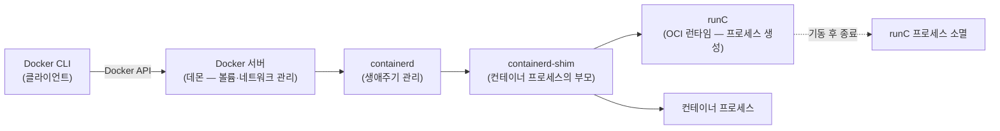
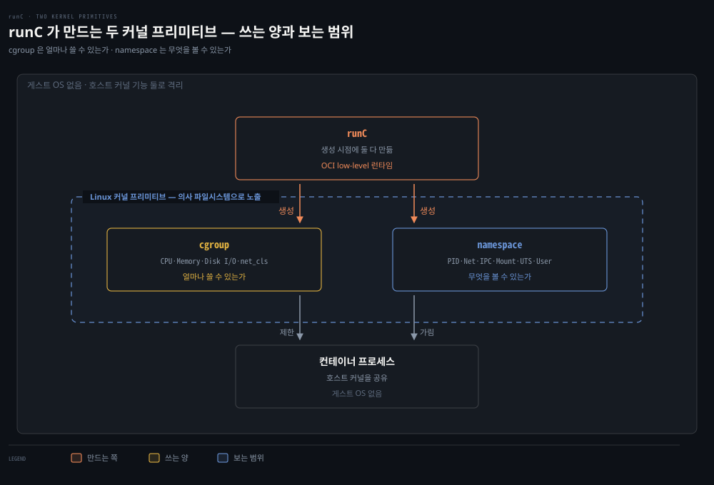

# 컨테이너의 탄생 — 앱 실행의 진화와 격리 프리미티브

## 핵심 요약
> 이 편 전체가 매달린 하나의 생각은 "컨테이너는 새 기술이 아니라 커널의 두 프리미티브(cgroup·namespace)를 묶은 포장"입니다.
> cgroup이 얼마나 쓸 수 있는가를, namespace가 무엇을 볼 수 있는가를 정합니다. 그 위에 이미지·레지스트리·런타임이라는 생태계가 쌓였고, 표준(OCI)과 계층 분해(Docker→containerd→runC)를 거치며 오늘의 모습이 됐습니다. 이 편 끝에서 컨테이너 하나의 네트워크를 맨손 Linux 명령으로 재현해 보면, 런타임이 대신해 주는 일이 무엇인지가 몸으로 이해됩니다.

## 학습 목표

이 내용을 읽고 나면:

1. 베어메탈 → 하이퍼바이저 → 컨테이너로 이어진 진화를 네트워킹 관점(TCP/IP 스택 수)에서 설명할 수 있습니다.
2. 컨테이너 생태계 용어(engine·runtime·image·repository)와 low/high-level 런타임을 구분할 수 있습니다.
3. Docker가 모놀리스에서 containerd·runC로 분해된 구조와 shim의 존재 이유를 말할 수 있습니다.
4. cgroup과 namespace 각각의 책임과 6가지 namespace 종류를 설명할 수 있습니다.
5. 네트워크 네임스페이스·veth·브리지를 손으로 배선해 컨테이너 네트워크를 재현할 수 있습니다.

## 1. 진화의 축은 "TCP/IP 스택이 몇 개인가"

베어메탈 한 대에 앱 여러 개를 올리던 시절의 문제를 저자들은 네트워킹 관점으로 요약합니다 — 운영체제가 하나면 TCP/IP 스택도 하나이고, 그 위의 모든 앱이 포트를 나눠 써야 해서 포트 충돌이 생깁니다. 여기에 라이브러리 버전 충돌, 회사마다 다른 배포 방식, 안정성을 지키려는 시스템 관리자와 새 기능을 배포하려는 개발자의 긴장이 겹칩니다.

하이퍼바이저(2001 VMware x86, 2003 Xen, 2006 KVM. 그 전에도 IBM z/Architecture·FreeBSD jail이 있었습니다)는 하드웨어를 에뮬레이션해 게스트 OS 여러 개를 올립니다. 팀마다 자기 게스트 OS와 네트워크 스택을 가지므로 A팀 Tomcat도 8080, B팀 Tomcat도 8080에서 돌 수 있게 됩니다. 그러나 라이브러리 버전·패키징·배포 문제는 남습니다.

컨테이너는 그 남은 문제를 겨냥합니다. 각 컨테이너가 독립적이라 개발자는 호스트 OS나 하부 라이브러리에 기대지 않고 필요한 것을 담아 배포할 수 있고, 컨테이너마다 자기 네트워크 스택을 가지면서도 게스트 OS 없이 호스트 효율을 유지합니다. "컨테이너는 실재하지 않는다(커널 기술의 추상화일 뿐이다)"라는 말은 기술적으로 맞지만, 저자들은 그 지적이 앱 관리·배포라는 어려운 문제를 푸는 데 아무 도움이 안 된다고 선을 긋습니다.

## 2. 생태계 용어 지도 — engine과 runtime을 가르는 선

컨테이너 학습을 어렵게 만드는 것은 용어입니다. 기준선은 기능의 높낮이입니다.

- low-level 기능 — 컨테이너 생성과 실행. cgroup·namespace를 만드는, 컨테이너 하나를 돌리기 위한 최소한
- high-level 기능 — 이미지 포맷·빌드·관리·공유, 컨테이너 인스턴스 관리. 개발자가 실제로 필요로 하는 작업들

| 용어 | 한 줄 정의 |
|------|-----------|
| Container | 실행 중인 컨테이너 이미지 |
| Image | 레지스트리에서 받아와 컨테이너 시작 시 마운트 포인트로 쓰는 파일 |
| Image layer | 부모-자식 관계로 연결된 변경분. 이미지는 실제로는 레이어들의 묶음 |
| Repository | 레이어들 + 이미지 메타데이터(manifest)로 구성 |
| Registry | 이미지를 저장·업로드·다운로드하는 서버 |
| Tag | 이미지 버전에 붙이는 사용자 정의 이름 |
| Container engine | 사용자 요청을 받아 이미지를 pull하고 컨테이너를 실행하는 소프트웨어 |
| Container runtime | engine 안에서 컨테이너 실행을 실제로 담당하는 low-level 부품 |
| Container orchestration | 컨테이너 호스트 클러스터에 워크로드를 동적으로 스케줄링 — Kubernetes가 하는 일 |

주요 구현체의 계보를 정리하면 이렇습니다.

- **LXC**(2008) — cgroup과 namespace를 묶은 C API. 컨테이너 런타임의 조상 격입니다.
- **runC** — Docker의 libcontainer를 분리해 OCI에 기증한 low-level CLI. 지금 가장 널리 쓰입니다.
- **containerd** — Docker에서 분리된 high-level 런타임. CNCF 졸업 프로젝트입니다.
- **CRI-O** — Red Hat이 2016년 시작해 2019년 CNCF에 기여한 Kubernetes 전용 경량 CRI 구현(UNIX 소켓 위 gRPC·Protobuf).
- **lmctfy**(Google, 2013)·**rkt**(CoreOS, 2014, 2020년 2월 아카이브) — 역사로 남았습니다.

표준이 이 계보를 묶습니다. OCI(Open Container Initiative)는 이미지 포맷과 런타임의 최소 개방 표준을 정해 컨테이너가 모든 주요 OS·플랫폼에서 이식되게 합니다. 세 가지 가치를 내세웁니다.

- **Composable** — 깨끗한 인터페이스, 특정 프로젝트에 비종속
- **Decentralized** — 한 조직이 아닌 커뮤니티가 명세 개발
- **Minimalist** — 최소·안정 명세로 혁신을 촉진

Docker(2013)는 이 모든 high-level 기능을 Docker engine이라는 단일 바이너리에 담은 모놀리스로 시작해, 몇 년에 걸쳐 부품으로 분해됐습니다.



shim이 이 그림의 요령입니다. containerd-shim이 컨테이너 프로세스의 부모로 남아 주기 때문에 runC는 컨테이너를 띄운 뒤 종료할 수 있고(장수 런타임 프로세스 불필요 — daemonless), containerd나 Docker가 죽어도 컨테이너의 표준 I/O와 파일 디스크립터가 열린 채 유지되며, 종료 상태를 상위 도구에 보고하는 일도 shim이 대신합니다.

Kubernetes와의 접점이 CRI입니다. CRI는 kubelet이 어떤 컨테이너 런타임과도 대화할 수 있게 하는 플러그인 인터페이스이고, 최초 구현이 Docker engine 앞에 추상화를 씌운 dockershim이었습니다. 책 시점(Kubernetes 1.20)에 dockershim 지원 중단이 예고됐는데 — 관리자용 Docker 런타임이 중단되는 것이지, 개발자가 Docker로 OCI 호환 컨테이너를 빌드하는 것은 그대로라는 구분이 중요합니다.

## 3. cgroup — 얼마나 쓸 수 있는가

cgroup은 자원 사용을 제한·계량·격리하는 Linux 커널 기능으로 2.6.24에 처음 들어왔습니다. 의사 파일시스템으로 제공되며 서브시스템별로 나뉩니다.

- **CPU** — 최소 지분 보장
- **Memory** — 메모리 상한
- **Disk I/O** — 장치 cgroup 서브시스템
- **Network** — `net_cls`가 cgroup을 떠나는 패킷에 마킹

`lscgroup`으로 현재 시스템의 cgroup 전체를 나열할 수 있고, 컨테이너 생성 시점에 cgroup을 만드는 것은 runC의 일입니다.

## 4. namespace — 무엇을 볼 수 있는가

namespace는 프로세스 집합의 시스템 자원을 격리·가상화하는 커널 기능입니다. 책이 드는 6종은 다음과 같습니다.

| namespace | 격리 대상 |
|-----------|----------|
| PID | 프로세스 ID — 프로세스 격리 |
| Network | 네트워크 인터페이스와 독립된 네트워킹 스택 |
| IPC | 프로세스 간 통신 자원 접근 |
| Mount | 파일시스템 마운트 포인트 |
| UTS | 호스트명·도메인명 — 한 호스트가 프로세스별로 다른 이름을 가질 수 있음 |
| User | 사용자·그룹 ID — 소유권 격리 (`CLONE_NEWUSER`) |

User namespace(공식 명칭 — 책은 "UID namespace"로 부릅니다)의 성질이 컨테이너 보안의 핵심 아이디어입니다. 같은 프로세스가 namespace 밖에서는 비특권 사용자이면서 안에서는 UID 0(root)일 수 있습니다 — 컨테이너 안에서는 root로 실행되지만 밖의 작업에 대해서는 비특권이라는 뜻입니다. 프로세스의 namespace는 `/proc/<PID>/ns`에서 확인합니다(`sudo ls -l /proc/1/ns`).

두 프리미티브의 분업을 한 문장으로 줄이면 — cgroup은 컨테이너가 자원을 얼마나 쓸 수 있는지를, namespace는 컨테이너 안 프로세스가 무엇을 볼 수 있는지를 통제합니다.



## 5. 컨테이너 네트워크를 맨손으로 — 런타임이 대신해 주는 일

low-level 런타임이 컨테이너 네트워크를 만들 때 실제로 실행하는 Linux 명령을 책은 처음부터 끝까지 보여 줍니다. 목표 구성은 "루트 네트워크 네임스페이스 ↔ (veth 쌍) ↔ 컨테이너 네임스페이스 + 브리지"입니다.

```console
$ echo 1 > /proc/sys/net/ipv4/ip_forward          # IP 포워딩 켜기 (기본 꺼짐)
$ sudo ip netns add net1                          # 새 네트워크 네임스페이스
$ sudo ip link add veth0 type veth peer name veth1    # veth 쌍 생성
$ sudo ip link set veth1 netns net1               # 한쪽을 net1으로 이동
$ sudo ip netns exec net1 ip addr add 192.168.1.101/24 dev veth1   # 주소 부여
$ sudo ip netns exec net1 ip link set dev veth1 up                 # 켜기
$ sudo ip link add br0 type bridge                # 브리지 생성
$ sudo ip link set dev br0 up
$ sudo ip link set enp0s8 master br0              # 호스트 인터페이스를 브리지에
$ sudo ip link set veth0 master br0               # veth 반대쪽도 브리지에
$ sudo ip netns exec net1 ip route add default via 192.168.1.100   # 기본 경로
```

배선 과정에서 배울 지점이 셋 있습니다. 첫째, IP 포워딩은 보통 호스트에는 필요 없지만(자기 트래픽만 주고받으므로) 남의 패킷을 받아 넘기는 순간부터 필수입니다. 둘째, 네임스페이스 안 veth에 주소를 주고 up해도 반대쪽이 내려가 있으면 상태가 LOWERLAYERDOWN·NO-CARRIER입니다 — 케이블 한쪽만 꽂힌 상태와 같습니다. 셋째, 다 연결해도 ping이 Destination Host Unreachable로 실패하면 남은 것은 기본 경로입니다. 새 네임스페이스는 완전히 별개의 TCP/IP 스택이라 라우팅 테이블도 비어 있기 때문입니다.

> 원문 정오: 책의 명령 예제에는 veth 쌍 생성 줄이 두 번 인쇄돼 있고(중복), 네임스페이스에 준 주소·기본 경로(192.168.1.100/101)와 검증 ping의 대상(192.168.2.100/101)이 예시 간에 일치하지 않습니다. 브리지에 붙이는 호스트 인터페이스도 본문 walkthrough는 `enp0s8`, recap 목록은 `enp0s3`으로 서로 다릅니다. 배선 절차 자체는 위 정리가 원문의 의도입니다.

저자들이 이 실습을 시키는 이유는 마지막 문단에 있습니다. 이 명령들은 컨테이너를 만들고 지울 때마다 전부 필요하고, 브리지 설정 하나 틀리면 네트워크 루프로 네트워크 일부가 통째로 내려갈 수 있습니다. 개발자가 이걸 다 기억할 수도, 시스템 관리자가 개발자에게 이 권한을 줄 수도 없습니다 — 그래서 네임스페이스 생성은 컨테이너 런타임의 일이 됐고, 그 네트워크 생성을 모든 시스템에 대해 표준화한 것이 CNI입니다.

> 💬 **비유**: cgroup과 namespace는 기숙사의 두 규칙입니다. cgroup은 배급 규칙입니다 — 방마다 전기·수도를 얼마나 쓸 수 있는지 정합니다. namespace는 시야 규칙입니다 — 자기 방 안만 보이게 벽을 세워, 각 방 입주자는 자기가 건물을 통째로 쓰는 줄 압니다. 컨테이너 런타임은 이 두 규칙으로 방을 찍어내는 관리사무소이고, 위 실습은 관리사무소 없이 직접 벽을 세우고 배선해 본 경험입니다.

## 심화 학습
> 책 밖에서 보강한 내용입니다. 출처를 함께 남깁니다.

- 책이 예고한 dockershim 중단의 결말: Kubernetes 1.24(2022)에서 dockershim이 실제로 제거됐습니다. 영향 범위와 오해(개발자의 Docker 빌드는 무관)는 책의 구분 그대로이며, [Kubernetes 공식 dockershim 제거 FAQ](https://kubernetes.io/blog/2022/02/17/dockershim-faq/)가 정리본입니다.
- cgroup에는 v1과 v2가 있고 책의 서술은 v1 계열입니다. v2는 단일 계층(unified hierarchy)으로 서브시스템 구조를 재설계했으며 Kubernetes는 1.25부터 cgroup v2 지원이 GA입니다 — [Kubernetes 문서 — cgroup v2](https://kubernetes.io/docs/concepts/architecture/cgroups/) 참조. 최신 배포판(Ubuntu 21.10+, RHEL 9+)은 v2가 기본입니다.
- 네임스페이스 실습을 K8s 관점으로 확장한 짝이 형제 정독본에 있습니다 — [『Kubernetes in Action』 02-03 네임스페이스와 cgroup으로 보는 컨테이너 격리](../kubernetes-in-action/02-03.%EB%84%A4%EC%9E%84%EC%8A%A4%ED%8E%98%EC%9D%B4%EC%8A%A4%EC%99%80%20cgroup%EC%9C%BC%EB%A1%9C%20%EB%B3%B4%EB%8A%94%20%EC%BB%A8%ED%85%8C%EC%9D%B4%EB%84%88%20%EA%B2%A9%EB%A6%AC.md).

## 결정 치트시트
> 용어 혼동이 올 때의 판별 질문입니다.

| 질문 | 답 |
|------|-----|
| 사용자 명령을 받아 이미지를 pull하고 실행까지 지휘하는가? | Container engine (Docker) |
| 컨테이너 프로세스를 실제로 만드는 low-level 부품인가? | Container runtime (runC) |
| engine과 runtime 사이에서 생애주기를 관리하는가? | containerd (high-level runtime) |
| kubelet이 런타임과 대화하는 인터페이스는? | CRI (구현: CRI-O, containerd) |
| 이미지 포맷·런타임의 표준 명세는? | OCI |
| "얼마나 쓰는가" vs "무엇을 보는가" | cgroup vs namespace |

## 면접에서 받을 만한 질문
> 답을 가리고 스스로 말해 본 뒤, 아래 정답 절에서 맞춰 봅니다.

1. 컨테이너를 "한 줄"로 정의한다면?
2. 베어메탈 → 하이퍼바이저 → 컨테이너의 진화를 네트워킹(TCP/IP 스택) 관점에서 설명해 보세요.
3. Docker는 모놀리스에서 어떤 부품들로 분해됐고, 그중 shim은 왜 필요한가요?
4. 컨테이너 안에서 root인데 왜 안전하다고 하나요?
5. VM과 컨테이너의 격리 차이는 무엇인가요?
6. (빈칸) 컨테이너 네트워크 배선을 손으로 하면 __·__·__·__ 순서로 만들고, 이 일이 런타임의 책임이 된 뒤 모든 시스템에 표준화한 것이 ____입니다.

## 정답 (자답 후 펼치기)

### 1. 컨테이너 한 줄 정의
"컨테이너란 cgroup으로 자원 사용량을, namespace로 가시 범위를 격리한 프로세스로, 게스트 OS 없이 앱별 독립 환경(네트워크 스택 포함)을 제공하는 커널 수준 추상화입니다."

### 2. 진화를 네트워킹 관점에서
진화의 동력은 네트워킹에서도 읽힙니다. 베어메탈은 TCP/IP 스택이 1개라 앱들이 포트를 나눠 쓰다 충돌하고, 하이퍼바이저는 게스트 OS마다 스택을 따로 가져 포트 충돌을 풀지만 게스트 OS 비용이 듭니다. 컨테이너는 게스트 OS 없이 컨테이너별 스택을 가져 두 이점을 함께 취합니다.

### 3. Docker 분해와 shim
Docker는 모놀리스에서 CLI → 데몬 → containerd → shim → runC로 분해됐습니다. shim(containerd-shim)이 컨테이너 프로세스의 부모로 남아 주기 때문에 runC는 컨테이너를 띄운 뒤 종료할 수 있고(daemonless), containerd·Docker가 죽어도 컨테이너의 stdio가 유지되며 종료 상태 보고까지 shim이 대신합니다.

### 4. 컨테이너 안 root의 안전성
User namespace 덕분입니다. 컨테이너 안에서 UID 0이어도 namespace 밖 호스트에서는 비특권 사용자로 매핑될 수 있어, 탈출하더라도 호스트 root 권한이 아닙니다. 물론 이것 하나로 충분한 것은 아니고 seccomp·capability 제한 등이 함께 쓰입니다.

### 5. VM과 컨테이너의 격리 차이
VM은 하이퍼바이저가 하드웨어를 에뮬레이션해 커널까지 분리하고, 컨테이너는 하나의 커널을 공유하며 cgroup·namespace로 프로세스 수준에서 격리합니다. 그래서 컨테이너가 가볍고 빠르지만 커널 취약점은 공유 위험이 됩니다.

### 6. 빈칸 정답
netns·veth·bridge·route(기본 경로) 순서로 만들며, 이 일이 런타임의 책임이 된 뒤 모든 시스템에 표준화한 것이 **CNI**입니다.

## 핵심 개념 체크리스트
- [ ] 베어메탈·하이퍼바이저·컨테이너의 차이를 TCP/IP 스택 수로 말할 수 있는가?
- [ ] engine / high-level runtime / low-level runtime에 Docker·containerd·runC를 배치할 수 있는가?
- [ ] OCI 세 가치와 runC의 유래(libcontainer 기증)를 아는가?
- [ ] namespace 6종과 각 격리 대상을 짝지을 수 있는가?
- [ ] veth·bridge·기본 경로 배선 순서를 재구성하고 각 단계의 실패 증상(NO-CARRIER, Host Unreachable)을 설명할 수 있는가?

## 참고 자료
- 《Networking and Kubernetes: A Layered Approach》(James Strong·Vallery Lancey, O'Reilly, 2021, ISBN 978-1492081654) Ch3
- [OCI — Open Container Initiative](https://opencontainers.org/)
- [Kubernetes dockershim 제거 FAQ](https://kubernetes.io/blog/2022/02/17/dockershim-faq/)
- 이전 편: [02-03. Linux 네트워크 진단 도구](./02-03.Linux%20%EB%84%A4%ED%8A%B8%EC%9B%8C%ED%81%AC%20%EC%A7%84%EB%8B%A8%20%EB%8F%84%EA%B5%AC%20%E2%80%94%20%EA%B3%84%EC%B8%B5%20%EC%88%9C%EC%84%9C%EB%8C%80%EB%A1%9C%20%EC%88%98%EC%82%AC%ED%95%98%EA%B8%B0.md)
- 다음 편: [03-02. 컨테이너 네트워킹 모드와 CNI](./03-02.%EC%BB%A8%ED%85%8C%EC%9D%B4%EB%84%88%20%EB%84%A4%ED%8A%B8%EC%9B%8C%ED%82%B9%20%EB%AA%A8%EB%93%9C%EC%99%80%20CNI%20%E2%80%94%20%EA%B2%A9%EB%A6%AC%EC%99%80%20%EC%97%B0%EA%B2%B0%EC%9D%98%20%EA%B1%B0%EB%9E%98.md)
