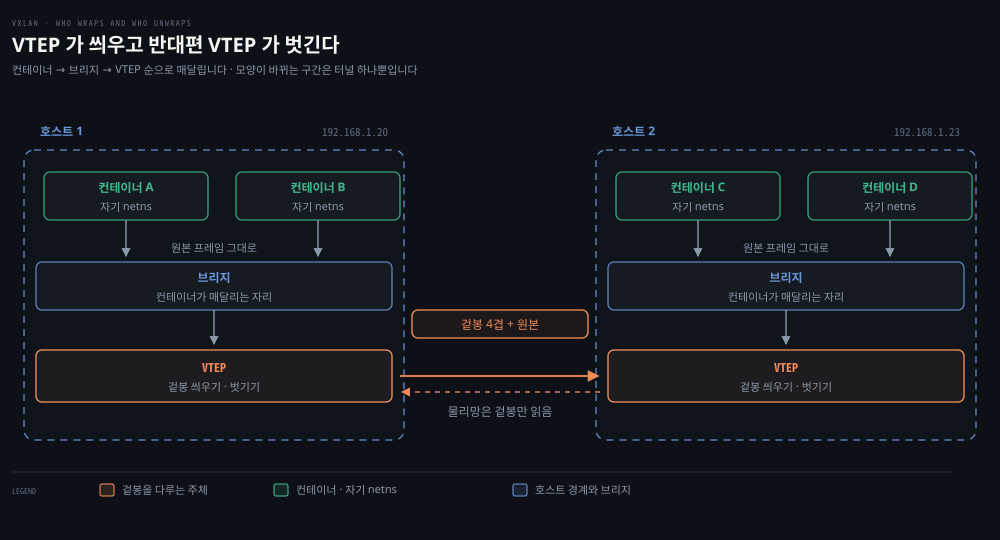

# 컨테이너 네트워킹 모드와 CNI — 격리와 연결의 거래

## 핵심 요약
> 이 편 전체가 매달린 하나의 생각은 "네트워킹 모드 선택이란 격리를 얼마나 포기하고 무엇을 얻는가의 거래"입니다.
> None(완전 격리)부터 Host(격리 포기)까지 일곱 모드가 그 거래의 스펙트럼이고, 호스트를 넘는 통신은 VXLAN 오버레이가 잇습니다. Docker는 이 배선을 CNM(libnetwork)으로 추상화했지만 Kubernetes는 더 단순하고 데몬이 필요 없는 CNI를 택했습니다 — 오늘날 Cilium·Flannel·Calico가 전부 이 인터페이스의 구현체입니다.

## 학습 목표

이 내용을 읽고 나면:

1. 컨테이너 네트워킹 모드 7종의 격리-연결 거래를 비교해 상황에 맞게 고를 수 있습니다.
2. Docker가 만드는 기본 네트워크(docker0, 172.17.0.0/16)와 컨테이너 배선을 실측 출력으로 읽을 수 있습니다.
3. CNM의 세 구성 요소(sandbox·endpoint·network)와 local/global 드라이버를 설명할 수 있습니다.
4. VXLAN의 MAC-in-UDP 캡슐화 구조와 VTEP의 역할을 그릴 수 있습니다.
5. Kubernetes가 CNM 대신 CNI를 택한 이유와 주요 CNI 구현체의 차별점을 말할 수 있습니다.

## 1. 일곱 가지 모드 — 격리와 연결의 스펙트럼

Docker 컨테이너에 쓸 수 있는 네트워크 모드는 격리 수준으로 줄 세울 수 있습니다.

| 모드 | 동작 | 거래 |
|------|------|------|
| None | 네트워킹 비활성화 | 완전 격리 — 네트워크가 필요 없는 컨테이너용 |
| Bridge | 호스트 내부 사설망에서 실행, 밖으로는 NAT | 기본값. 같은 네트워크 컨테이너끼리 개방, 외부는 NAT 경유 |
| Host | 호스트와 IP·네트워크 네임스페이스 공유 | 격리 포기 — 호스트 네트워크 자원 직접 접근, 포트 관리는 배포자 몫 |
| Macvlan | 부모 인터페이스 위 서브인터페이스마다 MAC·IP 부여 | 물리망에 직접 매핑 — 호스트와 같은 DHCP·스위치 사용. 대부분의 클라우드가 차단 |
| IPvlan | Macvlan과 유사하나 MAC은 부모 것을 공유, IP만 분리 | L2 모드(Macvlan 브리지 유사)와 L3 모드(서브인터페이스 사이 L3 장치처럼) |
| Overlay | 여러 호스트에 같은 네트워크를 확장 | 클러스터 통신 — 물리(언더레이) 위에 가상으로 얹힘 |
| Custom | 특정 용도로 명시적으로 만든 브리지 | 예: DB 전용 브리지 — 한 컨테이너가 기본·DB 브리지 양쪽에 인터페이스를 가질 수 있음 |

Host 모드는 Linux 호스트에서만 동작합니다(책 시점 기준 Docker Desktop 미지원 — 심화 학습에 후속 변화를 적어 두었습니다).

목록 밖에 하나 더, container-defined 네트워킹이 있습니다. 한 컨테이너가 다른 컨테이너의 주소·네트워크 설정을 공유하는 방식으로, 프로세스는 격리하되 서비스끼리 `127.0.0.1`로 통신하게 합니다. Kubernetes Pod가 정확히 이 아이디어 위에 서 있습니다.

## 2. Docker 실측 — 배선을 눈으로 확인하기

Docker 설치는 bridge·host·none 세 네트워크를 만들고(`docker network ls`), 호스트에 docker0 브리지 인터페이스를 세웁니다. 기본 서브넷은 `172.17.0.0/16`이고 docker0이 `172.17.0.1`을 가집니다.

busybox를 띄워 보면 컨테이너는 `172.17.0.2`를 받고, 컨테이너 안 라우팅 테이블에는 docker0(`172.17.0.1`)을 기본 경로로 하는 항목이 자동으로 잡혀 있습니다. `--net=host`로 띄우면 컨테이너 안에서 `ip a`가 호스트와 같은 인터페이스(enp0s3·enp0s8·docker0)를 그대로 보여 줍니다 — 네임스페이스를 공유한다는 뜻입니다.

전편에서 손으로 했던 배선(netns·veth·bridge·route)을 Docker는 `docker run` 한 번으로 끝냅니다. 호스트 쪽에는 `veth68b6f80@if11 ... master docker0 state UP` 같은 veth 반쪽이 생기고, 호스트 라우팅 테이블에 `172.17.0.0/16 dev docker0` 경로가 잡힙니다.

한 가지 실무 요령 — Docker는 자기가 만든 네트워크 네임스페이스를 `ip netns list`가 기대하는 `/var/run/netns`에 등록하지 않습니다. 세 단계로 우회합니다.

```console
$ sudo docker inspect -f '{{.State.Pid}}' <컨테이너ID>      # 1. 컨테이너의 호스트 PID
25719
$ sudo ln -sfT /proc/25719/ns/net /var/run/netns/<컨테이너ID>   # 2. netns 심볼릭 링크
$ sudo ip netns exec <컨테이너ID> ip a                       # 3. ip 도구로 조회 가능
```

## 3. CNM — Docker의 네트워킹 철학

Libnetwork는 Docker의 컨테이너 네트워킹 구현이고, 그 설계 철학이 CNM(Container Networking Model)입니다. 세 부품으로 움직입니다.

- **sandbox** — 호스트의 모든 컨테이너에 대한 Linux 네트워크 네임스페이스 관리
- **endpoint** — 네트워크 위의 호스트
- **network** — 같은 네트워크에 속한 endpoint의 집합

네트워크 컨트롤러가 Docker engine의 API로 이를 관리합니다.

endpoint에서 Docker는 iptables로 네트워크를 격리합니다. 컨테이너는 공인 IPv4가 아니라 사설(RFC 1918) 주소를 받으므로, 외부에 서비스하려면 포트를 하나씩 호스트 포트에 매핑해 노출해야 합니다(충돌 회피는 매핑의 몫).

드라이버는 두 부류입니다.

- **local 드라이버**(bridge 등) — 호스트 중심이라 노드 간 조율을 하지 않습니다.
- **global 드라이버**(Overlay 등) — 노드 간 조율을 맡되 libkv라는 키-값 저장소 추상화에 의존합니다.

CNM은 저장소를 제공하지 않아 Consul·etcd·Zookeeper 같은 외부 저장소가 필요합니다.

## 4. VXLAN — 호스트의 경계를 넘는 다리

단일 호스트를 넘어 컨테이너끼리 통신하려면 호스트 간 라우팅 정보 조율·포트 충돌·IP 관리 문제를 풀어야 하고, 그 대표 기술이 1장에서 만난 VXLAN입니다. VLAN이 IEEE 802.1Q 아래 최대 4,094개인 데 비해 VXLAN은 24비트 식별자로 1,600만 세그먼트를 만듭니다.

핵심은 MAC-in-UDP 캡슐화입니다 — 원본 L2 프레임에 VXLAN 헤더를 붙여 UDP-IP 패킷 안에 넣습니다.



양쪽 호스트의 VTEP(VXLAN Tunnel Endpoint)가 이 캡슐화·역캡슐화를 수행합니다. VTEP는 호스트의 브리지 인터페이스에 붙어 있고 컨테이너들이 그 브리지에 연결됩니다. 컨테이너를 떠난 데이터는 VXLAN 정보로 감싸져 터널을 건너고, 상대 VTEP가 벗겨 목적지 컨테이너로 전달합니다. 물리 데이터센터 네트워크(L3) 위에 L2 오버레이가 "가상으로 얹히는" 구조입니다.

> 💬 **비유**: VXLAN은 국제 이사짐 컨테이너입니다. 가구(원본 L2 프레임)를 방 배치 그대로 컨테이너 박스(UDP 패킷)에 통째로 넣고 송장(VXLAN 헤더의 VNI)을 붙이면, 배송망(L3 물리망)은 내용물을 몰라도 박스만 나릅니다. 도착지 창고(VTEP)가 박스를 열어 가구를 원래 배치 그대로 꺼내 놓으므로, 두 집(호스트)의 방(컨테이너)들은 같은 건물에 있는 것처럼 느낍니다.

## 5. CNI — Kubernetes가 고른 인터페이스

오버레이로 호스트 간 통신은 풀리지만, CNM에는 Kubernetes와 맞지 않는 문제가 남아 있었습니다. Kubernetes 메인테이너들은 CoreOS의 rkt 프로젝트에서 시작된 CNI를 택했습니다 — CNM보다 단순하고, 데몬이 필요 없으며, 크로스플랫폼으로 설계됐기 때문입니다.

CNI는 컨테이너 런타임과 네트워크 구현 사이의 소프트웨어 인터페이스입니다(현재 CNCF 프로젝트). 명세와 플러그인 개발용 라이브러리로 구성되며, 컨테이너가 생성될 때 네트워크 자원을 할당하고 삭제될 때 회수하는 일에만 관여합니다. CNI 플러그인의 책임은 셋입니다.

1. 네트워크 인터페이스를 컨테이너 네임스페이스에 연결합니다.
2. 호스트에 필요한 변경을 가합니다.
3. 그 인터페이스에 IP를 할당하고 경로를 설정합니다.

런타임(Kubernetes에서는 kubelet)이 호스트 네트워크 정보가 담긴 설정 파일을 읽어 구성된 CNI 플러그인에 명령을 내립니다.

책이 소개하는 구현체 네 가지의 성격이 뚜렷합니다.

| CNI | 접근 | 특징 |
|-----|------|------|
| Cilium | eBPF | L7/HTTP 인지. 주소가 아닌 identity 기반 보안 모델로 L3~L7 네트워크 정책 강제 |
| Flannel | 단순 L3 패브릭 | 네트워킹에만 집중. 상태 저장에 클러스터의 기존 etcd를 재사용 |
| Calico | BGP 라우팅 | 오버레이를 쓰지 않음 — L3 네트워크를 구성해 호스트 간 BGP로 라우팅. 네트워크 정책 완전 지원, Istio 통합 |
| AWS VPC CNI | 네이티브 VPC | 오버레이 없이 AWS 망 위에 직접 — 낮은 지연, VPC flow logs·보안 그룹 등 기존 AWS 관행 그대로 적용 |

어느 CNI를 고를지는 클러스터 관리자·네트워크 관리자·개발자의 비즈니스 요구에 달렸고, 이 책 후반부(6장)에서 실제 배포로 다시 다룹니다.

## 심화 학습
> 책 밖에서 보강한 내용입니다. 출처를 함께 남깁니다.

- Kubernetes가 CNM을 거부한 상세한 이유는 Kubernetes 블로그의 [Why Kubernetes doesn't use libnetwork](https://kubernetes.io/blog/2016/01/why-kubernetes-doesnt-use-libnetwork/)(2016, Tim Hockin)에 1차 기록으로 남아 있습니다 — 요지는 CNM이 Docker 중심 가정(로컬 드라이버 구조, 전역 상태 저장소 요구)을 깔고 있어 런타임 중립 추상화로 쓰기 어렵다는 것이었습니다.
- CNI 명세와 플러그인 목록의 정본은 [cni.dev](https://www.cni.dev/)입니다. K8s 문서의 [네트워크 플러그인 안내](https://kubernetes.io/docs/concepts/extend-kubernetes/compute-storage-net/network-plugins/)가 kubelet과의 접점을 설명합니다.
- "Docker Desktop은 host 모드 미지원"은 책 시점(2021)의 사실입니다. Docker Desktop 4.34(2024)부터는 Mac·Windows에서도 host networking을 지원합니다 — [Docker 문서 — host network driver](https://docs.docker.com/engine/network/drivers/host/) 참조. 본문 표의 경고는 낡은 정보로 읽어야 합니다.
- Calico도 순수 BGP만 있는 것은 아닙니다 — 노드 간 L2 인접이 불가능한 환경(클라우드 서브넷 간)을 위해 VXLAN·IP-in-IP 캡슐화 모드를 함께 제공합니다. [Calico 문서 — 오버레이 네트워킹](https://docs.tigera.io/calico/latest/networking/configuring/vxlan-ipip) 참조. "Calico = 오버레이 없음"은 기본 지향이지 절대 조건이 아니라는 뜻입니다.

## 결정 치트시트
> 모드 선택은 "무엇을 포기할 수 있는가"로 가립니다.

| 상황 | 모드 | 근거 |
|------|------|------|
| 네트워크가 아예 불필요 (배치 연산 등) | None | 공격 표면 최소화 |
| 일반적인 단일 호스트 컨테이너 | Bridge (기본) | 격리 + NAT 외부 통신 |
| 호스트 네트워크 자원에 직접 접근 필요 (노드 에이전트) | Host | 격리 포기를 감수 — 포트 충돌 관리는 배포자 책임 |
| 컨테이너가 물리망의 1급 시민이어야 함 (기존 DHCP·스위치) | Macvlan / IPvlan | 온프레미스 한정 — 클라우드는 대부분 차단 |
| 여러 호스트에 걸친 컨테이너 통신 | Overlay (VXLAN) | 언더레이 위 가상 L2 |
| 서비스별 네트워크 분리 (DB 전용망 등) | Custom bridge | 브리지 단위 세그먼테이션 |

## 면접에서 받을 만한 질문
> 답을 가리고 스스로 말해 본 뒤, 아래 정답 절에서 맞춰 봅니다.

1. CNI를 "한 줄"로 정의한다면?
2. 컨테이너 네트워킹 모드 선택을 "거래"라고 부르는 이유는? Bridge와 Host를 예로 설명해 보세요.
3. VXLAN의 캡슐화 구조를 그려 보세요. VTEP는 무엇을 하나요?
4. Kubernetes가 CNM 대신 CNI를 택한 이유 세 가지는?
5. Macvlan과 IPvlan은 어떻게 다르고 언제 IPvlan을 쓰나요?
6. Calico가 "오버레이 없이 동작한다"는 것은 무슨 뜻인가요?
7. 컨테이너가 사설 IP(RFC 1918)만 받는데 외부 서비스는 어떻게 하나요?

## 정답 (자답 후 펼치기)

### 1. CNI 한 줄 정의
"CNI란 컨테이너 런타임과 네트워크 구현 사이의 인터페이스 명세로, 컨테이너 생성 시 인터페이스 연결·IP 할당·경로 설정을, 삭제 시 자원 회수를 플러그인에 위임합니다."

### 2. 모드 선택이 거래인 이유
모드 선택은 격리-연결 거래입니다. Bridge(기본)는 사설망 격리를 유지하되 외부 통신은 NAT를 거치고, Host는 그 격리를 포기하는 대신 호스트 네트워크 자원에 직접 접근합니다. 얻는 것(성능·직접성)과 포기하는 것(격리·포트 자율성)이 늘 짝으로 움직입니다.

### 3. VXLAN 캡슐화와 VTEP
VXLAN은 MAC-in-UDP입니다. 원본 L2 프레임을 VNI(24비트) 헤더와 함께 UDP-IP 패킷에 넣어 L3 물리망 위에 L2 오버레이를 얹습니다. 캡슐화·역캡슐화는 양끝 VTEP(VXLAN Tunnel Endpoint)가 맡아, 물리망은 바깥 헤더만 보고 내용물(원본 프레임)은 모른 채 패킷을 나릅니다.

### 4. Kubernetes가 CNI를 택한 이유
CNM보다 ① 더 단순하고, ② 데몬이 필요 없으며, ③ 크로스플랫폼으로 설계됐기 때문입니다. 그 결과 Cilium(eBPF)·Flannel(단순 L3)·Calico(BGP) 같은 다양한 구현이 경쟁하는 생태계가 됐습니다.

### 5. Macvlan과 IPvlan
Macvlan은 서브인터페이스마다 별도 MAC을 부여하고, IPvlan은 부모 MAC을 공유하며 IP만 나눕니다. 스위치 포트당 MAC 수 제한이나 무선 환경처럼 MAC 여러 개가 문제 되는 곳에서 IPvlan이 대안이 됩니다.

### 6. Calico의 오버레이 없는 동작
컨테이너 트래픽을 캡슐화하지 않고, 각 호스트가 자기 컨테이너 대역을 BGP로 광고해 순수 L3 라우팅으로 전달한다는 뜻입니다. 캡슐화 오버헤드가 없는 대신 네트워크가 BGP 경로를 받아 줄 수 있어야 하고, 그렇지 못한 환경을 위해 VXLAN·IP-in-IP 모드도 제공합니다.

### 7. 사설 IP 컨테이너의 외부 서비스
포트 매핑입니다. 컨테이너 포트를 호스트 포트에 하나씩 매핑해 노출하고, 나가는 트래픽은 NAT(MASQUERADE)로 호스트 주소를 씁니다. 이 포트 단위 노출의 번거로움이 다음 편(연결 실습)에서 실측으로 드러납니다.

## 핵심 개념 체크리스트
- [ ] 7가지 모드 각각의 거래(얻는 것/포기하는 것)를 말할 수 있는가?
- [ ] docker0·veth·컨테이너 라우팅 테이블의 기본 배선을 실측 출력에서 읽을 수 있는가?
- [ ] CNM의 sandbox·endpoint·network와 local/global 드라이버를 구분할 수 있는가?
- [ ] VXLAN 패킷의 캡슐화 구조(외부 IP·UDP·VNI·원본 프레임)를 그릴 수 있는가?
- [ ] Kubernetes가 CNI를 택한 세 가지 이유를 아는가?
- [ ] Cilium·Flannel·Calico·AWS VPC CNI의 접근 차이를 한 줄씩 말할 수 있는가?

## 참고 자료
- 《Networking and Kubernetes: A Layered Approach》(James Strong·Vallery Lancey, O'Reilly, 2021, ISBN 978-1492081654) Ch3
- [CNI 공식 — cni.dev](https://www.cni.dev/)
- [Why Kubernetes doesn't use libnetwork](https://kubernetes.io/blog/2016/01/why-kubernetes-doesnt-use-libnetwork/)
- [RFC 7348 — VXLAN](https://datatracker.ietf.org/doc/html/rfc7348)
- 이전 편: [03-01. 컨테이너의 탄생](./03-01.%EC%BB%A8%ED%85%8C%EC%9D%B4%EB%84%88%EC%9D%98%20%ED%83%84%EC%83%9D%20%E2%80%94%20%EC%95%B1%20%EC%8B%A4%ED%96%89%EC%9D%98%20%EC%A7%84%ED%99%94%EC%99%80%20%EA%B2%A9%EB%A6%AC%20%ED%94%84%EB%A6%AC%EB%AF%B8%ED%8B%B0%EB%B8%8C.md)
- 다음 편: [03-03. 컨테이너 연결 실습](./03-03.%EC%BB%A8%ED%85%8C%EC%9D%B4%EB%84%88%20%EC%97%B0%EA%B2%B0%20%EC%8B%A4%EC%8A%B5%20%E2%80%94%20%EA%B0%99%EC%9D%80%20%ED%98%B8%EC%8A%A4%ED%8A%B8%2C%20%EB%8B%A4%EB%A5%B8%20%ED%98%B8%EC%8A%A4%ED%8A%B8.md)
