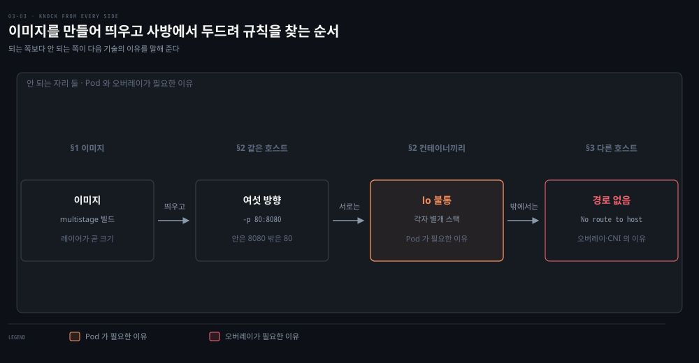
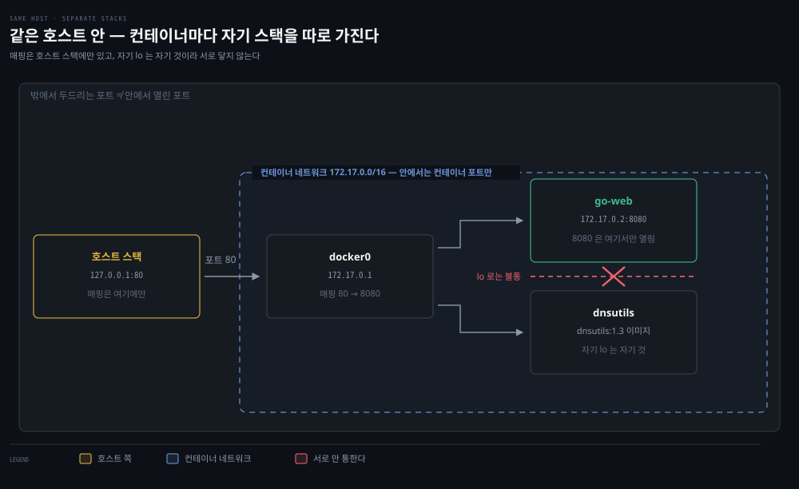
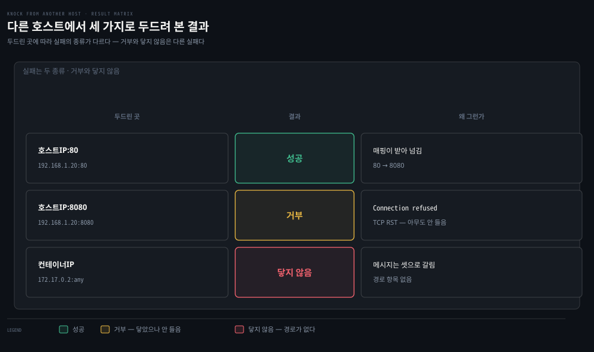

# 컨테이너 연결 실습 — 같은 호스트, 다른 호스트

---

## 핵심 요약
> 이 편 전체가 매달린 하나의 생각은 **"포트 매핑에는 양면이 있다 -컨테이너 네트워크 안에서는 컨테이너 포트만, 밖에서는 호스트 포트만 통한다"**입니다.
>
> Go 웹 서버를 `-p 80:8080`으로 띄우고 여섯 방향에서 접근해 보면, 어떤 조합은 되고 어떤 조합은 거부되는지가 명확한 규칙으로 드러납니다. 그리고 다른 호스트에서 컨테이너 IP로는 아예 경로가 없다는 마지막 실험이, 오버레이·CNI가 존재하는 이유이자 Kubernetes 네트워킹 모델로 넘어가는 다리가 됩니다.


## 학습 목표
> 포트 매핑을 명령어로 외우는 대신, 어디서 무엇을 부르면 되고 안 되는지를 규칙으로 재구성할 수 있는 상태를 목표로 합니다.

이 내용을 읽고 나면:

1. multistage Dockerfile의 각 지시어가 하는 일과 레이어·캐시의 관계를 설명할 수 있습니다.
2. Dockerfile 모범 관행 5가지를 근거와 함께 적용할 수 있습니다.
3. `-p 호스트:컨테이너` 포트 매핑의 접근 가능 조합을 여섯 방향 실험으로 재구성할 수 있습니다.
4. 두 컨테이너가 localhost로 서로 통하지 않는 이유를 네임스페이스로 설명할 수 있습니다.
5. 다른 호스트에서 컨테이너 IP에 도달할 수 없는 이유와 그 해법(오버레이·외부 라우팅)을 말할 수 있습니다.

아래는 이 편 전체를 실험 순서로 이은 지도입니다. 이미지를 만들고 띄운 뒤 사방에서 두드려 보는 흐름입니다. 단계 위의 이름이 본문에서 그것을 다루는 절입니다. 오른쪽으로 갈수록 두드리는 곳이 멀어지고, 마지막 칸이 이 편의 결론입니다. 다른 호스트에서 컨테이너 IP 로 가는 길이 아예 없다는 사실이 오버레이와 CNI 의 존재 이유입니다.




## 1. Go 웹 서버 컨테이너화 — multistage Dockerfile 해부
> Dockerfile 의 모범 관행은 전부 레이어와 캐시를 향합니다. 줄 하나가 레이어 하나가 되고, 레이어가 곧 이미지 크기이자 기동 시간이기 때문입니다.


### 풀려는 문제

Dockerfile 은 몇 줄만 적어도 일단 돌아갑니다. 문제는 그다음입니다. 이미지가 수백 MB 로 불어나면 배포할 때마다 노드가 그것을 통째로 내려받느라 기동이 늦어집니다. "명령을 `&&` 로 묶어라", "multistage 를 써라" 같은 관행은 들어 봤을 것입니다. 왜 그런지 모르면 어느 것을 언제 지켜야 할지 정할 수 없습니다.

다섯 가지 관행이 사실은 한 가지 인과에서 나옵니다. 그 인과를 먼저 세우면 관행은 외울 목록이 아니라 따라 나오는 결론이 됩니다.

실험 재료는 1장부터 쓰던 Go 웹 서버(`0.0.0.0:8080`, "Hello" 응답)입니다. 이미지를 만드는 Dockerfile은 빌드와 실행을 나눈 multistage 구성입니다.

```dockerfile
FROM golang:1.15 AS builder      # 빌드 스테이지 — Go 컴파일러 포함 베이스
WORKDIR /opt                     # 이후 명령의 작업 디렉터리
COPY web-server.go .             # 소스를 작업 디렉터리로
RUN CGO_ENABLED=0 GOOS=linux go build -o web-server .   # 컴파일

FROM golang:1.15                 # 실행 스테이지 (alpine 등으로 더 줄일 수 있음)
WORKDIR /opt
COPY --from=builder /opt/web-server .  # 빌드 스테이지에서 바이너리만 복사
CMD ["/opt/web-server"]          # 컨테이너 시작 시 실행할 명령
```

Dockerfile의 각 줄은 이미지 상태를 바꾸면 새 레이어를 만듭니다. 그래서 책이 정리하는 모범 관행 5가지가 전부 레이어와 캐시를 향합니다.

1. Dockerfile당 ENTRYPOINT(또는 CMD)는 하나만 — 컨테이너는 프로세스 격리이므로 실행 프로세스도 하나여야 합니다.
2. 비슷한 명령은 `&&`와 `\`로 묶어 레이어 수를 줄입니다 — 명령마다 레이어가 늘어 저장 공간이 커지기 때문입니다.
3. 캐시를 살리는 순서로 씁니다 — 변할 일 없는 것을 위에, 자주 변하는 것을 아래에. 레이어가 안 바뀌면 빌드가 캐시를 재사용합니다.
4. multistage 빌드로 최종 이미지를 극적으로 줄입니다 — 컴파일러·소스를 버리고 산출물만 남깁니다.
5. 불필요한 도구·패키지를 설치하지 않습니다 — 공격 표면과 크기가 함께 줄고, 레지스트리에서 호스트로의 전송 시간도 줄어듭니다.

크기가 왜 관행의 공통 분모인지는 본문의 다른 대목이 보충합니다 — 이미지가 로컬에 없으면 레지스트리에서 내려받아야 하므로, 이미지 크기가 곧 기동 시간입니다.

`docker build .`로 빌드하고 `docker tag <ID> go-web:v0.0.1`로 이름을 붙입니다. 조회·운영 명령은 2장 진단 도구의 컨테이너판입니다 — `docker images`(로컬 이미지), `docker ps`(실행 중 컨테이너), `docker logs`(표준 출력), `docker exec`(컨테이너 안 명령 실행).


## 2. 같은 호스트 — 여섯 방향 접근 실험
> 같은 호스트 안에서도 어디서 부르느냐에 따라 결과가 갈립니다. 컨테이너 네트워크 안에서는 컨테이너 포트만, 밖에서는 호스트 포트만 통합니다.



### 풀려는 문제

`-p 80:8080` 을 붙여 컨테이너를 띄웠습니다. 그런데 결과가 자리마다 다릅니다. 호스트에서 `curl localhost:80` 은 되는데 `localhost:8080` 은 거부되고, 옆 컨테이너에서 부르면 반대로 8080 만 됩니다. 같은 컨테이너를 같은 호스트 안에서 부르는데 왜 갈릴까요.

부르는 자리마다 서 있는 네트워크 스택이 다르기 때문입니다. 이 절은 여섯 방향을 하나씩 두드려 보고 그 규칙을 표로 굳힙니다. 마지막 한 행이 Pod 가 왜 그런 모양인지까지 설명합니다.

상대 컨테이너로 K8s e2e 테스트용 dnsutils 이미지를 함께 띄우고, Go 서버를 포트 매핑과 함께 시작합니다.

실험 전 확인 하나 — dnsutils에서 `ping google.com`이 바로 성공합니다. 기본 브리지 모드만으로도 밖으로 나가는 통신은 NAT 덕분에 문제가 없다는 뜻이고, 문제는 언제나 "밖에서 안으로" 들어오는 방향입니다.

```bash
sudo docker run -it -d -p 80:8080 go-web:v0.0.1
```

`-d`는 분리 모드, `-p 80:8080`이 네트워크의 핵심입니다 — 컨테이너의 8080 포트를 호스트의 80 포트로 노출합니다. 책 그대로 옮긴 `-it` 는 분리 모드와 함께 쓰면 무의미합니다(TTY·stdin 을 붙여 놓고 곧바로 떼어 놓는 셈이라 오류는 아니고 무효). 실제로는 `sudo docker run -d -p 80:8080 go-web:v0.0.1` 로 충분합니다. Go 서버 컨테이너의 Docker IP는 `docker inspect`로 확인하면 `172.17.0.2`입니다. 이제 여섯 방향에서 접근해 봅니다.

| 어디서 | 무엇으로 | 결과 | 이유 |
|--------|---------|------|------|
| dnsutils 컨테이너 | `172.17.0.2:8080` | 성공 | 같은 docker0 브리지 — 컨테이너 네트워크 안에서는 컨테이너 포트 |
| dnsutils 컨테이너 | `172.17.0.2:80` | 거부 | 80은 호스트 쪽 포트 — 컨테이너 네트워크에는 존재하지 않음 |
| 호스트 | `172.17.0.2:8080` | 성공 | 호스트는 컨테이너 대역으로의 경로를 가짐 (`172.17.0.0/16 dev docker0`) |
| 호스트 | `127.0.0.1:80` | 성공 | 포트 매핑이 노출한 호스트 포트 |
| 호스트 | `127.0.0.1:8080` | 거부 | 컨테이너 포트는 호스트 loopback에 노출되지 않음 |
| dnsutils 컨테이너 | `localhost:80` / `localhost:8080` | 둘 다 거부 | dnsutils는 완전히 별개의 네트워크 스택 — Go 서버와 네임스페이스를 공유하지 않음 |

마지막 행이 이 실험의 백미입니다. 저자들은 이것이 왜 안 되는지 아는 것이 Kubernetes 이해에 필수라고 짚습니다 — Pod는 같은 네트워크 네임스페이스를 공유하는 컨테이너들의 묶음이라서, Pod 안에서는 바로 이 "안 되던 localhost 통신"이 되기 때문입니다. 전편에서 본 container-defined 네트워킹이 그 원형입니다.

표의 결과가 왜 그렇게 갈리는지는 배선을 보면 드러납니다. 위 도식에서 점선 상자 안이 컨테이너 네트워크이고, 왼쪽 바깥이 호스트 자신의 네트워크 스택입니다. 포트 매핑 `80 → 8080`은 docker0 쪽에만 존재하므로, 상자 안에서 80을 불러도 받아 줄 것이 없습니다. 두 컨테이너가 각각 자기 상자를 따로 가진다는 점이 마지막 행의 이유입니다. 각자의 `localhost`는 서로 다른 세계입니다.


## 3. 다른 호스트 — 경로가 없다는 것의 의미
> 다른 호스트에서 컨테이너 IP 를 부르면 거부가 아니라 경로 없음이 돌아옵니다. 이 차이가 오버레이와 CNI 가 존재하는 이유를 가리킵니다.



### 풀려는 문제

앞 절은 호스트 하나 안에서의 규칙이었습니다. 호스트를 넘으면 실패의 *성격*이 바뀝니다. 어떤 주소는 연결이 거부되고 어떤 주소는 아예 닿지 않는데, 둘을 같은 "안 된다"로 뭉뚱그리면 원인을 영영 못 찾습니다.

둘을 가르는 것이 이 절의 핵심입니다. 거부는 목적지까지는 갔다는 뜻이고, 경로 없음은 출발조차 못 했다는 뜻입니다. 이 차이가 오버레이와 CNI 가 왜 존재하는지를 그대로 가리킵니다.

두 번째 Vagrant 호스트(host-2, `192.168.1.23`)에서 같은 실험을 반복하면 규칙이 하나 더 드러납니다.

- `192.168.1.20:80`(Docker 호스트 IP + 노출된 호스트 포트) → 성공
- `192.168.1.20:8080`(호스트 IP + 컨테이너 포트) → 거부
- `172.17.0.2:80`·`172.17.0.2:8080`(컨테이너 IP) → 닿지 않음 (아래 단서 참조)

> 실측 단서 둘. (1) 책은 이 자리에 `No route to host` 를 적지만 **그 메시지가 나오려면 host-2 에 기본 경로가 없어야 합니다.** 기본 게이트웨이가 있으면 패킷은 일단 밖으로 나갔다가 답을 못 받아 **타임아웃**으로 끝나는 쪽이 흔합니다. `No route to host` 는 커널이 보낼 경로를 아예 못 찾았거나 게이트웨이가 ICMP Destination Unreachable 을 돌려줄 때 뜹니다. 어느 쪽이든 결론(닿지 않는다)은 같지만 증상 문자열은 환경에 따라 갈립니다. (2) **이 실습은 Linux 호스트가 전제입니다** — Docker Desktop for Mac·Windows 에서는 호스트에 `docker0` 브리지가 없고 컨테이너 IP 로의 경로도 없어, 호스트 자신에서 `172.17.0.2` 를 두드리는 행조차 성립하지 않습니다. 책처럼 Vagrant 로 Linux VM 두 대를 띄워야 아래 표가 재현됩니다.

거부(Connection refused)와 경로 없음의 차이를 눈여겨봐야 합니다.

- **거부**: 호스트 IP로는 도달하지만 그 포트에 아무도 듣지 않아 거부됩니다(TCP RST 회신).
- **경로 없음**: host-2 의 라우팅 테이블에 `172.17.0.0/16` 을 host-1 로 보내는 **경로 항목이 없기 때문**입니다. 사설 대역이어서가 아닙니다 — 같은 사설 대역인 `192.168.1.0/24` 는 잘 통하는 것이 반례입니다. 경로가 있느냐 없느냐가 갈림이고, 주소가 공인이냐 사설이냐는 무관합니다.

호스트가 Docker IP 대역으로 라우팅하려면 오버레이 네트워크나 Docker 밖의 외부 라우팅이 필요합니다. Kubernetes에서도 라우팅은 외부의 일이고, 많은 CNI가 바로 이 문제를 풉니다(6장에서 클러스터 배포와 함께 재등장).

host-2에서 같은 컨테이너를 세 가지 주소로 두드렸을 때 무엇이 돌아오는지를 한 장에 모은 것이 위 도식입니다. 왼쪽이 시도한 주소이고 오른쪽이 그 결과입니다. 위 두 줄은 목적지 호스트까지는 닿았고, 맨 아래 줄만 애초에 갈 길이 없었다는 점이 이 그림의 요점입니다.

> 💬 **비유**: 포트 매핑은 회사의 대표 전화입니다. 외부인(host-2)은 대표번호(호스트 IP:80)로만 걸 수 있고, 내선번호(172.17.0.2:8080)는 사내 전화망(docker0 브리지) 안에서만 통합니다. 외부에서 내선번호를 눌러 봐야 "없는 번호"(No route)이고, 대표번호 뒤에 몇 번 내선이 연결돼 있는지(80→8080)는 교환대(포트 매핑)만 압니다. 그리고 옆 부서 동료(다른 컨테이너)에게 "내 자리 전화(localhost)"로 걸면 자기 자리에서 벨이 울릴 뿐입니다 — 각자 전화기가 다르니까요.


## 심화 학습
> 책 밖에서 보강한 내용입니다. 출처를 함께 남깁니다.

- Dockerfile 모범 관행의 공식 정본은 [Docker 문서 — Building best practices](https://docs.docker.com/build/building/best-practices/)입니다. 책의 5가지에 더해 `.dockerignore`, 비-root USER 지정, 베이스 이미지 고정(digest pinning) 같은 항목이 추가돼 있습니다.
- "Pod 안 컨테이너는 localhost로 통한다"의 K8s 쪽 정본은 형제 정독본 [『Kubernetes in Action』 05-01 Pod 이해 — 컨테이너 그룹화와 사이드카](../kubernetes-in-action/05-01.Pod%20%EC%9D%B4%ED%95%B4%20%E2%80%94%20%EC%BB%A8%ED%85%8C%EC%9D%B4%EB%84%88%20%EA%B7%B8%EB%A3%B9%ED%99%94%EC%99%80%20%EC%82%AC%EC%9D%B4%EB%93%9C%EC%B9%B4.md)입니다. 이 편의 "안 되는 실험"과 그 편의 "되는 구조"를 짝으로 읽으면 Pod의 존재 이유가 선명해집니다.
- 이 편의 실험을 요즘 도구로 재현한다면 dnsutils 이미지 대신 [nicolaka/netshoot](https://github.com/nicolaka/netshoot)이 사실상 표준입니다 — 2장 진단 도구가 전부 들어 있는 트러블슈팅 전용 이미지입니다.


## 결정 치트시트
> "누가 어디에 닿는가" — 이 표 하나가 이 편의 전부입니다.

| 출발지 → 목적지 | 컨테이너IP:컨테이너포트 | 컨테이너IP:호스트포트 | 호스트IP(또는 lo):호스트포트 | 호스트IP:컨테이너포트 |
|----------------|----------------------|---------------------|---------------------------|---------------------|
| 같은 호스트의 다른 컨테이너 | 성공 | 거부 | (localhost는 자기 스택) | - |
| 호스트 자신 | 성공 | 거부 | 성공 | 거부 |
| 다른 호스트 | No route | No route | 성공 | 거부 |


## 면접에서 받을 만한 질문
> 답을 가리고 스스로 말해 본 뒤, 아래 정답 절에서 맞춰 봅니다.

1. 포트 매핑(`-p 호스트:컨테이너`)을 "한 줄"로 정의한다면?
2. 컨테이너 네트워크의 접근 규칙을 "안/밖 이분법"으로 설명해 보세요.
3. Connection refused와 No route to host는 어떻게 다르게 해석하나요?
4. 두 컨테이너의 localhost가 서로 통하지 않는 이유는? 이것이 Pod와 무슨 관계인가요?
5. multistage 빌드가 이미지를 줄이는 원리는 무엇인가요?
6. (빈칸) 다른 호스트에서 컨테이너 IP(`172.17.0.0/16`)로 접근하면 결과는 ____이고, 그 이유는 ____ 대역으로의 ____가 없기 때문입니다. 해법은 ____ 또는 외부 라우팅입니다.


## 정답 (자답 후 펼치기)
> 위 §면접에서 받을 만한 질문에 *먼저 자답한 뒤* 아래를 읽으세요. 자답 없이 먼저 읽으면 학습 효과가 0입니다.

### 1. 포트 매핑 한 줄 정의
"포트 매핑(`-p 호스트:컨테이너`)이란 호스트 포트로 온 트래픽을 컨테이너 네트워크의 컨테이너 포트로 넘겨 주는 다리로, 사설 IP만 가진 컨테이너를 외부에 노출하는 Docker의 기본 수단입니다."

### 2. 안/밖 이분법
접근 규칙은 이분법입니다. 컨테이너 네트워크 안(같은 브리지·호스트의 컨테이너 경로)에서는 컨테이너IP:컨테이너포트로 통하고, 밖에서는 호스트IP:호스트포트만 통합니다. 포트 매핑(DNAT)은 노출된 호스트 포트에만 적용되기 때문에, 컨테이너 포트를 호스트 loopback에서 부르거나 컨테이너 네트워크 안에서 호스트 포트를 부르면 거부됩니다.

### 3. refused와 No route
refused는 목적지 호스트까지는 도달했는데 그 포트에서 아무도 듣지 않는다는 뜻이고(TCP RST 회신), No route는 라우팅 테이블에 목적지로 가는 경로 자체가 없다는 뜻입니다. 전자는 포트·프로세스를, 후자는 네트워크 경로를 의심합니다.

### 4. 두 컨테이너 localhost 불통과 Pod
두 컨테이너의 localhost는 서로 다른 세계입니다. 각자 별개의 네트워크 스택이라 한쪽의 `127.0.0.1`은 상대에게 닿지 않습니다. 이것이 "네임스페이스를 공유하는 컨테이너 묶음"인 Pod가 필요한 이유입니다 — Pod 안에서는 이 "안 되던 localhost 통신"이 됩니다.

### 5. multistage 빌드의 축소 원리
빌드 스테이지의 레이어(컴파일러·소스·중간 산출물)를 최종 이미지에서 버리고, `COPY --from`으로 산출물 바이너리만 실행 스테이지에 가져오기 때문입니다. 실행 베이스를 alpine처럼 최소 이미지로 바꾸면 더 줄어듭니다.

### 6. 빈칸 정답
결과는 **닿지 않음**(No route 또는 타임아웃)이고, 그 이유는 `172.17.0.0/16` 을 host-1 로 보내는 **경로(route)**가 host-2 에 없기 때문입니다 — 사설 대역이어서가 아닙니다. 해법은 **오버레이 네트워크**(또는 외부 라우팅)이며, 이 일을 많은 CNI가 대신합니다.


## 핵심 개념 체크리스트
> 다섯 항목을 막힘없이 답할 수 있으면 4장으로 넘어가도 좋습니다.
- [ ] Dockerfile 지시어(FROM·WORKDIR·COPY·RUN·CMD)와 레이어의 관계를 설명할 수 있는가?
- [ ] 모범 관행 5가지를 "레이어·캐시·크기" 근거와 함께 말할 수 있는가?
- [ ] 여섯 방향 접근 실험의 성공/거부를 표 없이 재구성할 수 있는가?
- [ ] 컨테이너 간 localhost 불통 실험과 Pod의 관계를 연결할 수 있는가?
- [ ] refused와 No route의 진단상 차이를 아는가?


## 참고 자료
- 《Networking and Kubernetes: A Layered Approach》(James Strong·Vallery Lancey, O'Reilly, 2021, ISBN 978-1492081654) Ch3
- [Docker — Building best practices](https://docs.docker.com/build/building/best-practices/)
- [nicolaka/netshoot — 네트워크 트러블슈팅 이미지](https://github.com/nicolaka/netshoot)
- 이전 편: [03-02. 컨테이너 네트워킹 모드와 CNI](./03-02.%EC%BB%A8%ED%85%8C%EC%9D%B4%EB%84%88%20%EB%84%A4%ED%8A%B8%EC%9B%8C%ED%82%B9%20%EB%AA%A8%EB%93%9C%EC%99%80%20CNI%20%E2%80%94%20%EA%B2%A9%EB%A6%AC%EC%99%80%20%EC%97%B0%EA%B2%B0%EC%9D%98%20%EA%B1%B0%EB%9E%98.md)
