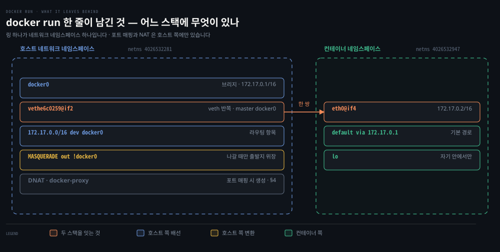
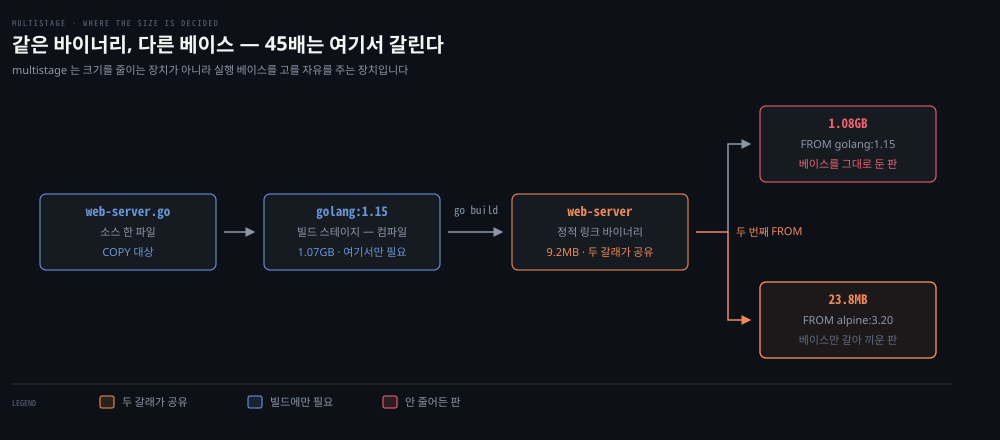
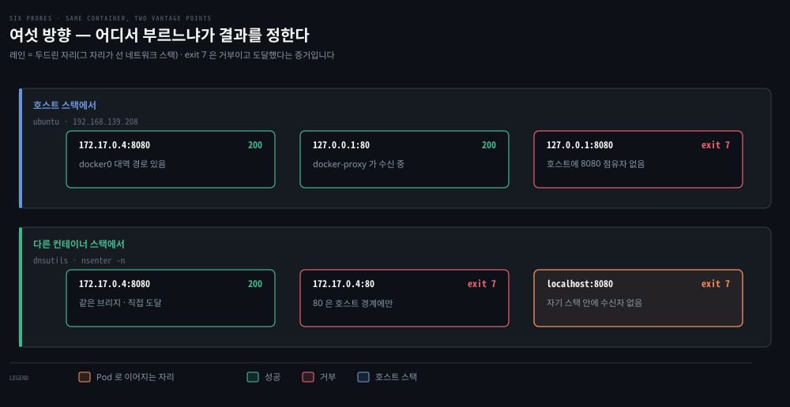
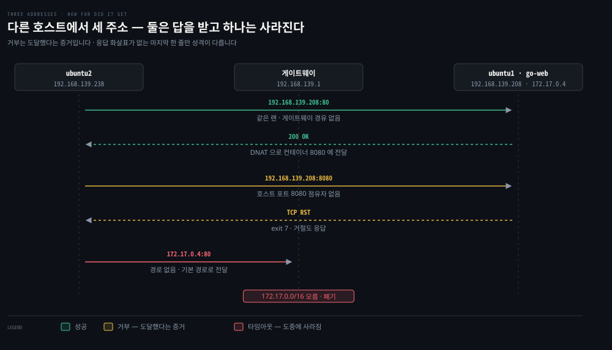

# 컨테이너 네트워크 실습 — 맨손 배선에서 포트 매핑까지

---


## 핵심 요약
> 이 편 전체가 매달린 하나의 생각은 **"3장이 설명한 배선은 명령으로 확인되거나 반증된다"**입니다.

앞의 세 편은 컨테이너가 무엇으로 만들어지고 어떤 모드로 연결되며 어디까지 닿는지를 읽는 자리였습니다. 이 편은 그 서술을 실행으로 옮깁니다. 런타임 없이 손으로 배선합니다. Docker 가 대신 만든 배선을 같은 도구로 읽고, 포트 매핑한 컨테이너를 여섯 방향에서 두드립니다. 마지막에 호스트를 넘어가면 실패의 성격이 바뀌는데, 그 차이가 다음 장으로 가는 다리입니다.


## 학습 목표
> 읽어서 아는 것과 쳐 봐서 아는 것 사이의 간격을 좁히는 것이 목표입니다.

이 실습을 마치면 다음을 할 수 있습니다.

1. 네트워크 네임스페이스·veth·브리지·기본 경로를 순서대로 짓고 각 단계의 실패 증상을 구별할 수 있습니다.
2. `docker run` 한 줄이 호스트의 어디에 무엇을 남기는지 `ip` 도구로 짚어낼 수 있습니다.
3. multistage 빌드가 이미지 크기를 줄이는 과정을 `docker images` 출력으로 확인할 수 있습니다.
4. 포트 매핑한 컨테이너를 여섯 방향에서 두드려 접근 가능 조합을 규칙으로 재구성할 수 있습니다.
5. 거부와 경로 없음을 증상으로 가르고, 어느 쪽이 라우팅 문제인지 판정할 수 있습니다.


## 실행 환경
> 이 실습은 Linux 호스트를 전제합니다. macOS 의 Docker Desktop 에서는 §2·§4·§5 가 성립하지 않습니다.

호스트에 `docker0` 브리지가 있고 컨테이너 대역으로의 경로가 잡혀 있어야 이 문서의 명령이 재현됩니다. Docker Desktop for Mac·Windows 는 컨테이너를 별도 VM 안에서 돌리므로 호스트에 그 배선이 남지 않습니다. §5 는 여기에 더해 호스트가 두 대 필요합니다.

2장 실습에서 쓴 OrbStack Ubuntu VM 두 대를 그대로 씁니다. 책은 Vagrant + VirtualBox 로 VM 두 대를 띄우지만 Apple Silicon 에서는 그 조합이 성립하지 않습니다.

실제 주소와 인터페이스 이름은 실행 시점에 확정합니다. 아래 명령의 `enp0s8` 은 책의 값이므로 `ip -br link` 로 확인한 이름으로 바꿔 넣습니다.

**주소도 함께 바꿔야 합니다.** §1 은 호스트 NIC 를 브리지에 넣는 구성이라 네임스페이스가 호스트와 같은 대역에 서야 합니다. 책의 `192.168.1.0/24` 를 그대로 쓰면 VM 대역과 어긋나 통하지 않습니다. `ip -br addr` 로 VM 주소를 확인하고 그 대역에서 빈 주소 둘을 골라 씁니다.

§1 의 아홉 번째 줄은 호스트 NIC 를 브리지에 넣으므로 SSH 세션이 끊길 수 있습니다. OrbStack 은 Mac 호스트에서 `orb -m <머신이름>` 으로 다시 들어갈 수 있으니, 그 경로가 되는지 먼저 확인하고 시작합니다.

### 확정된 값 (2026-09-01)

Phase 3 를 시작하며 실측으로 확정한 값입니다. 위 안내의 자리 표시자를 아래 값으로 읽으면 됩니다.

| 항목 | 값 |
|------|-----|
| Docker 호스트 | OrbStack VM `ubuntu` — `192.168.139.208` |
| 두드리는 쪽 | OrbStack VM `ubuntu2` — `192.168.139.238` |
| 인터페이스 이름 | `eth0` (책의 `enp0s8` 이 아닙니다) |
| 대역 | `192.168.139.0/24` — OrbStack 이 DHCP 로 관리하므로 고정 주소를 고를 때 배정 범위를 피합니다 |
| Docker | VM 안에 `apt install docker.io`, 29.1.3. `docker0` 는 `172.17.0.1/16` 으로 책 값과 같습니다 |
| 준비물 | `~/ch03-lab/` 에 `web-server.go`·`Dockerfile`·`Dockerfile.alpine`. 이미지는 `golang:1.15`·`alpine:3.20`·`busybox`·`jessie-dnsutils:1.3`·`netshoot`. `conntrack` 패키지 |

**Mac 의 OrbStack Docker 로는 이 실습이 성립하지 않습니다.** OrbStack 은 컨테이너를 자체 VM 안에서 돌리므로 Mac 호스트에도, 위 `ubuntu` VM 에도 `docker0` 가 남지 않습니다. Docker 는 VM 안에 따로 설치해야 합니다.

`jessie-dnsutils` 를 포함한 이미지 다섯 종은 전부 arm64 판이 있어 Apple Silicon 에서 그대로 받힙니다.


## 1. 맨손 배선 — 런타임이 대신해 주는 열 단계
> low-level 런타임이 컨테이너 하나를 만들 때 실제로 실행하는 명령을 그대로 밟습니다. 열 줄을 다 치고 나면 이 일이 왜 자동화됐는지가 몸에 남습니다.

### 풀려는 문제

`docker run` 한 번이면 컨테이너가 자기 IP 를 갖고 밖과 통신합니다. 그 한 줄과 통신되는 상태 사이에서 무슨 일이 벌어졌는지는 어디에도 보이지 않습니다. 그래서 정작 네트워크가 안 될 때 손댈 곳을 못 찾습니다. 인터페이스인지 주소인지 경로인지 가릴 근거가 없기 때문입니다.

개념 서술은 [03-01 §5](./03-01.%EC%BB%A8%ED%85%8C%EC%9D%B4%EB%84%88%EC%9D%98%20%ED%83%84%EC%83%9D%20%E2%80%94%20%EC%95%B1%20%EC%8B%A4%ED%96%89%EC%9D%98%20%EC%A7%84%ED%99%94%EC%99%80%20%EA%B2%A9%EB%A6%AC%20%ED%94%84%EB%A6%AC%EB%AF%B8%ED%8B%B0%EB%B8%8C.md)에 있습니다. 여기서는 그 절이 인용한 명령을 실제로 칩니다.

### 2장 실습과 무엇이 다른가

같은 뼈대를 [02-04](./02-04.%EC%BB%A4%EB%84%90%20%EB%84%A4%ED%8A%B8%EC%9B%8C%ED%82%B9%20%EC%8B%A4%EC%8A%B5%20%E2%80%94%20veth%C2%B7%EB%B8%8C%EB%A6%AC%EC%A7%80%C2%B7%ED%8F%AC%EC%9B%8C%EB%94%A9%EC%9D%84%20%EC%86%90%EC%9C%BC%EB%A1%9C%20%EC%A7%93%EA%B8%B0.md)에서 이미 한 번 지었습니다. 그때는 네임스페이스 둘을 브리지로 묶어 호스트를 넘는 통신까지 갔습니다. 이번에는 책이 제시한 열 단계를 그대로 밟으면서 두 가지만 새로 봅니다.

- **브리지에 호스트 인터페이스를 붙이는 단계**: 02-04 의 브리지는 네임스페이스끼리만 이었고 호스트 NIC 를 물리지 않았습니다.
- **브리지에 주소를 주지 않는 구성**: 책의 열 단계 목록은 7번에서 브리지에 주소를 주라고 적지만 예제 명령에는 그 줄이 없습니다. 없는 채로 통하는지가 이번 확인 대상입니다.

### 짓는 순서

```bash
sudo sysctl -w net.ipv4.ip_forward=1            # IP 포워딩 켜기 (기본 꺼짐)
sudo ip netns add net1                          # 새 네트워크 네임스페이스
sudo ip link add veth0 type veth peer name veth1    # veth 쌍 생성
sudo ip link set veth1 netns net1               # 한쪽을 net1으로 이동
sudo ip netns exec net1 ip addr add 192.168.1.101/24 dev veth1   # 주소 부여 (VM 대역으로 바꿀 것)
sudo ip netns exec net1 ip link set dev veth1 up                 # 안쪽 끝 켜기
sudo ip link add br0 type bridge                # 브리지 생성
sudo ip link set dev br0 up
sudo ip link set enp0s8 master br0              # 호스트 인터페이스를 브리지에
sudo ip link set veth0 master br0               # veth 반대쪽도 브리지에
sudo ip link set veth0 up                       # 바깥쪽 끝 켜기 — master 는 up 시키지 않습니다
```

책은 첫 줄을 `echo 1 > /proc/sys/net/ipv4/ip_forward` 로 적습니다. 리다이렉트는 `sudo` 가 붙기 전에 셸이 수행하므로 일반 사용자로 그대로 치면 `Permission denied` 가 납니다. 위처럼 `sysctl -w` 를 쓰거나 `sudo sh -c` 로 감싸야 합니다.

여기까지가 배선이고 기본 경로는 아직 넣지 않았습니다. 이 상태에서 먼저 두드려 봅니다.

```bash
ip -br link                                     # 인터페이스 목록과 상태 한 줄씩
bridge link                                     # 브리지에 물린 포트 목록
sudo ip netns exec net1 ip addr show veth1      # 네임스페이스 안쪽 주소와 상태
sudo ip netns exec net1 ip route                # 비어 있을 것입니다
sudo ip netns exec net1 ping -c 1 -W 2 <같은 대역의 다른 호스트>
```

그다음 기본 경로를 넣고 같은 ping 을 다시 칩니다. 앞뒤 메시지가 달라지는 것이 이 절의 관찰 대상입니다.

```bash
sudo ip netns exec net1 ip route add default via 192.168.1.100   # 맞은편 주소 (VM 대역으로 바꿀 것)
sudo ip netns exec net1 ping -c 2 -W 2 <같은 대역의 다른 호스트>
```

### 책 예제의 다섯 어긋남

책의 예제에는 서로 어긋나는 곳이 다섯 군데 있습니다. 위 명령은 그중 앞뒤가 맞는 조합을 골라 둔 것입니다.

- veth 쌍 생성 줄이 사전 목록과 Example 3-3 양쪽에서 두 번씩 인쇄됩니다.
- veth1 에 주는 주소가 본문 walkthrough 에서는 `192.168.1.100/24`, Example 3-3 에서는 `192.168.1.101/24` 입니다.
- 기본 경로 `via 192.168.1.100` 은 walkthrough 기준으로 veth1 자기 주소와 같습니다. 자기 자신을 게이트웨이로 지정한 셈이라 그대로는 동작하지 않습니다.
- 브리지에 붙이는 호스트 인터페이스가 walkthrough 에서는 `enp0s8`, Example 3-3 에서는 `enp0s3` 입니다.
- 검증 ping 의 대상이 `192.168.2.100`·`192.168.2.101` 인데 이 주소는 어느 명령에서도 설정된 적이 없습니다.

여섯 번째가 이번 실습에서 새로 드러난 것입니다. 예제에는 `veth0` 를 up 시키는 줄이 없습니다. `master br0` 는 인터페이스를 브리지에 붙일 뿐 켜지 않으므로, 그대로 두면 바깥쪽 끝이 내려간 채 남고 안쪽 `veth1` 이 NO-CARRIER 가 됩니다. 03-01 §5 가 "반대쪽이 내려가 있으면"이라고 설명한 바로 그 상태를 예제가 스스로 만듭니다.

열 단계 목록의 7번에 대응하는 명령도 예제에 없습니다. 브리지는 만들어 up 만 하고 주소 없이 씁니다.

### 예측하고 확인할 것

| # | 예측할 것 | 관찰 |
|---|----------|------|
| 1-1 | 주소를 주고 up 한 직후 `veth1` 의 상태 문자열은 무엇인가 | |
| 1-2 | 기본 경로를 넣기 전 네임스페이스에서 밖으로 ping 하면 어떤 메시지가 나오는가 | |
| 1-3 | 브리지에 주소가 없는데 통하는가, 통한다면 무엇이 그 자리를 대신하는가 | |
| 1-4 | 책이 적은 자기-게이트웨이 조합을 실제로 넣으면 어떤 오류가 나는가 | |


## 2. Docker 가 만든 배선 읽기
> 손으로 열 줄을 친 자리를 Docker 는 한 줄로 끝냅니다. 그 배선은 사라진 것이 아니라 호스트의 같은 자리에 남습니다.



링 하나가 네트워크 네임스페이스 하나입니다. 두 링을 가로지르는 것은 veth 쌍뿐이고, 나머지는 각자 한쪽에만 존재합니다. 회색으로 흐린 마지막 줄은 이 시점에는 아직 없고 §4 에서 포트 매핑을 붙일 때 생깁니다.

### 풀려는 문제

자동으로 됐다고 해서 없어진 것은 아닙니다. 컨테이너 네트워크가 안 될 때 브리지를 볼지 veth 를 볼지 경로를 볼지 가르려면, 정상일 때 그 셋이 호스트 어디에 어떤 모양으로 남는지를 먼저 봐 둬야 합니다.

개념 서술은 [03-02 §2](./03-02.%EC%BB%A8%ED%85%8C%EC%9D%B4%EB%84%88%20%EB%84%A4%ED%8A%B8%EC%9B%8C%ED%82%B9%20%EB%AA%A8%EB%93%9C%EC%99%80%20CNI%20%E2%80%94%20%EA%B2%A9%EB%A6%AC%EC%99%80%20%EC%97%B0%EA%B2%B0%EC%9D%98%20%EA%B1%B0%EB%9E%98.md)에 있습니다.

### 기본 배선 확인

```bash
docker network ls                               # bridge·host·none 세 네트워크
ip -br addr show docker0                        # docker0 브리지와 그 주소
ip route | grep docker0                         # 호스트 라우팅 테이블의 컨테이너 대역
```

컨테이너를 하나 띄우고 안팎을 비교합니다.

```bash
docker run -it -d --name busybox busybox
docker exec busybox ip addr                     # 컨테이너가 받은 주소
docker exec busybox ip route                    # 컨테이너 안 기본 경로
ip -br link | grep veth                         # 호스트 쪽에 생긴 veth 반쪽
```

`--net=host` 로 띄우면 무엇이 달라지는지 같은 명령으로 대조합니다.

```bash
docker run -it -d --name busybox-host --net=host busybox
docker exec busybox-host ip addr
```

### 컨테이너 네임스페이스를 ip 도구로 보기

Docker 는 자기가 만든 네트워크 네임스페이스를 `ip netns list` 가 기대하는 `/var/run/netns` 에 등록하지 않습니다. 세 단계로 우회합니다.

```bash
sudo mkdir -p /var/run/netns                           # 0. 이 디렉터리는 `ip netns add` 만 만듭니다
sudo docker inspect -f '{{.State.Pid}}' <컨테이너ID>   # 1. 호스트 PID 확인 — 예: 25719
sudo ln -sfT /proc/25719/ns/net /var/run/netns/<컨테이너ID>   # 2. netns 심볼릭 링크
sudo ip netns exec <컨테이너ID> ip a                    # 3. ip 도구로 조회 가능
```

0번을 건너뛰면 `ln` 이 `No such file or directory` 로 실패합니다. §1 을 먼저 돌렸다면 그때 만들어졌을 수도 있지만, 기대지 말고 명시적으로 만듭니다.

### 브리지의 DOWN 은 절전이 아니라 캐리어 없음이다
> 컨테이너가 하나도 없을 때 `docker0` 는 `DOWN` 입니다. Docker 가 절전을 위해 내려 둔 것이 아니라, 물린 포트가 없어 캐리어가 없는 것입니다.

컨테이너를 띄우기 전에 `ip -br addr show docker0` 을 치면 `DOWN` 이 나옵니다. 쓸 일이 없어 내려 둔 것이라고 읽기 쉽지만, 손으로 올려 보면 그 해석이 깨집니다.

```bash
sudo ip link set docker0 up
ip link show docker0 | head -1
# 3: docker0: <NO-CARRIER,BROADCAST,MULTICAST,UP> mtu 1500 ... state DOWN
```

한 줄에 세 값이 같이 찍혀 있습니다. 괄호 안의 `UP` 은 관리 상태이고 방금 손으로 올린 것입니다. `NO-CARRIER` 가 이유이며, `state DOWN` 이 동작 상태입니다. 브리지의 동작 상태는 물린 포트를 따라가므로 포트가 없으면 관리 상태를 올려도 따라오지 않습니다.

컨테이너를 하나 띄우면 veth 가 브리지에 물리면서 `LOWER_UP` 이 붙고 동작 상태가 `UP` 으로 올라갑니다. Docker 가 켠 것이 아니라 캐리어가 생겨 커널이 올린 것입니다.

진단할 때 이 둘을 갈라 봐야 "내가 안 올렸나"와 "케이블이 안 꽂혔나"를 구분할 수 있습니다. 03-01 §5 가 말한 "반대쪽이 내려가 있으면 `NO-CARRIER`" 와 같은 원리입니다.

### MASQUERADE 가 컨테이너끼리는 걸리지 않는 이유
> Docker 가 세우는 MASQUERADE 규칙에는 `out !docker0` 조건이 붙습니다. 이 한 조건이 컨테이너 간 통신을 NAT 밖에 둡니다.

SNAT 와 MASQUERADE 의 차이는 [02-02](./02-02.iptables%C2%B7IPVS%C2%B7eBPF%20%E2%80%94%20kube-proxy%EB%A5%BC%20%EC%9D%B4%ED%95%B4%ED%95%98%EB%8A%94%20%EC%84%B8%20%EA%B8%B0%EC%88%A0.md)가 정본입니다. 여기서는 Docker 가 실제로 어떤 조건을 걸어 두는지만 봅니다.

```bash
sudo iptables -t nat -L POSTROUTING -n -v
# target      prot  in  out        source          destination
# MASQUERADE  all   *   !docker0   172.17.0.0/16   0.0.0.0/0
```

`out` 칸의 `!docker0` 이 "나가는 인터페이스가 `docker0` 가 아닐 때만"이라는 조건입니다. 컨테이너끼리 주고받는 패킷은 `docker0` 로 나가므로 이 규칙에 걸리지 않고, 밖으로 나가는 패킷만 걸립니다.

03-03 §2 가 정리한 "컨테이너 네트워크 안에서는 포트 매핑도 NAT 도 지나지 않는다" 가 이 한 조건에서 나옵니다.

### 규칙 평가는 첫 패킷만, 나머지는 conntrack 이 한다
> ping 을 네 번 보내도 규칙 카운터는 1 만 오릅니다. 카운터가 세는 것은 패킷이 아니라 연결입니다.

응답이 규칙을 다시 보지 않는다는 사실은 [02-02](./02-02.iptables%C2%B7IPVS%C2%B7eBPF%20%E2%80%94%20kube-proxy%EB%A5%BC%20%EC%9D%B4%ED%95%B4%ED%95%98%EB%8A%94%20%EC%84%B8%20%EA%B8%B0%EC%88%A0.md)가 도식과 함께 다룹니다. 이번 실습이 더한 것은 그 사실이 카운터에 어떻게 드러나는가입니다.

```bash
docker exec busybox ping -c 4 8.8.8.8 >/dev/null 2>&1
sudo iptables -t nat -L POSTROUTING -n -v
# pkts bytes target
#    1    84 MASQUERADE  all  --  *  !docker0  172.17.0.0/16  0.0.0.0/0
```

`bytes` 84 는 ICMP 패킷 한 개 크기입니다. 첫 패킷만 규칙 테이블을 훑고, 그때 정한 변환을 conntrack 에 적어 둡니다. 이후 패킷은 규칙을 보지 않고 그 표를 조회해 갈아 끼웁니다.

바뀌는 것은 모든 패킷입니다. 한 번만 하는 것은 어떻게 바꿀지 정하는 일입니다. 그래서 카운터는 연결 수를 세지 패킷 수를 세지 않고, NAT 의 비용이 연결 수에 비례하는 이유도 여기에 있습니다.

### conntrack 한 줄에 방향이 둘 적히는 이유
> 응답 튜플은 원본을 뒤집은 것이 아니라 NAT 이 적용된 뒤의 모양입니다.

엔트리 한 줄에 튜플이 둘이라는 것과 그 까닭은 [02-01 §5](./02-01.%EC%BB%A4%EB%84%90%EC%9D%B4%20%ED%8C%A8%ED%82%B7%EC%9D%84%20%EB%8B%A4%EB%A3%A8%EB%8A%94%20%EB%B2%95%20%E2%80%94%20%EC%86%8C%EC%BC%93%C2%B7Netfilter%C2%B7Conntrack%C2%B7%EB%9D%BC%EC%9A%B0%ED%8C%85.md)가 도식으로 담고 있습니다. 이번에는 그 줄을 컨테이너 트래픽에서 직접 뽑았습니다.

```bash
sudo conntrack -L | grep 172.17.0.2
# icmp 1 29 src=172.17.0.2 dst=8.8.8.8 type=8 code=0 id=66
#           src=8.8.8.8 dst=192.168.139.208 type=0 code=0 id=66 mark=0 use=1
```

앞이 나갈 때의 모양이고 뒤가 돌아올 때 기대하는 모양입니다. 뒤집기였다면 `dst` 가 `172.17.0.2` 여야 하는데 `192.168.139.208` 이 적혀 있습니다. 밖에서 돌아오는 패킷이 실제로 그 주소로 오기 때문에, 그 모양으로 적어 둬야 매칭됩니다. 매칭되면 conntrack 이 목적지를 컨테이너 주소로 되돌립니다.

### proc/net 은 네트워크 네임스페이스를 따라간다
> 같은 경로를 읽어도 읽는 프로세스의 netns 에 따라 내용이 달라집니다. mount 네임스페이스와는 무관합니다.

`nsenter -t <PID> -n` 은 네트워크 네임스페이스에만 들어가고 파일시스템은 호스트 것을 그대로 씁니다. 그래서 이미지에 없는 도구도 실행됩니다.

```bash
P=$(docker inspect -f '{{.State.Pid}}' busybox)
sudo nsenter -t $P -n curl -s -m 3 -o /dev/null -w '%{http_code}\n' http://172.17.0.1

# 종료 코드 7 — 연결 거부입니다. 명령을 못 찾았다면 127 이 나옵니다
docker exec busybox curl -s -m 3 http://172.17.0.1
# executable file not found in $PATH — 종료 코드 127
```

도구가 하나도 없는 distroless 컨테이너의 네트워크를 호스트 도구로 들여다보는 실무 기법이 이것입니다.

같은 원리가 `/proc/net` 에서도 드러납니다. mount 네임스페이스는 그대로이므로 두 명령이 같은 파일을 읽는데도 내용이 갈립니다.

```bash
cut -d: -f1 /proc/net/dev | tail -n +3
# lo · eth0 · docker0 · vethe6c0259
sudo nsenter -t $P -n cut -d: -f1 /proc/net/dev | tail -n +3
# lo · eth0
```

`/proc/net` 은 읽는 프로세스의 netns 를 따라가는 자리입니다. 파일이 어디에 있느냐가 아니라 누가 읽느냐가 내용을 정합니다.

### 예측하고 확인할 것

| # | 예측할 것 | 관찰 |
|---|----------|------|
| 2-1 | 컨테이너가 받는 주소와 그 기본 경로의 게이트웨이는 각각 무엇인가 | `172.17.0.2/16`, 게이트웨이는 `172.17.0.1`(docker0). 두 번째 경로 줄의 `src 172.17.0.2` 는 목적지가 아니라 **출발지 선택**이고, `scope link` 라 같은 대역은 게이트웨이를 안 거칩니다 |
| 2-2 | 호스트 쪽 veth 이름 뒤의 `@if<번호>` 는 무엇을 가리키는가 | 맞은편 끝의 인덱스입니다. 호스트가 `4: vethe6c0259@if2`, 컨테이너가 `2: eth0@if4` 로 **서로를 가리킵니다.** 호스트 쪽 `link-netnsid 1` 이 맞은편 네임스페이스를 함께 표시합니다 |
| 2-3 | `--net=host` 컨테이너 안의 `ip addr` 출력은 호스트와 어디가 같고 어디가 다른가 | 전부 같습니다. **복제가 아니라 공유**이고, netns inode 로 확정됩니다 — 호스트와 `busybox-host` 가 `4026532281` 로 동일하고 `busybox` 만 `4026532947` 입니다. veth 도 새로 생기지 않습니다 |
| 2-4 | 2번 단계의 심볼릭 링크가 필요한 이유는 무엇인가 | `ip netns` 계열 도구가 `/var/run/netns` 만 읽기 때문입니다. Docker 는 거기 등록하지 않습니다. `nsenter -t <PID> -n` 은 그 우회 없이 `/proc/<PID>/ns/net` 을 직접 열어 `setns()` 로 들어갑니다 |


## 3. Go 웹 서버 이미지 만들기
> 이미지 크기가 곧 기동 시간입니다. multistage 빌드가 그 크기를 얼마나 줄이는지는 두 이미지를 나란히 두면 바로 보입니다.



왼쪽 세 칸은 두 갈래가 공유합니다. 갈리는 지점은 오른쪽 끝 하나뿐이고, 그 한 줄이 최종 크기를 45배 벌립니다.

### 풀려는 문제

`&&` 로 묶어라, multistage 를 써라 같은 관행은 들어 봤을 것입니다. 왜 그런지 모르면 어느 것을 언제 지켜야 할지 정할 수 없습니다. 크기 차이를 실제 숫자로 보면 관행이 외울 목록에서 따라 나오는 결론으로 바뀝니다.

관행 다섯 가지와 그 인과는 [03-03 §1](./03-03.%EC%BB%A8%ED%85%8C%EC%9D%B4%EB%84%88%20%EC%97%B0%EA%B2%B0%EA%B3%BC%20%ED%8F%AC%ED%8A%B8%20%EB%A7%A4%ED%95%91%20%E2%80%94%20%EA%B0%99%EC%9D%80%20%ED%98%B8%EC%8A%A4%ED%8A%B8%2C%20%EB%8B%A4%EB%A5%B8%20%ED%98%B8%EC%8A%A4%ED%8A%B8.md)에 있습니다.

### Dockerfile

실험 재료는 1장부터 쓰던 Go 웹 서버입니다. `0.0.0.0:8080` 에서 듣고 "Hello" 를 응답합니다. multistage 구성의 전문과 줄별 해부는 [03-03 §1](./03-03.%EC%BB%A8%ED%85%8C%EC%9D%B4%EB%84%88%20%EC%97%B0%EA%B2%B0%EA%B3%BC%20%ED%8F%AC%ED%8A%B8%20%EB%A7%A4%ED%95%91%20%E2%80%94%20%EA%B0%99%EC%9D%80%20%ED%98%B8%EC%8A%A4%ED%8A%B8%2C%20%EB%8B%A4%EB%A5%B8%20%ED%98%B8%EC%8A%A4%ED%8A%B8.md)에 있으니 그 블록을 그대로 `Dockerfile` 로 저장해 씁니다.

두 번째 `FROM` 을 `alpine` 으로 바꾼 판을 따로 만들어 두면 아래 확인 항목을 숫자로 답할 수 있습니다.

```bash
cp Dockerfile Dockerfile.alpine        # 사본의 두 번째 FROM 만 alpine:3.20 으로 고칩니다
docker build -f Dockerfile.alpine -t go-web:alpine .
```

### 빌드와 조회

```bash
docker build -t go-web:v0.0.1 .                 # 빌드하며 이름까지 붙입니다
docker images | grep -E 'go-web|golang'         # 최종 이미지와 베이스 이미지 크기 대조
docker ps                                       # 실행 중 컨테이너
docker logs <컨테이너ID>                          # 표준 출력
docker exec -it <컨테이너ID> sh                   # 컨테이너 안 셸
```

### 예측하고 확인할 것

| # | 예측할 것 | 관찰 |
|---|----------|------|
| 3-1 | `golang:1.15` 베이스와 빌드한 `go-web` 의 크기 차이는 얼마쯤일 것인가 | **줄지 않고 오히려 10MB 큽니다** — 베이스 1.07GB, `go-web` 1.08GB. 늘어난 10MB 가 복사해 온 정적 링크 바이너리입니다 |
| 3-2 | 실행 스테이지를 `alpine` 으로 바꾸면 크기가 어디까지 내려가는가 | **23.8MB.** `alpine:3.20` 14.6MB + 바이너리 9.2MB 이고, 1.08GB 대비 45배 줄었습니다 |
| 3-3 | `COPY web-server.go .` 줄만 바꿔 다시 빌드하면 어느 레이어부터 캐시가 깨지는가 | **`RUN` 이 아니라 `COPY`(3번)부터**입니다. `WORKDIR`(2번)까지는 `Using cache` 가 붙습니다. 두 번째 스테이지의 `WORKDIR`(6번)도 캐시가 살아남습니다 |


### multistage 는 크기를 줄이는 장치가 아니다
> 실행 스테이지의 베이스를 자유롭게 고를 수 있게 해 주는 장치입니다. 그 자유를 안 쓰면 아무것도 줄지 않습니다.

multistage 로 빌드했는데도 최종 이미지가 1.08GB 였습니다. 두 번째 `FROM` 이 그대로 `golang:1.15` 였기 때문입니다. 1.07GB 짜리 베이스를 깔고 그 위에 바이너리를 얹었으니 커지는 게 당연합니다.

multistage 가 실제로 없앤 것은 빌드 부산물입니다. 단일 스테이지였다면 소스와 Go 빌드 캐시, 중간 오브젝트까지 이미지에 남았을 텐데 여기서는 소스가 파일 하나뿐이라 그 절약이 눈에 띄지 않습니다.

**못 없앤 것이 실행 스테이지의 베이스입니다.** multistage 가 없던 시절에는 Go 를 컴파일하려면 컴파일러가 든 이미지가 필요했고, 그러면 그 이미지 위에 얹을 수밖에 없었습니다. 컴파일러를 버리고 싶어도 버릴 방법이 없었습니다. multistage 는 "빌드는 뚱뚱한 데서, 실행은 얇은 데서"를 가능하게 합니다. 다만 그 자유를 실제로 써야 크기가 줍니다.

`Dockerfile.alpine` 은 두 번째 `FROM` 한 줄만 다릅니다. 바이너리는 같은 것이고 베이스만 갈아 끼웠는데 1.08GB 가 23.8MB 로 내려갔습니다. 정적 링크된 Go 바이너리라 libc 도 필요 없어서 가능한 폭입니다.


### COPY 만 파일 내용을 캐시 키에 넣는다
> 그래서 소스를 고치면 `RUN` 이 아니라 그 위의 `COPY` 부터 깨지고, 아래가 전부 따라 깨집니다.

`Using cache` 는 "새 레이어를 만들 뻔했는데 기존 것을 재사용했다"는 표시입니다. `FROM` 은 레이어를 만드는 명령이 아니라 베이스를 가리키는 것이라 판정 대상이 아니고, 그래서 이미지 ID 만 찍힙니다.

캐시 키의 재료가 명령마다 다릅니다.

| 명령 | 캐시 키에 들어가는 것 |
|------|---------------------|
| `RUN`·`WORKDIR`·`CMD` | 부모 레이어 ID + 명령 문자열 |
| `COPY`·`ADD` | 부모 레이어 ID + 명령 문자열 + **복사할 파일들의 내용 해시** |

`web-server.go` 를 한 글자 고치자 `COPY` 의 키가 달라졌고, `RUN` 은 명령이 그대로여도 부모가 달라져서 함께 깨졌습니다. 두 번째 스테이지의 `WORKDIR` 이 살아남은 것은 스테이지마다 자기 베이스에서 캐시를 새로 세기 때문입니다.

실무에서는 이 성질을 순서로 씁니다. 의존성은 거의 안 바뀌고 소스는 매번 바뀌니, 의존성 설치를 소스 복사보다 위에 둡니다.

```dockerfile
COPY go.mod go.sum ./     # 거의 안 바뀐다
RUN go mod download       # 그래서 캐시가 산다
COPY . .                  # 매번 바뀐다
RUN go build              # 여기부터만 다시 돈다
```

순서를 뒤집어 `COPY . .` 를 위에 두면 소스 한 글자에 의존성 전체를 다시 받습니다. Node 의 `package.json`, Python 의 `requirements.txt` 도 같은 패턴입니다.


## 4. 같은 호스트 — 여섯 방향으로 두드리기
> 같은 컨테이너를 같은 호스트 안에서 부르는데도 자리마다 결과가 갈립니다. 부르는 자리마다 서 있는 네트워크 스택이 다르기 때문입니다.



레인 하나가 두드린 자리입니다. 같은 열을 세로로 견주면 규칙이 보이는데, 가운데 열은 위아래가 정반대입니다.

### 풀려는 문제

`-p 80:8080` 을 붙여 컨테이너를 띄웠습니다. 호스트에서 `curl localhost:80` 은 되는데 `localhost:8080` 은 거부되고, 옆 컨테이너에서 부르면 반대로 8080 만 됩니다. 규칙을 모른 채 하나씩 시도하면 매번 헷갈립니다.

여섯 방향의 결과와 그 이유를 정리한 표는 [03-03 §2](./03-03.%EC%BB%A8%ED%85%8C%EC%9D%B4%EB%84%88%20%EC%97%B0%EA%B2%B0%EA%B3%BC%20%ED%8F%AC%ED%8A%B8%20%EB%A7%A4%ED%95%91%20%E2%80%94%20%EA%B0%99%EC%9D%80%20%ED%98%B8%EC%8A%A4%ED%8A%B8%2C%20%EB%8B%A4%EB%A5%B8%20%ED%98%B8%EC%8A%A4%ED%8A%B8.md)에 있습니다. 예측을 먼저 적은 뒤에 그 표를 여십시오.

### 띄우기

```bash
docker run -d -p 80:8080 --name go-web go-web:v0.0.1
GOWEB_IP=$(docker inspect -f '{{range .NetworkSettings.Networks}}{{.IPAddress}}{{end}}' go-web)
echo "$GOWEB_IP"
```

주소를 변수로 받아 두는 이유가 있습니다. 책은 `172.17.0.2` 를 적지만 그것은 그 브리지의 두 번째 컨테이너가 받는 값일 뿐입니다. §2 의 `busybox` 가 아직 살아 있으면 `go-web` 은 `.3` 을 받습니다.

책이 적은 `-it -d` 조합은 무의미합니다. TTY 와 stdin 을 붙여 놓고 곧바로 떼어 놓는 셈이라 오류는 아니지만 아무 효과가 없습니다.

상대 컨테이너로 책은 Kubernetes e2e 테스트용 dnsutils 이미지를 씁니다.

```bash
docker run -d --name dnsutils registry.k8s.io/e2e-test-images/jessie-dnsutils:1.3 sleep infinity
```

**다만 이 이미지로는 아래 여섯 방향을 다 두드릴 수 없습니다.** Kubernetes 저장소의 해당 Dockerfile 을 확인하면 `debian:jessie` 에 `dnsutils` 패키지 하나만 설치합니다. 들어 있는 것은 `dig`·`nslookup`·`host` 뿐이고 `curl` 도 `ping` 도 없어, 컨테이너 쪽에서 던지는 명령은 전부 `executable file not found` 로 죽습니다.[^dnsutils]

이미지를 조용히 바꾸지 않고 남겨 둡니다. 상대 컨테이너에 필요한 것은 HTTP 를 던질 도구 하나뿐이라 대안은 있지만(03-03 참고 자료가 드는 `nicolaka/netshoot` 이 그 후보입니다), 책과 다른 재료를 쓰면 관찰 결과의 근거가 달라집니다. **무엇으로 갈지는 Phase 3 실행 직전에 정합니다.**

### 여섯 방향

상태 코드만 찍으면 실패의 두 종류를 못 가릅니다. 거부도 타임아웃도 `%{http_code}` 는 `000` 이기 때문입니다. `curl` 의 종료 코드가 그 둘을 갈라 주므로 함께 찍습니다 — 7 이 거부이고 28 이 타임아웃입니다.

```bash
probe() { curl -s -m 2 -o /dev/null -w "%{http_code} " "$1"; echo "exit=$?  ($1)"; }
```

호스트에서 셋을 두드립니다.

```bash
probe "$GOWEB_IP:8080"      # 컨테이너 IP + 컨테이너 포트
probe 127.0.0.1:80          # loopback + 호스트 포트
probe 127.0.0.1:8080        # loopback + 컨테이너 포트
```

상대 컨테이너 안에서 셋을 두드립니다. 위 함수는 호스트 셸의 것이라 컨테이너 안에서는 명령을 그대로 풉니다.

```bash
docker exec dnsutils curl -s -m 2 -o /dev/null -w '%{http_code}\n' "$GOWEB_IP:8080"
docker exec dnsutils curl -s -m 2 -o /dev/null -w '%{http_code}\n' "$GOWEB_IP:80"
docker exec dnsutils curl -s -m 2 -o /dev/null -w '%{http_code}\n' localhost:8080
```

실험 전 확인이 하나 있습니다. 상대 컨테이너에서 밖으로 나가는 통신은 기본 브리지 모드만으로 문제없이 됩니다.

```bash
docker exec dnsutils ping -c 2 google.com
```

### 예측하고 확인할 것

| # | 예측할 것 | 관찰 |
|---|----------|------|
| 4-1 | 여섯 방향 중 성공하는 것은 몇 개이고 어느 것인가 | **셋.** 호스트에서 `172.17.0.4:8080` 과 `127.0.0.1:80`, 상대 컨테이너에서 `172.17.0.4:8080` |
| 4-2 | 실패하는 방향의 실패 방식은 거부인가 타임아웃인가 | **셋 다 `exit 7` 거부**입니다. 목적지 스택까지 도달해 거절을 받았다는 뜻이고, 묶음 5 에서 이 코드가 달라집니다 |
| 4-3 | 상대 컨테이너의 `localhost` 는 무엇을 가리키는가 | 그 컨테이너 자신의 스택입니다. 거기에는 8080 을 잡은 것이 없어 거부됩니다 |
| 4-4 | 이 결과가 Pod 의 컨테이너들이 `localhost` 로 통하는 것과 어떻게 이어지는가 | Pod 는 네임스페이스를 공유해 이 벽을 일부러 없앤 구조입니다. 4-3 이 안 되는 이유를 알아야 Pod 가 왜 그렇게 생겼는지가 설명됩니다 |


### 127.0.0.1:80 은 DNAT 이 아니라 docker-proxy 가 처리한다
> 포트 매핑을 만드는 주체가 둘입니다. 커널의 DNAT 과 사용자 공간의 중계 프로세스이며, 루프백은 뒤쪽이 받습니다.

`curl 127.0.0.1:80` 이 `200` 을 받았는데 DNAT 규칙의 카운터는 `0` 이었습니다. 그 규칙을 타지 않았다는 뜻입니다.

```bash
sudo iptables -t nat -L OUTPUT -n -v
# DOCKER  all -- 0.0.0.0/0  !127.0.0.0/8  ADDRTYPE match dst-type LOCAL
```

- `DOCKER` 체인에 들어가려면 이 점프 규칙을 통과해야 하는데, 조건에 `!127.0.0.0/8` 이 붙어 있습니다. 
- 목적지가 루프백이면 점프가 일어나지 않으므로 안의 DNAT 규칙은 평가조차 되지 않고 카운터는 0 으로 남습니다.

그럼 무엇이 받았는가를 진단 사다리로 확인합니다.

```bash
sudo ss -lntp | grep ':80 '
# LISTEN 0.0.0.0:80  users:(("docker-proxy",pid=5981))
```

- `docker-proxy` 는 Docker 가 포트 매핑마다 하나씩 띄우는 사용자 공간 중계 프로세스입니다. 호스트 포트를 실제로 bind 해서 듣고 있다가 연결이 오면 컨테이너 쪽으로 새 TCP 연결을 열어 잇습니다. 
- `0.0.0.0` 은 이 호스트의 모든 주소를 뜻하므로 `127.0.0.1` 도 포함합니다. **NAT 이 필요 없었고, 그냥 듣고 있는 프로세스와 평범하게 연결된 것입니다.**

이 프로세스가 있는 이유가 방금 본 그 조건입니다. DNAT 은 루프백을 안 건드리게 되어 있어서 그것만으로는 `curl localhost:80` 이 되지 않습니다. 대가로 패킷이 사용자 공간까지 올라갔다 내려오고, 매핑마다 프로세스가 하나씩(IPv4·IPv6 각각) 뜹니다. Docker 에 `--userland-proxy=false` 옵션이 있는 것은 그래서입니다.


### 같은 포트라도 부르는 주소에 따라 경로가 갈린다
> 커널은 "내 주소"를 하나로 뭉뚱그리지 않습니다. `dst-type LOCAL` 안에서 루프백만 따로 빠집니다.

같은 호스트의 같은 80 포트를 두 주소로 불러 카운터를 견주면 갈립니다.

```bash
curl -s -o /dev/null -w "%{http_code}\n" 192.168.139.208:80   # 200
sudo iptables -t nat -L DOCKER -n -v
#  1  60  DNAT tcp -- !docker0 * ... tcp dpt:80 to:172.17.0.4:8080   ← 0 에서 1 로 올랐다
```

| 두드린 주소 | 처리 주체 | DNAT 카운터 |
|------------|----------|------------|
| `127.0.0.1:80` | docker-proxy (사용자 공간) | 0 그대로 |
| `192.168.139.208:80` | iptables DNAT (커널) | 0 → 1 |

`dst-type LOCAL` 은 이 호스트가 가진 주소 중 하나라는 뜻이고, 그중 루프백만 `!127.0.0.0/8` 로 빠집니다. 규칙 표기도 함께 읽어 둡니다 — `dpt` 는 목적지 포트(destination port)이고 출발지는 `spt` 입니다. 앞의 `tcp dpt:80` 은 무엇을 고를지의 조건이고 뒤의 `to:172.17.0.4:8080` 은 무엇으로 바꿀지의 동작이라, 양쪽 다 목적지 이야기입니다.

**둘 다 응답은 `200` 입니다.** 부르는 쪽에서는 차이가 보이지 않고, 카운터라는 계측을 붙였기 때문에 갈린 것입니다.


## 5. 다른 호스트 — 거부와 경로 없음
> 호스트를 넘으면 실패의 성격이 바뀝니다. 거부는 목적지까지 갔다는 뜻이고, 경로 없음은 출발조차 못 했다는 뜻입니다.



세로가 시간이고 가로가 주체입니다. 앞의 두 줄에는 응답 화살표가 있고 마지막 한 줄에만 없는데, 그 차이가 이 절의 전부입니다.

### 풀려는 문제

둘을 같은 "안 된다" 로 뭉뚱그리면 원인을 영영 못 찾습니다. 하나는 목적지 쪽 포트 문제이고 다른 하나는 출발지 쪽 라우팅 문제라 손댈 곳이 아예 다릅니다.

이 차이가 오버레이와 CNI 가 존재하는 이유를 그대로 가리킵니다. 결론은 [03-03 §3](./03-03.%EC%BB%A8%ED%85%8C%EC%9D%B4%EB%84%88%20%EC%97%B0%EA%B2%B0%EA%B3%BC%20%ED%8F%AC%ED%8A%B8%20%EB%A7%A4%ED%95%91%20%E2%80%94%20%EA%B0%99%EC%9D%80%20%ED%98%B8%EC%8A%A4%ED%8A%B8%2C%20%EB%8B%A4%EB%A5%B8%20%ED%98%B8%EC%8A%A4%ED%8A%B8.md)에 있습니다.

### 세 주소로 두드리기

두 번째 VM 에서 같은 컨테이너를 세 가지 주소로 부릅니다. `192.168.1.20` 자리에는 Docker 를 띄운 첫 번째 VM 의 실제 주소를 넣습니다.

```bash
probe() { curl -s -m 5 -o /dev/null -w "%{http_code} " "$1"; echo "exit=$?  ($1)"; }
probe 192.168.1.20:80       # 호스트 IP + 노출된 호스트 포트
probe 192.168.1.20:8080     # 호스트 IP + 컨테이너 포트
curl -v -m 5 172.17.0.2:80  # 컨테이너 IP — 상태 코드가 아니라 메시지를 봅니다
```

세 번째 줄은 상태 코드가 아니라 실패 메시지를 봐야 하므로 `-v` 로 띄웁니다. 판정 근거는 두 번째 VM 의 라우팅 테이블에 있습니다.

```bash
ip route                                        # 172.17.0.0/16 항목이 있는가
ip route get 172.17.0.2                         # 커널이 이 주소를 어디로 보내려 하는가
```

### 예측하고 확인할 것

| # | 예측할 것 | 관찰 |
|---|----------|------|
| 5-1 | 세 주소 중 성공하는 것은 무엇인가 | 호스트 IP + 호스트 포트(`192.168.139.208:80`)만 `200`. 호스트 IP + 컨테이너 포트는 `exit 7`, 컨테이너 IP 는 `exit 28` |
| 5-2 | 컨테이너 IP 로 갔을 때 나오는 메시지는 무엇이고 왜 그 메시지인가 | **`Connection timed out` (`exit 28`)** — 네 얼굴 중 "기본 경로로 나갔는데 아무 응답 없음"입니다. 게이트웨이가 이 대역을 모르고 버렸으며 ICMP 도 돌려주지 않았습니다 |
| 5-3 | `ip route get 172.17.0.4` 는 어느 인터페이스를 답하는가 | `via 192.168.139.1 dev eth0` — **기본 경로**입니다. 딱 맞는 항목이 없어도 커널은 "모른다"고 하지 않고 기본 경로로 떨어뜨립니다 |
| 5-4 | 이 실패를 없애려면 무엇을 추가해야 하는가 | 이 대역이 어느 노드 것인지 알리는 장치입니다. 오버레이(VXLAN)로 감싸거나 경로 광고(Calico 의 BGP)로 알립니다 |


### 경로가 없어도 커널은 모른다고 하지 않는다
> 기본 경로가 있으면 거기로 떨어뜨립니다. 그래서 `No route to host` 가 경로가 없을 때가 아니라 있을 때 나옵니다.

두드리기 전에 커널의 의도부터 확인합니다. 보내 보고 결과로 짐작하는 것보다 이쪽이 빠릅니다.

```bash
ip route          # 172.17.0.0/16 항목이 없다
ip route get 172.17.0.4
# 172.17.0.4 via 192.168.139.1 dev eth0 src 192.168.139.238
```

**딱 맞는 항목이 없는데도 답이 나왔습니다.** 기본 경로가 있으니 거기로 보내겠다는 뜻이고, 모르는 주소라고 거절하지 않습니다. 03-03 §닿지 않음의 세 얼굴이 말한 자리가 여기입니다 — 경로가 아예 없었다면 `Network is unreachable` 로 즉시 끝났을 텐데, 기본 경로가 있으니 패킷이 일단 게이트웨이로 나가고 그다음은 게이트웨이가 무엇을 하느냐로 갈립니다.

이 환경에서는 게이트웨이가 조용히 버려 타임아웃이 났습니다. `exit 7` 과 `exit 28` 의 차이가 손댈 곳을 가릅니다. 7 이면 목적지 쪽 포트를 보고, 28 이면 출발지 쪽 경로를 봅니다.

게이트웨이가 이 패킷을 Docker 호스트로 넘기려면 `172.17.0.0/16` 이 그 노드 것이라는 사실을 알아야 하는데, 아무도 알려 준 적이 없습니다. Docker 는 그 경로를 자기 호스트의 라우팅 테이블 안에만 만들고 밖에 광고하지 않으며, 나가는 트래픽은 SNAT 으로 위장되어 그런 주소가 있다는 사실조차 드러나지 않습니다.


## 실습 상태
> 묶음별 실행 여부를 여기서 관리합니다. Phase 3 를 진행하며 갱신합니다.

실행 계획은 2026-09-01 Phase 3 진입 시 확정했습니다. 순서는 문서 번호순이 아니라 **위험한 것을 뒤로 미루는 순서**입니다. 묶음 1 이 호스트 NIC 를 브리지에 넣어 VM 의 네트워크를 끊을 수 있어, Docker 실습을 모두 마친 뒤에 두었습니다.

| 묶음 | 대상 | 옮겨 온 자리 | 상태 |
|------|------|-------------|------|
| 1 | 맨손 배선 열 단계 | 03-01 §5 | **제외 (2026-09-01)** |
| 2 | Docker 기본 배선 읽기 | 03-02 §2 | **완료 (2026-09-01)** |
| 3 | Go 웹 서버 이미지 빌드 | 03-03 §1 | **완료 (2026-09-01)** |
| 4 | 같은 호스트 여섯 방향 | 03-03 §2 | **완료 (2026-09-01)** |
| 5 | 다른 호스트 세 주소 | 03-03 §3 | **완료 (2026-09-01)** |

묶음 4 의 상대 컨테이너는 책이 드는 `jessie-dnsutils` 를 그대로 썼습니다. 그 이미지에는 `dig`·`nslookup`·`host` 뿐이고 HTTP 를 던질 도구가 없는데, jessie 가 EOL 이라 `apt-get install curl` 도 실패합니다. 이미지를 바꾸는 대신 `nsenter -t <PID> -n` 으로 **그 컨테이너의 네트워크 네임스페이스 안에서 호스트의 `curl` 을 실행**했습니다. 관찰하려는 것이 그 스택에서의 결과이므로 `docker exec` 로 친 것과 같은 값이 나오고, 책 재료도 컨테이너도 건드리지 않습니다.

**묶음 1 을 뺀 이유**는 02-04 와의 중복입니다. 02-04 에서 netns·veth·브리지를 이미 손으로 지었고, 그때 브리지에 주소도 줬습니다. 이 묶음이 새로 더하는 것은 호스트 NIC 를 브리지에 넣는 단계와 브리지에 주소를 주지 않는 구성 둘뿐인데, 그 둘은 한 세트라 따로 떼어 안전하게 확인할 수 없습니다. 관찰 하나를 얻자고 VM 의 네트워크를 끊고 복구하는 대가를 치르지 않기로 했습니다. 나중에 하게 되면 `ubuntu2` 에서 마지막에 실행합니다.

원복은 만든 역순으로 합니다. 네임스페이스를 지워도 바깥쪽 veth 끝이 남는 경우가 있어 따로 지웁니다.

```bash
docker rm -f go-web dnsutils busybox busybox-host
sudo ip netns del net1
sudo ip link set enp0s8 nomaster                  # 호스트 NIC 를 브리지에서 빼냅니다
sudo ip link del br0
sudo ip link del veth0 2>/dev/null                # 이미 사라졌으면 무시됩니다
sudo dhclient -r enp0s8 && sudo dhclient enp0s8   # NIC 주소 재취득 — 배포판에 따라 명령이 다릅니다
```

브리지를 지우기 전에 호스트 NIC 를 먼저 빼야 합니다. 순서를 바꾸면 NIC 가 주소 없이 남아 VM 이 네트워크에서 떨어집니다.


## 참고 자료
[^dnsutils]: Kubernetes 저장소의 e2e 테스트 이미지 정의. <https://github.com/kubernetes/kubernetes/blob/release-1.27/test/images/jessie-dnsutils/Dockerfile>

- 《Networking and Kubernetes: A Layered Approach》(James Strong·Vallery Lancey, O'Reilly, 2021, ISBN 978-1492081654) Ch3
- [Docker — Dockerfile 모범 관행](https://docs.docker.com/build/building/best-practices/)
- 개념 편: [03-01. 컨테이너의 탄생](./03-01.%EC%BB%A8%ED%85%8C%EC%9D%B4%EB%84%88%EC%9D%98%20%ED%83%84%EC%83%9D%20%E2%80%94%20%EC%95%B1%20%EC%8B%A4%ED%96%89%EC%9D%98%20%EC%A7%84%ED%99%94%EC%99%80%20%EA%B2%A9%EB%A6%AC%20%ED%94%84%EB%A6%AC%EB%AF%B8%ED%8B%B0%EB%B8%8C.md) · [03-02. 컨테이너 네트워킹 모드와 CNI](./03-02.%EC%BB%A8%ED%85%8C%EC%9D%B4%EB%84%88%20%EB%84%A4%ED%8A%B8%EC%9B%8C%ED%82%B9%20%EB%AA%A8%EB%93%9C%EC%99%80%20CNI%20%E2%80%94%20%EA%B2%A9%EB%A6%AC%EC%99%80%20%EC%97%B0%EA%B2%B0%EC%9D%98%20%EA%B1%B0%EB%9E%98.md) · [03-03. 컨테이너 연결과 포트 매핑](./03-03.%EC%BB%A8%ED%85%8C%EC%9D%B4%EB%84%88%20%EC%97%B0%EA%B2%B0%EA%B3%BC%20%ED%8F%AC%ED%8A%B8%20%EB%A7%A4%ED%95%91%20%E2%80%94%20%EA%B0%99%EC%9D%80%20%ED%98%B8%EC%8A%A4%ED%8A%B8%2C%20%EB%8B%A4%EB%A5%B8%20%ED%98%B8%EC%8A%A4%ED%8A%B8.md)
- 앞선 실습: [02-04. 커널 네트워킹 실습](./02-04.%EC%BB%A4%EB%84%90%20%EB%84%A4%ED%8A%B8%EC%9B%8C%ED%82%B9%20%EC%8B%A4%EC%8A%B5%20%E2%80%94%20veth%C2%B7%EB%B8%8C%EB%A6%AC%EC%A7%80%C2%B7%ED%8F%AC%EC%9B%8C%EB%94%A9%EC%9D%84%20%EC%86%90%EC%9C%BC%EB%A1%9C%20%EC%A7%93%EA%B8%B0.md)
