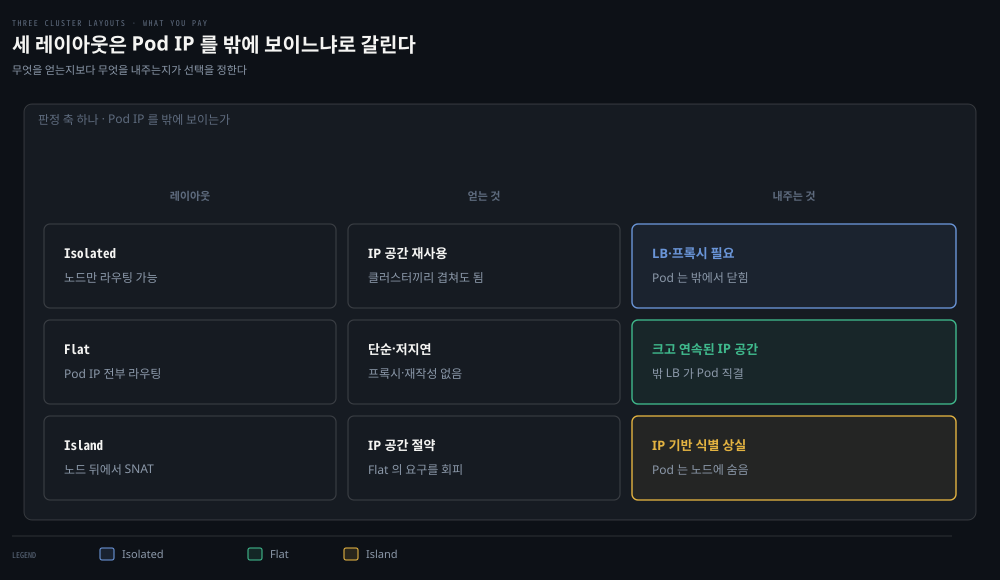
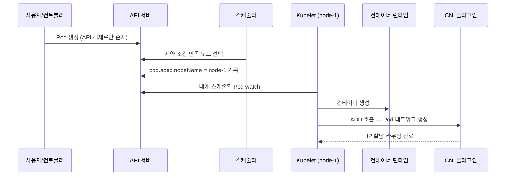

# Kubernetes 네트워킹 모델 — Pod IP·레이아웃·Probe

## 핵심 요약
> 이 편 전체가 매달린 하나의 생각은 "모든 Pod에 고유 IP를 준다 — 포트 충돌 문제를 주소 계층에서 없앤 이 선택이 Kubernetes 네트워킹의 출발점"입니다.
> 전편에서 본 Docker의 포트 매핑 지옥을 Kubernetes는 IP-per-Pod 모델로 풀었고, 그 대가로 클러스터는 Pod마다 IP를 할당·라우팅하는 복잡성을 떠안았습니다. 이 편은 그 모델의 요구사항, 클러스터 네트워크를 짜는 세 가지 방식(Isolated·Flat·Island), 그리고 Pod가 트래픽을 받을 자격을 판정하는 Probe까지 — 모델과 컴포넌트 층을 다룹니다.

## 학습 목표

이 내용을 읽고 나면:

1. Kubernetes 네트워킹 모델의 3가지 요구사항과 IP-per-Pod 선택의 동기·대가를 설명할 수 있습니다.
2. Isolated·Flat·Island 레이아웃의 거래를 비교하고 상황에 맞게 고를 수 있습니다.
3. kube-controller-manager의 CIDR 관련 플래그가 무엇을 정하는지 말할 수 있습니다.
4. Pod 생성이 스케줄러→Kubelet→CRI→CNI로 이어지는 흐름을 추적할 수 있습니다.
5. liveness·readiness·startup probe의 차이와 liveness 오용의 위험을 설명할 수 있습니다.

## 1. 네트워킹 모델 — NAT 없는 세계의 세 가지 약속

Kubernetes가 풀려는 네트워킹 문제는 네 가지입니다 — 밀결합된 컨테이너 간 통신, Pod 간 통신, Pod-서비스 통신, 외부-서비스 통신. Docker의 기본 모델(호스트별 사설 브리지 + 포트 매핑 + 충돌 관리)과 달리, Kubernetes는 CNI에 기대어 다음 요구사항을 강제합니다.

1. 모든 컨테이너는 NAT 없이 서로 통신할 수 있어야 합니다.
2. 노드는 NAT 없이 컨테이너와 통신할 수 있어야 합니다.
3. 컨테이너가 스스로 보는 자기 IP는 밖에서 보는 그 컨테이너의 IP와 같아야 합니다.

작업 단위는 Pod입니다. Pod는 항상 같은 노드에 함께 스케줄되는 컨테이너 묶음이고, 하나의 IP를 Pod 안 모든 컨테이너가 공유합니다.

IP를 Pod마다 주는 동기는 포트 제약 제거입니다. Linux에서 주소·포트·프로토콜 조합에는 프로그램 하나만 바인딩할 수 있으므로, Pod가 고유 IP를 갖지 않으면 한 노드의 두 웹 서버가 80 포트를 두고 다투게 됩니다. 그때의 해법(포트 플래그, 설정 스크립트, DNAT 규칙, 리버스 프록시)은 전부 추합니다. Google Borg가 그런 포트 공유 모델을 썼고, Kubernetes는 개발자가 편하고 서드파티 워크로드를 돌리기 쉬운 IP-per-Pod를 택했습니다.

대가는 명확합니다 — Pod마다 IP를 할당하고 라우팅하는 일이 클러스터에 상당한 복잡성을 더합니다.

이 모델에는 함정 두 개가 따라옵니다. 첫째, Pod는 휘발성입니다. 롤링 업데이트 한 번에 Pod가 교체되며 새 IP를 받으므로, Pod IP를 설정 파일이나 DNS에 직접 박는 것은 초심자의 단골 실수입니다 — 서비스와 엔드포인트가 이 문제를 풀며 다음 장에서 다룹니다. 둘째, 기본값은 전부 허용입니다. 클러스터 안 어떤 Pod든 다른 어떤 Pod에나 연결할 수 있어서, 인증 없는 서비스나 탈취된 자격증명과 결합하면 쉽게 악용됩니다(04-03의 NetworkPolicy가 그 답입니다).

한 가지 더 — Kubernetes는 기본 CNI 플러그인을 싣고 오지 않습니다. 표준 설치만 하면 Pod는 네트워크를 쓸 수 없습니다. Kubelet의 네트워킹 기능은 노드의 CNI 플러그인과의 API 상호작용에서 나옵니다.

## 2. 클러스터 네트워크의 세 가지 레이아웃

클러스터는 Pod에 줄 IP 대역(예: `10.1.0.0/16`)을 통제해야 하고, 노드와 Pod는 그 주소 공간에서 L3 연결성을 가져야 합니다. L3 연결성이 L4보다 근본적이라는 지적이 좋습니다 — 방화벽이 L4에서 A→B 연결만 허용하고 B→A를 거부할 수는 있어도, L3에서는 양방향 패킷 전달이 돼야 SYN-ACK가 돌아와 핸드셰이크가 성립합니다. 참고로 Pod는 일반적으로 MAC 주소를 갖지 않으므로 Pod로의 L2 연결성은 없습니다.

> 원문 정오: 이 절에서 책은 ingress를 "호스트나 클러스터를 떠나는 트래픽", egress를 "들어오는 트래픽"으로 정의했는데, 이는 뒤집힌 서술입니다. 표준 용어(그리고 이 책 NetworkPolicy 절의 실제 용법)로 ingress가 들어오는 트래픽, egress가 나가는 트래픽입니다.

| 레이아웃 | 구조 | 얻는 것 | 대가 |
|----------|------|--------|------|
| Isolated | 노드만 밖에서 라우팅 가능, Pod는 불가 | 보안 격리. 클러스터끼리 같은 IP 공간 재사용 가능 | 외부 연동은 로드밸런서·프록시로 뚫어야 함. 배치 처리처럼 닫힌 워크로드에 적합 |
| Flat | 모든 Pod IP가 네트워크 전체에서 라우팅 가능 | 단순함·저지연 — 프록시·재작성 비용 없음. 클러스터 밖 LB가 Pod를 직접 밸런싱 가능 | 크고 연속된 IP 공간 필요(사설 대역이면 현실적). 프로그래머블 네트워크 필수 |
| Island | 노드는 라우팅 가능, Pod 트래픽은 노드를 프록시 삼아 SNAT(masquerade) | Flat의 IP 공간 요구를 회피 | Pod IP가 노드 IP 뒤에 숨어 클러스터 경계 밖 IP 기반 방화벽·식별이 어려워짐 |

클라우드에서는 큰 사설 서브넷과 IP 할당 API가 있어 Flat이 쉽게 성립합니다. 참고로 Isolated여도 외부에서 Kubernetes API를 써야 한다면 API 서버는 라우팅 가능해야 합니다 — 관리형 서비스의 "secure cluster" 옵션이 이 구성입니다.

용어 정리 하나 — control plane은 패킷을 어디로 보낼지 결정하는 기능·프로세스 전체, data plane은 그 논리에 따라 실제로 패킷을 전달하는 기능·프로세스 전체입니다.

## 3. kube-controller-manager — 대역을 정하는 곳

kube-controller-manager는 Kubernetes 컨트롤러 대부분을 한 바이너리·한 프로세스로 돌립니다. 컨트롤러란 리소스를 감시하며 특정 상태를 동기화·강제하는 소프트웨어이고, 네트워크 스택 관련 컨트롤러도 여기 다수 삽니다. 관리자가 클러스터 CIDR을 정하는 곳도 여기입니다.

- `--cluster-CIDR` — Pod IP를 할당할 대역. `--allocate-node-cidrs=true`가 전제이고, dual-stack이면 IPv4·IPv6 쌍을 콤마로 받습니다
- `--node-CIDR-mask-size` — 노드별 CIDR 마스크(기본 IPv4 /24, IPv6 /64). 노드마다 2^(32-마스크)개 주소가 배정됩니다 (원문 정오: 책 표는 2^(mask-size)로 인쇄했지만 /24 마스크의 노드가 받는 주소는 2^8=256개입니다)
- `--service-cluster-ip-range` — 서비스 ClusterIP를 할당할 대역

## 4. Kubelet — Pod가 실제로 만들어지는 흐름

Kubelet은 모든 워커 노드에서 도는 단일 바이너리로, 노드에 스케줄된 Pod를 관리하고 상태를 보고합니다. 본질은 조율자입니다 — 컨테이너 런타임은 CRI로, 네트워킹 구현은 CNI로 부립니다.

스케줄러는 CPU·메모리 요청, affinity/anti-affinity, taint 같은 제약을 만족하는 노드를 골라 `nodeName`을 적을 뿐이고, 그 노드의 Kubelet이 "존재해야 하는데 없는" Pod를 발견해 만듭니다. 컨테이너가 생기면 Kubelet이 CNI에 ADD를 호출해 Pod 네트워크를 만듭니다.

## 5. Probe — 트래픽 받을 자격의 판정

Pod readiness는 Pod가 트래픽을 서빙할 준비가 됐는지의 추가 표시이고, Pod 주소가 Endpoints 객체에 오를지를 결정합니다. Kubelet이 수행하는 컨테이너 헬스체크는 세 종류입니다 — exec·TCP·HTTP 방식 중 하나로 진단하고 결과는 Success·Failure·Unknown입니다. Pod 스펙에 프로브가 없으면 세 종류 모두 기본 성공입니다.

| 프로브 | 실패 시 | 용도 |
|--------|--------|------|
| readinessProbe | 컨테이너를 죽이지 않고 Pod 상태에 실패 기록 → Endpoints에서 제외, 서비스가 트래픽을 안 보냄. ReplicaSet은 unready로 집계해 롤링 업데이트를 멈춤 | "지금 트래픽 받아도 되는가" |
| livenessProbe | Kubelet이 컨테이너를 종료(재시작 정책 적용) | "재시작해야 하는 상태인가" |
| startupProbe | 성공 전까지 다른 프로브를 전부 비활성. 실패하면 컨테이너 종료 | 느린 기동에 유예를 주되, 기동 후 이상은 빨리 잡기 |

저자들의 경고가 이 절의 백미입니다 — liveness probe는 오용하기 쉽습니다. 웹 앱 메인 페이지를 liveness로 걸었다고 합시다. 백엔드 DB 장애, 의존 서비스 장애, 버그를 드러낸 feature flag — 컨테이너 코드 밖의 원인으로 메인 페이지가 404나 500을 돌려주면 liveness가 컨테이너를 재시작합니다.

재시작은 다른 곳의 문제를 못 풀 뿐 아니라 CrashLoopBackoff 지연이 겹치며 "홈 화면 에러"를 "서비스 전면 다운"으로 키울 수 있고, 재시작으로 캐시까지 날리면 악화가 가속됩니다. 그래서 liveness는 검사 대상 컨테이너 자신에게만 의존하는 최소 검증 엔드포인트로 씁니다.

프로브의 타이밍 옵션은 다섯입니다.

- `initialDelaySeconds` — 첫 검사까지 대기 (기본 0)
- `periodSeconds` — 검사 주기 (기본 10)
- `timeoutSeconds` — 검사 타임아웃 (기본 1)
- `successThreshold` — 성공 판정 연속 횟수 (기본 1, liveness·startup은 1 고정)
- `failureThreshold` — 실패 판정 연속 횟수 (기본 3)

여기에 readiness gates(1.14+ 안정)를 더하면 Pod 조건 목록의 커스텀 조건(예: AWS ALB의 타깃 등록 완료)까지 준비 판정에 넣을 수 있습니다.

> 💬 **비유**: 세 프로브는 식당 직원의 세 가지 질문입니다. startup은 "개점 준비 끝났나요?"입니다 — 끝날 때까지 다른 질문을 하지 않습니다. readiness는 "지금 손님 받을 수 있나요?"입니다 — 아니라고 하면 손님을 다른 지점으로 보낼 뿐 주방을 갈아엎지 않습니다. liveness는 "주방장이 쓰러졌나요?"입니다 — 그렇다면 교체(재시작)합니다. 사고는 세 번째 질문에 "재료 배송이 늦어요(외부 의존)"까지 얹을 때 납니다 — 멀쩡한 주방장을 계속 교체해 봐야 배송은 오지 않습니다.

## 심화 학습
> 책 밖에서 보강한 내용입니다. 출처를 함께 남깁니다.

- IP-per-Pod 모델의 공식 서술은 [K8s 문서 — 클러스터 네트워킹](https://kubernetes.io/docs/concepts/cluster-administration/networking/)에 있습니다. 책의 3요구사항 표현은 이 문서의 "every Pod gets its own IP" 원칙과 같은 내용입니다.
- 프로브 옵션과 readiness gates의 정본은 [K8s 문서 — Liveness·Readiness·Startup Probes](https://kubernetes.io/docs/tasks/configure-pod-container/configure-liveness-readiness-startup-probes/)입니다. gRPC 프로브(1.27 GA)처럼 책 이후 추가된 방식도 여기서 확인됩니다.
- 형제 정독본이 같은 주제를 오브젝트 관점으로 다룹니다 — [『Kubernetes in Action』 06-02 liveness·startup probe](../kubernetes-in-action/06-02.liveness%C2%B7startup%20probe%EB%A1%9C%20%EC%BB%A8%ED%85%8C%EC%9D%B4%EB%84%88%20%EA%B1%B4%EA%B0%95%20%EC%9C%A0%EC%A7%80.md). 이 편이 네트워킹 관점(Endpoints 제외)이라면 그쪽은 운영 관점입니다.

## 결정 치트시트
> 레이아웃 선택은 "Pod IP가 클러스터 밖에서 보여야 하는가"로 시작합니다.

| 질문 | 답 | 레이아웃 |
|------|-----|---------|
| 클러스터 밖에서 Pod IP로 직접 접근해야 하는가? | 예 | Flat — 큰 연속 IP 공간 확보 필요 |
| 외부 연동이 거의 없는 닫힌 워크로드인가? | 예 | Isolated — IP 공간 재사용·보안 이점 |
| IP 공간은 부족하지만 외부 통신은 필요한가? | 예 | Island — SNAT 경유, IP 기반 식별 포기 감수 |
| liveness 검사에 외부 의존(DB·타 서비스)을 넣을까? | 절대 아니오 | 컨테이너 자신만 검사 — 외부 장애에 재시작 폭풍 방지 |

## Spring 앱 개발 관점
> 책에는 Spring 예제가 없어 공식 문서로 보강한 절입니다. 이 편의 Probe가 Spring Boot에서 어떻게 구현되는지만 짚습니다.

Spring Boot Actuator는 Kubernetes 프로브를 1급으로 지원합니다. Kubernetes 환경을 감지하면 `/actuator/health/liveness`와 `/actuator/health/readiness` 엔드포인트가 자동 활성화됩니다.

이 둘은 애플리케이션의 AvailabilityState(LivenessState·ReadinessState)를 노출합니다 — [Spring Boot 공식 문서 — Kubernetes Probes](https://docs.spring.io/spring-boot/reference/actuator/endpoints.html#actuator.endpoints.kubernetes-probes) 참조.

핵심은 이 편의 경고와 Spring의 기본 설계가 일치한다는 점입니다. Spring의 liveness health group은 기본적으로 DB·외부 시스템 HealthIndicator를 포함하지 않습니다 — 외부 장애로 liveness가 떨어지면 재시작 폭풍이 온다는, 저자들이 경고한 바로 그 이유 때문입니다. DB 연결 확인 같은 의존성 검사를 넣고 싶다면 readiness group에 넣습니다(`management.endpoint.health.group.readiness.include=readinessState,db`).

롤링 업데이트와의 결합도 한 줄 필요합니다. Pod 종료 시 Endpoints 제외와 실제 종료 사이의 경합으로 in-flight 요청이 끊길 수 있는데, `server.shutdown=graceful`(Spring Boot 2.3+)을 켜면 새 요청은 거부하되 처리 중 요청은 마치고 내려갑니다 — readiness 실패 → graceful shutdown의 순서가 무중단 배포의 애플리케이션 쪽 절반입니다.

## 면접에서 받을 만한 질문
> 답을 가리고 스스로 말해 본 뒤, 아래 정답 절에서 맞춰 봅니다.

1. Kubernetes 네트워킹 모델을 "한 줄"로 정의한다면?
2. IP-per-Pod를 택한 동기와 그 대가는? 뒤따르는 두 함정(휘발성·전부 허용)은 무엇이 보완하나요?
3. 레이아웃 3유형(Isolated·Flat·Island)의 거래를 설명해 보세요.
4. readiness·liveness·startup의 차이는? liveness 오용이 왜 위험한가요?
5. Pod IP를 DNS에 직접 등록하면 왜 안 되나요?
6. startup probe는 언제 씁니까? initialDelaySeconds로 충분하지 않나요?
7. readiness 실패와 liveness 실패가 동시에 나면 어떻게 되나요?

## 정답 (자답 후 펼치기)

### 1. 네트워킹 모델 한 줄 정의
"Kubernetes 네트워킹 모델이란 모든 Pod가 NAT 없이 서로 통신하고 자기 IP를 밖에서도 그대로 보이는 고유 IP로 갖는다는 요구사항으로, 그 구현은 CNI 플러그인에 위임됩니다."

### 2. IP-per-Pod의 동기·대가·보완
동기는 포트 충돌 제거입니다. 대가는 Pod마다 IP를 할당·라우팅하는 복잡성입니다. 뒤따르는 두 함정 중 Pod IP의 휘발성은 서비스(ClusterIP) 추상화가, 기본 전부 허용은 NetworkPolicy가 보완합니다.

### 3. 레이아웃 3유형의 거래
"Pod가 클러스터 밖에서 라우팅 가능한가"의 거래입니다. Isolated는 불가(보안·IP 재사용 이점), Flat은 가능(단순·저지연이나 큰 IP 공간이 비쌈), Island는 노드 뒤 SNAT로 Pod를 은닉(IP 공간은 아끼되 IP 기반 식별 포기)합니다.

### 4. 세 프로브 차이와 liveness 오용
readiness는 트래픽 제외(Endpoints에서 빠짐), liveness는 재시작, startup은 성공 전까지 다른 프로브를 유예합니다. liveness에 외부 의존(DB·타 서비스)을 넣으면, 남의 장애로 메인 페이지가 500을 돌려줄 때 멀쩡한 컨테이너가 재시작되고 CrashLoopBackoff로 "홈 화면 에러"가 "서비스 전면 다운"으로 커집니다.

### 5. Pod IP를 DNS에 직접 등록하면 안 되는 이유
Pod는 롤링 업데이트·재스케줄링마다 삭제되고 새 IP로 재생성되기 때문입니다. 안정적인 접점은 서비스(ClusterIP)와 그 뒤의 Endpoints가 제공하며, readiness probe를 통과한 Pod만 거기 오릅니다.

### 6. startup probe를 쓰는 이유
기동 시간이 들쭉날쭉할 때입니다. initialDelay는 고정 대기라 최악 기동 시간에 맞추면 정상 기동이 느려지고, 짧게 잡으면 느린 기동이 liveness에 걸려 죽습니다. startup probe는 "성공할 때까지" 다른 프로브를 막아 가변 기동을 흡수하고, 기동 후에는 liveness가 짧은 주기로 이상을 잡게 합니다.

### 7. readiness·liveness 동시 실패
liveness 실패가 우선적으로 파괴적입니다 — 컨테이너가 재시작됩니다. readiness 실패는 그동안 Endpoints 제외로 트래픽만 끊습니다. 그래서 같은 엔드포인트를 두 프로브에 함께 쓰면 "트래픽 제외로 충분한 상황"에서도 재시작이 일어나는 과잉 대응이 됩니다.

## 핵심 개념 체크리스트
- [ ] 네트워킹 모델 3요구사항을 NAT 관점에서 말할 수 있는가?
- [ ] IP-per-Pod의 동기(포트)와 대가(복잡성)를 짝으로 설명할 수 있는가?
- [ ] 레이아웃 3유형의 거래를 표 없이 재구성할 수 있는가?
- [ ] Pod 생성 흐름(스케줄러→Kubelet→CRI→CNI ADD)을 그릴 수 있는가?
- [ ] liveness 오용 시나리오(외부 의존→재시작 폭풍)를 서사로 말할 수 있는가?
- [ ] Actuator liveness group이 DB를 기본 제외하는 이유를 아는가?

## 참고 자료
- 《Networking and Kubernetes: A Layered Approach》(James Strong·Vallery Lancey, O'Reilly, 2021, ISBN 978-1492081654) Ch4
- [K8s 문서 — Probes 구성](https://kubernetes.io/docs/tasks/configure-pod-container/configure-liveness-readiness-startup-probes/)
- [Spring Boot — Kubernetes Probes](https://docs.spring.io/spring-boot/reference/actuator/endpoints.html#actuator.endpoints.kubernetes-probes)
- 이전 편: [03-03. 컨테이너 연결 실습](./03-03.%EC%BB%A8%ED%85%8C%EC%9D%B4%EB%84%88%20%EC%97%B0%EA%B2%B0%20%EC%8B%A4%EC%8A%B5%20%E2%80%94%20%EA%B0%99%EC%9D%80%20%ED%98%B8%EC%8A%A4%ED%8A%B8%2C%20%EB%8B%A4%EB%A5%B8%20%ED%98%B8%EC%8A%A4%ED%8A%B8.md)
- 다음 편: [04-02. CNI와 kube-proxy](./04-02.CNI%EC%99%80%20kube-proxy%20%E2%80%94%20Pod%20%EB%84%A4%ED%8A%B8%EC%9B%8C%ED%81%AC%EC%9D%98%20%EB%B0%B0%EC%84%A0%EA%B3%B5%EA%B3%BC%20%EB%A1%9C%EB%93%9C%EB%B0%B8%EB%9F%B0%EC%84%9C.md)
