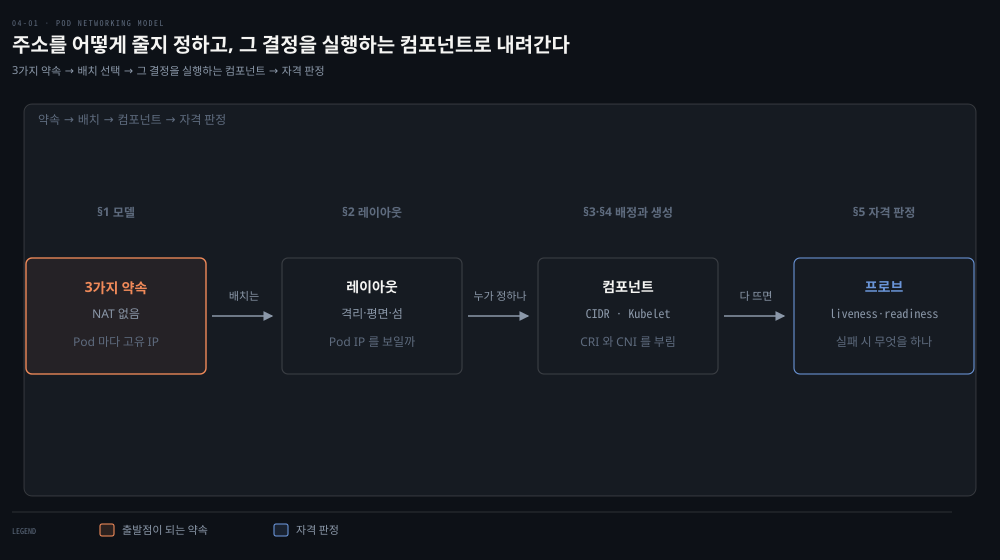
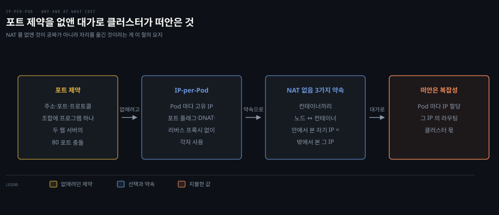
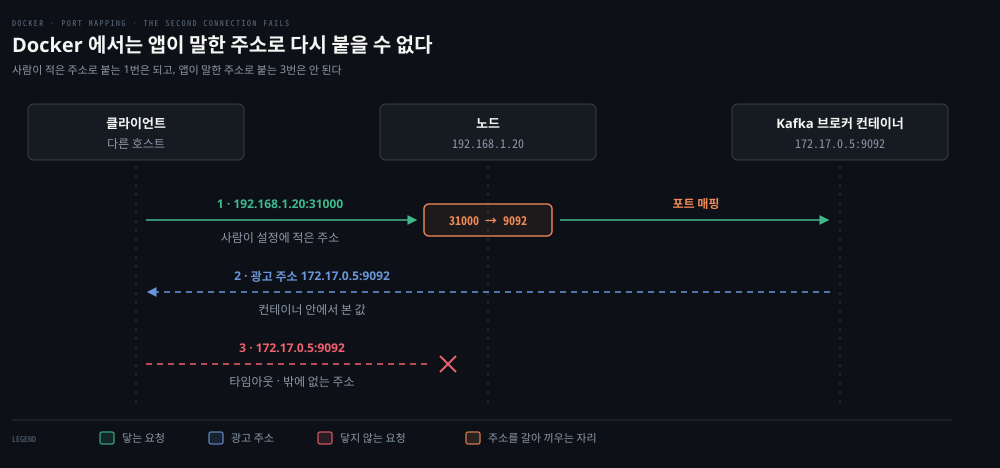
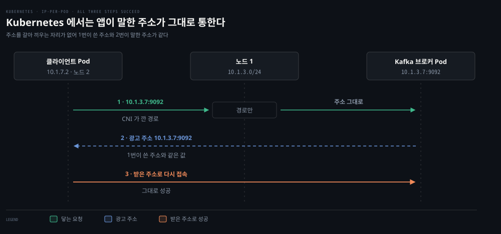
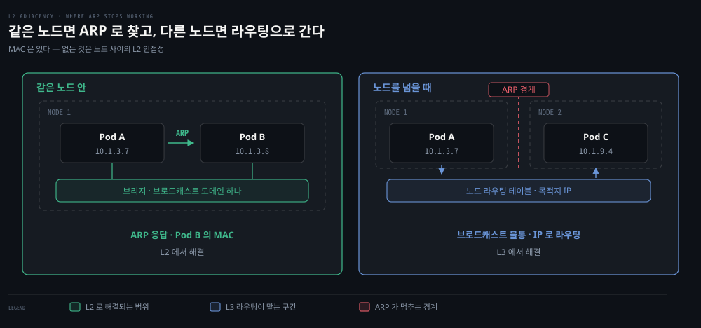
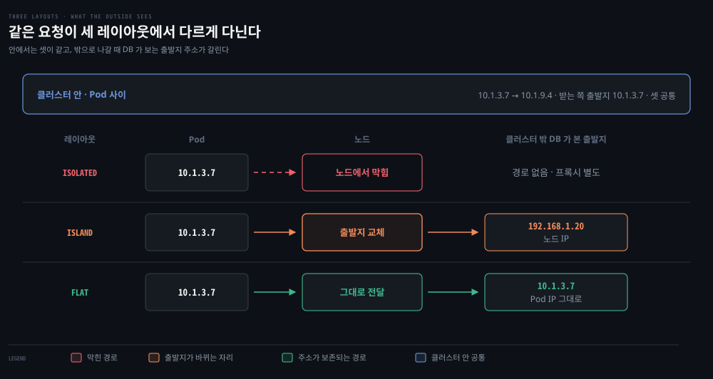
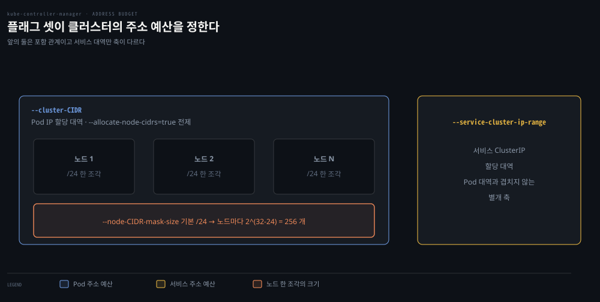
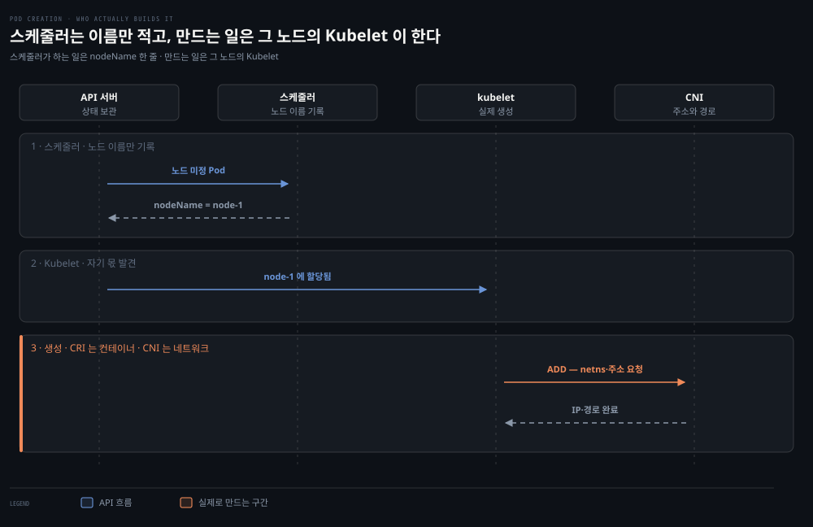
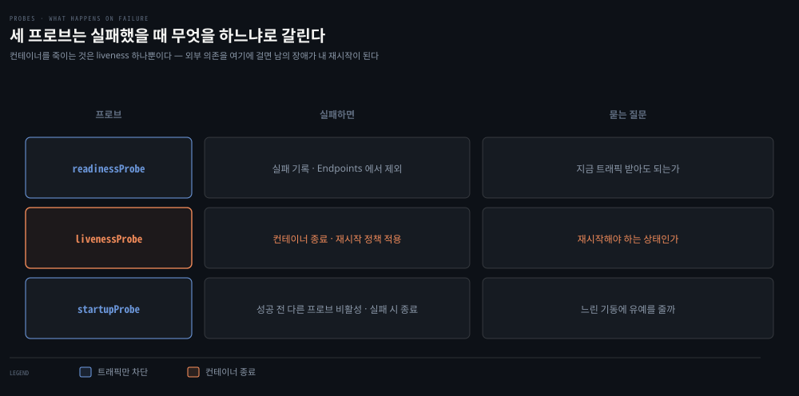
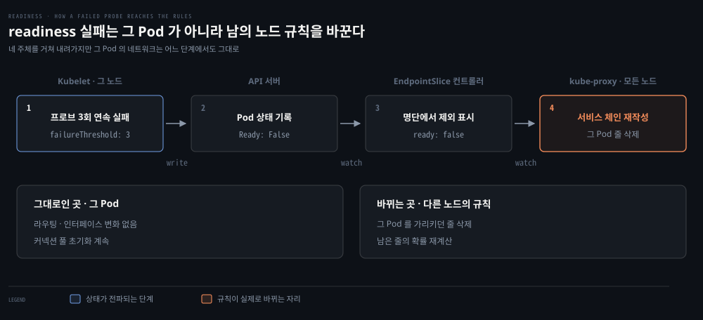

# Kubernetes 네트워킹 모델 — Pod IP·레이아웃·Probe

---

## 핵심 요약
> 이 편 전체가 매달린 하나의 생각은 **"모든 Pod에 고유 IP를 준다 — 포트 충돌 문제를 주소 계층에서 없앤 이 선택이 Kubernetes 네트워킹의 출발점"입니다.**

전편에서 본 Docker의 포트 매핑 지옥을 Kubernetes는 IP-per-Pod 모델로 풀었고, 그 대가로 클러스터는 Pod마다 IP를 할당·라우팅하는 복잡성을 떠안았습니다. 이 편은 그 모델의 요구사항, 클러스터 네트워크를 짜는 세 가지 방식(Isolated·Flat·Island), 그리고 Pod가 트래픽을 받을 자격을 판정하는 Probe까지 — 모델과 컴포넌트 층을 다룹니다.


## 학습 목표
> 모델을 외우는 대신, 왜 Pod 마다 IP 를 주기로 했고 그 결정이 무엇을 떠안겼는지를 인과로 설명할 수 있는 상태를 목표로 합니다.

이 내용을 읽고 나면:

1. Kubernetes 네트워킹 모델의 3가지 요구사항과 IP-per-Pod 선택의 동기·대가를 설명할 수 있습니다.
2. Isolated·Flat·Island 레이아웃의 거래를 비교하고 상황에 맞게 고를 수 있습니다.
3. kube-controller-manager의 CIDR 관련 플래그가 무엇을 정하는지 말할 수 있습니다.
4. Pod 생성이 스케줄러→Kubelet→CRI→CNI로 이어지는 흐름을 추적할 수 있습니다.
5. liveness·readiness·startup probe의 차이와 liveness 오용의 위험을 설명할 수 있습니다.

아래는 이 편 전체를 모델에서 컴포넌트로 내려가는 순서로 이은 지도입니다. 왼쪽 두 칸이 "주소를 어떻게 줄 것인가"라는 모델의 결정입니다. 세 번째 칸이 그 결정을 실행하는 컴포넌트이고, 마지막 칸은 주소를 받은 Pod가 트래픽을 받을 자격이 있는지를 따로 판정하는 자리입니다. 단계 위의 이름이 본문에서 그것을 다루는 절입니다.




## 1. 네트워킹 모델 — NAT 없는 세계의 3가지 약속
> 3가지 요구사항의 공통 낱말은 NAT 없음입니다. 포트 충돌을 주소 계층에서 없앤 대신, Pod 마다 IP 를 할당하고 라우팅하는 복잡성을 클러스터가 떠안았습니다.



왼쪽 끝이 없애려던 제약이고 오른쪽 끝이 그 대신 치른 값입니다. 가운데 두 칸이 그 사이를 잇는 선택과 약속입니다.

### 풀려는 문제

앞 장에서 본 Docker 의 기본 모델은 호스트마다 사설 브리지를 두고 필요한 것만 포트로 노출하는 방식이었습니다. 컨테이너가 몇 개일 때는 됩니다. 수천 개가 되면 "이 앱이 이 노드에서 몇 번 포트를 쓰는가"를 누군가는 기억하고 관리해야 하는데, 그 일을 사람이 감당할 수 없습니다.

Kubernetes 는 그 관리를 줄이는 대신 아예 없애는 쪽을 택했습니다. 이 절의 3가지 요구사항이 그 선택을 규칙으로 적어 둔 것이고, 함께 치른 값도 같은 자리에 있습니다. 공짜로 없앤 것이 아니기 때문입니다.

Kubernetes가 풀려는 네트워킹 문제는 네 가지입니다

1. 밀결합된 컨테이너 간 통신
2. Pod 간 통신
3. Pod-서비스 통신
4. 외부-서비스 통신

### 3가지 요구사항

Docker의 기본 모델은 호스트별 사설 브리지에 포트 매핑과 충돌 관리를 얹는 방식이었습니다. Kubernetes는 그 대신 CNI에 기대어 다음 요구사항을 강제합니다.

1. 모든 컨테이너는 NAT 없이 서로 통신할 수 있어야 합니다.
2. 노드는 NAT 없이 컨테이너와 통신할 수 있어야 합니다.
3. **컨테이너가 자기 주소를 조회했을 때 나오는 IP 와, 다른 곳에서 그 컨테이너를 부를 때 쓰는 IP 가 같아야 합니다.**

### 세 번째 요구사항이 왜 따로 필요한가

세 번째가 왜 필요한지는 예를 봐야 잡힙니다.

여기서 갈라야 할 주소가 둘입니다. 앞의 것은 앱이 자기 안에서 `ip addr` 로 조회해 알아낸 자기 주소입니다. 뒤의 것은 상대가 실제로 그 앱에 닿을 때 쓰는 주소입니다.

앱 중에는 켜지자마자 앞의 값을 읽어 남에게 알려 주는 것들이 있습니다. Kafka 브로커가 그렇고 서비스 레지스트리에 자기를 등록하는 앱도 그렇습니다. 이 값을 광고 주소라고 부르며 Kafka 의 설정 키 이름이 `advertised.listeners` 입니다.

Docker 의 포트 매핑 아래에서 두 주소가 어긋납니다.



도식의 세 단계가 사고의 전부입니다. 사람이 설정에 적어 준 주소로 붙은 1단계는 성공합니다. 2단계에서 브로커가 자기 주소를 알려 주는데, 그 값은 컨테이너 안에서 본 `172.17.0.5` 입니다. 3단계에서 클라이언트가 그 주소로 붙으면 타임아웃이 납니다. 앱도 로그도 정상인데 클라이언트만 실패합니다.

그렇다면 클라이언트가 처음 붙은 주소를 계속 쓰면 되지 않을까요. 그게 안 되는 이유가 프로토콜에 있습니다. 클라이언트는 처음 붙은 브로커에게 "이 토픽의 파티션들이 어디 있나"를 묻고, 답에는 **브로커 여러 대의 주소**가 담깁니다. 그 주소는 각 브로커가 자기 설정에서 읽어 보고한 값입니다. 처음 붙은 주소는 그중 한 대의 것이라 나머지에 붙으려면 받은 값을 써야 합니다.

그래서 처방은 광고 주소를 밖에서 닿는 값으로 손수 적어 주는 것인데, 그 손질이 잘 깨집니다. 브로커마다 매핑 포트가 달라 값이 제각각이고, 컨테이너가 다른 노드로 옮겨 가면 노드 주소가 바뀌어 값이 틀려집니다. 아예 그런 설정 항목 없이 자기 IP 를 읽어 쓰는 앱도 있습니다.

세 번째 요구사항은 이 어긋남을 없앱니다.



같은 세 단계인데 결과가 전부 성공입니다. 1단계가 쓴 주소와 2단계가 말한 주소가 같은 값이라 3단계가 그대로 통합니다. 중간에 주소를 갈아 끼우는 자리가 없어서 그렇고, 그러면 광고 주소를 손으로 바로잡는 설정이 통째로 사라집니다.

> 여기서 Pod IP 는 **가상 주소가 아닙니다.** Pod 의 `eth0` 에 실제로 붙어 있는 진짜 주소이고, 상대가 그 주소로 보내면 CNI 가 깔아 둔 경로를 타고 그대로 배달됩니다. 가상 주소는 서비스의 ClusterIP 쪽이며 §3 에서 갈라 다룹니다. 그리고 이 약속의 범위는 **클러스터 안**입니다. 클러스터 밖에서 Pod IP 로 닿는지는 §2 의 레이아웃이 정합니다.

### IP 를 Pod 마다 주는 동기와 대가

작업 단위는 Pod입니다. Pod는 항상 같은 노드에 함께 스케줄되는 컨테이너 묶음이고, 하나의 IP를 Pod 안 모든 컨테이너가 공유합니다.

IP 를 Pod 마다 주는 동기는 포트 제약 제거입니다. Linux 에서 주소·포트·프로토콜 조합에는 프로그램 하나만 바인딩할 수 있습니다. Pod 가 고유 IP 를 갖지 않으면 한 노드의 두 웹 서버가 80 포트를 두고 다투게 됩니다.

그때의 해법은 전부 추합니다. 포트 플래그, 설정 스크립트, DNAT 규칙, 리버스 프록시 가운데 무엇을 쓰든 "이 앱이 이 노드에서 몇 번 포트인가"를 사람이 관리해야 합니다. Google Borg 가 그런 포트 공유 모델을 썼고, Kubernetes 는 개발자가 편하고 서드파티 워크로드를 돌리기 쉬운 IP-per-Pod 를 택했습니다.

대가는 명확합니다. Pod 마다 IP 를 할당하고 라우팅하는 일이 클러스터에 상당한 복잡성을 더합니다.

### 이 모델에 따라오는 함정 둘

이 모델에는 함정 둘이 따라옵니다.

| 함정 | 무슨 일이 벌어지나 | 무엇이 푸나 |
|------|-----------------|-----------|
| Pod 는 휘발성이다 | 롤링 업데이트 한 번에 Pod 가 교체되며 새 IP 를 받는다. Pod IP 를 설정 파일이나 DNS 에 직접 박으면 곧 틀린 값이 된다 | 서비스와 엔드포인트. 다음 장 주제 |
| 기본값이 전부 허용이다 | 클러스터 안 어떤 Pod 든 다른 어떤 Pod 에나 연결할 수 있다. 인증 없는 서비스나 탈취된 자격증명과 겹치면 쉽게 악용된다 | NetworkPolicy. 04-03 주제 |

### 서비스를 거치면 NAT 이 생기는데 약속은 어떻게 되나

함정 하나를 서비스가 푼다고 했는데, 그 서비스가 목적지를 바꾸고 로드밸런싱도 확률로 가릅니다. 방금 읽은 NAT 없음 약속과 어긋나 보입니다.

두 가지가 서로 다른 층입니다.

| 어디로 보내는가 | 목적지 주소의 성질 | NAT |
|----------------|-----------------|-----|
| Pod IP 로 직접 | 인터페이스에 붙은 진짜 주소 | 없습니다. 이 절의 약속이 걸리는 자리입니다 |
| 서비스의 ClusterIP 로 | 어디에도 붙어 있지 않은 가상 주소 | 목적지를 실제 Pod IP 로 바꿉니다 |

서비스는 약속의 예외가 아니라 **약속 위에 얹은 층**입니다. 순서를 보면 분명합니다. ClusterIP 로 온 패킷은 목적지가 Pod IP 로 바뀌고, 그다음부터는 다시 NAT 없는 Pod 사이 통신입니다. 바꿔치울 목적지가 있어야 이 장치가 성립하므로, 서비스는 IP-per-Pod 를 대체하는 것이 아니라 그것을 전제로 씁니다.

출발지는 보통 그대로입니다. Pod 가 서비스를 거쳐 다른 Pod 에 닿아도 받는 쪽이 보는 출발지는 원래 Pod IP 입니다. 목적지 쪽 NetworkPolicy 가 누가 보냈는지 가릴 수 있는 것이 그 덕입니다.

출발지까지 바뀌는 경우는 따로 있습니다. 노드 자신이 보낼 때, 자기 자신에게 되돌아오는 경우, 그리고 클러스터 밖에서 NodePort 로 들어와 다른 노드로 넘어갈 때입니다. 마지막 경우에 클라이언트 IP 가 노드 IP 로 지워지는 것이 실무에서 자주 만나는 증상입니다.

확률로 갈리는 것도 맞습니다. iptables 모드의 kube-proxy 는 규칙마다 확률을 붙여 백엔드를 고르므로 정확한 비율 분배가 아니라 무작위입니다. 다만 연결 단위로 한 번 정해지면 그 연결의 나머지 패킷은 같은 Pod 로 갑니다. 정교한 분배가 필요하면 IPVS 모드가 실제 스케줄링 알고리즘을 줍니다. 규칙의 생김새와 모드별 차이는 [04-02](./04-02.CNI%EC%99%80%20kube-proxy%20%E2%80%94%20Pod%20%EB%84%A4%ED%8A%B8%EC%9B%8C%ED%81%AC%EC%9D%98%20%EB%B0%B0%EC%84%A0%EA%B3%B5%EA%B3%BC%20%EB%A1%9C%EB%93%9C%EB%B0%B8%EB%9F%B0%EC%84%9C.md)가 다룹니다.

### CNI 는 함께 오지 않는다

한 가지가 더 있습니다. Kubernetes 는 기본 CNI 플러그인을 싣고 오지 않습니다. 표준 설치만 하면 Pod 는 네트워크를 쓸 수 없습니다. Kubelet 의 네트워킹 기능은 노드의 CNI 플러그인과 주고받는 API 호출에서 나옵니다.


## 2. 클러스터 네트워크의 세 가지 레이아웃
> 세 레이아웃은 "Pod IP 가 클러스터 밖에서 보여야 하는가" 하나로 갈립니다. 보이게 하면 단순해지고 감추면 IP 공간을 아끼되 식별을 포기합니다.


### 풀려는 문제

Pod 마다 IP 를 준다고 정하고 나면 곧바로 다음 질문이 옵니다. 그 IP 가 어디까지 보여야 할까요. 클러스터 밖의 로드밸런서가 Pod 를 직접 부를 수 있어야 하는지, 아니면 노드 뒤에 감춰도 되는지에 따라 필요한 주소 공간과 방화벽 설계가 통째로 달라집니다.

이 결정은 클러스터를 세운 뒤에 바꾸기 어렵습니다. 그래서 미리 골라야 하고, 선택지는 셋입니다.

- 클러스터는 Pod에 줄 IP 대역(예: `10.1.0.0/16`)을 통제해야 합니다. 노드와 Pod는 그 주소 공간에서 L3 연결성을 가져야 합니다. 
- L3 연결성이 L4보다 근본적이라는 지적이 좋습니다. 방화벽이 L4에서 A→B 연결만 허용하고 B→A를 거부할 수는 있어도, L3에서는 양방향 패킷 전달이 돼야 SYN-ACK가 돌아와 핸드셰이크가 성립합니다.

책은 이 자리에 "Pod 는 일반적으로 MAC 주소를 갖지 않으므로 L2 연결성이 없다"고 적지만 이는 정확하지 않습니다. Pod 의 `eth0`(veth 한쪽)에는 **MAC 이 있습니다** — 컨테이너 안에서 `ip link` 로 확인됩니다. 없는 것은 주소가 아니라 **노드 간 L2 인접성**입니다.



이 차이는 같은 노드와 다른 노드를 나란히 두면 보입니다.

같은 노드의 Pod 둘은 한 브리지에 매달려 있습니다. 이 브리지가 하나의 브로드캐스트 도메인이라, Pod A 가 "10.1.3.8 쓰는 사람 누구세요"라고 ARP 를 뿌리면 그 안의 Pod B 가 자기 MAC 으로 답합니다. 2장에서 veth 와 브리지를 손으로 지어 확인한 그 동작입니다.

다른 노드의 Pod 는 그 브리지에 없습니다. ARP 는 브로드캐스트라 노드 경계를 넘지 못하므로 아무도 답하지 않습니다. 그래서 패킷은 Pod 의 기본 경로를 따라 노드로 올라가고, 노드가 라우팅 테이블을 보고 상대 노드로 보냅니다. 목적지를 IP 로 찾는 이 방식이 L3 라우팅입니다.

정리하면 "MAC 이 없다"가 아니라 "같은 L2 세그먼트에 없다"가 이 문단의 요점입니다. MAC 은 있지만 그것으로 상대를 찾을 수 있는 범위가 자기 노드 안까지입니다.

### Pod 의 라우팅 테이블에는 갈래가 없습니다

방금 "패킷은 Pod 의 기본 경로를 따라 노드로 올라간다"고 적었습니다. 그 기본 경로가 어떻게 생겼는지를 보면 판단이 어디서 일어나는지가 드러납니다.

기본 구성의 Pod 에는 인터페이스가 `eth0` 하나이고, CNI 는 그 안에 목적지별 갈래를 적어 두지 않습니다. `default via` 로 시작하는 기본 경로 한 줄과 자기 인터페이스에 직접 붙는 항목 정도가 전부입니다. 인터페이스가 하나라서 갈래가 *불가능한* 것은 아닙니다. 같은 인터페이스에도 목적지마다 다음 홉이 다른 줄을 얼마든지 넣을 수 있습니다. 안 넣는 쪽을 고른 것이고 그 선택이 이 절의 요점입니다.

그래서 **Pod 는 어디로 갈지 판단하지 않습니다.** 자기 인터페이스에 직접 붙는 것 말고는 전부 한 곳으로 올려 보낼 뿐입니다. 판단은 노드가 합니다. 노드의 테이블에는 다른 노드의 Pod 대역과 클러스터 밖으로 나가는 기본 경로가 함께 들어 있고, 갈래는 거기에 있습니다. `hostNetwork` 로 띄우거나 Multus 로 인터페이스를 더 붙이면 이 그림은 달라집니다.

그래서 경로를 손보는 자리도 Pod 안이 아니라 노드 쪽입니다. [04-04](./04-04.Kubernetes%20%EB%84%A4%ED%8A%B8%EC%9B%8C%ED%81%AC%20%EC%8B%A4%EC%8A%B5%20%E2%80%94%20CNI%20%EB%B6%80%EC%9E%AC%EB%B6%80%ED%84%B0%20%EC%A0%95%EC%B1%85%C2%B7DNS%EA%B9%8C%EC%A7%80.md) 묶음 8 에서 VM 의 라우팅 테이블에 줄 하나를 넣어 Pod 대역을 연 것이 같은 이유입니다. Pod 안에서는 바꿀 것이 없었습니다.

Pod 쪽 테이블을 직접 보려면 컨테이너 안에서 `kubectl exec deploy/web -- ip route` 한 줄이면 됩니다. 04-04 묶음 2 의 2-3 이 이 출력을 아직 안 뜬 자리로 남겨 두었습니다.

> 원문 정오: 이 절에서 책은 ingress를 "호스트나 클러스터를 떠나는 트래픽", egress를 "들어오는 트래픽"으로 정의했는데, 이는 뒤집힌 서술입니다. 표준 용어(그리고 이 책 NetworkPolicy 절의 실제 용법)로 ingress가 들어오는 트래픽, egress가 나가는 트래픽입니다.

| 레이아웃 | 구조 | 얻는 것 | 대가 |
|----------|------|--------|------|
| Isolated | 노드만 밖에서 라우팅 가능, Pod는 불가 | 보안 격리. 클러스터끼리 같은 IP 공간 재사용 가능 | 외부 연동은 로드밸런서·프록시로 뚫어야 함. 배치 처리처럼 닫힌 워크로드에 적합 |
| Flat | 모든 Pod IP가 네트워크 전체에서 라우팅 가능 | 단순함·저지연 — 프록시·재작성 비용 없음. 클러스터 밖 LB가 Pod를 직접 밸런싱 가능 | 크고 연속된 IP 공간 필요(사설 대역이면 현실적). 프로그래머블 네트워크 필수 |
| Island | 노드는 라우팅 가능, Pod 트래픽은 노드를 프록시 삼아 SNAT(masquerade) | Flat의 IP 공간 요구를 회피 | Pod IP가 노드 IP 뒤에 숨어 클러스터 경계 밖 IP 기반 방화벽·식별이 어려워짐 |

앞서 둔 세 레이아웃 도식이 이 표와 같은 축입니다. 도식의 줄이 위에서부터 Isolated·Flat·Island 이고, 열은 왼쪽부터 레이아웃의 구조·얻는 것·내주는 것입니다.

이 표에서 헷갈리는 자리는 Isolated 와 Island 입니다. 둘 다 Pod IP 가 밖에서 보이지 않아서 같은 말처럼 읽힙니다. 실제로 갈리는 것은 **트래픽 방향**입니다.

| 레이아웃 | Pod 가 밖으로 나가기 | 밖에서 Pod 로 들어오기 |
|----------|--------------------|---------------------|
| Isolated | 막힙니다. 필요하면 프록시를 따로 세웁니다 | 막힙니다 |
| Island | 됩니다. 노드 IP 로 위장해 나갑니다 | 막힙니다 |
| Flat | 됩니다. 자기 IP 그대로 나갑니다 | 됩니다 |

Island 는 나가는 것만 허용하되 얼굴을 가리는 방식이고, Isolated 는 아예 나가지 않는 방식입니다. 밖에서 Pod IP 로 직접 들어오지 못하는 것은 둘이 같습니다. 이 한 축을 빼고 보면 두 이름이 왜 따로 있는지 설명되지 않습니다.

패킷 하나가 어떻게 다녀오는지를 놓고 보면 차이가 더 분명해집니다.



노드를 넘는 Pod 사이 통신은 셋 다 같습니다. 클러스터 안에서는 NAT 을 쓰지 않겠다는 약속이 세 레이아웃 위에 공통으로 걸려 있기 때문입니다. 갈리는 것은 클러스터 밖으로 나갈 때입니다. Flat 에서는 출발지가 Pod IP 그대로라 밖의 서버가 어느 Pod 인지 압니다. Island 에서는 노드를 지나며 출발지가 노드 IP 로 바뀌어 밖에서는 노드까지만 보입니다. Isolated 에서는 그 경로 자체가 없어서, 밖과 통신하려면 별도로 세운 프록시를 지나야 합니다.

### 두 방향은 서로 다른 장치가 정합니다

앞의 방향 표에는 조용한 전제가 하나 있습니다. 두 열이 스위치 하나로 함께 움직인다는 전제입니다. 실제로는 그렇지 않습니다. **두 열을 정하는 것이 서로 다른 장치입니다.** 한쪽을 바꿔도 다른 쪽은 그대로 있습니다.

- **밖에서 Pod 로 들어오는 쪽**: 클러스터 바깥의 라우팅이 정합니다. 주변 장비의 테이블에 Pod 대역으로 가는 줄이 있으면 열리고 없으면 닫힙니다. 클러스터가 그 줄을 대신 넣을 수는 없습니다. 넣어 달라고 말할 수는 있습니다 — Calico·Cilium 처럼 BGP 로 Pod 대역을 광고하는 구성이 그것이고, 그때도 받아들일지는 이웃 장비가 정합니다.
- **Pod 가 밖으로 나가는 쪽**: CNI 의 masquerade 설정이 정합니다. 나가는 패킷의 출발지를 노드 IP 로 바꾸느냐 그대로 두느냐이고, 이쪽은 노드 안에서 끝나는 결정입니다.

한쪽만 손대면 표에 없는 상태가 나옵니다. [04-04](./04-04.Kubernetes%20%EB%84%A4%ED%8A%B8%EC%9B%8C%ED%81%AC%20%EC%8B%A4%EC%8A%B5%20%E2%80%94%20CNI%20%EB%B6%80%EC%9E%AC%EB%B6%80%ED%84%B0%20%EC%A0%95%EC%B1%85%C2%B7DNS%EA%B9%8C%EC%A7%80.md) 묶음 8 이 실제로 그것을 만들었습니다. VM 의 라우팅 테이블에 경로 한 줄을 넣고 masquerade 는 그대로 두었더니 들어오는 쪽은 Flat 이 되고 나가는 쪽은 Island 로 남았습니다. 같은 클러스터가 방향에 따라 다른 레이아웃이 된 것입니다.

이 조합은 사고가 아니라 일부러 고르기도 하는 구성입니다. 밖의 로드밸런서는 프록시 한 겹 없이 Pod 를 직접 고를 수 있습니다. 그러면서 외부 방화벽은 나가는 트래픽을 노드 IP 로만 보면 되니 규칙이 노드 수만큼으로 줄어듭니다. 두 축이 독립이라 이렇게 갈라 쓸 수 있습니다.

### 노드 IP 로 바뀐 출발지는 무엇으로 되돌아옵니까

Island 에서 Pod 가 밖으로 나가면 출발지가 노드 IP 로 바뀝니다. 그러면 물음이 하나 남습니다. 답장은 노드로 돌아올 텐데, 그 노드에 Pod 가 여럿인데 어느 Pod 것인지 어떻게 압니까.

**포트가 그것을 기억합니다.** 커널은 주소를 바꾸면서 바꾸기 전과 후의 쌍을 conntrack 항목 하나에 함께 적어 둡니다.

| | 출발지 주소와 포트 |
|---|---|
| Pod 가 보낸 것 | `10.244.2.153:45678` |
| 노드가 바꿔 내보낸 것 | `172.18.0.4:61234` |

답장은 목적지가 `172.18.0.4:61234` 인 채로 돌아옵니다. 커널은 그 패킷의 5-tuple 로 conntrack 항목을 찾아 **목적지**를 `10.244.2.153:45678` 로 되돌린 뒤 Pod 에 넘깁니다. 나갈 때 출발지를 바꿨으니 돌아올 때 되돌리는 것은 목적지 쪽입니다. 노드 IP 하나 뒤에 Pod 가 수십 개 있어도 답장이 안 섞이는 것은, 노드가 연결마다 다른 포트를 골라 두어 5-tuple 이 서로 달라지기 때문입니다.

대가는 그 포트가 유한하다는 것입니다. 다만 나가는 연결을 다 합쳐 세는 것은 아닙니다. 목적지가 다르면 같은 포트를 다시 써도 항목이 갈리므로, 바닥나는 것은 **같은 목적지로 한꺼번에 많이 붙을 때**입니다. 노드 하나가 바깥의 같은 주소를 수만 번 부르는 구성이 이 상한에 먼저 걸립니다. 되돌리는 표 자체가 차는 문제는 [02-01](./02-01.%EC%BB%A4%EB%84%90%EC%9D%B4%20%ED%8C%A8%ED%82%B7%EC%9D%84%20%EB%8B%A4%EB%A3%A8%EB%8A%94%20%EB%B2%95%20%E2%80%94%20%EC%86%8C%EC%BC%93%C2%B7Netfilter%C2%B7Conntrack%C2%B7%EB%9D%BC%EC%9A%B0%ED%8C%85.md) §5 가, 포트가 연결을 가르는 다섯 값의 이야기는 [07-02](../../../02_os/book/learning-modern-linux/07-02.%ED%8F%AC%ED%8A%B8%EA%B0%80%20%EC%9E%88%EC%96%B4%EC%95%BC%20%EC%84%9C%EB%B9%84%EC%8A%A4%EB%A5%BC%20%EA%B0%80%EB%A6%AC%ED%82%AC%20%EC%88%98%20%EC%9E%88%EA%B3%A0%20%EC%9D%B4%EB%A6%84%EC%9D%B4%20%EC%9E%88%EC%96%B4%EC%95%BC%20%EC%82%AC%EB%9E%8C%EC%9D%B4%20%EA%B8%B0%EC%96%B5%ED%95%9C%EB%8B%A4.md) 가 다룹니다.

### 셋 중 기본값은 무엇인가

**Kubernetes 자체에는 기본 레이아웃이 없습니다.** 이 결정은 **CNI 플러그인과 그 설정이 내리고, Kubernetes 는 §1 의 3가지 요구사항만 강제합니다.**

실무에서 마주치는 기본값은 대체로 Island 입니다. 널리 쓰는 CNI 들이 클러스터 밖으로 나가는 트래픽에 masquerade 를 기본으로 켜 두기 때문입니다. 사내망 주소를 많이 떼어 오지 않아도 클러스터가 서니 기본값으로 안전한 선택입니다.

예외가 클라우드의 관리형 클러스터입니다. AWS 의 VPC CNI 처럼 Pod 에 VPC 서브넷 주소를 직접 주는 구성에서는 Flat 이 기본이 됩니다. VPC 가 이미 API 로 경로를 넣을 수 있고 사설 대역도 넉넉해서, Flat 의 비싼 조건 둘이 처음부터 갖춰져 있기 때문입니다. Isolated 는 기본으로 나오는 일이 드물고 보안 요구가 강한 환경에서 의도적으로 고릅니다.

클라우드에서는 큰 사설 서브넷과 IP 할당 API가 있어 Flat이 쉽게 성립합니다. 참고로 Isolated여도 외부에서 Kubernetes API를 써야 한다면 API 서버는 라우팅 가능해야 합니다 — 관리형 서비스의 "secure cluster" 옵션이 이 구성입니다.

용어 정리 하나 — control plane은 패킷을 어디로 보낼지 결정하는 기능·프로세스 전체, data plane은 그 논리에 따라 실제로 패킷을 전달하는 기능·프로세스 전체입니다.

### 두 plane 은 장비가 아니라 역할입니다

이 정의를 장비 이름으로 읽으면 어긋납니다. 두 plane 은 기계의 종류가 아니라 **역할의 이름**입니다. 한 장비 안에 함께 둘 수도 있고 아예 다른 장비로 갈라 놓을 수도 있습니다.

라우터 하나를 열어 보면 그 안에서 BGP 데몬이 이웃과 경로를 주고받습니다. 이것이 control plane 입니다. 그렇게 배운 경로를 커널의 라우팅 테이블에 써 넣으면 커널은 그 테이블만 보고 패킷을 내보냅니다. 이쪽이 data plane 입니다. 한 기계 안에서 하나는 정하고 하나는 나릅니다. 반대로 SDN 은 이 둘을 일부러 떼어 놓습니다. 정하는 쪽을 컨트롤러로 모으고 장비에는 나르는 일만 남깁니다. 떼어 놓을 수 있다는 것 자체가 그것이 장비가 아니라 역할이라는 증거입니다.

Kubernetes 의 "control plane 노드"라는 말도 그래서 노드의 종류가 아니라 **역할의 이름**입니다. API 서버·스케줄러·컨트롤러가 그 노드에서 도니 그렇게 부르는 것이고, 그 노드도 패킷을 나를 때는 data plane 으로 일합니다. [04-04](./04-04.Kubernetes%20%EB%84%A4%ED%8A%B8%EC%9B%8C%ED%81%AC%20%EC%8B%A4%EC%8A%B5%20%E2%80%94%20CNI%20%EB%B6%80%EC%9E%AC%EB%B6%80%ED%84%B0%20%EC%A0%95%EC%B1%85%C2%B7DNS%EA%B9%8C%EC%A7%80.md) 묶음 1 에서 control-plane 노드가 CoreDNS 를 받아 준 것이 그 예입니다.


## 3. kube-controller-manager — 대역을 정하는 곳
> Pod 와 서비스가 쓸 주소 대역이 정해지는 자리입니다. 플래그 세 개가 클러스터 전체의 주소 예산을 결정합니다.



왼쪽 큰 상자 안이 Pod 주소 예산이고, 오른쪽은 그와 겹치지 않는 별개 축입니다.

### 풀려는 문제

**레이아웃을 골랐으면 실제 주소 대역을 어딘가에 적어야 합니다.** 이 값을 잘못 잡으면 뒤늦게 아픕니다. 노드를 늘리다 주소가 모자라거나, Pod 대역과 서비스 대역이 겹쳐 설명되지 않는 라우팅이 생깁니다. 둘 다 클러스터를 다시 세우지 않고는 되돌리기 어려운 축입니다.

그 값이 정해지는 자리가 이 절입니다. 플래그는 셋뿐이지만 클러스터 전체의 주소 예산이 여기서 결정됩니다.

`kube-controller-manager`는 Kubernetes 컨트롤러 대부분을 한 바이너리·한 프로세스로 돌립니다. 컨트롤러란 리소스를 감시하며 특정 상태를 동기화·강제하는 소프트웨어이고, 네트워크 스택 관련 컨트롤러도 여기 다수 삽니다. 관리자가 클러스터 CIDR을 정하는 곳도 여기입니다.

- `--cluster-cidr`: Pod IP를 할당할 대역. `--allocate-node-cidrs=true`가 전제이고, dual-stack이면 IPv4·IPv6 쌍을 콤마로 받습니다
- `--node-cidr-mask-size`: 노드별 CIDR 마스크(기본 IPv4 /24, IPv6 /64). 노드마다 2^(32-마스크)개 주소가 배정됩니다. 원문 정오: 책 표는 2^(mask-size)로 인쇄했지만 /24 마스크의 노드가 받는 주소는 2^8=256개입니다
- `--service-cluster-ip-range`: 서비스 ClusterIP를 할당할 대역

### 이 값이 실제로 적히는 자리

플래그만 보면 어디에 쓰는 값인지 잡히지 않습니다. 클러스터를 세울 때 이 값이 놓이는 자리는 둘입니다.

`kubeadm` 으로 세운다면 설정 파일에 적습니다. 여기서는 플래그 이름이 아니라 `podSubnet` 과 `serviceSubnet` 이라는 이름으로 받습니다.

```yaml
apiVersion: kubeadm.k8s.io/v1beta4
kind: ClusterConfiguration
networking:
  podSubnet: 10.1.0.0/16        # --cluster-cidr 로 내려간다
  serviceSubnet: 10.96.0.0/12   # --service-cluster-ip-range 로 내려간다
controllerManager:
  extraArgs:
    - name: node-cidr-mask-size
      value: "24"
```

kubeadm 이 이 값을 읽어 컨트롤 플레인 노드의 정적 Pod 매니페스트로 내려보냅니다. 그 파일이 `/etc/kubernetes/manifests/kube-controller-manager.yaml` 이고 안에는 플래그가 그대로 들어 있습니다.

```yaml
spec:
  containers:
    - command:
        - kube-controller-manager
        - --allocate-node-cidrs=true
        - --cluster-cidr=10.1.0.0/16
        - --node-cidr-mask-size=24
        - --service-cluster-ip-range=10.96.0.0/12
```

돌고 있는 클러스터에서 확인하려면 두 명령이면 됩니다. 앞은 클러스터 전체의 주소 예산이고 뒤는 그 노드가 받아 간 조각입니다.

```bash
kubectl -n kube-system get pod -l component=kube-controller-manager \
  -o jsonpath='{.items[0].spec.containers[0].command}' | tr ',' '\n' | grep cidr

kubectl get node <노드이름> -o jsonpath='{.spec.podCIDR}'
```

두 번째 명령이 이 절의 요점을 눈으로 보여 줍니다. `--cluster-cidr` 로 준 `/16` 에서 컨트롤러가 `/24` 를 하나 떼어 그 노드의 `spec.podCIDR` 에 적어 둔 값이 나옵니다. 노드마다 다른 값이고, CNI 의 IPAM 이 Pod 에 주소를 줄 때 꺼내 쓰는 재고가 이것입니다.

### 두 대역이 겹치면 안 되는 이유

`--cluster-cidr` 과 `--service-cluster-ip-range` 는 성질이 다른 주소를 다룹니다. 이 차이를 모르면 대역 하나로 합쳐도 될 것처럼 보입니다.

Pod IP 는 진짜 주소입니다. Pod 안 `eth0` 에 실제로 붙어 있고 그 주소로 패킷이 배달됩니다. ClusterIP 는 어느 인터페이스에도 붙어 있지 않습니다. 노드의 규칙이 그 주소로 가는 패킷을 가로채 목적지를 진짜 Pod IP 로 바꿔치웁니다. ClusterIP 에 `ping` 이 통하지 않는 이유가 여기 있습니다. 응답할 주인이 없습니다.

두 대역이 겹치면 주소 하나가 두 뜻을 갖게 됩니다. `10.1.5.7` 이 그대로 배달할 진짜 주소이면서 동시에 가로채 바꿔칠 가짜 주소가 됩니다. 그래서 서로 다른 대역을 줍니다.

### 주소 상한과 실제 상한은 다릅니다

`/24` 를 받은 노드에 주소가 256개 있다고 해서 Pod 를 256개 띄울 수 있는 것은 아닙니다. kubelet 의 `--max-pods` 가 기본 110 에서 먼저 걸립니다.

이 값은 주소가 모자라서 정해진 것이 아닙니다. Kubernetes 가 대규모 클러스터 권장 상한으로 문서화해 둔 수치입니다. [공식 문서 — 대규모 클러스터 고려사항](https://kubernetes.io/docs/setup/best-practices/cluster-large/)의 같은 자리에 노드 5천대와 클러스터 총 Pod 15만개가 함께 적혀 있습니다. Pod 가 하나 늘면 kubelet 이 감시할 대상과 노드의 규칙 줄 수와 conntrack 항목이 같이 늘기 때문에, 그 이상은 성능을 보증하지 않겠다는 선입니다. 값 자체는 바꿀 수 있고 관리형 서비스마다 조정 옵션을 줍니다.


## 4. Kubelet — Pod가 실제로 만들어지는 흐름
> 스케줄러는 노드 이름만 적고 실제 생성은 그 노드의 Kubelet 이 합니다. Kubelet 은 직접 만들지 않고 CRI 와 CNI 를 부리는 조율자입니다.



### 풀려는 문제

`kubectl apply` 를 치면 Pod 가 뜹니다. 안 뜰 때가 문제입니다 — 스케줄러가 노드를 못 고른 것인지, Kubelet 이 못 받은 것인지, 런타임이 컨테이너를 못 만든 것인지, CNI 가 네트워크를 못 붙인 것인지에 따라 봐야 할 로그가 전부 다릅니다.

구간을 나눠 두면 그 판별이 쉬워집니다. Pod 하나가 만들어지는 동안 일하는 주체가 순서대로 바뀌기 때문입니다.

Kubelet은 모든 워커 노드에서 도는 단일 바이너리로, 노드에 스케줄된 Pod를 관리하고 상태를 보고합니다. 본질은 조율자입니다 — 컨테이너 런타임은 CRI로, 네트워킹 구현은 CNI로 부립니다.

Pod 하나가 만들어지는 과정을 시간 순으로 끊으면 세 구간입니다. 위 도식에서 각 구간의 굵은 막대가 그때 실제로 일하는 주체입니다.

스케줄러는 CPU·메모리 요청, affinity/anti-affinity, taint 같은 제약을 만족하는 노드를 골라 `nodeName`을 적을 뿐이고, 그 노드의 Kubelet이 "존재해야 하는데 없는" Pod를 발견해 만듭니다. 컨테이너가 생기면 Kubelet이 CNI에 ADD를 호출해 Pod 네트워크를 만듭니다. 도식에는 참여자를 넷으로 줄였는데, 컨테이너를 만드는 CRI 호출은 Kubelet 안에서 일어나므로 세 번째 구간의 제목에 적었습니다.

### Pod 가 안 뜰 때 어디를 보는가

이 흐름을 알아 두면 진단 지점이 정해집니다. `kubectl get pods` 의 STATUS 칸에 걸리는 두 문구가 서로 다른 주체의 자리이기 때문입니다.

| STATUS | 일하다 멈춘 주체 | 대표 원인 |
|--------|---------------|----------|
| `Pending` | 스케줄러 | 자원 부족, taint, affinity 불만족, PVC 미바인딩, CNI 부재로 노드가 `NotReady` |
| `ContainerCreating` | 그 노드의 Kubelet | 이미지 수신 지연이나 실패, 볼륨 마운트 실패, CNI 는 있는데 IP 를 못 줌 |

주의할 것이 하나 있습니다. 둘 다 Pod phase 로는 `Pending` 입니다. `ContainerCreating` 은 phase 가 아니라 컨테이너가 대기 중인 이유이고, STATUS 칸이 phase 대신 그것을 보여 주는 것입니다. phase 와 condition 과 컨테이너 상태의 층위 구분은 [『Kubernetes in Action』 06-01](../kubernetes-in-action/06-01.Pod%20%EC%83%81%ED%83%9C%20%E2%80%94%20phase%C2%B7conditions%C2%B7%EC%BB%A8%ED%85%8C%EC%9D%B4%EB%84%88%20%EC%83%81%ED%83%9C.md)이 정본입니다.

네트워킹 관점으로 좁히면 CNI 는 두 줄 모두에 나타납니다. 그리고 어느 줄이냐가 증상을 가릅니다.

CNI 가 **아예 없으면** Pod 는 `Pending` 에서 멈춥니다. Kubelet 이 네트워크가 준비되지 않았다고 보고하면 노드에 `NotReady` 가 붙고, 그 노드에는 `node.kubernetes.io/not-ready` taint 가 자동으로 달립니다. 스케줄러는 그 taint 를 견디지 않는 Pod 를 그리로 보내지 않으므로, Pod 는 노드를 배정받지 못한 채 남습니다. 노드를 `describe` 하면 조건에 `NetworkReady=false` 와 `cni plugin not initialized` 가 적혀 있습니다.

CNI 는 **있는데 주소를 못 주면** `ContainerCreating` 에서 멈춥니다. 노드가 `Ready` 라 배치는 이미 끝났고, 샌드박스를 만드는 단계에서 걸린 것입니다. 이때 Pod 이벤트에 `failed to setup network for sandbox` 계열 문구가 남습니다.

둘을 가르는 가장 빠른 질문은 "노드가 `Ready` 인가"입니다. `NotReady` 면 앞쪽이고 `Ready` 면 뒤쪽입니다. 클러스터를 갓 세우고 CNI 를 아직 깔지 않은 상태가 앞쪽이며, 그것이 §1 끝에서 본 "Kubernetes 는 기본 CNI 플러그인을 싣고 오지 않는다"의 실물입니다.


## 5. Probe — 트래픽 받을 자격의 판정
> 세 프로브는 실패했을 때 무엇을 하느냐로 갈립니다. readiness 는 트래픽만 끊고 liveness 는 컨테이너를 죽이므로, liveness 에 외부 의존을 넣으면 남의 장애가 내 재시작이 됩니다.



가운데 열만 세로로 훑으면 셋의 차이가 한 번에 잡힙니다. 색이 붙은 줄 하나만 컨테이너를 죽입니다.

### 풀려는 문제

배포 직후 502 가 잠깐 나는 일이 있습니다. 컨테이너는 떴는데 앱이 아직 요청을 받을 상태가 아닌 동안 트래픽이 들어간 것입니다. 그래서 프로브를 걸었더니 이번에는 반대 사고가 납니다 — 멀쩡한 컨테이너가 계속 재시작합니다.

두 사고의 원인이 같습니다. 프로브가 실패했을 때 무엇을 하는지가 종류마다 다른데 그것을 모르고 걸었기 때문입니다. 이 절은 셋을 그 기준으로 가릅니다.

Pod readiness는 Pod가 트래픽을 서빙할 준비가 됐는지의 추가 표시입니다. Pod 주소가 Endpoints 객체에 오를지를 이것이 결정합니다. 여기서 두 가지를 갈라야 합니다.

하나는 **진단 방식(핸들러)** 입니다. 책 시점에는 `exec`·`tcpSocket`·`httpGet` 셋이었고 지금은 `grpc` 가 더해져 넷입니다(1.27 GA — 이 편 §심화 학습에서도 인용합니다). 결과는 Success·Failure·Unknown 입니다.

다른 하나는 **프로브의 종류** 로, 아래 표의 셋(readiness·liveness·startup)입니다. "스펙에 프로브가 없으면 기본 성공"은 이 프로브 종류 쪽 규칙이고 핸들러가 아닙니다. 특히 readinessProbe 를 안 걸면 컨테이너는 기동 직후부터 ready 로 취급됩니다.

| 프로브 | 실패 시 | 용도 |
|--------|--------|------|
| readinessProbe | 컨테이너를 죽이지 않고 Pod 상태에 실패 기록 → Endpoints에서 제외, 서비스가 트래픽을 안 보냄. ReplicaSet은 unready로 집계해 롤링 업데이트를 멈춤 | "지금 트래픽 받아도 되는가" |
| livenessProbe | Kubelet이 컨테이너를 종료(재시작 정책 적용) | "재시작해야 하는 상태인가" |
| startupProbe | 성공 전까지 다른 프로브를 전부 비활성. 실패하면 컨테이너 종료 | 느린 기동에 유예를 주되, 기동 후 이상은 빨리 잡기 |

### readiness 실패가 규칙까지 내려가는 길



위 표의 "Endpoints 에서 제외"만 읽으면 그 Pod 의 네트워크가 끊기는 것처럼 보입니다. 실제로는 그 Pod 를 아무도 건드리지 않습니다. 바뀌는 것은 다른 노드들의 규칙이고, 사이에 주체가 넷 있습니다.

Kubelet 이 프로브 실패를 세어 Pod 상태에 `Ready: False` 를 씁니다. kube-controller-manager 안의 EndpointSlice 컨트롤러가 그 변화를 보고 명단에서 해당 항목을 제외로 표시합니다. 각 노드의 kube-proxy 가 그 변경을 받아 서비스 체인에서 그 Pod 줄을 빼고, 남은 줄의 확률을 다시 계산합니다.

핵심은 방향입니다. readiness 는 끊는 장치가 아니라 명단에서 빼는 장치라, 들어오는 트래픽만 막고 나가는 길은 남깁니다. 초기화 중인 Pod 는 지금 데이터베이스에 붙어 커넥션 풀을 만드는 중이므로 이 구분이 중요합니다. 그 Pod 의 라우팅 자체를 끊으면 초기화를 영영 끝내지 못합니다.

프로브 설정값과 엔드포인트 편입 규칙은 [『Kubernetes in Action』 11-03](../kubernetes-in-action/11-03.%EC%97%94%EB%93%9C%ED%8F%AC%EC%9D%B8%ED%8A%B8%C2%B7DNS%C2%B7%ED%86%A0%ED%8F%B4%EB%A1%9C%EC%A7%80%C2%B7readiness.md) §4 가 정본이라 여기서 되풀이하지 않습니다. 이 편은 네트워킹 층만 남깁니다. 확률 사다리는 [02-05](./02-05.%EC%BB%A4%EB%84%90%20%EB%84%A4%ED%8A%B8%EC%9B%8C%ED%82%B9%20%EC%8B%A4%EC%8A%B5%202%20%E2%80%94%20%EB%A7%89%EA%B3%A0%2C%20%EC%A7%84%EB%8B%A8%ED%95%98%EA%B3%A0%2C%20%EB%82%98%EB%88%84%EA%B8%B0.md)에서 손으로 만들어 본 그 구조이고, 체인의 생김새와 kube-proxy 의 모드별 차이는 [04-02](./04-02.CNI%EC%99%80%20kube-proxy%20%E2%80%94%20Pod%20%EB%84%A4%ED%8A%B8%EC%9B%8C%ED%81%AC%EC%9D%98%20%EB%B0%B0%EC%84%A0%EA%B3%B5%EA%B3%BC%20%EB%A1%9C%EB%93%9C%EB%B0%B8%EB%9F%B0%EC%84%9C.md)가 다룹니다.

저자들의 경고가 이 절의 백미입니다. liveness probe는 오용하기 쉽습니다. 웹 앱 메인 페이지를 liveness로 걸었다고 합시다. 백엔드 DB 장애, 의존 서비스 장애, 버그를 드러낸 feature flag처럼 컨테이너 코드 밖의 원인으로 메인 페이지가 404나 500을 돌려주면 liveness가 컨테이너를 재시작합니다.

재시작은 다른 곳의 문제를 못 풀 뿐 아니라 CrashLoopBackoff 지연이 겹치며 "홈 화면 에러"를 "서비스 전면 다운"으로 키울 수 있고, 재시작으로 캐시까지 날리면 악화가 가속됩니다. 그래서 liveness는 검사 대상 컨테이너 자신에게만 의존하는 최소 검증 엔드포인트로 씁니다.

프로브의 타이밍 옵션은 다섯입니다.

- `initialDelaySeconds`: 첫 검사까지 대기 (기본 0)
- `periodSeconds`: 검사 주기 (기본 10)
- `timeoutSeconds`: 검사 타임아웃 (기본 1)
- `successThreshold`: 성공 판정 연속 횟수 (기본 1, liveness·startup은 1 고정)
- `failureThreshold`: 실패 판정 연속 횟수 (기본 3)

여기에 readiness gates(1.14+ 안정)를 더하면 Pod 조건 목록의 커스텀 조건(예: AWS ALB의 타깃 등록 완료)까지 준비 판정에 넣을 수 있습니다.

> 💬 **비유**: 세 프로브는 식당에서 던지는 서로 다른 질문 셋입니다.
>
> startup 은 "개점 준비 끝났나요"입니다. 끝났다는 답이 올 때까지 다른 질문을 하지 않습니다.
>
> readiness 는 "지금 손님 받을 수 있나요"입니다. 아니라는 답이 오면 손님을 다른 지점으로 보냅니다. 주방을 갈아엎지는 않습니다.
>
> liveness 는 "주방장이 쓰러졌나요"입니다. 그렇다는 답이 오면 교체합니다. 컨테이너 재시작이 그 교체입니다.
>
> 사고는 세 번째 질문에 남의 사정까지 얹을 때 납니다. "재료 배송이 늦어요"를 주방장이 쓰러진 것으로 세면, 멀쩡한 주방장을 계속 갈아 치우게 됩니다. 그래도 배송은 오지 않습니다.


## 심화 학습
> 책 밖에서 보강한 내용입니다. 출처를 함께 남깁니다.

- IP-per-Pod 모델의 공식 서술은 [K8s 문서 — 클러스터 네트워킹](https://kubernetes.io/docs/concepts/cluster-administration/networking/)에 있습니다. 책의 3요구사항 표현은 이 문서의 "every Pod gets its own IP" 원칙과 같은 내용입니다.
- 프로브 옵션과 readiness gates의 정본은 [K8s 문서 — Liveness·Readiness·Startup Probes](https://kubernetes.io/docs/tasks/configure-pod-container/configure-liveness-readiness-startup-probes/)입니다. gRPC 프로브(1.27 GA)처럼 책 이후 추가된 방식도 여기서 확인됩니다.
- 형제 정독본이 같은 주제를 오브젝트 관점으로 다룹니다 — [『Kubernetes in Action』 06-02 liveness·startup probe](../kubernetes-in-action/06-02.liveness%C2%B7startup%20probe%EB%A1%9C%20%EC%BB%A8%ED%85%8C%EC%9D%B4%EB%84%88%20%EA%B1%B4%EA%B0%95%20%EC%9C%A0%EC%A7%80.md). 이 편이 네트워킹 관점(Endpoints 제외)이라면 그쪽은 운영 관점입니다.


## 결정 치트시트
> 레이아웃 선택은 "Pod IP가 클러스터 밖에서 보여야 하는가"로 시작합니다.

| 질문 | 답 | 레이아웃 |
|------|-----|---------|
| 클러스터 밖에서 Pod IP로 직접 접근해야 하는가? | 예 | Flat — 큰 연속 IP 공간 확보 필요 |
| 외부 연동이 거의 없는 닫힌 워크로드인가? | 예 | Isolated — IP 공간 재사용·보안 이점 |
| IP 공간은 부족하지만 외부 통신은 필요한가? | 예 | Island — SNAT 경유, IP 기반 식별 포기 감수 |
| liveness 검사에 외부 의존(DB·타 서비스)을 넣을까? | 절대 아니오 | 컨테이너 자신만 검사 — 외부 장애에 재시작 폭풍 방지 |


## Spring 앱 개발 관점
> 책에는 Spring 예제가 없어 공식 문서로 보강한 절입니다. 이 편의 Probe가 Spring Boot에서 어떻게 구현되는지만 짚습니다.

Spring Boot Actuator는 Kubernetes 프로브를 1급으로 지원합니다. Kubernetes 환경을 감지하면 `/actuator/health/liveness`와 `/actuator/health/readiness` 엔드포인트가 자동 활성화됩니다.

이 둘은 애플리케이션의 AvailabilityState(LivenessState·ReadinessState)를 노출합니다. 자세한 내용은 [Spring Boot 공식 문서 — Kubernetes Probes](https://docs.spring.io/spring-boot/reference/actuator/endpoints.html#actuator.endpoints.kubernetes-probes)를 참조하세요.

핵심은 이 편의 경고와 Spring의 기본 설계가 일치한다는 점입니다. Spring의 liveness health group은 기본적으로 DB·외부 시스템 HealthIndicator를 포함하지 않습니다 — 외부 장애로 liveness가 떨어지면 재시작 폭풍이 온다는, 저자들이 경고한 바로 그 이유 때문입니다. DB 연결 확인 같은 의존성 검사를 넣고 싶다면 readiness group에 넣습니다(`management.endpoint.health.group.readiness.include=readinessState,db`).

롤링 업데이트와의 결합도 한 줄 필요합니다. Pod 종료 시 Endpoints 제외와 실제 종료 사이의 경합으로 in-flight 요청이 끊길 수 있습니다. `server.shutdown=graceful`(Spring Boot 2.3+)을 켜면 새 요청은 거부하되 처리 중 요청은 마치고 내려갑니다. readiness 실패 → graceful shutdown의 순서가 무중단 배포의 애플리케이션 쪽 절반입니다.


## 면접에서 받을 만한 질문
> 답을 가리고 스스로 말해 본 뒤, 아래 정답 절에서 맞춰 봅니다.

1. Kubernetes 네트워킹 모델을 "한 줄"로 정의한다면?
2. IP-per-Pod를 택한 동기와 그 대가는? 뒤따르는 두 함정(휘발성·전부 허용)은 무엇이 보완하나요?
3. 레이아웃 3유형(Isolated·Flat·Island)의 거래를 설명해 보세요.
4. readiness·liveness·startup의 차이는? liveness 오용이 왜 위험한가요?
5. Pod IP를 DNS에 직접 등록하면 왜 안 되나요?
6. startup probe는 언제 씁니까? initialDelaySeconds로 충분하지 않나요?
7. readiness 실패와 liveness 실패가 동시에 나면 어떻게 되나요?


## 정답 (자답 후 펼치기)
> 위 §면접에서 받을 만한 질문에 *먼저 자답한 뒤* 아래를 읽으세요. 자답 없이 먼저 읽으면 학습 효과가 0입니다.

### 1. 네트워킹 모델 한 줄 정의
"Kubernetes 네트워킹 모델이란 모든 Pod가 NAT 없이 서로 통신하고 자기 IP를 밖에서도 그대로 보이는 고유 IP로 갖는다는 요구사항으로, 그 구현은 CNI 플러그인에 위임됩니다."

### 2. IP-per-Pod의 동기·대가·보완
동기는 포트 충돌 제거입니다. 대가는 Pod마다 IP를 할당·라우팅하는 복잡성입니다. 뒤따르는 두 함정 중 Pod IP의 휘발성은 서비스(ClusterIP) 추상화가, 기본 전부 허용은 NetworkPolicy가 보완합니다.

### 3. 레이아웃 3유형의 거래
"Pod가 클러스터 밖에서 라우팅 가능한가"의 거래입니다. Isolated는 불가(보안·IP 재사용 이점), Flat은 가능(단순·저지연이나 큰 IP 공간이 비쌈), Island는 노드 뒤 SNAT로 Pod를 은닉(IP 공간은 아끼되 IP 기반 식별 포기)합니다.

### 4. 세 프로브 차이와 liveness 오용
readiness는 트래픽 제외(Endpoints에서 빠짐), liveness는 재시작, startup은 성공 전까지 다른 프로브를 유예합니다. liveness에 외부 의존(DB·타 서비스)을 넣으면, 남의 장애로 메인 페이지가 500을 돌려줄 때 멀쩡한 컨테이너가 재시작되고 CrashLoopBackoff로 "홈 화면 에러"가 "서비스 전면 다운"으로 커집니다.

### 5. Pod IP를 DNS에 직접 등록하면 안 되는 이유
Pod는 롤링 업데이트·재스케줄링마다 삭제되고 새 IP로 재생성되기 때문입니다. 안정적인 접점은 서비스(ClusterIP)와 그 뒤의 Endpoints가 제공하며, readiness probe를 통과한 Pod만 거기 오릅니다.

### 6. startup probe를 쓰는 이유
기동 시간이 들쭉날쭉할 때입니다. initialDelay는 고정 대기라 최악 기동 시간에 맞추면 정상 기동이 느려지고, 짧게 잡으면 느린 기동이 liveness에 걸려 죽습니다. startup probe는 "성공할 때까지" 다른 프로브를 막아 가변 기동을 흡수하고, 기동 후에는 liveness가 짧은 주기로 이상을 잡게 합니다.

### 7. readiness·liveness 동시 실패
liveness 실패가 우선적으로 파괴적입니다 — 컨테이너가 재시작됩니다. readiness 실패는 그동안 Endpoints 제외로 트래픽만 끊습니다. 그래서 같은 엔드포인트를 두 프로브에 함께 쓰면 "트래픽 제외로 충분한 상황"에서도 재시작이 일어나는 과잉 대응이 됩니다.


## 핵심 개념 체크리스트
> 여섯 항목을 막힘없이 답할 수 있으면 다음 편으로 넘어가도 좋습니다.
- [ ] 네트워킹 모델 3요구사항을 NAT 관점에서 말할 수 있는가?
- [ ] IP-per-Pod의 동기(포트)와 대가(복잡성)를 짝으로 설명할 수 있는가?
- [ ] 레이아웃 3유형의 거래를 표 없이 재구성할 수 있는가?
- [ ] Pod 생성 흐름(스케줄러→Kubelet→CRI→CNI ADD)을 그릴 수 있는가?
- [ ] liveness 오용 시나리오(외부 의존→재시작 폭풍)를 서사로 말할 수 있는가?
- [ ] Actuator liveness group이 DB를 기본 제외하는 이유를 아는가?


## 참고 자료
- 《Networking and Kubernetes: A Layered Approach》(James Strong·Vallery Lancey, O'Reilly, 2021, ISBN 978-1492081654) Ch4
- [K8s 문서 — Probes 구성](https://kubernetes.io/docs/tasks/configure-pod-container/configure-liveness-readiness-startup-probes/)
- [Spring Boot — Kubernetes Probes](https://docs.spring.io/spring-boot/reference/actuator/endpoints.html#actuator.endpoints.kubernetes-probes)
- 이전 편: [03-03. 컨테이너 연결과 포트 매핑](./03-03.%EC%BB%A8%ED%85%8C%EC%9D%B4%EB%84%88%20%EC%97%B0%EA%B2%B0%EA%B3%BC%20%ED%8F%AC%ED%8A%B8%20%EB%A7%A4%ED%95%91%20%E2%80%94%20%EA%B0%99%EC%9D%80%20%ED%98%B8%EC%8A%A4%ED%8A%B8%2C%20%EB%8B%A4%EB%A5%B8%20%ED%98%B8%EC%8A%A4%ED%8A%B8.md)
- 다음 편: [04-02. CNI와 kube-proxy](./04-02.CNI%EC%99%80%20kube-proxy%20%E2%80%94%20Pod%20%EB%84%A4%ED%8A%B8%EC%9B%8C%ED%81%AC%EC%9D%98%20%EB%B0%B0%EC%84%A0%EA%B3%B5%EA%B3%BC%20%EB%A1%9C%EB%93%9C%EB%B0%B8%EB%9F%B0%EC%84%9C.md)
