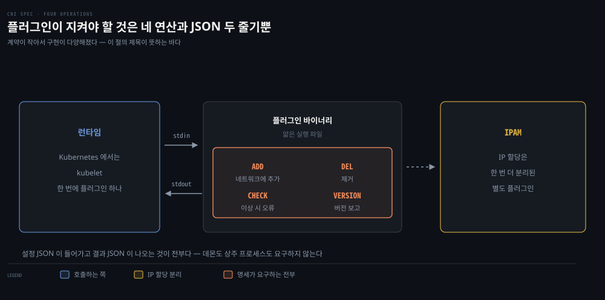
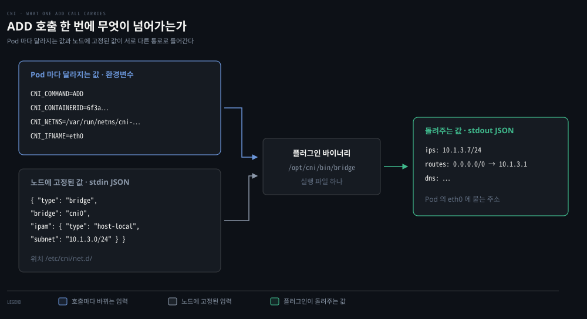
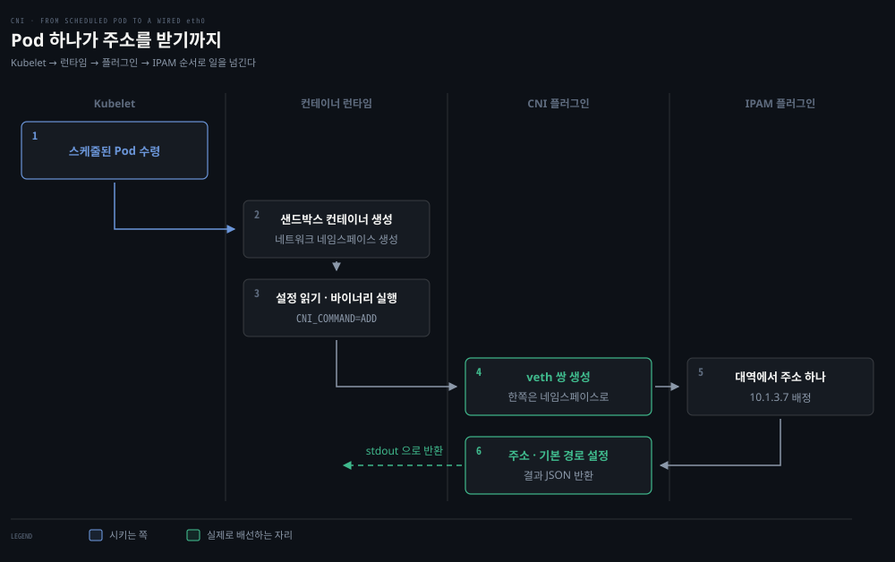
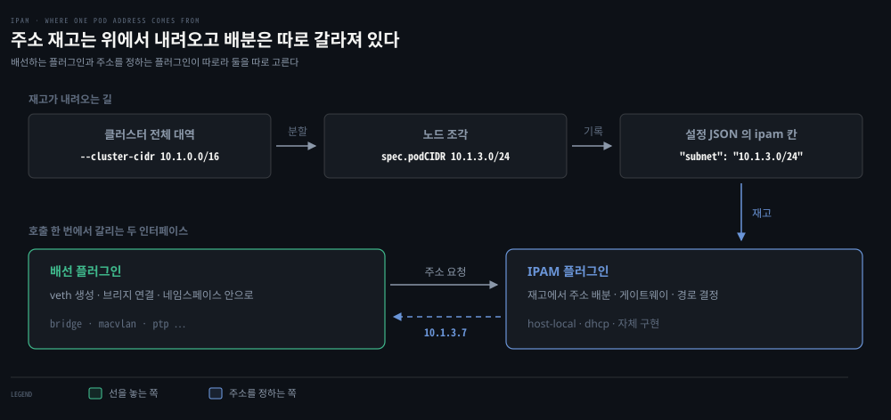
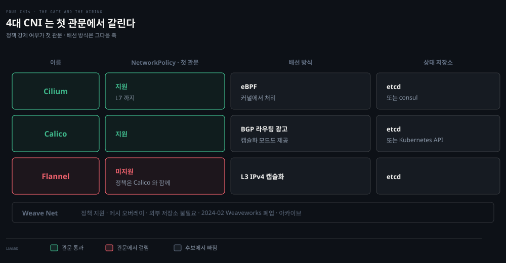
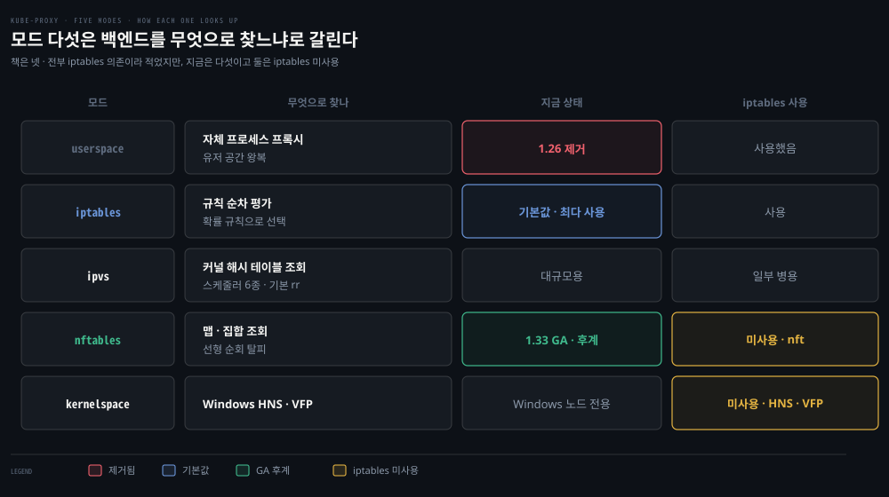
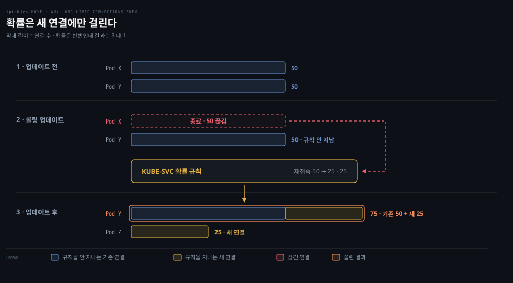

# CNI와 kube-proxy — Pod 네트워크의 배선공과 로드밸런서

---

## 핵심 요약
> 이 편 전체가 매달린 하나의 생각은 **"CNI가 Pod에 주소와 길을 주고, kube-proxy가 서비스 IP를 실제 Pod IP로 번역한다"입니다.**

CNI 명세는 놀랄 만큼 단순합니다 — 바이너리 하나가 ADD·DEL·CHECK·VERSION 네 연산을 JSON stdin/stdout으로 처리하면 끝입니다. 그 단순한 인터페이스 뒤에서 Cilium·Flannel·Calico가 전혀 다른 방식으로 경쟁하고, kube-proxy는 2장에서 배운 iptables 확률 fan-out과 IPVS를 그대로 가져와 서비스 로드밸런싱을 구현합니다.

## 학습 목표
> 두 컴포넌트가 각각 어디까지 책임지는지 선을 긋고, 그 선 위에서 서비스 트래픽을 끝까지 추적할 수 있는 상태를 목표로 합니다.

이 내용을 읽고 나면:

1. CNI 명세의 4가지 연산(`ADD`·`DEL`·`CHECK`·`VERSION`)과 실행 모델(바이너리 + JSON stdin/stdout)을 설명할 수 있습니다.
2. flat CNI와 overlay CNI의 거래를 IP 공간·직접 연결성 관점에서 비교할 수 있습니다.
3. KIND와 Helm으로 Cilium을 배포하고 구성 요소 4가지를 구분할 수 있습니다.
4. kube-proxy 모드(책 기준 4, 현재 5)의 차이와 iptables 모드의 연결 편향 문제를 사례로 설명할 수 있습니다.
5. 실제 iptables 체인(KUBE-SERVICES→KUBE-SVC→KUBE-SEP)에서 서비스 라우팅을 추적할 수 있습니다.

아래는 이 편이 다루는 두 컴포넌트를 읽는 순서로 이은 지도입니다. 앞의 세 칸이 Pod 에 주소와 길을 주는 CNI 이고, 마지막 칸이 서비스 IP 를 실제 Pod 로 번역하는 kube-proxy 입니다. 둘은 일하는 시점이 다릅니다. CNI 는 Pod 가 만들어질 때, kube-proxy 는 트래픽이 들어올 때 움직입니다. 단계 위의 이름이 본문에서 그것을 다루는 절입니다.

## 1. CNI 명세 — 인터페이스는 단순할수록 강하다
> 명세가 작아서 구현이 다양해졌습니다. 바이너리 하나가 4가지 연산을 JSON 으로 처리하면 끝이고, IP 할당은 IPAM 으로 한 번 더 분리돼 있습니다.

가운데 색이 붙은 자리가 명세가 요구하는 전부입니다. 그 밖은 구현자가 자유롭게 정합니다.

### 풀려는 문제

앞 편이 "Kubernetes 는 CNI 플러그인을 싣고 오지 않는다"로 끝났습니다. 그러니 그 자리에 무엇을 끼울지는 쓰는 쪽이 정합니다. 그런데 후보들이 서로 너무 다릅니다. 하나는 BGP 로 라우팅하고 다른 하나는 오버레이로 감싸며 또 하나는 eBPF 로 커널에서 처리합니다. 이렇게 다른 것들을 Kubernetes 는 어떻게 똑같이 다룰까요.

명세가 요구하는 것이 아주 작기 때문입니다. 무엇을 요구하지 *않는지*를 보면 구현이 왜 이만큼 갈릴 수 있었는지가 함께 설명됩니다.

CNI 플러그인이 지원해야 하는 연산은 4가지뿐입니다.

- **ADD**: 컨테이너를 네트워크에 추가
- **DEL**: 제거
- **CHECK**: 네트워크 이상 시 오류 반환
- **VERSION**: 버전 보고

Kubernetes(CNI 프로젝트 용어로는 런타임)는 플러그인 바이너리를 실행하면서 설정 JSON을 stdin으로 주고 결과 JSON을 stdout으로 받습니다. 플러그인 바이너리는 얇은 래퍼인 경우가 많고, 실제 작업은 상주 백엔드에 HTTP·RPC로 위임하기도 합니다.

### 호출 한 번에 무엇이 넘어가는가

여기서 빠뜨리기 쉬운 것이 있습니다. stdin 으로 가는 설정만으로는 플러그인이 일을 시작할 수 없습니다. 그 설정은 브리지 이름과 대역처럼 노드에 한 번 정해 두는 값이라, 지금 어느 Pod 에 붙이라는 것인지가 거기 없습니다.

그래서 입력이 두 갈래입니다.

호출마다 달라지는 값은 환경변수로 갑니다. 넷이면 충분합니다.

| 변수 | 담기는 것 |
|------|----------|
| `CNI_COMMAND` | `ADD` 인지 `DEL` 인지 |
| `CNI_CONTAINERID` | 어느 컨테이너인지 |
| `CNI_NETNS` | 그 Pod 의 네트워크 네임스페이스 경로 |
| `CNI_IFNAME` | 컨테이너 안에 만들 인터페이스 이름. 보통 `eth0` |

`CNI_NETNS` 가 이 넷 중에서 가장 중요합니다. 2장 실습에서 `ip link set veth1 netns <대상>` 을 칠 때 그 자리에 넣었던 값이 이것입니다. 이 값이 없으면 플러그인은 인터페이스를 만들어도 어디에 밀어 넣을지 모릅니다.

플러그인이 하는 일도 그 실습과 같습니다. 네임스페이스를 지정한 다음 그 안에 인터페이스를 만들고 주소와 기본 경로를 넣습니다. [02-04](./02-04.%EC%BB%A4%EB%84%90%20%EB%84%A4%ED%8A%B8%EC%9B%8C%ED%82%B9%20%EC%8B%A4%EC%8A%B5%20%E2%80%94%20veth%C2%B7%EB%B8%8C%EB%A6%AC%EC%A7%80%C2%B7%ED%8F%AC%EC%9B%8C%EB%94%A9%EC%9D%84%20%EC%86%90%EC%9C%BC%EB%A1%9C%20%EC%A7%93%EA%B8%B0.md)에서 손으로 친 명령들이 이 바이너리 안에 들어 있다고 보면 됩니다.

### Pod 하나가 주소를 받기까지

값이 어떻게 생겼는지는 봤으니 그 값이 언제 오가는지를 봅니다. Pod 를 하나 띄우면 주체 넷이 차례로 일합니다.

핵심은 Kubelet 이 배선을 직접 하지 않는다는 것입니다. 컨테이너 런타임에게 시키면 런타임이 플러그인을 실행하고 플러그인은 IPAM 에게 주소를 받아옵니다. 그래서 Pod 가 `ContainerCreating` 에서 멈췄을 때 볼 로그가 층마다 다릅니다.

도식의 2번이 순서상 중요합니다. 네임스페이스가 먼저 생겨야 플러그인에게 넘길 `CNI_NETNS` 값이 존재합니다. 그래서 배선은 컨테이너 생성 뒤에 옵니다.

### 런타임과의 접점

플러그인을 실행하는 쪽에서 정해 두는 것이 둘 있습니다. 어디서 설정을 읽고 어디서 바이너리를 찾을지입니다.

| 자리 | 기본 경로 |
|------|----------|
| 설정 JSON | `/etc/cni/net.d/` |
| 플러그인 바이너리 | `/opt/cni/bin/` |

두 경로는 `type` 한 줄로 이어집니다. 설정 JSON 안의 `"type": "cilium-cni"` 는 종류를 가리키는 이름이 아니라 **파일 이름**입니다. 런타임은 그 문자열을 바이너리 디렉토리 뒤에 붙여 `/opt/cni/bin/cilium-cni` 를 그대로 실행합니다. 등록 절차도 조회 API 도 없고, 이름이 맞는 실행 파일이 그 자리에 있으면 그만입니다. 플러그인이 라이브러리가 아니라 실행 파일이라는 말이 이 한 줄짜리 규약을 가리킵니다.

설정 파일의 확장자는 둘로 갈립니다. `.conf` 는 플러그인 하나짜리이고 `.conflist` 는 여러 개를 `plugins` 배열로 묶은 것입니다. 배열에 하나만 넣어도 conflist 를 쓸 수 있어서, 나중에 하나 더 이어 붙일 여지를 두려는 쪽은 처음부터 conflist 로 씁니다.

디렉토리에 파일이 여럿이면 런타임은 이름을 사전순으로 정렬해 **첫 번째 유효한 것 하나만** 씁니다. 나머지는 읽고 버리는 것이 아니라 아예 보지 않습니다. 숫자 접두사를 붙이는 관례가 여기서 나옵니다. CNI 를 갈아 끼울 때 옛 파일을 안 지워도 새것이 앞자리를 차지하면 새것이 이기므로, Cilium 은 `05-cilium.conflist` 를 쓰고 Calico 는 `10-calico.conflist` 를 씁니다.

책은 이 값을 Kubelet 기동 인자 `--network-plugin=cni` 로 준다고 적습니다. 그 플래그는 dockershim 과 함께 사라졌고 지금은 컨테이너 런타임 설정에서 지정합니다(§심화 학습). 관리형 클러스터와 배포판 대부분은 이미 구성된 채로 옵니다.

한 가지 제약이 더 있습니다. Kubernetes 는 한 번에 CNI 플러그인 하나만 씁니다. 명세 자체는 컨테이너에 IP 를 여러 개 주는 것을 허용하는데, Multus 가 여러 CNI 로 fan-out 하는 플러그인 노릇을 해서 이 제한을 우회합니다.

### flat 과 overlay

CNI 의 두 범주는 앞 편 레이아웃과 짝을 이룹니다. 고르는 축은 IP 를 얼마나 쓸 수 있느냐입니다.

| 범주 | 주소를 어떻게 쓰나 | 얻는 것 | 내주는 것 |
|------|-----------------|--------|----------|
| flat | 클러스터 네트워크의 IP 를 Pod 가 그대로 쓴다 | 호스트가 Pod 에 직접 닿는다. 중간 처리가 없다 | 큰 IP 공간이 필요하다 |
| overlay | 언더레이 위에 가상 네트워크를 만들어 감싼다 | 노드만 언더레이 IP 를 가지면 된다 | 호스트가 Pod 에 직접 못 닿고 캡슐화 비용이 붙는다 |

노드가 IP 를 충분히 못 받는 환경이면 overlay 가 사실상 강제됩니다. 클러스터가 사는 네트워크가 CNI 선택을 지배한다는 말이 이 뜻입니다.

### IPAM — 주소 배분은 따로 갈라져 있다

명세에는 두 번째 인터페이스가 있습니다. IPAM(IP Address Management)입니다. IP 할당 코드의 중복을 줄이려는 분리로, IPAM 플러그인이 인터페이스 IP·게이트웨이·경로를 결정해 출력합니다. 실행 모델은 CNI와 같은 JSON stdin/stdout 바이너리입니다.

이 분리 덕에 배선 방식과 주소 배분 방식을 따로 고를 수 있습니다. 가장 단순한 구현은 `host-local` 이고, 노드가 자기 몫 대역에서 하나씩 순서대로 떼어 줍니다. 그 몫이 어디서 오는지는 앞 편에서 봤습니다. `--cluster-cidr` 로 준 전체 대역을 컨트롤러가 잘라 노드의 `spec.podCIDR` 에 적어 둔 값입니다([04-01](./04-01.Kubernetes%20%EB%84%A4%ED%8A%B8%EC%9B%8C%ED%82%B9%20%EB%AA%A8%EB%8D%B8%20%E2%80%94%20Pod%20IP%C2%B7%EB%A0%88%EC%9D%B4%EC%95%84%EC%9B%83%C2%B7Probe.md) §3). Calico 나 Cilium 은 자체 IPAM 을 써서 클러스터 전체에서 조율합니다.

이 분리를 명세가 허용할 뿐 강제하지는 않습니다. Cilium 이 실제로 노드에 써 두는 conflist 에는 `ipam` 칸이 아예 없고 `plugins` 에도 `cilium-cni` 하나뿐입니다. 주소 배분을 자기 안에서 처리하기 때문입니다. 그래서 노드의 `/opt/cni/bin/` 에 `host-local` 이 함께 놓여 있어도 그 클러스터에서는 한 번도 실행되지 않습니다 — 노드 이미지가 기본으로 담고 있는 표준 플러그인일 뿐입니다.

## 2. 4대 CNI — 같은 인터페이스, 다른 철학
> 같은 인터페이스를 구현하면서도 넷이 전혀 다른 길을 갑니다. 선택의 첫 관문은 NetworkPolicy 를 강제할 수 있는가입니다.

### 풀려는 문제

명세가 작다는 말은 고를 것이 많다는 뜻이기도 합니다. 그러면 무엇을 기준으로 고를까요. 성능이나 이름값으로 정하기 쉬운데, CNI 는 클러스터를 세울 때 한 번 정하고 나면 바꾸기가 어려운 축이라 그 판단이 오래 남습니다.

저자들이 첫 관문으로 드는 기준은 하나뿐입니다. 나머지 차이는 뒤에 놓고, 그 하나부터 봅니다.

왼쪽 두 칸만 보면 후보가 셋으로 줄어듭니다. Flannel 은 네트워킹에만 집중하는 대신 정책을 강제하지 못해 첫 관문에서 걸립니다. 그래도 쓰려면 Calico 를 함께 얹어 정책만 맡깁니다.

Weave Net 은 표에서 빼도 되는 항목이 됐습니다. Weaveworks 가 2024년 2월 문을 닫아 저장소가 아카이브됐고 유지보수가 없습니다. 책이 쓰인 시점에는 유력한 후보였습니다.

남은 둘은 배선 방식으로 갈립니다. Cilium 은 eBPF 로 커널 안에서 처리하며 identity 기반으로 L7 까지 정책을 겁니다. Calico 는 BGP 로 경로를 광고하는 것이 기본이고, 노드 간 L2 인접이 안 되는 환경을 위해 캡슐화 모드도 함께 제공합니다.

NetworkPolicy 지원 여부가 선택의 관문이라는 점을 저자들이 거듭 강조합니다.

### 캡슐화와 라우팅 광고는 각각 무엇을 낸다

관문을 통과한 뒤 갈리는 축이 배선 방식입니다. 노드 A 의 Pod 가 노드 B 의 Pod 에 닿게 만드는 길이 크게 둘인데, 표의 Flannel 과 Calico 가 그 둘을 대표합니다.

캡슐화는 패킷을 한 번 더 감쌉니다. 바깥 봉투에 노드의 실주소를 적으니 중간 장비는 평범한 UDP 로 보고 옮깁니다. 대가는 봉투 크기입니다. 헤더가 50바이트쯤 붙어 Pod 의 MTU 를 1500 에서 1450 으로 낮춰야 하고, 안 낮추면 큰 패킷이 조용히 깨집니다. 감싸고 푸는 종단점을 VTEP 이라 부르며 노드마다 하나씩 있습니다. 구조는 [03-02](./03-02.%EC%BB%A8%ED%85%8C%EC%9D%B4%EB%84%88%20%EB%84%A4%ED%8A%B8%EC%9B%8C%ED%82%B9%20%EB%AA%A8%EB%93%9C%EC%99%80%20CNI%20%E2%80%94%20%EA%B2%A9%EB%A6%AC%EC%99%80%20%EC%97%B0%EA%B2%B0%EC%9D%98%20%EA%B1%B0%EB%9E%98.md) §4 가 정본입니다.

라우팅 광고는 감싸지 않습니다. 대신 밖의 장비가 "10.1.3.0/24 는 3번 노드로"를 알고 있어야 합니다. 대가는 그 장비의 협조입니다. 사내 물리 라우터라면 BGP 로 경로를 광고할 수 있어야 합니다. 클라우드라면 VPC 라우트 API 를 씁니다. Calico 가 BGP 를 기본으로 삼는 이유이고, 노드 간 L2 인접이 안 되는 환경을 위해 캡슐화 모드도 함께 제공하는 이유입니다.

정리하면 캡슐화는 남의 장비에 아무것도 요구하지 않는 대신 MTU 를 내주고, 라우팅 광고는 MTU 를 지키는 대신 남의 장비에 의존합니다. 앞 편의 레이아웃 선택과 같은 축이 CNI 층에서 다시 나오는 셈입니다.

## 3. CNI 를 갈아 끼울 수 있다는 것의 실물

> 기본 CNI 를 끄고 클러스터를 세우면 노드가 NotReady 에서 멈춰 기다립니다. 그 빈칸이 CNI 가 채우는 자리입니다.

### 풀려는 문제

"CNI 가 없으면 Pod 네트워크도 없다"는 문장은 읽기에는 쉽습니다. 그런데 관리형 클러스터나 배포판은 CNI 가 이미 깔린 채로 오기 때문에, 없는 상태를 볼 일이 없어 실감이 나지 않습니다.

직접 만들어 보면 그 장면이 나옵니다. KIND 설정에서 기본 CNI 를 끄고 클러스터를 세우면 노드가 Ready 로 넘어가지 못하고, CoreDNS 도 뜨지 못한 채 기다립니다. Cilium 을 Helm 으로 올리는 순간 그 빈칸이 채워집니다.

Cilium 이 클러스터에 심는 부품은 넷입니다.

- Agent(cilium-agent) — 각 노드에서 실행. 네트워킹·서비스 로드밸런싱·네트워크 정책·관측 요구사항을 Kubernetes API 로 받아 적용합니다
- Client(CLI) — 같은 노드의 agent REST API 와 대화합니다. 로컬 agent 상태 점검과 eBPF 맵 직접 검증 도구입니다
- Operator — 노드 단위가 아니라 클러스터 단위로 처리해야 할 관리 업무를 맡습니다
- CNI 플러그인(cilium-cni) — 노드의 Cilium API 와 상호작용해 Pod 의 네트워킹·로드밸런싱·정책 구성을 트리거합니다

설치 뒤에는 connectivity check 를 돌려 검증합니다. 다양한 연결 경로와 정책 조합을 담은 deployment 묶음이고, Pod 이름이 곧 시나리오 이름이며 readiness 와 liveness 가 성공 여부 표시기가 됩니다.

**클러스터를 세우고 확인하는 명령과 예측 질문은 [04-04](./04-04.Kubernetes%20%EB%84%A4%ED%8A%B8%EC%9B%8C%ED%81%AC%20%EC%8B%A4%EC%8A%B5%20%E2%80%94%20CNI%20%EB%B6%80%EC%9E%AC%EB%B6%80%ED%84%B0%20%EC%A0%95%EC%B1%85%C2%B7DNS%EA%B9%8C%EC%A7%80.md) §1 로 옮겼습니다.** 이 편은 CNI 명세와 kube-proxy 를 읽는 데 집중하고, 손으로 세우는 절차는 실습편이 맡습니다.

## 4. kube-proxy — 서비스라는 번역기
> ClusterIP 는 어디에도 붙어 있지 않은 가상 주소이고, 그것을 실제 Pod 로 바꾸는 일이 kube-proxy 몫입니다. 그 실체는 2장에서 본 NAT 체인 그대로입니다.

### 풀려는 문제

CNI 가 Pod 에 IP 를 줬습니다. 그런데 그 IP 는 앞 편에서 봤듯 휘발성이라 어디에도 적어 둘 수 없습니다. 그래서 Service 주소로 부르는데, 정작 그 주소는 어느 노드에서 `ip a` 를 쳐도 나오지 않습니다. 어느 인터페이스에도 붙어 있지 않은 주소로 통신이 되는 셈입니다.

중간에서 그 주소를 실제 Pod 주소로 바꿔 주는 것이 있기 때문입니다. 그 일을 누가 어떤 방식으로 하는지가 이 절이고, 실체를 벗겨 보면 2장에서 읽은 것이 그대로 나옵니다.

### kube-proxy 는 어디에 사는가

kube-proxy는 노드마다 하나씩 도는 컴포넌트로 클러스터 안 기본 로드밸런싱을 제공합니다. 다만 Kubelet 과 배포 방식이 다릅니다 — Kubelet 은 노드의 systemd 데몬이고 kube-proxy 는 보통 **DaemonSet Pod** 입니다. 업그레이드·재시작 경로가 갈리는 지점입니다.

### 명단은 누가 만드나

서비스는 Pod 집합에 대한 로드밸런서를 정의하고, Endpoints/EndpointSlices는 준비된 Pod IP 목록입니다. 생성 주체는 서비스 자신이 아니라 **kube-controller-manager 의 컨트롤러**입니다. Endpoints 는 endpoints 컨트롤러가, EndpointSlice 는 EndpointSlice 컨트롤러가 만듭니다. 서비스의 셀렉터는 그 컨트롤러가 보는 입력일 뿐입니다.

또 현대 버전의 kube-proxy 가 실제로 watch 하는 것은 **EndpointSlice** 입니다. Endpoints 는 1.33 에서 deprecated 됐고, 슬라이스는 기본 100개 엔드포인트 단위로 쪼개집니다.

이 watch 가 규칙을 다시 쓰게 만드는 방아쇠입니다. Pod 하나가 readiness 를 잃으면 그 변화가 컨트롤러를 거쳐 슬라이스에 적히고, 각 노드의 kube-proxy 가 그것을 받아 체인에서 그 Pod 줄을 뺍니다. 전파 경로 전체는 [04-01](./04-01.Kubernetes%20%EB%84%A4%ED%8A%B8%EC%9B%8C%ED%82%B9%20%EB%AA%A8%EB%8D%B8%20%E2%80%94%20Pod%20IP%C2%B7%EB%A0%88%EC%9D%B4%EC%95%84%EC%9B%83%C2%B7Probe.md) §5 에 그려 두었습니다.

대부분의 서비스 유형은 ClusterIP라는 가상 IP를 갖습니다. 이 주소는 클러스터 밖에서는 보통 라우팅되지 않습니다. 그 ClusterIP로 온 요청을 건강한 Pod로 넘기는 것이 kube-proxy의 일입니다.

### 모드 다섯

번역 방식은 하나가 아닙니다. 여기서 말하는 모드는 **kube-proxy 자신의 실행 모드**입니다. 기동 인자 `--proxy-mode` 로 고르고, 고른 값에 따라 kube-proxy 가 노드에 심는 것이 달라집니다. iptables 규칙을 심을 수도 있고 IPVS 항목을 만들 수도 있습니다.

책은 넷을 들고 "전부 어느 정도 iptables 에 의존한다"고 정리하는데 둘 다 지금은 맞지 않습니다.

**원문 정오**: 모드는 다섯입니다. nftables 가 1.33 GA 로 합류했습니다. 그리고 `kernelspace` 와 `nftables` 는 iptables 를 쓰지 않습니다. 앞은 Windows 의 HNS·VFP 를, 뒤는 nft 를 씁니다. "전부 iptables 에 의존"이 성립하는 것은 userspace·iptables·ipvs 세 모드까지입니다.

버전 이력만 도식 밖에 남깁니다. userspace 는 1.23 에서 deprecated 되고 1.26 에서 아예 제거돼, 지원되는 클러스터에서는 선택지가 아닙니다. nftables 는 1.29 alpha 에서 1.31 beta 를 거쳐 1.33 에서 GA 가 됐습니다.

여기서 GA 는 General Availability 의 줄임으로 정식 제공을 뜻합니다. Kubernetes 기능은 Alpha 에서 실험으로 시작해 Beta 에서 검증을 거쳐 GA 에 이릅니다.

| 단계 | 뜻 | 쓸 수 있나 |
|------|----|----------|
| Alpha | 실험 단계. 이름이나 동작이 바뀌거나 사라질 수 있다 | 기능 게이트로 직접 켜야 하고 프로덕션에는 권하지 않는다 |
| Beta | 널리 검증받는 단계. 세부는 아직 바뀔 수 있다 | 쓸 수 있으나 다음 버전에서 설정이 달라질 수 있다 |
| GA | 정식 제공. Stable 이라고도 부른다 | 기본으로 지원되고 이후 버전에서도 유지된다 |

그래서 nftables 모드는 이제 실험이 아니라 프로덕션에서 골라 써도 되는 선택지입니다([용어집](./00-01.%EC%9A%A9%EC%96%B4%EC%A7%91.md)). IPVS 의 스케줄러 6종은 rr·lc·dh·sh·sed·nq 이고 기본이 rr 입니다. 세 기술의 내부 차이는 [02-02](./02-02.iptables%C2%B7IPVS%C2%B7eBPF%20%E2%80%94%20kube-proxy%EB%A5%BC%20%EC%9D%B4%ED%95%B4%ED%95%98%EB%8A%94%20%EC%84%B8%20%EA%B8%B0%EC%88%A0.md)가 정본입니다.

### 연결 단위 fan-out 의 함정

iptables 모드의 함정은 연결 단위라는 데 있습니다. 연결이 맺어지면 그 연결의 모든 요청은 종료까지 같은 Pod 로 갑니다. 캐시 지역성 관점에서는 장점이지만 장수 연결에서는 편향을 만듭니다. HTTP/2 위에서 도는 gRPC 가 대표적입니다.

도식을 세 단으로 따라가면 쏠림이 어디서 생기는지 보입니다.

1. 1단은 Pod X 와 Y 가 연결을 50 씩 쥔 상태입니다. 
2. 2단에서 X 가 내려가고 그 50 이 끊깁니다. 끊긴 연결은 다시 붙으면서 확률 규칙을 지나고, 남은 백엔드 둘로 25 씩 나뉩니다.
   - Y 쪽 점선이 이 도식의 요점입니다. **Y 가 쥐고 있던 50 은 규칙을 다시 지나지 않습니다.** 이미 맺어진 연결이라 그대로 살아 있습니다. 
3. 그래서 3단에서 Y 는 기존 50 에 새 25 를 더해 75 를 갖고 Z 는 25 만 갖습니다. 막대 길이가 그 차이입니다.

쏠림을 만든 것은 확률이 아닙니다. 확률은 새 연결 50 을 정확히 반씩 나눴습니다. 원인은 기존 연결이 규칙을 건너뛴다는 성질이고, 그래서 모드를 IPVS 로 바꿔도 사라지지 않습니다. 요청 하나하나를 나누려면 L7 로 올라가 서비스 메시나 클라이언트 쪽 로드밸런싱을 써야 합니다.

### 서비스 하나가 체인 셋으로 번역된다

이 절의 관심은 규칙이 어떻게 평가되는가가 아니라 **서비스라는 오브젝트가 무엇으로 번역되는가**입니다. 규칙 평가와 확률 계산은 [02-02](./02-02.iptables%C2%B7IPVS%C2%B7eBPF%20%E2%80%94%20kube-proxy%EB%A5%BC%20%EC%9D%B4%ED%95%B4%ED%95%98%EB%8A%94%20%EC%84%B8%20%EA%B8%B0%EC%88%A0.md) §3 이 정본이라 여기서 되풀이하지 않습니다.

kube-dns 서비스로 보면 오브젝트 하나가 체인 셋으로 내려앉습니다.

| 층 | 체인 | 하는 일 |
|----|------|--------|
| 진입 | `KUBE-SERVICES` | 목적지가 어느 서비스의 ClusterIP 인지 가른다 |
| 서비스 | `KUBE-SVC-…` | 확률 규칙으로 백엔드 하나를 고른다 |
| 엔드포인트 | `KUBE-SEP-…` | 목적지를 실제 Pod IP 로 바꾼다 |

- 확률을 붙이는 것은 iptables 의 `statistic` 매치 모듈입니다. 규칙에는 `-m statistic --mode random --probability 0.25` 같은 모양으로 박힙니다.
- 서비스를 하나 만들면 이 셋이 노드마다 생기고, 엔드포인트가 늘면 세 번째 층의 줄이 늘어납니다. 그래서 서비스 연결성이나 성능을 디버깅할 때 2장의 라우팅 지식이 그대로 쓰입니다.

### 규모가 커지면 무엇이 먼저 무너지는가

이 구조를 알면 한계도 계산됩니다. 규칙 수가 클러스터의 오브젝트 수를 그대로 따라가기 때문입니다.

서비스가 5천 개이고 각 서비스 뒤에 Pod 가 10개씩 붙어 있다고 해 봅시다. 최상위 체인에 서비스마다 한 줄씩 5천 줄이 있고, 각 서비스 체인 안에 백엔드마다 한 줄씩 있으니 엔드포인트 줄만 5만 개입니다.

무너지는 곳이 둘인데 조회 쪽이 먼저 눈에 띕니다. 규칙은 앞에서부터 순서대로 평가되므로 뒤쪽 서비스일수록 더 많은 판정을 거칩니다.

더 아픈 쪽은 갱신입니다. 규칙 한 줄만 바꾸려 해도 테이블을 통째로 다시 쓰는 구조라, Pod 가 하나 죽고 뜰 때마다 수만 줄이 재작성됩니다. 클러스터가 크면 이 재작성에 시간이 걸리고, 그동안 규칙에 적힌 명단과 실제 Pod 상태가 어긋납니다. 이미 사라진 Pod 로 트래픽이 계속 가는 구간이 생기는 것입니다.

그래서 대안이 나왔습니다. IPVS 는 커널 해시 테이블을 써서 조회 비용이 백엔드 수에 덜 끌려가고 갱신도 항목 단위로 합니다. nftables 는 같은 문제를 iptables 의 후계 문법으로 풉니다. Cilium 은 eBPF 맵으로 처리하며 kube-proxy 자체를 대체합니다. 세 기술의 내부 차이와 수치는 [02-02](./02-02.iptables%C2%B7IPVS%C2%B7eBPF%20%E2%80%94%20kube-proxy%EB%A5%BC%20%EC%9D%B4%ED%95%B4%ED%95%98%EB%8A%94%20%EC%84%B8%20%EA%B8%B0%EC%88%A0.md)가 정본이라 여기서 되풀이하지 않습니다.

### 그런데 왜 iptables 가 여전히 기본값인가

문제를 알고 나면 곧 드는 물음입니다. 더 나은 것이 둘이나 있는데 왜 안 바꿀까요. 이유가 셋입니다.

**대부분의 클러스터에서 문제가 안 됩니다.** 선형 평가와 전체 재작성이 아픈 것은 서비스가 수천 개일 때입니다. 수십에서 수백 개짜리 클러스터에서는 재작성이 짧게 끝나 체감되지 않습니다. 기본값은 문제를 겪는 소수가 아니라 다수에 맞춥니다.

**어디서나 돕니다.** IPVS 모드는 `ip_vs` 계열 커널 모듈이 로드돼 있어야 하고, 없으면 kube-proxy 가 iptables 모드로 되돌아갑니다. nftables 모드는 클러스터가 1.33 이상이어야 하고 노드의 nft 도구도 받쳐 줘야 합니다. iptables 에는 그런 전제가 없습니다.

**바꿔도 안 풀리는 문제가 있습니다.** 앞 절의 쏠림이 그렇습니다. 연결 단위로 나눈다는 성질은 IPVS 도 같아서, 모드를 옮겨도 그대로 남습니다.

셋을 나란히 놓으면 이렇습니다.

| 축 | iptables | ipvs | nftables |
|----|---------|------|----------|
| 조회 | 앞에서부터 순서대로 | 커널 해시 테이블 | 맵과 집합 |
| 갱신 | 테이블 전체 재작성 | 항목 단위 | 증분 |
| 쓰려면 필요한 것 | 없다 | `ip_vs` 커널 모듈 | 1.33 이상 |
| iptables 를 여전히 쓰나 | 그렇다 | 일부 쓴다. masquerade 와 필터링은 iptables·ipset | 아니다 |
| 연결 단위 쏠림 | 있다 | 있다 | 있다 |

마지막 두 행이 중요합니다. IPVS 로 옮겨도 iptables 가 사라지지 않아 두 스택을 다 알아야 합니다. 쏠림은 어느 모드로도 안 풀립니다. 그래서 모드 교체는 **규칙 갱신이 실제로 느려졌을 때** 꺼내는 카드이고, 쏠림이 문제라면 L7 로 올라가는 것이 답입니다. 어느 상황에 무엇을 고를지는 아래 결정 치트시트에 정리했습니다.

> 💬 **비유**: CNI와 kube-proxy는 신도시의 두 직군입니다. CNI는 배선공입니다 — 새 집(Pod)이 들어서면 주소를 부여하고 도로(라우팅)를 연결하며, 집이 철거되면 회수합니다. 
>
> kube-proxy는 대표번호 교환원입니다 — "고객센터(ClusterIP)로 전화 주세요"라고 알린 뒤, 걸려온 전화를 지금 근무 중인 상담원(ready Pod) 중 하나에게 배분합니다. 교환원의 배분 방식이 절차 규정집(iptables 확률 규칙)이냐 전담 교환기(IPVS)냐가 모드 선택입니다.

## 심화 학습
> 책 밖에서 보강한 내용입니다. 출처를 함께 남깁니다.

- 책이 예고한 CNI 명세 1.0은 2021년 8월(v1.0.0, 2021-08-04)에 실제로 릴리스됐고 현재 정본은 [cni.dev의 spec 문서](https://www.cni.dev/docs/spec/)입니다. 연산에 GC·STATUS가 추가된 1.1(2022-04)도 뒤따랐습니다 — "4연산"은 책 시점(0.4) 기준으로 읽어야 합니다.
- Kubelet의 `--network-plugin=cni` 플래그는 dockershim과 함께 사라진 옵션입니다. dockershim 제거(1.24) 이후 CNI 구동은 컨테이너 런타임(containerd·CRI-O)의 책임이 됐습니다. 설정 경로(`/etc/cni/net.d`)는 런타임 설정에서 지정합니다 — [containerd CRI 문서](https://github.com/containerd/containerd/blob/main/docs/cri/config.md) 참조. 책의 서술은 dockershim 시대의 배선입니다.
- kube-proxy 자체의 최신 지형은 이 폴더 [02-02 심화 학습](./02-02.iptables%C2%B7IPVS%C2%B7eBPF%20%E2%80%94%20kube-proxy%EB%A5%BC%20%EC%9D%B4%ED%95%B4%ED%95%98%EB%8A%94%20%EC%84%B8%20%EA%B8%B0%EC%88%A0.md)에서 정리했습니다 — nftables 모드가 1.33에서 GA로 합류해, 이 편의 "4모드"는 이제 5모드로 읽는 것이 정확합니다.

## 결정 치트시트
> kube-proxy 모드 선택 기준입니다. CNI 선택은 03-02·02-02 치트시트와 겹치므로 그쪽에 위임합니다.

| 상황 | 모드 | 근거 |
|------|------|------|
| 일반 규모, 검증된 기본값 선호 | iptables | 기본값, 자료 최다 — 단 fan-out의 연결 편향 인지 필요 |
| 서비스 수천 개, 규칙 갱신 지연 체감 | ipvs | 해시 조회 + 스케줄러 6종 |
| Windows 노드 | kernelspace | HNS·VFP 기반 — Linux 전용 기술(iptables·IPVS)을 쓰지 않음 |
| iptables 규칙 갱신 병목 + 1.33 이상 | nftables | 1.33 GA. 선형 순회를 벗어난 iptables 모드의 후계 |
| 장수 연결(gRPC) 편향이 실제 문제 | 모드 교체로는 해결 안 됨 | L7 밸런싱(서비스 메시·클라이언트 LB)로 접근 |
| legacy userspace를 물려받음 | 이전 필수 | 1.26 에서 제거됨 — 권고가 아니라 선택 불가 |

## 면접에서 받을 만한 질문
> 답을 가리고 스스로 말해 본 뒤, 아래 정답 절에서 맞춰 봅니다.

1. kube-proxy를 "한 줄"로 정의한다면?
2. CNI 명세가 "단순하다"는 것을 4연산·실행 모델로 설명해 보세요. IPAM은 무엇인가요?
3. flat CNI와 overlay CNI의 거래는?
4. iptables 모드가 "로드밸런싱이 아니라 연결 fan-out"이라는 말의 의미는? 확률 규칙은 어떻게 균등해지나요?
5. ClusterIP에 ping이 안 가는데 서비스는 정상입니다. 왜죠?
6. 클러스터 노드가 전부 NotReady인데 원인이 뭘까요?
7. 서비스 뒤 Pod 하나로만 트래픽이 쏠립니다. kube-proxy 버그인가요?

## 정답 (자답 후 펼치기)
> 위 §면접에서 받을 만한 질문에 *먼저 자답한 뒤* 아래를 읽으세요. 자답 없이 먼저 읽으면 학습 효과가 0입니다.

### 1. kube-proxy 한 줄 정의
"kube-proxy란 노드마다 돌며 서비스의 ClusterIP로 온 트래픽을 EndpointSlice(구 Endpoints)의 준비된 Pod IP로 번역(DNAT)하는 데몬으로, iptables 확률 체인 또는 IPVS로 fan-out을 구현합니다."

### 2. CNI의 단순함과 IPAM
CNI 명세는 4연산(ADD·DEL·CHECK·VERSION)·JSON stdin/stdout 바이너리라는 최소 인터페이스입니다. IP 할당은 IPAM(IP Address Management) 인터페이스로 다시 분리돼 있어, 인터페이스 IP·게이트웨이·경로를 결정하는 코드 중복을 줄입니다. 실행 모델은 CNI와 같은 JSON 바이너리입니다.

### 3. flat vs overlay CNI
"IP 공간을 크게 쓸 것인가, 캡슐화 비용과 직접 연결성 포기를 감수할 것인가"의 거래입니다. flat은 클러스터 IP를 그대로 써 IP가 많이 필요하고, overlay는 언더레이 위에 가상망을 만들어 노드만 언더레이 IP를 가지면 되지만 호스트가 Pod에 직접 연결할 수 없습니다.

### 4. iptables fan-out과 확률 균등
iptables 모드는 진짜 로드밸런싱이 아니라 연결 단위 fan-out입니다. KUBE-SVC 체인의 확률 규칙(1/남은 수)으로 연결을 나누고, 연결이 살아 있는 동안 백엔드가 고정됩니다. 각 규칙이 "앞에서 안 걸린 연결"에만 적용되므로 0.25→0.33→0.5→나머지가 결과적으로 균등해집니다.

### 5. ClusterIP에 ping이 안 되는 이유
ClusterIP는 인터페이스에 붙은 실제 주소가 아니라 iptables/IPVS 규칙 속에만 존재하는 가상 IP이기 때문입니다. 규칙은 서비스의 프로토콜·포트에만 매칭되므로 ICMP는 처리 대상이 아닙니다 — 2장의 "K8s Service에 ping 불가"가 여기서 다시 확인됩니다.

### 6. 전 노드 NotReady의 원인
CNI가 아직 배포되지 않았거나 죽었을 가능성부터 봅니다. Kubernetes는 기본 CNI 없이 출하되므로, KIND에서 disableDefaultCNI를 켠 직후처럼 CNI 부재 상태의 노드는 NotReady가 정상입니다.

### 7. 한 Pod 쏠림 — 버그인가
대부분 아닙니다. iptables 모드는 연결 단위 fan-out이라, 장수 연결(gRPC·HTTP/2)이 있으면 스케일아웃·롤링 업데이트 후 기존 연결을 쥔 Pod로 쏠림이 생깁니다. 확률 규칙(0.25→0.33→0.5→전부)도 "앞에서 안 걸린 연결" 기준이라 오해하기 쉽지만 수학적으로 균등합니다.

## 핵심 개념 체크리스트
> 여섯 항목을 막힘없이 답할 수 있으면 다음 편으로 넘어가도 좋습니다.
- [ ] CNI 4연산과 실행 모델을 말할 수 있는가?
- [ ] flat/overlay CNI의 거래를 언더레이 개념과 함께 설명할 수 있는가?
- [ ] Cilium 4부품(agent·CLI·operator·cni)의 책임을 구분할 수 있는가?
- [ ] KUBE-SERVICES→KUBE-SVC→KUBE-SEP 체인 추적을 재구성할 수 있는가?
- [ ] iptables 모드의 롤링 업데이트 편향 시나리오(X·Y→Z)를 설명할 수 있는가?
- [ ] ipvs 모드 스케줄러 6종 중 기본값(rr)을 아는가?
- [ ] kube-proxy 모드가 책 기준 4개에서 현재 5개(nftables 1.33 GA)로 늘었고, userspace 는 1.26 에서 제거됐음을 아는가?

## 참고 자료
- 《Networking and Kubernetes: A Layered Approach》(James Strong·Vallery Lancey, O'Reilly, 2021, ISBN 978-1492081654) Ch4
- [CNI 명세](https://www.cni.dev/docs/spec/)
- [Cilium 공식 문서](https://docs.cilium.io/)
- [K8s 문서 — 가상 IP와 서비스 프록시](https://kubernetes.io/docs/reference/networking/virtual-ips/)
- 이전 편: [04-01. Kubernetes 네트워킹 모델](./04-01.Kubernetes%20%EB%84%A4%ED%8A%B8%EC%9B%8C%ED%82%B9%20%EB%AA%A8%EB%8D%B8%20%E2%80%94%20Pod%20IP%C2%B7%EB%A0%88%EC%9D%B4%EC%95%84%EC%9B%83%C2%B7Probe.md)
- 다음 편: [04-03. NetworkPolicy와 DNS](./04-03.NetworkPolicy%EC%99%80%20DNS%20%E2%80%94%20%ED%81%B4%EB%9F%AC%EC%8A%A4%ED%84%B0%20%EC%95%88%EC%9D%98%20%EB%B0%A9%ED%99%94%EB%B2%BD%EA%B3%BC%20%EC%9D%B4%EB%A6%84.md)
