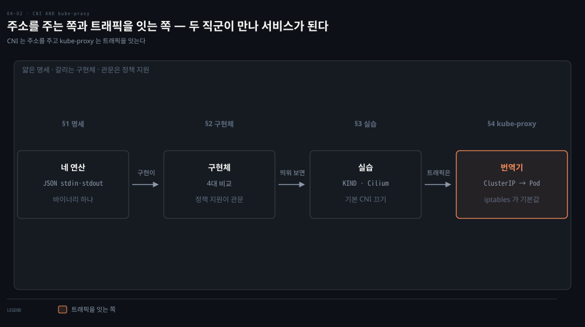
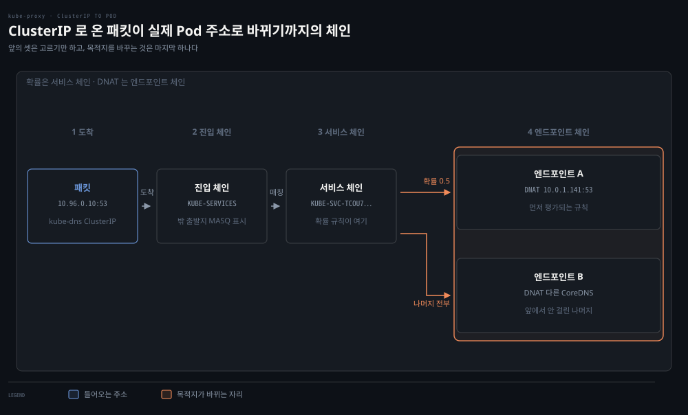

# CNI와 kube-proxy — Pod 네트워크의 배선공과 로드밸런서

## 핵심 요약
> 이 편 전체가 매달린 하나의 생각은 "CNI가 Pod에 주소와 길을 주고, kube-proxy가 서비스 IP를 실제 Pod IP로 번역한다"입니다.
> CNI 명세는 놀랄 만큼 단순합니다 — 바이너리 하나가 ADD·DEL·CHECK·VERSION 네 연산을 JSON stdin/stdout으로 처리하면 끝입니다. 그 단순한 인터페이스 뒤에서 Cilium·Flannel·Calico가 전혀 다른 방식으로 경쟁하고, kube-proxy는 2장에서 배운 iptables 확률 fan-out과 IPVS를 그대로 가져와 서비스 로드밸런싱을 구현합니다.


## 학습 목표
> 두 컴포넌트가 각각 어디까지 책임지는지 선을 긋고, 그 선 위에서 서비스 트래픽을 끝까지 추적할 수 있는 상태를 목표로 합니다.

이 내용을 읽고 나면:

1. CNI 명세의 4연산과 실행 모델(바이너리 + JSON stdin/stdout)을 설명할 수 있습니다.
2. flat CNI와 overlay CNI의 거래를 IP 공간·직접 연결성 관점에서 비교할 수 있습니다.
3. KIND와 Helm으로 Cilium을 배포하고 구성 요소 4가지를 구분할 수 있습니다.
4. kube-proxy 4모드의 차이와 iptables 모드의 연결 편향 문제를 사례로 설명할 수 있습니다.
5. 실제 iptables 체인(KUBE-SERVICES→KUBE-SVC→KUBE-SEP)에서 서비스 라우팅을 추적할 수 있습니다.

아래는 이 편이 다루는 두 컴포넌트를 읽는 순서로 이은 지도입니다. 앞의 세 칸이 Pod 에 주소와 길을 주는 CNI 이고, 마지막 칸이 서비스 IP 를 실제 Pod 로 번역하는 kube-proxy 입니다. 둘은 일하는 시점이 다릅니다. CNI 는 Pod 가 만들어질 때, kube-proxy 는 트래픽이 들어올 때 움직입니다. 단계 위의 이름이 본문에서 그것을 다루는 절입니다.




## 1. CNI 명세 — 인터페이스는 단순할수록 강하다
> 명세가 작아서 구현이 다양해졌습니다. 바이너리 하나가 네 연산을 JSON 으로 처리하면 끝이고, IP 할당은 IPAM 으로 한 번 더 분리돼 있습니다.

CNI 플러그인이 지원해야 하는 연산은 넷뿐입니다.

- **ADD** — 컨테이너를 네트워크에 추가
- **DEL** — 제거
- **CHECK** — 네트워크 이상 시 오류 반환
- **VERSION** — 버전 보고

Kubernetes(CNI 프로젝트 용어로는 런타임)는 플러그인 바이너리를 실행하면서 설정 JSON을 stdin으로 주고 결과 JSON을 stdout으로 받습니다. 플러그인 바이너리는 얇은 래퍼인 경우가 많고, 실제 작업은 상주 백엔드에 HTTP·RPC로 위임하기도 합니다.

Kubernetes는 한 번에 CNI 플러그인 하나만 씁니다. 명세 자체는 멀티 플러그인(컨테이너에 IP 여러 개)을 허용하는데, Multus가 여러 CNI로 fan-out하는 플러그인으로 이 제한을 우회합니다. 책 시점의 명세 버전은 0.4였고 1.0이 곧 나올 예정이라 적혀 있습니다.

Kubelet과의 접점은 설정입니다 — Kubelet 기동 인자에 `--network-plugin=cni`를 주면, 기본적으로 `/etc/cni/net.d/`에서 CNI 설정을 읽고 `/opt/cni/bin/`에서 바이너리를 찾습니다. 관리형 Kubernetes와 배포판 대부분은 CNI가 미리 구성돼 옵니다.

CNI의 두 범주는 앞 편 레이아웃과 짝을 이룹니다. flat 네트워크 CNI는 클러스터 네트워크의 IP를 그대로 쓰므로 IP가 많이 필요합니다. overlay CNI는 클러스터 네트워크(언더레이) 위에 가상 네트워크를 만들어 패킷을 캡슐화합니다. 호스트가 Pod에 직접 연결할 수 없게 되는 대신, 노드만 언더레이 IP를 가지면 되므로 네트워크가 훨씬 작아도 됩니다. 노드가 IP를 충분히 못 받는 환경이면 overlay가 강제되는 식으로, 클러스터가 사는 네트워크가 CNI 선택을 지배합니다.

명세에는 두 번째 인터페이스가 있습니다 — IPAM(IP Address Management)입니다. IP 할당 코드의 중복을 줄이려는 분리로, IPAM 플러그인이 인터페이스 IP·게이트웨이·경로를 결정해 출력합니다. 실행 모델은 CNI와 같은 JSON stdin/stdout 바이너리입니다.


## 2. 4대 CNI — 같은 인터페이스, 다른 철학
> 같은 인터페이스를 구현하면서도 넷이 전혀 다른 길을 갑니다. 선택의 첫 관문은 NetworkPolicy 를 강제할 수 있는가입니다.

| 이름 | NetworkPolicy | 상태 저장 | 네트워크 방식 |
|------|--------------|----------|--------------|
| Cilium | 지원 | etcd 또는 consul | veth·IPvlan(베타), eBPF 기반 L7 인지 |
| Flannel | 미지원 | etcd | L3 IPv4 오버레이 |
| Calico | 지원 | etcd 또는 Kubernetes API | BGP 기반 L3 (오버레이 없음) |
| Weave Net | 지원 | 외부 저장소 불필요 | 메시 오버레이 |

성격은 3장에서 본 그대로입니다.

- **Cilium**: eBPF 로 L3~L7 정책을 identity 기반으로 강제합니다.
- **Flannel**: 네트워킹에만 집중합니다. 정책이 필요하면 다른 CNI(예: Calico)를 함께 써야 합니다.
- **Calico**: 캡슐화 대신 BGP 라우팅으로 갑니다.

NetworkPolicy 지원 여부가 선택의 관문이라는 점을 저자들이 거듭 강조합니다.


## 3. 실습 — KIND 위에 Cilium 배포
> 기본 CNI 를 끄고 시작하는 것이 요령입니다. Cilium 이 올라오기 전까지 노드가 NotReady 로 남는 장면이 앞 편의 "CNI 없으면 네트워크 없음"을 눈으로 보여 줍니다.

책의 실습 트랙은 KIND(Kubernetes in Docker)로 로컬 클러스터를 만들고 Helm으로 Cilium을 얹는 흐름입니다. 요령은 KIND 설정에서 기본 CNI를 끄는 데 있습니다.

```yaml
kind: Cluster
apiVersion: kind.x-k8s.io/v1alpha4
nodes:
- role: control-plane
- role: worker
- role: worker
- role: worker
networking:
  disableDefaultCNI: true    # 기본 CNI를 꺼야 Cilium을 올릴 수 있다
```

`kind create cluster --config=kind-config.yaml`로 클러스터를 만들면, Cilium이 네트워크를 깔기 전까지 노드가 NotReady로 남는 것이 정상입니다. 앞 편의 "CNI 없으면 Pod 네트워크 없음"이 눈으로 보이는 순간입니다. 이후 `helm repo add cilium https://helm.cilium.io/` → `helm install cilium cilium/cilium --namespace kube-system`으로 설치합니다.

Cilium이 클러스터에 심는 부품은 넷입니다.

- Agent(cilium-agent) — 각 노드에서 실행. 네트워킹·서비스 로드밸런싱·네트워크 정책·관측 요구사항을 Kubernetes API로 받아 적용
- Client(CLI) — agent와 같은 노드의 REST API와 대화. 로컬 agent 상태 점검과 eBPF 맵 직접 검증 도구
- Operator — 노드 단위가 아니라 클러스터 단위로 처리해야 할 관리 업무 담당
- CNI 플러그인(cilium-cni) — 노드의 Cilium API와 상호작용해 Pod의 네트워킹·로드밸런싱·정책 구성을 트리거

설치 후 connectivity check(다양한 연결 경로·정책 조합의 deployment 묶음)를 돌려 검증하며, Pod 이름이 곧 시나리오 이름이고 readiness·liveness가 성공 여부 표시기가 됩니다.


## 4. kube-proxy — 서비스라는 번역기
> ClusterIP 는 어디에도 붙어 있지 않은 가상 주소이고, 그것을 실제 Pod 로 바꾸는 일이 kube-proxy 몫입니다. 그 실체는 2장에서 본 NAT 체인 그대로입니다.

kube-proxy는 Kubelet처럼 노드마다 도는 데몬으로, 클러스터 안 기본 로드밸런싱을 제공합니다. 서비스는 Pod 집합에 대한 로드밸런서를 정의하고, Endpoints/EndpointSlices는 준비된 Pod IP 목록입니다(서비스와 같은 셀렉터로 자동 생성).

대부분의 서비스 유형은 ClusterIP라는 가상 IP를 갖는데 클러스터 밖에서는 보통 라우팅되지 않으며, 그 ClusterIP로 온 요청을 건강한 Pod로 넘기는 것이 kube-proxy의 일입니다. 모드는 넷이고 전부 어느 정도는 iptables에 의존합니다.

- userspace — 최초의 모드. iptables로 서비스 IP를 자체 웹 서버로 몰아 프록시. 이제는 쓸 이유가 없으면 피하라는 권고
- iptables — 기본값이자 최다 사용. 진짜 로드밸런싱이 아니라 연결 fan-out
- ipvs — IPVS로 연결 로드밸런싱. 스케줄러 6종(rr·lc·dh·sh·sed·nq, 기본 rr)
- kernelspace — Windows 전용 최신 모드 (iptables·IPVS는 Linux 전용이므로)

iptables 모드의 함정은 연결 단위라는 데 있습니다. 연결이 맺어지면 그 연결의 모든 요청은 종료까지 같은 Pod로 갑니다. 캐시 지역성 관점에서는 장점이지만 장수 연결(HTTP/2, 즉 gRPC)에서는 편향을 만듭니다 — 원문의 시나리오가 정확합니다. Pod X·Y가 서빙 중인데 롤링 업데이트로 X가 Z로 교체되면, Y는 기존 연결 전부에 더해 X가 끊기며 재수립된 연결의 절반까지 받아 트래픽이 크게 쏠립니다.

확률 계산도 2장에서 본 그대로입니다. 건강한 백엔드가 4개면 순차 규칙의 확률은 25% → 33.3% → 50% → 나머지 전부입니다. 각 규칙은 앞 규칙에서 라우팅되지 않은 연결에만 적용되므로 결과적으로 균등해집니다(확률 = 1/남은 IP 수). kube-proxy가 실제로 만드는 체인을 kube-dns 서비스(ClusterIP 10.96.0.10)로 추적하면 구조가 보입니다.



KUBE-SERVICES에서 서비스별 KUBE-SVC 체인으로, 거기서 확률 규칙을 거쳐 엔드포인트별 KUBE-SEP 체인의 DNAT로 — 서비스 추상화의 실체는 결국 2장의 NAT 테이블 체인입니다. 서비스 연결성·성능 디버깅에 2장의 라우팅 내용이 그대로 쓰이는 이유입니다.

> 💬 **비유**: CNI와 kube-proxy는 신도시의 두 직군입니다. CNI는 배선공입니다 — 새 집(Pod)이 들어서면 주소를 부여하고 도로(라우팅)를 연결하며, 집이 철거되면 회수합니다. kube-proxy는 대표번호 교환원입니다 — "고객센터(ClusterIP)로 전화 주세요"라고 알린 뒤, 걸려온 전화를 지금 근무 중인 상담원(ready Pod) 중 하나에게 배분합니다. 교환원의 배분 방식이 절차 규정집(iptables 확률 규칙)이냐 전담 교환기(IPVS)냐가 모드 선택입니다.


## 심화 학습
> 책 밖에서 보강한 내용입니다. 출처를 함께 남깁니다.

- 책이 예고한 CNI 명세 1.0은 2021년 8월(v1.0.0, 2021-08-04)에 실제로 릴리스됐고 현재 정본은 [cni.dev의 spec 문서](https://www.cni.dev/docs/spec/)입니다. 연산에 GC·STATUS가 추가된 1.1(2022-04)도 뒤따랐습니다 — "4연산"은 책 시점(0.4) 기준으로 읽어야 합니다.
- Kubelet의 `--network-plugin=cni` 플래그는 dockershim과 함께 사라진 옵션입니다. dockershim 제거(1.24) 이후 CNI 구동은 컨테이너 런타임(containerd·CRI-O)의 책임이 됐습니다. 설정 경로(`/etc/cni/net.d`)는 런타임 설정에서 지정합니다 — [containerd CRI 문서](https://github.com/containerd/containerd/blob/main/docs/cri/config.md) 참조. 책의 서술은 dockershim 시대의 배선입니다.
- kube-proxy 자체의 최신 지형은 이 폴더 [02-02 심화 학습](./02-02.iptables%C2%B7IPVS%C2%B7eBPF%20%E2%80%94%20kube-proxy%EB%A5%BC%20%EC%9D%B4%ED%95%B4%ED%95%98%EB%8A%94%20%EC%84%B8%20%EA%B8%B0%EC%88%A0.md)에서 정리했습니다 — nftables 모드가 1.33에서 GA로 합류해, 이 편의 "4모드"는 이제 5모드로 읽는 것이 정확합니다.


## 결정 치트시트
> kube-proxy 모드 선택 기준입니다. CNI 선택은 03-02·02-02 치트시트와 겹치므로 그쪽에 위임합니다.

| 상황 | 모드 | 근거 |
|------|------|------|
| 일반 규모, 검증된 기본값 선호 | iptables | 기본값, 자료 최다 — 단 fan-out의 연결 편향 인지 필요 |
| 서비스 수천 개, 규칙 갱신 지연 체감 | ipvs | 해시 조회 + 스케줄러 6종 |
| Windows 노드 | kernelspace | Linux 전용 기술(iptables·IPVS) 대체재 |
| 장수 연결(gRPC) 편향이 실제 문제 | 모드 교체로는 해결 안 됨 | L7 밸런싱(서비스 메시·클라이언트 LB)로 접근 |
| legacy userspace를 물려받음 | 이전 계획 수립 | 명시적 사유 없으면 피하라는 것이 원문 권고 |


## 면접에서 받을 만한 질문
> 답을 가리고 스스로 말해 본 뒤, 아래 정답 절에서 맞춰 봅니다.

1. kube-proxy를 "한 줄"로 정의한다면?
2. CNI 명세가 "단순하다"는 것을 4연산·실행 모델로 설명해 보세요. IPAM은 무엇인가요?
3. flat CNI와 overlay CNI의 거래는?
4. iptables 모드가 "로드밸런싱이 아니라 연결 fan-out"이라는 말의 의미는? 확률 규칙은 어떻게 균등해지나요?
5. ClusterIP에 ping이 안 가는데 서비스는 정상입니다. 왜죠?
6. 클러스터 노드가 전부 NotReady인데 원인이 뭘까요?
7. 서비스 뒤 Pod 하나로만 트래픽이 쏠립니다. kube-proxy 버그인가요?


## 정답 (자답 후 펼치기)
> 위 §면접에서 받을 만한 질문에 *먼저 자답한 뒤* 아래를 읽으세요. 자답 없이 먼저 읽으면 학습 효과가 0입니다.

### 1. kube-proxy 한 줄 정의
"kube-proxy란 노드마다 돌며 서비스의 ClusterIP로 온 트래픽을 Endpoints의 준비된 Pod IP로 번역(DNAT)하는 데몬으로, iptables 확률 체인 또는 IPVS로 fan-out을 구현합니다."

### 2. CNI의 단순함과 IPAM
CNI 명세는 4연산(ADD·DEL·CHECK·VERSION)·JSON stdin/stdout 바이너리라는 최소 인터페이스입니다. IP 할당은 IPAM(IP Address Management) 인터페이스로 다시 분리돼 있어, 인터페이스 IP·게이트웨이·경로를 결정하는 코드 중복을 줄입니다. 실행 모델은 CNI와 같은 JSON 바이너리입니다.

### 3. flat vs overlay CNI
"IP 공간을 크게 쓸 것인가, 캡슐화 비용과 직접 연결성 포기를 감수할 것인가"의 거래입니다. flat은 클러스터 IP를 그대로 써 IP가 많이 필요하고, overlay는 언더레이 위에 가상망을 만들어 노드만 언더레이 IP를 가지면 되지만 호스트가 Pod에 직접 연결할 수 없습니다.

### 4. iptables fan-out과 확률 균등
iptables 모드는 진짜 로드밸런싱이 아니라 연결 단위 fan-out입니다. KUBE-SVC 체인의 확률 규칙(1/남은 수)으로 연결을 나누고, 연결이 살아 있는 동안 백엔드가 고정됩니다. 각 규칙이 "앞에서 안 걸린 연결"에만 적용되므로 0.25→0.33→0.5→나머지가 결과적으로 균등해집니다.

### 5. ClusterIP에 ping이 안 되는 이유
ClusterIP는 인터페이스에 붙은 실제 주소가 아니라 iptables/IPVS 규칙 속에만 존재하는 가상 IP이기 때문입니다. 규칙은 서비스의 프로토콜·포트에만 매칭되므로 ICMP는 처리 대상이 아닙니다 — 2장의 "K8s Service에 ping 불가"가 여기서 다시 확인됩니다.

### 6. 전 노드 NotReady의 원인
CNI가 아직 배포되지 않았거나 죽었을 가능성부터 봅니다. Kubernetes는 기본 CNI 없이 출하되므로, KIND에서 disableDefaultCNI를 켠 직후처럼 CNI 부재 상태의 노드는 NotReady가 정상입니다.

### 7. 한 Pod 쏠림 — 버그인가
대부분 아닙니다. iptables 모드는 연결 단위 fan-out이라, 장수 연결(gRPC·HTTP/2)이 있으면 스케일아웃·롤링 업데이트 후 기존 연결을 쥔 Pod로 쏠림이 생깁니다. 확률 규칙(0.25→0.33→0.5→전부)도 "앞에서 안 걸린 연결" 기준이라 오해하기 쉽지만 수학적으로 균등합니다.


## 핵심 개념 체크리스트
> 여섯 항목을 막힘없이 답할 수 있으면 다음 편으로 넘어가도 좋습니다.
- [ ] CNI 4연산과 실행 모델을 말할 수 있는가?
- [ ] flat/overlay CNI의 거래를 언더레이 개념과 함께 설명할 수 있는가?
- [ ] Cilium 4부품(agent·CLI·operator·cni)의 책임을 구분할 수 있는가?
- [ ] KUBE-SERVICES→KUBE-SVC→KUBE-SEP 체인 추적을 재구성할 수 있는가?
- [ ] iptables 모드의 롤링 업데이트 편향 시나리오(X·Y→Z)를 설명할 수 있는가?
- [ ] ipvs 모드 스케줄러 6종 중 기본값(rr)을 아는가?


## 참고 자료
- 《Networking and Kubernetes: A Layered Approach》(James Strong·Vallery Lancey, O'Reilly, 2021, ISBN 978-1492081654) Ch4
- [CNI 명세](https://www.cni.dev/docs/spec/)
- [Cilium 공식 문서](https://docs.cilium.io/)
- [K8s 문서 — 가상 IP와 서비스 프록시](https://kubernetes.io/docs/reference/networking/virtual-ips/)
- 이전 편: [04-01. Kubernetes 네트워킹 모델](./04-01.Kubernetes%20%EB%84%A4%ED%8A%B8%EC%9B%8C%ED%82%B9%20%EB%AA%A8%EB%8D%B8%20%E2%80%94%20Pod%20IP%C2%B7%EB%A0%88%EC%9D%B4%EC%95%84%EC%9B%83%C2%B7Probe.md)
- 다음 편: [04-03. NetworkPolicy와 DNS](./04-03.NetworkPolicy%EC%99%80%20DNS%20%E2%80%94%20%ED%81%B4%EB%9F%AC%EC%8A%A4%ED%84%B0%20%EC%95%88%EC%9D%98%20%EB%B0%A9%ED%99%94%EB%B2%BD%EA%B3%BC%20%EC%9D%B4%EB%A6%84.md)
