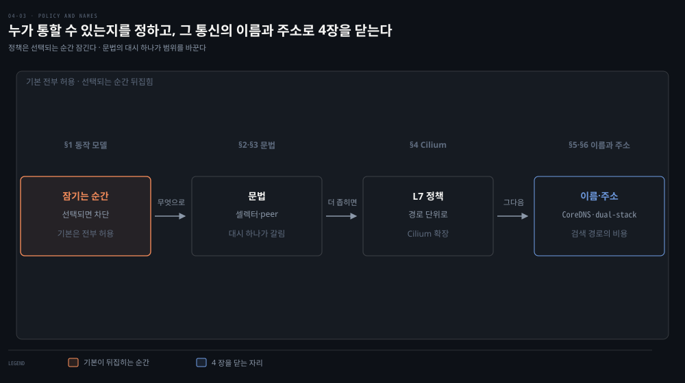
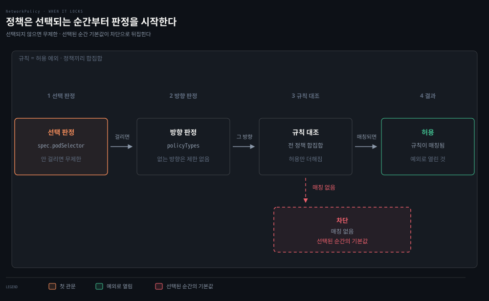
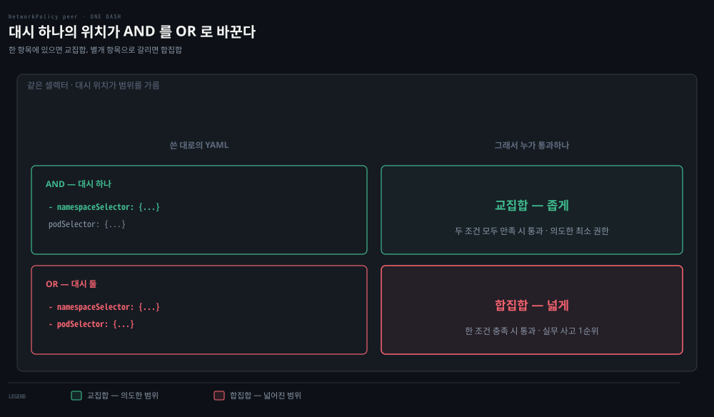

# NetworkPolicy와 DNS — 클러스터 안의 방화벽과 이름

## 핵심 요약
> 이 편 전체가 매달린 하나의 생각은 "기본은 전부 허용 — NetworkPolicy는 Pod가 선택되는 순간부터 작동하는 allow-list 방화벽"입니다.
> 선택되지 않은 Pod는 무제한이고, 선택된 Pod는 규칙이 허용한 것만 통합니다. 규칙은 차단을 표현할 수 없고 예외(허용)만 더할 수 있으며, 그 전부가 라벨과 셀렉터 위에서 움직입니다. 뒤이어 클러스터의 이름을 책임지는 CoreDNS와, IPv4·IPv6를 함께 쓰는 dual-stack까지 — 4장의 정책·이름·주소 층을 닫습니다.


## 학습 목표
> 정책 문법을 외우는 대신, 어떤 Pod 가 왜 잠기고 어떤 규칙이 왜 새는지를 판정할 수 있는 상태를 목표로 합니다.

이 내용을 읽고 나면:

1. NetworkPolicy의 선택-잠금 모델(선택 전 무제한, 선택 후 allow-list)을 설명할 수 있습니다.
2. LabelSelector의 matchLabels·matchExpressions와 연산자 4종을 구분할 수 있습니다.
3. NetworkPolicyPeer 4형(ipBlock·namespaceSelector·podSelector·조합)의 AND/OR 함정을 피할 수 있습니다.
4. Cilium으로 L3(누가)과 L7(어떤 요청) 정책을 실습 흐름으로 재구성할 수 있습니다.
5. Pod의 dnsPolicy 4종과 CoreDNS 검색 경로·Autopath의 관계를 설명할 수 있습니다.

아래는 이 편 전체를 정책·이름·주소 세 층으로 이은 지도입니다. 앞의 세 칸이 누가 누구와 통할 수 있는지를 정하는 정책 층이고, 마지막 칸이 그 통신의 이름과 주소를 맡습니다. 단계 위의 이름이 본문에서 그것을 다루는 절입니다. 첫 칸이 이 편의 출발점입니다. 아무 정책도 없으면 클러스터 안은 전부 열려 있습니다.




## 1. NetworkPolicy — 선택되는 순간 잠긴다
> 정책은 선택되기 전까지 아무 일도 하지 않습니다. 선택되는 순간 그 방향이 기본 차단으로 뒤집히고, 그다음부터는 허용만 더할 수 있습니다.

Kubernetes의 기본은 클러스터 안 임의 Pod 간 전부 허용입니다. 도입 용이성을 위한 설계지만 실전에서는 부적절합니다. 공격자가 시스템을 탐색하고 약한 인증을 찾아 탈취한 워크로드로 데이터를 빼돌리기 쉬워지기 때문입니다. 저자들은 NetworkPolicy 없이 실제 클러스터를 돌리지 말라고 강하게 권합니다. mTLS·인증 토큰 같은 애플리케이션 계층 보안과 병행하는 것도 함께 권합니다.

동작 모델이 이 절의 뼈대입니다. NetworkPolicy는 allow 기반 방화벽 규칙을 담는 리소스이고, 실제 강제는 CNI 플러그인이 합니다. 지원은 선택 사항이라 Flannel·Kubenet처럼 미지원 CNI에서 정책을 만들어도 아무 효과가 없습니다. Calico·Cilium은 지원할 뿐 아니라 자체 확장 정책도 갖고 있습니다. 핵심 규칙 세 가지는 다음과 같습니다.

1. 선택되지 않은 Pod는 무제한입니다. `spec.podSelector`에 걸리는 순간, 해당 policyTypes(Ingress·Egress) 방향이 기본 차단으로 바뀝니다.
2. 규칙은 예외(허용)만 더합니다 — 차단을 표현할 수 없습니다.
3. 여러 정책이 한 Pod를 선택하면 모든 정책의 규칙이 합집합으로 적용됩니다.

책의 3단계 예제가 모델을 정확히 보여 줍니다. demo와 demo-db 두 컴포넌트를 두고 정책을 한 단계씩 조입니다.

1. 정책이 없으면 둘은 전부 통신할 수 있습니다.
2. demo-db를 선택하고 Ingress·Egress를 policyTypes에 적되 규칙을 비우면, demo-db는 어떤 트래픽도 주고받지 못합니다.
3. `ingress.from.podSelector: app=demo`를 더하면 demo에서 오는 연결만 받습니다. 나가는 연결은 여전히 전부 차단입니다.

판정은 세 관문을 순서대로 지납니다. 각 상자 아래 줄이 그 관문을 통과하지 못했을 때 어떻게 되는지입니다. 앞의 두 관문은 걸리지 않으면 그냥 열려 있고, 마지막 관문만 매칭이 없을 때 차단으로 떨어집니다.



경고 둘이 따라붙습니다. 라벨을 바꿀 수 있는 사용자는 정책 적용 자체를 바꿀 수 있습니다 — demo-db 라벨을 떼면 정책이 벗겨지고, app=demo 라벨을 침해된 Pod에 붙이면 접근권이 생깁니다. 그리고 Kubelet의 헬스체크가 통해야 하므로 CNI는 Pod의 자기 노드발 트래픽을 항상 허용해야 하는데, 노드에 접근한 공격자가 노드 IP를 위장(spoof)할 수 있다는 한계도 함께 적어 둡니다.

기본-차단(firewalled-by-default)을 원하면 워크어라운드가 셋 있습니다. 네임스페이스마다 전체 거부(deny-all) 정책을 깔거나, 기본 폐쇄 동작을 제공하는 CNI 설정을 쓰거나, 워크로드에 NetworkPolicy를 요구하는 admission 정책을 두는 방법입니다.


## 2. LabelSelector — 정책의 문법
> 정책이 누구에게 걸리는지는 전부 라벨이 정합니다. 연산자 넷과 values 조건을 정확히 알아야 의도한 Pod 만 잠깁니다.

NetworkPolicy는 온통 라벨과 셀렉터입니다. Kubernetes 리소스가 서로를 이름으로 가리키는 일은 드물고, 대부분 LabelSelector로 라벨을 매칭합니다. 필드는 둘입니다.

- matchLabels — 키-값 맵. 모든 키가 존재하고 값이 일치해야 매칭. 단일 키(app=example)로 충분한 경우가 대부분
- matchExpressions — LabelSelectorRequirement 목록. 전부 참이어야 매칭

연산자는 4종입니다.

- **In** — 키가 있고 값이 목록 중 하나
- **NotIn** — 키가 없거나 값이 목록에 없음
- **Exists** — 값과 무관하게 키 존재
- **DoesNotExist** — 키 부재

values 배열은 In·NotIn에서는 비어 있으면 안 되고, Exists·DoesNotExist에서는 비어 있어야 합니다. 빈 셀렉터(`podSelector: {}`)는 범위 안 전부 — 네임스페이스의 모든 Pod를 선택합니다.

> 원문 정오: 책의 표 4-4는 values 조건을 반대로 서술합니다("In·NotIn일 때 비어 있어야 한다") — Kubernetes API 정의는 위와 같이 그 반대입니다. 같은 표에서 연산자 이름도 NotExists로 표기하지만 실제 API 값은 DoesNotExist입니다.


## 3. Rules — 누구를(peer) 어느 포트로
> peer 를 적는 방법이 넷이고, 그중 조합형에 실무 사고 1순위가 숨어 있습니다. YAML 대시 하나의 위치가 AND 를 OR 로 바꿉니다.

ingress·egress 섹션은 각각 규칙 목록이고, 각 규칙은 포트 목록과 NetworkPolicyPeer 목록을 가집니다. peer를 지정하는 방법이 네 가지입니다.

| peer | 의미 | 주의 |
|------|------|------|
| ipBlock | CIDR + 선택적 except(하위 CIDR 제외) | 외부 시스템용. 다른 셀렉터와 한 규칙에 함께 못 씀 |
| namespaceSelector | 라벨 매칭되는 모든 네임스페이스의 모든 Pod | 네임스페이스 라벨을 바꿀 수 있으면 정책을 우회 가능 |
| podSelector | 같은 네임스페이스의 라벨 매칭 Pod | namespaceSelector 없이 쓰면 정책의 네임스페이스로 한정 |
| namespace + pod 조합 | 두 조건의 AND — 매칭 네임스페이스 안의 매칭 Pod | YAML 문자 하나(`-`)가 AND를 OR 두 항목으로 바꿈 |

마지막 행의 함정은 실무 사고 1순위입니다 — `- namespaceSelector:` 아래에 `podSelector:`를 들여쓰면 AND 하나이고, `- podSelector:`로 새 항목을 시작하면 OR 두 개입니다. 저자들 표현대로 "문자 하나가 AND와 OR를 가릅니다".

두 YAML을 나란히 두면 차이가 대시 하나뿐임이 보입니다.

```yaml
# AND — 대시 하나. 두 셀렉터가 같은 항목에 들어 있다
ingress:
  - from:
      - namespaceSelector:
          matchLabels: {team: store}
        podSelector:
          matchLabels: {app: frontend}
```

```yaml
# OR — 대시 둘. 두 셀렉터가 별개 항목으로 갈라진다
ingress:
  - from:
      - namespaceSelector:
          matchLabels: {team: store}
      - podSelector:
          matchLabels: {app: frontend}
```

위쪽은 `team=store` 네임스페이스 **안의** `app=frontend` Pod만 허용합니다. 아래쪽은 `team=store` 네임스페이스의 **모든** Pod, 또는 정책이 놓인 네임스페이스의 `app=frontend` Pod를 허용합니다. 의도한 것보다 훨씬 넓게 열립니다.



책의 실전형 예제(store-api)를 해석하면 이렇습니다. store 네임스페이스의 모든 Pod(`podSelector: {}`)는 app=frontend 라벨의 네임스페이스 안 app=frontend Pod에서 오는 8080/TCP만 받습니다. 나가는 쪽은 app=downstream-1 또는 downstream-2로 가는 8080/TCP만 허용되며, 이때 네임스페이스와 Pod가 모두 매칭돼야 합니다.

단 이 정책이 상대편(downstream) 쪽 허용을 보장하지 않으므로, downstream-1 네임스페이스에는 store발 Ingress를 허용하는 별도 정책이 필요합니다 — 정책은 언제나 자기 Pod 관점입니다.

참고로 NetworkPolicy는 networking/v1의 안정 리소스지만, 저자들은 설정 경험이 거칠고 기본 개방이 바람직하지 않다며 아직 초기 버전의 네트워크 보안이라 평가합니다(v2 API 논의 워킹 그룹 존재).


## 4. Cilium 실습 — L3에서 L7로
> 표준 정책이 "누가"까지만 말할 수 있다면 Cilium 은 "어떤 요청"까지 말합니다. 같은 Pod 를 열어 두고 경로 단위로 가르는 것이 L7 정책입니다.

전편의 KIND+Cilium 클러스터 위에서 Go 웹 서버와 Postgres 구성으로 정책을 실측하는 흐름입니다. 정책을 걸기 전에는 dnsutils Pod에서 웹 서버 8080 이든 DB 5432 든 전부 열려 있습니다. `nc -z` 로 확인합니다.

1단계는 L3 정책입니다. "DB에는 웹 서버만"이라는 CiliumNetworkPolicy 를 적용합니다. `l3-rule-app-to-db` 는 endpointSelector 로 app=postgres 를 선택하고 ingress 를 app=app 에서만 받습니다. 적용하면 dnsutils에서 5432가 타임아웃되고, 웹 서버의 `/data` 경로는 DB 연결을 그대로 유지합니다.

2단계는 L7 정책입니다. Cilium은 L7 인지라 HTTP 경로 단위로 허용할 수 있습니다. GET `/`와 `/data`만 허용하는 정책을 적용하면, dnsutils에서 `/`·`/data`는 응답하지만 `/healthz`는 실패합니다. 책의 예제는 app=app을 선택한 egress 규칙으로 작성돼 있습니다. 표준 NetworkPolicy가 표현하지 못하는 세밀도이며, CRD(ciliumnetworkpolicies.cilium.io)로 kubectl에서 그대로 조회·describe됩니다.

저자들의 권고 — NetworkPolicy를 지원하는 CNI를 고르고, 개발자의 정책 사용을 강제하십시오. 정책은 네임스페이스 단위이므로 팀 구성이 비슷하면 관리자가 표준으로 강제할 수 있습니다.


## 5. DNS — CoreDNS와 검색 경로의 비용
> 짧은 이름 하나가 다섯 번의 질의가 되는 구조가 클러스터 DNS 지연의 근원입니다. Autopath 와 ndots 조정이 그 비용을 줄이는 두 처방입니다.

초기 Kubernetes의 KubeDNS는 한 Pod에 세 컨테이너를 담았습니다.

- **kube-dns**: API 감시와 DNS 서빙
- **dnsmasq**: 캐싱과 스텁 도메인
- **sidecar**: 메트릭과 헬스체크

1.13 이후는 CoreDNS입니다. 단일 컨테이너 Go 프로세스로 KubeDNS 기능을 복제·확장했습니다. Kubernetes와 하위 호환되는 범용 DNS 서버이며 플러그인으로 명세 이상을 할 수 있습니다. 기본 replica 2의 deployment로 kube-system에서 돌고, API 서버 접근·Corefile ConfigMap·서비스가 함께 필요합니다.

Pod 쪽 설정은 dnsPolicy 4종입니다.

| dnsPolicy | 동작 |
|-----------|------|
| Default | 노드의 이름 해석 설정을 상속 |
| ClusterFirst | 클러스터 도메인 접미사와 안 맞는 질의(www.kubernetes.io 등)는 노드에서 상속한 업스트림으로 |
| ClusterFirstWithHostNet | hostNetwork로 도는 Pod에는 이것을 설정해야 함 |
| None | 전부 dnsConfig 필드로 — nameservers(최대 3개)·searches(최대 6개)를 직접 지정 |

질의 비용의 근원이 검색 경로입니다. 일반 질의는 `<service>.default.svc.cluster.local → svc.cluster.local → cluster.local → 호스트 검색 경로` 순으로 시도되므로, 짧은 이름 하나에 다섯 번의 요청이 나가 지연을 키울 수 있습니다.

CoreDNS의 Autopath가 해법입니다 — 서버 측에서 검색 경로를 완성해(클러스터 검색 도메인을 벗겨 서버에서 조회) 결과를 CNAME으로 저장하고 한 번의 질의로 답합니다. 대신 CoreDNS 메모리 사용이 늘므로 클러스터 크기에 맞춰 replica 메모리·requests를 조정하고, coredns 메트릭(질의 수·처리 시간·요청 크기 등)으로 감시해야 합니다.

Autopath도 메트릭도 플러그인입니다 — kubernetes·forward·cache·rewrite·router53 등 플러그인 생태계가 CoreDNS를 CNI 패턴처럼 확장합니다.

결론부의 경고가 실무 요약입니다 — 유난히 많은 Kubernetes 장애가 DNS와 CoreDNS 오구성에서 나옵니다.


## 6. Dual Stack — IPv4와 IPv6를 함께
> 서비스마다 어느 주소 패밀리를 쓸지 정하는 축이 ipFamilyPolicy 입니다. 책 시점의 알파 절차는 지금 기준으로 읽지 않아야 합니다.

책 시점(1.20)의 dual-stack은 알파였습니다. Pod당 IPv4·IPv6 각 1개, IPv4·IPv6 서비스, 두 패밀리의 egress 라우팅을 제공했습니다. 다만 kube-apiserver·kube-controller-manager·kubelet·kube-proxy에 `IPv6DualStack` feature gate와 콤마 구분 CIDR 쌍을 설정해야 했습니다(1.21부터 기본 활성).

서비스에는 ipFamilyPolicy가 생깁니다.

- **SingleStack** — 첫 패밀리로 ClusterIP
- **PreferDualStack** — dual-stack 클러스터면 두 패밀리 할당, 아니면 SingleStack처럼 동작
- **RequireDualStack** — IPv4·IPv6 둘 다에서 할당

그리고 ipFamilies 배열로 순서를 정합니다. PreferDualStack 서술은 책 문장("SingleStack과 같은 동작")이 모호해 Kubernetes 공식 문서의 의미로 적었습니다.

> 💬 **비유**: NetworkPolicy는 초대장 있는 파티입니다. 문지기(CNI)가 없으면 초대장(정책)을 만들어 봐야 소용없고, 명단(라벨)에 오르지 않은 사람은 애초에 검문 대상도 아닙니다. 일단 검문 대상이 되면 초대장에 적힌 사람(허용 규칙)만 들어옵니다 — "출입 금지" 명단은 아예 존재하지 않고, 들여보낼 사람을 적는 방식뿐입니다. 그리고 명찰(라벨)을 바꿔 달 수 있는 사람은 검문 자체를 흔들 수 있습니다.


## 심화 학습
> 책 밖에서 보강한 내용입니다. 출처를 함께 남깁니다.

- dual-stack은 Kubernetes 1.23에서 GA가 됐습니다 — [K8s 문서 — IPv4/IPv6 dual-stack](https://kubernetes.io/docs/concepts/services-networking/dual-stack/). 책의 feature gate 절차는 1.22 이하에만 해당합니다.
- 책이 언급한 "NetworkPolicy v2 논의"의 현재형은 AdminNetworkPolicy입니다 — 클러스터 관리자용 정책(우선순위·명시적 Deny 표현 가능)으로 sig-network-policy-api가 진행 중입니다. [network-policy-api 프로젝트](https://network-policy-api.sigs.k8s.io/) 참조. "규칙은 차단을 표현할 수 없다"는 이 편의 원칙은 표준 NetworkPolicy에 한정된 이야기가 됩니다.
- ndots 문제는 검색 경로 비용의 실무 이름입니다. Pod resolv.conf 기본값 `ndots:5` 때문에 외부 도메인(점 4개 이하)도 클러스터 검색 경로를 다 돌고 나서야 절대 이름으로 질의됩니다. 외부 호출이 많은 앱에서는 FQDN(끝에 점, `example.com.`) 사용이나 dnsConfig ndots 조정이 처방입니다. 배경은 [K8s 문서 — Pod DNS](https://kubernetes.io/docs/concepts/services-networking/dns-pod-service/) 참조.


## 결정 치트시트
> 정책 작성 전 점검 다섯 줄입니다.

| 점검 | 기준 |
|------|------|
| CNI가 NetworkPolicy를 강제하는가? | Flannel·Kubenet이면 정책이 무의미 — CNI부터 교체 |
| 이 Pod가 이미 다른 정책에 선택되는가? | 여러 정책은 합집합 — 예외가 어디서 오는지 전수 확인 |
| peer의 AND/OR가 의도대로인가? | `-` 위치 하나로 갈림 — namespace+pod 조합은 한 항목 안에 |
| 상대편 정책도 허용하는가? | 내 egress 허용 ≠ 상대 ingress 허용 — 양쪽 모두 필요 |
| 기본-차단이 필요한가? | 네임스페이스별 deny-all + 명시적 허용, 또는 admission 강제 |


## 면접에서 받을 만한 질문
> 답을 가리고 스스로 말해 본 뒤, 아래 정답 절에서 맞춰 봅니다.

1. NetworkPolicy를 "한 줄"로 정의한다면?
2. 선택-잠금 모델의 세 규칙을 설명해 보세요.
3. peer 지정에서 AND와 OR는 무엇이 가르나요?
4. K8s DNS 검색 경로가 왜 지연을 키우나요? 처방은?
5. NetworkPolicy를 만들었는데 아무 효과가 없습니다. 왜죠?
6. 특정 Pod의 접근만 명시적으로 차단하고 싶은데 어떻게 하나요?
7. 클러스터 안 외부 API 호출이 유난히 느립니다. DNS가 원인일 수 있나요?


## 정답 (자답 후 펼치기)
> 위 §면접에서 받을 만한 질문에 *먼저 자답한 뒤* 아래를 읽으세요. 자답 없이 먼저 읽으면 학습 효과가 0입니다.

### 1. NetworkPolicy 한 줄 정의
"NetworkPolicy란 podSelector로 선택된 Pod의 Ingress·Egress를 기본 차단으로 바꾸고 허용 규칙만 합집합으로 더하는 네임스페이스 단위 리소스로, 실제 강제는 CNI 플러그인이 수행합니다."

### 2. 선택-잠금 모델의 세 규칙
(1) 선택되지 않은 Pod는 무제한이고, (2) podSelector에 걸리면 해당 policyTypes 방향이 기본 차단으로 바뀌며, (3) 규칙은 허용(예외)만 더할 수 있고 차단은 표현할 수 없습니다. 여러 정책이 한 Pod를 선택하면 규칙이 합집합으로 적용됩니다.

### 3. peer의 AND/OR
YAML 항목 경계(`-`)가 가릅니다. namespaceSelector와 podSelector를 한 항목에 두면 AND(매칭 네임스페이스 안의 매칭 Pod), 항목을 나누면 OR(두 조건 각각)입니다. "문자 하나가 AND와 OR를 가릅니다".

### 4. DNS 검색 경로 비용과 처방
일반 질의가 `<svc>.<ns>.svc.cluster.local → svc.cluster.local → cluster.local → 호스트 경로` 순으로 시도돼 짧은 이름 하나에 다섯 질의가 나갑니다. 처방은 CoreDNS Autopath(서버 측 검색 경로 완성 + CNAME 캐시, 메모리 비용)와 ndots 조정입니다.

### 5. NetworkPolicy가 무효한 이유
먼저 CNI가 NetworkPolicy를 지원하는지 확인합니다 — Flannel·Kubenet은 정책을 무시합니다. 지원 CNI라면 셀렉터가 실제로 Pod를 선택하는지(라벨·네임스페이스), policyTypes에 의도한 방향이 있는지 봅니다.

### 6. 특정 Pod만 차단
표준 NetworkPolicy로는 차단 규칙을 쓸 수 없습니다. 대상 Pod를 선택해 기본 차단으로 만들고 차단하려는 상대를 제외한 허용 목록을 구성하거나, Cilium·Calico의 확장 정책 또는 AdminNetworkPolicy처럼 Deny를 표현할 수 있는 수단으로 갑니다.

### 7. 외부 호출 지연과 DNS
예. ndots:5 기본값 때문에 외부 도메인도 클러스터 검색 경로 4~5회를 돌고 나서 절대 이름으로 질의됩니다. FQDN(끝점) 사용, dnsConfig의 ndots 하향, CoreDNS Autopath 활성화가 순서대로 시도할 처방입니다.


## 핵심 개념 체크리스트
> 여섯 항목을 막힘없이 답할 수 있으면 5장으로 넘어가도 좋습니다.
- [ ] 선택-잠금 모델의 세 규칙(선택 전 무제한·허용만·합집합)을 말할 수 있는가?
- [ ] LabelSelector 연산자 4종과 values 조건을 정확히 아는가?
- [ ] peer 4형과 AND/OR 함정을 YAML로 보일 수 있는가?
- [ ] Cilium L3 정책과 L7 정책의 표현력 차이를 실습 흐름으로 말할 수 있는가?
- [ ] dnsPolicy 4종과 검색 경로 5단계·Autopath의 관계를 설명할 수 있는가?
- [ ] dual-stack의 ipFamilyPolicy 3종을 구분할 수 있는가?


## 참고 자료
- 《Networking and Kubernetes: A Layered Approach》(James Strong·Vallery Lancey, O'Reilly, 2021, ISBN 978-1492081654) Ch4
- [K8s 문서 — Network Policies](https://kubernetes.io/docs/concepts/services-networking/network-policies/)
- [CoreDNS 공식 — 플러그인](https://coredns.io/plugins/)
- [K8s 문서 — IPv4/IPv6 dual-stack](https://kubernetes.io/docs/concepts/services-networking/dual-stack/)
- 이전 편: [04-02. CNI와 kube-proxy](./04-02.CNI%EC%99%80%20kube-proxy%20%E2%80%94%20Pod%20%EB%84%A4%ED%8A%B8%EC%9B%8C%ED%81%AC%EC%9D%98%20%EB%B0%B0%EC%84%A0%EA%B3%B5%EA%B3%BC%20%EB%A1%9C%EB%93%9C%EB%B0%B8%EB%9F%B0%EC%84%9C.md)
