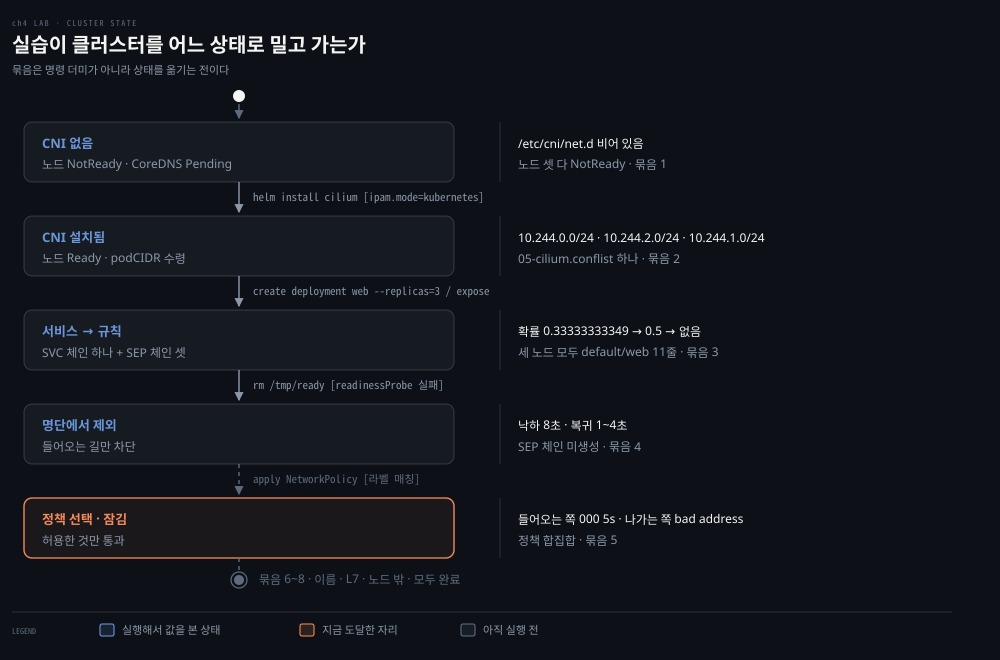

# Kubernetes 네트워크 실습 — CNI 부재부터 정책·DNS까지

---

## 핵심 요약
> 이 편 전체가 매달린 하나의 생각은 **"4장에서 읽은 것들이 실제로 어느 파일과 어느 규칙 줄에 있는지 손으로 확인한다"** 입니다.

CNI 가 없는 클러스터를 일부러 만들어 노드가 멈춰 서는 장면부터 시작합니다. 그다음 주소가 어디서 잘려 내려오는지, 서비스 하나가 몇 줄의 규칙이 되는지, readiness 를 잃은 Pod 의 줄이 실제로 사라지는지, 정책을 걸면 무엇이 함께 끊기는지, 이름 하나가 질의 몇 번이 되는지를 차례로 확인합니다.


## 학습 목표
> 읽어서 아는 것과 규칙 줄에서 찾아내는 것 사이의 거리를 좁히는 것이 목표입니다.

1. CNI 가 없는 클러스터의 증상을 노드와 Pod 상태로 판별할 수 있습니다.
2. 클러스터 전체 대역이 노드별 조각으로 잘려 내려온 자리를 명령으로 짚을 수 있습니다.
3. 서비스 하나가 만드는 체인 셋을 실제 규칙에서 찾아 읽을 수 있습니다.
4. readiness 실패가 규칙 줄을 지우는 것과 그 Pod 의 나가는 길이 살아 있는 것을 동시에 확인할 수 있습니다.
5. 정책이 선택되는 순간 무엇이 함께 끊기는지, 어느 Pod 가 영향을 안 받는지를 실측할 수 있습니다.



묶음은 서로 무관한 명령 더미가 아닙니다. 하나를 끝낼 때마다 클러스터가 한 칸씩 옮겨 가고, 다음 묶음은 그 자리에서 출발합니다. 오른쪽 칸에는 그 자리에서 실제로 본 값을 적습니다 — 예측과 어긋난 값이 있으면 그것이 이 실습의 수확입니다.


## 실행 환경
> 로컬에서 만들고 부수는 실습입니다. 사내 클러스터는 조회만 하며 그 기록은 이 문서에 두지 않습니다.

| 항목 | 값 |
|------|-----|
| 실습 호스트 | Linux VM 한 대. 3장에서 쓰던 것을 이어 씁니다 |
| 클러스터 | KIND. 컨트롤 플레인 1 + 워커 2. VM 안에서 돕니다 |
| CNI | 기본 CNI 를 끄고 Cilium 을 Helm 으로 올립니다 |
| 필요한 도구 | VM 안의 `docker` · `kind` · `kubectl` · `helm` |
| Pod 대역 | `10.244.0.0/16` (KIND 기본) |
| Service 대역 | `10.96.0.0/12` (KIND 기본) |

**노드 밖에서 보려고 VM 안에 세웁니다.** kind 노드는 그 자체가 리눅스 컨테이너라, 노드 *안*을 보는 데는 호스트가 macOS 여도 상관없습니다. 그런데 이 실습에는 노드 *밖*에서 Pod 로 가는 길을 보는 묶음이 있습니다. 그 자리에서는 kind 노드를 담고 있는 호스트가 리눅스여야 라우팅 테이블을 손보고 결과를 잴 수 있습니다. 3장에서 세운 VM 이 그 호스트 역할을 합니다.

> ⚠️ **사내 클러스터에서는 만들지 않습니다.** 이 문서의 명령은 전부 로컬 KIND 클러스터를 대상으로 합니다. 사내 운영 클러스터는 조회 전용이며, 그 관측은 `write/_company/` 아래 별도 문서에서 다룹니다. 이 폴더는 공개 배포되므로 사내 주소나 이름을 적지 않습니다.

### 확정된 값

> 아래는 2026-09-03 에 세운 클러스터에서 확정된 값입니다.

| 항목 | 값 |
|------|-----|
| 노드 이름 셋 | `k8s-net-control-plane` · `k8s-net-worker` · `k8s-net-worker2` |
| 노드별 podCIDR | `10.244.0.0/24`(control-plane) · `10.244.2.0/24`(worker) · `10.244.1.0/24`(worker2) |
| Cilium 버전 | (`helm list -n kube-system` 으로 채웁니다) |
| kube-proxy 모드 | iptables. `kubeProxyReplacement=false` 로 설치해 `KUBE-SVC` 체인이 남아 있습니다 |

노드 번호와 대역 번호가 어긋나 있습니다. `worker` 가 `10.244.2.0/24` 를 받고 `worker2` 가 `10.244.1.0/24` 를 받았습니다. 컨트롤러가 노드 이름 순서가 아니라 **등록된 순서**로 다음 조각을 떼어 주기 때문이며, 이름에서 대역을 추측하면 안 된다는 실물입니다.


## 1. CNI 가 없는 클러스터

> 읽어서 아는 "CNI 없으면 네트워크 없음"을 눈으로 봅니다. 관리형 클러스터는 이미 깔린 채로 오기 때문에 이 장면을 볼 일이 없습니다.

### 풀려는 문제

[04-01](./04-01.Kubernetes%20%EB%84%A4%ED%8A%B8%EC%9B%8C%ED%82%B9%20%EB%AA%A8%EB%8D%B8%20%E2%80%94%20Pod%20IP%C2%B7%EB%A0%88%EC%9D%B4%EC%95%84%EC%9B%83%C2%B7Probe.md) §1 이 "Kubernetes 는 기본 CNI 플러그인을 싣고 오지 않는다"로 끝났습니다. 그 문장이 실제로 어떤 증상으로 나타나는지는 없는 상태를 만들어 봐야 압니다.

### 클러스터 만들기

```yaml
# kind-config.yaml
kind: Cluster
apiVersion: kind.x-k8s.io/v1alpha4
nodes:
  - role: control-plane
  - role: worker
  - role: worker
networking:
  disableDefaultCNI: true    # 기본 CNI 를 꺼야 Cilium 을 올릴 수 있다
```

```bash
kind create cluster --name k8s-net --config kind-config.yaml
kubectl config use-context kind-k8s-net

kubectl get nodes
kubectl -n kube-system get pods
```

### 예측하고 확인할 것

| # | 예측 질문 | 내 예측 | 관찰 |
|---|----------|--------|------|
| 1-1 | 노드 상태가 무엇으로 보일까요 | 노드끼리 통신이 안 되어 있을 것 | 셋 다 `NotReady`. 이유는 통신 실패가 아니라 **kubelet 이 네트워크가 준비되지 않았다고 보고**한 것입니다. 노드 컨디션에 `NetworkReady=false` 와 `cni plugin not initialized` 가 남습니다 |
| 1-2 | `kube-system` 의 Pod 중 뜬 것과 안 뜬 것이 갈릴까요. 갈린다면 기준은 무엇일까요 | 갈릴 것 | 갈렸습니다. **기준은 자기 IP 가 필요한가**입니다. `etcd`·`kube-apiserver`·`kube-controller-manager`·`kube-scheduler`·`kube-proxy` 는 `hostNetwork` 라 노드 주소를 그대로 쓰고 정상입니다. `CoreDNS` 만 Pod IP 가 필요해 `Pending` 입니다 |
| 1-3 | CoreDNS Pod 의 상태와 그 이벤트에 어떤 문구가 남을까요 | 마스터 노드에 뜰 것 | 상태는 `Pending` 이었습니다. **CNI 부재는 `ContainerCreating` 이 아니라 `Pending` 입니다** — 노드가 `NotReady` 라 `not-ready` taint 가 붙고 스케줄러가 배치를 못 합니다. 이 사실이 04-01 §4 의 틀린 서술을 찾아냈습니다. 이벤트 문구는 이 회차에 정확히 옮겨 적지 못했습니다 |

### Cilium 올리기

```bash
helm repo add cilium https://helm.cilium.io/
helm repo update
helm install cilium cilium/cilium --namespace kube-system --set image.pullPolicy=IfNotPresent

kubectl -n kube-system rollout status ds/cilium
kubectl get nodes
```

| # | 예측 질문 | 내 예측 | 관찰 |
|---|----------|--------|------|
| 1-4 | 노드가 Ready 로 바뀌는 순서가 있을까요 | 셋이 동시에 바뀔 것 | **반증.** 동시가 아닙니다. Cilium 이 DaemonSet 이라 노드마다 따로 뜨고, 뜬 노드부터 차례로 `Ready` 가 됩니다. CoreDNS 가 control-plane 에 배치된 것도 그 순간 Ready 인 노드가 거기 하나였기 때문입니다 |
| 1-5 | Cilium 이 심는 부품 넷 중 노드마다 하나씩 도는 것은 무엇일까요 | (예측 없음) | **DaemonSet 둘**입니다. `cilium` 에이전트와 `cilium-envoy` 가 노드마다 하나씩이고 둘 다 `hostNetwork`(주소가 `172.18.0.x`) 입니다. 생성 시각이 초 단위로 같아 같은 `helm install` 산물임이 확인됩니다. `cilium-envoy` 는 묶음 7 에서야 눈에 띄었습니다 |

### 확인된 것

CNI 가 없을 때 나타나는 증상은 통신 실패가 아닙니다. 노드 셋이 `NotReady` 로 보이지만 그것은 노드끼리 못 닿아서가 아니라 kubelet 이 네트워크가 준비되지 않았다고 보고했기 때문입니다. 노드 컨디션의 `NetworkReady=false` 와 `cni plugin not initialized` 가 그 보고입니다.

그래서 Pod 가 뜨느냐 마느냐를 가르는 기준은 **자기 IP 가 필요한가** 하나입니다. `etcd`·`kube-apiserver`·`kube-controller-manager`·`kube-scheduler`·`kube-proxy` 는 `hostNetwork` 라 노드 주소를 그대로 쓰므로 CNI 없이도 정상입니다. `CoreDNS` 만 Pod IP 를 받아야 해서 걸립니다.

걸리는 방식도 예상과 달랐습니다. `ContainerCreating` 이 아니라 `Pending` 입니다. 노드가 `NotReady` 라 `not-ready` taint 가 붙고, 스케줄러가 배치 자체를 못 합니다. 컨테이너를 만들다 실패한 것이 아니라 만들 자리를 못 정한 것입니다.

Cilium 을 올린 뒤 `Ready` 가 돌아오는 것도 한꺼번에가 아닙니다. Cilium 이 DaemonSet 이라 노드마다 따로 뜨고, 뜬 노드부터 차례로 `Ready` 가 됩니다. CoreDNS 가 control-plane 에 배치된 것도 그 순간 `Ready` 인 노드가 거기 하나였기 때문입니다.


## 2. 주소 재고가 내려온 자리

> [04-01](./04-01.Kubernetes%20%EB%84%A4%ED%8A%B8%EC%9B%8C%ED%82%B9%20%EB%AA%A8%EB%8D%B8%20%E2%80%94%20Pod%20IP%C2%B7%EB%A0%88%EC%9D%B4%EC%95%84%EC%9B%83%C2%B7Probe.md) §3 의 `--cluster-cidr` 이 노드의 `spec.podCIDR` 로 잘려 내려온 것을 확인합니다.

### 풀려는 문제

플래그와 필드를 읽어서는 그 둘이 같은 값의 앞뒤인지 감이 안 옵니다. 한 클러스터에서 나란히 꺼내 보면 관계가 보입니다.

### 대역 확인

```bash
# 클러스터 전체 예산
docker exec k8s-net-control-plane \
  grep -E 'cluster-cidr|service-cluster-ip-range|node-cidr-mask-size' \
  /etc/kubernetes/manifests/kube-controller-manager.yaml

# 노드가 받아 간 조각
kubectl get nodes -o custom-columns=NAME:.metadata.name,PODCIDR:.spec.podCIDR

# 플러그인이 읽는 설정과 바이너리
docker exec k8s-net-worker ls /etc/cni/net.d/
docker exec k8s-net-worker ls /opt/cni/bin/
```

### Pod 하나 띄워 주소 보기

```bash
kubectl create deployment web --image=nginx:alpine --replicas=3
kubectl wait --for=condition=Ready pod -l app=web --timeout=120s

kubectl get pods -l app=web -o wide
kubectl exec deploy/web -- ip -4 addr show eth0
kubectl exec deploy/web -- ip route
```

### 예측하고 확인할 것

| # | 예측 질문 | 내 예측 | 관찰 |
|---|----------|--------|------|
| 2-1 | 노드 셋의 `podCIDR` 은 같을까요 다를까요 | 달라야 한다 | 맞았습니다. `10.244.0.0/24`(control-plane) · `10.244.2.0/24`(worker) · `10.244.1.0/24`(worker2). **노드 이름 순서와 번호가 어긋나 있습니다** — 등록된 순서로 잘려 나가므로 이름에서 대역을 추측하면 안 됩니다 |
| 2-2 | 각 Pod 의 IP 가 자기 노드의 `podCIDR` 안에 있을까요 | 있을 것 | 맞았습니다. `worker` 의 Pod 는 `10.244.2.153`·`10.244.2.4`, `worker2` 의 Pod 는 `10.244.1.35` 입니다. 묶음 8 에서 `10.244.2.0/24` 경로 한 줄이 그 노드 Pod **둘 다**를 연 것이 같은 사실의 다른 면입니다 |
| 2-3 | Pod 안 `ip route` 의 기본 경로는 어디를 가리킬까요 | (예측 없음) | 이 회차에 실행하지 않았습니다. 대신 노드 쪽 `CILIUM_POST_nat` 에서 `cilium_host` 의 주소(`10.244.2.88`)를 봤고, 묶음 8 에서 나가는 트래픽이 노드 IP 로 masquerade 되는 것을 확인했습니다 |
| 2-4 | `/etc/cni/net.d/` 에 파일이 몇 개고 그중 Cilium 것은 무엇일까요 | 설치 전에는 없을 것 | 설치 뒤 **`05-cilium.conflist` 하나**뿐입니다. 안에는 `plugins` 에 `cilium-cni` 하나만 있고 `ipam` 칸이 **없습니다**. `/opt/cni/bin/` 에는 `host-local`·`loopback`·`portmap`·`ptp` 가 함께 있지만 이 클러스터에서는 실행되지 않습니다 — 노드 이미지가 기본으로 담고 있는 것입니다 |

### 확인된 것

재고가 위에서 아래로 잘려 내려오는 것은 값으로 확인됩니다. 클러스터 예산이 노드마다 `/24` 조각으로 갈리고, 각 Pod 의 주소는 자기 노드가 받은 조각 안에 들어 있습니다.

다만 **조각 번호는 노드 이름 순서가 아닙니다.** `worker` 가 `10.244.2.0/24`, `worker2` 가 `10.244.1.0/24` 를 받았습니다. 등록된 순서로 잘려 나가므로 이름을 보고 대역을 추측하면 안 됩니다.

한 노드가 한 조각을 통째로 갖는다는 성질은 묶음 8 에서 값을 합니다. `10.244.2.0/24` 경로 한 줄이 그 노드의 Pod 둘을 함께 연 것이 여기서 확인한 사실의 다른 면입니다.

설정 쪽에서는 반대 방향의 확인이 하나 나왔습니다. Cilium 의 `05-cilium.conflist` 에는 `ipam` 칸이 아예 없습니다. CNI 명세가 배선과 주소 할당을 갈라 놓기는 하지만 그것이 강제는 아니라는 실물입니다. `/opt/cni/bin/` 에 `host-local` 같은 바이너리가 함께 있어도 이 클러스터에서는 실행되지 않습니다. 놓여 있는 것과 쓰이는 것은 다릅니다.


## 3. 서비스 하나가 만드는 규칙 줄

> [04-02](./04-02.CNI%EC%99%80%20kube-proxy%20%E2%80%94%20Pod%20%EB%84%A4%ED%8A%B8%EC%9B%8C%ED%81%AC%EC%9D%98%20%EB%B0%B0%EC%84%A0%EA%B3%B5%EA%B3%BC%20%EB%A1%9C%EB%93%9C%EB%B0%B8%EB%9F%B0%EC%84%9C.md) §4 의 체인 셋을 실제 규칙에서 찾습니다. Phase 1 질의응답에서 나온 요청입니다.

### 풀려는 문제

"진입 체인에서 서비스 체인으로, 거기서 엔드포인트 체인으로"는 읽으면 그럴듯한데, 그 줄이 실제로 어떻게 생겼고 확률이 어떤 값으로 박히는지는 꺼내 봐야 압니다.

### 서비스 만들고 규칙 찾기

```bash
kubectl expose deployment web --port=80 --target-port=80
kubectl get svc web

# 서비스 체인 찾기
docker exec k8s-net-worker iptables-save -t nat | grep -i 'KUBE-SERVICES' | head
docker exec k8s-net-worker iptables-save -t nat | grep -i "KUBE-SVC" | head

# 위에서 찾은 서비스 체인 이름을 넣어 그 안을 본다
docker exec k8s-net-worker iptables-save -t nat | grep '<KUBE-SVC-체인이름>'
```

### 가상 주소라는 것 확인

```bash
SVC_IP=$(kubectl get svc web -o jsonpath='{.spec.clusterIP}')
echo "$SVC_IP"

# nginx:alpine 의 busybox 에 ping 과 wget 이 둘 다 들어 있어 별도 이미지가 필요 없습니다
POD=$(kubectl get pod -l app=web -o jsonpath='{.items[0].metadata.name}')
kubectl exec "$POD" -- ping -c 2 -W 2 "$SVC_IP" ; echo "exit=$?"
kubectl exec "$POD" -- wget -qO- -T 3 "http://$SVC_IP/" | head -3
```

### 규칙이 어느 노드에 있는지

```bash
kubectl get pods -l app=web -o wide
for n in k8s-net-control-plane k8s-net-worker k8s-net-worker2; do
  echo -n "$n : "
  docker exec "$n" iptables-save -t nat | grep -c 'default/web'
done
```

### 예측하고 확인할 것

| # | 예측 질문 | 내 예측 | 관찰 |
|---|----------|--------|------|
| 3-1 | 백엔드가 3개일 때 서비스 체인 안에 줄이 몇 개일까요 | 확률 줄 2개 | 맞았습니다. 백엔드 줄은 3개인데 확률이 붙은 것은 2개입니다. 마지막 줄은 앞을 다 통과한 것을 무조건 받습니다. 마킹 줄까지 세면 체인 전체가 4줄입니다 |
| 3-2 | 각 줄의 확률값은 얼마일까요. 마지막 줄에도 확률이 붙을까요 | 0.33 → 0.5, 마지막엔 없음 | 맞았습니다. 실제 값은 `0.33333333349` 와 `0.50000000000` 입니다. 1/3 이 2진수로 안 떨어져 끝자리가 어긋납니다 |
| 3-3 | ClusterIP 로 `ping` 은 되고 `curl` 은 될까요. 다르다면 이유는 | ping 실패 · curl 성공, ICMP 라서 | 절반 맞았습니다. ping 은 `100% packet loss`, wget 은 HTML 수신. ICMP 인 것도 이유지만 더 근본은 규칙 조건이 `-p tcp --dport 80` 이라 ICMP 가 체인에 **진입조차 못 한다**는 것입니다. 번역 안 된 패킷은 그 주소를 가진 인터페이스가 없어 조용히 사라집니다 |
| 3-4 | 이 규칙이 세 노드에 다 있을까요, 백엔드가 있는 노드에만 있을까요 | 모든 노드 (단 마스터는 몰라도 될 듯) | 앞은 맞고 뒤는 틀렸습니다. 세 노드 모두 정확히 11줄입니다. web Pod 가 없는 control-plane 도 같습니다. taint 가 막는 것은 **스케줄링**이지 호출이 아닙니다 |


### 확인된 것

11 이라는 숫자가 그냥 나온 값이 아닙니다. 진입 줄 하나, 서비스 체인 4줄(마킹 1 + 확률 2 + 나머지 1), 엔드포인트 체인 셋이 각각 2줄이라 6줄. 더하면 11 입니다.

세 노드가 **똑같이** 11 이라는 점이 더 중요합니다. kube-proxy 는 노드마다 따로 도는데 서로 조율하지 않습니다. 같은 EndpointSlice 를 보고 각자 같은 규칙을 만들 뿐입니다. 어느 노드에서 출발해도 같은 서비스에 닿는다는 성질이 이 동일성에서 나옵니다.

엔드포인트 체인이 왜 따로 있는지도 규칙 모양으로 드러납니다. 확률 판정은 `-m statistic` 이 붙은 **한 줄에서 한 번만** 일어납니다. 그런데 뽑힌 뒤 할 일은 두 줄(헤어핀 마킹, DNAT)입니다. 같은 확률을 두 줄에 각각 적으면 따로 굴러서 서로 다른 백엔드가 뽑힐 수 있습니다. 한 번의 판정을 여러 동작으로 잇는 유일한 방법이 점프이고, 그래서 엔드포인트 체인이 존재합니다.


## 4. readiness 를 잃으면 어느 줄이 사라지는가

> [04-01](./04-01.Kubernetes%20%EB%84%A4%ED%8A%B8%EC%9B%8C%ED%82%B9%20%EB%AA%A8%EB%8D%B8%20%E2%80%94%20Pod%20IP%C2%B7%EB%A0%88%EC%9D%B4%EC%95%84%EC%9B%83%C2%B7Probe.md) §5 의 전파 경로를 끝에서부터 확인합니다.

### 풀려는 문제

readiness 가 실패하면 명단에서 빠진다고 읽었습니다. 그런데 그 Pod 자신은 멀쩡한지, 나가는 길은 살아 있는지가 그 서술만으로는 확인되지 않습니다. 이 묶음의 목적은 두 가지를 **동시에** 보는 것입니다.

### 프로브를 붙이고 일부러 떨어뜨리기

```bash
# 프로브를 나중에 patch 로 붙이면 롤아웃이 멈춥니다 — 새 Pod 가 Ready 가 안 되니
# 옛 Pod 가 안 죽고 명단에 옛것과 새것이 섞입니다. 처음부터 달고 만듭니다.
cat <<'EOF' | kubectl apply -f -
apiVersion: apps/v1
kind: Deployment
metadata:
  name: probe-web
spec:
  replicas: 3
  selector:
    matchLabels: { app: probe-web }
  template:
    metadata:
      labels: { app: probe-web }
    spec:
      containers:
        - name: nginx
          image: nginx:alpine
          readinessProbe:
            exec: { command: ["cat", "/tmp/ready"] }
            periodSeconds: 5
            failureThreshold: 2
EOF

kubectl get pods -l app=probe-web
```

프로브가 `/tmp/ready` 를 보므로 파일을 만들어야 Ready 가 됩니다.

```bash
for p in $(kubectl get pods -l app=probe-web -o name); do
  kubectl exec "$p" -- touch /tmp/ready
done
kubectl expose deployment probe-web --port=80
kubectl get endpointslice -l kubernetes.io/service-name=probe-web -o yaml | grep -E 'ready|addresses' 
```

이제 하나만 떨어뜨립니다.

```bash
VICTIM=$(kubectl get pods -l app=probe-web -o name | head -1)
kubectl exec "$VICTIM" -- rm /tmp/ready

# 명단에서 빠지는지
kubectl get endpointslice -l kubernetes.io/service-name=probe-web -o yaml | grep -E 'ready|addresses'

# 규칙 줄이 사라지는지
docker exec k8s-net-worker iptables-save -t nat | grep 'KUBE-SVC' | head

# 그 Pod 는 나갈 수 있는지
# kubernetes.default.svc 는 443/HTTPS 라 http 로는 못 칩니다. 묶음 3 에서 만든 web 서비스를 씁니다.
kubectl exec "$VICTIM" -- sh -c 'wget -qO- -T 3 http://web.default.svc.cluster.local/ >/dev/null && echo OUT-OK || echo OUT-FAIL'
```

### 예측하고 확인할 것

| # | 예측 질문 | 내 예측 | 관찰 |
|---|----------|--------|------|
| 4-1 | 파일을 지운 뒤 명단에서 빠지기까지 몇 초쯤 걸릴까요 | 프로브 확인 간격만큼 | **8초.** 축은 맞고 값이 없었습니다 — `failureThreshold: 2` 를 셈에 안 넣었습니다. `rm` 부터 첫 검사까지 0~5초, 거기서 다시 5초라 범위는 5~10초입니다 |
| 4-2 | 서비스 체인의 줄이 몇 개로 줄고 확률값은 어떻게 바뀔까요 | 33·50 에서 50 만 남는다 | 맞았습니다. `--probability 0.50000000000` 한 줄과 확률 없는 줄 하나입니다. **명단과 규칙의 표현이 다릅니다** — EndpointSlice 는 주소를 남기고 깃발만 `false` 로 내리는데, kube-proxy 는 그 주소의 `KUBE-SEP` 체인을 **아예 만들지 않습니다** |
| 4-3 | 떨어진 Pod 는 밖으로 나갈 수 있을까요 | 나갈 수 있다 · 명단에서 빠진 것이지 IP 는 살아 있다 | 맞았고 근거도 정확했습니다. `OUT-OK`. 반대 방향도 확인했습니다 — 정상 Pod 에서 떨어진 Pod 의 IP 로 직접 요청하면 nginx 가 HTML 을 돌려줍니다. 끊긴 것은 **Service 를 통과하는 길 하나**뿐입니다 |
| 4-4 | 그 Pod 의 컨테이너가 재시작될까요 | 재시작되지 않는다 | 맞았습니다. `0/1 Running · RESTARTS 0 · AGE 16h` — 16시간 동안 Ready 가 아닌 채로 한 번도 재시작하지 않았습니다. 죽이는 것은 liveness 입니다 |
| 4-5 | 파일을 다시 만들면 몇 초 만에 명단에 돌아올까요 | 4-1 과 같다 | **반증. 1초·4초로 절반 이하입니다.** `successThreshold` 가 **1** 이라 한 번만 성공하면 뒤집힙니다. 우리가 안 적은 필드라 admission 이 채웠고, `kubectl get deploy -o jsonpath='{...readinessProbe}'` 로 확인했습니다 |


### 확인된 것

프로브 스펙을 꺼내 보면 우리가 적지 않은 필드가 채워져 있습니다. `successThreshold: 1` 과 `timeoutSeconds: 1` 입니다. 앞의 값이 낙하와 복귀의 시간 차를 만듭니다.

```json
{"exec":{"command":["cat","/tmp/ready"]},"failureThreshold":2,"periodSeconds":5,
 "successThreshold":1,"timeoutSeconds":1}
```

이 비대칭은 직관과 반대입니다. 고장 났으면 빨리 빼고 돌아왔으면 천천히 넣어야 안전해 보입니다. 기본값은 그 반대로 되어 있습니다.

빼는 쪽을 느리게 두는 이유가 둘입니다. 첫째, readiness 실패는 **일시적일 때가 많습니다.** GC 가 잠깐 멈추거나 요청이 몰린 순간에도 프로브가 늦습니다. 그때마다 명단이 뒤집히면 모든 노드가 규칙을 다시 씁니다.

둘째, 빼는 것 자체가 남은 Pod 의 부하를 올립니다. 하나가 빠지면 남은 것들이 그만큼 더 받습니다. 그러다 걔들도 느려지면 함께 빠집니다. 한 번의 흔들림이 서비스를 통째로 비울 수 있습니다.

넣는 쪽은 그런 위험이 없습니다. 방금 프로브에 성공한 것이고, 안 넣으면 멀쩡한 용량이 노는 것뿐입니다.

`timeoutSeconds: 1` 도 같은 표에서 읽습니다. 프로브 명령이 1초 안에 안 끝나면 그것도 실패로 셉니다. 앱은 멀쩡한데 응답이 느려서 명단에서 빠지는 사고가 이 값에서 납니다.

측정할 때 한 번 헛돌았습니다. 앞 회차에서 이미 `rm` 을 해 둔 상태로 다시 `rm` 을 쳐서 `No such file or directory` 가 났고, 루프는 **이미 내려가 있던 상태**를 `+1s` 로 읽었습니다. 시간을 재려면 출발선을 먼저 보장해야 합니다 — 파일을 만들고 명단이 `true` 가 되기를 기다린 뒤에 `rm` 을 칩니다.


## 5. 선택되는 순간 잠긴다

> [04-03](./04-03.NetworkPolicy%EC%99%80%20DNS%20%E2%80%94%20%ED%81%B4%EB%9F%AC%EC%8A%A4%ED%84%B0%20%EC%95%88%EC%9D%98%20%EB%B0%A9%ED%99%94%EB%B2%BD%EA%B3%BC%20%EC%9D%B4%EB%A6%84.md) §1 의 3단계를 그대로 재현하고, Phase 1 에서 어긋났던 두 지점을 실측합니다.

### 풀려는 문제

Phase 1 에서 두 가지가 어긋났습니다. 정책에 적은 포트만 통제된다고 봤고, 정책에 이름이 안 나온 Pod 도 함께 잠긴다고 봤습니다. 둘 다 말로 고쳤지만 손으로 확인하지는 않았습니다.

### 세 컴포넌트 띄우기

```bash
kubectl create ns polylab
kubectl -n polylab run demo    --image=nicolaka/netshoot --labels=app=demo    --command -- sleep infinity
kubectl -n polylab run cart    --image=nicolaka/netshoot --labels=app=cart    --command -- sleep infinity
kubectl -n polylab run demo-db --image=nginx:alpine      --labels=app=demo-db
kubectl -n polylab expose pod demo-db --port=80
kubectl -n polylab wait --for=condition=Ready pod --all --timeout=120s
```

정책 없는 상태부터 재 봅니다.

```bash
kubectl -n polylab exec demo -- curl -s -o /dev/null -w 'demo→db %{http_code}\n' --max-time 3 http://demo-db
kubectl -n polylab exec cart -- curl -s -o /dev/null -w 'cart→db %{http_code}\n' --max-time 3 http://demo-db
kubectl -n polylab exec cart -- sh -c 'nslookup demo-db >/dev/null && echo cart-dns-OK || echo cart-dns-FAIL'
```

### 2단계 — 선택만 하고 규칙은 비운다

```yaml
# lock.yaml
apiVersion: networking.k8s.io/v1
kind: NetworkPolicy
metadata:
  name: demo-db-lockdown
  namespace: polylab
spec:
  podSelector:
    matchLabels:
      app: demo-db
  policyTypes:
    - Ingress
    - Egress
```

```bash
kubectl apply -f lock.yaml
kubectl -n polylab exec demo -- curl -s -o /dev/null -w 'demo→db %{http_code}\n' --max-time 3 http://demo-db
kubectl -n polylab exec cart -- curl -s -o /dev/null -w 'cart→db %{http_code}\n' --max-time 3 http://demo-db
kubectl -n polylab exec cart -- curl -s -o /dev/null -w 'cart→web %{http_code}\n' --max-time 3 http://web.default
kubectl -n polylab exec demo-db -- sh -c 'nslookup kubernetes.default >/dev/null 2>&1 && echo db-dns-OK || echo db-dns-FAIL'
```

### 3단계 — 예외를 하나 더한다

```yaml
# allow.yaml
apiVersion: networking.k8s.io/v1
kind: NetworkPolicy
metadata:
  name: demo-db-allow-demo
  namespace: polylab
spec:
  podSelector:
    matchLabels:
      app: demo-db
  policyTypes:
    - Ingress
    - Egress
  ingress:
    - from:
        - podSelector:
            matchLabels:
              app: demo
      ports:
        - protocol: TCP
          port: 80
```

```bash
kubectl apply -f allow.yaml
kubectl -n polylab exec demo -- curl -s -o /dev/null -w 'demo→db:80 %{http_code}\n' --max-time 3 http://demo-db
kubectl -n polylab exec cart -- curl -s -o /dev/null -w 'cart→db:80 %{http_code}\n' --max-time 3 http://demo-db
```

### 예측하고 확인할 것

| # | 예측 질문 | 내 예측 | 관찰 |
|---|----------|--------|------|
| 5-1 | 2단계에서 `demo→db` 와 `cart→db` 가 각각 어떻게 될까요 | 둘 다 못 들어간다 · 허용을 안 적었다 | 맞았습니다. 둘 다 `000 · 5.00s` 입니다. 거절이 아니라 **조용히 버려져** 타임아웃이 났습니다 |
| 5-2 | 2단계에서 `cart→web` 은 어떻게 될까요. cart 는 정책에 이름이 없습니다 | 상관없다 · demo-db 에만 걸린다 | 맞았습니다. `200 · 0.02s`. 같은 `cart` 인데 목적지에 따라 갈립니다 — **cart 가 잠긴 게 아니라 db 가 잠긴 것**입니다 |
| 5-3 | 2단계에서 demo-db 의 DNS 조회는 될까요 | 안 된다 | 결론은 맞고 이유가 틀렸습니다. "Ingress 가 요청이면 Egress 는 응답"으로 보셨는데 **둘은 방향이고, 방향은 누가 연결을 시작했느냐로 정해집니다.** 실패 모양이 앞의 둘과 다른 것도 관측됐습니다 — `demo→db` 는 5초 타임아웃인데 `db-out` 은 `bad address` 로 즉시 실패했습니다. DNS 질의부터 나가는 연결이라 **이름 푸는 단계에서** 죽습니다 |
| 5-4 | 3단계에서 `demo→db` 와 `cart→db` 는 각각 어떻게 될까요 | demo 는 되고 cart 는 안 된다 | 맞았습니다. `demo→db 200` · `cart→db 000 5.00s`. 그리고 **Egress 는 여전히 빈 채로 200 이 돌아왔습니다** — 판정은 연결이 시작될 때 한 번뿐이고 응답은 conntrack 이 알아봅니다. "Egress = 응답"이었다면 나올 수 없는 결과입니다 |
| 5-5 | 정책의 `port: 80` 을 바꾸거나 지우면 무엇이 달라질까요 | 8080 으로 바꾸면 80 은 막힌다 / `ports` 를 지우면 둘 다 막힌다 | **앞은 정답, 뒤는 반증.** 8080 으로 바꾸니 `demo→db:80` 이 막혀 "적은 포트만 **허용**된다"가 확정됐습니다. 그런데 `ports` 를 통째로 지우자 `200` 으로 열렸습니다. **비어 있음이 두 층에서 뜻이 반대입니다** — `ingress` 목록이 비면 허용 0개지만, 목록 안 항목에서 `ports` 를 생략하면 "포트를 제한하지 않는다"입니다. `cart` 가 계속 막힌 것은 `from` 이 남아 있어서입니다 |
| 5-6 | 두 정책이 같은 Pod 를 고르고 있습니다. 나중 것이 앞 것을 덮어쓸까요 | 순서대로 적용되며 덮어쓸 것 | **반증. 덮어쓰지 않고 합쳐집니다.** `demo-db-lockdown` 을 지웠는데 세 결과가 한 글자도 안 바뀌었습니다. 그 정책의 허용 목록이 빈 집합이라 합집합에 아무 기여를 안 하고 있었습니다. **잠근 것은 그 정책이 아니라 "어느 정책에든 선택되었다는 사실"** 이었습니다 |


### 확인된 것

정책은 문을 닫는 도구가 아닙니다. **Pod 를 닫힌 상태로 옮겨 놓는 도구**입니다. 적힌 규칙은 그 위에 다시 여는 문입니다. `lockdown` 이라는 이름의 정책을 지워도 아무것도 안 풀린 것이 그 증거입니다.

여기서 따라 나오는 성질이 있습니다. **이미 선택된 Pod 를 정책을 더해서 더 막을 수는 없습니다.** 허용만 더해지기 때문입니다. 더 막으려면 기존 정책의 허용을 줄여야 합니다.

같은 정책 하나가 걸렸는데 실패한 모양이 둘로 갈렸습니다. 들어오는 쪽은 5초를 기다리다 포기했습니다(`000 5.00s`). 나가는 쪽은 기다리지도 않고 `bad address` 를 냈습니다.

막힌 지점이 다르기 때문입니다. 들어오는 쪽은 이름을 이미 풀었고 TCP 패킷이 버려졌습니다. 나가는 쪽은 **DNS 질의부터 나가는 연결이라 이름 푸는 단계에서** 죽었습니다.

실무에서 이게 사람을 잡습니다. Egress 를 잠그면 앱이 "DNS 오류"를 뱉습니다. 그러면 CoreDNS 를 의심하고 거기부터 뒤지는데, 정작 원인은 방금 건 정책입니다.

출발선을 재 둔 덕도 봤습니다. 정책을 걸기 전인데 `db` 쪽 DNS 조회가 이미 실패했습니다. 원인은 DNS 가 아니라 도구였습니다 — busybox 의 `nslookup` 은 `resolv.conf` 의 `search` 줄을 쓰지 않아 짧은 이름을 못 찾습니다. 같은 컨테이너의 `wget` 은 musl 의 resolver 를 거쳐 `search` 를 따르므로 같은 이름이 풀립니다. 대조군이 없었다면 이 실패를 정책 탓으로 돌렸을 것입니다.


## 6. 이름 하나가 질의 몇 번이 되는가

> [04-03](./04-03.NetworkPolicy%EC%99%80%20DNS%20%E2%80%94%20%ED%81%B4%EB%9F%AC%EC%8A%A4%ED%84%B0%20%EC%95%88%EC%9D%98%20%EB%B0%A9%ED%99%94%EB%B2%BD%EA%B3%BC%20%EC%9D%B4%EB%A6%84.md) §5 의 검색 경로 비용을 셉니다.

### 풀려는 문제

검색 도메인이 셋이고 각 시도가 두 질의를 낸다는 계산은 읽었습니다. 실제로 몇 번 나가는지는 세 봐야 합니다.

### 정책을 걷고 resolv.conf 부터

```bash
kubectl -n polylab delete networkpolicy --all

kubectl -n polylab exec demo -- cat /etc/resolv.conf
```

### 몇 개가 나가는지 센다

시간을 재는 것보다 질의를 직접 세는 편이 낫습니다. 시간은 캐시와 네트워크 상태에 흔들리지만, 질의 수에는 규칙이 그대로 드러납니다. `demo` Pod 안에서 CoreDNS 로 나가는 53번 트래픽을 잡습니다.

```bash
dnsq() {
  echo "===== $1 ====="
  kubectl -n polylab exec demo -- sh -c "
    tcpdump -n -i any 'udp port 53' > /tmp/cap.txt 2>/dev/null &
    sleep 1
    curl -s -o /dev/null --max-time 3 'http://$1/' >/dev/null 2>&1
    sleep 1
    pkill tcpdump >/dev/null 2>&1
    grep -oE '(A|AAAA)\? [^ ]+' /tmp/cap.txt
    echo -n '  총 질의 '; grep -cE '(A|AAAA)\? ' /tmp/cap.txt
  "
  echo
}

dnsq demo-db
dnsq github.com
dnsq github.com.
dnsq demo-db.polylab.svc.cluster.local
```

`dnsq` 는 셸 함수입니다. 같은 명령을 이름만 바꿔 네 번 돌리려고 묶은 것이고, `$1` 자리에 부를 때 붙인 이름이 들어갑니다.

### 예측하고 확인할 것

| # | 예측 질문 | 내 예측 | 관찰 |
|---|----------|--------|------|
| 6-1 | `polylab` 의 Pod 에서 `demo-db` 를 부르면 시도가 몇 번일까요 | 1번 — 첫 꼬리표가 내 네임스페이스다 | 맞았습니다. 다만 **총 질의는 5개**입니다. A 는 1회로 끝났는데 AAAA 가 목록을 끝까지 돌았습니다 |
| 6-2 | `github.com` 은 몇 번일까요 | 4번 | 맞았습니다. 총 8개. 이유가 한 칸 어긋났습니다 — search 가 "안 먹히는" 것이 아니라 셋 다 붙여 보고 실패한 **뒤에야** 원래 이름을 시도합니다 |
| 6-3 | `github.com.` 은 몇 번일까요 | 1번 | 맞았습니다. 총 2개 |
| 6-4 | `demo-db.polylab.svc.cluster.local` 은 점이 4개입니다. 몇 번일까요 | 4번 — search 를 다 소진한다 | 맞았습니다. 총 8개 |

### 확인된 것

넷을 나란히 놓으면 두 가지가 직관과 반대로 뒤집혀 있습니다.

| 부른 이름 | A 시도 | AAAA 시도 | 총 질의 |
|-----------|:---:|:---:|:---:|
| `demo-db` | 1 | 4 | **5** |
| `github.com` | 4 | 4 | **8** |
| `github.com.` | 1 | 1 | **2** |
| `demo-db.polylab.svc.cluster.local` | 4 | 4 | **8** |

**긴 이름이 짧은 이름보다 비쌉니다.** 완전한 클러스터 이름을 정성껏 다 적으면 8이고 `demo-db` 라고만 쓰면 5입니다. 점이 4개라 문턱 5를 못 넘어 꼬리표를 다 거치기 때문입니다. 이름의 길이는 값을 안 줄입니다.

**줄이는 것은 끝의 점 하나입니다.** `github.com` 8에서 `github.com.` 2로 떨어집니다. 글자는 하나 늘고 질의는 넷이 줄었습니다.

홀수가 나온 자리가 이 묶음에서 가장 값진 관측입니다. A 와 AAAA 는 따로 움직입니다. A 는 첫 꼬리표에서 주소를 받고 멈췄는데, AAAA 는 답이 없어 남은 꼬리표를 끝까지 돌았습니다.

AAAA 가 못 찾은 이유는 그 Service 에 IPv6 주소가 없기 때문입니다. `ipFamilyPolicy` 가 `SingleStack` 이고 `ipFamilies` 가 `["IPv4"]` 입니다. 어느 꼬리표를 붙여도 AAAA 레코드가 없으니 목록을 소진합니다.

그래서 **싱글스택 클러스터에서는 내부 이름을 부를 때마다 AAAA 질의가 헛돕니다.** 실제 질의 수가 이론값보다 늘 많습니다. 04-03 §4 의 기본값이 여기서 비용으로 나타납니다.

출력 순서가 뒤섞여 보이는 것도 같은 이유입니다. 두 줄기가 나란히 달리다 보니 도착 순서가 섞입니다. 순서가 틀린 것이 아닙니다.


## 7. Cilium L7 정책

> [04-03](./04-03.NetworkPolicy%EC%99%80%20DNS%20%E2%80%94%20%ED%81%B4%EB%9F%AC%EC%8A%A4%ED%84%B0%20%EC%95%88%EC%9D%98%20%EB%B0%A9%ED%99%94%EB%B2%BD%EA%B3%BC%20%EC%9D%B4%EB%A6%84.md) §4 에서 이관한 묶음입니다. 표준 정책이 "누가 어느 포트로"까지라면 여기서는 "어떤 경로로"까지 갑니다.

### 풀려는 문제

같은 Pod 의 같은 포트에서 조회 경로는 열고 관리 경로는 막고 싶은 요구가 있습니다. 표준 문법으로는 적을 방법이 없습니다. Cilium 이 L7 을 보므로 그 요구를 정책으로 직접 적습니다.

### 정책 하나로 세 가지 서명을 만든다

```bash
cat <<'EOF' > l7.yaml
apiVersion: cilium.io/v2
kind: CiliumNetworkPolicy
metadata:
  name: l7-only-root
  namespace: polylab
spec:
  endpointSelector:
    matchLabels:
      app: demo-db
  ingress:
    - fromEndpoints:
        - matchLabels:
            app: demo
      toPorts:
        - ports:
            - port: "80"
              protocol: TCP
          rules:
            http:
              - method: GET
                path: "/"
EOF

kubectl -n polylab delete networkpolicy --all      # 표준 정책을 치우고 깨끗하게 본다
kubectl apply -f l7.yaml
sleep 5

kubectl -n polylab exec demo -- curl -s -o /dev/null -w 'GET /        → %{http_code}  %{time_total}s\n' --max-time 3 http://demo-db/
kubectl -n polylab exec demo -- curl -s -o /dev/null -w 'GET /health  → %{http_code}  %{time_total}s\n' --max-time 3 http://demo-db/health
kubectl -n polylab exec cart -- curl -s -o /dev/null -w 'cart GET /   → %{http_code}  %{time_total}s\n' --max-time 3 http://demo-db/
```

### 막은 것이 프록시인지 서버인지 가른다

정책에 없는 경로와, 정책에는 있지만 서버에 없는 경로를 나란히 칩니다. 둘 다 "없는 경로"인데 답하는 쪽이 다릅니다.

```bash
kubectl -n polylab exec demo -- curl -s -i --max-time 3 http://demo-db/health | head -8
kubectl -n polylab exec demo -- curl -s --max-time 3 http://demo-db/health | head -6

# 정책에 /nope 를 허용으로 추가한 뒤 다시
kubectl -n polylab exec demo -- curl -s -o /dev/null -w '/nope → %{http_code}\n' --max-time 3 http://demo-db/nope
```

### 넓은 표준 정책을 옆에 두면

```bash
kubectl -n polylab apply -f std-wide.yaml    # demo 에게 포트 제한 없이 허용
sleep 5
kubectl -n polylab exec demo -- curl -s -o /dev/null -w '/health → %{http_code}\n' --max-time 3 http://demo-db/health
kubectl -n polylab get networkpolicy,ciliumnetworkpolicy
```

### 예측하고 확인할 것

| # | 예측 질문 | 내 예측 | 관찰 |
|---|----------|--------|------|
| 7-1 | `/health` 는 어떤 응답을 받을까요. 타임아웃일까요 거절일까요 다른 코드일까요 | 연결이 이미 맺어졌으니 `000` 이 아니라 정상적인 예외 코드일 것 | 맞았습니다. **`403` · 0.006초**입니다. L3·L4 로 막았을 때의 `000` · 5초와 서명이 전혀 다릅니다 |
| 7-2 | 이 구분을 표준 `NetworkPolicy` 로 적으려면 | (모름) | 적을 수 없습니다. 표준 문법에는 `from` 과 `ports` 뿐이고 경로를 적을 칸이 아예 없습니다 |
| 7-3 | L7 을 보려면 무엇이 더 필요할까요 | (모름) | **프록시**입니다. `GET /health` 는 봉투가 아니라 본문이라, 연결을 받아 완성해야 읽힙니다. Cilium 은 Envoy 를 씁니다. 대가는 지연과 자원, 그리고 프록시가 아는 프로토콜에서만 된다는 제약입니다 |
| 7-4 | 넓은 표준 정책을 옆에 두면 L7 제약이 살아남을까요 | (미출제) | **무력화됩니다.** `/health` 가 403 에서 404 로 바뀌었습니다. 묶음 5 의 합집합이 계층을 넘어서도 그대로입니다 |

### 확인된 것

한 화면에 서명 셋이 다 나왔습니다. `200` 은 nginx 까지 갔습니다. `403` 은 프록시까지만 갔습니다. `000 3.00s` 는 아무 데도 못 갔습니다.

`cart` 가 `000` 인 것이 순서를 보여 줍니다. L7 규칙이 걸려 있어도 출발지 판정이 먼저입니다. 허용 목록에 없으면 커널 단에서 버려지고, HTTP 를 읽어 볼 일 자체가 없습니다. **L7 은 문을 더 여는 것이 아니라 이미 열린 문을 더 좁히는 것입니다.**

막은 쪽이 누구인지는 코드와 본문으로 갈립니다. `/health` 는 `403` 에 본문이 `Access denied` 한 줄(`content-length: 15`)이었고, 정책에 `/nope` 를 더한 뒤의 `/nope` 는 `404` 에 본문이 `nginx/1.31.5` 가 박힌 HTML 이었습니다. 둘 다 서버에 없는 경로인데 답한 쪽이 다릅니다.

**`Server` 헤더는 판정에 쓸 수 없습니다.** nginx 가 만든 404 에도 `server: envoy` 가 붙습니다. Envoy 가 지나가는 응답의 그 헤더를 자기 이름으로 덮어쓰기 때문입니다.

넓은 표준 정책을 옆에 두자 L7 제약이 사라졌습니다. 그런데 응답에는 여전히 `server: envoy` 가 붙어 있습니다. **연결은 계속 프록시를 거치는데 거기서 아무것도 안 막는 상태**입니다. 보안은 없고 지연만 남습니다. 그래서 점검할 때 `get networkpolicy,ciliumnetworkpolicy` 로 두 종류를 함께 봐야 합니다.

Envoy 가 어디서 왔는지도 세어 봤습니다. `cilium-envoy` 라는 별도 DaemonSet 이 노드마다 하나씩 떠 있고, 주소가 `172.18.0.x` 라 hostNetwork 입니다. 생성 시각이 `cilium` DaemonSet 과 초 단위로 같습니다 — 같은 `helm install` 이 함께 만든 것입니다. 설정의 `enable-l7-proxy: true` 와 `external-envoy-proxy: true` 가 그 결과입니다. L7 규칙을 처음 적기 전까지는 경로에 끼지 않으므로 없는 것처럼 보였을 뿐입니다.


## 8. 노드 밖에서 Pod 로 가는 길

> [04-01](./04-01.Kubernetes%20%EB%84%A4%ED%8A%B8%EC%9B%8C%ED%82%B9%20%EB%AA%A8%EB%8D%B8%20%E2%80%94%20Pod%20IP%C2%B7%EB%A0%88%EC%9D%B4%EC%95%84%EC%9B%83%C2%B7Probe.md) §2 의 레이아웃 셋을 손으로 확인합니다. 읽기만 했던 Flat 과 Island 를 만들어 보는 자리입니다.

### 풀려는 문제

레이아웃 세 가지를 표로 읽었습니다. Pod IP 가 밖에서 보이느냐로 갈린다고 했는데, "밖"이 어디이고 "보인다"가 무슨 뜻인지는 손으로 재 보지 않으면 남의 말입니다.

kind 클러스터를 VM 안에 세우면 그 VM 이 곧 "노드 밖"입니다. 노드 컨테이너는 VM 의 도커 네트워크에 붙어 있고, Pod 대역은 그 안쪽에 한 겹 더 있습니다. 이 구조에서 밖에서 안으로 두드려 보면 레이아웃 이야기가 실물이 됩니다.

### 지금 어떤 레이아웃인가

```bash
# 노드 컨테이너가 받은 주소 — 이것이 "노드 IP"다
docker inspect -f '{{.Name}} {{range .NetworkSettings.Networks}}{{.IPAddress}}{{end}}'   k8s-net-control-plane k8s-net-worker k8s-net-worker2

# Pod 하나의 주소 — 이것이 "Pod IP"다
kubectl get pods -l app=web -o wide

# VM 의 라우팅 테이블에 Pod 대역이 있는가
ip route | grep -E '10.244|172.1[78]'
```

### 밖에서 두드려 보기

```bash
POD_IP=$(kubectl get pod -l app=web -o jsonpath='{.items[0].status.podIP}')
NODE=$(kubectl get pod -l app=web -o jsonpath='{.items[0].spec.nodeName}')
echo "pod=$POD_IP node=$NODE"

# VM 에서 Pod IP 로 바로
curl -s -o /dev/null -w 'VM→PodIP %{http_code} (%{time_total}s)
' --max-time 3 "http://$POD_IP" || echo 'VM→PodIP 실패'
```

### 경로를 손으로 넣어 Flat 흉내 내기

```bash
# 그 Pod 가 있는 노드 컨테이너의 IP 를 다음 홉으로 준다
NODE_IP=$(docker inspect -f '{{range .NetworkSettings.Networks}}{{.IPAddress}}{{end}}' "$NODE")
POD_CIDR=$(kubectl get node "$NODE" -o jsonpath='{.spec.podCIDR}')
echo "node_ip=$NODE_IP pod_cidr=$POD_CIDR"

sudo ip route add "$POD_CIDR" via "$NODE_IP"
curl -s -o /dev/null -w 'VM→PodIP(경로추가후) %{http_code}
' --max-time 3 "http://$POD_IP" || echo '여전히 실패'

# 원복
sudo ip route del "$POD_CIDR" via "$NODE_IP"
```

### 나가는 쪽 출발지 보기

```bash
# Pod 가 VM 을 부를 때 VM 이 보는 출발지는 무엇인가
kubectl run out --rm -it --image=nicolaka/netshoot --restart=Never --   sh -c "curl -s --max-time 3 http://192.168.139.1:9 ; echo done" &
sudo timeout 8 tcpdump -ni any 'port 9' -c 4 2>/dev/null || echo '캡처 없음'
```

### 예측하고 확인할 것

| # | 예측 질문 | 내 예측 | 관찰 |
|---|----------|--------|------|
| 8-1 | 노드 IP 와 Pod IP 는 같은 대역일까요 다른 대역일까요 | (실행자 진행 · 예측 없음) | 다릅니다. 노드는 `172.18.0.2·3·4` 로 VM 의 도커 브리지(`br-3afe…`)에 붙어 있고, Pod 는 `10.244.x.x` 입니다. **두 대역 사이에 아무 연결도 없습니다** |
| 8-2 | VM 의 라우팅 테이블에 Pod 대역이 있을까요 | (실행자 진행) | 없습니다. `172.17.0.0/16`·`172.18.0.0/16`·`192.168.139.0/24` 셋뿐이고 `10.244` 는 한 줄도 없습니다. **이 상태가 Island 입니다** |
| 8-3 | 경로를 넣기 전에 VM 에서 Pod IP 로 두드리면 어떻게 될까요. 거절일까요 타임아웃일까요 | (실행자 진행) | **`000 · 4.00s` 타임아웃**입니다. 거절이 아닙니다. VM 은 그 대역을 모르니 기본 경로로 내보내고, 밖에서는 아무도 답하지 않습니다 |
| 8-4 | 경로를 하나 넣으면 닿게 될까요. 된다면 이 클러스터는 어느 레이아웃이 된 것일까요 | (실행자 진행) | 닿습니다. `ip route add 10.244.2.0/24 via 172.18.0.4` 한 줄로 `000 4.00s` 가 **`200 0.03s`** 가 됐습니다. 그 노드의 다른 Pod(`10.244.2.4`)도 함께 열립니다 — `/24` 한 줄이 그 노드 몫 전체를 덮습니다. **그런데 다른 노드의 Pod(`10.244.1.35`)는 여전히 `000` 입니다.** 한 줄은 한 노드만 엽니다 |
| 8-5 | Pod 가 VM 을 부를 때 VM 이 보는 출발지는 Pod IP 일까요 노드 IP 일까요 | (실행자 진행) | **노드 IP** 입니다. `10.244.2.153` 이 보냈는데 VM 의 로그에는 `172.18.0.4` 가 찍혔습니다. 그 노드의 `CILIUM_POST_nat` 에 있는 `-s 10.244.2.0/24 ! -d 10.244.2.0/24 … -j MASQUERADE` 한 줄이 원인입니다 |
| 8-6 | 8-5 의 답이 Island 와 Flat 중 어느 쪽 성질입니까 | (실행자 진행) | **Island** 입니다. 그리고 이 자리가 이 묶음의 결론입니다 — 들어오는 쪽은 경로 한 줄로 Flat 이 됐는데 나가는 쪽은 그대로 Island 였습니다. **같은 클러스터가 방향에 따라 다른 레이아웃입니다** |

### 확인된 것

레이아웃은 클러스터가 가진 속성이 아니라 **주변이 그 대역을 아느냐**에 달린 상태입니다. 아무것도 안 바꾸고 VM 의 라우팅 테이블에 줄 하나를 넣었더니 Island 가 Flat 이 됐습니다. Pod 도 노드도 Cilium 설정도 그대로였습니다.

한 줄이 연 것은 한 노드의 몫뿐입니다. `10.244.2.0/24` 를 넣으니 그 노드의 Pod 둘이 함께 열렸습니다. 다른 노드의 Pod 는 그대로 닫혀 있었습니다. **노드가 셋이면 줄도 셋이고, 노드가 늘면 줄도 늘어야 합니다.** 04-01 §2 가 Flat 의 값으로 적은 "네트워크 장비의 협조"가 이 늘어나는 줄입니다. 실제 환경에서는 사람이 손으로 넣는 대신 BGP 로 광고합니다.

한 노드만 경유하게 하면 되지 않느냐는 물음이 여기서 나옵니다. 안 됩니다. **라우팅은 보내는 쪽이 정하기 때문입니다.** VM 의 테이블에 `10.244.1.0/24` 로 가는 줄이 없으면 VM 은 그 대역을 어디로도 보내지 않습니다. 8-3 에서 본 `000 · 4.00s` 가 그 상태입니다. 경유할 노드를 정해 주는 것도 결국 VM 의 테이블에 줄을 넣는 일이라, 줄 없이 경유만 시킬 방법이 없습니다.

큰 대역을 한 노드에 통째로 걸면 경유 자체는 성립합니다. 이 실습에서 해 보지는 않았습니다. `10.244.0.0/16` 을 노드 하나로 보내면 그 노드가 나머지로 넘겨 주므로 줄은 하나로 끝납니다. 대신 다른 노드로 갈 트래픽이 전부 그 노드를 지납니다. 그 노드가 병목이 되고 그 노드가 죽으면 클러스터 전체가 밖에서 안 보입니다. 줄 하나를 아끼고 단일 장애점을 얻는 거래입니다. **노드마다 한 줄씩 넣는 쪽이 나은 이유가 이것입니다.**

방향이 또 갈렸습니다. 들어오는 쪽은 Flat 인데 나가는 쪽은 Island 인 상태가 만들어졌습니다. VM 은 `10.244.2.153` 으로 직접 요청을 보낼 수 있는데, 그 Pod 가 VM 을 부르면 출발지가 `172.18.0.4` 로 바뀌어 도착합니다. 04-01 §2 의 레이아웃 표를 방향 축으로 나눠 적어 둔 이유가 여기서 값을 합니다.

실습이 끝난 뒤 넣었던 경로는 뺐습니다. 빼고 다시 두드리니 `000 · 4.00s` 로 돌아왔습니다. **되돌려서 원래 증상이 재현되는 것까지가 한 실험입니다.**


## 실습 상태

> 여덟 묶음을 2026-09-03 부터 09-06 까지 실행했습니다. 예측이 어긋난 자리가 이 실습의 산출물입니다.

| 묶음 | 실행일 | 어긋난 예측 |
|------|--------|-----------|
| 1. CNI 가 없는 클러스터 | 2026-09-03 | 노드 셋이 동시에 `Ready` 가 될 것 → DaemonSet 이라 노드마다 따로 |
| 2. 주소 재고가 내려온 자리 | 2026-09-03 | (없음) |
| 3. 서비스 하나가 만드는 규칙 줄 | 2026-09-03 | ClusterIP `ping` 실패가 ICMP 때문일 것 → 규칙 조건이 `-p tcp` 라 체인 진입 자체가 없음 · 마스터는 규칙을 몰라도 될 것 → 세 노드 모두 11줄 |
| 4. readiness 를 잃으면 | 2026-09-04 | 복귀가 낙하와 같은 시간일 것 → `successThreshold:1` 이라 절반 이하 · 낙하 시간에서 `failureThreshold:2` 를 셈에 안 넣음 |
| 5. 선택되는 순간 잠긴다 | 2026-09-05 | 나중 정책이 앞 정책을 덮어쓸 것 → 합집합 · `ports` 를 지우면 전부 막힐 것 → 열림 · Ingress·Egress 가 요청·응답일 것 → 방향 |
| 6. 이름 하나가 질의 몇 번 | 2026-09-05 | (없음 — 넷 다 적중) |
| 7. Cilium L7 정책 | 2026-09-06 | 7-2·7-3 을 몰라 설명 먼저. 넓은 표준 정책이 L7 을 무력화하는 것은 추가 출제 |
| 8. 노드 밖에서 Pod 로 가는 길 | 2026-09-06 | 실행자가 진행 — 예측 없이 관측만 |

### 치우기

```bash
kind delete cluster --name k8s-net
```


## 참고 자료
- 《Networking and Kubernetes: A Layered Approach》(James Strong·Vallery Lancey, O'Reilly, 2021, ISBN 978-1492081654) Ch4
- [KIND — 클러스터 설정](https://kind.sigs.k8s.io/docs/user/configuration/)
- [Cilium — KIND 위 설치](https://docs.cilium.io/en/stable/installation/kind/)
- 이론 편: [04-01](./04-01.Kubernetes%20%EB%84%A4%ED%8A%B8%EC%9B%8C%ED%82%B9%20%EB%AA%A8%EB%8D%B8%20%E2%80%94%20Pod%20IP%C2%B7%EB%A0%88%EC%9D%B4%EC%95%84%EC%9B%83%C2%B7Probe.md) · [04-02](./04-02.CNI%EC%99%80%20kube-proxy%20%E2%80%94%20Pod%20%EB%84%A4%ED%8A%B8%EC%9B%8C%ED%81%AC%EC%9D%98%20%EB%B0%B0%EC%84%A0%EA%B3%B5%EA%B3%BC%20%EB%A1%9C%EB%93%9C%EB%B0%B8%EB%9F%B0%EC%84%9C.md) · [04-03](./04-03.NetworkPolicy%EC%99%80%20DNS%20%E2%80%94%20%ED%81%B4%EB%9F%AC%EC%8A%A4%ED%84%B0%20%EC%95%88%EC%9D%98%20%EB%B0%A9%ED%99%94%EB%B2%BD%EA%B3%BC%20%EC%9D%B4%EB%A6%84.md)
- 3장 실습편: [03-04](./03-04.%EC%BB%A8%ED%85%8C%EC%9D%B4%EB%84%88%20%EB%84%A4%ED%8A%B8%EC%9B%8C%ED%81%AC%20%EC%8B%A4%EC%8A%B5%20%E2%80%94%20%EB%A7%A8%EC%86%90%20%EB%B0%B0%EC%84%A0%EC%97%90%EC%84%9C%20%ED%8F%AC%ED%8A%B8%20%EB%A7%A4%ED%95%91%EA%B9%8C%EC%A7%80.md)
