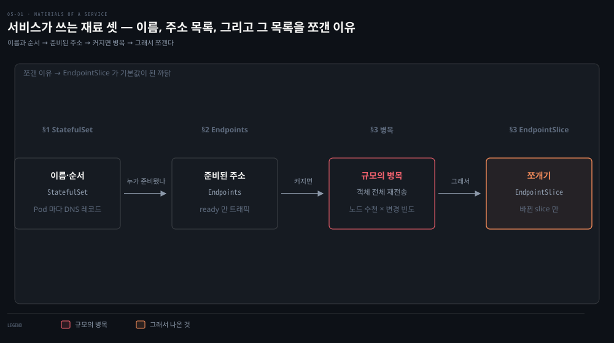
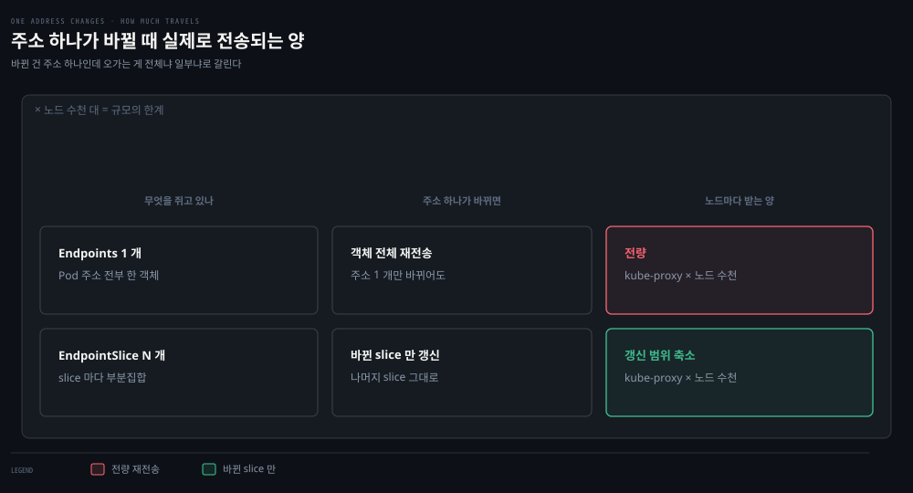

# StatefulSet·Endpoints·EndpointSlices — 서비스의 재료

---

## 핵심 요약
> 이 편 전체가 매달린 하나의 생각은 **"서비스가 실제로 가리키는 것은 Endpoints — readiness를 통과한 Pod IP의 목록"입니다.**
>
> 서비스를 배우기 전에 그 재료부터 보는 편입니다. StatefulSet은 Pod에 안정된 네트워크 정체성을 주는 워크로드이고, Endpoints는 서비스가 라우팅할 준비된 주소 목록이며, EndpointSlice는 그 목록이 대형 클러스터에서 병목이 되는 문제를 부분집합 분할로 푼 진화형입니다.


## 학습 목표
> 서비스를 배우기 전에 그 재료를 먼저 봅니다. 서비스가 실제로 무엇을 가리키는지 객체 단위로 짚을 수 있는 상태를 목표로 합니다.

이 내용을 읽고 나면:

1. StatefulSet이 Deployment에 더하는 4가지 보장과 그 DNS 결과물을 설명할 수 있습니다.
2. Endpoints의 ready/notReady 주소가 readiness probe와 어떻게 연결되는지 말할 수 있습니다.
3. 라벨 제거로 Pod를 서비스에서 떼어 내 디버깅하는 기법을 수행할 수 있습니다.
4. 대형 클러스터에서 Endpoints watch가 병목이 되는 구조를 설명할 수 있습니다.
5. EndpointSlice가 문제를 푸는 방식과 소비자가 감수할 제약(중복 주소 가능)을 말할 수 있습니다.

아래는 이 편 전체를 재료 세 개가 이어지는 순서로 이은 지도입니다. 단계 위의 이름이 본문에서 그것을 다루는 절입니다. 세 번째 칸만 재료가 아니라 문제입니다. Endpoints 가 규모에서 병목이 된다는 사실이 마지막 칸의 EndpointSlice 를 부른 이유입니다.




## 1. StatefulSet — 이름과 순서가 있는 Pod
> Deployment 가 Pod 를 익명 집단으로 다룬다면 StatefulSet 은 이름과 순서를 줍니다. 그 결과물이 Pod 마다 붙는 고유 DNS 레코드입니다.


### 풀려는 문제

Deployment 가 만든 Pod 는 이름이 매번 달라지고 서로 구별되지 않습니다. 무상태 웹 서버라면 그것이 오히려 편합니다. 문제는 멤버를 지목해야 하는 앱입니다 — 복제본이 누구에게 붙어야 하는지, 어느 인스턴스가 첫 번째인지를 적을 이름이 없습니다.

주소를 적어 두는 것으로는 해결되지 않습니다. Pod IP 는 휘발성이라 재시작 한 번에 바뀌기 때문입니다. 필요한 것은 재시작을 넘어 살아남는 이름이고, 이 절의 워크로드가 그것을 줍니다.

StatefulSet은 Deployment처럼 Pod를 관리하되 네 가지를 더 보장합니다. 안정적이고 고유한 네트워크 식별자, 안정적인 영속 스토리지, 순서 있는 우아한 배포·스케일링, 순서 있는 자동 롤링 업데이트입니다. 이런 요구가 없는 앱에는 Deployment가 더 맞습니다. 데이터를 외부 DB에 두는 서비스가 그런 경우입니다.

책의 Postgres가 좋은 예입니다. replica 2로 배포하면 postgres-0, postgres-1이 그 순서대로 만들어지고, DNS로 각 Pod를 집어서 부를 수 있게 됩니다.

```bash
kubectl exec dnsutils -- host postgres-0.postgres.default.svc.cluster.local.
postgres-0.postgres.default.svc.cluster.local has address 10.244.1.3
kubectl exec dnsutils -- host postgres
postgres.default.svc.cluster.local has address 10.105.214.153
```

`<Pod명>.<서비스명>.<네임스페이스>.svc.cluster.local`이 개별 Pod를, 서비스 이름이 서비스 주소를 돌려줍니다. Pod별 레코드와 서비스 레코드가 공존하는 셈입니다 — 특정 멤버를 지목할지, 서비스 전체를 부를지를 클라이언트가 고를 수 있습니다.

이 네트워크 정체성을 책임질 서비스는 사용자가 직접 만들어야 하고, `spec.serviceName` 에 그 이름을 적는 것은 **선택이 아니라 필수 필드**입니다. "가급적 headless"가 아닙니다. Pod 별 DNS 레코드(`<pod>.<svc>.<ns>.svc.cluster.local`)가 생기려면 그 서비스가 **headless(`clusterIP: None`)여야** 합니다. 일반 ClusterIP 서비스를 적으면 이름은 서비스 VIP 로만 풀리고 Pod 별 정체성이 생기지 않습니다(다음 편).

주의점도 함께 적어 둡니다. 기본 설정(`updateStrategy.type: RollingUpdate` + `podManagementPolicy: OrderedReady`)에서는 업데이트된 Pod가 끝내 ready가 되지 못하면 사람이 수동 개입해야 합니다. StatefulSet은 "고정된 영속 머신 집단"을 흉내 내는 범용 해법이라 특정 사례에서는 동작이 답답할 수 있고, 서드파티 대안도 많습니다 — 일상적 앱 배포에 쓰라는 물건이 아닙니다.


## 2. Endpoints — 서비스가 가리키는 실체
> 앞 장 readiness probe 의 결과가 여기 두 목록으로 나타납니다. 서비스가 트래픽을 보내는 곳은 ready 목록뿐입니다.


### 풀려는 문제

서비스에 셀렉터를 적으면 트래픽이 Pod 로 갑니다. 그런데 지금 실제로 어느 Pod 가 트래픽을 받고 있는지는 서비스 객체를 아무리 들여다봐도 안 나옵니다. 앞 장에서 "readiness 가 실패하면 트래픽에서 빠진다"고 배웠는데, 빠졌다는 사실이 어디에 기록되는지도 마찬가지입니다.

그 목록이 별개 객체로 있기 때문입니다. 서비스는 조건을 적을 뿐이고 명단은 다른 곳에 있습니다. 그 객체를 열어 보면 앞 장 프로브의 결과가 그대로 담겨 있습니다.

Endpoints는 서비스를 떠받치는 Pod가 무엇인지 식별합니다. 만들고 관리하는 주체는 서비스 자신이 아니라 **kube-controller-manager 의 endpoints 컨트롤러**입니다. 서비스의 라벨 셀렉터는 그 컨트롤러가 보는 입력이고, 셀렉터가 없는 서비스에서는 사용자가 Endpoints 를 직접 만듭니다.

구조는 포트 목록 하나와 주소 목록 둘입니다. readiness 검사를 통과한 주소는 `.addresses`에, 통과하지 못한 주소는 `.notReadyAddresses`에 오릅니다. 앞 장 Probe에서 본 "readiness 실패 → 트래픽 제외"의 실체가 바로 이 두 목록입니다. Endpoints 객체 하나만 watch하면 서비스 뒤 모든 Pod의 건강과 주소를 볼 수 있으니, 그 자체로 서비스 디스커버리 도구가 됩니다.

책의 라벨 실험이 동작 원리와 디버깅 기법을 한 번에 보여 줍니다. `kubectl label pod <이름> app=nope --overwrite`로 Pod의 라벨을 바꾸면 두 컨트롤러가 동시에 반응합니다. endpoints 컨트롤러는 그 Pod를 Endpoints에서 빼고, ReplicaSet 컨트롤러는 셀렉터에 맞는 Pod가 부족해졌으니 새 Pod를 만듭니다. Pod를 직접 만드는 주체는 Deployment가 아니라 그것이 관리하는 ReplicaSet입니다.

결과적으로 라벨을 뗀 Pod는 트래픽에서 빠진 채 살아 있으므로, 서비스는 멀쩡히 두고 문제 Pod만 붙잡아 조사할 수 있습니다. 저자가 "수없이 써먹었다"고 말하는 실전 기법입니다.


## 3. EndpointSlice — 규모가 만든 진화
> 문제는 규모에서 왔습니다. 주소 하나가 바뀔 때마다 전체 목록을 수천 개 kube-proxy 에 다시 보내던 구조를 부분집합 분할로 풀었습니다.



문제는 규모에서 옵니다. kube-proxy는 모든 노드에서 돌며 서비스 라우팅을 위해 클러스터의 모든 Endpoints를 watch합니다. 노드 수천 대·Pod 수만 개짜리 클러스터를 상상하면 — 주소 하나가 바뀔 때마다(롤링 업데이트·스케일·축출·헬스체크 실패) 갱신된 Endpoints 객체 전체가 수천 개의 kube-proxy에게 전송됩니다. Pod가 많을수록 객체는 커지고 변경은 잦아지니 etcd·API 서버·네트워크 전체가 짓눌립니다. 저자들은 "많은 사용자가 endpoint watch를 클러스터 규모의 궁극적 병목으로 꼽는다"고 전합니다.

EndpointSlice는 kube-proxy의 설계("어떤 Pod든 예고 없이 어떤 서비스로도 즉시 라우팅 가능해야 한다")를 유지한 채 watch 병목만 줄입니다. 방법은 분할입니다 — 서비스 하나가 Endpoints 하나(전체 Pod)를 만드는 대신, 각각 Pod의 부분집합을 담은 EndpointSlice 여러 개를 만듭니다. 주소 하나가 바뀌면 그 주소가 속한 slice만 전송되므로 데이터 이동량이 급감합니다.

위 도식이 두 방식을 나란히 둔 것이라 차이가 전송량으로 드러납니다. 위 줄이 Endpoints, 아래 줄이 EndpointSlice입니다. 왼쪽 열은 각 방식이 쥐고 있는 객체, 가운데 열은 주소 하나가 바뀔 때 실제로 갱신되는 단위입니다. 오른쪽 열에 적힌 것이 그때 노드마다 받는 양입니다.

세부 규칙도 실무에 닿습니다. slice당 최대 주소 수는 kube-controller-manager의 `--max-endpoints-per-slice`로 정하며 기본 100, 최대 1,000입니다. 컨트롤러는 새 slice를 만들기 전에 기존 slice를 채우려 하지만 재균형(rebalance)은 하지 않습니다. Kubernetes에는 트랜잭션 API가 없어서 같은 주소가 일시적으로 여러 slice에 나타날 수 있고, slice를 소비하는 코드(kube-proxy 포함)는 이를 감안해야 합니다. 특정 서비스의 slice들은 `kubernetes.io/service-name` 라벨로 조회합니다.

호환도 챙겨 놨습니다. 별도의 **EndpointSliceMirroring 컨트롤러**가 Endpoints 를 slice 로 미러링해서, 기존 시스템이 Endpoints 를 계속 쓰는 동안 slice 를 진실의 원천으로 삼을 수 있습니다. 앞의 EndpointSlice 컨트롤러와는 다른 컨트롤러입니다.

미러링이 안 되는 예외는 넷입니다.

- 대응하는 서비스가 없는 경우
- **서비스에 셀렉터가 지정된 경우** — 그러면 EndpointSlice 컨트롤러가 직접 만들므로 미러링할 필요가 없습니다
- `endpointslice.kubernetes.io/skip-mirror: true` 라벨이 붙은 경우
- leader 어노테이션이 붙은 경우

책 시점(1.20)의 EndpointSlice는 1.17부터 베타 상태였습니다.

> 💬 **비유**: Endpoints는 반 전체 명단이 적힌 한 장짜리 게시물입니다. 전학생 한 명이 와도 게시물 전체를 새로 인쇄해 전교(모든 kube-proxy)에 다시 돌려야 합니다.
>
>  EndpointSlice는 명단을 분반 단위로 쪼갠 낱장들입니다 — 전학생이 3반에 오면 3반 낱장만 다시 돌리면 됩니다. 다만 학기 중 분반을 다시 섞지는 않고(재균형 없음), 이사 중인 학생이 잠깐 두 반 명단에 동시에 실릴 수 있다는(중복 가능) 각오는 해야 합니다.


## 심화 학습
> 책 밖에서 보강한 내용입니다. 출처를 함께 남깁니다.

- EndpointSlice는 Kubernetes 1.21에서 GA가 됐고(v1), 1.19부터 kube-proxy가 기본적으로 slice를 읽습니다. 책이 경고한 "베타라 변경될 수 있음"은 해소된 셈입니다 — [K8s 문서 — EndpointSlices](https://kubernetes.io/docs/concepts/services-networking/endpoint-slices/) 참조.
- Endpoints의 은퇴도 진행 중입니다. Kubernetes 1.33부터 Endpoints API가 공식 deprecated로 표시됐고 신규 코드에는 EndpointSlice 사용이 권고됩니다. 근거는 [K8s 블로그 — Endpoints deprecation](https://kubernetes.io/blog/2025/04/24/endpoints-deprecation/)입니다. 책의 "substantial notice와 함께 sunset될 것"이라는 예측 그대로입니다.
- StatefulSet의 오브젝트 관점 상세(ordinal·Pets vs Cattle·headless와의 결합)는 형제 정독본 [『Kubernetes in Action』 16-01](../kubernetes-in-action/16-01.StatefulSet%20%EA%B8%B0%EC%B4%88%20%E2%80%94%20Pets%20vs%20Cattle%C2%B7ordinal%C2%B7headless%20Service.md)이 정본입니다. 이 편은 네트워킹 관점(DNS 정체성)만 다룹니다.


## 결정 치트시트
> 서비스의 재료를 다룰 때의 판단 기준입니다.

| 상황 | 판단 |
|------|------|
| Pod마다 고정된 이름·주소로 불러야 함 (DB 클러스터 등) | StatefulSet + headless 서비스 — Deployment로는 불가 |
| 특정 Pod만 트래픽에서 빼고 살아 있는 채 조사하고 싶음 | 라벨 제거 기법 — endpoint에서 빠지고 대체 Pod가 자동 생성됨 |
| 서비스 뒤 Pod들의 준비 상태를 프로그램으로 감시 | Endpoints/EndpointSlice watch — ready·notReady 목록이 그 답 |
| 수천 노드 클러스터에서 서비스 갱신이 느림 | EndpointSlice 동작 확인 + max-endpoints-per-slice 검토 |
| slice를 직접 소비하는 코드 작성 | 같은 주소의 일시적 중복 등장을 반드시 처리 |


## 면접에서 받을 만한 질문
> 답을 가리고 스스로 말해 본 뒤, 아래 정답 절에서 맞춰 봅니다.

1. EndpointSlice를 "한 줄"로 정의한다면?
2. Endpoints의 ready/notReady 두 목록은 무엇과 연결되나요?
3. Endpoints watch가 대형 클러스터에서 병목이 되는 구조를 설명해 보세요.
4. StatefulSet의 서비스는 왜 headless여야 하나요?
5. Pod는 정상인데 서비스에서 트래픽이 안 옵니다. 어디부터 보나요?
6. EndpointSlice 도입으로 kube-proxy 설계가 바뀌었나요?
7. (빈칸) slice당 주소 수는 기본 ___개, 최대 ___개이며, 컨트롤러는 기존 slice를 먼저 채우되 ___은 하지 않고, 트랜잭션 API 부재로 같은 주소가 ___에 일시 등장할 수 있습니다.


## 정답 (자답 후 펼치기)
> 위 §면접에서 받을 만한 질문에 *먼저 자답한 뒤* 아래를 읽으세요. 자답 없이 먼저 읽으면 학습 효과가 0입니다.

### 1. EndpointSlice 한 줄 정의
"EndpointSlice란 서비스 뒤 Pod 주소 목록을 부분집합 여러 개로 쪼갠 리소스로, 주소 변경 시 해당 slice만 watcher에게 전송해 대형 클러스터의 Endpoints watch 병목을 줄입니다."

### 2. ready/notReady와 readiness probe
Endpoints의 ready/notReady 두 목록이 readiness probe의 실체적 결과입니다. 서비스가 트래픽을 보낼 주소는 ready(`.addresses`) 목록뿐이고, readiness에 실패한 주소는 `.notReadyAddresses`로 밀려나 트래픽에서 빠집니다.

### 3. Endpoints watch 병목의 구조
"모든 노드의 kube-proxy가 모든 Endpoints를 watch + 변경 시 객체 전체 재전송"입니다. Pod가 많을수록 객체가 크고 변경(롤링·스케일·축출·헬스체크)이 잦아, 노드 수 × 객체 크기 × 변경 빈도가 곱으로 악화돼 etcd·API 서버·네트워크를 짓누릅니다.

### 4. StatefulSet의 서비스가 headless여야 하는 이유
`spec.serviceName` 은 필수 필드이고, 거기 적은 서비스가 headless(`clusterIP: None`)여야 Pod별 DNS 레코드가 생기기 때문입니다. StatefulSet의 가치가 Pod별 고정 정체성인데, 일반 ClusterIP를 적으면 이름이 서비스 VIP로만 풀려 그 정체성이 사라집니다. headless여야 `postgres-0.postgres...` 같은 Pod별 레코드가 서고, 클라이언트가 특정 멤버를 직접 지목할 수 있습니다.

### 5. Pod 정상인데 트래픽이 안 올 때
`kubectl describe endpoints <서비스>`로 그 Pod IP가 Addresses에 있는지, NotReadyAddresses로 밀려나 있는지 봅니다. 후자라면 readiness probe 실패이고, 아예 없다면 라벨 셀렉터 불일치를 의심합니다.

### 6. EndpointSlice가 kube-proxy 설계를 바꿨나
아닙니다. "어떤 Pod든 어떤 서비스로 즉시 라우팅 가능"이라는 전제(전 노드 watch)는 유지하고, watch당 전송되는 데이터 단위만 전체 목록에서 부분집합으로 줄였습니다.

### 7. 빈칸 정답
기본 **100**개, 최대 **1,000**개이며, 컨트롤러는 기존 slice를 먼저 채우되 **재균형(rebalance)**은 하지 않고, 같은 주소가 **여러 slice**에 일시 등장할 수 있습니다.


## 핵심 개념 체크리스트
> 다섯 항목을 막힘없이 답할 수 있으면 다음 편으로 넘어가도 좋습니다.
- [ ] StatefulSet의 4가지 보장과 Pod별 DNS 형식을 말할 수 있는가?
- [ ] ready/notReady 주소와 readiness probe의 연결을 설명할 수 있는가?
- [ ] 라벨 제거 디버깅에서 두 컨트롤러가 각각 어떻게 반응하는지 아는가?
- [ ] Endpoints watch 병목의 곱셈 구조(노드 수 × 객체 크기 × 변경 빈도)를 설명할 수 있는가?
- [ ] slice의 기본/최대 크기와 재균형 없음·중복 가능 제약을 아는가?


## 참고 자료
- 《Networking and Kubernetes: A Layered Approach》(James Strong·Vallery Lancey, O'Reilly, 2021, ISBN 978-1492081654) Ch5
- [K8s 문서 — EndpointSlices](https://kubernetes.io/docs/concepts/services-networking/endpoint-slices/)
- [K8s 블로그 — Endpoints API deprecation](https://kubernetes.io/blog/2025/04/24/endpoints-deprecation/)
- 이전 편: [04-03. NetworkPolicy와 DNS](./04-03.NetworkPolicy%EC%99%80%20DNS%20%E2%80%94%20%ED%81%B4%EB%9F%AC%EC%8A%A4%ED%84%B0%20%EC%95%88%EC%9D%98%20%EB%B0%A9%ED%99%94%EB%B2%BD%EA%B3%BC%20%EC%9D%B4%EB%A6%84.md)
- 다음 편: [05-02. Service 5유형](./05-02.Service%205%EC%9C%A0%ED%98%95%20%E2%80%94%20ClusterIP%EC%97%90%EC%84%9C%20LoadBalancer%EA%B9%8C%EC%A7%80.md)
