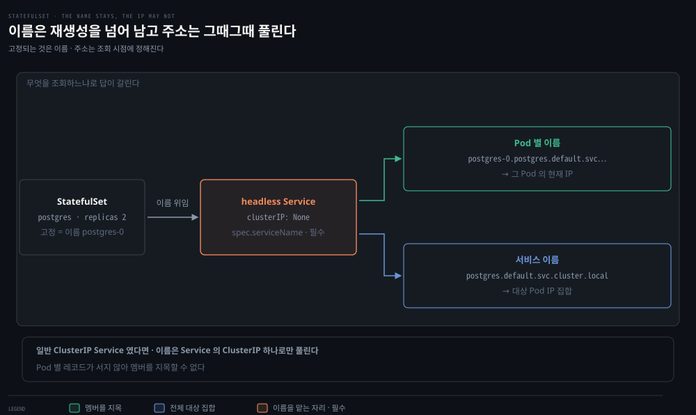
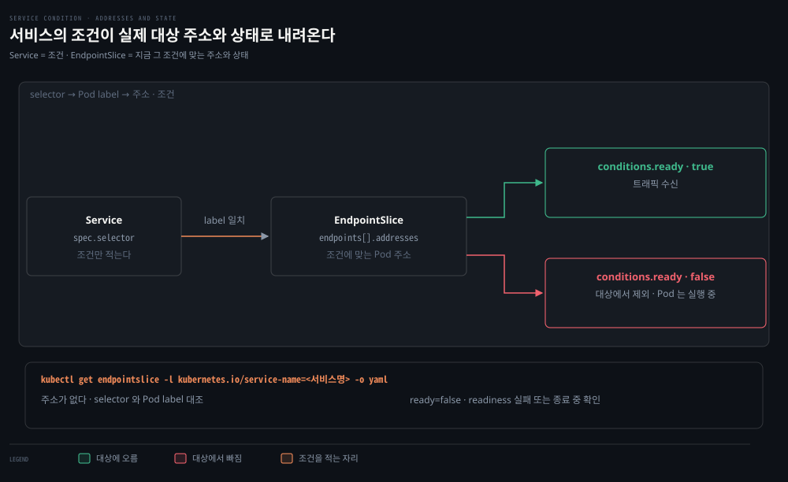

# StatefulSet·Endpoints·EndpointSlices — 서비스의 재료

---

## 핵심 요약
> 이 편이 붙드는 생각은 **"이름을 고정하는 일과 대상 주소를 표현하는 일은 서로 다른 객체가 한다"**입니다.

서비스를 배우기 전에 그 재료부터 봅니다. StatefulSet은 Pod에 재생성을 넘어 살아남는 이름을 주고, EndpointSlice는 서비스가 지금 실제로 가리키는 주소와 상태를 담습니다. Endpoints는 그 목록을 한 객체에 담던 앞 세대로, 갱신 범위를 줄이려고 여러 slice로 나뉘었습니다.


## 학습 목표
> 서비스가 실제로 무엇을 가리키는지 객체 단위로 짚고, 조건을 바꿨을 때 컨트롤러들의 반응을 예측할 수 있는 상태를 목표로 합니다.

이 내용을 읽고 나면:

1. StatefulSet이 고정하는 이름과 바뀔 수 있는 Pod IP를 구분해 설명할 수 있습니다.
2. Service의 selector가 EndpointSlice의 주소·조건으로 내려오는 과정을 말할 수 있습니다.
3. EndpointSlice를 조회해 대상 누락과 준비 상태를 확인하는 순서를 밟을 수 있습니다.
4. Endpoints에서 EndpointSlice로 바뀐 이유를 갱신 범위로 설명할 수 있습니다.

아래 지도에서 세 번째 칸만 재료가 아니라 문제이고, 그 문제가 네 번째 칸을 불렀습니다.


## 1. StatefulSet — 재생성을 넘어 남는 이름
> Pod IP는 Pod가 다시 만들어질 때 바뀔 수 있습니다. StatefulSet이 고정하는 것은 주소가 아니라 이름입니다.

### 풀려는 문제

postgres 복제본 둘이 서로를 멤버로 알아야 한다고 해 봅시다. 한쪽 Pod가 노드 축출이나 롤링 업데이트로 삭제되고 다시 만들어지면 새 Pod는 대개 다른 IP를 받습니다. 상대 IP를 설정에 적어 둔 쪽은 그 시점에 멤버를 잃습니다.

여기서 컨테이너 재시작과 Pod 재생성은 구분해야 합니다. 컨테이너만 죽었다 살아나면 Pod는 그대로이므로 IP도 그대로입니다. IP가 바뀌는 것은 Pod 객체가 사라지고 새로 만들어질 때입니다.

그래서 필요한 것은 재생성을 넘어 남는 **이름**입니다. 이름이 남으면 주소가 바뀌어도 조회 시점에 현재 주소를 다시 받아올 수 있습니다. StatefulSet이 보장하는 네 가지(안정적 네트워크 식별자, 안정적 영속 스토리지, 순서 있는 배포·스케일링, 순서 있는 롤링 업데이트) 중 이 편이 쓰는 것은 첫 번째뿐입니다. ordinal·Pets vs Cattle·스토리지·업데이트 정책은 형제 정독본 [『Kubernetes in Action』 16-01](../kubernetes-in-action/16-01.StatefulSet%20%EA%B8%B0%EC%B4%88%20%E2%80%94%20Pets%20vs%20Cattle%C2%B7ordinal%C2%B7headless%20Service.md)이 정본입니다.

### 이름을 맡는 서비스

이 정체성을 책임질 서비스는 사용자가 직접 만들어야 하고 `spec.serviceName`에 그 이름을 적는 것은 필수입니다. Pod별 DNS 레코드가 생기려면 그 서비스가 **headless**, 곧 `clusterIP: None`을 지정해 가상 IP를 할당하지 않는 서비스여야 합니다. 서비스 유형 전반은 다음 편이 다룹니다. headless인지 아닌지가 이름의 조회 결과를 가릅니다.



| 조회하는 이름 | 돌려주는 것 |
|---|---|
| `postgres-0.postgres.default.svc.cluster.local` | 그 Pod의 현재 IP |
| `postgres.default.svc.cluster.local` (headless) | 대상 Pod IP 집합[^dnsheadless] |
| 일반 ClusterIP 서비스 이름 | 그 서비스의 ClusterIP 하나 |

[^dnsheadless]: "Unlike normal Services, this resolves to the set of IPs of all of the Pods selected by the Service." 기본적으로 ready인 Pod만 레코드를 받습니다 — [K8s 문서 — DNS for Services and Pods](https://kubernetes.io/docs/concepts/services-networking/dns-pod-service/).

두 레코드가 공존하므로 클라이언트는 특정 멤버를 지목할지 서비스 전체를 부를지 고를 수 있습니다.

> ⚠️ 책의 DNS 예제는 `postgres` 이름이 `10.105.214.153`으로 풀리는 결과를 보여 주는데, 이는 ClusterIP가 할당된 서비스의 응답 형태입니다. 원서에서 그 서비스가 headless로 구성됐는지는 확인하지 못했습니다. 위 표는 책의 실측이 아니라 공식 문서의 조회 규칙으로 정리한 설명용 예시입니다.


## 2. EndpointSlice — 서비스의 실제 대상 목록
> Service에 적는 것은 selector라는 조건뿐입니다. 지금 그 조건에 맞는 주소와 상태는 EndpointSlice에 있습니다.

### 풀려는 문제

Service에 selector를 적으면 트래픽이 Pod로 갑니다. 그런데 지금 어느 Pod가 실제 대상인지, readiness에 실패한 Pod가 빠졌다는 사실이 어디에 적히는지는 Service 객체를 들여다봐도 나오지 않습니다.

조건과 명단이 다른 객체이기 때문입니다. Service는 조건을 적고, 컨트롤 플레인이 그 조건에 맞는 Pod를 찾아 주소와 상태를 EndpointSlice에 씁니다. 대상 Pod가 StatefulSet 것일 필요는 없습니다 — Deployment가 만든 Pod도 라벨만 맞으면 대상이 됩니다.



### 조회와 진단 순서

특정 서비스의 slice들은 `kubernetes.io/service-name` 라벨로 모읍니다.

```bash
kubectl get endpointslice -l kubernetes.io/service-name=postgres -o yaml
```

```yaml
endpoints:
  - addresses:
      - "10.244.1.3"      # 대상 Pod 의 주소
    conditions:
      ready: true         # 이 endpoint 가 트래픽을 받는가
    nodeName: node-1
```

여기서 `ready`는 readiness probe 하나의 결과와 같은 말이 아닙니다. 공식 문서는 `ready`를 serving이면서 terminating이 아닌 상태의 줄임으로 정의합니다[^cond]. probe를 통과해도 Pod가 종료 중이면 false가 됩니다. `publishNotReadyAddresses: true`인 서비스에서는 언제나 true입니다.

아래 설명은 selector가 있는 서비스를 기준으로 합니다. `publishNotReadyAddresses`는 기본값(false)이고 Pod는 종료 중이 아닌 상태로 둡니다.

[^cond]: "The `ready` condition is essentially a shortcut for checking `serving` and not `terminating`" — [K8s 문서 — EndpointSlices](https://kubernetes.io/docs/concepts/services-networking/endpoint-slices/). `serving`·`terminating`은 1.26에서 안정화됐습니다.

트래픽이 안 온다면 조건에서 주소로 내려갑니다.

1. Service의 `spec.selector`가 무엇을 고르는지 확인합니다.
2. 대상 Pod의 라벨이 그 selector와 맞는지 대조합니다.
3. EndpointSlice에서 그 Pod 주소가 `addresses`에 있는지, `conditions.ready`가 무엇인지 봅니다.

주소가 아예 없으면 라벨이 selector에 맞지 않거나 Pod가 아직 만들어지지 않은 상태입니다. `ready`가 false면 readiness probe 실패가 후보 중 하나이고, 종료 중이거나 Ready 컨디션을 떨어뜨리는 다른 조건일 수도 있습니다. 결과 하나로 원인을 단정하지 말고 Pod의 상태와 이벤트를 함께 봅니다.

### 라벨을 바꾸면 무슨 일이 생기나

Pod의 라벨을 `kubectl label pod <이름> app=nope --overwrite`로 바꾸면 그 Pod는 Service의 selector에서 벗어나 대상 목록에서 빠집니다. 여기서 대상 목록에서 빠지는 것과 기존 연결이 즉시 끊기는 것은 다릅니다. 새 연결이 그 Pod로 배정되지 않을 뿐, 이미 맺어진 연결은 그 자리에서 함께 끊기지 않습니다.

대체 Pod가 생기는지는 별개 조건입니다. 바꾼 라벨이 **ReplicaSet의 selector에서도 벗어날 때만** ReplicaSet 컨트롤러가 복제본이 부족하다고 보고 새 Pod를 만듭니다[^rs]. Service의 selector만 바뀌었다면 복제본 수는 그대로입니다. StatefulSet에서도 같은 결과를 기대하면 안 됩니다 — 이 기법은 ReplicaSet이 복제본을 세는 방식에 기대고 있습니다.

[^rs]: "Pods may be removed from a ReplicaSet's target set by changing their labels ... will be replaced automatically" — [K8s 문서 — ReplicaSet](https://kubernetes.io/docs/concepts/workloads/controllers/replicaset/#isolating-pods-from-a-replicaset).

두 조건이 함께 맞으면 문제 Pod를 살려 둔 채 서비스에서만 떼어 조사할 수 있습니다. 저자가 실전에서 수없이 썼다고 말하는 기법입니다.


## 3. 왜 목록을 쪼갰나
> 문제는 규모에서 왔습니다. 주소 하나가 바뀔 때 오가는 양을 갱신 단위를 줄여 낮췄습니다.

kube-proxy는 모든 노드에서 돌며 서비스 라우팅을 위해 대상 목록을 watch합니다. 앞 세대인 Endpoints는 서비스 하나의 주소를 한 객체에 담았습니다. 그래서 주소 하나만 바뀌어도 그 객체 전체가 kube-proxy 수천 개로 다시 갔습니다. Pod가 많을수록 객체는 커지고 변경은 잦아지니, 노드 수 × 객체 크기 × 변경 빈도가 곱으로 불어나 etcd·API 서버·네트워크를 함께 짓누릅니다.


EndpointSlice는 kube-proxy의 전제("어떤 Pod든 예고 없이 어떤 서비스로도 즉시 라우팅 가능해야 한다")를 유지한 채 이 곱셈의 가운데 항만 줄입니다. 서비스 하나의 주소를 부분집합을 담은 slice 여러 개로 나누면 갱신 대상이 목록 전체가 아니라 바뀐 부분으로 좁아집니다.

주소 하나 변경이 반드시 slice 하나만 건드린다고 단정할 수는 없습니다. 컨트롤러가 기존 slice를 정리하고 채우며 여럿을 함께 갱신하기도 합니다. 요점은 갱신 단위가 목록 전체에서 부분집합으로 내려왔다는 것입니다.

대신 소비하는 쪽이 값을 치릅니다. 컨트롤러는 갱신을 줄이는 쪽을 택하느라 slice를 고르게 채우지도 재균형하지도 않고, 같은 주소가 잠시 여러 slice에 겹쳐 보일 수 있어 읽는 코드가 중복을 스스로 걸러야 합니다. slice 하나에 담을 주소 수(`--max-endpoints-per-slice`)를 비롯한 세부 규칙과 수치는 [공식 문서](https://kubernetes.io/docs/concepts/services-networking/endpoint-slices/)에 있습니다.

### Endpoints는 지금 어디에 있나

책 시점(1.20)의 EndpointSlice는 베타였지만 1.21에서 GA가 됐고, 1.19부터는 kube-proxy가 기본적으로 slice를 읽습니다. 책이 남긴 "베타라 바뀔 수 있음"이라는 경고는 그래서 해소된 상태입니다.

방향은 오히려 반대로 굳었습니다. Endpoints API는 1.33에서 공식 deprecated가 됐고, 호환을 위해 컨트롤 플레인이 사용자가 만든 Endpoints를 slice로 미러링해 주지만 그 미러링 기능도 함께 deprecated입니다. 그래서 selector 없는 서비스에 주소를 수동 지정할 때는 미러링에 기대지 말고 **EndpointSlice를 직접 만드는 것**이 현재 공식 권고입니다[^dep].

권고가 그쪽으로 기운 이유는 호환 문제만이 아닙니다. 듀얼스택이나 `trafficDistribution`처럼 Endpoints 구조로는 표현할 수 없어 slice에만 있는 기능이 계속 늘고 있어서, 새로 쓰는 코드가 옛 API에 남을 이유가 줄어듭니다.

[^dep]: "Users who manually specify endpoints for selectorless Services should do so by creating EndpointSlice resources directly, rather than by creating Endpoints resources" — [K8s 문서 — EndpointSlices](https://kubernetes.io/docs/concepts/services-networking/endpoint-slices/) §EndpointSlice mirroring. 미러링 기능의 deprecated 표시도 같은 절에 있습니다. Endpoints API 자체의 1.33 deprecated 는 [K8s 블로그](https://kubernetes.io/blog/2025/04/24/endpoints-deprecation/)가 근거입니다.


## 결정 치트시트
> 서비스의 재료를 다룰 때의 판단 기준입니다.

| 상황 | 판단 |
|------|------|
| 멤버를 이름으로 지목해야 함 (DB 클러스터 등) | StatefulSet + headless 서비스 — 고정되는 것은 이름이지 IP가 아님 |
| 서비스 대상에서 Pod가 빠졌는지 확인 | `kubectl get endpointslice -l kubernetes.io/service-name=<서비스명>` |
| 특정 Pod만 서비스에서 빼고 조사 | 라벨 변경 — 대체 Pod는 ReplicaSet selector에서도 벗어날 때만 생김 |
| selector 없는 서비스에 주소를 수동 지정 | EndpointSlice 직접 생성 — Endpoints + 미러링은 deprecated |
| slice를 소비하는 코드 작성 | 같은 주소의 일시적 중복을 소비 측에서 거름 |


## 적용 문제
> 답을 가리고 스스로 말해 본 뒤, 아래 정답 절에서 맞춰 봅니다.

1. postgres-0이 재생성되어 IP가 바뀌면 이름과 DNS 조회 결과는 각각 어떻게 되나요?
2. Service가 선택한 Pod가 EndpointSlice에서 `ready: false`입니다. 무엇을 확인하나요?
3. Pod의 라벨을 바꾼 뒤, 서비스 대상 목록과 ReplicaSet 복제본 수에는 각각 무슨 일이 생기나요?
4. Endpoints의 전체 갱신과 EndpointSlice의 분할 갱신은 무엇이 다른가요?


## 정답 (자답 후 펼치기)
> 위 §적용 문제에 먼저 자답한 뒤 읽으면 기억에 더 오래 남습니다.

### 1. 재생성 후의 이름과 주소
이름은 그대로이고 주소만 바뀝니다. 이름은 ordinal에서 오므로 Pod가 다시 만들어져도 `postgres-0`이고, headless 서비스 아래에서 `postgres-0.postgres.default.svc.cluster.local`을 다시 조회하면 그 시점의 새 IP가 돌아옵니다. 조회가 매번 현재 주소를 주기 때문에 멤버를 이름으로 적어 둔 쪽은 재생성을 견딥니다. 컨테이너만 재시작됐다면 Pod가 그대로라 IP도 바뀌지 않습니다.

### 2. ready가 false일 때
`ready`는 "`serving`이면서 `terminating`이 아님"의 줄임이라 원인이 하나로 정해지지 않습니다. readiness probe 실패가 후보 중 하나이고, Pod가 종료 중이거나 Ready 컨디션을 떨어뜨리는 다른 조건일 수도 있습니다. `kubectl describe pod`로 컨디션과 이벤트를 확인합니다.

### 3. 라벨 변경 후의 두 결과
서비스 대상에서는 빠집니다 — selector와 맞지 않으므로 EndpointSlice에서 주소가 사라지고 새 연결이 배정되지 않습니다. 다만 이미 맺어진 연결이 그 순간 함께 끊기지는 않습니다. 복제본 수는 조건부입니다 — 바꾼 라벨이 ReplicaSet의 selector에서도 벗어나야 부족분이 채워지고, Service selector만 벗어났다면 그대로입니다.

### 4. 전체 갱신과 분할 갱신
Endpoints는 주소를 한 객체에 담아 하나만 바뀌어도 객체 전체가 모든 kube-proxy로 다시 갑니다. EndpointSlice는 같은 주소들을 부분집합으로 나눠 두어 갱신 범위가 바뀐 부분으로 좁아집니다. 대신 소비 측이 여러 객체를 합쳐 읽고 일시적 중복도 걸러야 합니다.


## 핵심 개념 체크리스트
> 네 항목을 막힘없이 답할 수 있으면 다음 편으로 넘어갑니다.
- [ ] StatefulSet이 고정하는 것과 고정하지 않는 것을 구분할 수 있는가?
- [ ] headless와 일반 ClusterIP에서 이름의 조회 결과가 어떻게 갈리는지 말할 수 있는가?
- [ ] selector → Pod label → EndpointSlice 주소·조건 순서로 대상 누락을 진단할 수 있는가?
- [ ] 갱신 단위를 쪼갠 이유와 소비 측이 감수할 제약을 설명할 수 있는가?


## 참고 자료
- 《Networking and Kubernetes: A Layered Approach》(James Strong·Vallery Lancey, O'Reilly, 2021, ISBN 978-1492081654) Ch5
- [K8s 문서 — EndpointSlices](https://kubernetes.io/docs/concepts/services-networking/endpoint-slices/)
- [K8s 문서 — DNS for Services and Pods](https://kubernetes.io/docs/concepts/services-networking/dns-pod-service/) · [StatefulSets](https://kubernetes.io/docs/concepts/workloads/controllers/statefulset/)
- [K8s 블로그 — Endpoints API deprecation](https://kubernetes.io/blog/2025/04/24/endpoints-deprecation/)
- 이전 편: [04-03. NetworkPolicy와 DNS](./04-03.NetworkPolicy%EC%99%80%20DNS%20%E2%80%94%20%ED%81%B4%EB%9F%AC%EC%8A%A4%ED%84%B0%20%EC%95%88%EC%9D%98%20%EB%B0%A9%ED%99%94%EB%B2%BD%EA%B3%BC%20%EC%9D%B4%EB%A6%84.md)
- 다음 편: [05-02. Service 5유형](./05-02.Service%205%EC%9C%A0%ED%98%95%20%E2%80%94%20ClusterIP%EC%97%90%EC%84%9C%20LoadBalancer%EA%B9%8C%EC%A7%80.md)
