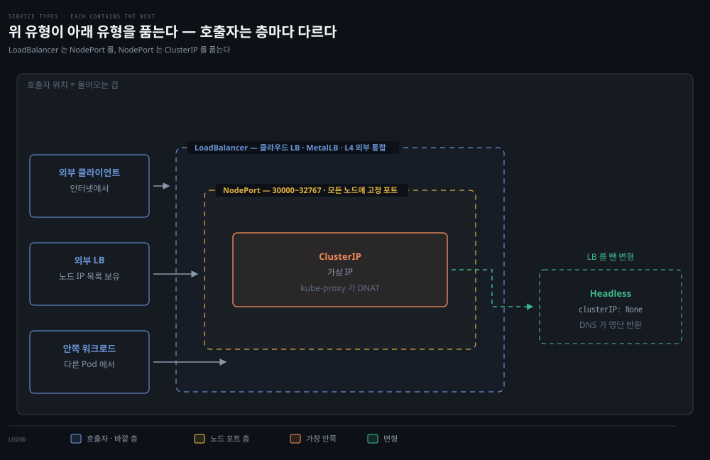

# Service 5유형 — ClusterIP에서 LoadBalancer까지

## 핵심 요약
> 이 편 전체가 매달린 하나의 생각은 "Service 유형은 층층이 쌓인다 — ClusterIP 위에 NodePort가, NodePort 위에 LoadBalancer가 얹힌다"입니다.
> 휘발성 Pod IP 문제를 푸는 안정된 가상 IP(ClusterIP)가 바닥이고, 그것을 노드 포트로 여는 것이 NodePort, 그 앞에 외부 로드밸런서를 세우는 것이 LoadBalancer입니다. 옆길로 headless(로드밸런싱 포기, DNS로 전체 명단 반환)와 ExternalName(CNAME 별칭)이 있습니다. 유형 선택은 "누가, 어디서 이 서비스를 불러야 하는가"의 답입니다.

## 학습 목표

이 내용을 읽고 나면:

1. Service 5유형이 층으로 쌓이는 구조와 각각의 자리(내부·노드·외부)를 설명할 수 있습니다.
2. ClusterIP의 배선을 veth·netns·pause 컨테이너·iptables 체인까지 해부할 수 있습니다.
3. externalTrafficPolicy Cluster/Local의 거래(2차 홉 vs 소스 IP 보존·불균형)를 설명할 수 있습니다.
4. headless 서비스의 용처와 DNS 로드밸런싱이 위험한 이유를 말할 수 있습니다.
5. 서비스가 안 될 때의 점검 순서(포트 매칭·라벨·Endpoints)를 수행할 수 있습니다.

## 본문 정리

### 1. 공통 구조 — 셀렉터가 Endpoints를 만든다

서비스는 클러스터 안 로드밸런싱 추상화입니다. `.spec.type`으로 유형을 정하며 공식 유형은 ClusterIP·NodePort·LoadBalancer·ExternalName 넷입니다(headless는 뒤에서 보듯 ClusterIP의 변형). 모든 셀렉터 기반 서비스는 표준 Pod 셀렉터로 대상을 정하고, 디스커버리를 위해 전편의 Endpoints(또는 EndpointSlice)를 만듭니다.

한 가지 배경 지식 — Pod 안 컨테이너들이 네임스페이스를 공유할 수 있는 것은 pause 컨테이너 덕분입니다. Pod마다 만들어지는 pause 컨테이너가 Pod의 네임스페이스들을 쥐고 있는 부모 컨테이너 역할을 합니다.

### 2. ClusterIP — 기본값이자 바닥층

Pod IP는 Pod의 생명주기를 따라가므로 클라이언트가 기댈 수 없습니다. ClusterIP 서비스는 매칭되고 준비된 모든 Pod로 매핑되는 단일 가상 IP의 내부 로드밸런서를 제공합니다. 주소는 API 서버의 `service-cluster-ip-range` 안에서 자동 할당되거나 수동 지정할 수 있고, 클러스터 내부에서만 라우팅됩니다. 그 주소를 실제 Pod로 보내는 것은 kube-proxy의 일이며, 통상 L4 로드밸런싱이라 한계도 L4의 것입니다 — 장수 연결이 쌓인 오래된 Pod에 부하가 쏠리거나, 소수 클라이언트의 다량 요청이 분배를 비틀 수 있습니다.

책의 백미는 ClusterIP가 추상화한 것들을 전부 벗겨 보는 해부입니다. 2~4장의 도구가 총출동합니다.

1. Pod의 `ip a`로 인터페이스(eth0@if5)를 확인하고, 노드의 `ip a`에서 짝이 되는 veth(veth45d1f3e8@if5)를 찾습니다.
2. 노드의 `ip netns list`로 Pod의 네트워크 네임스페이스(cni-...)를 확인합니다.
3. `ip netns pid`로 그 네임스페이스의 프로세스를 찾으면 둘이 나옵니다 — 웹 서버 프로세스, 그리고 네임스페이스를 쥔 `/pause`.
4. 노드 iptables에서 ClusterIP로 매칭되는 KUBE-SVC 체인을 찾고, 그 안의 KUBE-SEP 체인이 Pod IP:8080으로 DNAT하는 것을 확인합니다 — `kubectl get ep`의 출력과 정확히 일치합니다.

접근 경로 셋(서비스 이름 DNS·ClusterIP·Pod IP:8080)이 모두 같은 Pod에 닿는 것을 확인하면, "서비스"라는 말의 실체가 DNS 레코드 + iptables DNAT 체인 + Endpoints 목록의 삼위일체라는 것이 손에 잡힙니다.

### 3. NodePort — 노드의 문을 여는 층

NodePort 서비스는 모든 노드에 고정 포트를 열어 해당 Pod로 라우팅합니다. 외부 소프트웨어(예: 로드밸런서)는 노드 IP와 그 포트만 알면 됩니다. 포트는 `--service-node-port-range`(기본 30000~32767) 안에서 지정하거나 자동 선택되며, 어느 노드로 접속해도 클러스터 어딘가의 백엔드 Pod로 전달됩니다 — 다른 노드의 Pod로 전달되는 2차 홉이 생길 수 있어 다소 비효율적입니다.

여기서 externalTrafficPolicy가 등장합니다. 외부 트래픽을 노드-로컬로 한정할지 클러스터 전체로 보낼지의 선택입니다.

| 값 | 동작 | 거래 |
|-----|------|------|
| Cluster (기본) | 모든 노드의 규칙이 클러스터 어디의 백엔드로든 전달 | 전체 부하 분산은 좋지만 2차 홉 발생, 클라이언트 소스 IP가 가려짐 |
| Local | 그 노드에 백엔드가 있을 때만 로컬로 전달 | 소스 IP 보존·홉 제거. 대신 노드별 Pod 수 차이만큼 불균형 위험, 로컬 백엔드 없는 노드로 온 패킷은 폐기 |

NodePort 단독 사용의 한계도 분명합니다 — 요청한 포트를 할당 못 하면 배포가 실패하고, 포트를 전 앱에 걸쳐 추적해야 하며(수동 지정 시 클러스터 간 충돌), 클라이언트가 노드 IP 목록을 알아야 하는데 그 목록은 낡기 쉽습니다. 그래서 NodePort는 단독으로 쓰기보다 다른 유형의 토대가 됩니다.

### 4. Headless — 로드밸런싱을 포기하고 명단을 준다

headless는 공식 유형이 아니라 `.spec.clusterIP: "None"`인 서비스입니다(비워 두는 것과 다릅니다 — 비우면 자동 할당). 로드밸런싱 기능이 없어지는 대신 Endpoints를 만들고 서비스 DNS 레코드가 선택된 ready Pod 전부를 가리키게 합니다 — 쿼리 하나에 Pod IP 4개가 A 레코드로 돌아오는 식입니다. 어느 것을 쓸지는 클라이언트의 몫입니다.

가치는 "Kubernetes API 없이 엔드포인트를 watch하는 범용 수단"이라는 데 있습니다. DNS 조회는 API 통합보다 훨씬 쉽고, 서드파티 소프트웨어에선 API 통합이 불가능할 수도 있습니다. 대표 용처는 클러스터드 데이터베이스, 그리고 클라이언트 측 로드밸런싱 로직을 코드에 내장한 앱입니다.

경고 하나 — headless DNS 레코드로 직접 트래픽을 보내는 것은 가능하지만 비추천입니다. DNS는 로드밸런싱 수단으로 악명이 높습니다. 다중 A/AAAA 레코드를 받은 소프트웨어의 행동이 제각각이라(항상 첫 IP만 쓰거나, 같은 IP를 무기한 캐시하는 등) 분배가 된다는 보장이 없습니다. 서비스 DNS 주소로 트래픽을 보내야 한다면 표준 ClusterIP나 LoadBalancer를 쓰고, headless의 "올바른" 사용은 A/AAAA 레코드를 조회해 그 데이터를 서버/클라이언트 측 로드밸런서에 먹이는 것입니다.

### 5. ExternalName — 클러스터 DNS 속의 별칭

ExternalName은 셀렉터 없이 DNS 이름을 쓰는 특수 유형입니다. `ext-service`를 조회하면 클러스터 DNS가 `externalName`에 적은 외부 도메인(예: database.mycompany.com)의 CNAME을 돌려줍니다. 앱은 클러스터로 옮겼지만 의존성은 밖에 남아 있는 마이그레이션 시기에, 실제 위치와 무관한 클러스터 내부 DNS 이름을 정의하는 용도입니다. 나중에 의존성이 클러스터로 들어오면 서비스 정의만 바꾸면 되고 앱 설정은 그대로입니다.

### 6. LoadBalancer — NodePort 앞에 외부 장비를 세우다

LoadBalancer 서비스는 NodePort 동작에 외부 통합(클라우드 로드밸런서 등)을 결합해 서비스를 클러스터 밖으로 노출합니다. L4를 다루므로 TCP·UDP 어느 서비스든 가능하고(Ingress의 L7과 대비), 구성은 클라우드 제공자에 크게 의존합니다(`spec.loadBalancerIP`를 지원하는 곳도, 무시하는 곳도 있습니다). 프로비저닝이 끝나면 IP가 `.status.loadBalancer.ingress.ip`에 적힙니다. 트래픽 흐름은 3층 스택 그대로입니다 — LB 공인 IP:80(port) → ClusterIP → 컨테이너 8080(targetPort).

로컬 실습은 MetalLB로 합니다 — 베어메탈용 LoadBalancer 구현으로, Docker KIND 네트워크(172.18.0.0/16)에서 IP 풀(172.18.255.200~250)을 ConfigMap으로 주면 서비스에 외부 IP를 붙여 줍니다. netshoot 컨테이너를 KIND 네트워크에 붙여 `curl 172.18.255.200/host`를 반복하면 요청이 여러 Pod로 분배되는 것을 확인합니다(원문 5회 시도에서 서로 다른 Pod 4개가 응답).

기억할 제약 둘 — 클라우드 지원이나 MetalLB 같은 소프트웨어 없이는 동작하지 않고, (통상) L7이 아니라 HTTP를 지능적으로 다룰 수 없으며 로드밸런서와 워크로드가 1:1이라 LB 하나의 모든 요청은 같은 워크로드가 받아야 합니다. LB를 여럿 사는 비용 문제가 다음 편 Ingress의 존재 이유가 됩니다.

책의 팁 하나가 유난히 실전적입니다 — `spec.ports[*].targetPort`는 Pod의 `containerPort`·프로토콜과 반드시 일치해야 합니다. "Kubernetes 네트워킹의 세미콜론 누락"이라는 표현 그대로, 서비스 불통의 단골 원인입니다.

### 7. 트러블슈팅 — 저자의 체크리스트

Services Conclusion의 팁을 추리면 이렇습니다.

- 라벨 제거 기법(전편) — 문제 Pod를 서비스에서 빼고 산 채로 조사
- 프로브 둘(readiness·liveness)이 Pod 건강을 알리는 통로임을 기억
- YAML의 포트 불일치(서비스 port/targetPort ↔ Pod containerPort)를 비교
- NetworkPolicy가 서비스 트래픽을 막고 있지 않은지 확인
- dnsutils·netshoot 같은 진단 Pod 활용
- 대형 클러스터에서 엔드포인트 반영이 느리면 Kubelet·kube-proxy 옵션(`--kube-api-qps` 기본 5, `--kube-api-burst` 기본 10, `--iptables-sync-period`·`--ipvs-sync-period` 기본 30s)을 검토 — 올리면 Kubelet·API 서버 자원도 함께 늘어난다는 단서 포함 (원문 정오: 책은 넷을 전부 Kubelet 옵션으로 묶지만 sync-period 계열은 kube-proxy 플래그입니다)

> 💬 **비유**: 다섯 유형은 회사 연락망의 다섯 방식입니다. ClusterIP는 사내 대표 내선입니다 — 사옥 안에서만 걸 수 있고 교환대가 알아서 담당자를 연결합니다. NodePort는 모든 사옥 정문에 같은 번호의 직통 창구를 낸 것이고, LoadBalancer는 그 창구들 앞에 공식 고객센터(외부 LB)를 세운 것입니다. headless는 교환대 대신 담당자 전원의 직통 번호 목록을 넘겨주는 방식이고 — 누구에게 걸지는 발신자 책임입니다. ExternalName은 "그 업무는 외주사 번호로 자동 연결됩니다"라는 착신 전환입니다.

## 심화 학습
> 책 밖에서 보강한 내용입니다. 출처를 함께 남깁니다.

- externalTrafficPolicy: Local의 불균형·패킷 폐기 문제를 보완하는 헬스체크 연동(healthCheckNodePort)과, 내부 트래픽용 대응물 internalTrafficPolicy(1.26 GA)는 [K8s 문서 — 서비스 트래픽 정책](https://kubernetes.io/docs/reference/networking/virtual-ips/#traffic-policies)에 정리돼 있습니다. 형제 정독본 [11-02 외부 노출 — 트래픽 정책](../kubernetes-in-action/11-02.%EC%99%B8%EB%B6%80%20%EB%85%B8%EC%B6%9C%20%E2%80%94%20NodePort%C2%B7LoadBalancer%C2%B7%ED%8A%B8%EB%9E%98%ED%94%BD%20%EC%A0%95%EC%B1%85.md)이 실습 관점 정본입니다.
- MetalLB는 이후 ConfigMap 설정을 버리고 CRD(IPAddressPool·L2Advertisement) 기반으로 바뀌었습니다(v0.13+) — [MetalLB 공식 문서](https://metallb.universe.tf/configuration/) 참조. 책의 ConfigMap 예제는 옛 형식입니다.
- pause 컨테이너의 내부 동작은 책이 인용한 [Ian Lewis — The Almighty Pause Container](https://www.ianlewis.org/en/almighty-pause-container)가 고전입니다.

## 결정 치트시트
> "누가, 어디서 부르는가"로 유형을 고릅니다.

| 호출자 | 유형 | 비고 |
|--------|------|------|
| 클러스터 안의 다른 워크로드 | ClusterIP (기본) | 서비스 DNS 이름으로 호출 |
| 클러스터 밖, 노드 IP를 아는 외부 LB·소프트웨어 | NodePort | 단독 사용은 비추 — 토대용 |
| 클러스터 밖 일반 클라이언트 (TCP/UDP) | LoadBalancer | 클라우드 통합 또는 MetalLB 필요, LB:워크로드 = 1:1 |
| 클러스터 밖 HTTP(S) 다수 서비스 | 다음 편 Ingress | LB 비용을 fan-out으로 절약 |
| 멤버 전체 명단이 필요한 클라이언트 (DB 클러스터·클라이언트 LB) | Headless | DNS로 직접 로드밸런싱하지 말 것 |
| 클러스터 밖 의존성에 내부 이름 부여 (마이그레이션) | ExternalName | CNAME 별칭 |

## Spring 앱 개발 관점
> 책에는 Spring 예제가 없어 공식 문서로 보강한 절입니다. Service가 Spring의 서비스 디스커버리 지형을 어떻게 바꾸는지만 짚습니다.

Kubernetes에서는 Eureka 같은 디스커버리 서버가 대개 불필요해집니다. Service DNS가 그 역할을 대신하기 때문입니다 — `WebClient.create("http://clusterip-service")`처럼 서비스 이름으로 호출하면 ClusterIP와 kube-proxy가 인스턴스 선택까지 처리합니다. Spring Cloud를 쓰던 팀이라면 [Spring Cloud Kubernetes](https://docs.spring.io/spring-cloud-kubernetes/reference/)가 다리입니다 — `DiscoveryClient` 구현이 Kubernetes 서비스·엔드포인트를 읽어 주므로, 코드는 `@LoadBalanced`·DiscoveryClient 추상화를 유지한 채 레지스트리만 Eureka에서 Kubernetes API로 바꿀 수 있습니다.

headless 서비스가 필요한 순간도 Spring 쪽에 있습니다. 이 편에서 본 대로 L4 서비스는 연결 단위 분배라 gRPC·HTTP/2 같은 장수 연결에서 쏠림이 생깁니다(4장 kube-proxy 편의 그 문제). Spring Cloud LoadBalancer나 gRPC 클라이언트 LB에게 headless 서비스의 전체 Pod 명단을 먹여 요청 단위 클라이언트 측 분배로 푸는 것이 상용 패턴입니다 — "headless의 올바른 사용 = 명단을 클라이언트 LB에 공급"이라는 본문 원칙의 Spring 구현입니다.

## 면접 대비

### 한 줄 정의
"ClusterIP란 셀렉터에 걸린 ready Pod들로 매핑되는 클러스터 내부 전용 가상 IP로, DNS 레코드·iptables DNAT 체인·Endpoints 목록의 결합으로 구현되는 서비스의 기본 유형입니다."

### 핵심 포인트 3가지
1. 유형은 스택입니다 — LoadBalancer는 NodePort를 만들고 NodePort는 ClusterIP를 만듭니다. 트래픽은 LB → 노드 포트 → ClusterIP 규칙 → Pod로 내려갑니다.
2. externalTrafficPolicy는 소스 IP 보존·홉 제거(Local)와 고른 분배(Cluster)의 거래입니다 — Local은 로컬 백엔드 없는 노드에서 패킷을 버립니다.
3. headless는 로드밸런싱을 포기하는 대신 DNS로 전체 명단을 주는 유형입니다 — DNS 자체로 분배하지 말고 클라이언트/서버 측 LB의 입력으로 쓰는 것이 올바른 사용입니다.

### 자주 묻는 질문
Q: 서비스에 연결이 안 될 때 가장 흔한 원인은 무엇인가요?
A: 포트 불일치입니다 — 서비스의 targetPort와 Pod의 containerPort(및 프로토콜)가 어긋난 경우가 단골입니다. 다음은 라벨 셀렉터 불일치(Endpoints가 비어 있음), 그다음이 readiness 실패(NotReadyAddresses행)입니다.

Q: LoadBalancer가 있는데 Ingress는 왜 또 필요한가요?
A: LoadBalancer는 L4이고 워크로드와 1:1이라, HTTP 서비스 10개면 LB 10개 비용이 듭니다. Ingress는 LB 하나 뒤에서 호스트·경로 기반 L7 fan-out을 해 비용과 진입점을 통합합니다.

Q: ExternalName은 언제 쓰고 언제 피하나요?
A: 외부 의존성에 클러스터 내부 이름을 붙이는 마이그레이션 시기에 씁니다. 단 CNAME 기반이라 TLS 인증서 이름 불일치나 HTTP Host 헤더 문제가 생길 수 있어, 그런 경우 셀렉터 없는 서비스 + 수동 Endpoints 구성이 대안입니다.

## 핵심 개념 체크리스트
- [ ] 5유형의 층 구조와 각 유형의 호출자를 말할 수 있는가?
- [ ] ClusterIP 해부 4단계(veth→netns→pause→iptables)를 재구성할 수 있는가?
- [ ] externalTrafficPolicy 두 값의 거래를 설명할 수 있는가?
- [ ] headless의 올바른 사용과 DNS LB의 위험을 구분할 수 있는가?
- [ ] targetPort/containerPort 매칭이 왜 단골 장애 원인인지 아는가?
- [ ] K8s에서 Eureka가 불필요해지는 이유와 그래도 headless가 필요한 경우를 말할 수 있는가?

## 참고 자료
- 《Networking and Kubernetes: A Layered Approach》(James Strong·Vallery Lancey, O'Reilly, 2021, ISBN 978-1492081654) Ch5
- [K8s 문서 — Service](https://kubernetes.io/docs/concepts/services-networking/service/)
- [MetalLB 공식 문서](https://metallb.universe.tf/)
- [Spring Cloud Kubernetes 레퍼런스](https://docs.spring.io/spring-cloud-kubernetes/reference/)
- 이전 편: [05-01. StatefulSet·Endpoints·EndpointSlices](./05-01.StatefulSet%C2%B7Endpoints%C2%B7EndpointSlices%20%E2%80%94%20%EC%84%9C%EB%B9%84%EC%8A%A4%EC%9D%98%20%EC%9E%AC%EB%A3%8C.md)
- 다음 편: [05-03. Ingress와 Service Mesh](./05-03.Ingress%EC%99%80%20Service%20Mesh%20%E2%80%94%20L7%EC%9D%98%20%EB%91%90%20%EC%B8%B5.md)
