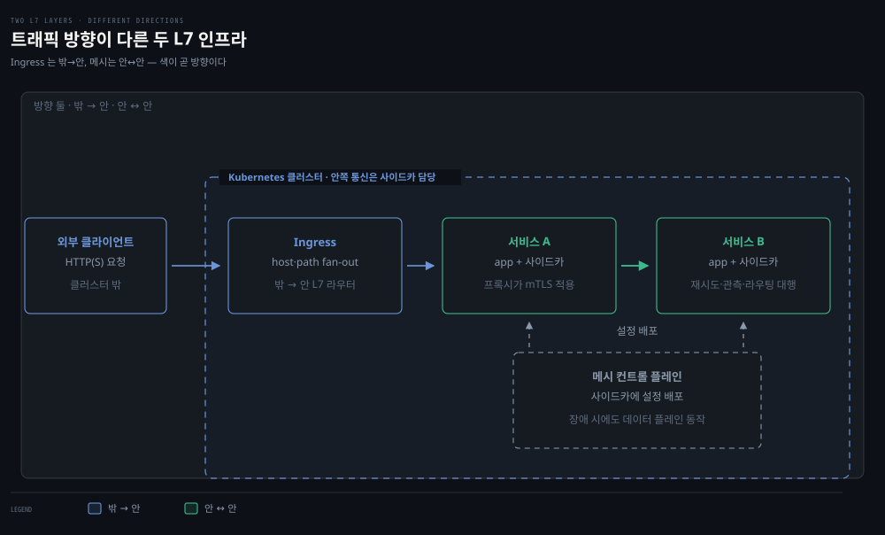
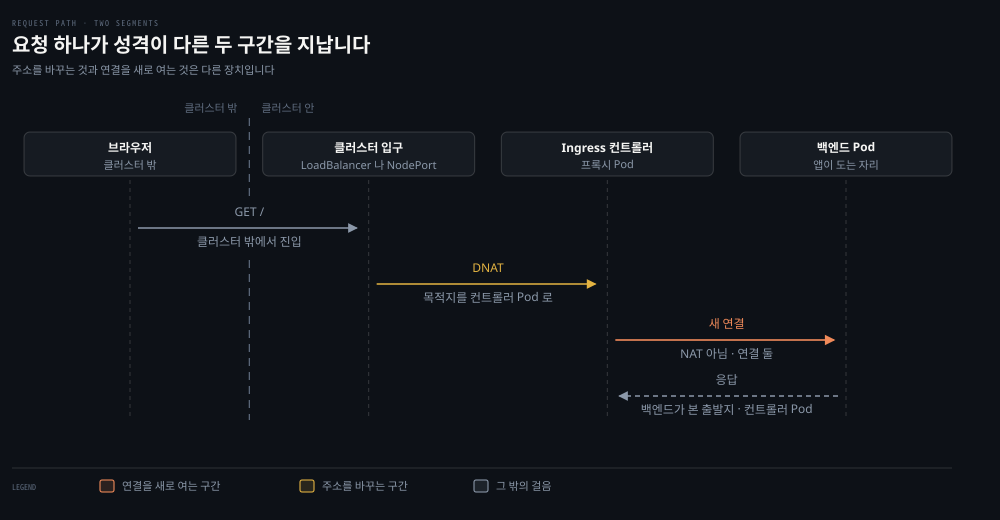
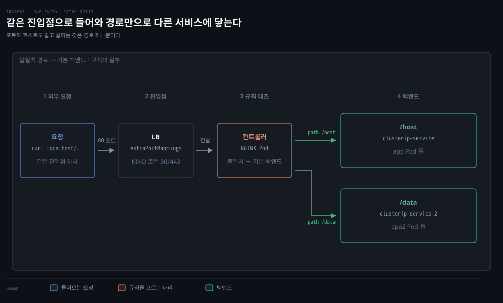
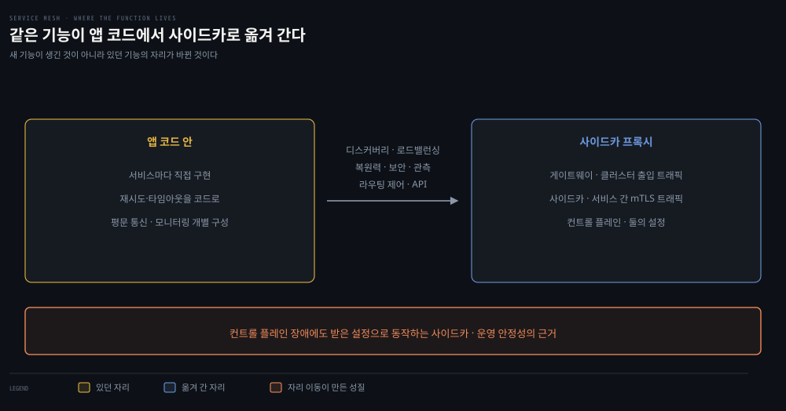

# Ingress와 Service Mesh — L7의 두 층

---

## 핵심 요약
> 이 편 전체가 매달린 하나의 생각은 "Ingress는 밖에서 안으로 들어오는 트래픽의 L7 라우터이고, 서비스 메시는 안에서 안으로 오가는 통신의 L7 인프라"입니다.

Ingress는 LB 하나 뒤에서 호스트·경로 기반 fan-out을 해 클라우드 LB 비용을 아끼는 스펙이며, 실체는 컨트롤러(구현)와 규칙(설정)의 짝입니다. 서비스 메시는 mTLS·재시도·서킷브레이커·관측을 각 앱 코드에서 사이드카 프록시로 옮긴 층입니다 — 저자들의 결론은 "최고의 사용처는 서비스 간 mTLS"입니다.


## 학습 목표
> 두 L7 층의 경계를 긋는 것이 목표입니다. 어떤 문제가 밖에서 안으로 들어오는 트래픽의 일이고 어떤 문제가 안에서 안으로 오가는 통신의 일인지 가릅니다.

이 내용을 읽고 나면:

1. Ingress의 두 부품(컨트롤러·규칙)과 외부/내부 LB 컨트롤러의 비용 거래를 설명할 수 있습니다.
2. path 매칭 3종과 최장 일치 규칙, host 규칙, TLS 설정을 읽고 쓸 수 있습니다.
3. IngressClass로 다중 컨트롤러를 운용하는 방법과 함정을 압니다.
4. 서비스 메시가 기본 클러스터에 더하는 기능 7가지를 나열하고 우선순위를 매길 수 있습니다.
5. Linkerd 주입(inject)의 동작 방식과 확인 방법을 재구성할 수 있습니다.

아래는 이 편이 다루는 두 층을 한 장에 놓은 지도입니다. 둘을 가르는 기준은 트래픽의 방향입니다. 점선 상자 밖에서 안으로 들어오는 첫 화살표가 §1·§2의 Ingress 구간입니다. 서비스 A 와 B 를 잇는 오른쪽 화살표가 §3·§4의 메시 구간이고, 클러스터 안쪽 통신을 맡습니다. 서비스 상자마다 붙은 사이드카가 앱 코드 대신 mTLS 와 재시도를 처리하는 프록시입니다. 아래 컨트롤 플레인이 그 사이드카들에 설정을 배포합니다.




## 1. Ingress — 스펙과 구현의 분리
> Ingress 는 설정 명세일 뿐이고 실제 동작은 따로 배포한 컨트롤러가 합니다. 규칙만 만들고 컨트롤러가 없으면 아무 일도 일어나지 않습니다.


### 풀려는 문제

앞 편이 "LoadBalancer 는 워크로드와 1:1 이라 비싸다"로 끝났습니다. HTTP 서비스가 스무 개면 로드밸런서도 스무 개이고 과금도 그만큼입니다. 하나로 묶고 싶은데 L4 로드밸런서는 URL 경로를 볼 줄 모릅니다. 요청이 `/api` 로 가는지 `/static` 으로 가는지는 L7 의 정보이기 때문입니다.

그래서 위에 한 층이 더 필요합니다. 다만 이 층의 리소스는 만들어 놓아도 아무 일이 일어나지 않는 특이한 물건이라, 규칙을 적기 전에 그 성질부터 알아야 합니다.

Ingress는 Kubernetes 특화 L7(HTTP) 로드밸런서입니다. 내부 전용인 L4 ClusterIP와 달리 외부에서 접근 가능하며, HTTP(S) 워크로드를 외부에 노출하는 전형적 선택입니다.

핵심은 Ingress가 스펙, 곧 설정 명세일 뿐이라는 점입니다. 실제 구현은 여러 종류의 ingress controller가 하고, 규칙(rules)이 트래픽 경로를 정의합니다. 컨트롤러 없이 규칙만 만들면 아무 일도 일어나지 않습니다. Kubernetes는 다른 컴포넌트와 달리 기본 컨트롤러를 시작해 주지 않습니다.

컨트롤러는 크게 둘로 나뉩니다. 외부 로드밸런서 컨트롤러는 클라우드 LB 같은 클러스터 밖 LB를 만들고, 내부 로드밸런서 컨트롤러는 클러스터 안에서 도는 LB를 배포합니다.

내부형을 고르는 주된 동기는 비용입니다. 외부형은 통상 Ingress마다 LB가 하나씩 필요하지만, 내부 LB 하나는 여러 Ingress 객체의 트래픽을 fan-out할 수 있습니다. 클라우드가 LB 단위로 과금하니 LB 하나로 묶는 쪽이 쌉니다.

단 운영 부담·지연·컴퓨트 비용이 늘어납니다. 그래서 저자들은 아낀 돈이 그만한 가치가 있는지 따지라고 조언합니다. "하찮은 클라우드 비용 항목을 최적화하는 나쁜 버릇을 가진 회사가 많다"는 말도 함께 답니다.

### 요청 하나가 지나는 두 구간

여기까지는 "컨트롤러가 트래픽을 백엔드로 넘긴다"로 뭉뚱그렸습니다. 그 넘기는 일이 실제로 무엇인지 갈라 보면, 클러스터 안에는 NAT 이 없다는 [04-01](./04-01.Kubernetes%20%EB%84%A4%ED%8A%B8%EC%9B%8C%ED%82%B9%20%EB%AA%A8%EB%8D%B8%20%E2%80%94%20Pod%20IP%C2%B7%EB%A0%88%EC%9D%B4%EC%95%84%EC%9B%83%C2%B7Probe.md) §1 의 약속과 왜 어긋나지 않는지도 함께 풀립니다.



한 요청이 지나는 길은 한 덩어리가 아닙니다. 성격이 다른 두 구간입니다.

**밖에서 클러스터로 들어오는 구간**은 대체로 주소를 바꿉니다. NodePort 로 들어온 패킷은 목적지가 컨트롤러 Pod 로 바뀌고(DNAT), `externalTrafficPolicy` 가 기본값 `Cluster` 면 출발지까지 노드 IP 로 바뀝니다. 클라우드 LB 는 구현마다 달라서, 스스로 연결을 끊고 새로 여는 것도 있고 Pod 를 직접 겨누는 것도 있습니다. 04-01 §1 이 "출발지까지 바뀌는 경우" 셋 중 마지막으로 적어 둔 자리가 이것입니다.

**컨트롤러에서 백엔드로 가는 구간은 NAT 이 아닙니다.** 컨트롤러는 프록시라 클라이언트의 연결을 자기가 받아 끝내고 백엔드로는 **새 연결**을 엽니다. 주소를 바꿔 흘려보내는 것이 아니라 연결이 둘인 것입니다. TLS 를 여기서 푸는지 그대로 넘기는지(SSL passthrough)는 또 다른 축이고, 어느 쪽이든 연결이 둘인 것은 같습니다. 그래서 백엔드 Pod 가 보는 출발지는 원래 클라이언트가 아니라 컨트롤러 Pod 의 IP 입니다.

원 클라이언트 IP 는 저절로 따라오지 않습니다. 프록시가 `X-Forwarded-For` 나 `Forwarded` 헤더에 적어 넣어야 하고, PROXY protocol 로 넘기는 길도 있습니다. 앞 구간에서 이미 SNAT 으로 지워졌다면 프록시도 적어 넣을 것이 없습니다. [01-03](./01-03.IP%C2%B7%EB%9D%BC%EC%9A%B0%ED%8C%85%C2%B7Ethernet%20%E2%80%94%20%ED%8C%A8%ED%82%B7%EC%9D%B4%20%EA%B8%B8%EC%9D%84%20%EC%B0%BE%EB%8A%94%20%EB%B2%95.md) 이 L3 에서 IP 가 사라지는 자리로 적어 둔 그 이야기입니다.

정리하면 **주소를 바꾸는 것과 연결을 새로 여는 것은 다른 장치**입니다. 둘을 한 낱말로 묶어 두면 "Ingress 는 NAT 을 타는가"라는 물음에 답할 수 없습니다.

단서가 하나 붙습니다. 컨트롤러가 백엔드를 서비스의 ClusterIP 로 부르면 그 한 걸음에는 DNAT 이 붙습니다. 커뮤니티 NGINX Ingress 는 기본 동작에서 EndpointSlice 를 직접 보고 Pod IP 로 붙어 그 DNAT 을 건너뛰지만, `service-upstream` 을 켜거나 SSL passthrough 를 쓰면 다시 ClusterIP 를 지납니다. 컨트롤러와 설정에 달린 이야기입니다.

### 리액트 앱은 클러스터에 있는데 왜 밖에서 들어옵니까

앞 그림 아래 띠가 이 물음의 답입니다. 프런트엔드를 클러스터에 올려 두고 나면 "내 앱도 클러스터 안에 있으니 API 호출은 내부 통신 아닌가"라는 생각이 자연스럽게 따라옵니다.

정적 SPA 를 전제로 보면 답이 분명합니다. **클러스터에 있는 것은 그 앱의 정적 파일이지 실행이 아닙니다.** 브라우저가 `index.html` 과 번들 JS 를 받아 간 순간, 그 코드는 사용자의 브라우저에서 돕니다. 그래서 리액트가 부르는 API 는 클러스터 안에서 나가는 요청이 아니라 위 그림의 맨 윗줄로 **다시 들어오는** 요청입니다. 파일이 어디서 왔는지는 그다음 요청이 어디서 출발하는지와 상관이 없습니다.

Pod 가 직접 부르는 경우는 따로 있습니다. 서버 사이드 렌더링, BFF, Next.js 의 Route Handler, rewrite 프록시처럼 **서버가 대신 부르는 구성**이 그것입니다. 그때는 Pod 사이 통신이라 04-01 §1 의 약속이 그대로 걸리고, ClusterIP 를 거치면 그 한 걸음에 DNAT 이 붙습니다. **같은 앱이라도 브라우저에서 부르면 밖, 서버가 부르면 안입니다.**


## 2. 규칙 — path·host·TLS
> 규칙은 경로와 호스트로 트래픽을 가릅니다. 충돌은 최장 일치로 풀리고, 다중 컨트롤러는 IngressClass 가 정리합니다.



### 풀려는 문제

진입점을 하나로 묶었으면 이제 무엇을 어디로 보낼지 적어야 합니다. 규칙 하나일 때는 쉽습니다. 늘어나면 곧 헷갈리는 자리가 나옵니다 — 한 요청에 규칙이 둘 이상 걸릴 때 어느 쪽이 이기는가.

짐작으로 두면 위험합니다. 짧은 정확 일치와 긴 접두사 일치가 동시에 맞는 경우처럼 직관과 어긋나는 조합이 있어서, 의도한 백엔드가 아닌 곳으로 트래픽이 조용히 흘러갈 수 있습니다.

```yaml
apiVersion: networking.k8s.io/v1
kind: Ingress
metadata:
  name: basic-ingress
spec:
  rules:
  - http:
      paths:
      - path: /demo          # /demo는 demo-service로
        pathType: Prefix
        backend:
          service:
            name: demo-service
            port:
              number: 80
  defaultBackend:            # 나머지 전부는 main-service로
    service:
      name: main-service
      port:
        number: 80
```

path 매칭은 3종입니다.

- **Exact**: 그 경로만 (끝 슬래시 유무 포함)
- **Prefix**: 그 경로로 시작하는 전부
- **ImplementationSpecific**: 컨트롤러 재량

여러 path 에 걸리면 **가장 긴 일치(longest match)가 먼저**이고, 길이가 **같을 때** Exact 가 Prefix 를 이깁니다. 순서가 이 방향이라는 점이 중요합니다 — 짧은 Exact 와 긴 Prefix 가 동시에 맞으면 이기는 쪽은 긴 Prefix 입니다. host 필드를 쓰면 웹 서버의 가상 호스트처럼 a.example.com과 b.example.com을 한 LB·한 IP에서 다른 서비스로 보낼 수 있습니다.

TLS는 `.spec.tls[*].secretName`으로 `kubernetes.io/tls` 타입 Secret(`tls.crt`·`tls.key`, base64)을 참조하는 기본 지원이 있습니다. 인증서를 손으로 관리하기 싫다면 cert-manager로 자동 발급·갱신할 수 있습니다.

다중 컨트롤러는 IngressClass(1.18+)로 운용합니다. Ingress가 `.spec.ingressClassName`으로 자기 컨트롤러를 고르는 방식입니다. 그 전의 `kubernetes.io/ingress.class` 어노테이션은 단순한 "관례"가 아니라 1.18 에서 **공식 deprecated** 됐습니다. 일부 컨트롤러가 하위 호환으로 아직 읽어 줍니다. 함정이 둘 있습니다.

- Kubernetes 어노테이션은 문자열이라 `"true"`처럼 따옴표가 필요합니다.
- 기본(class default)이 둘 이상 지정되면 클래스 없는 Ingress 생성이 거부됩니다.

그리고 Ingress는 HTTP(S) 전용입니다. NGINX 컨트롤러처럼 TCP·UDP를 지원하는 예외가 있지만 표준이 아닙니다.

컨트롤러 선택 기준으로 책은 다섯 질문을 줍니다.

- **프로토콜**: gRPC·WebSocket이 필요한가
- **상용 지원**: 벤더 지원이 필요한가
- **고급 기능**: JWT/OAuth2·서킷브레이커
- **API 게이트웨이 기능**: rate limiting
- **트래픽 분배**: 카나리·미러링

후보로 Ambassador·NGINX(커뮤니티/상용)·HAProxy·Istio Ingress·Kong·Traefik을 표로 비교합니다.

실습은 커뮤니티 NGINX 컨트롤러를 KIND에 배포하는 것으로 시작합니다(extraPortMappings로 로컬 80/443 연결). `/host`는 기존 서비스로, `/data`는 두 번째 Deployment·서비스로 보내는 규칙을 적용합니다. 그러면 `curl localhost/host`·`curl localhost/data`가 서로 다른 백엔드에 닿는 것을 확인할 수 있습니다. 배포 후에는 `kubectl wait --for=condition=ready pod --selector=app.kubernetes.io/component=controller`로 컨트롤러가 준비될 때까지 기다린 뒤 규칙을 적용합니다.

실습에서 확인할 포인트는 셋입니다.

1. 같은 진입점(localhost:80)으로 들어온 요청이 경로만으로 서로 다른 서비스에 도달합니다.
2. `kubectl describe ingress`의 Backends에 매핑된 ClusterIP 서비스와 그 뒤 Pod IP들이 그대로 나열됩니다.
3. 규칙에 걸리지 않은 경로는 defaultBackend로 떨어집니다.


## 3. Service Mesh — 앱 코드에서 인프라로 옮긴 통신 기능
> 메시의 본질은 기능의 자리 이동입니다. mTLS·재시도·관측을 앱 코드에서 사이드카로 옮기고, 컨트롤 플레인이 죽어도 데이터 플레인은 계속 돕니다.



화살표 위에 적힌 것이 자리를 옮긴 기능입니다. 아래 띠가 그 이동이 만들어 낸 성질입니다.

### 풀려는 문제

Ingress 로 밖에서 들어오는 트래픽은 정리됐습니다. 안쪽은 그대로 남아 있습니다. 서비스끼리 주고받는 트래픽은 평문이고, 재시도·타임아웃·서킷브레이커는 서비스마다 코드 안에 들어 있습니다. 언어가 다른 서비스가 섞이면 같은 정책을 언어 수만큼 구현하고 그만큼 따로 고쳐야 합니다.

같은 기능을 앱마다 다시 짜는 것이 문제의 뿌리입니다. 그렇다면 그 기능을 앱 밖으로 옮기면 어떤가 — 이 절의 층이 그 발상입니다.

기본 클러스터의 한계에서 출발합니다. Pod 간 트래픽은 전부 평문입니다. 모니터링은 서비스마다 따로 구성해야 합니다. 배포 전략은 롤링·재생성이라는 기본 유형뿐이고, 장애 주입 같은 개발자 도구도 없습니다. 서비스 메시는 서비스 간 통신을 다루는 API 주도 인프라 계층으로서 이 빈칸을 채웁니다.

메시가 더하거나 강화하는 기능은 일곱입니다.

1. 서비스 디스커버리 — DNS 의존 대신 메시가 관리, 앱마다 구현할 필요 제거
2. 로드밸런싱 — least request·consistent hashing·zone aware 같은 고급 알고리즘
3. 통신 복원력 — 재시도·타임아웃·서킷브레이커·rate limiting을 앱 코드 밖으로
4. 보안 — 서비스 간 mTLS 종단 암호화 + L3/4 수준을 넘는 인가 정책(어떤 서비스가 어떤 서비스와 통신 가능한가)
5. 관측 — L7 메트릭 강화, 트레이싱·알림
6. 라우팅 제어 — 트래픽 시프팅·미러링
7. API — 이 전부를 메시 구현의 API로 제어

구조는 세 부분입니다 — 클러스터를 드나드는 트래픽은 게이트웨이가, 서비스 간 트래픽은 Pod 안에 배포된 사이드카 프록시가 mTLS로 처리하고, 컨트롤 플레인이 이를 설정합니다. 컨트롤 플레인이 죽어도 서비스·앱 트래픽은 영향받지 않는다는 점이 설계의 미덕입니다.

이 분리가 운영 안정성의 근거이기도 합니다. 원문의 서술은 "컨트롤 플레인이 다운돼 갱신이 불가능해도 서비스·앱 트래픽은 영향받지 않는다"까지이고, 이는 사이드카가 이미 받은 설정으로 동작을 계속하기 때문이라고 풀이할 수 있습니다.

구현 비교(책 시점)를 정리하면 이렇습니다.

- **Istio**: Go 컨트롤 플레인 + Envoy 프록시. (원문 정오: 책은 "Lyft가 처음 내놓았다"고 적지만 Lyft산은 Envoy이고, Istio 자체는 Google·IBM·Lyft 공동 프로젝트입니다.)
- **Consul**: Consul Connect, 노드별 에이전트 + Envoy 사이드카
- **AWS App Mesh**: 관리형 자체 컨트롤 플레인 + Envoy, mTLS·트래픽 정책 없음
- **Linkerd**: Go 컨트롤 플레인 + 자체 Linkerd 프록시. Kubernetes 전용이라 움직이는 부품이 적고 단순(책은 트래픽 시프팅·분산 트레이싱 없음이라 서술 — 심화 학습에서 이 서술의 자기모순을 짚습니다).

그리고 저자들의 의견이 명료합니다 — 서비스 메시의 최고 사용처는 서비스 간 mTLS이고, 개발자에게는 서킷브레이커·장애 테스트, 네트워크 관리자에게는 고급 라우팅 정책이 그다음입니다.


## 4. Linkerd 실습 — 주입과 관측
> 사이드카는 손으로 넣지 않습니다. 어노테이션과 mutating webhook 이 Pod 생성 시점에 끼워 넣는 과정을 눈으로 확인합니다.


### 풀려는 문제

메시가 기능을 사이드카로 옮긴다고 했습니다. 그런데 내 Deployment 매니페스트에는 컨테이너가 하나뿐입니다. 사이드카를 손으로 적어 넣는다면 앱 매니페스트를 전부 고쳐야 하고, 프록시 버전이 올라갈 때마다 그 일을 반복해야 합니다.

실제로는 그렇게 하지 않습니다. 이 실습은 사이드카가 언제 어디서 끼어드는지를 눈으로 확인하는 자리입니다.

흐름은 넷입니다.

1. **사전 점검** — `linkerd check --pre`로 클러스터를 점검합니다.
2. **설치** — `linkerd install | kubectl apply -f -`로 깔고(identity·proxy-injector·sp-validator 등 대량의 RBAC·웹훅 포함) `linkerd check`로 검증합니다.
3. **앱을 메시에 넣기** — `cat web.yaml | linkerd inject - | kubectl apply -f -`가 Deployment에 `linkerd.io/inject: enabled` 어노테이션을 심습니다. 그러면 proxy-injector(mutating webhook)가 그 어노테이션을 보고 사이드카를 주입합니다.
4. **관측** — `linkerd viz dashboard`와 `linkerd viz stat deploy`로 성공률·RPS·지연(P50/P95/P99)을 봅니다. netshoot Pod에서 `for i in $(seq 1 100); do curl http://clusterip-service/host && sleep 2; done`으로 부하를 만들어 실시간 확인합니다.

> 💬 **비유**: Ingress와 메시는 건물의 두 통신 설비입니다. Ingress는 1층 안내 데스크입니다 — 방문객(외부 HTTP)의 용건(host·path)을 듣고 맞는 부서로 안내하며, 데스크 하나로 여러 부서를 감당해 경비(LB 비용)를 아낍니다. 서비스 메시는 부서 간 사내 전화망 교체 공사입니다 — 모든 책상 옆에 비서(사이드카)를 붙여 통화를 암호화(mTLS)하고, 불통이면 재다이얼(재시도)하고, 모든 통화 품질을 기록(관측)합니다. 직원(앱 코드)은 아무것도 바꾸지 않았는데 통신 품질이 바뀝니다.


## 심화 학습
> 책 밖에서 보강한 내용입니다. 출처를 함께 남깁니다.

- Ingress 스펙은 기능 동결 상태이고 후계는 Gateway API입니다(GatewayClass·Gateway·HTTPRoute, 1.0 GA 2023) — [Gateway API 공식](https://gateway-api.sigs.k8s.io/). 역할 분리와 표현력이 Ingress의 어노테이션 남발 문제를 대체합니다. 역할은 인프라·클러스터 운영·앱 개발로 나뉘고, 표현력에는 헤더 매칭과 가중치 분배가 들어갑니다. 형제 정독본 [13-01 Gateway API](../kubernetes-in-action/13-01.Gateway%20API%20%EA%B0%9C%EB%85%90%EA%B3%BC%20Gateway%20%EB%B0%B0%ED%8F%AC.md)가 실습 정본입니다.
- 책의 Linkerd 서술("트래픽 시프팅·분산 트레이싱 없음")은 책 안에서도 자기모순입니다. 같은 장의 `linkerd install` 출력에 trafficsplits.split.smi-spec.io CRD 가 생성됩니다. SMI 는 이후 CNCF 샌드박스에서 아카이브돼 Gateway API 쪽으로 흡수됐으니 현재 표준이 아니라 역사로 읽어야 합니다. SMI TrafficSplit 이 곧 트래픽 시프팅입니다. 현재 Linkerd 는 Gateway API 기반 트래픽 시프팅과 분산 트레이싱을 공식 지원하며 근거는 [Linkerd 공식 문서](https://linkerd.io/2/features/)입니다. 사이드카 없는 모드(Istio ambient) 등 메시 지형 전반이 크게 움직인 영역입니다. 구현 비교표는 "2021년의 스냅숏"으로 읽어야 합니다.
- 메시 심화는 이 저장소의 전용 카테고리 `08_cloud/service-mesh` <!-- 링크 끊김(2026-08): ../../service-mesh/README.md -->(26편)가 SSOT입니다. Linkerd·Istio·Cilium mesh, 사이드카/앰비언트, mTLS, 멀티클러스터까지 그쪽에서 이어집니다.


## 결정 치트시트
> "이 트래픽은 어느 층의 문제인가"로 가립니다.

| 문제 | 층 | 도구 |
|------|-----|------|
| 외부 HTTP를 host·path로 여러 서비스에 분배 | 밖→안 L7 | Ingress (+ 컨트롤러 선택 5질문) |
| 외부 TCP/UDP (비HTTP) 노출 | 밖→안 L4 | LoadBalancer 서비스 (전편) |
| 서비스 간 암호화·인가 | 안↔안 | 메시 mTLS — 저자들이 꼽는 최고 사용처 |
| 재시도·서킷브레이커를 코드 밖으로 | 안↔안 | 메시 통신 복원력 |
| 카나리·미러링 같은 고급 릴리스 | 안↔안 | 메시 라우팅 제어 (Ingress만으로는 부족) |
| LB 비용 절감 | 구조 | 내부 LB 컨트롤러로 fan-out — 단 운영 부담과 교환 |


## 면접에서 받을 만한 질문
> 답을 가리고 스스로 말해 본 뒤, 아래 정답 절에서 맞춰 봅니다.

1. Ingress를 "한 줄"로 정의한다면?
2. "Ingress = 스펙 + 컨트롤러"라는 말의 의미는? 다중 컨트롤러는 어떻게 다루나요?
3. path 충돌은 어떤 규칙으로 해소되나요?
4. 서비스 메시의 본질을 한 문장으로 말한다면?
5. Ingress와 LoadBalancer 서비스는 어떻게 역할이 나뉘나요?
6. 서비스 메시를 도입할 첫 번째 이유를 하나만 꼽는다면요?
7. 사이드카 주입은 어떻게 일어나나요?
8. Ingress 로 들어온 요청은 NAT 을 탑니까? 클러스터 안은 NAT 이 없다는 약속과 어떻게 맞습니까?
9. 리액트 앱을 클러스터에 올려 두었습니다. 그 앱이 부르는 API 는 내부 통신입니까?


## 정답 (자답 후 펼치기)
> 위 §면접에서 받을 만한 질문에 *먼저 자답한 뒤* 아래를 읽으세요. 자답 없이 먼저 읽으면 학습 효과가 0입니다.

### 1. Ingress 한 줄 정의
"Ingress란 호스트·경로 기반으로 HTTP 트래픽을 서비스들로 라우팅하는 L7 설정 스펙으로, 실제 동작은 별도로 배포한 ingress controller가 수행하며 LB 하나로 다수 서비스를 노출해 비용을 통합합니다."

### 2. 스펙 + 컨트롤러
Ingress는 스펙(설정 명세)일 뿐이라, 규칙만 만들고 컨트롤러가 없으면 아무 일도 일어나지 않습니다. Kubernetes는 기본 컨트롤러를 시작해 주지 않으므로 컨트롤러를 직접 배포해야 하고, 다중 컨트롤러는 IngressClass(`.spec.ingressClassName`)로 각 Ingress가 자기 컨트롤러를 고릅니다.

### 3. path 충돌 해소
최장 일치가 이기고, **길이가 같은** Exact 와 Prefix 가 맞으면 Exact 가 우선입니다. 예를 들어 `/first`와 `/first/second` 규칙이 있으면 `/first/second`행 요청은 더 구체적인 쪽으로 갑니다.

### 4. 서비스 메시의 본질
통신 기능의 자리 이동입니다. mTLS·재시도·관측을 각 앱 코드에서 사이드카 프록시로 옮기고, 컨트롤 플레인이 죽어도 사이드카는 이미 받은 설정으로 동작을 계속하므로 데이터 플레인은 영향받지 않습니다.

### 5. Ingress vs LoadBalancer
LoadBalancer는 L4라 프로토콜을 가리지 않지만 워크로드와 1:1이고, Ingress는 L7(HTTP 전용)이라 host·path를 읽어 LB 하나 뒤에서 여러 서비스로 fan-out합니다. 비HTTP는 LoadBalancer, HTTP 다수 서비스는 Ingress가 기본 선입니다.

### 6. 서비스 메시 도입의 첫 이유
서비스 간 mTLS입니다. 클러스터 안 트래픽은 기본 평문인데, 메시는 앱 코드 변경 없이 종단 암호화와 서비스 단위 인가를 제공합니다. NetworkPolicy(L3/4)보다 높은 수준의 통제입니다.

### 7. 사이드카 주입
어노테이션과 mutating webhook의 합작입니다. `linkerd inject`가 Pod 스펙에 주입 어노테이션을 더하면, proxy-injector 웹훅이 Pod 생성 시점에 스펙을 변형해 프록시 컨테이너를 끼워 넣습니다.

### 8. Ingress 와 NAT
구간을 갈라야 답이 됩니다. 밖에서 클러스터로 들어오는 구간은 대체로 목적지를 컨트롤러 Pod 로 바꾸고(DNAT), `externalTrafficPolicy` 가 `Cluster` 면 출발지까지 노드 IP 로 바꿉니다. 반면 컨트롤러에서 백엔드로 가는 구간은 NAT 이 아니라 프록시입니다 — 연결을 받아 끝내고 새로 하나를 엽니다. "NAT 없음" 약속은 Pod 사이 통신과 노드-Pod 통신에 걸린 것이라, 경계를 넘어 들어오는 첫 구간과는 애초에 무관합니다.

### 9. 클러스터에 올린 프런트엔드의 API 호출
정적 SPA 라면 내부 통신이 아닙니다. 클러스터에 있는 것은 정적 파일이고 그 JS 의 실행은 사용자의 브라우저에서 일어나므로, API 호출은 밖에서 다시 들어오는 요청입니다. Pod 가 직접 부르는 것은 SSR·BFF·rewrite 프록시처럼 서버가 대신 부르는 구성일 때이고, 그때만 Pod 사이 통신입니다.


## 핵심 개념 체크리스트
> 여섯 항목을 막힘없이 답할 수 있으면 6장으로 넘어가도 좋습니다.
- [ ] 외부/내부 LB 컨트롤러의 비용 거래를 설명할 수 있는가?
- [ ] path 3종과 충돌 해소 규칙(최장 일치 먼저, 길이 같을 때 Exact 우선)을 아는가?
- [ ] IngressClass 함정 2가지(어노테이션 문자열, 다중 default)를 아는가?
- [ ] 메시 기능 7가지를 나열하고 저자의 우선순위(mTLS 첫째)를 말할 수 있는가?
- [ ] 컨트롤 플레인 장애가 데이터 플레인에 영향 없는 이유를 설명할 수 있는가?
- [ ] linkerd inject → webhook 주입 → viz 관측 흐름을 재구성할 수 있는가?
- [ ] 주소를 바꾸는 구간과 연결을 새로 여는 구간을 가를 수 있는가?
- [ ] 클러스터에 올린 프런트엔드의 API 호출이 왜 내부 통신이 아닌지 말할 수 있는가?


## 참고 자료
- 《Networking and Kubernetes: A Layered Approach》(James Strong·Vallery Lancey, O'Reilly, 2021, ISBN 978-1492081654) Ch5
- [K8s 문서 — Ingress](https://kubernetes.io/docs/concepts/services-networking/ingress/)
- [Gateway API 공식](https://gateway-api.sigs.k8s.io/)
- [Linkerd 공식 문서](https://linkerd.io/2/features/)
- 이전 편: [05-02. Service 5유형](./05-02.Service%205%EC%9C%A0%ED%98%95%20%E2%80%94%20ClusterIP%EC%97%90%EC%84%9C%20LoadBalancer%EA%B9%8C%EC%A7%80.md)
- 도입 판단 축: [Kubernetes: Up and Running 15장 — Service Meshes](../kubernetes-up-and-running/15-01.Service%20Meshes%20%E2%80%94%20%EC%93%B8%20%EA%B2%83%EC%9D%B8%EA%B0%80%EB%A5%BC%20%EB%A8%BC%EC%A0%80%20%EB%94%B0%EC%A7%84%EB%8B%A4.md) — 메시를 **쓸 것인가**를 장애 반경·운영 부담으로 따집니다. 기능·구조·구현 비교는 이 편이 정본이라 그쪽이 여기로 링크합니다
