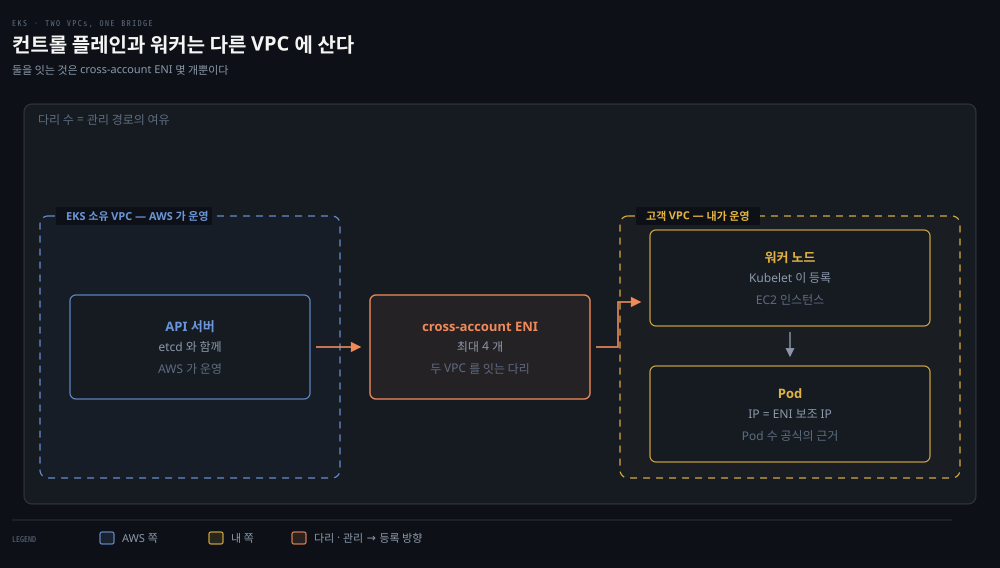
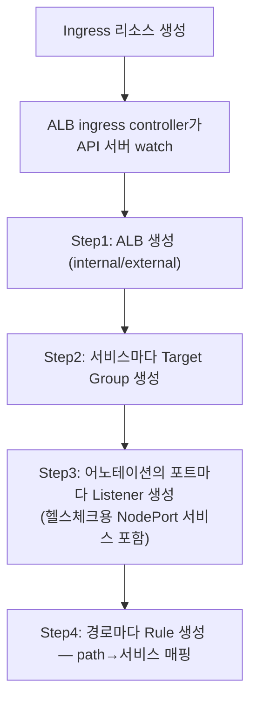

# AWS 네트워킹과 EKS — VPC 부품으로 조립하는 클러스터

## 핵심 요약
> 이 편 전체가 매달린 하나의 생각은 "EKS 클러스터는 VPC 부품의 조립품 — 서브넷 설계와 인스턴스 타입이 곧 클러스터의 크기를 정한다"입니다.
> VPC·서브넷·라우팅 테이블·ENI·보안 그룹이라는 기본 부품 위에 EKS가 서고, AWS VPC CNI는 Pod IP를 VPC CIDR에서 직접 꺼내 씁니다. 그래서 인스턴스 타입의 ENI·IP 한도가 노드당 최대 Pod 수가 되고, 서브넷 크기가 클러스터 스케일의 상한이 됩니다 — 클라우드에서 네트워크 설계가 용량 설계가 되는 대표 사례입니다.


## 학습 목표
> AWS 부품 이름을 외우는 대신, 서브넷과 인스턴스 타입이 왜 클러스터 용량을 정하는지 공식으로 역산할 수 있는 상태를 목표로 합니다.

이 내용을 읽고 나면:

1. VPC·서브넷·라우팅 테이블·ENI·EIP의 관계를 EKS 관점에서 설명할 수 있습니다.
2. 보안 그룹과 NACL의 5가지 차이를 표 없이 재구성할 수 있습니다.
3. EKS의 두 VPC 구조와 네트워크 모드 3종(public·private·mixed)을 구분할 수 있습니다.
4. 인스턴스 타입에서 노드당 최대 Pod 수를 계산할 수 있습니다.
5. AWS VPC CNI의 ipamd·warm pool 동작과 ALB ingress controller의 두 모드를 설명할 수 있습니다.

아래는 이 편의 구조적 핵심인 두 VPC 를 한 장에 놓은 지도입니다. 위쪽이 컨트롤 플레인이 사는 EKS 소유 VPC 이고 아래쪽이 워커 노드와 Pod 가 사는 고객 VPC 입니다. 둘을 잇는 것이 가운데 cross-account ENI 이며, 화살표 두 개가 Kubelet 의 등록 방향과 컨트롤 플레인의 관리 방향입니다. Pod 상자에 붙은 "Pod IP = ENI 보조 IP" 가 §5 의 Pod 수 공식과 §6 의 CNI 동작이 성립하는 근거입니다. 본문은 §1 의 VPC 부품부터 시작해 이 구조로 올라옵니다.




## 1. VPC 부품들 — 주소·경계·배선
> EKS 이전에 VPC 부품부터 봅니다. Pod IP 도 결국 이 VPC CIDR 에서 나온다는 것이 이 편의 복선입니다.

AWS 네트워크의 바탕은 VPC(virtual private cloud)입니다. 계정 전용의 격리된 가상 네트워크이며 리전당 정의됩니다. 한 리전에 VPC 를 여럿 둘 수 있지만 VPC 하나는 한 리전에만 존재합니다. 모든 자원의 사설 IP 가 이 VPC 의 CIDR(예: `192.168.0.0/16`)에서 나옵니다.

이제는 겹치지 않는 CIDR 여러 개를 한 VPC 에 붙일 수 있어 초기 설계 실수의 부담이 줄었습니다. Pod IP 도 이 VPC CIDR 에서 나온다는 것이 이 편의 복선입니다.

리전은 지리 영역 안의 물리적으로 분리·격리된 여러 가용 영역(AZ)으로 구성됩니다. AZ는 데이터센터 여러 개를 담을 수 있고 서로 직결돼 있지만 장애는 격리됩니다 — 고가용성이 필요한 앱은 여러 AZ의 서브넷에 걸쳐 배치하고 로드밸런서로 묶습니다. 서브넷은 VPC CIDR의 조각으로 단일 AZ에 배포되며, 라우팅 테이블에 인터넷 게이트웨이(IGW)로 가는 경로가 있으면 public, 없으면 private입니다.

라우팅 테이블은 서브넷마다 정확히 하나 연결되며, 명시하지 않으면 main 라우팅 테이블이 붙습니다. 규칙 셋을 기억해 둘 만합니다.

- main 테이블은 삭제할 수 없습니다.
- 게이트웨이 라우팅 테이블은 main 으로 지정할 수 없습니다.
- local 경로가 가장 구체적입니다.

경로 항목은 목적지 CIDR, 대상(게이트웨이·인터페이스 등), 상태(active·blackhole), 전파 플래그로 구성됩니다. 예컨대 `11.0.0.0/16 → local` 과 `0.0.0.0/0 → igw-...` 두 줄이면 그 서브넷은 public 입니다.

ENI(elastic network interface)는 가상 네트워크 카드입니다. 기본·보조 사설 IPv4, 사설 IP 당 EIP 1개, 보안 그룹, MAC 주소를 가집니다. 속성을 유지한 채 인스턴스에 붙였다 뗄 수 있어서 elastic 이라 부릅니다.

EIP(elastic IP)는 정적 공인 IPv4 입니다. 인스턴스보다 ENI 에 연결하는 쪽이 좋습니다. 인터페이스 속성 전체가 한 번에 다른 인스턴스로 옮겨 가기 때문입니다. 소프트 리밋 5개와 IPv6 미지원이라는 제약도 함께 적어 둡니다.


## 2. 보안 그룹 vs NACL — 사고의 단골 지점
> 둘은 층과 성격이 다릅니다. 보안 그룹은 인스턴스 수준 stateful, NACL 은 서브넷 수준 stateless 라 연결 장애 점검 항목이 갈립니다.

AWS 네트워킹의 두 기본 보안 통제이고, 저자들 경험상 많은 문제가 이 둘의 오구성에서 나옵니다.

| 항목 | 보안 그룹 | NACL |
|------|----------|------|
| 동작 수준 | 인스턴스(ENI) | 서브넷 |
| 규칙 | allow만 | allow와 deny |
| 상태 | stateful — 인바운드 허용이면 회신 자동 허용 | stateless — 양방향 명시 필요 |
| 평가 | 전 규칙 평가 후 전달 결정 | 낮은 번호부터 순서대로, 첫 매치 적용 |
| 적용 대상 | 연결된 인스턴스·인터페이스 | 서브넷 안 모든 인스턴스 |

기본 NACL 은 양방향 전부 허용으로 관대합니다. 그런데 사용자 정의 NACL 은 기본이 전부 거부라, 규칙을 안 넣으면 연결이 끊깁니다. 보안 그룹은 4장 NetworkPolicy 와 닮은 물건이고, EKS 는 관리형 데이터 플레인과 워커 노드 사이 통신용 보안 그룹 여러 개를 배포합니다. 연결 장애 시 "SG 가 포트를 안 열었나, NACL 아웃바운드가 빠졌나"를 점검 목록에 넣으라는 것이 저자들의 당부입니다.


## 3. 트래픽의 관문 — NAT·IGW·ELB 4종
> 밖으로 나가는 길과 밖에서 들어오는 길을 따로 봅니다. NAT 는 나가기만, IGW 는 양방향, ELB 4종은 계층이 다릅니다.

인터넷 연결이 필요하되 직접 노출은 안 되는 인스턴스(DB 등)는 NAT 디바이스 뒤에 둡니다 — EC2로 자가 운영하거나 관리형 NAT GW를 쓰며, 둘 다 다중 AZ public 서브넷과 EIP가 필요합니다(NAT GW의 IP는 배포 후 변경 불가). EKS의 Pod·인스턴스도 VPC 밖으로 나가려면 NAT 디바이스가 필요합니다. IGW는 VPC의 인터넷 연결을 맡는 관리형 장치입니다. 개통은 3단계입니다.

1. VPC에 IGW를 부착합니다.
2. 서브넷 라우팅 테이블에 인터넷행 경로를 추가합니다.
3. NACL·SG가 허용하는지 확인합니다.

로드밸런서는 넷입니다.

- Classic — EC2 기본 밸런싱. 기능이 제한적이며 컨테이너와 쓰지 말 것
- Application(ALB) — L7 인지(HTTP 헤더·경로 라우팅). ALB 컨트롤러로 YAML 몇 줄이면 자동 배포
- Network(NLB) — L4(TCP/UDP 포트 기반). EIP를 붙일 수 있는 유일한 LB
- Gateway — VPC 수준 어플라이언스(DPI·프록시)용. EKS 생태계에서는 미사용

ALB의 부품은 5장 Ingress와 겹쳐 보면 쉽습니다.

- **listener** — 포트·프로토콜을 감시
- **rule** — 요청을 어디로 (forward·redirect·fixed-response 중 하나 필수, 인증 액션 별도)
- **target group** — 등록된 대상 (EC2·IP·Pod·Lambda)
- **health check** — 대상 건강 확인


## 4. EKS — 두 VPC와 세 가지 모드
> EKS 의 구조적 특징은 VPC 가 둘이라는 점입니다. 컨트롤 플레인과 워커가 다른 계정의 VPC 에 살고, cross-account ENI 가 둘을 잇습니다.

EKS 노드는 셋 중 하나입니다.

- **관리형 노드 그룹** — EKS가 EC2·Auto Scaling 그룹까지 관리
- **자가 관리 노드 그룹** — 같은 인스턴스 타입·AMI·IAM 역할 요구
- **Fargate** — Pod마다 격리 경계 (커널·CPU·메모리·ENI를 다른 Pod와 공유하지 않으며, security groups for pods 불가 — 책 시점 기준. 심화 학습 참고)

선택 기준은 통제권과 운영 부담의 교환입니다.

구조의 핵심은 VPC가 둘이라는 점입니다. Kubernetes 컨트롤 플레인(API 서버·etcd·API 로드밸런서)은 EKS 소유 VPC에, 워커 노드와 Pod는 고객 VPC에 삽니다. EKS 컨트롤 플레인은 클러스터당 최대 4개의 cross-account ENI를 고객 VPC에 만들어 둘을 잇습니다. 노드의 Kubelet은 클러스터 엔드포인트에 등록하는데, 그 엔드포인트의 위치가 네트워크 모드를 가릅니다.

| 모드 | 구조 | 고려점 |
|------|------|--------|
| Public-only (기본) | API 엔드포인트 LB가 public 서브넷 | VPC 안에서 나가는 API 요청도 고객 VPC는 떠나되 Amazon 망은 안 벗어남. 엔드포인트가 인터넷에 노출 |
| Private-only | API 접근이 클러스터 VPC(또는 연결망) 안으로 한정 | 인터넷용 LB 생성 불가. 공개 DNS가 VPC 내 사설 IP로 해석됨 |
| Mixed | 둘 다 활성 | VPC 안 요청은 EKS 관리 ENI로, 인터넷 접근은 SG·NACL로 제한 가능 |

EKS용 private 서브넷에는 NAT GW가 필요하고, 서브넷에 `kubernetes.io/cluster/<이름>: shared` 태그가 있어야 합니다.


## 5. eksctl과 노드당 Pod 수 공식
> 이 편에서 가장 실무적인 공식이 나오는 절입니다. 인스턴스 타입의 IP 수용량이 그대로 노드당 Pod 상한이 됩니다.

eksctl(Weaveworks 개발)은 저자들이 "현재까지 가장 쉬운 EKS 배포 방법"으로 꼽는 CLI 입니다. 기본값으로 만들어 주는 것이 상당합니다.

- 자동 생성 클러스터명, m5.large 워커 2대, 공식 EKS AMI, us-west-2 리전
- 전용 VPC(`192.168.0.0/16`)와 /19 서브넷 8개 — private 3 · public 3 · 예약 2
- NAT GW 와 IGW
- 보안 그룹 2개 — 노드 간 전 포트, 컨트롤 플레인과 노드 사이

노드가 돌릴 수 있는 Pod 수는 그 인스턴스의 IP 수용량으로 정해집니다.

```pseudocode
최대 Pod 수 = (인스턴스 타입의 ENI 수 × (ENI당 IP 수 - 1)) + 2
```

m5.large 면 29입니다. 단 시스템 Pod 도 이 수에 포함됩니다. CNI 플러그인과 kube-proxy 가 모든 노드에서 돌므로 실제 가용은 27개이고, CoreDNS 가 도는 노드는 더 줄어듭니다.

노드에 남은 IP 가 없으면 Pod 는 waiting 에 머뭅니다. 스케일 이벤트가 EC2 타입 한도에 부딪히면 연쇄 장애가 됩니다. 클러스터 사이징과 인스턴스 타입 결정이 곧 네트워크 설계인 이유입니다.


## 6. AWS VPC CNI — Pod IP를 VPC에서 직접
> 앞 절 공식이 성립하는 이유가 여기 있습니다. Pod IP 가 오버레이 주소가 아니라 VPC 서브넷의 실제 보조 IP 이기 때문입니다.

AWS VPC CNI 는 두 부품입니다. 호스트와 Pod 의 네트워크 스택을 배선하는 CNI 플러그인, 그리고 노드 로컬 장수 IPAM 데몬인 ipamd 입니다.

ipamd 는 가용 IP 의 warm pool 을 유지하며 Pod 에 IP 를 붙입니다. 노드가 처음 합류하면 ENI 하나와 그 주소들뿐인데, 설정 없이도 ipamd 는 여분 ENI 하나를 항상 준비해 둡니다. 한 ENI 의 주소가 바닥나면 새 ENI 를 할당하고 보조 IP 를 붙입니다. 이렇게 인스턴스가 수용 가능한 최대까지 IP 를 씁니다.

결국 Pod IP 가 VPC 서브넷의 실제 주소(예: `10.200.1.0/24` 의 보조 IP)라는 뜻이고, 그래서 위 공식이 성립합니다.

설정 옵션 중 기억할 것들은 넷입니다.

- `WARM_ENI_TARGET` — 여분 ENI 수
- `AWS_VPC_K8S_CNI_CUSTOM_NETWORK_CFG` — 노드는 public, Pod는 private 서브넷 같은 분리
- `AWS_VPC_ENI_MTU` — 기본 9001
- `AWS_VPC_K8S_CNI_EXTERNALSNAT` — 보조 ENI IP의 SNAT를 외부 NAT GW에 맡길지의 스위치

마지막 것은 VPN·직결·외부 VPC에서 Pod로 인바운드가 필요하고 Pod가 IGW로 직접 인터넷에 갈 일이 없으면 true로 켭니다.


## 7. ALB ingress controller — 어노테이션이 LB가 되기까지
> 어노테이션 몇 줄이 실제 AWS 자원이 되는 과정입니다. 트래픽이 Pod 에 닿는 방식은 NodePort 경유와 Pod 직결 두 갈래입니다.



트래픽이 노드·Pod 에 닿는 방식은 두 모드입니다.

- **instance mode**: 각 서비스의 NodePort 를 경유하므로 서비스가 `type: NodePort` 로 노출돼야 합니다.
- **IP mode**: ALB 가 Pod IP 로 직접 갑니다. Pod 가 ENI 보조 IP 로 직접 접근 가능한 CNI 를 전제하며, AWS VPC CNI 가 바로 그것입니다.


## 8. 실습 골격 — eksctl부터 정리까지
> 클러스터 생성부터 삭제까지의 흐름입니다. 놀고 있는 클러스터에 과금되지 않게 정리하는 것까지가 실습입니다.

책의 실습 흐름만 추리면 이렇습니다.

1. `eksctl create cluster -N 3`으로 3노드 클러스터(AZ 3개에 public·private 서브넷 각 3)를 만듭니다.
2. Go 웹 서버 + LoadBalancer 서비스를 배포하고, ClusterIP·서비스명·Pod IP 세 경로와 ELB 외부 DNS로 검증합니다(5장 검증 패턴 그대로).
3. ALB controller는 OIDC 공급자 연결 → IAM 정책·서비스 어카운트(IRSA) 생성 → TargetGroupBinding CRD → Helm 배포 순서로 깝니다.
4. ingress 규칙 적용 후 ALB DNS로 `/data`·`/host`를 검증합니다.
5. 정리 — 앱·ALB·IAM 정책 삭제, EBS 볼륨·LB 잔존 확인 후 `eksctl delete cluster`.

놀고 있는 클러스터에 과금되지 않게 하라는 당부까지가 실습입니다.

> 💬 **비유**: EKS의 IP 사정은 좌석이 정해진 구내식당입니다. 인스턴스 타입은 식탁 크기(ENI 수 × 자리 수)이고, Pod는 좌석표(VPC의 진짜 IP)를 받아야만 앉을 수 있습니다. ipamd는 홀 매니저입니다 — 손님이 몰릴 것에 대비해 빈 식탁 하나(warm ENI)를 늘 잡아 두고, 식탁이 차면 새 식탁을 폅니다. 좌석표가 소진되면 손님은 입장 대기(waiting)입니다 — 홀을 넓히려면 더 큰 식탁(인스턴스 타입)이나 더 넓은 홀(서브넷)이 필요합니다.


## 심화 학습
> 책 밖에서 보강한 내용입니다. 출처를 함께 남깁니다.

- "인스턴스 타입 = 최대 Pod 수" 공식의 제약은 이후 완화됐습니다 — VPC CNI의 prefix delegation(ENI에 /28 프리픽스 할당) 기능으로 Nitro 인스턴스에서 노드당 Pod 밀도를 크게 올릴 수 있습니다. [EKS 문서 — Increase available IP addresses](https://docs.aws.amazon.com/eks/latest/userguide/cni-increase-ip-addresses.html) 참조. 공식 자체는 여전히 기본 모드의 진실입니다.
- 책의 ALB ingress controller는 현재 AWS Load Balancer Controller로 개칭·확장됐습니다(ALB=ingress, NLB=service 담당). Fargate의 "security groups for pods 불가"도 이후 뒤집혔습니다 — AWS VPC CNI 1.7.7+부터 Fargate에서도 security groups for pods를 지원합니다([EKS 문서 — SG for pods](https://docs.aws.amazon.com/eks/latest/userguide/security-groups-for-pods.html)). 본문의 "불가"는 책 시점(2021)의 사실로 읽어야 합니다. 현행 기준은 [AWS Load Balancer Controller 문서](https://kubernetes-sigs.github.io/aws-load-balancer-controller/)와 EKS 공식 문서로 확인합니다.
- 인스턴스 타입별 ENI·IP 한도 표는 [EKS 문서 — Available IP per instance type](https://docs.aws.amazon.com/AWSEC2/latest/UserGuide/using-eni.html#AvailableIpPerENI)가 정본입니다.


## 결정 치트시트
> EKS 네트워크 설계의 다섯 결정입니다.

| 결정 | 기준 |
|------|------|
| 노드 유형 (managed/self/Fargate) | 통제권 vs 운영 부담 — Fargate는 Pod별 격리가 필요할 때, 단 제약(SG for pods 등) 확인 |
| 네트워크 모드 (public/private/mixed) | API 엔드포인트 노출 허용 여부 — 기본은 public이므로 보안 요구가 있으면 명시적으로 바꿀 것 |
| 인스턴스 타입 | 필요한 노드당 Pod 수를 공식으로 역산 — 시스템 Pod 2~3개 차감 잊지 말 것 |
| 서브넷 크기 | Pod IP가 VPC CIDR에서 직접 나옴 — 스케일 목표만큼의 여유 + NAT GW용 public 서브넷 |
| EXTERNALSNAT | VPN·직결로 Pod 인바운드가 필요하면 true — 대신 Pod의 IGW 직접 이용 포기 |


## 면접에서 받을 만한 질문
> 답을 가리고 스스로 말해 본 뒤, 아래 정답 절에서 맞춰 봅니다.

1. AWS VPC CNI를 "한 줄"로 정의한다면?
2. EKS의 두 VPC 구조를 설명해 보세요.
3. 노드당 최대 Pod 수 공식은? m5.large는 몇 개인가요?
4. 보안 그룹과 NACL의 차이를 연결 장애 점검 관점에서 말해 보세요.
5. Pod가 계속 Pending인데 노드 자원은 남습니다. 왜죠?
6. ALB의 instance mode와 IP mode는 언제 가르나요?
7. NAT GW와 IGW는 어떻게 역할이 다른가요?


## 정답 (자답 후 펼치기)
> 위 §면접에서 받을 만한 질문에 *먼저 자답한 뒤* 아래를 읽으세요. 자답 없이 먼저 읽으면 학습 효과가 0입니다.

### 1. AWS VPC CNI 한 줄 정의
"AWS VPC CNI란 Pod에 VPC 서브넷의 실제 IP(ENI 보조 주소)를 직접 할당하는 CNI로, 오버레이 없이 네이티브 라우팅·보안 그룹·flow logs를 쓰는 대신 인스턴스 타입의 IP 한도가 노드당 Pod 수 상한이 됩니다."

### 2. EKS 두 VPC 구조
컨트롤 플레인(API 서버·etcd·API 로드밸런서)은 EKS 소유 VPC에, 워커 노드와 Pod는 고객 VPC에 삽니다. EKS 컨트롤 플레인이 고객 VPC에 만드는 cross-account ENI(클러스터당 최대 4개)가 둘을 잇습니다.

### 3. 최대 Pod 수 공식
노드당 최대 Pod = (ENI 수 × (ENI당 IP - 1)) + 2 입니다. m5.large는 ENI 3개·ENI당 IP 10개라 3 × (10 - 1) + 2 = **29**이고, CNI 플러그인·kube-proxy 같은 시스템 Pod가 그 안에 포함됩니다(실제 가용은 27개 안팎).

### 4. 보안 그룹 vs NACL
보안 그룹은 stateful·allow만·인스턴스(ENI) 수준이고, NACL은 stateless·allow/deny·서브넷 수준·번호 순서 평가입니다. 연결 장애 시 "SG가 포트를 열었나, NACL 아웃바운드가 빠졌나"가 양대 점검 항목입니다.

### 5. Pod Pending인데 노드 자원이 남을 때
EKS에서는 IP 고갈을 먼저 의심합니다. CPU·메모리가 남아도 인스턴스 타입의 ENI·IP 한도에 걸리면 Pod에 줄 주소가 없습니다 — 공식으로 노드당 상한을 확인하고 타입 변경이나 prefix delegation을 검토합니다.

### 6. instance mode vs IP mode
IP mode는 ALB가 Pod IP로 직접 가서 NodePort 홉이 없습니다 — VPC CNI처럼 Pod IP가 직접 접근 가능해야 합니다(책 밖 보강: AWS 문서 기준으로 Fargate에서는 IP mode가 필수입니다). instance mode는 NodePort 경유라 CNI 제약이 없는 대신 홉이 하나 늘어납니다.

### 7. NAT GW vs IGW
IGW는 VPC의 인터넷 관문 그 자체이고(공인 IP 가진 자원의 양방향), NAT GW는 사설 서브넷 자원이 밖으로 나가기만 하게 해 주는 중개자입니다(인바운드 차단). private 서브넷의 노드·Pod가 이미지를 당겨 오려면 NAT GW → IGW 경로가 필요합니다.


## 핵심 개념 체크리스트
> 여섯 항목을 막힘없이 답할 수 있으면 다음 편으로 넘어가도 좋습니다.
- [ ] public 서브넷의 정의(IGW 경로 보유)를 라우팅 테이블로 설명할 수 있는가?
- [ ] SG vs NACL 5가지 차이를 재구성할 수 있는가?
- [ ] EKS 두 VPC 구조와 모드 3종을 그릴 수 있는가?
- [ ] m5.large의 최대 Pod 수 29를 공식으로 도출할 수 있는가?
- [ ] ipamd의 warm pool 동작(여분 ENI 유지→고갈 시 신규 할당)을 설명할 수 있는가?
- [ ] ALB controller의 5단계 생성 흐름과 두 모드를 아는가?


## 참고 자료
- 《Networking and Kubernetes: A Layered Approach》(James Strong·Vallery Lancey, O'Reilly, 2021, ISBN 978-1492081654) Ch6
- [EKS 공식 문서](https://docs.aws.amazon.com/eks/latest/userguide/what-is-eks.html)
- [AWS VPC CNI (GitHub)](https://github.com/aws/amazon-vpc-cni-k8s)
- [eksctl 공식](https://eksctl.io/)
- 이전 편: [05-03. Ingress와 Service Mesh](./05-03.Ingress%EC%99%80%20Service%20Mesh%20%E2%80%94%20L7%EC%9D%98%20%EB%91%90%20%EC%B8%B5.md)
- 다음 편: [06-02. GCP·Azure와 3사 비교](./06-02.GCP%C2%B7Azure%EC%99%80%203%EC%82%AC%20%EB%B9%84%EA%B5%90%20%E2%80%94%20%EA%B0%99%EC%9D%80%20%EB%AC%B8%EC%A0%9C%2C%20%EB%8B%A4%EB%A5%B8%20%EA%B8%B0%EB%B3%B8%EA%B0%92.md)
