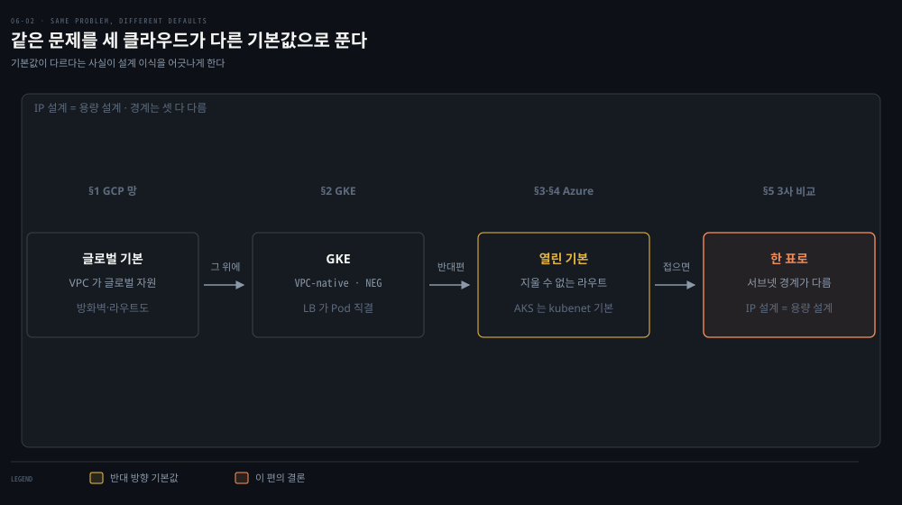
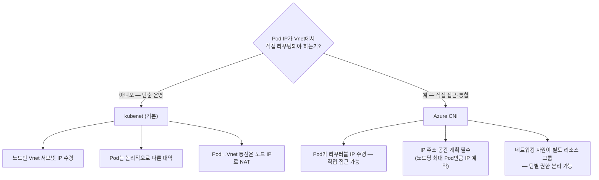
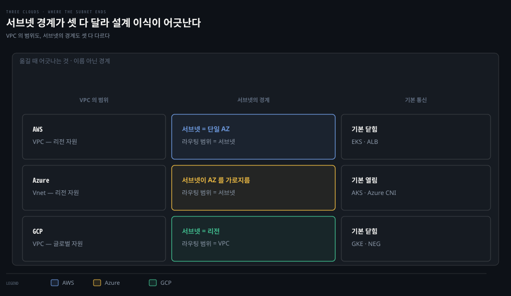

# GCP·Azure와 3사 비교 — 같은 문제, 다른 기본값

## 핵심 요약
> 이 편 전체가 매달린 하나의 생각은 "세 클라우드는 같은 문제를 다른 기본값으로 푼다"입니다.
> 관리형 Kubernetes의 네트워킹이라는 문제는 같지만 — GCP는 VPC·방화벽이 글로벌 자원이고 LB가 Anycast 단일 IP이며, Azure는 리소스 그룹 중심에 서브넷이 AZ를 가로지르고 기본 인터넷 라우트가 열려 있습니다. GKE의 VPC-native + NEG는 Pod 직결 로드밸런싱을, AKS의 kubenet vs Azure CNI는 "Pod IP가 라우터블인가"라는 EKS에서 본 그 선택을 다른 이름으로 되풀이합니다.

## 학습 목표
> 세 클라우드를 따로 외우는 대신, 같은 문제를 어떤 기본값으로 풀었는지 대응시켜 볼 수 있는 상태를 목표로 합니다.

이 내용을 읽고 나면:

1. GCP의 글로벌 자원 개념과 네트워크 티어 2종의 거래를 설명할 수 있습니다.
2. GKE의 VPC-native vs routes-based, NEG 컨테이너 네이티브 LB의 이점을 말할 수 있습니다.
3. Azure Vnet·서브넷·라우팅 테이블의 기본값(특히 기본 인터넷 라우트)의 보안 함의를 설명할 수 있습니다.
4. AKS의 kubenet과 Azure CNI의 차이를 Pod IP 라우팅 관점에서 구분할 수 있습니다.
5. 3사 네트워킹 개념을 한 표로 대응시킬 수 있습니다.

아래는 이 편 전체를 두 줄기로 나눠 놓은 지도입니다. 왼쪽이 GCP, 오른쪽이 Azure 이고 둘 사이에 순서는 없습니다. 각 줄기가 네트워크 층에서 관리형 Kubernetes 층으로 내려간 뒤 §5 의 비교표에서 AWS 까지 합쳐집니다. 각 상자 오른쪽의 절 번호가 본문에서 그것을 다루는 곳입니다. 색이 붙은 곳은 Azure 의 첫 상자 한 군데뿐이고 경고입니다. 기본 라우트가 열려 있다는 사실이 이 편에서 가장 자주 사고를 내는 기본값이라 표시했습니다.

## 1. GCP 네트워크 — 글로벌이 기본인 세계
> GCP 를 가르는 선은 범위입니다. VPC·방화벽·라우트가 리전에 묶이지 않는 글로벌 자원이라는 점이 나머지 설계를 바꿉니다.

GCP에서 관리형·비관리형 클러스터는 같은 네트워킹 원리를 공유하고, 노드는 GCE 인스턴스로 돕니다. 첫 특징은 네트워크 티어입니다 — premium 티어(기본값)는 인터넷↔인스턴스 트래픽을 가능한 한 Google 망 안에서 라우팅해 성능이 가장 좋고 글로벌 가용성이 필요하면 이것을, standard 티어는 일반 인터넷 경유의 비용 최적화형으로 한 리전 안에 머무는 서비스에 씁니다.

둘째 특징이 GCP를 가르는 선입니다 — VPC·방화벽·라우트가 글로벌 자원입니다. 같은 프로젝트라면 어느 존에서든 접근되고, VPC는 특정 리전·존에 묶이지 않습니다.

VPC는 리전 단위 서브넷을 담으며(auto 모드는 리전마다 자동 생성, custom 모드는 관리자가 직접 — 기업·프로덕션 권장), 겹치는 사설 대역도 서브넷 CIDR로 쓸 수 있지만 그 선택이 피어링 가능 범위를 정합니다. 기본 생성되는 "default" VPC의 무작위 서브넷이 다른 프로젝트와 겹쳐 피어링을 막을 수 있다는 경고도 있습니다.

방화벽 규칙은 인스턴스 수준에서 강제되고 VPC에 짝지어지며(피어링 네트워크와도 공유 불가), stateful이라 AWS 보안 그룹과 비슷하게 동작합니다.

로드밸런싱은 GCLB 가 맡습니다. 전 세계 백엔드를 하나의 Anycast IP 로 프론팅하는 분산 LB 이며 HTTP(S)·TCP/SSL·UDP 를 지원합니다. GKE 관점에서는 셋으로 나뉩니다.

- **외부 LB**: 클러스터·VPC 밖 트래픽. 포워딩 규칙 사용
- **내부 LB**: 같은 VPC 안 트래픽. 포워딩 규칙 사용
- **HTTP LB**: HTTP 전용 외부 LB. ingress 리소스 사용

## 2. GKE — 숨은 컨트롤 플레인과 NEG
> 서브넷 크기가 노드 수 상한을 정하는 공식이 GCP 문법으로 반복됩니다. VPC-native 를 고르면 LB 가 Pod 로 직접 가는 문이 열립니다.

GKE 의 컨트롤 플레인은 숨겨져 있습니다. 직접 보거나 접근할 수 없고 Kubernetes API 와 일부 설정만 노출됩니다. 네트워크 관련 커스터마이즈는 책 시점 기준으로 셋 정도입니다.

- NetworkPolicy 지원 (Calico 경유)
- 노드당 최대 Pod — `maxPods`·`node-CIDR-mask-size`
- Pod 주소 대역 — `cluster-CIDR`

apiserver 플래그를 직접 설정하는 것은 불가합니다.

private 클러스터는 노드에 공인 IP를 주지 않고 API 접근을 특정 IP로 제한할 수 있습니다. 노드는 노드풀(동일 구성 노드 집합 — 머신 타입·오토스케일·서비스 어카운트·taint·label) 단위로 GCE 인스턴스가 자동 관리됩니다.

서브넷 크기가 클러스터 상한을 정하는 공식이 여기도 나옵니다 — 넷마스크 S로 지원 가능한 최대 노드 수 N = 2^(32-S) - 4. /24면 252노드, auto 모드 기본 /20이면 4,092노드입니다(EKS 편의 "네트워크 설계 = 용량 설계"가 GCP 문법으로 반복되는 지점).

클러스터 모드가 이 편의 핵심 선택입니다. alias IP 대역을 쓰면 VPC-native 이고 커스텀 정적 라우트를 쓰면 routes-based 입니다. 생성 방법에 따라 기본값이 갈리는데, 책의 표 기준으로는 이렇습니다.

- 콘솔: VPC-native
- REST API: routes-based
- gcloud: 버전대가 갈라놓음. v251.0.0~255.0.0 만 VPC-native 이고 v250.0.0 이하와 v256.0.0 이상은 routes-based

VPC-native의 이점은 Pod IP가 VPC 안에서 네이티브 라우터블이라는 것 — Pod 생성 전 대역 예약, Pod 대역만 겨냥한 방화벽, 온프레미스 연결의 Pod 대역 확장까지 따라옵니다.

VPC-native에서만 열리는 문이 NEG(network endpoint group)입니다. LB가 서빙하는 백엔드 목록(IP들)인데 그 IP가 VM의 보조 IP — 즉 Pod IP일 수 있어서, Google Cloud LB가 노드·NodePort를 거치지 않고 Pod로 직접 가는 컨테이너 네이티브 로드밸런싱이 됩니다.

이점은 셋입니다.

- **홉 감소** — 지연·처리량 개선
- **개별 관측** — LB→Pod 지연이 개별로 보여 트러블슈팅 용이
- **네이티브 통합** — Cloud Armor·CDN·IAP 같은 고급 기능

ingress를 만들면 GKE ingress controller가 매니페스트대로 HTTP(S) LB를 구성하고, "Pod 인지" LB는 Endpoints/EndpointSlice를 추적해 Pod IP를 대상으로 삼습니다. 비용을 아끼려면 클러스터 내 ingress(nginx·Contour)로 LB 하나에 몰 수도 있지만 성능 오버헤드가 따릅니다 — 5장의 내부 LB 거래와 같은 구조입니다. 책 시점 기준 GCP는 IPv6 미지원이라는 점도 3사 비교의 한 줄입니다.

## 3. Azure 네트워크 — 리소스 그룹과 열린 기본 라우트
> Azure 는 기본값이 열려 있습니다. 삭제할 수 없는 인터넷행 기본 라우트가 다른 클라우드와의 본질적 차이이자 보안 설계의 출발점입니다.

Azure 는 배포 모델부터 다릅니다. 초기 classic 모델은 자원이 전부 독립이라 그룹화가 불가능했습니다. 2014년 Azure Resource Manager(ARM)가 리소스 그룹으로 이 한계를 풀었습니다. 리소스 그룹은 자원의 논리 묶음이라 추적·태깅·일괄 구성이 가능해집니다. 지금은 ARM 이 권장 모델입니다.

네트워크의 중심은 Vnet 입니다. 리전 하나에 한정되며 한 리전에 여러 Vnet 을 둘 수 있습니다. 구독과 리소스 그룹 아래 놓이고, 설정을 바꾸지 않는 한 기본 라우트로 인터넷과 통신할 수 있습니다. 계층은 지리(geography) > 리전 > 가용 영역 구조입니다. AZ 는 독립 전원·냉각·네트워킹을 갖춘 물리 위치로 99.99% 가동률의 근거가 됩니다.

주목할 차이가 둘 있습니다. 첫째, Azure 서브넷은 AZ 를 가로지릅니다. AWS 서브넷이 단일 AZ 인 것과 대비되는 지점입니다. 둘째, IP 주소가 독립 자원입니다. 공인·사설 IP 를 자원 없이 미리 만들어 static 또는 dynamic 으로 예약할 수 있습니다. Azure CNI 로 스케일할 AKS 라면 Pod 용 사설 IP 예약이 준비 단계가 됩니다.

라우팅 테이블은 서브넷마다 기본 제공됩니다. 그 기본 시스템 라우트는 삭제·변경이 불가하고, 거기에 인터넷행 기본 라우트가 포함됩니다. 새로 만든 자원이 기본적으로 인터넷과 통신할 수 있다는 뜻입니다. 저자들은 이를 다른 클라우드와의 본질적 차이이자 보안 조치가 필요한 지점으로 짚습니다.

통제 수단은 둘입니다. 사용자 정의 라우트(UDR)로 기본 라우트를 우선순위로 눌러 인터넷행을 가상 방화벽 어플라이언스로 보낼 수 있습니다. 서비스 태그를 쓰면 IP 를 몰라도 규칙을 쓸 수 있습니다. `SQL.EastUs` 처럼 서비스 IP 집합을 대표하는 문구입니다.

서브넷에는 NAT도 켤 수 있습니다 — 공인 IP 없이 프로비저닝된 공인 IP 풀로 나가는 아웃바운드 전용 인터넷 통신을 허용하되 인바운드 접근은 차단하며, 설정되면 다른 아웃바운드 규칙보다 우선하고 기본으로 PAT(포트 주소 변환)를 씁니다.

NSG(network security group)는 Vnet·서브넷·NIC 에 붙는 필터입니다. 구성 요소는 우선순위, 출발·목적지, 프로토콜, 방향, 포트, 허용·거부입니다. 우선순위는 100~4096 범위에서 낮을수록 먼저 평가되고 첫 매치가 적용됩니다. 출발·목적지에는 IP·CIDR·서비스 태그·ASG 를 쓸 수 있습니다. 실무 주의 셋이 따라옵니다.

- 같은 우선순위+방향의 중복은 불가합니다.
- 포트 범위는 ARM 모델 전용입니다.
- 공인·사설 IP를 다 가진 자원은 사설 IP로 지정합니다(변환이 바깥에서 일어나므로).

LB 는 둘입니다.

- **Standard LB**: L4 입니다. zero-trust 모델이라 NSG 가 트래픽을 열어 줘야 라우팅됩니다.
- **Application Gateway**: L7 입니다. URI·호스트 헤더 필터와 WAF 를 겸하고, AKS 의 ingress controller 로도 쓸 수 있습니다.

## 4. AKS — kubenet과 Azure CNI의 갈림길
> "Pod IP 가 라우터블인가"라는 4장의 그 선택이 Azure 이름으로 되풀이됩니다. 운영 단순함과 직접 접근성의 거래입니다.

AKS는 마스터를 Azure가 관리해 코어가 무료이고(과금은 에이전트 노드·주변 서비스), CLI·PowerShell·Portal·ARM 템플릿·Terraform으로 만듭니다. 네트워킹 선택이 이 절의 본론입니다.

kubenet에서는 노드만 라우터블 IP를 받고 Pod는 못 받습니다 — Pod의 Vnet 통신은 노드 기본 주소로 SNAT됩니다(4장의 Island 레이아웃이 Azure 문법으로 재등장). Azure CNI는 Pod에 라우터블 IP를 줘 직접 접근이 가능해지는 대신 IP 계획의 무게가 커지고, Vnet 안 트래픽은 더 이상 노드 IP로 NAT되지 않습니다(인터넷행은 여전히 노드 IP로 NAT). Azure CNI는 AKS 밖 자가 관리 클러스터에도 쓸 수 있습니다.

ingress 쪽 고유물이 AGIC(application gateway ingress controller)입니다 — 클러스터 안에 Pod로 배포돼 클러스터 변화를 감시하다가, 변경이 감지되면 Application Gateway를 구성하는 ARM 템플릿을 갱신·적용합니다. 별도 LB 유지가 필요 없어져 운영 부담과 장애 지점이 줄고, TLS 종료·URL 라우팅·WAF 같은 게이트웨이 기능이 ingress로 그대로 옵니다.

SKU 제한(Standard_v2·WAF_v2)이 있고, Helm 배포와 AKS add-on의 차이 셋을 책이 정리합니다.

- **값 편집** — add-on은 Helm 값 편집 불가
- **Prohibited Target** — Helm만 지원(게이트웨이가 AKS 외 백엔드를 건드리지 않게)
- **업데이트** — add-on은 관리형이라 자동, Helm은 수동

실습 골격은 여섯 단계입니다.

1. ACR(컨테이너 레지스트리)에 `docker login`·`tag`·`push` 로 이미지를 등록합니다.
2. 서비스 주체(service principal, AD 애플리케이션 객체의 대표)로 클러스터의 ACR pull 권한을 구성합니다.
3. Portal 에서 클러스터를 만듭니다. 구독 → 리소스 그룹 → 클러스터명·리전·노드풀 순서입니다.
4. `az aks get-credentials` 로 접속합니다.
5. `az aks update --attach-acr` 로 레지스트리를 연결합니다.
6. YAML 을 배포한 뒤 LoadBalancer 의 EXTERNAL-IP 로 curl 검증합니다.

## 5. 3사 비교 — 한 표로 접기
> 용어 대응이 곧 이 장의 요약입니다. 특히 서브넷 경계가 셋 다 다르다는 점이 설계 이식 시 가장 자주 어긋나는 지점입니다.

책의 마무리 표(Table 6-4)를 그대로 옮깁니다. 용어 대응이 곧 이 장의 요약입니다.

| 항목 | AWS | Azure | GCP |
|------|-----|-------|-----|
| 가상 네트워크 | VPC | Vnet | VPC |
| 네트워크 범위 | 리전 | 리전 | 글로벌 |
| 서브넷 경계 | 존(AZ) | 리전 | 리전 |
| 라우팅 범위 | 서브넷 | 서브넷 | VPC |
| 보안 통제 | NACL/SecGroups | NSG/ASG | 방화벽 규칙 |
| IPv6 (책 시점) | 지원 | 지원 | 미지원 |
| 관리형 K8s | EKS | AKS | GKE |
| 관리형 ingress | AWS ALB controller | Nginx-Ingress | GKE ingress controller |
| 클라우드 CNI | AWS VPC CNI | Azure CNI | GKE CNI |
| LB 지원 | ALB L7, L4 w/NLB·Nginx | L4 Standard LB, L7 w/Nginx | L7 HTTP(S) w/Nginx |
| NetworkPolicy | 지원 (Calico/Cilium) | 지원 (Calico/Cilium) | 지원 (Calico/Cilium) |

> 💬 **비유**: 세 클라우드는 세 나라의 도로 행정입니다. AWS는 주(리전)마다 도로청(VPC)을 두고 시(AZ) 단위로 구획(서브넷)을 나눕니다. GCP는 전국 단일 도로청(글로벌 VPC)이라 어느 주에서든 같은 규정(방화벽·라우트)이 통하고, 고속도로(premium 티어)와 국도(standard 티어)를 고를 수 있습니다. Azure는 행정구역(리소스 그룹)으로 시설을 묶어 관리하되, 새 건물의 대문이 기본적으로 열려 있어(기본 인터넷 라우트) 입주자가 잠금 장치(NSG·UDR)를 챙겨야 합니다.

## 심화 학습
> 책 밖에서 보강한 내용입니다. 출처를 함께 남깁니다.

- "GCP IPv6 미지원"은 책 시점(2021)의 사실입니다. 이후 GCP는 VPC·GCE의 IPv6(dual-stack)를 GA했고 GKE도 dual-stack 클러스터를 지원합니다 — [GCP 문서 — IPv6 지원](https://cloud.google.com/vpc/docs/ipv6-support) 참조. 비교표의 그 행은 낡은 정보로 읽어야 합니다.
- AKS의 네트워킹 선택지도 늘었습니다 — Azure CNI Overlay(Pod IP를 Vnet 밖 오버레이 대역에서 할당해 IP 계획 부담을 줄인 절충)와 kubenet의 retirement 예고(2028-03-31)가 공지돼, "kubenet vs CNI" 이분법은 현재 "CNI 계열 안의 선택"으로 이동 중입니다 — [AKS 문서 — 레거시 CNI(kubenet)](https://learn.microsoft.com/azure/aks/concepts-network-legacy-cni) 참조.
- 이 장의 GCP 서브넷-노드 공식과 EKS의 Pod 공식은 같은 교훈의 두 표현입니다 — 관리형 K8s에서 IP 설계가 용량 설계라는 것. 사용자 환경(AWS SAA 학습 맥락)에서는 06-01의 EKS 공식이 1차 참조입니다.

## 결정 치트시트
> 클라우드별 첫 결정 하나씩입니다.

| 클라우드 | 첫 결정 | 기준 |
|----------|--------|------|
| GCP | VPC-native인가 | 신규는 VPC-native — NEG 컨테이너 네이티브 LB·Pod 대역 방화벽이 열림 |
| GCP | 티어 | 글로벌 가용성 필요하면 premium(기본), 단일 리전 비용 최적화면 standard |
| Azure | kubenet인가 Azure CNI인가 | Pod 직접 접근·Vnet 통합 필요하면 CNI — 대신 IP 예약 계획 필수 |
| Azure | 기본 인터넷 라우트 통제 | UDR로 방화벽 경유 강제 — 기본값이 열려 있음을 전제로 설계 |
| 공통 | 서브넷 크기 | 공식으로 역산 (GCP: N=2^(32-S)-4, EKS: ENI 공식) — 나중에 늘리기 어려움 |

## 면접에서 받을 만한 질문
> 답을 가리고 스스로 말해 본 뒤, 아래 정답 절에서 맞춰 봅니다.

1. VPC-native GKE 클러스터를 "한 줄"로 정의한다면?
2. GCP 네트워킹의 차별점을 한 문장으로 말한다면?
3. Azure 네트워킹의 "기본값 함정"은 무엇인가요?
4. AKS kubenet과 Azure CNI는 무엇을 가르는 선택인가요?
5. 세 클라우드의 서브넷 개념에서 가장 조심할 차이는?
6. NEG 컨테이너 네이티브 로드밸런싱이 왜 빠른가요?
7. AGIC의 add-on 배포와 Helm 배포는 어떻게 고르나요?

## 정답 (자답 후 펼치기)
> 위 §면접에서 받을 만한 질문에 *먼저 자답한 뒤* 아래를 읽으세요. 자답 없이 먼저 읽으면 학습 효과가 0입니다.

### 1. VPC-native GKE 한 줄 정의
"VPC-native GKE 클러스터란 Pod IP를 alias IP 대역으로 VPC에서 직접 할당해 네이티브 라우팅되게 한 모드로, NEG를 통해 LB가 노드를 거치지 않고 Pod로 직접 가는 컨테이너 네이티브 로드밸런싱의 전제가 됩니다."

### 2. GCP의 차별점
글로벌 자원입니다. VPC·방화벽·라우트가 리전에 묶이지 않아 어느 존에서든 같은 규정이 통하고, GCLB는 Anycast 단일 IP로 전 세계 백엔드를 프론팅합니다.

### 3. Azure의 기본값 함정
모든 서브넷에 삭제 불가한 인터넷행 기본 라우트가 있어, 새로 만든 자원이 기본적으로 인터넷과 통신할 수 있다는 점입니다. NSG·UDR로 명시적으로 잠그는 설계가 필요합니다.

### 4. kubenet vs Azure CNI
"Pod IP가 라우터블인가"의 선택입니다. kubenet은 노드만 라우터블 IP를 받고 Pod는 노드 IP로 NAT돼 운영이 단순하고 IP를 아끼지만, Azure CNI는 Pod에 라우터블 IP를 줘 직접 접근이 가능한 대신 IP 계획의 무게가 커집니다.

### 5. 세 클라우드 서브넷 경계 차이
경계입니다. AWS 서브넷은 단일 AZ에 묶이지만 Azure 서브넷은 AZ를 가로지르고, GCP 서브넷은 리전 자원입니다. AWS식 "AZ당 서브넷" 사고를 다른 클라우드에 그대로 이식하면 설계가 어긋납니다.

### 6. NEG가 빠른 이유
LB가 노드 IP:NodePort로 보내고 노드의 iptables가 다시 Pod를 고르는 2단계 대신, LB가 Endpoints/EndpointSlice에서 Pod IP를 직접 대상으로 삼아 홉이 줄기 때문입니다. 지연·처리량 개선과 함께 LB→Pod 구간 지연이 개별로 관측된다는 부수 효과도 있습니다.

### 7. AGIC add-on vs Helm
자동 업데이트되는 관리형을 원하면 add-on, 세밀한 값 편집과 Prohibited Target(게이트웨이가 AKS 외 백엔드를 건드리지 않게) 구성이 필요하면 Helm입니다.

## 핵심 개념 체크리스트
> 여섯 항목을 막힘없이 답할 수 있으면 이 책 정독을 마친 것입니다.
- [ ] GCP 글로벌 자원 3가지(VPC·방화벽·라우트)를 나열할 수 있는가?
- [ ] VPC-native의 이점과 NEG의 관계를 설명할 수 있는가?
- [ ] Azure 기본 인터넷 라우트의 보안 함의와 UDR 대응을 아는가?
- [ ] NSG 우선순위 규칙(100~4096, 첫 매치)과 주의 3가지를 아는가?
- [ ] kubenet 규칙 4가지와 Azure CNI의 거래를 재구성할 수 있는가?
- [ ] 3사 비교표의 서브넷 경계 행(존/리전/리전)을 기억하는가?

## 참고 자료
- 《Networking and Kubernetes: A Layered Approach》(James Strong·Vallery Lancey, O'Reilly, 2021, ISBN 978-1492081654) Ch6
- [GKE 네트워크 개요](https://cloud.google.com/kubernetes-engine/docs/concepts/network-overview)
- [AKS 네트워킹 개요](https://learn.microsoft.com/azure/aks/concepts-network)
- 이전 편: [06-01. AWS 네트워킹과 EKS](./06-01.AWS%20%EB%84%A4%ED%8A%B8%EC%9B%8C%ED%82%B9%EA%B3%BC%20EKS%20%E2%80%94%20VPC%20%EB%B6%80%ED%92%88%EC%9C%BC%EB%A1%9C%20%EC%A1%B0%EB%A6%BD%ED%95%98%EB%8A%94%20%ED%81%B4%EB%9F%AC%EC%8A%A4%ED%84%B0.md)
