# 노드와 클러스터의 소속 — 겹쳐 보이는 클러스터는 어느 층에서 겹치는가

---

> 노드 다섯 대를 클러스터 셋이 나눠 쓴다는 말은 쿠버네티스 층에서는 성립하지 않습니다. kubelet 은 kubeconfig 하나로 API 서버 하나에 자기를 등록하고, Node 오브젝트는 그 클러스터의 API 안에만 삽니다. 겹치는 것이 있다면 그것은 Node 가 아니라 Node 를 만들어 내는 아래층입니다.

## 학습 목표

> 이 문서를 읽고 나면 아래 네 가지를 스스로 해낼 수 있습니다.

1. 노드가 클러스터에 소속되는 경로를 kubelet 의 자가등록 절차로 설명할 수 있습니다.
2. "여러 클러스터가 노드를 겹쳐 쓴다"는 말을 물리 호스트 공유·가상 컨트롤 플레인·kubelet 이중 등록 셋으로 갈라 되물을 수 있습니다.
3. 클러스터는 나누면서 물리 자원은 공유하는 구성이 무엇을 얻고 무엇을 포기하는지 판단할 수 있습니다.
4. 아래층에서 자원이 겹칠 때 위층 스케줄러가 그것을 왜 보지 못하는지 공식 문서 근거로 설명할 수 있습니다.

다루지 않는 범위가 둘 있습니다. 노트북 한 대에서 kind 나 k3d 로 클러스터를 여러 개 띄우는 방법은 [로컬 클러스터 구성](../../kubernetes/00_overview/00-01.%EB%A1%9C%EC%BB%AC%20%ED%81%B4%EB%9F%AC%EC%8A%A4%ED%84%B0%20%EA%B5%AC%EC%84%B1.md)에 있습니다. 클러스터를 실제로 늘린 뒤의 운영 모델은 정독 노트 [Multicluster](../../book/kubernetes-up-and-running/21-01.Multicluster%20%E2%80%94%20%EB%8A%98%EB%A6%AC%EA%B8%B0%20%EC%A0%84%EC%97%90%20%EA%B0%96%EC%B6%9C%20%EA%B2%83%EA%B3%BC%20%EB%8A%98%EB%A6%B0%20%EB%92%A4%20%EA%B0%88%EB%A6%AC%EB%8A%94%20%EC%84%B8%20%EB%AA%A8%EB%8D%B8.md)가 다룹니다.

## 1. 들은 이야기를 그대로 적어 둡니다

> 노드 다섯 대에 클러스터 셋이 1~3, 3~5, 2~4 로 걸쳐 있다는 전언에서 출발합니다.

회사가 OpenStack 과 OpenShift 로 자원을 관리하면서 이런 구성으로 간다는 이야기를 들었습니다. 노드가 다섯 대 있고, 클러스터 A 는 1~3번을, B 는 3~5번을, C 는 2~4번을 쓴다는 그림입니다. 3번은 세 클러스터가 모두 걸쳐 있는 자리가 됩니다.

이 문서는 그 전언을 사실로 확정하지 않습니다. 사내 구성을 직접 확인한 것이 아니라 전해 들은 문장이기 때문입니다. 대신 확인할 수 있는 것을 확인합니다. 쿠버네티스 공식 문서가 노드와 클러스터의 소속을 어떻게 정의하는지 읽고, 그 정의 위에서 저 문장이 어느 층의 이야기여야 말이 되는지를 따져 봅니다.

결론을 먼저 적어 둡니다. 쿠버네티스가 아는 Node 는 겹치지 않습니다. 겹치는 것이 있다면 그것은 Node 를 만들어 내는 아래층입니다.

## 2. 노드는 물리 머신일 수도, 가상 머신일 수도 있습니다

> 공식 문서의 첫 문단이 이미 노드를 특정 하드웨어에 고정하지 않습니다.

Nodes 문서는 노드를 이렇게 엽니다. "A node may be a virtual or physical machine, depending on the cluster."[^k8s-nodes] 노드는 쿠버네티스가 파드를 얹는 자리를 가리키는 이름이지, 특정 쇳덩이를 가리키는 이름이 아닙니다.

이 한 문장이 질문의 절반을 풉니다. "노드 다섯 대"가 물리 서버 다섯 대를 뜻하는지, 아니면 그 위에 뜬 가상 머신 다섯 대를 뜻하는지에 따라 뒤따르는 이야기가 완전히 갈리기 때문입니다. 같은 문장을 두고 한 사람은 랙에 꽂힌 서버를 떠올리고 다른 사람은 `openstack server list` 의 출력을 떠올릴 수 있습니다.

전언에 OpenStack 이 함께 나왔다는 점이 단서입니다. OpenStack 의 컴퓨트 서비스인 Nova 는 컴퓨트 인스턴스, 곧 가상 서버를 제공하는 프로젝트이며 기존 Linux 서버 위에서 데몬 묶음으로 돕니다.[^openstack-nova] 즉 물리 서버 위에 가상 머신을 찍어 내는 층입니다. 그 위에 클러스터를 올린다면 노드가 가상 머신이 되는 것이 자연스러운 귀결입니다. 그렇다면 "노드"라는 한 단어가 두 층을 오가며 쓰였을 가능성을 먼저 의심해야 합니다.

노드 위에 올라가는 것은 kubelet 과 컨테이너 런타임과 kube-proxy 입니다.[^k8s-nodes] 이 셋이 올라간 순간부터 그 머신은 쿠버네티스의 노드로 행동합니다. 그 아래가 베어메탈인지 가상 머신인지는 쿠버네티스의 관심사가 아닙니다. 바로 그 무관심이 이 문서가 다루는 혼동의 출발점입니다.

## 3. kubelet 은 자기를 API 서버 하나에 등록합니다

> 소속을 만드는 것은 네트워크 배선이 아니라 kubelet 의 등록 절차입니다.

노드가 클러스터에 들어가는 경로는 둘입니다. kubelet 이 스스로 컨트롤 플레인에 등록하거나, 사람이 Node 오브젝트를 직접 만듭니다.[^k8s-nodes] 대부분의 배포판이 쓰는 쪽은 앞의 것입니다. `--register-node` 플래그가 기본값인 true 이면 kubelet 은 API 서버에 자기를 등록하려 시도합니다.

자가등록에 쓰는 플래그 가운데 이 문서의 논지와 닿는 것은 `--kubeconfig` 입니다. 공식 문서는 이 값을 "Path to credentials to authenticate itself to the API server" 로 설명합니다.[^k8s-nodes] kubelet 프로세스 하나는 자격증명 하나를 들고 API 서버 하나에 자기를 인증합니다.

여기에 두 가지 제약이 더 붙습니다. Node 이름은 클러스터 안에서 유일해야 하며, 쿠버네티스는 같은 이름의 리소스를 같은 오브젝트로 간주합니다.[^k8s-nodes] 그리고 Node authorization 모드와 NodeRestriction 어드미션 플러그인이 켜져 있으면 kubelet 은 자기 Node 리소스만 만들거나 고칠 수 있습니다.[^k8s-nodes]

### 소속이 만들어지는 순서

정리하면 소속은 세 걸음으로 생깁니다.

1. kubelet 이 kubeconfig 가 지목한 API 서버에 자기를 등록합니다.
2. 그 클러스터의 저장소 안에 Node 오브젝트가 만들어집니다.
3. 그 뒤로 kubelet 은 그 API 서버에만 상태를 보고합니다.

마지막 보고 경로는 다시 둘로 나뉩니다. Node 의 `.status` 를 갱신하는 경로와 `kube-node-lease` 네임스페이스의 Lease 오브젝트를 갱신하는 경로입니다.[^k8s-node-status]

Node 오브젝트는 그 클러스터의 API 안에서만 존재합니다. 다른 클러스터의 API 서버에는 그런 이름의 오브젝트가 없고, 있더라도 그것은 별개의 오브젝트입니다.

### 그래서 한 노드가 두 클러스터에 속하지 못합니다

공식 문서에 "노드는 클러스터 하나에만 속한다"는 금지 문장이 따로 적혀 있는 것은 아닙니다. 그 결과는 등록 모델에서 따라 나옵니다. 셋이 모두 하나씩이기 때문입니다.

- kubelet 이 드는 자격증명이 하나입니다.
- 그 자격증명이 가리키는 API 서버가 하나입니다.
- 거기 만들어지는 Node 오브젝트가 하나입니다.

한 머신에서 kubelet 을 두 개 띄워 서로 다른 클러스터에 붙이는 그림을 상상할 수는 있습니다. 그러나 그것은 노드 하나가 두 클러스터에 속한 상태가 아닙니다. kubelet 이 둘이므로 노드도 둘입니다.

두 kubelet 은 같은 컨테이너 런타임과 같은 cgroup 트리와 같은 디스크를 서로 모른 채 나눠 씁니다. 그러면서 각자 자기 클러스터에는 머신 전체를 자기 것으로 보고합니다. 공식 문서가 상정하는 구성이 아닙니다. §6 에서 볼 이유로 두 스케줄러가 같은 자원을 두 번 팔게 됩니다.

## 4. 그래서 "겹친다"는 말은 셋 중 하나입니다

> 물리 호스트 공유·가상 컨트롤 플레인·kubelet 이중 등록으로 갈라 되물으면 답이 하나로 좁혀집니다.

위 격자는 세 읽기 중 첫 번째를 그린 것입니다. 세로축은 물리 컴퓨트 호스트이고 가로축은 클러스터이며, 칸이 채워졌다는 것은 그 호스트 위에 그 클러스터의 노드 VM 이 떠 있다는 뜻입니다. 전언의 "1~3, 3~5, 2~4" 를 이 격자에 옮기면 3번 호스트에만 세 클러스터가 함께 얹힙니다. 이 읽기가 맞다면 겹침이 일어나는 자리는 격자의 세로축, 즉 물리 호스트 쪽입니다.

### 읽기 1 — 물리 호스트를 공유합니다

가장 흔하고 전언의 문맥에도 가장 잘 맞는 읽기입니다. OpenStack 이 컴퓨트 호스트를 관리하고 각 클러스터의 노드는 그 위에 뜬 가상 머신인 경우입니다. 이 층에서 한 호스트에 인스턴스가 여럿 뜨는 것은 예외가 아니라 기본입니다. `nova-scheduler` 가 인스턴스마다 어느 호스트에 띄울지 정합니다. 호스트에 도는 인스턴스 수로 거르는 필터까지 갖춰 두었습니다.[^openstack-nova] 호스트 3번에 클러스터 A 의 노드 VM 과 B 의 노드 VM 이 나란히 떠 있다면, 사람의 눈에는 "3번을 A 와 B 가 같이 쓴다"로 보입니다.

이 읽기에서 쿠버네티스의 규칙은 하나도 깨지지 않습니다. 클러스터 A 의 Node 는 A 의 API 서버에 등록된 가상 머신이고, B 의 Node 는 B 의 API 서버에 등록된 다른 가상 머신입니다. 두 Node 는 이름도 다르고 오브젝트도 다릅니다. 같은 것은 그 아래 하이퍼바이저뿐입니다.

공식 Multi-tenancy 문서에도 이 층을 짚는 대목이 있습니다. 테넌트마다 전용 클러스터를 주는 선택을 설명하면서 "possibly even running on dedicated hardware if VMs are not considered an adequate security boundary" 라는 단서를 답니다.[^k8s-mt] 전용 하드웨어를 *추가* 조치로 적었다는 것은 클러스터를 나누는 일과 하드웨어를 나누는 일이 별개 결정이라는 뜻입니다. 다만 원문은 극단적인 경우의 전용 클러스터를 말하는 문단이므로, 어느 쪽이 더 흔한지까지 읽어 내지는 않습니다.

### 읽기 2 — 가상 컨트롤 플레인이 워커 노드를 공유합니다

공식 문서가 명시적으로 인정하는 두 번째 읽기입니다. Multi-tenancy 문서의 virtual control plane per tenant 모델에서는 테넌트마다 API 서버와 컨트롤러 매니저와 etcd 를 따로 줍니다. 그리고 워커 노드에 대해 이렇게 적습니다.[^k8s-mt]

> Worker nodes are shared across all tenants, and are managed by a Kubernetes cluster that is normally inaccessible to tenants.

그 아래 깔린 클러스터를 super-cluster 또는 host-cluster 라 부릅니다.

이 모델에서는 "여러 클러스터가 노드를 공유한다"는 문장이 말 그대로 성립합니다. 다만 공유하는 주체는 가상 컨트롤 플레인이고, 워커 노드를 실제로 관리하는 것은 super-cluster 하나입니다. 테넌트의 가상 컨트롤 플레인에 Node 오브젝트가 어떤 형태로 보이는지는 공식 문서가 다루지 않으므로 여기서 단정하지 않습니다. 원문이 말하는 것은 super-cluster 와 테넌트 컨트롤 플레인 사이를 메타데이터 동기화 컨트롤러가 잇는다는 데까지입니다.[^k8s-mt]

배포판마다 이 모델을 제품 기능으로 갖추기도 합니다. 다만 어느 제품이 어떤 이름으로 무엇을 지원하는지는 k8s.io 밖이고 이 문서에서 확인하지 않았으므로, 사실로 적지 않고 되물을 항목으로만 남깁니다. 쓰고 있는 배포판이 컨트롤 플레인을 별도 관리 클러스터에 얹는 방식을 쓰는지 그 제품 문서로 확인합니다.

### 읽기 3 — 한 kubelet 이 두 클러스터에 등록합니다

§3 에서 본 대로 이 길은 없습니다. 되물을 때 이 선택지를 먼저 지워 두면 대화가 빨라집니다. "노드가 두 클러스터에 동시에 속하나요"라고 묻는 대신 "그 노드가 VM 인가요, 아니면 노드를 얹는 물리 호스트가 겹치는 건가요"라고 물으면 상대가 어느 층을 말하는지 한 번에 드러납니다.

## 5. 물리 풀은 공유하고 클러스터는 나누는 이유

> 클러스터는 격리의 단위이고 물리 호스트는 활용률의 단위라, 둘을 서로 다른 축으로 나눈 결과입니다.

클러스터를 나누면 얻는 것이 분명합니다. 컨트롤 플레인이 따로이므로 한쪽의 etcd 부하나 어드미션 웹훅 오설정이 다른 쪽으로 번지지 않습니다. 업그레이드도 클러스터 단위로 끊어서 할 수 있고, CRD 나 StorageClass 처럼 네임스페이스로 나뉘지 않는 리소스의 이름 충돌도 사라집니다. 공식 문서는 네임스페이스 격리로는 다루지 못하는 리소스로 CRD 와 StorageClass 와 웹훅을 꼽습니다.[^k8s-mt]

대신 잃는 것도 분명합니다. 같은 문서가 "The benefit of stronger tenant isolation must be evaluated against the cost and complexity of managing multiple clusters" 라고 적어 둔 그대로입니다.[^k8s-mt] 클러스터마다 컨트롤 플레인이 있으니 그만큼의 상시 자원이 나가고, 운영해야 할 대상도 늘어납니다.

물리 자원을 공유하는 쪽은 이 비용을 부분적으로 상쇄합니다. 클러스터 셋이 각자 물리 서버 다섯 대를 통째로 잡으면 열다섯 대가 필요하지만, 다섯 대의 풀 위에 세 클러스터의 노드 VM 을 흩어 놓으면 다섯 대로 끝납니다. 클러스터마다 사용률이 다르고 피크 시간대가 다르다면 그 차이만큼이 이득이 됩니다.

이 절충은 두 질문을 다른 축으로 나눈 결과입니다. "누구의 장애가 누구에게 번지는가"는 클러스터 경계가 답하고, "쇳덩이를 얼마나 놀리지 않는가"는 물리 풀이 답합니다. 두 답을 같은 경계로 묶으려 하면 둘 중 하나를 포기하게 됩니다.

## 6. 위층은 아래층의 겹침을 모릅니다

> 스케줄러는 kubelet 이 관리하지 않는 프로세스를 계산에서 제외한다고 공식 문서가 명시합니다.

Nodes 문서의 자원 용량 절이 이 이야기의 마지막 조각입니다. 스케줄러는 노드 위 컨테이너들의 requests 합이 노드 capacity 를 넘지 않는지 확인합니다. 그 합에 무엇이 들어가고 무엇이 빠지는지가 이렇게 적혀 있습니다.[^k8s-nodes]

> That sum of requests includes all containers managed by the kubelet, but excludes any containers started directly by the container runtime, and also excludes any processes running outside of the kubelet's control.

용량 값의 출처도 같은 절에 있습니다. 자가등록하는 노드는 등록 시점에 자기 용량을 보고합니다.[^k8s-nodes] 가상 머신이 보고하는 것은 자기에게 보이는 vCPU 수와 메모리 크기입니다. 그 vCPU 뒤의 물리 코어를 지금 몇 명이 나눠 쓰고 있는지는 보고 대상이 아니며, 애초에 게스트가 알 수 있는 값도 아닙니다.

두 문장을 겹쳐 놓으면 결론이 나옵니다. 클러스터 A 의 스케줄러는 호스트 3번에 B 와 C 의 노드 VM 이 함께 얹혀 있다는 사실을 모릅니다. A 가 보는 것은 자기 노드가 보고한 vCPU 와 메모리뿐이고, 그 숫자는 옆집이 바빠져도 줄어들지 않습니다. 세 클러스터의 스케줄러가 각자 같은 물리 코어를 자기 몫으로 계산합니다.

증상은 위층에서 원인 없이 나타납니다. requests 합은 여유가 있는데 응답 시간이 늘고, `kubectl top` 의 CPU 사용량은 평소와 비슷한데 처리량만 떨어집니다. 이 상태를 위층 지표만으로 설명하려 하면 답이 나오지 않습니다. 아래층 지표를 함께 봐야 하는데, 그 지표가 무엇인지는 쓰는 가상화 스택이 정하므로 이 문서에서 특정하지 않습니다.

노드가 자기에게 보이는 자원을 어떻게 나누는지는 [자원 관리](../../kubernetes/02_configuration/02-02.%EC%9E%90%EC%9B%90%20%EA%B4%80%EB%A6%AC.md)가 다룹니다. 그 자원이 실제로 얼마나 쓰이는지를 무엇이 재서 올려 주는지는 [자원 모니터링 파이프라인](../cluster-administration/01-01.%EC%9E%90%EC%9B%90%20%EB%AA%A8%EB%8B%88%ED%84%B0%EB%A7%81%20%ED%8C%8C%EC%9D%B4%ED%94%84%EB%9D%BC%EC%9D%B8%20%E2%80%94%20kubelet%EC%9D%B4%20%EC%9E%AC%EB%8A%94%20%EA%B2%83%EA%B3%BC%20kubectl%20top%EC%9D%B4%20%EC%9D%BD%EB%8A%94%20%EA%B2%83.md)에서, 노드 안쪽에서 압박이 생겼을 때 kubelet 이 무엇을 하는지는 [노드 압박 축출과 디스크 관리](../scheduling-eviction/01-01.%EB%85%B8%EB%93%9C%20%EC%95%95%EB%B0%95%20%EC%B6%95%EC%B6%9C%EA%B3%BC%20%EB%94%94%EC%8A%A4%ED%81%AC%20%EA%B4%80%EB%A6%AC%20%E2%80%94%20DiskPressure%EB%8A%94%20%EB%AC%B4%EC%97%87%EC%9D%84%20%EB%B3%B4%EA%B3%A0%20%EC%BC%9C%EC%A7%80%EB%8A%94%EA%B0%80.md)에서 이어집니다.

## 7. 점검 질문

> 되물어야 할 것과 근거로 대야 할 것을 질문 형태로 정리합니다.

### Q1. 노드 하나가 두 클러스터에 동시에 속할 수 있습니까

없습니다. kubelet 은 `--kubeconfig` 가 가리키는 자격증명으로 API 서버 하나에 자기를 등록하고, Node 오브젝트는 그 클러스터의 API 안에만 생깁니다. NodeRestriction 이 켜져 있으면 kubelet 은 자기 Node 리소스만 건드릴 수 있습니다.

주의할 점은 근거의 성격입니다. 공식 문서에 금지 문장이 있는 것이 아니라 등록 모델에서 그 결과가 따라 나옵니다. 그러니 "공식 문서가 금지한다"고 말하지 말고 "등록 경로가 하나뿐이라 그렇게 될 수가 없다"고 설명하는 편이 정확합니다.

### Q2. "노드 5대에 클러스터 3개"라는 말을 들으면 무엇을 되물어야 합니까

세 가지를 순서대로 묻습니다. 첫째로 그 다섯 대가 물리 서버인지 가상 머신인지 확인합니다. 둘째로 클러스터마다 API 서버가 따로 있는지, 아니면 컨트롤 플레인만 가상으로 나뉘고 워커 노드는 한 클러스터가 관리하는지 확인합니다. 셋째로 겹친다는 대상이 Node 오브젝트인지 그 아래 하이퍼바이저인지 확인합니다.

세 답이 모이면 §4 의 세 읽기 중 하나로 정해집니다. 대개는 읽기 1 입니다.

### Q3. 클러스터 A 에서 성능이 떨어졌는데 A 의 지표는 정상입니다. 어디를 봐야 합니까

아래층입니다. 스케줄러의 계산은 kubelet 이 관리하는 컨테이너의 requests 합만 봅니다. 컨테이너 런타임이 직접 띄운 컨테이너와 kubelet 통제 밖의 프로세스는 그 합에서 빠집니다. 같은 물리 호스트에 얹힌 다른 클러스터의 부하는 그 "밖"보다도 더 바깥이라 아예 보이지 않습니다.

그래서 위층 지표로는 원인이 잡히지 않습니다. 노드 VM 이 어느 물리 호스트에 얹혀 있는지를 먼저 확인하고, 그 호스트의 실제 사용률을 하이퍼바이저 쪽에서 봐야 합니다. 어떤 지표를 볼지는 k8s.io 밖이라 이 문서가 정하지 않습니다.

### Q4. 그냥 큰 클러스터 하나에 네임스페이스로 나누면 안 됩니까

되는 경우가 많고, 공식 문서도 네임스페이스 격리를 잘 지원되고 자원 비용이 거의 없는 방법으로 설명합니다.[^k8s-mt] 다만 네임스페이스로 나뉘지 않는 리소스가 남습니다. CRD 와 StorageClass 와 웹훅이 그 예입니다.

그래서 판단 기준은 "테넌트가 클러스터 범위 리소스를 건드려야 하는가"가 됩니다. 건드려야 하면 네임스페이스만으로는 부족하고, 가상 컨트롤 플레인이나 전용 클러스터로 갑니다. 어느 쪽이든 물리 자원은 여전히 공유할 수 있습니다.

## 8. 다음 단계

> 이 문서가 남긴 질문을 자원 축으로 이어 갑니다.

§6 에서 위층 스케줄러가 아래층을 보지 못한다는 것까지 왔습니다. 그러면 위층은 자기가 볼 수 있는 범위에서 무엇을 어떻게 재고 있는가라는 질문이 남습니다. 다음 문서 [자원 모니터링 파이프라인](../cluster-administration/01-01.%EC%9E%90%EC%9B%90%20%EB%AA%A8%EB%8B%88%ED%84%B0%EB%A7%81%20%ED%8C%8C%EC%9D%B4%ED%94%84%EB%9D%BC%EC%9D%B8%20%E2%80%94%20kubelet%EC%9D%B4%20%EC%9E%AC%EB%8A%94%20%EA%B2%83%EA%B3%BC%20kubectl%20top%EC%9D%B4%20%EC%9D%BD%EB%8A%94%20%EA%B2%83.md)은 kubelet 안의 cAdvisor 부터 `kubectl top` 까지 이어지는 내장 경로를 따라갑니다.

노드 안쪽에서 자원이 실제로 모자라기 시작하면 kubelet 이 직접 개입합니다. 그 판단 기준과 디스크 관리는 [노드 압박 축출과 디스크 관리](../scheduling-eviction/01-01.%EB%85%B8%EB%93%9C%20%EC%95%95%EB%B0%95%20%EC%B6%95%EC%B6%9C%EA%B3%BC%20%EB%94%94%EC%8A%A4%ED%81%AC%20%EA%B4%80%EB%A6%AC%20%E2%80%94%20DiskPressure%EB%8A%94%20%EB%AC%B4%EC%97%87%EC%9D%84%20%EB%B3%B4%EA%B3%A0%20%EC%BC%9C%EC%A7%80%EB%8A%94%EA%B0%80.md)에서 다룹니다.

## 관련 문서

> 같은 주제를 다른 각도에서 다루는 문서를 모읍니다.

- [로컬 클러스터 구성](../../kubernetes/00_overview/00-01.%EB%A1%9C%EC%BB%AC%20%ED%81%B4%EB%9F%AC%EC%8A%A4%ED%84%B0%20%EA%B5%AC%EC%84%B1.md) — 한 머신에 클러스터를 여러 개 띄우는 kind·k3d 축. 이 문서의 물리 호스트 층과 대비해서 읽습니다
- [Multicluster](../../book/kubernetes-up-and-running/21-01.Multicluster%20%E2%80%94%20%EB%8A%98%EB%A6%AC%EA%B8%B0%20%EC%A0%84%EC%97%90%20%EA%B0%96%EC%B6%9C%20%EA%B2%83%EA%B3%BC%20%EB%8A%98%EB%A6%B0%20%EB%92%A4%20%EA%B0%88%EB%A6%AC%EB%8A%94%20%EC%84%B8%20%EB%AA%A8%EB%8D%B8.md) — 클러스터를 실제로 늘린 뒤 갈리는 운영 모델. 나눌지 말지를 정한 다음 읽습니다
- [자원 관리](../../kubernetes/02_configuration/02-02.%EC%9E%90%EC%9B%90%20%EA%B4%80%EB%A6%AC.md) — Capacity 와 Allocatable, requests 와 limits. §6 이 남긴 "노드가 보고하는 숫자"의 안쪽
- [노드 압박 축출과 디스크 관리](../scheduling-eviction/01-01.%EB%85%B8%EB%93%9C%20%EC%95%95%EB%B0%95%20%EC%B6%95%EC%B6%9C%EA%B3%BC%20%EB%94%94%EC%8A%A4%ED%81%AC%20%EA%B4%80%EB%A6%AC%20%E2%80%94%20DiskPressure%EB%8A%94%20%EB%AC%B4%EC%97%87%EC%9D%84%20%EB%B3%B4%EA%B3%A0%20%EC%BC%9C%EC%A7%80%EB%8A%94%EA%B0%80.md) — 노드 안에서 자원이 모자랄 때 kubelet 이 하는 일

[^k8s-nodes]: Kubernetes — Nodes. 노드의 정의, 자가등록 플래그, Node 이름 유일성, NodeRestriction, 자원 용량 추적. <https://kubernetes.io/docs/concepts/architecture/nodes/>

[^k8s-node-status]: Kubernetes — Node Status. Node 컨디션, Capacity 와 Allocatable, `.status` 와 Lease 두 갈래 하트비트. <https://kubernetes.io/docs/reference/node/node-status/>

[^openstack-nova]: **k8s.io 밖 보강.** OpenStack — Nova. 가상 서버 제공과 `nova-scheduler` 의 호스트 선택. <https://docs.openstack.org/nova/latest/> · <https://docs.openstack.org/nova/latest/admin/scheduling.html>

[^k8s-mt]: Kubernetes — Multi-tenancy. 격리 수준의 스펙트럼, 전용 클러스터와 전용 하드웨어, 네임스페이스 격리의 한계, 가상 컨트롤 플레인과 super-cluster. <https://kubernetes.io/docs/concepts/security/multi-tenancy/>
