# 자원 모니터링 파이프라인 — kubelet이 재는 것과 kubectl top이 읽는 것

---

> `kubectl top` 의 숫자는 kubelet 안의 cAdvisor 가 cgroup 에서 읽어 metrics-server 가 메모리에 모아 둔 값입니다. 이 경로는 CPU 와 메모리 둘만 다루고 과거를 보관하지 않습니다. 무엇을 못 하는지를 알아야 어디서부터 Prometheus 가 필요한지 정할 수 있습니다.

## 학습 목표

> 이 문서를 읽고 나면 아래 다섯 가지를 스스로 해낼 수 있습니다.

1. `kubectl top` 의 숫자가 어느 컴포넌트를 거쳐 오는지 순서대로 말할 수 있습니다.
2. kubelet 의 `/metrics/resource` 와 `/stats/summary` 를 직접 조회해 원천 값을 볼 수 있습니다.
3. 리소스 메트릭 파이프라인이 다루는 범위와 풀 파이프라인이 필요한 지점을 구분할 수 있습니다.
4. `kubectl top` 이 실패할 때 집계 계층과 metrics-server 중 어디를 볼지 좁힐 수 있습니다.
5. 이 파이프라인의 값과 kubelet 이 축출에 쓰는 신호가 왜 같지 않은지 설명할 수 있습니다.

아래는 수집 흐름과 조회 흐름을 한 장으로 나눠 그린 지도입니다. 위쪽 네 메시지가 §2 부터 §4 까지이고, 아래쪽 네 메시지가 §5 입니다.



다루지 않는 범위가 하나 있습니다. Prometheus 와 Grafana 로 스택을 세우는 실무는 [모니터링과 트러블슈팅](../../kubernetes/09_operations/09-01.%EB%AA%A8%EB%8B%88%ED%84%B0%EB%A7%81%EA%B3%BC%20%ED%8A%B8%EB%9F%AC%EB%B8%94%EC%8A%88%ED%8C%85.md)이 다룹니다. 이 문서는 그 앞에 있는 쿠버네티스 내장 경로만 봅니다.


## 1. 두 가지 질문이 섞여 있습니다

> "지금 얼마나 쓰고 있나"와 "어제 그 시각에 얼마나 썼나"는 다른 질문이고, 답하는 장치도 다릅니다.

자원을 본다고 할 때 사람들이 떠올리는 것은 대개 둘 중 하나입니다. 하나는 지금 이 순간의 사용량입니다. 파드가 CPU 를 얼마나 먹고 있는지, 노드에 여유가 있는지를 즉시 알고 싶은 경우입니다. 다른 하나는 시간에 걸친 변화입니다. 배포 직후에 메모리가 튀었는지, 새벽에 무슨 일이 있었는지를 되짚고 싶은 경우입니다.

쿠버네티스가 기본으로 주는 것은 앞의 것뿐입니다. 공식 문서는 Metrics API 를 "자동 스케일링 같은 용도를 지원하는 기본적인 메트릭 집합"으로 소개하고, HPA 와 VPA 를 쓰는 데 필요한 최소한의 CPU 와 메모리만 제공한다고 못 박습니다.[^k8s-rmp] 더 완전한 메트릭이 필요하면 두 번째 파이프라인을 따로 붙이라고 안내합니다.

이 경계를 먼저 잡아 두면 뒤가 쉬워집니다. `kubectl top` 이 답하지 못하는 질문은 도구를 잘못 쓴 것이 아니라 애초에 그 파이프라인의 범위 밖입니다.


## 2. 재는 쪽 — cAdvisor 는 kubelet 안에 있습니다

> 별도로 띄우는 컴포넌트가 아니라 kubelet에 포함된 데몬이고, 값은 cgroup 에서 나옵니다.

공식 문서는 cAdvisor 를 "kubelet 에 포함된, 컨테이너 메트릭을 수집하고 집계하고 노출하는 데몬"으로 설명합니다.[^k8s-rmp] cAdvisor 를 따로 배포한 기억이 없는데 `kubectl top` 이 동작하는 이유가 여기 있습니다.

값의 원천은 cgroup 입니다. cAdvisor 는 cgroup 에서 메트릭을 읽으며, 이것이 Linux 의 일반적인 컨테이너 런타임에서 동작하는 방식입니다.[^k8s-rmp] 컨테이너의 자원 사용량이 애플리케이션의 자기 보고가 아니라 커널의 cgroup 회계에서 나온다는 뜻입니다.

예외가 하나 있습니다. 가상화처럼 다른 격리 방식을 쓰는 런타임이라면 cgroup 을 읽을 수 없습니다. 그런 런타임은 kubelet 에 메트릭을 넘기기 위해 CRI Container Metrics 를 지원해야 합니다.[^k8s-rmp] 샌드박스 런타임을 쓰는 클러스터에서 `kubectl top` 값이 비는 일이 있다면 이 지점을 봅니다.

`PodAndContainerStatsFromCRI` 피처 게이트를 켜고 통계 접근을 지원하는 런타임을 쓰면, kubelet 은 파드와 컨테이너 수준의 메트릭을 cAdvisor 가 아니라 CRI 로 가져옵니다.[^k8s-node-metrics] 원천이 둘일 수 있다는 점을 알아 두면 값이 어긋날 때 의심할 자리가 생깁니다.


## 3. 내주는 쪽 — kubelet 의 두 엔드포인트

> `/metrics/resource` 와 `/stats/summary` 는 같은 원천을 다른 형식으로 내줍니다. 사람이 직접 조회할 수 있습니다.

kubelet 은 노드 에이전트이면서 메트릭 서버 노릇도 합니다. 공식 문서는 자원 메트릭에 접근할 수 있는 kubelet API 엔드포인트로 `/metrics/resource` 와 `/stats` 를 듭니다.[^k8s-rmp]

Summary API 는 노드와 볼륨과 파드와 컨테이너 수준의 통계를 담습니다.[^k8s-node-metrics] API 서버를 통해 프록시 요청을 보내면 사람이 직접 볼 수 있습니다.

```bash
kubectl get --raw "/api/v1/nodes/<노드이름>/proxy/stats/summary"
```

이 명령이 이 문서에서 가장 실용적인 한 줄입니다. metrics-server 가 없어도 동작하고, `kubectl top` 이 비어 보일 때 원천에 값이 있는지부터 가릅니다. 여기에 값이 있는데 `kubectl top` 이 비면 문제는 아래쪽 어딘가입니다.

두 엔드포인트의 관계는 버전으로 갈립니다. metrics-server 0.6.x 부터는 `/stats/summary` 가 아니라 `/metrics/resource` 를 조회합니다.[^k8s-node-metrics] 오래된 metrics-server 를 쓰는 클러스터라면 Summary API 쪽을 봅니다.

### 압박 신호와 같은 값이 아닙니다

여기서 헷갈리기 쉬운 지점을 하나 짚어 둡니다. kubelet 이 축출을 결정할 때 쓰는 `memory.available` 은 이 엔드포인트가 내주는 메모리 값과 같지 않습니다. 축출 신호는 노드 capacity 에서 working set 을 뺀 *남은 양*입니다. Metrics API 가 내주는 메모리는 수집 시점의 working set 그 자체, 곧 *쓰고 있는 양*입니다. 방향이 반대입니다.

둘 다 kubelet 에서 나오지만 목적이 다릅니다. 하나는 "지금 죽여야 하나"를 판단하는 값이고 다른 하나는 "얼마나 쓰고 있나"를 보고하는 값입니다. 축출 신호 쪽은 [노드 압박 축출과 디스크 관리](../scheduling-eviction/01-01.%EB%85%B8%EB%93%9C%20%EC%95%95%EB%B0%95%20%EC%B6%95%EC%B6%9C%EA%B3%BC%20%EB%94%94%EC%8A%A4%ED%81%AC%20%EA%B4%80%EB%A6%AC%20%E2%80%94%20DiskPressure%EB%8A%94%20%EB%AC%B4%EC%97%87%EC%9D%84%20%EB%B3%B4%EA%B3%A0%20%EC%BC%9C%EC%A7%80%EB%8A%94%EA%B0%80.md) §2 에 있습니다.


## 4. 모으는 쪽 — metrics-server 와 집계 계층

> metrics-server 는 각 kubelet 을 HTTP 로 조회해 결과를 메모리에 둡니다. 그 값을 API 서버가 자기 API 인 것처럼 내줍니다.

metrics-server 는 클러스터 애드온입니다. 각 kubelet 에서 자원 메트릭을 끌어와 집계하고, API 서버가 그것을 Metrics API 로 내주면 HPA 와 VPA 와 `kubectl top` 이 씁니다.[^k8s-rmp] 공식 문서는 metrics-server 를 Metrics API 의 참조 구현이라고 적습니다.

동작 방식은 이렇습니다. metrics-server 는 쿠버네티스 API 로 노드와 파드를 추적하고, 각 노드를 HTTP 로 조회해 메트릭을 가져옵니다. 파드 메타데이터의 내부 뷰를 만들고 파드 건강 상태를 캐시로 둡니다.[^k8s-rmp]

성질을 한 단어로 요약한 표현이 다른 페이지에 있습니다. 공식 문서는 metrics-server 를 "가볍고 단기이며 인메모리"라고 부릅니다.[^k8s-tools] 세 형용사가 이 파이프라인의 한계를 그대로 설명합니다. 값을 메모리에만 두고 단기로 유지한다면 과거를 되짚는 질의는 성립할 수 없습니다. 재시작하면 그때까지 모은 값도 남지 않는다고 보는 것이 자연스러운 귀결이며, 이 문장은 원문의 세 형용사에서 끌어낸 추론입니다.

### API 서버가 남의 API 를 내주는 구조

`metrics.k8s.io` 는 쿠버네티스 코어 API 가 아닙니다. 이 API 를 쓰려면 집계 계층을 활성화하고 `metrics.k8s.io` 에 대한 APIService 를 등록해야 합니다.[^k8s-rmp]

등록이 끝나면 클라이언트 입장에서는 다른 코어 리소스와 구분되지 않습니다. 같은 엔드포인트로 조회하고 같은 접근 제어를 받습니다. 실제로는 API 서버가 요청을 metrics-server 로 넘기고 그 응답을 대신 돌려주는 것입니다.

```bash
kubectl get --raw "/apis/metrics.k8s.io/v1beta1/nodes/<노드이름>"
kubectl get --raw "/apis/metrics.k8s.io/v1beta1/namespaces/<네임스페이스>/pods/<파드이름>"
```

응답에는 `window` 필드가 함께 옵니다. 공식 문서의 예시 응답에서는 `"window": "30s"` 입니다.[^k8s-rmp] 이 값이 다음 절의 CPU 해석에 그대로 쓰입니다.


## 5. 읽는 쪽 — 그 숫자가 정확히 무엇인가

> CPU 는 구간 평균이고 메모리는 순간값입니다. 두 숫자의 성격이 달라 읽는 법도 달라야 합니다.

`kubectl top` 과 HPA 와 VPA 가 보는 값이 여기서 나옵니다. 그런데 두 자원의 의미가 서로 다릅니다.

CPU 는 cpu 단위로 잰 평균 코어 사용량입니다. 쿠버네티스에서 1 cpu 는 클라우드의 1 vCPU 또는 코어 하나를 뜻합니다. 베어메탈 Intel 프로세서에서는 하이퍼스레드 하나입니다. 값은 커널이 주는 누적 CPU 카운터에 비율을 취해 얻습니다. 그 계산에 쓴 시간 창이 응답의 `window` 필드입니다.[^k8s-rmp]

여기서 실무 오해가 하나 생깁니다. `kubectl top` 의 CPU 는 순간값이 아니라 30초 안팎 구간의 평균입니다. 짧게 튀는 스파이크는 평균에 묻혀 보이지 않습니다. CPU 스파이크를 잡으려고 `kubectl top` 을 반복해서 치는 것이 잘 안 먹히는 이유입니다.

메모리는 성격이 반대입니다. 메트릭을 수집한 그 순간의 working set 을 바이트로 보고합니다.[^k8s-rmp] 이상적으로 working set 은 메모리 압박에서 해제할 수 없는 사용 중 메모리를 뜻하지만, 실제 계산은 호스트 OS 마다 다르고 대체로 추정에 가깝다고 공식 문서가 직접 밝힙니다.

한 가지가 더 붙습니다. 컨테이너의 working set 에는 파일 기반 캐시 메모리가 일부 포함되는 것이 보통입니다. 호스트 OS 가 그 페이지를 항상 회수할 수 있는 것은 아니기 때문입니다.[^k8s-rmp] 그래서 `kubectl top` 의 메모리가 애플리케이션이 실제로 붙잡고 있는 힙보다 커 보이는 일이 흔합니다. 그 차이를 곧바로 누수로 읽으면 안 됩니다.


## 6. 이 파이프라인이 답하지 못하는 것

> CPU 와 메모리 둘, 그리고 지금 이 순간뿐입니다. 그 밖은 풀 파이프라인의 몫입니다.

리소스 메트릭 파이프라인은 HPA 컨트롤러와 `kubectl top` 같은 제한된 용도를 위한 것입니다.[^k8s-tools] 다음 질문들은 이 경로로 답할 수 없습니다.

- 어제 오후 세 시에 이 파드의 메모리는 얼마였는가
- 초당 요청 수나 큐 길이 같은 애플리케이션 지표로 스케일할 수 있는가
- 디스크와 네트워크는 얼마나 쓰고 있는가

풀 파이프라인은 kubelet 에서 메트릭을 가져와 어댑터를 통해 쿠버네티스에 노출합니다. 구현하는 API 는 `custom.metrics.k8s.io` 또는 `external.metrics.k8s.io` 입니다.[^k8s-tools] 이 어댑터가 붙으면 HPA 가 CPU 말고 다른 지표로도 스케일할 수 있게 됩니다.

전송 형식은 OpenMetrics 입니다. 공식 문서는 쿠버네티스가 OpenMetrics 와 함께 동작하도록 설계됐다고 적으며, 이 표준이 Prometheus 노출 형식 위에 거의 100% 호환되는 방식으로 확장된 것이라고 설명합니다.[^k8s-tools]

한편 공식 문서는 특정 제품을 권하지 않습니다. "쿠버네티스는 어떤 특정 메트릭 파이프라인도 권장하지 않는다"고 명시하고, 선택은 필요와 예산과 기술 자원에 달렸다고 적습니다.[^k8s-tools] 풀 파이프라인의 통합이 쿠버네티스 문서의 범위 밖이라는 말도 함께 있습니다.

이 문서가 여기서 멈추는 이유가 그것입니다. 그다음은 도구 선택의 영역이고, 이 저장소에서는 [모니터링과 트러블슈팅](../../kubernetes/09_operations/09-01.%EB%AA%A8%EB%8B%88%ED%84%B0%EB%A7%81%EA%B3%BC%20%ED%8A%B8%EB%9F%AC%EB%B8%94%EC%8A%88%ED%8C%85.md)이 kube-prometheus-stack 을 기준으로 다룹니다.


## 7. 노드 자체의 건강은 다른 축입니다

> 자원 사용량과 노드 고장은 다른 질문입니다. 후자는 컨디션과 Node Problem Detector 가 답합니다.

여기까지가 "얼마나 쓰고 있나"였습니다. "이 노드가 고장 났나"는 별개의 축이고, 답하는 장치도 다릅니다.

노드의 이상은 Node 오브젝트의 컨디션으로 드러납니다. 자원 압박에서 붙는 `MemoryPressure` 와 `DiskPressure` 와 `PIDPressure` 가 그 예입니다. 이 컨디션이 어떤 신호에서 오는지는 [노드 압박 축출과 디스크 관리](../scheduling-eviction/01-01.%EB%85%B8%EB%93%9C%20%EC%95%95%EB%B0%95%20%EC%B6%95%EC%B6%9C%EA%B3%BC%20%EB%94%94%EC%8A%A4%ED%81%AC%20%EA%B4%80%EB%A6%AC%20%E2%80%94%20DiskPressure%EB%8A%94%20%EB%AC%B4%EC%97%87%EC%9D%84%20%EB%B3%B4%EA%B3%A0%20%EC%BC%9C%EC%A7%80%EB%8A%94%EA%B0%80.md) §4 에 있습니다.

자원 압박 밖의 고장은 기본 컨디션만으로 드러나지 않습니다. Node Problem Detector 는 노드의 건강을 감시하고 보고하는 데몬으로, 여러 데몬에서 노드 문제 정보를 모아 API 서버에 노드 컨디션이나 이벤트로 보고합니다.[^k8s-node-health] 어떤 문제 유형을 잡는지는 공식 페이지가 아니라 그 프로젝트 문서 소관입니다. `DaemonSet` 으로 돌리거나 독립 데몬으로 돌립니다.

한 가지 제약이 있습니다. Node Problem Detector 는 커널 문제를 보고할 때 커널 로그 형식을 쓴다는 점입니다.[^k8s-node-health] 배포판에 따라 시스템 로그 디렉터리가 다르므로 설치할 때 그 경로가 맞는지 확인해야 합니다.

커널 수준의 압박을 직접 보는 축도 생겼습니다. kubelet 은 CPU 와 메모리와 I/O 에 대한 Linux 커널의 Pressure Stall Information 을 노드와 파드와 컨테이너 수준에서 수집할 수 있습니다.[^k8s-node-metrics] 요구 조건은 커널 4.20 이상과 cgroup v2 입니다. 사용률이 낮아 보이는데 응답이 느린 상황에서 참고할 값입니다.


## 8. `kubectl top` 이 안 나올 때

> 원천·수집·등록 셋 중 어디가 끊겼는지를 위에서부터 좁힙니다.

증상은 하나인데 원인 자리가 셋이라, 순서를 정해 두면 빨리 좁혀집니다.

먼저 원천을 봅니다. §3 의 Summary API 를 직접 조회해 값이 있는지 확인합니다. 여기가 비면 kubelet 이나 런타임 쪽 문제이고 metrics-server 를 봐야 소용이 없습니다.

```bash
kubectl get --raw "/api/v1/nodes/<노드이름>/proxy/stats/summary"
```

원천에 값이 있으면 등록을 봅니다. Metrics API 는 집계 계층과 APIService 등록이 있어야 동작합니다. `metrics.k8s.io` 의 APIService 가 있고 `Available` 인지 확인합니다.

```bash
kubectl get apiservice v1beta1.metrics.k8s.io
```

그다음이 수집입니다. metrics-server 가 각 노드를 HTTP 로 조회하므로, 그 경로가 막히면 값이 채워지지 않습니다. 흔히 kubelet 인증서 문제나 네트워크 정책이 원인입니다. 마지막으로 metrics-server 자체가 배포돼 있는지 확인합니다. 공식 문서는 Metrics API 에 접근하려면 metrics-server 또는 그 API 를 제공하는 다른 어댑터를 배포해야 한다고 명시합니다.[^k8s-rmp]

방금 뜬 파드의 값이 아직 안 보이는 경우도 있습니다. metrics-server 가 노드를 주기적으로 조회해 채우는 구조이므로 한 주기를 기다려 보고 판단합니다. 다만 초기 지연의 정확한 조건은 공식 문서가 명시하지 않으므로, 여기서는 확정된 사실이 아니라 확인 순서로만 둡니다.


## 9. 점검 질문

> 값의 성격과 경계에서 실제로 갈리는 지점을 질문으로 정리합니다.

### Q1. cAdvisor 를 따로 배포해야 합니까

아닙니다. 공식 문서는 cAdvisor 를 kubelet 에 포함된 데몬으로 설명합니다. 별도 배포 없이 kubelet 이 뜨면 함께 동작합니다.

다만 원천이 하나로 고정된 것은 아닙니다. `PodAndContainerStatsFromCRI` 피처 게이트를 켜고 통계를 지원하는 런타임을 쓰면 파드와 컨테이너 메트릭을 CRI 에서 가져옵니다. 값이 이상할 때 원천이 어느 쪽인지 확인할 필요가 여기서 생깁니다.

### Q2. `kubectl top` 의 CPU 가 낮은데 애플리케이션은 느립니다. 왜입니까

CPU 값이 구간 평균이라는 점을 먼저 의심합니다. 응답의 `window` 필드가 그 구간이고 공식 예시에서는 30초입니다. 그 안에서 짧게 튀는 스로틀링은 평균에 묻힙니다.

그리고 이 파이프라인은 CPU 와 메모리만 다룹니다. 디스크 대기나 I/O 포화는 여기 나오지 않습니다. 커널 수준의 압박을 보려면 PSI 쪽을 봐야 하고, 노드가 가상 머신이라면 아래층의 경합도 후보입니다. 그 경우는 [노드와 클러스터의 소속](../architecture/01-01.%EB%85%B8%EB%93%9C%EC%99%80%20%ED%81%B4%EB%9F%AC%EC%8A%A4%ED%84%B0%EC%9D%98%20%EC%86%8C%EC%86%8D%20%E2%80%94%20%EA%B2%B9%EC%B3%90%20%EB%B3%B4%EC%9D%B4%EB%8A%94%20%ED%81%B4%EB%9F%AC%EC%8A%A4%ED%84%B0%EB%8A%94%20%EC%96%B4%EB%8A%90%20%EC%B8%B5%EC%97%90%EC%84%9C%20%EA%B2%B9%EC%B9%98%EB%8A%94%EA%B0%80.md) §6 에 있습니다.

### Q3. `kubectl top` 의 메모리가 애플리케이션 힙보다 큽니다. 누수입니까

그렇게 단정할 수 없습니다. 보고되는 값은 working set 이고, 여기에는 파일 기반 캐시 메모리가 일부 포함되는 것이 보통입니다. 호스트 OS 가 그 페이지를 항상 회수할 수 있는 것이 아니기 때문입니다.

공식 문서 스스로 working set 계산이 호스트 OS 마다 다르고 추정에 가깝다고 밝힙니다. 그러므로 이 값은 추세를 보는 용도이지 힙과 대조할 값이 아닙니다.

### Q4. 어제 이 시각의 사용량을 보고 싶습니다. 어떻게 합니까

이 파이프라인으로는 안 됩니다. metrics-server 는 가볍고 단기이며 인메모리라고 공식 문서가 설명합니다. 과거를 저장하지 않으므로 되짚는 질의 자체가 성립하지 않습니다.

시계열이 필요하면 `custom.metrics.k8s.io` 나 `external.metrics.k8s.io` 를 구현하는 풀 파이프라인을 따로 붙입니다. 형식은 OpenMetrics 이고, 어떤 제품을 쓸지는 공식 문서가 권하지 않으므로 직접 정합니다.

### Q5. 노드가 `DiskPressure` 인데 `kubectl top` 에는 이상이 없습니다

두 값이 다른 것이라 정상입니다. `kubectl top` 은 CPU 와 메모리만 보여 주고 디스크는 아예 다루지 않습니다. `DiskPressure` 는 kubelet 이 `nodefs` 와 `imagefs` 의 여유 용량과 inode 를 보고 켜는 컨디션입니다.

확인할 곳은 `kubectl describe node` 의 컨디션과 §3 의 Summary API 입니다. 판단 기준은 [노드 압박 축출과 디스크 관리](../scheduling-eviction/01-01.%EB%85%B8%EB%93%9C%20%EC%95%95%EB%B0%95%20%EC%B6%95%EC%B6%9C%EA%B3%BC%20%EB%94%94%EC%8A%A4%ED%81%AC%20%EA%B4%80%EB%A6%AC%20%E2%80%94%20DiskPressure%EB%8A%94%20%EB%AC%B4%EC%97%87%EC%9D%84%20%EB%B3%B4%EA%B3%A0%20%EC%BC%9C%EC%A7%80%EB%8A%94%EA%B0%80.md) §4 에 있습니다.


## 10. 다음 단계

> 내장 경로의 경계를 알았으니 그 밖을 어떻게 채우는지로 넘어갑니다.

이 문서는 쿠버네티스가 기본으로 주는 경로만 따라갔습니다. 그 경로가 CPU 와 메모리와 현재 시점으로 좁혀져 있다는 것이 결론입니다. 시계열과 애플리케이션 지표가 필요해지는 지점부터는 [모니터링과 트러블슈팅](../../kubernetes/09_operations/09-01.%EB%AA%A8%EB%8B%88%ED%84%B0%EB%A7%81%EA%B3%BC%20%ED%8A%B8%EB%9F%AC%EB%B8%94%EC%8A%88%ED%8C%85.md)이 kube-prometheus-stack 으로 이어 갑니다.

여기서 나온 값을 실제로 소비하는 쪽은 오토스케일러입니다. HPA 가 사용률을 계산할 때 분모로 쓰는 것이 requests 이므로, 이 파이프라인의 값과 [자원 관리](../../kubernetes/02_configuration/02-02.%EC%9E%90%EC%9B%90%20%EA%B4%80%EB%A6%AC.md)의 requests 설정이 함께 움직입니다. 그 동작은 [오토스케일링](../../kubernetes/05_scheduling/05-03.%EC%98%A4%ED%86%A0%EC%8A%A4%EC%BC%80%EC%9D%BC%EB%A7%81.md)에 있습니다.


## 관련 문서

> 같은 관측 축을 다른 각도에서 다루는 문서를 모읍니다.

- [모니터링과 트러블슈팅](../../kubernetes/09_operations/09-01.%EB%AA%A8%EB%8B%88%ED%84%B0%EB%A7%81%EA%B3%BC%20%ED%8A%B8%EB%9F%AC%EB%B8%94%EC%8A%88%ED%8C%85.md) — kube-prometheus-stack 축. 이 문서가 멈춘 지점에서 시작합니다
- [자원 관리](../../kubernetes/02_configuration/02-02.%EC%9E%90%EC%9B%90%20%EA%B4%80%EB%A6%AC.md) — requests·limits·QoS. 이 문서의 사용량과 대조할 기준값
- [노드 압박 축출과 디스크 관리](../scheduling-eviction/01-01.%EB%85%B8%EB%93%9C%20%EC%95%95%EB%B0%95%20%EC%B6%95%EC%B6%9C%EA%B3%BC%20%EB%94%94%EC%8A%A4%ED%81%AC%20%EA%B4%80%EB%A6%AC%20%E2%80%94%20DiskPressure%EB%8A%94%20%EB%AC%B4%EC%97%87%EC%9D%84%20%EB%B3%B4%EA%B3%A0%20%EC%BC%9C%EC%A7%80%EB%8A%94%EA%B0%80.md) — 같은 kubelet 이 내는 축출 신호. §3 에서 왜 다른 값인지 짚었습니다
- [노드와 클러스터의 소속](../architecture/01-01.%EB%85%B8%EB%93%9C%EC%99%80%20%ED%81%B4%EB%9F%AC%EC%8A%A4%ED%84%B0%EC%9D%98%20%EC%86%8C%EC%86%8D%20%E2%80%94%20%EA%B2%B9%EC%B3%90%20%EB%B3%B4%EC%9D%B4%EB%8A%94%20%ED%81%B4%EB%9F%AC%EC%8A%A4%ED%84%B0%EB%8A%94%20%EC%96%B4%EB%8A%90%20%EC%B8%B5%EC%97%90%EC%84%9C%20%EA%B2%B9%EC%B9%98%EB%8A%94%EA%B0%80.md) — 위층 지표가 정상인데 느릴 때 의심할 아래층

[^k8s-rmp]: Kubernetes — Resource metrics pipeline. 파이프라인 구성요소, Metrics API 엔드포인트와 응답, CPU·메모리 측정의 정의. <https://kubernetes.io/docs/tasks/debug/debug-cluster/resource-metrics-pipeline/>

[^k8s-tools]: Kubernetes — Tools for Monitoring Resources. 리소스 파이프라인과 풀 파이프라인의 경계, OpenMetrics. <https://kubernetes.io/docs/tasks/debug/debug-cluster/resource-usage-monitoring/>

[^k8s-node-metrics]: Kubernetes — Node metrics data. Summary API 조회 경로, metrics-server 0.6.x 의 엔드포인트 전환, PSI. <https://kubernetes.io/docs/reference/instrumentation/node-metrics/>

[^k8s-node-health]: Kubernetes — Monitor Node Health. Node Problem Detector 의 역할과 커널 로그 형식 제약. <https://kubernetes.io/docs/tasks/debug/debug-cluster/monitor-node-health/>
