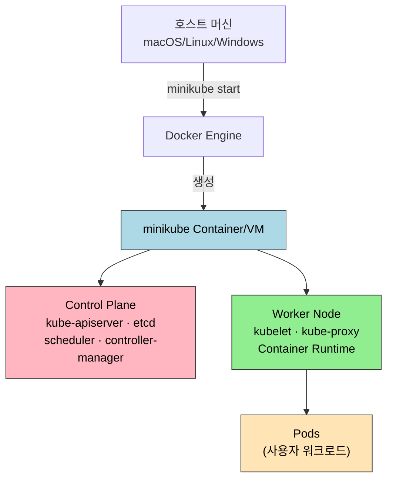
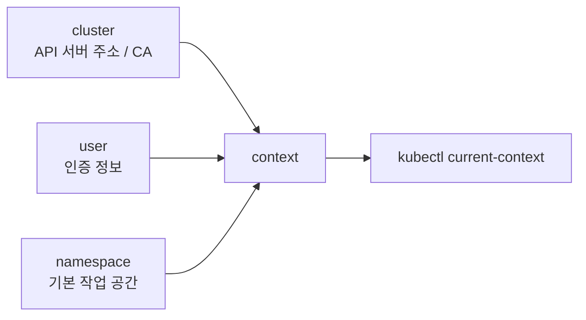

# 로컬 클러스터 구성

> 개발용 Kubernetes 클러스터는 "얼마나 빠르게 만들고 버릴 수 있는가"가 학습 속도를 결정한다. 이 장에서는 로컬 클러스터가 왜 필요한지, minikube·kind·k3d 세 도구의 설계 철학이 어디서 갈라지는지, 그리고 실제 작업 환경으로 올려 쓸 때 어떤 리소스 전략이 맞는지를 정리한다.


## 학습 목표
> 로컬 클러스터를 학습 도구로 볼 때 무엇을 익혀야 하는지 먼저 고정한다.

이 장에서 확인할 목표는 다음과 같다:

1. 로컬 Kubernetes가 필요한 이유와 프로덕션과 동일시하면 안 되는 경계를 설명할 수 있다.
2. minikube·kind·k3d의 기반과 강점을 비교해 상황별 선택 기준을 세울 수 있다.
3. 리소스 할당과 드라이버 선택을 작업 환경에 맞게 설계할 수 있다.
4. `kubectl` 기본 명령으로 클러스터 상태를 조회하고 디버깅 루틴을 시작할 수 있다.
5. Ingress와 `metrics-server` 같은 필수 애드온이 프로덕션에서 어떤 역할로 확장되는지 연결해 설명할 수 있다.
6. 프로필과 스냅샷을 이용해 여러 클러스터와 상태를 관리하는 운영 습관을 잡을 수 있다.


## 1. 왜 로컬 클러스터가 필요한가
> 빠른 피드백 루프가 왜 Kubernetes 학습에서 결정적인지 정리한다.

### 1.1 학습의 피드백 루프

클라우드 관리형 K8s는 비용과 시간 두 가지에서 학습을 방해한다. GKE나 EKS는 컨트롤 플레인 시간당 $0.10 이상에 워커까지 포함하면 월 $100을 쉽게 넘는다. 더 결정적인 문제는 클러스터 생성에 5~10분이 걸린다는 점으로, 이 긴 루프는 "설정을 바꿔 보고 깨뜨려 보는" 학습 방식을 사실상 막는다.

로컬 클러스터는 이 루프를 몇십 초로 압축한다. `minikube delete && minikube start`로 망가진 환경을 즉시 복구할 수 있으니, 의도적으로 깨뜨려 보는 실험이 가능해진다. 빠른 피드백이 곧 학습 속도라는 원칙이 K8s에서도 그대로 통한다.

### 1.2 프로덕션과의 경계

로컬 클러스터가 프로덕션을 대체하지는 못한다. 경계를 네 축으로 정리한다.

- 노드 수: 단일 노드가 기본이다. `--nodes` 플래그로 여러 개를 띄워도 실제 프로덕션의 노드 간 지연이나 파티션 시나리오는 재현되지 않는다.
- 리소스 규모: 노트북 CPU/메모리로는 동시 Pod 10~20개가 현실적 한계다. 수백 개 Pod와 노드 전반의 자원 경쟁을 보려면 실제 클러스터가 필요하다.
- 네트워크 구성: 프로덕션은 LoadBalancer, Ingress Controller, Service Mesh가 층을 이뤄 트래픽을 다룬다. 로컬에서는 NodePort나 `minikube tunnel` 같은 단순 장치로 축소된다.
- 스토리지 내구성: 프로덕션은 EBS·Persistent Disk 같은 네트워크 스토리지가 Zone 장애를 견디지만, 로컬은 호스트 파일시스템을 마운트하므로 클러스터 삭제와 함께 데이터가 사라진다.

그렇다고 로컬이 무의미하지는 않다. Pod·Deployment·Service·ConfigMap·Secret·Namespace·RBAC 같은 핵심 리소스 모델은 로컬과 프로덕션이 정확히 같게 작동한다. 매니페스트 문법·배포 전략·프로브 설계·HPA 동작 같은 영역은 로컬만으로도 충분히 검증된다.


## 2. minikube vs kind vs k3d
> 세 도구를 기능 목록이 아니라 사용 목적 기준으로 비교한다.

로컬 K8s를 만드는 세 도구는 설계 철학이 다르다. 아래 비교는 어디에서 갈리는지를 한눈에 보기 위한 표이고, 바로 이어지는 선택 기준이 본론이다.

### 2.1 비교 표

| 기준 | minikube | kind | k3d |
|------|----------|------|-----|
| 기반 | VM 또는 Container | Container (Docker-in-Docker) | Container (k3s) |
| 시작 속도 | 30~60초 | 20~40초 | 10~20초 |
| 멀티 노드 | 지원(`--nodes`) | 기본 지원 | 기본 지원 |
| 애드온 생태계 | 풍부(ingress·dashboard 등) | 없음(수동 설치) | 없음(수동 설치) |
| 리소스 사용 | 높음 | 보통 | 낮음 |
| LoadBalancer | `minikube tunnel` | MetalLB 수동 설치 | 내장(Traefik) |
| CI 적합도 | 낮음 | 높음 | 높음 |
| 주 용도 | 학습·개발 | CI 테스트·HA 시뮬레이션 | 빠른 개발·Edge |

### 2.2 어떤 기준으로 고르는가

학습과 개발에 우선 집중한다면 minikube가 가장 매끄럽다. `minikube addons enable ingress` 한 줄로 NGINX Ingress Controller가 뜨고, 대시보드도 즉시 열린다. 애드온 설정에 쓰는 시간을 줄여 핵심 개념에 집중할 수 있다는 뜻이다.

CI 파이프라인에서 쓴다면 kind가 유리하다. Docker 컨테이너 안에 클러스터를 올려 시작이 빠르고, kubeadm 기반이라 프로덕션 부트스트랩과 유사하다. GitHub Actions 매트릭스 테스트로 여러 K8s 버전을 병렬 검증하는 시나리오에 잘 맞는다.

리소스가 빠듯하거나 여러 클러스터를 동시에 돌려야 하면 k3d를 본다. k3s 기반이라 메모리 사용이 적고, Raspberry Pi나 저사양 장비에서도 실용적이다.

세 도구는 서로 대체재가 아니라 역할 분담 대상이다. 학습은 minikube, CI는 kind, 경량·멀티 클러스터는 k3d로 병행하는 조합도 흔하다.


## 3. 아키텍처
> 로컬 클러스터가 내부적으로 어떤 형태로 구성되는지 한 번에 잡는다.

minikube는 단일 컨테이너(또는 VM) 안에 컨트롤 플레인과 워커 노드를 함께 둔다. 프로덕션에서는 분리되는 구성 요소들이 로컬에서는 리소스를 아끼기 위해 한 머신에 모여 있다는 점만 이해하면 된다.



프로덕션이나 직접 구축한 kubeadm 클러스터(예: GCP 3노드)로 넘어가면 Control Plane이 별도 노드로 분리되고 etcd도 HA 구성이 가능해진다. 아래 실습 문서의 GCP 섹션이 이 분리된 구조를 다룬다.

### 3.1 Desired State와 Reconcile Loop

Kubernetes를 단순히 "컨테이너 오케스트레이터"라고만 이해하면 컨트롤 플레인의 존재 이유가 흐려진다. 더 정확한 표현은 "원하는 상태(desired state)를 API로 선언하고, 컨트롤러들이 실제 상태를 그 선언에 맞춰 계속 되돌리는 시스템"이다.

예를 들어 Deployment에 `replicas: 3`을 선언하면 API 서버에는 "Pod 세 개가 떠 있어야 한다"는 의도가 저장된다. 실제로는 Pod 하나가 죽을 수 있고, 노드가 재시작될 수 있으며, 이미지 pull이 실패할 수도 있다. 이때 kube-controller-manager 안의 Deployment/ReplicaSet 컨트롤러가 계속 현재 상태를 관찰하고, 부족한 Pod를 다시 만든다. 스케줄러는 "새 Pod를 어느 노드에 둘지"를 결정하고, kubelet은 그 결정을 실제 컨테이너 실행으로 바꾼다.

이 구조 때문에 Kubernetes에서는 "한 번 실행했다"보다 "계속 원하는 상태를 유지한다"가 더 중요하다. 로컬 클러스터에서도 이 원리는 프로덕션과 동일하게 작동한다.

### 3.2 Control Plane과 Worker의 역할 분리

구성 요소를 기능 단위로 다시 정리하면 이해가 빨라진다.

| 구성 요소 | 역할 | 실무 질문 |
|----------|------|-----------|
| `kube-apiserver` | 모든 선언과 조회의 단일 진입점 | 지금 클러스터가 무엇을 원한다고 기록되어 있는가? |
| `etcd` | 클러스터 상태 저장소 | 선언과 현재 상태 메타데이터는 어디에 저장되는가? |
| `kube-scheduler` | 새 Pod의 노드 선택 | 이 Pod는 왜 이 노드에 배치됐는가? |
| `kube-controller-manager` | desired state 유지 | 죽은 Pod는 누가 다시 만드는가? |
| `kubelet` | 노드에서 Pod 실행과 상태 보고 | 이 노드에서 컨테이너가 왜 안 뜨는가? |
| `kube-proxy` | Service 트래픽 전달 규칙 구성 | Service IP는 어떻게 실제 Pod로 연결되는가? |

로컬 환경에서는 이 구성 요소가 한 머신에 모여 있어도 논리적 역할은 그대로 분리되어 있다. 그래서 학습할 때도 "minikube 안에서 다 돌아간다"보다 "각 구성 요소가 무엇을 담당하는가"를 먼저 잡아야 다음 장의 Pod, Service, RBAC, Storage가 자연스럽게 이어진다.


## 4. kubectl 기본기
> 클러스터를 띄운 뒤 가장 먼저 손에 익혀야 할 조회·디버깅 명령을 정리한다.

### 4.1 자주 쓰는 명령

| 동사 | 용도 | 예 |
|------|------|-----|
| `get` | 리소스 목록 | `kubectl get pods`, `kubectl get svc` |
| `describe` | 상세 + 이벤트 | `kubectl describe pod nginx` |
| `logs` | 컨테이너 로그 | `kubectl logs -f nginx` |
| `exec` | 컨테이너 내부 실행 | `kubectl exec -it nginx -- /bin/bash` |
| `port-forward` | 로컬 포트 연결 | `kubectl port-forward pod/nginx 8080:80` |
| `apply` | 매니페스트 반영 | `kubectl apply -f deployment.yaml` |
| `edit` | 리소스 인라인 편집 | `kubectl edit deployment nginx` |
| `delete` | 리소스 삭제 | `kubectl delete pod nginx` |

### 4.2 kubeconfig와 context

`kubectl`이 클러스터와 통신하려면 "어느 API 서버에, 어떤 사용자 자격으로, 어떤 기본 네임스페이스에 붙을지"를 알아야 한다. 이 정보가 `kubeconfig`에 들어 있다. 공식 문서 기준으로 context는 `cluster`, `user`, `namespace`를 묶은 삼중항이다.



실무에서는 "권한이 없다"와 "다른 클러스터를 보고 있다"가 자주 혼동된다. 그래서 `kubectl` 사용 습관의 첫 줄은 현재 context 확인이다.

```bash
kubectl config get-contexts
kubectl config current-context
kubectl config use-context dev-frontend
kubectl config view --minify
kubectl config set-context --current --namespace=production
```

여러 클러스터를 다룰수록 context 이름을 의미 있게 짓는 편이 낫다. 예를 들어 `gcp-dev`, `gcp-prod`, `kind-ci`, `minikube-local`처럼 "클러스터 + 용도"를 함께 드러내면 실수로 다른 환경에 apply하는 사고를 줄일 수 있다.

### 4.3 디버깅 루틴

Pod가 `Pending`이면 `kubectl describe pod <name>`의 `Events`에 스케줄링 실패 이유가 적힌다. `CrashLoopBackOff`는 로그가 1순위로, `--previous`로 이전 컨테이너 로그까지 확인한다. 네트워크 이슈는 Pod 안에서 `curl <service>`로 내부 도달성을 먼저 보고, `kubectl top`으로 리소스 포화 여부를 체크한다. 한 문장으로 요약하면 "이벤트 → 로그 → 내부 접속 → 리소스"다.


## 5. 핵심 애드온과 프로덕션 대응
> 로컬 애드온이 프로덕션에서는 어떤 컴포넌트로 치환되는지 연결한다.

minikube가 애드온으로 제공하는 것들은 프로덕션에서 각자 다른 도구로 분화한다. 로컬 학습 단계에서 애드온이 "무엇을 하는 역할"인지만 확실히 잡아 두면, 프로덕션 전환에서 도구 이름만 갈아 끼우면 된다.

| 애드온 | 역할 | 프로덕션 대응 |
|--------|------|----------------|
| ingress | HTTP(S) 라우팅·도메인 기반 분배 | NGINX Ingress·Traefik·Istio Gateway |
| metrics-server | 단기 리소스 메트릭(HPA 소스) | Prometheus + Grafana |
| dashboard | 클러스터 웹 UI | Lens, k9s, Grafana |
| storage-provisioner | PVC → PV 자동 연결 | CSI 드라이버(EBS·GCE PD) |
| registry | 로컬 이미지 레지스트리 | Harbor, Quay |
| istio | Service Mesh | Istio, Linkerd |


## 6. 리소스 관리 전략
> 로컬 환경이 느려지지 않도록 리소스 상한과 운영 습관을 먼저 정한다.

할당은 호스트 절반~70% 안쪽에서 잡는다. 16GB 노트북이면 minikube에 8GB 정도가 무난하고, 전부를 넘기면 호스트 OS가 버벅인다. CPU도 같은 논리로 4 코어 전후가 실용선이다. 디스크는 이미지가 쌓이면 빠르게 소모되므로 초기부터 40GB로 넉넉히 잡거나, 주기적으로 `docker system prune`으로 정리한다.

여러 프로필을 동시에 돌리면 리소스가 배수로 소비된다. 쓰지 않는 프로필은 `minikube stop -p <name>`으로 내려 두는 편이 안전하다. 메모리 압박으로 Eviction이 발생하면 `kubectl describe node`의 `Conditions`에 `MemoryPressure=True`가 뜨므로, 그걸 신호 삼아 메모리를 증설한다.


## 7. 다음 단계
> 클러스터 준비가 끝난 뒤 바로 이어서 볼 워크로드 개념을 연결한다.

Ch02에서는 Pod·Deployment·Service·ConfigMap·Secret 같은 핵심 워크로드를 직접 만들고 관리한다. nginx를 배포하고, 스케일·롤링 업데이트·서비스 노출까지 한 흐름으로 이어 본다. 본 장의 클러스터가 준비되었으니, 이제 실제 동작 원리를 손으로 확인할 차례다.


## 관련 문서
> 실습 환경, 다음 장, 점검 문서로 바로 이동할 수 있게 묶는다.

- [로컬 클러스터 구성 점검](01-01.%EB%A1%9C%EC%BB%AC%20%ED%81%B4%EB%9F%AC%EC%8A%A4%ED%84%B0%20%EA%B5%AC%EC%84%B1%20%EC%A0%90%EA%B2%80.md) — 본 장의 점검 편, 현재 GCP K8s 클러스터 기준
- [핵심 워크로드](01-02.%ED%95%B5%EC%8B%AC%20%EC%9B%8C%ED%81%AC%EB%A1%9C%EB%93%9C.md) — 바로 다음 장, Pod·Deployment·Service 실전
- [gcp 스킬](../../../../.claude/skills/gcp/SKILL.md) — 실습에 쓰는 개인 GCP K8s 클러스터 운영 정보
