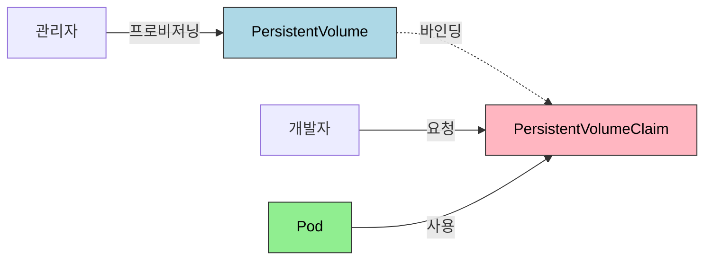

# 스토리지와 상태

> 컨테이너는 기본적으로 일시적(ephemeral)이다. 재시작 시 쓰기 레이어가 삭제되어 데이터가 사라진다. Kubernetes는 Volume, PersistentVolume/PersistentVolumeClaim을 통해 영속성을 제공하고, StatefulSet으로 상태 저장 애플리케이션을 안정적으로 배포한다.


## 학습 목표
> 상태를 가진 워크로드가 왜 별도 스토리지 모델을 요구하는지 먼저 정리한다.

이 장에서 확인할 목표는 다음과 같다:

1. 컨테이너의 ephemeral 특성과 데이터 유실 시나리오를 설명할 수 있다.
2. `emptyDir`, `hostPath`, `PVC` 같은 Volume 타입의 사용 시나리오를 구분할 수 있다.
3. `PV`와 `PVC`의 정적·동적 프로비저닝 차이와 `StorageClass` 역할을 설명할 수 있다.
4. `RWO`, `RWX`, `RWOP` 같은 접근 모드와 reclaim 정책의 차이를 설명할 수 있다.
5. `StatefulSet`의 세 가지 보장과 Headless Service의 DNS 패턴을 연결해 설명할 수 있다.


## 1. 왜 스토리지가 문제인가
> Pod 재생성과 상태 보존이 충돌하는 지점을 먼저 확인한다.

### 1.1 컨테이너의 Ephemeral 특성

컨테이너 내부 파일시스템은 이미지 레이어와 쓰기 가능한 레이어로 구성된다. 프로세스가 종료되면 쓰기 레이어의 데이터는 영구적으로 소실되고, 새 컨테이너는 항상 이미지의 초기 상태에서 시작한다.

데이터 유실은 세 가지 상황에서 발생한다. Pod 재시작 시 컨테이너 내부에 저장했던 파일이 사라진다. OOM으로 인한 크래시 루프에서는 재시작마다 데이터가 초기화된다. 노드 장애로 Pod가 다른 노드로 이동하면 이전 노드의 로컬 스토리지에 접근할 수 없다.

### 1.2 왜 모든 것을 영속화하지 않는가

Stateless와 Stateful의 구분은 의도적인 설계 결정이다. Stateless는 배포 속도가 빠르고 수평 확장이 즉시 가능하며 비용이 낮다. Stateful은 각 인스턴스가 고유 상태를 가지므로 복잡도와 스토리지 비용이 높다. 세션 데이터를 Redis에 저장하면 웹 서버 자체는 Stateless로 유지할 수 있다는 것이 실무 원칙이다.


## 2. Volume 타입
> Pod 내부 공유 볼륨과 노드 의존 볼륨의 차이를 정리한다.

### 2.1 emptyDir: 임시 공유 스토리지

Pod 생성 시 빈 디렉토리를 만들고, Pod가 삭제되면 함께 삭제된다(컨테이너 재시작 시에는 유지된다). 같은 Pod 내 컨테이너 간 데이터를 공유할 때 사용한다.

주요 사용처는 사이드카 패턴의 로그 수집과 임시 캐시다. `medium: Memory`로 설정하면 tmpfs를 사용해 성능을 높일 수 있다.

### 2.2 hostPath: 노드 파일시스템 마운트

호스트 노드의 파일/디렉토리를 Pod에 마운트한다. Pod가 삭제되어도 데이터는 유지되지만 노드 종속적이라 다른 노드로 이동하면 접근할 수 없다. 노드의 Docker socket 접근이나 시스템 모니터링 에이전트에 사용하지만, 보안 위험이 높아 프로덕션에서는 신중하게 써야 한다.

### 2.3 Volume 타입 비교

| 타입 | 수명 | 노드 이동 | 사용 사례 |
|------|------|----------|-----------|
| emptyDir | Pod 삭제까지 | 불가 | 임시 공유, 캐시 |
| hostPath | 노드 파일 생명주기 | 불가 | 시스템 접근 |
| configMap/secret | 외부 관리 | 가능 | 설정 주입 |
| PVC | 외부 관리 | 설정에 따라 | 영구 데이터 |


## 3. PersistentVolume과 PersistentVolumeClaim
> 애플리케이션과 스토리지 구현을 분리하는 선언형 계약을 설명한다.

### 3.1 PV/PVC 추상화가 필요한 이유

Pod 정의에 AWS EBS ID나 NFS 서버 주소를 직접 넣으면 인프라 종속성이 생기고, 개발자가 스토리지 프로비저닝까지 담당해야 한다. PV/PVC 모델은 스토리지 공급자(관리자)와 소비자(개발자)를 분리한다.



### 3.2 정적 vs 동적 프로비저닝

정적 프로비저닝은 관리자가 미리 PV를 만들고 개발자가 PVC로 요청하면 조건이 맞는 PV에 바인딩된다. 바인딩 조건은 StorageClass 일치, AccessMode 호환, 요청 용량이 PV 용량 이하다.

동적 프로비저닝은 StorageClass를 통해 자동화된다. PVC 생성 시 외부 프로비저너(CSI 드라이버)가 클라우드 API를 호출해 볼륨을 만들고 PV를 자동으로 생성·바인딩한다.

`volumeBindingMode: WaitForFirstConsumer`가 권장된다. Pod가 스케줄된 노드의 가용 영역에 볼륨을 생성해 네트워크 지연을 줄이고, 불필요한 볼륨 생성을 방지한다.

### 3.3 AccessMode를 어떻게 이해해야 하나

공식 문서 기준으로 자주 보는 접근 모드는 `ReadWriteOnce(RWO)`, `ReadOnlyMany(ROX)`, `ReadWriteMany(RWX)`, `ReadWriteOncePod(RWOP)` 네 가지다. 이름은 비슷하지만 운영 의미는 꽤 다르다.

`RWO`는 한 시점에 하나의 노드에서 읽기/쓰기로 마운트하는 패턴이다. 블록 스토리지 기반 데이터베이스에서 가장 흔하다. `RWX`는 여러 노드나 여러 Pod가 동시에 읽기/쓰기를 수행할 수 있는 공유 스토리지 패턴이다. NFS, CephFS, 일부 파일 스토리지가 여기에 해당한다.

`RWOP`는 더 강한 제약이다. 단순히 "한 노드"가 아니라 "정확히 하나의 Pod"만 읽기/쓰기로 사용하게 강제한다. 같은 노드 안의 다른 Pod가 붙는 상황까지 막고 싶을 때 의미가 있다. 단일 리더 Pod, 충돌에 민감한 상태 저장 워크로드에서 유용하다.


## 4. PV/PVC 운영 포인트
> PVC를 만들었다고 끝나는 것이 아니라, 바인딩 조건과 회수 정책을 같이 봐야 한다.

PV/PVC를 운영 관점에서 볼 때 가장 먼저 확인할 것은 `accessModes`, `storageClassName`, `persistentVolumeReclaimPolicy`다. 이 세 필드가 실제 마운트 가능성, 자동 생성 여부, 삭제 이후 데이터 보존 여부를 좌우한다.

`reclaimPolicy`는 PVC 삭제 시 동작을 결정한다. `Delete`는 PVC 삭제 시 PV와 실제 스토리지를 함께 삭제해 개발 환경에 적합하다. `Retain`은 PV를 Released 상태로 남겨 두고 실제 데이터를 보존하므로 프로덕션 복구 시나리오에 더 유리하다.

또 하나의 함정은 PVC와 PV가 사실상 1:1 바인딩이라는 점이다. StatefulSet replica가 여러 개인데 일반 PVC 하나를 공유하려고 하면 의도와 다르게 스케줄링이 막히거나 데이터 충돌을 유발할 수 있다. 그래서 StatefulSet은 보통 `volumeClaimTemplates`로 각 Pod마다 별도 PVC를 만든다.


## 5. StorageClass
> 동적 프로비저닝은 편의 기능이 아니라 스토리지 정책을 선언하는 계층이다.

`reclaimPolicy`는 PVC 삭제 시 동작을 결정한다. `Delete`는 PV와 실제 스토리지를 함께 삭제해 개발 환경에 적합하다. `Retain`은 PV를 Released 상태로 유지해 데이터 복구가 가능하며 프로덕션에 권장된다.

계층별 StorageClass를 분리하는 것이 실무 패턴이다. 프로덕션 DB용(io2, Retain), 개발 환경용(gp2, Delete), 로그·캐시용(gp3, Delete)으로 나누어 성능과 비용 트레이드오프를 명시적으로 관리한다.

StorageClass를 볼 때는 단순히 "어떤 디스크를 쓸 것인가"보다 "언제, 어디에, 어떤 정책으로 만들 것인가"를 함께 봐야 한다. 공식 문서 기준으로 핵심 필드는 `provisioner`, `parameters`, `reclaimPolicy`, `volumeBindingMode`, `allowVolumeExpansion`이다.

`volumeBindingMode`는 특히 중요하다. `Immediate`는 PVC 생성 순간 볼륨을 만든다. 이 방식은 멀티 AZ 환경에서 Pod가 나중에 다른 가용 영역 노드에 스케줄되면 볼륨과 노드의 zone이 어긋날 수 있다. `WaitForFirstConsumer`는 Pod가 실제로 어떤 노드에 스케줄될지 결정된 뒤 그 노드 조건에 맞춰 볼륨을 만든다. Stateful 워크로드나 zone-aware 스토리지에서는 이 쪽이 더 안전하다.

또 하나의 운영 포인트는 default StorageClass다. PVC에 `storageClassName`을 명시하지 않으면 기본 StorageClass가 사용된다. 기본 클래스가 여러 개면 Kubernetes는 가장 최근에 생성된 default StorageClass를 택한다. 그래서 운영 환경에서는 "무엇이 기본인지"를 명시적으로 관리하지 않으면 예상과 다른 스토리지로 바인딩될 수 있다.

공식 문서 기준으로 더 주의할 점이 있다. default StorageClass가 없는 시점에 `storageClassName` 없이 만든 PVC도, 나중에 default가 생기면 그 기본 클래스로 업데이트될 수 있다. 반대로 "나는 기본 클래스를 절대 타면 안 된다"는 의도를 명확히 하려면 `storageClassName: ""`를 지정해야 한다.

실무에서는 StorageClass와 함께 성능 검증 도구를 붙여 보는 경우가 많다. `kubestr`는 Kubernetes 볼륨 성능을 빠르게 측정할 때 자주 언급되는 도구지만, Kubernetes 핵심 리소스는 아니다. 따라서 본문 개념은 StorageClass와 CSI까지 이해하고, `kubestr`는 운영 점검 도구로 받아들이면 충분하다.


## 6. NFS와 RWX 공유 스토리지
> 여러 Pod이 동시에 같은 파일 집합을 다뤄야 한다면 RWX와 NFS 계열 스토리지를 검토한다.

공식 문서 기준으로 `nfs` 볼륨은 지금도 유효한 개념이다. NFS 서버가 이미 있고 여러 Pod가 동시에 같은 디렉터리를 읽고 써야 한다면 가장 직관적인 공유 스토리지 선택지다. 대표 예시는 정적 업로드 파일, 공용 설정 산출물, 레거시 애플리케이션의 공유 디렉터리다.

다만 Pod 스펙에 직접 `nfs:`를 적는 방식보다 PV/PVC를 통한 추상화가 더 낫다. 공식 문서도 Pod 스펙의 직접 NFS 마운트는 마운트 옵션을 세밀하게 주기 어렵고, PV를 사용하면 마운트 옵션을 둘 수 있다고 안내한다. 운영에서는 대개 NFS 서버 또는 NFS external provisioner 위에 PV/PVC/StorageClass 계층을 올려 관리한다.

NFS는 `RWX` 시나리오에 강하지만, 모든 상태 저장 워크로드의 정답은 아니다. 데이터베이스처럼 짧은 지연과 강한 일관성이 중요한 경우에는 블록 스토리지 기반 `RWO` 또는 `RWOP`가 더 적합한 경우가 많다. 반대로 공유 파일 시스템이 핵심인 경우라면 NFS가 설계 자체를 단순하게 만들 수 있다.


## 7. StatefulSet의 특징
> 순서, 안정된 이름, 볼륨 바인딩이 필요한 이유를 워크로드 관점에서 본다.

### 7.1 세 가지 보장

Deployment로 DB를 배포하면 Pod 이름이 랜덤(nginx-wrong-7f8d9-xkw2p)하고 모든 Pod가 같은 PVC를 공유해 데이터 충돌이 생긴다. StatefulSet은 이를 해결하는 세 가지 보장을 제공한다.

**안정적 네트워크 ID**: Pod 이름에 순서 번호가 붙는다(`mysql-0`, `mysql-1`, `mysql-2`). 재시작되어도 이름이 유지된다.

**순서 보장**: 생성은 순서대로(mysql-0이 Ready가 되어야 mysql-1을 생성), 삭제는 역순(mysql-2부터)으로 진행된다. MySQL 마스터-슬레이브 복제에서 마스터(mysql-0)가 먼저 초기화되어야 슬레이브가 복제를 시작할 수 있기 때문이다.

**안정적 스토리지**: `volumeClaimTemplates`로 각 Pod마다 고유한 PVC를 자동 생성한다(`data-mysql-0`, `data-mysql-1`). Pod가 재시작되어도 같은 PVC에 재연결된다.

### 7.2 volumeClaimTemplates

PVC 이름은 `{volumeClaimTemplate 이름}-{StatefulSet 이름}-{순서번호}` 형식이다. 스케일 다운해도 PVC는 삭제되지 않는다. 다시 스케일 업하면 기존 PVC에 재연결되어 데이터가 복구된다. StatefulSet을 삭제해도 PVC는 orphan으로 남으므로 수동으로 삭제해야 한다.


## 8. Headless Service와 DNS
> Stateful 워크로드가 개별 Pod에 직접 도달하는 이름 체계를 설명한다.

일반 Service는 ClusterIP로 랜덤 Pod에 연결한다. MySQL 복제처럼 쓰기는 마스터, 읽기는 슬레이브로 라우팅해야 하는 상황에서는 개별 Pod에 직접 접근이 필요하다. `clusterIP: None`으로 Headless Service를 만들면 DNS 조회 시 개별 Pod IP 목록이 반환된다.

StatefulSet과 Headless Service를 함께 쓰면 각 Pod에 대한 안정적인 DNS 이름이 생성된다.

```
mysql-0.mysql-headless.default.svc.cluster.local → mysql-0의 IP
mysql-1.mysql-headless.default.svc.cluster.local → mysql-1의 IP
```

Pod가 재시작되어 IP가 바뀌어도 DNS 이름은 유지되므로 클라이언트는 이름으로 접근하면 된다.


## 9. 다음 단계
> 저장소 개념 위에 네트워크 계층을 올려 보는 다음 장으로 연결한다.

Ch04에서는 Service, Ingress, NetworkPolicy로 클러스터 안팎의 트래픽을 제어한다. 스토리지가 데이터의 영속성을 보장한다면, 네트워킹은 데이터가 올바른 목적지로 흐르게 하는 역할을 담당한다.


## 관련 문서
> 이전 장, 다음 장, 점검 문서를 한 번에 참고할 수 있게 둔다.

- [스토리지와 상태 점검](01-03.%EC%8A%A4%ED%86%A0%EB%A6%AC%EC%A7%80%EC%99%80%20%EC%83%81%ED%83%9C%20%EC%A0%90%EA%B2%80.md) — 본 장의 점검 편
- [핵심 워크로드](01-02.%ED%95%B5%EC%8B%AC%20%EC%9B%8C%ED%81%AC%EB%A1%9C%EB%93%9C.md) — 이전 장, Deployment와 Service 기초
- [네트워킹](../02_networking/02-01.%EB%84%A4%ED%8A%B8%EC%9B%8C%ED%82%B9.md) — 다음 장, Service·Ingress·NetworkPolicy
