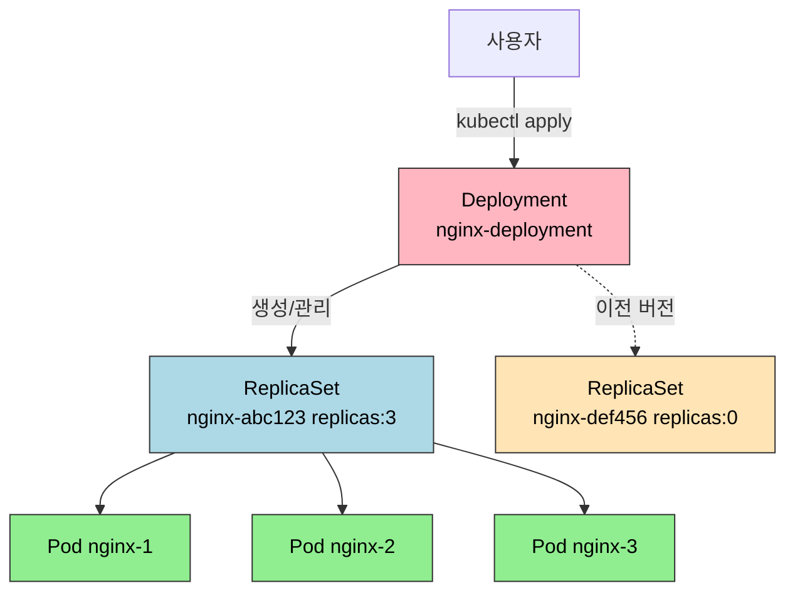
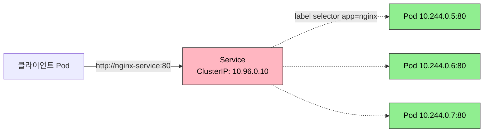

# 핵심 워크로드

> Kubernetes에서 컨테이너는 직접 실행되지 않는다. Pod라는 최소 실행 단위로 감싸지고, Deployment가 Pod를 관리하며, Service가 네트워크 진입점을 제공한다. 이 삼각관계를 이해하는 것이 Kubernetes 운영의 핵심이다.


## 학습 목표
> Pod, Deployment, Service가 어떻게 함께 움직이는지 먼저 고정한다.

이 장에서 확인할 목표는 다음과 같다:

1. Pod가 컨테이너를 감싸는 이유와 네트워크·스토리지 공유 방식을 설명할 수 있다.
2. ReplicaSet과 Deployment의 관계를 이해하고 직접 Pod를 만들지 않는 이유를 설명할 수 있다.
3. RollingUpdate와 Recreate 전략, 롤백 메커니즘의 차이를 운영 관점에서 비교할 수 있다.
4. Service 타입별 역할과 안정적인 엔드포인트 제공 방식을 설명할 수 있다.
5. ConfigMap·Secret 주입 방식과 Probe 세 종류의 역할 차이를 구분할 수 있다.
6. Namespace와 주요 Controller 계층을 실제 운영 분리 관점에서 설명할 수 있다.


## 1. 왜 Pod인가
> Kubernetes가 컨테이너가 아니라 Pod를 최소 실행 단위로 삼는 이유를 설명한다.

### 1.1 컨테이너 vs Pod

Docker에서는 `docker run nginx`로 컨테이너를 직접 실행했다. Kubernetes에서 Pod라는 개념이 필요한 이유는 세 가지다.

첫째, **네트워크 공유**다. 하나의 Pod 안에 여러 컨테이너가 있으면 모두 같은 IP를 공유해 `localhost`로 서로 통신할 수 있다. nginx(포트 80)와 로그 수집기가 같은 Pod에 있으면 수집기는 `http://localhost:80`으로 접근한다.

둘째, **스토리지 공유**다. Pod 내 컨테이너는 emptyDir 볼륨을 함께 마운트해 데이터를 주고받는다.

셋째, **생명주기 동기화**다. Pod 안의 모든 컨테이너는 같은 노드에 스케줄링되고 함께 시작·종료된다. Init Container를 이용하면 DB 마이그레이션 같은 초기화 작업을 메인 컨테이너 시작 전에 보장할 수 있다.

### 1.2 Pod 라이프사이클

| Phase | 설명 | 주요 원인 |
|-------|------|-----------|
| Pending | 스케줄링 대기 또는 이미지 다운로드 중 | 노드 리소스 부족, 이미지 pull 실패 |
| Running | 최소 1개 컨테이너 실행 중 | 정상 상태 |
| Succeeded | 모든 컨테이너가 성공적으로 종료 | Job/CronJob에서 사용 |
| Failed | 컨테이너가 오류로 종료 | 애플리케이션 크래시, OOMKilled |
| Unknown | Pod 상태를 알 수 없음 | kubelet과 통신 불가 |

`restartPolicy`는 `Always`(기본, 웹 서버), `OnFailure`(배치 작업), `Never`(일회성 작업) 세 가지다.

여기서 헷갈리기 쉬운 점은 Pod의 `phase`와 컨테이너의 상태가 다르다는 것이다. `Pending`, `Running`, `Succeeded`, `Failed`는 Pod 수준의 요약 상태다. 반면 각 컨테이너는 `Waiting`, `Running`, `Terminated` 상태를 가진다. 예를 들어 Pod는 `Running`인데 그 안의 한 컨테이너가 재시작을 반복하며 `CrashLoopBackOff`에 있을 수 있다. 따라서 장애 분석에서는 `kubectl get pod` 한 줄로 끝내지 말고 `kubectl describe pod`와 컨테이너별 `lastState`, `restartCount`, `reason`을 함께 본다.

공식 문서 기준으로 Pod는 한 번 노드에 바인딩되면 다른 노드로 "이동"하지 않는다. 노드가 죽으면 기존 Pod가 복구되는 것이 아니라, 컨트롤러가 새 Pod를 만들어 다른 노드에 스케줄링한다. Stateful 워크로드를 이해할 때 이 차이가 중요하다.


## 2. ReplicaSet과 Deployment
> 선언형 배포가 Pod 복구와 버전 교체를 어떻게 자동화하는지 연결한다.

### 2.1 왜 직접 Pod를 만들지 않는가

`kubectl run nginx --image=nginx`로 Pod를 생성하면 해당 Pod가 죽었을 때 자동으로 재생성되지 않는다. **ReplicaSet**은 "항상 N개의 Pod를 유지"하는 컨트롤러다. 하지만 ReplicaSet도 직접 만들지 않는다. **Deployment**가 ReplicaSet을 관리하며 롤링 업데이트와 롤백 기능을 제공하기 때문이다.



이 구조를 desired state 관점으로 다시 보면 더 명확하다. 사용자는 Deployment에 "nginx 3개"를 선언한다. Deployment는 새 ReplicaSet을 만들고, ReplicaSet은 Pod 개수를 맞춘다. Pod 하나가 죽으면 ReplicaSet이 다시 맞추고, 이미지 태그가 바뀌면 Deployment가 새 ReplicaSet을 추가한다. 즉 Deployment는 버전 교체를, ReplicaSet은 개수 유지를 담당한다.

### 2.2 주요 필드

```yaml
spec:
  replicas: 3
  selector:
    matchLabels:
      app: nginx
  template:
    metadata:
      labels:
        app: nginx
    spec:
      containers:
      - name: nginx
        image: nginx:1.25
        resources:
          requests:
            memory: "64Mi"
            cpu: "100m"
          limits:
            memory: "128Mi"
            cpu: "200m"
```

`resources.requests`는 스케줄러가 노드를 선택할 때 기준이 되는 최소 보장치이고, `resources.limits`는 kubelet이 강제하는 상한으로 초과하면 OOMKilled가 발생한다.


## 3. Deployment 전략
> 무중단 배포와 롤백이 어떤 설정 조합으로 동작하는지 정리한다.

### 3.1 RollingUpdate vs Recreate

| 전략 | 다운타임 | 리소스 | 용도 |
|------|---------|--------|------|
| RollingUpdate | 없음 | 일시적 2배 | 무중단 배포 |
| Recreate | 있음 | 낮음 | DB 마이그레이션, 단일 인스턴스 |

RollingUpdate의 핵심 파라미터는 두 가지다. `maxSurge`는 desired 개수를 초과해 동시에 생성할 수 있는 Pod 수이고, `maxUnavailable`은 동시에 종료할 수 있는 Pod 수다. 무중단을 최우선으로 하면 `maxSurge: 1, maxUnavailable: 0`으로 설정한다.

### 3.2 롤백

Deployment는 기본적으로 최근 10개 ReplicaSet을 보존한다(`spec.revisionHistoryLimit`). 롤백 시 이전 ReplicaSet의 `replicas`를 원래 값으로, 현재 ReplicaSet의 `replicas`를 0으로 설정해 역방향 RollingUpdate를 실행한다.

```bash
kubectl rollout history deployment/nginx-deployment
kubectl rollout undo deployment/nginx-deployment
kubectl rollout undo deployment/nginx-deployment --to-revision=1
```


## 4. Namespace와 작업 경계
> Namespace는 단순 폴더가 아니라 기본 작업 공간, 권한, 쿼터를 묶는 운영 경계다.

Namespace는 리소스를 논리적으로 나누는 가장 기본적인 장치다. 같은 클러스터 안에서도 `dev`, `staging`, `production`, `monitoring`처럼 환경이나 팀 단위로 분리할 수 있다. 실무에서는 이름 충돌을 막는 것보다 "기본 namespace를 어디로 보고 있는가"가 더 중요하다. context에 namespace를 함께 묶어 두면 잘못된 환경에 apply하는 사고를 줄일 수 있다.

Namespace는 특히 세 가지와 결합될 때 힘을 가진다.

- RBAC: 누가 어느 namespace의 리소스를 볼 수 있는지 제한
- ResourceQuota / LimitRange: 팀별 자원 사용량 제한
- NetworkPolicy: namespace 간 트래픽 허용 범위 제한

즉 Namespace는 단독 기능보다 "권한·자원·네트워크 정책의 기본 경계"로 이해해야 한다.


## 5. Controller 계층 한눈에 보기
> Pod를 직접 만드는 대신 어떤 Controller를 선택해야 하는지 역할별로 구분한다.

Kubernetes의 Controller는 결국 "어떤 종류의 Pod 집합을 유지할 것인가"에 대한 답이다. 이 장의 핵심은 Deployment지만, 운영에서는 목적에 따라 다른 Controller를 고른다.

| Controller | 주 용도 | 핵심 특징 |
|-----------|---------|----------|
| Deployment | 일반적인 Stateless 앱 | 롤링 업데이트, 롤백 |
| ReplicaSet | Pod 개수 유지 | 보통 Deployment가 간접 관리 |
| StatefulSet | 상태 저장 워크로드 | 고정 이름, 고정 스토리지, 순서 보장 |
| DaemonSet | 노드마다 1개씩 필요한 Pod | 로그 수집기, CNI, node-exporter |
| Job / CronJob | 배치, 주기 작업 | 완료 중심 실행 |

공식 문서 기준으로 ReplicaSet은 직접 다루기보다 Deployment 아래에서 간접적으로 보는 것이 일반적이다. 반대로 DaemonSet은 "앱 배포"보다 "클러스터 기능 배포"에 가깝다. 예를 들어 CNI 플러그인, 로그 수집기, 모니터링 에이전트는 노드마다 하나씩 있어야 하므로 DaemonSet이 자연스럽다.


## 6. Service 타입과 역할
> 변하는 Pod IP 위에 안정적인 네트워크 진입점을 올리는 방식을 다룬다.

### 6.1 왜 Service가 필요한가

Pod는 재시작될 때마다 IP가 바뀐다. Service는 고정된 ClusterIP를 제공해 Pod IP가 변경되어도 안정적인 엔드포인트를 유지한다.



### 6.2 Service 타입 비교

| 타입 | 외부 접근 | 용도 |
|------|----------|------|
| ClusterIP | 불가 | 내부 통신 (기본값) |
| NodePort | NodeIP:Port로 가능 | 개발/테스트 |
| LoadBalancer | External IP로 가능 | 프로덕션 (클라우드) |
| ExternalName | 해당 없음 | 외부 DNS CNAME 매핑 |

Service의 `spec.selector`는 label 기반으로 Pod를 선택한다. Readiness Probe가 실패한 Pod는 Endpoints 목록에서 자동으로 제거되어 트래픽을 받지 않는다.


## 7. ConfigMap과 Secret
> 이미지와 설정을 분리해 환경별 차이를 다루는 기본 패턴을 정리한다.

애플리케이션 설정을 이미지에 하드코딩하면 환경마다 이미지를 다시 빌드해야 한다. ConfigMap은 일반 설정을, Secret은 민감 정보(비밀번호, API 키)를 외부화한다.

주입 방법은 두 가지다. **환경변수**는 간단한 key-value에 적합하고, **볼륨 마운트**는 파일 형태의 설정(app.yaml 등)에 사용한다. 볼륨으로 마운트한 ConfigMap은 kubelet이 주기적으로 동기화해 파일이 자동으로 업데이트된다(단, 애플리케이션이 파일을 다시 읽어야 반영된다).

Secret은 base64 인코딩일 뿐 암호화가 아니다. etcd에 평문으로 저장되므로 프로덕션에서는 etcd 암호화(`--encryption-provider-config`)와 RBAC를 반드시 설정해야 한다.

주입 패턴은 세 가지로 더 잘게 구분해 두는 편이 좋다.

| 패턴 | 장점 | 주의점 |
|------|------|--------|
| `env` / `envFrom` | 단순하고 애플리케이션 수정이 적다 | 재시작 전까지 값이 고정된다 |
| 볼륨 마운트 | 파일 기반 설정에 적합하다 | 애플리케이션이 파일 변경을 다시 읽어야 한다 |
| 특정 key 선택 주입 | 필요한 값만 최소 노출 가능 | 키 이름과 경로 관리가 번거롭다 |

특히 `subPath`로 마운트한 ConfigMap/Secret 파일은 자동 업데이트가 되지 않는다는 점을 기억해야 한다. "ConfigMap은 바꿨는데 앱이 왜 그대로인가?"라는 질문은 대부분 재시작 필요 여부나 `subPath` 사용 여부에서 갈린다.


## 8. Liveness · Readiness · Startup Probe
> 프로브 세 종류를 장애 복구와 트래픽 제어 관점에서 구분한다.

세 가지 Probe는 실패 시 동작이 다르다.

| Probe | 실패 시 동작 | 용도 |
|-------|------------|------|
| Liveness | Pod 재시작 | 데드락, 무한 루프 감지 |
| Readiness | Service Endpoint에서 제외 | 초기화 중, 일시적 과부하 |
| Startup | Liveness 체크 시작 지연 | Java처럼 시작이 느린 애플리케이션 |

Liveness Probe는 애플리케이션 자체의 건강만 체크해야 한다. DB 연결 상태를 Liveness에서 체크하면 DB가 다운될 때 모든 Pod가 동시에 재시작되는 카스케이드 장애가 발생한다. 의존성 체크는 Readiness에 넣는 것이 원칙이다.

Startup Probe는 `failureThreshold: 30, periodSeconds: 10`처럼 설정해 최대 5분의 시작 시간을 허용할 수 있다. 성공 후에는 Liveness·Readiness가 평소대로 동작한다.


## 9. 다음 단계
> Stateless 기본기를 익힌 뒤 Stateful 워크로드로 넘어가는 연결 지점을 만든다.

Ch03에서는 StatefulSet, DaemonSet, Job, CronJob 등 특수 워크로드를 다룬다. Deployment/Service가 Stateless 애플리케이션의 기본이라면, 다음 장은 Stateful과 배치 워크로드의 세계다.


## 관련 문서
> 이전 장, 다음 장, 점검 문서를 한 번에 이동할 수 있게 둔다.

- [핵심 워크로드 점검](02-01.%ED%95%B5%EC%8B%AC%20%EC%9B%8C%ED%81%AC%EB%A1%9C%EB%93%9C%20%EC%A0%90%EA%B2%80.md) — 본 장의 점검 편
- [로컬 클러스터 구성](01-01.%EB%A1%9C%EC%BB%AC%20%ED%81%B4%EB%9F%AC%EC%8A%A4%ED%84%B0%20%EA%B5%AC%EC%84%B1.md) — 이전 장, 실습 환경 준비
- [스토리지와 상태](03-01.%EC%8A%A4%ED%86%A0%EB%A6%AC%EC%A7%80%EC%99%80%20%EC%83%81%ED%83%9C.md) — 다음 장, StatefulSet과 PVC
