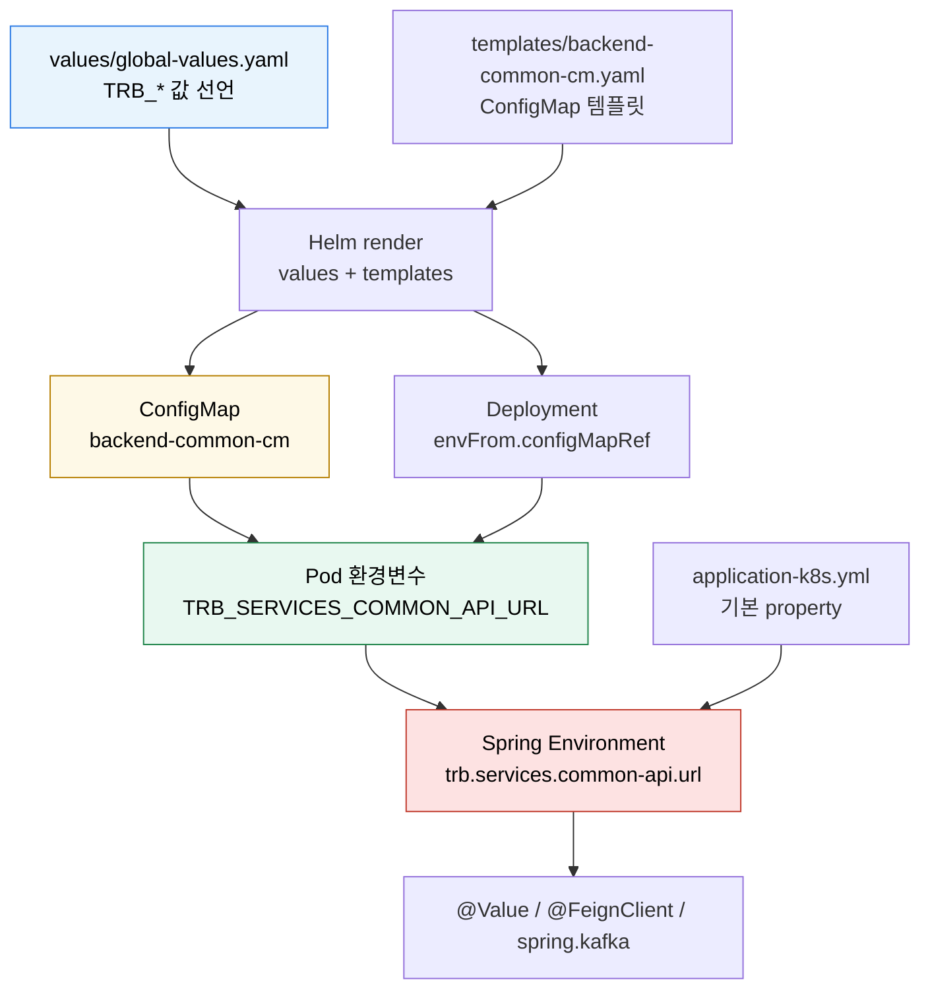

# K8s 환경변수와 Spring 설정 주입
---
> Kubernetes에서 Spring 설정이 바뀌는 과정은 파일을 직접 고치는 과정이 아닙니다. Helm이 ConfigMap과 Deployment를 렌더링하고, Pod가 환경변수를 받은 뒤, Spring Boot가 런타임 설정 우선순위로 YAML 값을 덮어쓰는 흐름입니다.


## 학습 목표
> Helm values, ConfigMap, Pod 환경변수, Spring Boot 설정 해석을 한 흐름으로 연결합니다.

이 장에서 확인할 목표는 다음과 같다:

1. Helm values가 Kubernetes ConfigMap으로 바뀌는 과정을 설명할 수 있습니다.
2. `envFrom.configMapRef`가 컨테이너 환경변수를 만드는 방식을 이해할 수 있습니다.
3. Spring Boot의 relaxed binding으로 환경변수가 YAML property에 매핑되는 원리를 설명할 수 있습니다.
4. ConfigMap 변경이 기존 Pod 환경변수에 즉시 반영되지 않는 이유를 설명할 수 있습니다.


## 1. 전체 흐름
> 값은 Git의 values 파일에서 시작하지만, Spring 애플리케이션이 읽는 것은 최종 Pod 환경변수입니다.

실무에서 자주 쓰는 구조는 다음과 같습니다. Git에는 Helm values 파일과 chart template이 있고, ArgoCD나 Helm이 이를 Kubernetes manifest로 렌더링합니다. 렌더링 결과에는 ConfigMap과 Deployment가 포함됩니다.

Deployment는 ConfigMap을 `envFrom`으로 참조합니다. Pod가 생성될 때 kubelet은 ConfigMap의 `data`를 컨테이너 환경변수로 넣고, Spring Boot는 프로세스 시작 시 그 환경변수를 읽어 `application-k8s.yml`의 property와 병합합니다.



여기서 중요한 점은 `application-k8s.yml` 파일이 클러스터 안에서 수정되는 것이 아니라는 점입니다. 파일은 컨테이너 이미지 안에 그대로 있고, 런타임 환경변수가 Spring 설정 우선순위에서 더 높은 값으로 병합됩니다.


## 2. Helm values는 ConfigMap 리소스가 됩니다
> values 파일은 입력값이고, 실제 클러스터에는 ConfigMap 리소스가 만들어집니다.

예를 들어 values 파일에 다음처럼 공통 값을 둔다:

```yaml
global:
  configMap:
    enabled: true
    data:
      SPRING_PROFILES_ACTIVE: "k8s"
      TRB_SERVICES_COMMON_API_URL: "http://trb-app-common-api"
      TRB_QUEUE_BOOTSTRAP_SERVER: "redpanda:9092"
      TRB_QUEUE_SCHEMA_REGISTRY_URL: "http://schema-registry:8081"
```

Helm template은 이 값을 순회해서 ConfigMap `data`로 렌더링한다:

```yaml
apiVersion: v1
kind: ConfigMap
metadata:
  name: backend-common-cm
data:
  SPRING_PROFILES_ACTIVE: "k8s"
  TRB_SERVICES_COMMON_API_URL: "http://trb-app-common-api"
  TRB_QUEUE_BOOTSTRAP_SERVER: "redpanda:9092"
  TRB_QUEUE_SCHEMA_REGISTRY_URL: "http://schema-registry:8081"
```

이 단계에서 새 YAML 파일이 저장소에 생기는 것은 아닙니다. Helm이나 ArgoCD가 렌더링 결과를 만들고 Kubernetes API에 apply합니다. 따라서 "values 파일이 덮어써진다"가 아니라 "클러스터의 ConfigMap 리소스가 원하는 상태로 갱신된다"고 이해해야 합니다.


## 3. Deployment는 ConfigMap을 환경변수로 읽습니다
> Pod는 ConfigMap을 직접 설정 파일로 해석하지 않고, Deployment 선언에 따라 환경변수나 볼륨으로 받습니다.

환경변수로 주입하는 가장 단순한 방식은 `envFrom`이다:

```yaml
apiVersion: apps/v1
kind: Deployment
spec:
  template:
    spec:
      containers:
        - name: app
          image: example/app:1.0.0
          envFrom:
            - configMapRef:
                name: backend-common-cm
```

이렇게 하면 ConfigMap의 key가 그대로 컨테이너 환경변수 이름이 된다:

```bash
SPRING_PROFILES_ACTIVE=k8s
TRB_SERVICES_COMMON_API_URL=http://trb-app-common-api
TRB_QUEUE_BOOTSTRAP_SERVER=redpanda:9092
TRB_QUEUE_SCHEMA_REGISTRY_URL=http://schema-registry:8081
```

ConfigMap에 있는 값이 모두 애플리케이션 설정으로 자동 반영되는 것은 아닙니다. 컨테이너 프로세스가 그 환경변수를 읽어야 합니다. Spring Boot 애플리케이션은 시작할 때 OS 환경변수를 property source로 등록하므로, 이 값들이 Spring 설정 후보가 됩니다.


## 4. Spring Boot는 환경변수를 property로 바꿔 읽습니다
> Spring Boot는 환경변수 이름을 느슨한 규칙으로 property 이름에 매핑합니다.

Spring Boot의 relaxed binding은 대문자와 언더스코어로 된 환경변수를 점과 하이픈이 있는 property 이름으로 해석할 수 있게 합니다. 예를 들어 다음 환경변수는:

```bash
TRB_SERVICES_COMMON_API_URL=http://trb-app-common-api
```

Spring 안에서 다음 property로 사용할 수 있다:

```text
trb.services.common-api.url=http://trb-app-common-api
```

그래서 `application-k8s.yml`에 아래처럼 placeholder가 있어도:

```yaml
trb:
  services:
    common-api:
      url: ${TRB_SERVICES_COMMON_API_URL}
```

또는 코드가 property를 직접 참조해도:

```java
@FeignClient(url = "${trb.services.common-api.url}/common/api")
interface CommonClient {
}
```

최종 런타임 값은 ConfigMap에서 온 환경변수 값이 됩니다. `application-k8s.yml`은 "프로파일별 설정 구조"를 제공하고, Kubernetes 환경변수는 "배포 환경의 실제 값"을 제공하는 셈입니다.


## 5. 중간 property를 두면 재사용하기 쉽습니다
> Spring이 요구하는 설정 키와 우리 서비스의 도메인 설정 키를 분리하면 설정 의도가 더 명확해집니다.

DB 설정에서 자주 쓰는 패턴은 먼저 도메인 설정을 선언하고, Spring Boot 표준 설정이 이를 참조하게 하는 방식이다:

```yaml
trb:
  datasource:
    jdbc-url: ${TRB_DATASOURCE_JDBC_URL}
    username: ${TRB_DATASOURCE_USERNAME}
    password: ${TRB_DATASOURCE_PASSWORD}

spring:
  datasource:
    hikari:
      jdbc-url: ${trb.datasource.jdbc-url}
      username: ${trb.datasource.username}
      password: ${trb.datasource.password}
```

Kafka나 Redpanda도 같은 방식으로 둘 수 있다:

```yaml
trb:
  queue:
    bootstrap-server: ${TRB_QUEUE_BOOTSTRAP_SERVER}
    schema-registry-url: ${TRB_QUEUE_SCHEMA_REGISTRY_URL}

spring:
  kafka:
    bootstrap-servers: ${trb.queue.bootstrap-server}
    properties:
      schema.registry.url: ${trb.queue.schema-registry-url}
```

이 구조의 장점은 `trb.queue`가 "우리 앱이 바라보는 큐 접속 정보"라는 의미를 갖고, `spring.kafka`는 "Spring Kafka 라이브러리가 읽는 실제 설정"이라는 의미를 갖는다는 점입니다. 나중에 다른 설정 클래스나 메시징 라이브러리가 같은 값을 재사용할 때도 중간 property가 있으면 의존성이 덜 흩어집니다.


## 6. 설정 우선순위와 운영 주의점
> ConfigMap을 바꿨다고 이미 떠 있는 Pod의 환경변수가 즉시 바뀌지는 않습니다.

Spring Boot는 여러 property source를 우선순위에 따라 합칩니다. 같은 키가 `application-k8s.yml`과 환경변수에 동시에 있으면, 일반적으로 환경변수 쪽 값이 더 높은 우선순위로 적용됩니다.

다만 환경변수는 Pod 생성 시점에 컨테이너 프로세스에 주입됩니다. ConfigMap 리소스가 나중에 바뀌어도 이미 실행 중인 프로세스의 환경변수는 자동으로 바뀌지 않습니다. 그래서 ConfigMap 기반 환경변수를 바꾼 뒤에는 Deployment rollout이나 Pod 재시작이 필요합니다.

확인할 때는 다음 순서로 보면 된다:

```bash
kubectl get configmap backend-common-cm -o yaml
kubectl get deployment <app-name> -o yaml
kubectl exec <pod-name> -- printenv | grep TRB_
kubectl logs <pod-name>
```

문제가 생겼을 때도 같은 순서로 좁힙니다. ConfigMap에 값이 없으면 Helm values나 렌더링 문제이고, Deployment에 `envFrom`이 없으면 chart template 문제이며, Pod 환경변수는 있는데 Spring이 못 읽으면 property 이름이나 profile 활성화 문제입니다.


## 7. 점검 질문
> 본문 개념을 운영 판단 질문으로 다시 점검합니다.

### Q1. ConfigMap 환경변수가 갱신됐는데 Spring 앱이 그대로 옛 값을 쓰는 이유는?

환경변수는 Pod 시작 시점에 한 번 설정되고 그 이후에는 변경되지 않습니다. ConfigMap을 수정해도 OS 프로세스의 환경변수는 그대로입니다. Spring Boot도 OS 환경변수를 시작 시 1회 읽어 `Environment` 객체에 담습니다.

해결은 Pod 재시작입니다. `kubectl rollout restart deployment/<name>`으로 RollingUpdate를 수동 트리거하면 새 Pod가 새 ConfigMap 값으로 환경변수를 받습니다. ConfigMap 변경마다 자동 재시작을 원하면 Stakater Reloader 같은 도구를 도입합니다.

볼륨 마운트는 다릅니다. kubelet이 ConfigMap 변경을 주기적으로 동기화하므로 파일은 자동 갱신됩니다. 단, Spring Boot의 application.yaml 같은 정적 설정은 시작 시점에 읽히므로 파일이 갱신돼도 앱 동작에 반영되지 않습니다. Spring Cloud Kubernetes의 reload 기능을 켜야 자동 반영됩니다.

### Q2. Spring의 property name이 환경변수로 어떻게 변환되는가?

Spring Boot의 표준 명명 규약은 dot/dash를 underscore로 바꾸고 대문자로 변환하는 것입니다. `spring.datasource.url`은 환경변수 `SPRING_DATASOURCE_URL`로 매핑됩니다. Camel case `myApp.feature.x`는 `MYAPP_FEATURE_X`입니다.

이 매핑이 자동 동작하려면 `@ConfigurationProperties`나 `@Value`로 property를 읽어야 합니다. `@Value("${spring.datasource.url}")`은 환경변수 `SPRING_DATASOURCE_URL`를 자동으로 매칭합니다.

함정은 underscore 양면 의미입니다. property 이름에 underscore를 쓰면(`my_app.feature`) 변환 시 underscore가 둘 모두 살아남아 `MY_APP_FEATURE`가 되는데, Spring은 `MYAPP_FEATURE`로도 받아들입니다. 운영 안정성을 위해 property 이름에는 underscore를 쓰지 않는 편이 안전합니다.

### Q3. ConfigMap과 Secret을 어떻게 분리하는가?

기준은 단순합니다. **Git에 평문으로 두어도 되는 값은 ConfigMap, 그렇지 않으면 Secret**입니다. DB host, 일반 feature flag, 로그 레벨, 외부 API URL 등은 ConfigMap. DB 비밀번호, API 키, 인증서 같은 민감정보는 Secret.

운영 패턴으로 같은 모듈의 ConfigMap과 Secret을 같은 이름 prefix로 묶는 편이 추적이 쉽습니다. 예: `myapp-config`(ConfigMap), `myapp-secret`(Secret). Helm 차트에서 두 객체를 같은 helper template로 만들어 selector·label을 동기화합니다.

Secret은 base64 인코딩일 뿐 암호화가 아닙니다. Git 커밋 자체는 Sealed Secrets나 SOPS로 암호화한 뒤에만 합니다. RBAC로 Secret 조회 권한을 별도로 관리해 ConfigMap과 권한을 분리합니다.

### Q4. Helm values → ConfigMap → Spring property의 갱신 흐름이 어디서 끊기는가?

흐름은 4단계입니다. (1) `values.yaml` 변경 → (2) `helm upgrade`가 새 ConfigMap 매니페스트를 만든다 → (3) ConfigMap 객체가 갱신된다 → (4) Pod가 다시 시작되거나 볼륨이 갱신됩니다.

함정은 (2)와 (4)입니다. `helm upgrade --install`이 정상 종료해도 ConfigMap 변경이 Pod 재시작을 자동으로 트리거하지 않습니다. Deployment 자체의 spec이 변하지 않으면 RollingUpdate가 일어나지 않기 때문입니다. 해결책은 두 가지입니다.

1. **ConfigMap 내용 해시를 Deployment annotation에 박는** 패턴(`checksum/config: {{ include (print $.Template.BasePath "/configmap.yaml") . | sha256sum }}`)을 씁니다. ConfigMap이 바뀌면 해시가 바뀌고 Deployment의 spec도 바뀌어 자동 RollingUpdate가 시작됩니다. Helm 차트의 표준 패턴입니다.
2. **Stakater Reloader** 또는 비슷한 controller를 둡니다. ConfigMap·Secret 변경을 watch하고 자동으로 매칭 Deployment를 재시작합니다. 이미 배포된 차트에 일괄 적용할 때 편리합니다.

### Q5. Spring profile과 K8s namespace를 어떻게 매핑하는가?

흔한 패턴은 namespace를 profile에 1:1 매핑하는 것입니다. `dev` namespace는 `SPRING_PROFILES_ACTIVE=dev`, `prod`는 `prod`. 환경변수를 ConfigMap이나 Helm values로 주입합니다.

이 매핑이 단순할 때 좋습니다. profile별 application-{profile}.yaml이 명확히 분리되고, profile 활성화만으로 DB host·로그 레벨이 알맞은 값으로 채워집니다. 단, profile 수가 많아지면(`dev`, `qa`, `staging`, `prod`, `prod-eu`...) Spring의 profile 분기와 K8s namespace 분기가 둘 다 복잡해져 관리 부담이 커집니다.

대안은 profile은 두세 개로만 두고(dev/staging/prod), 환경별 차이는 ConfigMap·Secret 값으로 흡수하는 것입니다. profile은 코드 분기에 가깝고, 값 차이는 외부화된 설정에 두는 분리가 깔끔합니다.

### Q6. ConfigMap에 application.yaml을 통째로 넣는 패턴의 장단은?

**장점**은 Spring 개발자에게 친숙한 단일 yaml 형태가 그대로 유지된다는 점입니다. application.yaml의 모든 property가 한 파일에 모이므로 코드 리뷰·diff가 쉽습니다.

**단점**은 두 가지입니다.

1. 환경별 차이가 yaml 안에 묻혀 다른 환경의 ConfigMap과 비교하기 어렵습니다. Helm으로 yaml을 templating하면 일부 해소되지만, 단순한 dev/prod 차이도 templating 복잡도가 늘어납니다.
2. **민감 정보를 같은 yaml에 두면 Secret 분리가 깨진다**. application.yaml이 ConfigMap에 평문으로 들어가는데 거기에 DB 비밀번호 default가 적혀 있다면 사고입니다.

운영에서는 큰 yaml 블록(애플리케이션 표준 설정)은 ConfigMap에, 환경별로 자주 바뀌는 값은 별도 환경변수로 주입해 Spring의 property override 메커니즘으로 합치는 패턴이 자주 쓰입니다.

### Q7. envFrom으로 ConfigMap 전체를 주입할 때 주의점은?

`envFrom`은 ConfigMap의 모든 key를 환경변수로 일괄 주입합니다. 짧고 편하지만 두 함정이 있습니다.

1. **ConfigMap key가 OS 환경변수 명명 규칙과 충돌**할 수 있습니다. `MY-VAR`처럼 dash가 들어가면 일부 셸·언어가 환경변수로 인식하지 못합니다. K8s는 ConfigMap key에 dash를 허용하지만 envFrom 시점에 일부 key는 무시되거나 경고만 남깁니다.
2. **의도하지 않은 변수 노출**이 일어납니다. ConfigMap에 새 key를 추가하면 그 즉시 모든 Pod에 전파됩니다. 디버깅 용도로 잠시 추가한 값이 운영 Pod까지 가는 사고가 일어납니다.

운영에서는 `env`로 명시적 매핑을 두는 편이 안전합니다. envFrom은 일관된 prefix가 필요한 경우(예: `envFrom: [{configMapRef: {name: x}, prefix: APP_}]`)나 명시적 wildcard import 의도가 있을 때만 씁니다.

### Q8. 같은 ConfigMap을 여러 Deployment가 공유할 때 변경 영향은?

공유 ConfigMap은 한 곳의 값 변경이 모든 참조 Deployment를 한꺼번에 흔듭니다. checksum annotation 패턴을 쓰면 모든 참조 Deployment가 동시에 RollingUpdate를 시작하며, 트래픽이 일시적으로 한 무리에 몰리거나, PDB가 모두 충족되지 않아 일부 Deployment의 업데이트가 멈춥니다.

영향을 줄이려면 ConfigMap을 더 작은 단위로 쪼갭니다. 환경 공통 값(예: 로그 형식)과 모듈별 값(예: 모듈 A의 timeout)을 분리해, 한 곳의 변경이 다른 모듈에 전파되지 않게 합니다.

같은 ConfigMap을 공유하더라도 각 Deployment의 RollingUpdate 시간을 어긋나게 두는 트릭(`maxSurge`, `maxUnavailable` 조정, scheduled 트리거)도 사용합니다. 동시 업데이트 자체를 막는 것은 아니지만 영향이 한 시점에 집중되지 않게 분산합니다.


## 8. 정리
> Kubernetes 설정 주입은 "파일 덮어쓰기"가 아니라 "런타임 property source 조립"입니다.

Kubernetes에서 Spring Boot 설정을 다룰 때 가장 많이 생기는 오해는 `application-k8s.yml`이 실제로 수정된다고 생각하는 것입니다. 실제로는 이미지 안의 YAML, ConfigMap에서 온 환경변수, Spring Boot의 property binding이 시작 시점에 합쳐져 최종 설정이 만들어집니다.

따라서 운영 기준은 다음처럼 잡는 편이 안전하다:

- 공통 값은 Helm values에서 ConfigMap으로 만듭니다.
- 앱 Deployment는 `envFrom`으로 공통 ConfigMap을 참조합니다.
- Spring YAML은 환경변수를 명시적으로 받아 표준 설정 키에 연결합니다.
- 배포 환경에서는 필수 환경변수에 기본값을 주지 않아 누락을 빠르게 드러냅니다.
- ConfigMap 변경 후에는 rollout이 필요한지 반드시 확인합니다.
