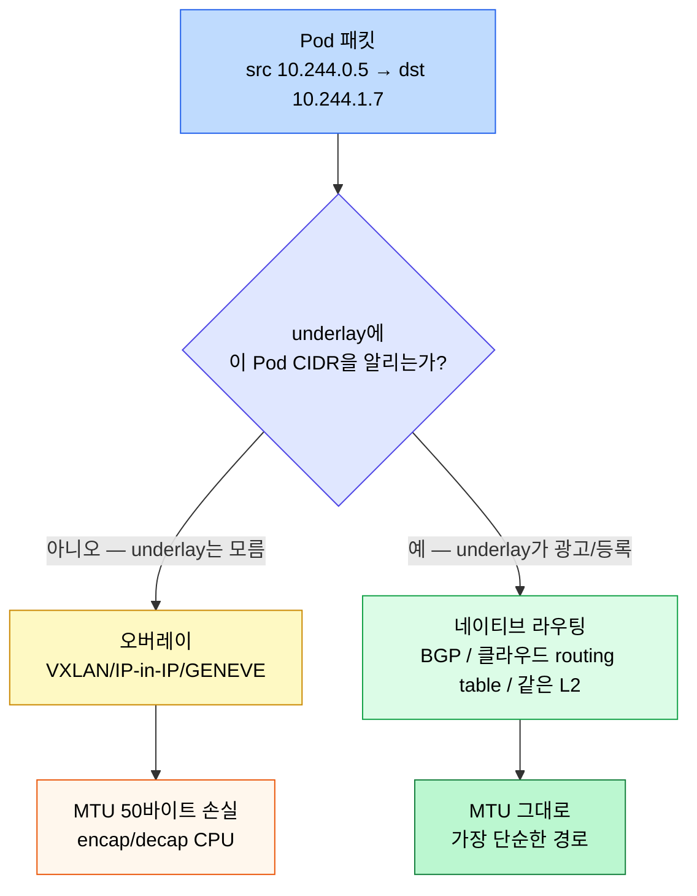
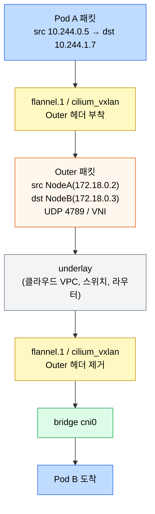
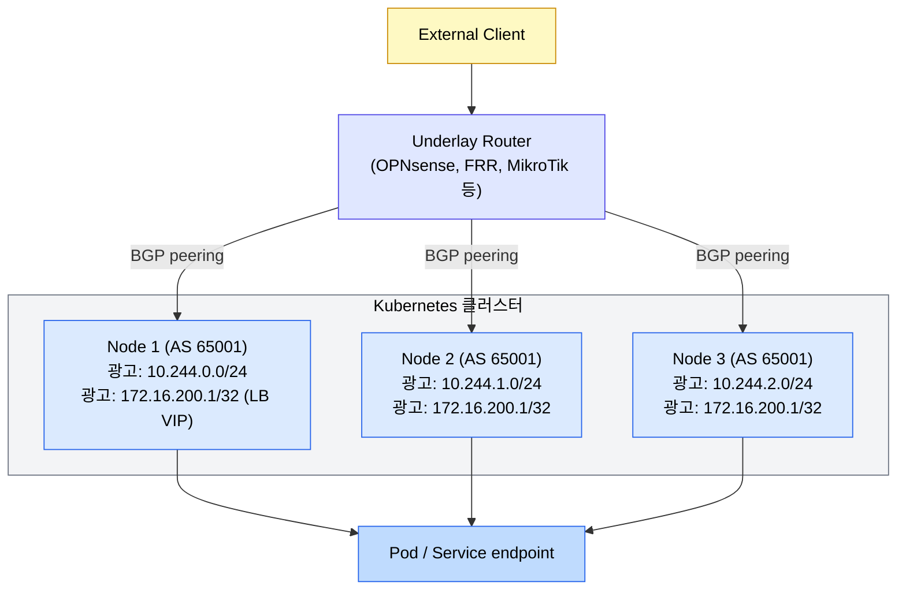

# 오버레이와 노드 간 트래픽

---
> 노드 간 Pod 트래픽을 운반하는 방식은 두 갈래입니다. 패킷을 한 번 더 감싸는 오버레이(VXLAN, IP-in-IP)와, 그대로 라우팅하는 네이티브 라우팅입니다. 그 위에 외부 LoadBalancer를 올리려면 클라우드가 없는 환경에서는 BGP나 MetalLB 같은 별도 메커니즘이 필요합니다. 04-02가 한 노드 안의 Pod 네트워크를 다뤘다면, 본 장은 그 너머 노드 사이와 외부 진입까지를 잇습니다.

[인터랙티브 시각화](02-03-overlay-bgp.html)에서 같은 흐름을 단계별로 따라갈 수 있습니다.


## 학습 목표
> 클러스터 외부에서 Pod까지 트래픽이 닿는 경로를 underlay 인프라 관점에서 설명할 수 있게 만듭니다.

이 장에서 확인할 목표는 다음과 같습니다:

1. VXLAN 오버레이가 어떤 헤더 구조로 노드 간 패킷을 캡슐화하는지 그릴 수 있습니다.
2. 오버레이와 네이티브 라우팅의 MTU·CPU 트레이드오프를 비교할 수 있습니다.
3. Cilium의 IPAM 모드(`kubernetes` vs `cluster-pool`) 차이가 운영에 어떤 위험을 만드는지 설명할 수 있습니다.
4. Cilium BGP 컨트롤 플레인이 Pod CIDR과 LoadBalancer VIP를 외부 라우터로 광고하는 방식을 설명할 수 있습니다.
5. MetalLB의 L2 모드와 BGP 모드, ECMP 경로 제한이 가용성과 분산에 미치는 영향을 판단할 수 있습니다.


## 1. 노드 간 Pod 트래픽의 두 갈래
> Pod CIDR은 Kubernetes 안에서만 유효한 가상 네트워크입니다. 그 패킷을 노드 underlay(클라우드 VPC, 사내 IP 망)에 태우는 방식이 오버레이냐 네이티브 라우팅이냐로 갈립니다.

오버레이는 Pod 패킷을 노드 IP 헤더로 한 번 더 감쌉니다. 노드 사이 underlay는 자기가 운반하는 안쪽 패킷이 무엇인지 모르며, 단지 노드 IP 사이의 트래픽으로만 봅니다. 대표 구현은 VXLAN(UDP 4789 위 L2 over L3), IP-in-IP, GENEVE입니다.

네이티브 라우팅은 캡슐화 없이 Pod IP 그대로 underlay를 탑니다. 그러려면 underlay가 "어느 노드가 어떤 Pod CIDR을 책임지는가"를 알아야 합니다. 클라우드 라우팅 테이블에 직접 항목을 박는 방식, BGP로 광고하는 방식, 같은 L2 세그먼트 안에서 ARP로 푸는 방식이 있습니다.



선택은 클러스터가 위치한 underlay에 달려 있습니다. 클라우드는 보통 SDN이 BGP나 routing table 통합을 제공하므로 네이티브 라우팅이 자연스럽습니다. 사내 다중 서브넷이나 통제권 없는 네트워크 위에서는 오버레이가 가장 일반적인 선택입니다.


## 2. VXLAN 오버레이의 헤더와 흐름
> VXLAN은 L2 프레임을 UDP 위에 실어 노드 IP 사이로 옮기는 표준입니다. 캡슐화된 패킷을 풀고 감싸는 위치만 잘 잡아 두면 동작이 직관적입니다.

VXLAN 헤더는 24비트 VNI(VXLAN Network Identifier)를 가지며, UDP 4789 포트 위에 얹힙니다. Outer IP 헤더가 노드 IP, Inner Ethernet/IP 헤더가 원래 Pod 패킷입니다. 한 패킷이 추가로 메는 무게는 50바이트(Outer IP 20 + UDP 8 + VXLAN 8 + Inner Ethernet 14)입니다. underlay MTU가 1500이면 Pod 입장에서 쓸 수 있는 MTU는 1450으로 줄어듭니다.

흐름은 단순합니다. CNI가 만든 오버레이 인터페이스(Flannel의 `flannel.1`, Cilium의 `cilium_vxlan` 등)가 outer 헤더를 붙여 노드 NIC로 빼고, 반대편 노드의 같은 인터페이스가 헤더를 떼어 bridge 또는 veth로 보냅니다.



오버레이가 만드는 흔한 함정 두 가지를 알아 두면 시간을 아낄 수 있습니다.

1. MTU 미설정. underlay MTU가 1500이고 Pod에 그대로 1500을 주면 VXLAN 헤더를 못 붙이는 점보 패킷이 fragment 되거나 drop 됩니다. CNI가 자동으로 1450을 잡지 않는 경우 명시적으로 설정합니다.
2. UDP 4789 차단. 사내 방화벽이 UDP를 막거나 ECMP 해싱이 깨져 노드 간 통신이 일부만 되는 사례가 있습니다.


## 3. 네이티브 라우팅과 IPAM 모드
> 캡슐화 없이 Pod 패킷이 underlay를 흐르려면, "어느 노드가 어떤 Pod CIDR을 책임지는지" underlay에 알려야 합니다. CNI의 IPAM 모드와 라우팅 광고 방식이 그 통로입니다.

Cilium은 두 IPAM 모드를 제공합니다.

`kubernetes` 모드는 노드의 `spec.podCIDR`을 그대로 씁니다. kubeadm/Kubespray가 `--pod-network-cidr`로 잘라 놓은 /24를 노드별로 따라가므로 다른 CNI와의 호환성이 좋습니다.

`cluster-pool` 모드는 Cilium 자체가 클러스터 풀(`clusterPoolIPv4PodCIDRList`)을 관리하고 Cilium 노드 객체에 별도 CIDR을 발급합니다. Kubernetes의 `podCIDR`과 무관해집니다. Cilium 단독 운영 환경에서는 이 모드가 더 유연합니다.

두 모드를 섞어 쓰면 안 된다는 점이 운영의 핵심입니다. 발표에서 공유된 실제 사고 사례를 그대로 기억해 두면 좋습니다. 이미 `cluster-pool`로 운영 중이던 클러스터에서 Helm 차트 업그레이드 도중 `ipam.mode`를 `kubernetes`로 잘못 바꿔 머지하면서 노드의 Pod CIDR이 갑자기 바뀌었고, Pod 간 통신이 전부 끊겼습니다. Cilium 자체는 헬름 롤백으로 복구됐지만, 그 사이 헬스체크 실패로 분산 DB 클러스터의 정합성이 깨져 추가 복구 작업이 필요했습니다.

이 사례에서 배울 두 가지는 다음과 같습니다. CNI 설정 변경은 클러스터 전체 영향이라 평상시 Day-2 변경 절차가 아니라 클러스터 재구성에 가까운 신중함이 필요합니다. 그리고 IPAM 모드처럼 한 번 정해지면 되돌리기 어려운 옵션은 클러스터 최초 설계 단계에서 못박고, 그 이후로는 Helm values diff를 두 사람 이상이 점검한 다음에야 적용합니다.


## 4. Cilium BGP 컨트롤 플레인
> 네이티브 라우팅을 underlay 라우터까지 잇는 가장 깔끔한 방법은 BGP입니다. Cilium은 BGP 컨트롤 플레인을 내장해 Pod CIDR과 LoadBalancer VIP를 외부 라우터에 직접 광고합니다.

Cilium BGP는 각 노드가 Cilium agent 안에서 BGP 스피커가 되는 구조입니다. 별도 Bird나 FRR을 둘 필요 없이 `CiliumBGPPeeringPolicy`(또는 새로운 `CiliumBGPClusterConfig`/`CiliumBGPNodeConfig`)를 설정해 ASN과 피어 IP를 지정합니다.

광고할 수 있는 prefix는 두 가지입니다. 하나는 노드의 Pod CIDR로, 외부 라우터가 "10.244.1.0/24는 노드 B의 IP로 가라"는 라우팅을 학습합니다. 다른 하나는 LoadBalancer Service의 외부 IP로, 동일 VIP를 여러 노드가 광고하면 ECMP로 분산됩니다.



여기서 짚고 갈 사실 두 가지가 있습니다. BGP는 본래 라우팅 프로토콜이지 로드밸런서가 아닙니다. 같은 prefix가 여러 next-hop으로 광고되면 BGP는 보통 가장 비용이 낮은 한 경로만 고르고 나머지는 standby로 둡니다. 분산을 위해서는 라우터에서 ECMP(Equal-Cost Multi-Path)를 명시적으로 켜야 합니다.

ECMP에는 하드웨어/소프트웨어별 경로 수 제한이 있습니다. OpenSense(FreeBSD 기반)는 64경로 제한이 있고, 엔터프라이즈 스위치는 더 큰 수를 지원합니다. 노드가 64를 넘는 클러스터에서 OPNsense 한 대로 LB를 받는 구성은 추천되지 않습니다. 더 큰 클러스터에서는 라우터를 상향하거나 KubeLB, Cilium LB-IPAM을 결합한 별도 설계를 검토합니다.


## 5. MetalLB — 클라우드 없는 LoadBalancer
> 사내·홈랩처럼 클라우드 컨트롤러 매니저가 없는 환경에서 `type: LoadBalancer`를 살리는 가장 흔한 선택이 MetalLB입니다. L2 모드와 BGP 모드 두 갈래입니다.

L2 모드는 같은 L2 세그먼트 안에서 ARP/NDP로 VIP를 한 노드가 책임집니다. 그 노드 NIC의 MAC이 VIP의 ARP 응답을 차지합니다. 설정이 가장 단순하지만 모든 트래픽이 한 노드에 몰리는 단점이 있고, 그 노드가 죽으면 다른 노드로 페일오버하기까지 ARP 재광고 시간만큼 짧은 끊김이 생깁니다.

BGP 모드는 Cilium BGP와 같은 원리로 VIP를 외부 라우터로 광고합니다. ECMP가 켜져 있으면 여러 노드로 분산되고, 라우팅 컨버전스 시간 안에 페일오버가 끝납니다. 다만 라우터가 BGP를 이해해야 하고 ASN 설계가 필요합니다.

| 항목 | L2 모드 | BGP 모드 |
|------|---------|----------|
| 부하 분산 | 한 노드가 단독 | ECMP로 여러 노드 |
| 페일오버 시간 | 수 초 (ARP 캐시) | 수 초 (BGP 컨버전스) |
| 라우터 요구사항 | 없음 (같은 L2) | BGP 지원 |
| 적합한 환경 | 홈랩, 단일 서브넷 | 데이터센터, 여러 서브넷 |
| 클라우드 가능 | AWS는 ARP 차단으로 불가 | 클라우드 종속적 |

Cilium BGP 컨트롤 플레인이 들어오면서 MetalLB BGP 모드와 역할이 겹칩니다. 같은 클러스터에 둘을 동시에 두면 ASN 충돌이나 광고 중복이 발생하므로 하나만 고릅니다. Cilium을 이미 CNI로 쓰는 클러스터라면 Cilium BGP를 쓰고 MetalLB는 빼는 편이 일관성이 높습니다.


## 6. 디버깅 진입점
> 노드 간 Pod 통신이 이상해지면 underlay 계층부터 확인하는 순서가 정해져 있습니다. 막연히 "네트워크가 안 된다"가 아니라 어디서 막혔는지를 좁혀 봅니다.

확인 순서는 다음과 같습니다:

1. 같은 노드 안 Pod끼리 통신이 되는지 봅니다. 안 되면 CNI 자체나 bridge 설정 문제입니다.
2. 노드 간 Pod 통신이 안 되면 underlay에서 노드 IP 사이가 살아 있는지 확인합니다 (`ping`, `traceroute`).
3. 오버레이 모드면 UDP 4789(VXLAN) 또는 IP-in-IP 프로토콜이 underlay에서 막혀 있지 않은지, MTU가 50바이트 여유를 두는지 봅니다.
4. 네이티브 라우팅 모드면 노드의 라우팅 테이블(`ip route`)에 다른 노드의 Pod CIDR이 등록돼 있는지, BGP/Cloud routing이 광고를 정상 수신했는지 확인합니다.
5. LoadBalancer VIP가 외부에서 안 닿으면 라우터의 BGP 세션 상태와 광고된 prefix 목록을 봅니다.

자주 쓰는 명령은 다음과 같습니다:

```bash
kubectl get nodes -o wide
kubectl get ciliumnode -o yaml | grep -E "podCIDR|cidrs"
ip route | grep 10.244
cilium bgp peers
cilium bgp routes advertised ipv4 unicast
ip -d link show flannel.1     # VXLAN 인터페이스 상세
tcpdump -i any -n 'udp port 4789'
```


## 다음 단계
> 본 장에서 분기되는 후속 주제를 안내합니다.

- 한 노드 안 Pod 네트워크 메커니즘: [Pod 네트워크와 Linux 기반](02-02.Pod%20%EB%84%A4%ED%8A%B8%EC%9B%8C%ED%81%AC%EC%99%80%20Linux%20%EA%B8%B0%EB%B0%98.md)
- Service VIP가 어떻게 endpoint로 풀리는지: [Service와 EndpointSlice](02-04.Service%EC%99%80%20EndpointSlice.md)
- 외부 HTTP/HTTPS 진입과 Gateway API: [Ingress와 Gateway API](02-06.Ingress%EC%99%80%20Gateway%20API.md)
- eBPF 디테일과 Hubble: [eBPF와 Cilium](../../service-mesh/14-02.eBPF%EC%99%80%20Cilium.md)


## 관련 문서
> 본 장과 같이 읽으면 좋은 네트워크·서비스 메시 문서를 함께 둡니다.

- [네트워킹](02-01.%EB%84%A4%ED%8A%B8%EC%9B%8C%ED%82%B9.md) — Ch04 전체 지도
- [네트워킹 점검](02-01.%EB%84%A4%ED%8A%B8%EC%9B%8C%ED%82%B9%20%EC%A0%90%EA%B2%80.md) — Cilium IPAM 모드 등 운영 Q&A 포함
- [Pod 네트워크와 Linux 기반](02-02.Pod%20%EB%84%A4%ED%8A%B8%EC%9B%8C%ED%81%AC%EC%99%80%20Linux%20%EA%B8%B0%EB%B0%98.md) — 한 노드 안 메커니즘
- [eBPF와 Cilium](../../service-mesh/14-02.eBPF%EC%99%80%20Cilium.md) — Cilium 아키텍처 본편
