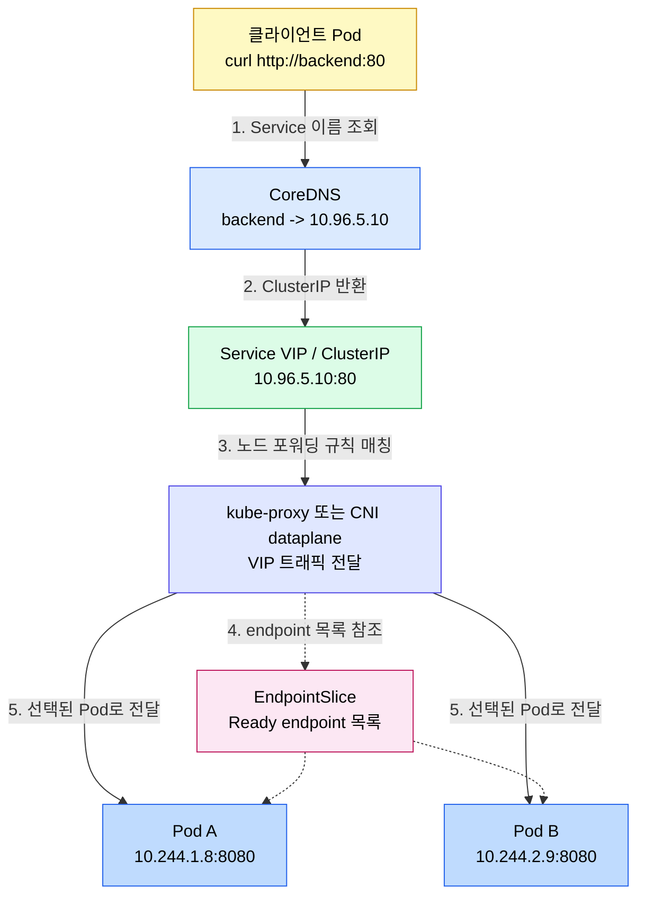
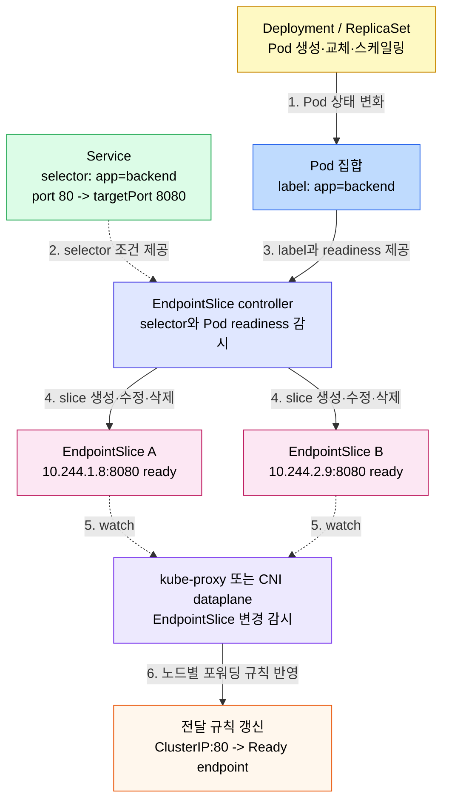
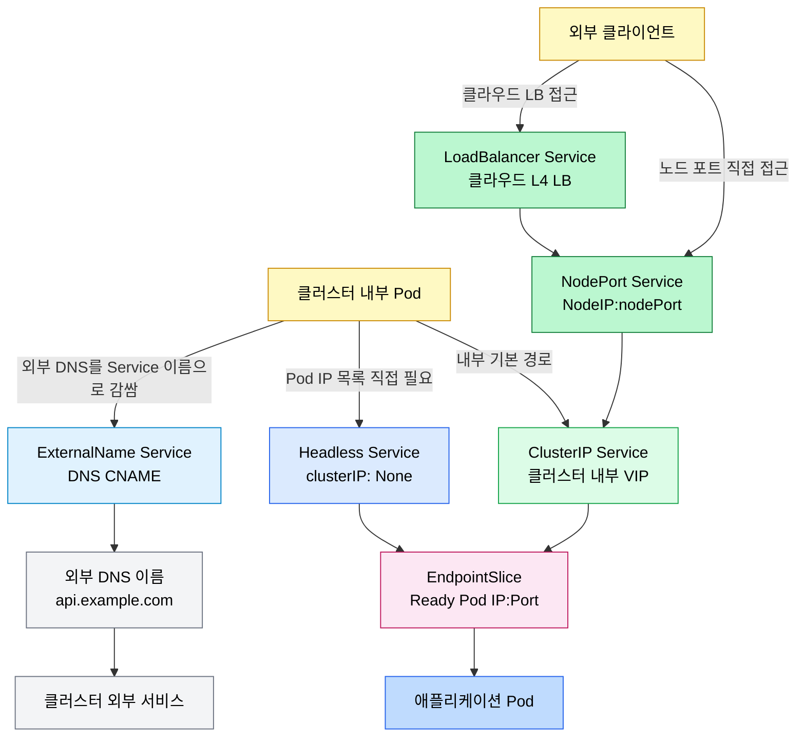
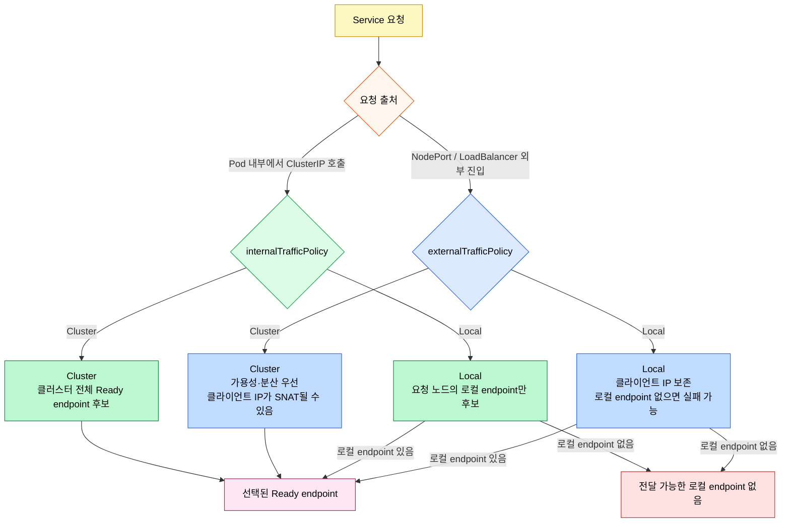

# Service와 EndpointSlice

> Service는 변하는 Pod 집합 앞에 안정적인 이름과 가상 IP를 세우고, EndpointSlice는 그 Service 뒤의 실제 Ready Pod 목록을 확장 가능한 단위로 관리한다.


## 학습 목표
> Service를 "고정 주소"와 "동적 백엔드 목록"의 조합으로 이해한다.

이 장에서 확인할 목표는 다음과 같다:

1. Pod IP가 직접 통신 대상으로 부적합한 이유를 설명할 수 있다.
2. Service VIP, ClusterIP, DNS 이름의 관계를 구분할 수 있다.
3. EndpointSlice가 Service 백엔드 목록을 어떻게 표현하는지 이해할 수 있다.
4. `port`, `targetPort`, selector, readiness가 트래픽 전달에 미치는 영향을 설명할 수 있다.
5. ClusterIP, NodePort, LoadBalancer, ExternalName, Headless Service를 사용 시점별로 구분할 수 있다.


## 1. Service가 해결하는 문제
> Pod는 사라지고 다시 만들어지는 실행 단위이므로, 클라이언트가 Pod IP를 직접 들고 있으면 쉽게 깨진다.

Deployment가 Pod를 교체하거나 HPA가 replica 수를 조정하면 Pod IP는 계속 바뀐다. 클라이언트가 `10.244.1.8:8080` 같은 Pod IP를 직접 호출하면, 그 Pod가 재시작되는 순간 연결 대상이 사라진다.

Service는 이 문제를 두 단계로 푼다. 클라이언트에게는 `backend.default.svc.cluster.local` 같은 DNS 이름과 `ClusterIP`를 제공하고, 내부적으로는 selector에 맞는 Ready Pod 목록을 EndpointSlice로 추적한다. 클라이언트는 Service만 알고, Kubernetes가 현재 살아 있는 Pod로 연결한다.

Service를 이해할 때는 다음 두 질문을 분리해야 한다:

- 클라이언트는 어떤 안정적인 주소로 접근하는가?
- 그 주소 뒤에는 현재 어떤 Pod들이 Ready endpoint로 붙어 있는가?


## 2. VIP와 ClusterIP
> VIP는 Service가 제공하는 논리적 목적지이며, 일반적인 ClusterIP Service에서는 ClusterIP가 VIP 역할을 한다.

VIP(Virtual IP)는 "이 Service로 보내라"는 가상 주소다. 대부분의 내부 Service는 `type: ClusterIP`이고, `10.96.x.x` 같은 ClusterIP가 할당된다. 이 주소는 특정 Pod의 IP가 아니며, 보통 특정 네트워크 인터페이스에 직접 붙어 있는 서버 주소로 이해하면 안 된다.

Service VIP로 들어온 패킷은 각 노드의 kube-proxy 또는 CNI dataplane 규칙에 의해 실제 endpoint로 전달된다. 구현은 iptables, IPVS, nftables, eBPF 등 환경마다 다를 수 있지만 운영 모델은 같다. Service VIP는 안정적인 진입점이고, 실제 목적지는 EndpointSlice에 기록된 Pod IP:Port 중 하나다.

dataplane 모드 선택은 클러스터 규모에 직접 영향을 준다. iptables 모드는 오랜 기본값이지만 규칙 체인을 선형 탐색하므로 Service 수가 많아질수록 첫 패킷 지연이 커진다. nftables 모드는 1.31에서 beta, 1.33에서 GA로 들어왔고 set·map 자료구조로 매칭을 빠르게 만든다. IPVS 모드는 큰 클러스터에서 검증되었지만 NodePort나 NetworkPolicy는 여전히 iptables를 거친다. Cilium 같은 eBPF 기반 CNI는 kube-proxy 자체를 대체해 커널 훅에서 직접 endpoint를 찾는다. dataplane 메커니즘과 진단 명령은 [Pod 네트워크와 Linux 기반](02-02.Pod%20%EB%84%A4%ED%8A%B8%EC%9B%8C%ED%81%AC%EC%99%80%20Linux%20%EA%B8%B0%EB%B0%98.md) 7절에서 따로 다룬다.




## 3. EndpointSlice
> EndpointSlice는 Service 뒤의 실제 백엔드 endpoint를 작게 나눠 관리하는 API다.

예전에는 Service의 백엔드가 Endpoints 리소스 하나에 모였다. Pod 수가 많아지면 하나의 Endpoints 객체가 너무 커지고, 작은 변경에도 큰 객체를 계속 갱신해야 했다. EndpointSlice는 endpoint 목록을 여러 조각으로 나눠 이 문제를 줄인다.

EndpointSlice에는 주소, 포트, 프로토콜, readiness 상태, topology 정보가 들어간다. Service selector가 `app=backend`인 Pod를 찾으면 컨트롤 플레인이 EndpointSlice를 만들고 갱신한다. readiness probe가 실패한 Pod는 Ready endpoint에서 빠져 트래픽을 받지 않는다.

EndpointSlice 갱신 흐름은 다음처럼 이해하면 된다:



운영에서 Service가 동작하지 않을 때는 `kubectl get endpoints`만 보지 말고 EndpointSlice도 확인한다:

```bash
kubectl get svc backend
kubectl get endpointslices -l kubernetes.io/service-name=backend
kubectl describe endpointslice <endpoint-slice-name>
```

EndpointSlice가 비어 있으면 Service VIP가 있어도 보낼 대상이 없다. 이때는 selector가 Pod label과 맞는지, Pod가 Ready 상태인지, Service의 `targetPort`가 실제 컨테이너 port와 맞는지를 확인한다.


## 4. selector와 port 매핑
> Service는 이름만 안정화하는 것이 아니라, 클라이언트 port와 Pod port 사이의 계약도 만든다.

가장 일반적인 Service는 selector로 Pod를 고른다. `port`는 클라이언트가 Service에 접속할 때 쓰는 포트이고, `targetPort`는 실제 Pod 컨테이너가 듣는 포트다.

```yaml
apiVersion: v1
kind: Service
metadata:
  name: backend
spec:
  selector:
    app: backend
  ports:
    - name: http
      port: 80
      targetPort: 8080
```

이 예시에서 클라이언트는 `backend:80`으로 호출한다. 실제 애플리케이션은 Pod 내부 `8080`에서 떠 있어도 된다. 이 분리 덕분에 애플리케이션 내부 포트가 바뀌어도 Service 인터페이스를 안정적으로 유지할 수 있다.

selector가 없는 Service도 가능하다. 이 경우 Kubernetes가 Pod를 자동으로 찾지 않으므로 EndpointSlice를 직접 만들거나 외부 시스템을 Service 이름으로 감싸야 한다. 클러스터 밖 데이터베이스를 내부 애플리케이션에 `db.default.svc.cluster.local` 같은 이름으로 노출하고 싶을 때 사용할 수 있다.


## 5. Service 타입
> Service 타입은 "어디까지 노출할 것인가"를 정하는 선택지다.

주요 타입은 다음과 같다:

| 타입 | 접근 범위 | 용도 |
|------|----------|------|
| ClusterIP | 클러스터 내부 | 기본값, 마이크로서비스 내부 통신 |
| NodePort | 각 노드 IP의 고정 포트 | 학습, 간단한 외부 테스트 |
| LoadBalancer | 외부 로드밸런서 | 클라우드 환경의 L4 외부 노출 |
| ExternalName | DNS CNAME | 외부 DNS 이름을 Service처럼 참조 |
| Headless | ClusterIP 없음 | StatefulSet, 클라이언트 직접 endpoint 선택 |

`type: LoadBalancer`는 클라우드에서 외부 L4 로드밸런서를 자동 생성하는 추상이다. AWS, GCP, Azure에서는 cloud controller manager가 실제 로드밸런서를 만들지만, 베어메탈이나 kubeadm 클러스터에서는 구현체가 없으면 `EXTERNAL-IP`가 `<pending>`으로 남을 수 있다. 이 경우 MetalLB 같은 별도 구현체가 필요하다.

Headless Service는 `clusterIP: None`으로 만든다. DNS 질의 시 하나의 ClusterIP가 아니라 Ready Pod IP 목록이 반환된다. StatefulSet과 함께 쓰면 `mysql-0.mysql.default.svc.cluster.local`처럼 각 Pod에 안정적인 이름으로 접근할 수 있다.

Service 타입을 노출 범위로 보면 다음 흐름이다:




## 6. 트래픽 정책
> Service는 endpoint 후보 범위를 클러스터 전체로 볼지, 노드 로컬로 제한할지 선택할 수 있다.

`internalTrafficPolicy`는 클러스터 내부에서 Service로 접근할 때 endpoint 선택 범위를 정한다. 기본값인 `Cluster`는 클러스터 전체 Ready endpoint를 후보로 본다. `Local`은 요청이 들어온 노드의 로컬 endpoint만 사용한다.

`externalTrafficPolicy`는 NodePort나 LoadBalancer 같은 외부 진입 트래픽에서 중요하다. `Cluster`는 가용성과 분산에 유리하지만 SNAT로 인해 애플리케이션이 원래 클라이언트 IP를 직접 보지 못할 수 있다. `Local`은 클라이언트 IP 보존에 유리하지만, 트래픽이 들어온 노드에 로컬 endpoint가 없으면 요청이 실패할 수 있다.

운영 판단은 다음처럼 단순화할 수 있다:

- 가용성과 균등 분산이 우선이면 `Cluster`를 기본으로 둔다.
- 클라이언트 IP 보존이 중요하면 `externalTrafficPolicy: Local`을 검토한다.
- 노드 간 불필요한 홉을 줄이고 싶으면 `internalTrafficPolicy: Local`을 검토한다.
- `Local` 정책을 쓰면 로컬 endpoint가 없는 노드의 동작과 로드밸런서 헬스체크를 반드시 같이 설계한다.

정책별 endpoint 선택 흐름은 다음과 같다:




## 7. 디버깅 루틴
> Service 장애는 VIP, EndpointSlice, Pod readiness를 분리해서 봐야 빠르다.

확인 순서는 다음과 같다:

1. Service가 존재하고 `port`/`targetPort`가 맞는지 확인한다.
2. selector가 실제 Pod label과 일치하는지 확인한다.
3. EndpointSlice에 Ready endpoint가 있는지 확인한다.
4. Pod가 Ready 상태인지, readiness probe가 실패하지 않는지 확인한다.
5. ClusterIP로 직접 접근했을 때 실패하면 kube-proxy 또는 CNI dataplane을 확인한다.
6. 외부에서만 실패하면 NodePort, LoadBalancer, Ingress/Gateway 계층을 확인한다.

자주 쓰는 명령은 다음과 같다:

```bash
kubectl get svc backend -o wide
kubectl get pods -l app=backend -o wide
kubectl get endpointslices -l kubernetes.io/service-name=backend
kubectl describe svc backend
```


## 다음 단계
> Service 이름 해석은 DNS와 CoreDNS 문서에서 이어진다.

Service는 안정적인 네트워크 진입점을 제공하지만, 애플리케이션은 보통 ClusterIP를 직접 외우지 않는다. 다음 장에서는 Service와 Pod 이름이 DNS 레코드로 어떻게 만들어지고, CoreDNS를 어떻게 운영하는지 다룬다.


## 관련 문서
> Service 앞뒤의 네트워크 계층을 함께 연결한다.

- [네트워킹](02-01.%EB%84%A4%ED%8A%B8%EC%9B%8C%ED%82%B9.md) — Ch04 전체 지도
- [DNS와 CoreDNS](02-05.DNS%EC%99%80%20CoreDNS.md) — Service discovery와 CoreDNS 운영
- [Ingress와 Gateway API](02-06.Ingress%EC%99%80%20Gateway%20API.md) — 외부 HTTP(S) 진입 계층
