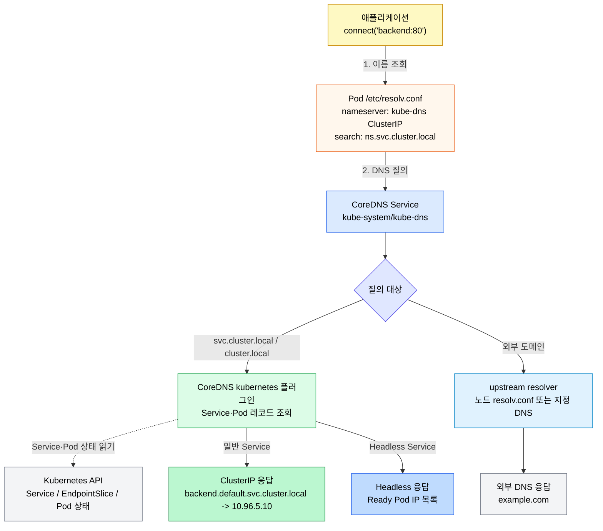
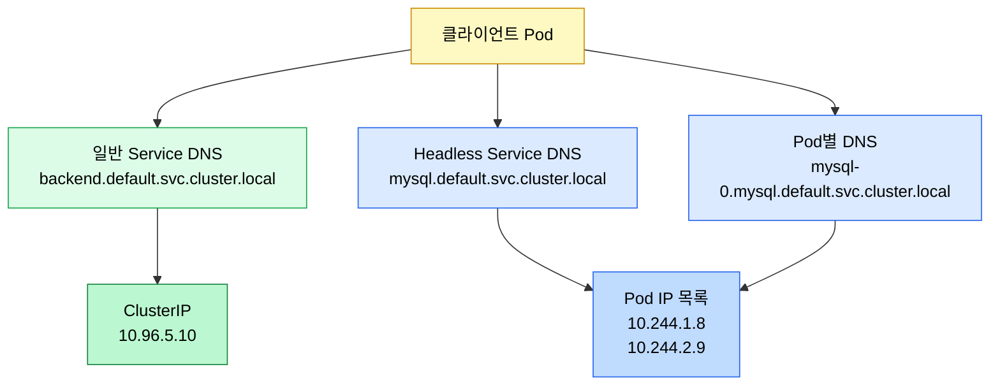
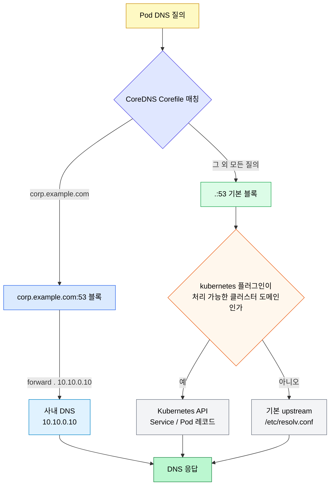
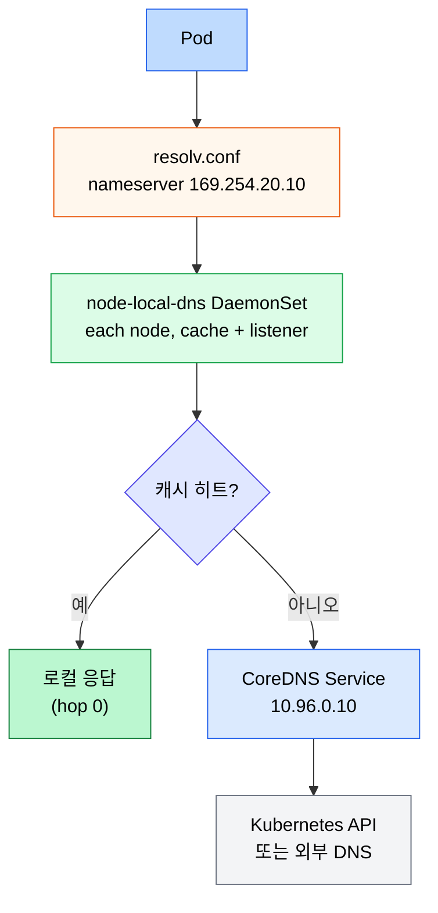
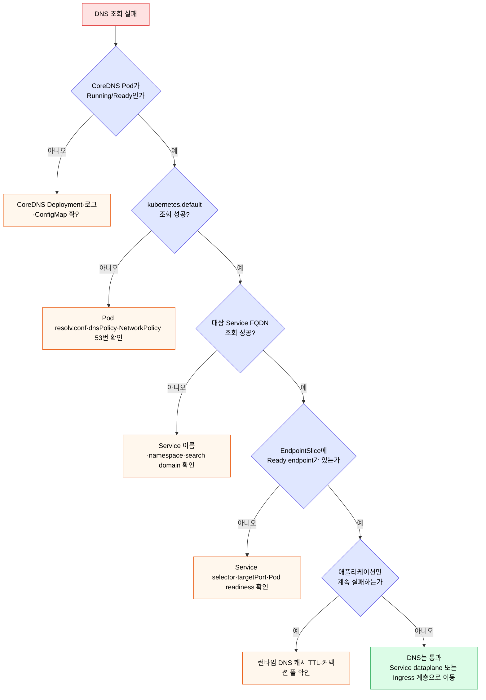

# DNS와 CoreDNS

> Kubernetes에서 애플리케이션은 보통 IP가 아니라 Service 이름으로 통신합니다. CoreDNS는 이 이름을 ClusterIP, Headless Service의 Pod IP 목록, 또는 외부 DNS로 해석하는 서비스 디스커버리 계층입니다.


## 학습 목표
> DNS 문제를 Service 문제와 분리해서 진단할 수 있도록 레코드와 CoreDNS 운영 방식을 정리합니다.

이 장에서 확인할 목표는 다음과 같습니다:

1. 일반 Service와 Headless Service의 DNS 응답 차이를 설명할 수 있습니다.
2. Service FQDN과 같은 네임스페이스 짧은 이름 해석 방식을 이해할 수 있습니다.
3. Pod의 `dnsPolicy`, `dnsConfig`, `/etc/resolv.conf`가 DNS 조회에 미치는 영향을 설명할 수 있습니다.
4. CoreDNS ConfigMap으로 stub domain과 upstream nameserver를 설정하는 방식을 이해할 수 있습니다.
5. DNS 장애를 CoreDNS, Service, NetworkPolicy, 클라이언트 캐시 관점으로 나눠 진단할 수 있습니다.


## 1. Service DNS 기본
> Service 이름은 클러스터 내부 통신의 기본 인터페이스입니다.

Service가 생성되면 Kubernetes DNS는 Service 이름에 대한 레코드를 제공합니다. 일반적인 ClusterIP Service는 하나의 A/AAAA 레코드로 Service의 ClusterIP를 반환합니다.

Service FQDN 형식은 다음과 같다:

```text
<service-name>.<namespace>.svc.<cluster-domain>
```

기본 클러스터 도메인이 `cluster.local`이라면 `backend` Service의 전체 이름은 다음과 같다:

```text
backend.default.svc.cluster.local
```

같은 네임스페이스의 Pod에서는 짧은 이름 `backend`만 써도 됩니다. Pod의 `/etc/resolv.conf`에 search domain이 들어가 있어서 `backend` 질의가 `backend.<namespace>.svc.cluster.local`까지 확장됩니다.

Service 이름 해석 흐름은 다음처럼 나뉜다:




## 2. 일반 Service와 Headless Service
> 일반 Service는 ClusterIP 하나를 반환하고, Headless Service는 backing Pod IP 목록을 반환합니다.

일반 Service는 DNS 질의에 ClusterIP를 반환합니다. 이후 실제 Pod 선택은 Service dataplane이 담당합니다. 클라이언트는 백엔드 Pod가 몇 개인지, 어느 Pod가 선택되는지 알 필요가 없습니다.

Headless Service는 `clusterIP: None`으로 만듭니다. 이 경우 DNS는 ClusterIP 하나가 아니라 Service 뒤의 Ready Pod IP 목록을 반환합니다. StatefulSet처럼 각 Pod를 직접 식별해야 하는 워크로드에서 중요합니다.



Headless Service를 사용할 때는 클라이언트가 여러 DNS 응답을 처리할 수 있어야 합니다. 일부 클라이언트는 첫 번째 IP만 쓰거나 DNS 캐시를 오래 잡아 장애 전환이 느릴 수 있습니다. 데이터베이스 드라이버나 메시지 브로커 클라이언트의 DNS 캐시 정책까지 함께 확인해야 합니다.


## 3. Pod DNS와 resolv.conf
> Pod의 DNS 동작은 kubelet이 주입한 `/etc/resolv.conf`와 `dnsPolicy`에 의해 결정됩니다.

일반 Pod의 기본 DNS 정책은 `ClusterFirst`입니다. 클러스터 도메인에 속한 이름은 CoreDNS로 질의하고, 그 외 도메인은 CoreDNS가 upstream nameserver로 전달합니다.

Pod 내부의 `/etc/resolv.conf`는 보통 다음과 유사하다:

```text
search default.svc.cluster.local svc.cluster.local cluster.local
nameserver 10.96.0.10
options ndots:5
```

`ndots:5`는 점이 5개 미만인 이름을 먼저 search domain과 조합해 조회하게 만듭니다. 그래서 `backend` 같은 짧은 이름이 같은 네임스페이스 Service로 자연스럽게 확장됩니다. 반대로 외부 도메인 조회가 많은 애플리케이션에서는 불필요한 내부 DNS 질의가 늘어날 수 있으므로 성능 분석 시 `ndots` 영향을 의심할 수 있습니다.

주요 `dnsPolicy`는 다음과 같다:

| 정책 | 의미 | 사용 시점 |
|------|------|----------|
| `ClusterFirst` | 클러스터 DNS 우선 | 일반 애플리케이션 기본값 |
| `Default` | 노드의 DNS 설정 사용 | 클러스터 DNS를 쓰지 않는 특수 Pod |
| `ClusterFirstWithHostNet` | hostNetwork Pod가 클러스터 DNS 사용 | 노드 에이전트, CNI/모니터링 계열 |
| `None` | `dnsConfig`로 직접 지정 | 특수한 DNS 구성 |

hostNetwork Pod는 네트워크 네임스페이스를 노드와 공유합니다. 이때 클러스터 Service 이름 해석이 필요하면 `ClusterFirstWithHostNet`을 명시해야 합니다.


## 4. dnsConfig
> Pod 단위로 search domain, nameserver, resolver option을 조정할 수 있습니다.

대부분의 애플리케이션은 기본 `ClusterFirst`를 유지하는 것이 안전합니다. 사내 DNS 도메인을 추가하거나 `ndots`를 조정해야 할 때만 `dnsConfig`를 사용합니다.

```yaml
apiVersion: v1
kind: Pod
metadata:
  name: app-with-custom-dns
spec:
  dnsPolicy: ClusterFirst
  dnsConfig:
    searches:
      - default.svc.cluster.local
      - svc.cluster.local
      - corp.example.com
    options:
      - name: ndots
        value: "2"
  containers:
    - name: app
      image: nginx:1.29
```

`dnsPolicy: None`은 모든 DNS 설정을 직접 책임지겠다는 뜻입니다. Service discovery까지 깨질 수 있으므로 dev 환경에서 습관적으로 쓰면 안 됩니다. 특별한 네트워크 요구가 없다면 `ClusterFirst`를 기본으로 두고 필요한 옵션만 최소 조정합니다.


## 5. CoreDNS 구성
> CoreDNS는 보통 `kube-system` 네임스페이스의 Deployment와 ConfigMap으로 운영됩니다.

CoreDNS는 Kubernetes 클러스터의 기본 DNS 서버 역할을 합니다. `kube-system` 네임스페이스에서 `coredns` Deployment와 `coredns` ConfigMap을 확인할 수 있습니다.

```bash
kubectl -n kube-system get deploy coredns
kubectl -n kube-system get configmap coredns -o yaml
```

대표적인 Corefile 구조는 다음과 같다:

```text
.:53 {
    errors
    health
    ready
    kubernetes cluster.local in-addr.arpa ip6.arpa {
        pods insecure
        fallthrough in-addr.arpa ip6.arpa
    }
    forward . /etc/resolv.conf
    cache 30
    reload
    loadbalance
}
```

`kubernetes` 플러그인은 Service와 Pod 레코드를 Kubernetes API에서 읽어 응답합니다. `forward`는 CoreDNS가 모르는 외부 도메인을 upstream resolver로 넘긴다. `cache`는 DNS 응답을 일정 시간 캐시해 CoreDNS와 API 서버 부하를 줄입니다.


## 6. 커스텀 도메인과 upstream nameserver
> 특정 사내 도메인만 별도 DNS로 보내고 나머지는 기본 upstream으로 보내는 구성이 가능합니다.

사내 도메인 `corp.example.com`은 사내 DNS로 보내고, 나머지 외부 도메인은 기본 resolver로 보내고 싶다면 CoreDNS ConfigMap에 별도 서버 블록을 추가합니다.

```text
corp.example.com:53 {
    errors
    cache 30
    forward . 10.10.0.10
}

.:53 {
    errors
    health
    ready
    kubernetes cluster.local in-addr.arpa ip6.arpa {
        pods insecure
        fallthrough in-addr.arpa ip6.arpa
    }
    forward . /etc/resolv.conf
    cache 30
    reload
    loadbalance
}
```

이 방식은 클러스터 전체 DNS 동작을 바꾸므로 영향 범위가 큽니다. 특정 Pod만 다른 DNS 동작이 필요하면 CoreDNS 전역 설정보다 Pod의 `dnsConfig`가 더 안전할 수 있습니다.

CoreDNS 서버 블록과 upstream 분기 흐름은 다음처럼 읽으면 된다:



CoreDNS ConfigMap을 바꾼 뒤에는 rollout 상태와 로그를 확인한다:

```bash
kubectl -n kube-system rollout status deployment/coredns
kubectl -n kube-system logs deploy/coredns
```


## 7. NodeLocal DNS Cache
> 클러스터가 커지면 CoreDNS가 모든 Pod의 DNS 질의를 받는 단일 지점이 됩니다. NodeLocal DNS Cache는 노드마다 로컬 캐시 DNS를 둬 첫 질의만 CoreDNS로 가게 만듭니다.

기본 설정에서 Pod의 `nameserver`는 `kube-dns` Service ClusterIP(`10.96.0.10`)다. 즉 모든 Pod가 노드 사이를 건너 CoreDNS로 직접 질의합니다. 클러스터 규모가 커지거나 짧은 TTL의 외부 도메인을 자주 조회하는 워크로드가 늘면 CoreDNS Pod가 CPU/메모리 한계에 부딪히고, conntrack 테이블에 UDP DNS 엔트리가 가득 차서 패킷이 drop 되는 사례가 보고됩니다.

NodeLocal DNS Cache는 노드마다 DaemonSet으로 캐시 DNS를 띄우고, Pod의 nameserver를 그 로컬 IP로 가로챈다. 캐시에 응답이 있으면 노드 안에서 끝나고, 없을 때만 CoreDNS로 forwarding합니다. Kubespray 같은 일부 배포본은 이 설정을 기본 활성으로 가져오므로 Pod에 들어가서 `cat /etc/resolv.conf`를 보면 `nameserver`가 `169.254.20.10` 같은 로컬 링크 주소로 잡혀 있습니다.



도입할 때 알아 둘 운영 포인트는 다음과 같습니다.

**Pod의 resolv.conf가 의도대로 잡혔는지 확인합니다.** node-local-dns DaemonSet이 떠 있어도 kubelet이 Pod에 주입하는 nameserver를 자동으로 바꾸지 않습니다. cluster DNS IP를 dummy 인터페이스로 노드에 할당하는 trick을 쓰거나(공식 manifest 방식), `--cluster-dns` 플래그를 로컬 IP로 변경하거나, kube-proxy 모드에 따라 패킷 가로채기를 다르게 설정해야 합니다. Kubespray는 이 모든 걸 기본 자동화합니다.

**캐시 DNS가 죽으면 그 노드의 모든 Pod가 동시에 DNS 장애를 봅니다.** 단일 캐시 Pod가 노드 단위 SPOF가 됩니다. 따라서 해당 DaemonSet은 readiness probe와 함께 health endpoint(보통 8080/health)로 모니터링하고, 재시작 정책을 명확히 둔다.

**TCP fallback 경로를 함께 설정합니다.** 일부 응답(특히 큰 TXT 레코드, DNSSEC)은 UDP를 넘는 크기라 TCP로 전환됩니다. node-local-dns는 기본으로 TCP도 listen 하지만, 통신 경로의 NetworkPolicy가 TCP 53도 허용하는지 확인합니다.

**클러스터 DNS 자체 디버깅은 헷갈릴 수 있습니다.** Pod에서 nslookup이 빠르게 응답해도 그건 캐시 hit일 뿐 CoreDNS가 정상이라는 보장은 아닙니다. 캐시 우회 테스트가 필요하면 Pod의 `dnsConfig`로 `nameserver`를 임시로 CoreDNS Service IP로 박은 임시 Pod를 띄워 비교합니다.

```bash
kubectl -n kube-system get daemonset node-local-dns
kubectl -n kube-system logs -l k8s-app=node-local-dns | head -50
kubectl run dns-bypass --image=busybox:1.36 -it --rm \
  --overrides='{"spec":{"dnsPolicy":"None","dnsConfig":{"nameservers":["10.96.0.10"]}}}' \
  -- nslookup kubernetes.default
```


## 8. DNS 장애 진단
> DNS 장애는 CoreDNS 자체 문제, Service 레코드 문제, 네트워크 정책 문제, 클라이언트 캐시 문제로 나눠 봅니다.

확인 순서는 다음과 같다:

1. CoreDNS Pod가 Running/Ready인지 확인합니다.
2. 테스트 Pod에서 `kubernetes.default`와 대상 Service 이름을 조회합니다.
3. Service와 EndpointSlice가 정상인지 확인합니다.
4. NetworkPolicy가 DNS egress(UDP/TCP 53)를 막고 있지 않은지 확인합니다.
5. 애플리케이션 런타임의 DNS 캐시 TTL을 확인합니다.

명령은 다음처럼 시작한다:

```bash
kubectl -n kube-system get pods -l k8s-app=kube-dns
kubectl run dns-test --image=busybox:1.36 -it --rm -- nslookup kubernetes.default
kubectl run dns-test --image=busybox:1.36 -it --rm -- nslookup backend.default.svc.cluster.local
kubectl -n kube-system logs deploy/coredns
```

NetworkPolicy를 default-deny로 운영하는 네임스페이스에서는 DNS egress 허용을 자주 빠뜨린다. 이 경우 애플리케이션은 외부 API뿐 아니라 내부 Service 이름도 해석하지 못합니다.

DNS 장애는 다음 순서로 좁히면 된다:



```yaml
apiVersion: networking.k8s.io/v1
kind: NetworkPolicy
metadata:
  name: allow-dns-egress
spec:
  podSelector: {}
  policyTypes:
    - Egress
  egress:
    - to:
        - namespaceSelector:
            matchLabels:
              kubernetes.io/metadata.name: kube-system
      ports:
        - protocol: UDP
          port: 53
        - protocol: TCP
          port: 53
```


## 다음 단계
> DNS로 Service를 찾은 뒤, 외부 사용자는 Ingress나 Gateway API를 통해 들어옵니다.

내부 서비스 디스커버리는 DNS와 Service가 담당합니다. 외부 HTTP/HTTPS 요청을 클러스터 안의 Service로 연결하는 방식은 다음 장의 Ingress와 Gateway API에서 다룹니다.


## 관련 문서
> DNS 앞뒤의 네트워크 계층을 함께 봅니다.

- [네트워킹](02-01.%EB%84%A4%ED%8A%B8%EC%9B%8C%ED%82%B9.md) — Ch04 전체 지도
- [Service와 EndpointSlice](02-04.Service%EC%99%80%20EndpointSlice.md) — DNS가 반환하는 Service 뒤쪽 구조
- [Ingress와 Gateway API](02-06.Ingress%EC%99%80%20Gateway%20API.md) — 외부 진입과 Service 연결
- [실습: _practice 장애 시나리오](../_practice/poc/README.md) — DNS 해석 실패 진단 매니페스트와 진단 명령
