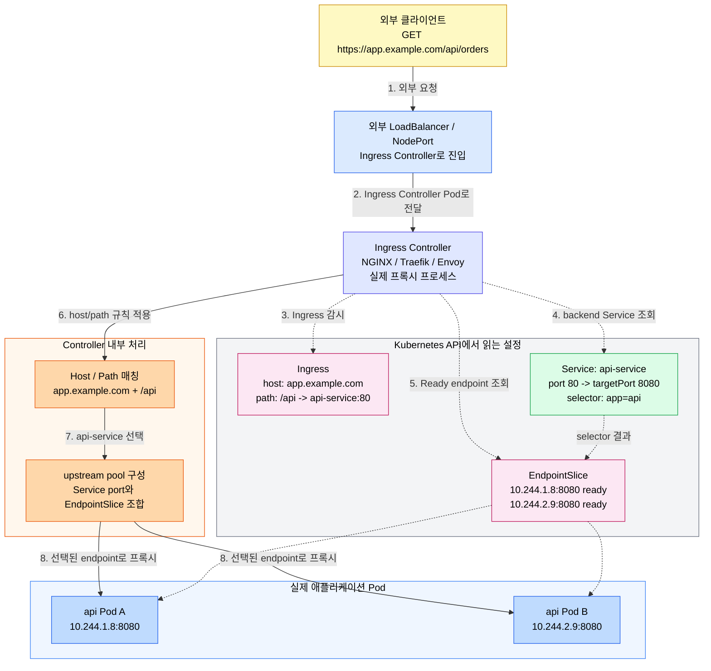
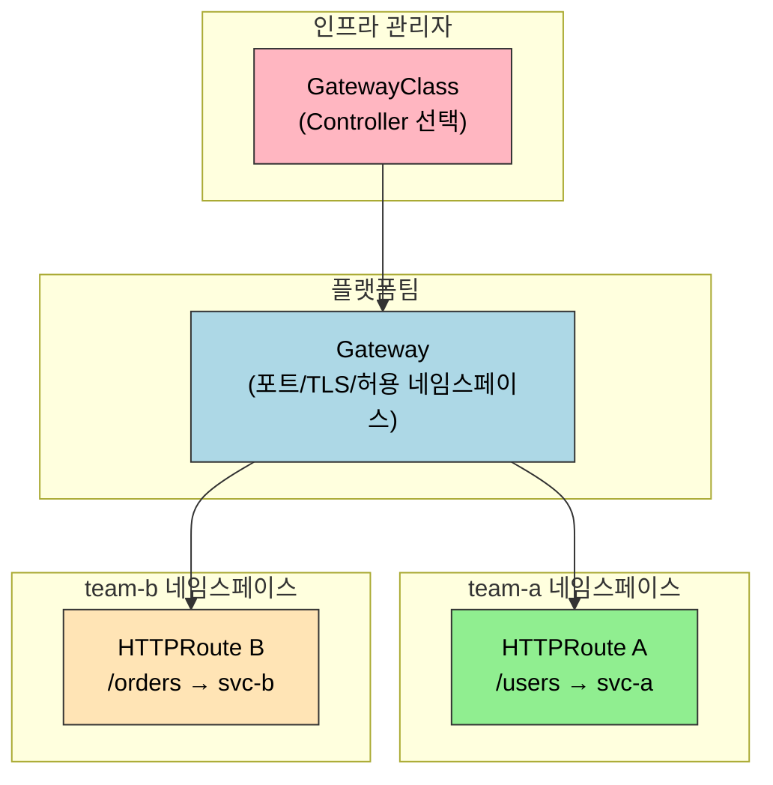
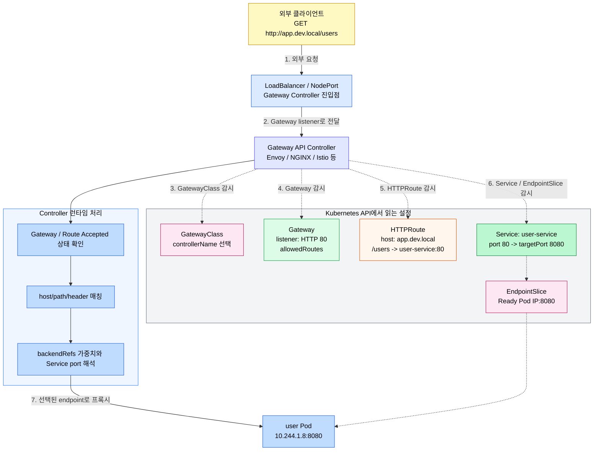
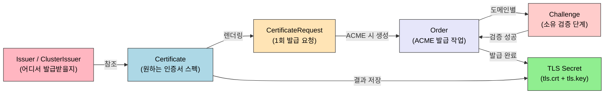

# Ingress와 Gateway API

> Ingress는 선언이고 Ingress Controller가 실행입니다. Gateway API는 이 역할을 더 세밀하게 분리해 대규모 조직의 멀티테넌시 요구를 표준으로 흡수합니다.


## 학습 목표
> 외부 트래픽 라우팅이 Ingress에서 Gateway API로 어떻게 확장되는지 봅니다.

이 장에서 확인할 목표는 다음과 같다:

1. Ingress 리소스와 Ingress Controller의 관계를 설명할 수 있습니다.
2. Gateway API의 세 리소스(`GatewayClass`, `Gateway`, `HTTPRoute`)가 왜 분리되었는지 이해할 수 있습니다.
3. TLS 종단 위치(Ingress vs Pod)의 차이와 선택 기준을 설명할 수 있습니다.
4. `cert-manager`로 TLS 인증서를 자동화하는 방법을 이해할 수 있습니다.
5. Ingress 어노테이션 의존의 한계와 Gateway API가 주는 이식성 개선을 설명할 수 있습니다.
6. dev/온프레미스 환경에서 Ingress와 Gateway API를 어떤 순서로 도입할지 판단할 수 있습니다.


## 1. Ingress와 Ingress Controller
> 오래된 표준인 Ingress가 무엇을 해결했고 어디까지가 한계였는지 정리합니다.

공식 문서 기준으로 Ingress는 stable API이지만 frozen 상태입니다. 즉 제거되는 것은 아니고, 안정적으로 계속 쓸 수 있지만 새 기능은 더 이상 Ingress 스펙에 추가되지 않습니다. 그래서 현재 운영에서는 Ingress를 이해하고 쓸 수 있어야 하고, 신규 설계에서는 Gateway API를 함께 고려해야 합니다.

### 1.1 선언과 실행의 분리

`kind: Ingress`를 `kubectl apply`로 생성하면 Kubernetes API에 오브젝트가 저장됩니다. 이것은 "이런 규칙으로 트래픽을 라우팅해 달라"는 의도의 선언입니다. Ingress Controller가 없으면 선언만 API에 남고 아무 일도 일어나지 않습니다. `kubectl get ingress`의 `ADDRESS` 필드가 비어 있거나 `<pending>`인 상태입니다.

Deployment가 선언되면 kube-controller-manager 내장 컨트롤러가 Pod를 만드는 것과 달리, Ingress Controller는 내장되어 있지 않다. NGINX, Traefik, Envoy 중 무엇을 쓸지는 클러스터 운영자가 선택해서 별도로 설치해야 합니다.

### 1.2 Ingress에서 Service까지 이어지는 방식

Ingress는 최종 Pod를 직접 참조하지 않고 Service를 backend로 참조합니다. Ingress 규칙에는 `backend.service.name`과 `backend.service.port`가 들어가고, Ingress Controller는 이 값을 기준으로 요청을 어느 Service로 보낼지 결정합니다.

요청 흐름을 단순화하면 다음과 같다:



여기서 Service는 "라우팅 대상의 이름과 포트"를 안정적으로 제공하고, EndpointSlice는 그 Service 뒤의 실제 Pod IP 목록을 제공합니다. Ingress Controller는 API 서버를 감시하면서 Ingress, Service, EndpointSlice 변화를 읽고 자신의 프록시 설정을 갱신합니다.

세부 구현은 Controller마다 다를 수 있습니다. 어떤 Controller는 Service의 ClusterIP로 트래픽을 보내 kube-proxy 경로를 타고, 어떤 Controller는 EndpointSlice의 Pod IP를 upstream으로 직접 구성해 Service VIP를 우회합니다. 운영자가 기억해야 할 공통점은 Ingress YAML이 Pod를 직접 고르지 않고, Service와 EndpointSlice 상태가 최종 라우팅 성공 여부를 결정한다는 점입니다.

그래서 Ingress 장애를 볼 때는 `Ingress 규칙 -> Service 존재와 port -> EndpointSlice의 Ready endpoint -> Pod readiness` 순서로 확인하는 것이 빠릅니다. Ingress가 맞아도 Service port가 틀리거나 EndpointSlice가 비어 있으면 Controller는 보낼 백엔드를 찾지 못해 502, 503 또는 컨트롤러별 기본 에러를 반환합니다.

### 1.3 경로 매칭 규칙

Ingress는 세 가지 `pathType`을 지원합니다.

`Exact`는 경로가 정확히 일치해야 매칭됩니다. `/api`는 `/api`에만 매칭되고 `/api/users`에는 매칭되지 않습니다. `Prefix`는 경로 세그먼트(`/` 구분) 단위로 접두사 매칭합니다. `/api`는 `/api/users`에 매칭되지만 `/apiV2`에는 매칭되지 않습니다. 문자열 접두사가 아닌 세그먼트 접두사다. `ImplementationSpecific`은 Controller마다 동작이 달라 이식성이 없습니다.

우선순위는 Exact > 긴 Prefix 순입니다. 같은 길이의 Prefix가 겹치면 생성 시각이 빠른 것이 우선합니다.

### 1.4 Ingress 어노테이션의 한계

Ingress 스펙 자체는 호스트, 경로, TLS만 정의합니다. 속도 제한, 인증, URL 리라이트, 타임아웃 같은 실무 기능은 모두 Controller별 어노테이션에 의존합니다. `nginx.ingress.kubernetes.io/limit-rps: "10"`은 Traefik에서 동작하지 않습니다. Controller를 바꾸면 어노테이션을 전부 재작성해야 합니다.


## 2. Gateway API
> 역할 분리와 확장성을 기준으로 Gateway API의 설계를 설명합니다.

Gateway API는 Kubernetes 공식 문서에서 Ingress API의 successor로 설명됩니다. 핵심 차이는 "모든 책임을 Ingress 하나에 몰아넣지 않는다"는 점입니다. Ingress가 하나의 리소스로 호스트, 경로, TLS, 구현체 의존 기능까지 모두 짊어졌다면, Gateway API는 역할을 나누어 멀티팀 운영과 이식성을 더 잘 지원합니다.

### 2.1 역할 분리 모델

Gateway API는 책임을 세 리소스로 분리합니다.

`GatewayClass`는 인프라 관리자 영역입니다. 어떤 Controller 구현체를 사용할지 정의합니다. 변경 빈도가 낮고 일반 개발자는 접근 권한이 없습니다.

`Gateway`는 플랫폼팀 영역입니다. 어떤 포트에서, 어떤 프로토콜로, 어떤 TLS 인증서를 사용해 트래픽을 수신할지 정의합니다. `allowedRoutes`로 어떤 네임스페이스의 Route를 허용할지 제어합니다.

`HTTPRoute`는 애플리케이션 개발자 영역입니다. 내 서비스로 오는 트래픽의 라우팅 규칙만 정의합니다. `parentRefs`로 공유 Gateway를 참조하고 자신의 호스트명/경로만 작성합니다. 각 팀이 자신의 네임스페이스에서 독립적으로 Route를 관리합니다.



공식 문서 기준으로 `Gateway`는 기본적으로 같은 네임스페이스의 Route만 받습니다. 다른 네임스페이스 Route를 붙이려면 `allowedRoutes`를 명시해야 합니다. 이 제약이 있기 때문에 Gateway API는 "처음부터 멀티테넌시와 권한 경계"를 고려한 구조라고 볼 수 있습니다.

요청이 실제 애플리케이션까지 이동하는 흐름은 다음과 같다:



### 2.2 표준 기능

Gateway API는 자주 쓰는 기능을 스펙에 직접 포함해 어노테이션 없이도 Controller 간 이식성을 보장합니다.

| 기능 | HTTPRoute 필드 |
|------|---------------|
| 트래픽 가중치 분할 | `backendRefs[].weight` |
| 헤더 기반 라우팅 | `matches[].headers` |
| URL 리라이트 | `filters[].urlRewrite` |
| 리다이렉트 | `filters[].requestRedirect` |
| 헤더 조작 | `filters[].requestHeaderModifier` |

### 2.3 다중 프로토콜 지원

Ingress는 HTTP/HTTPS 전용입니다. Gateway API는 프로토콜별 Route 리소스를 표준으로 정의합니다. `GRPCRoute`는 gRPC 서비스명과 메서드명으로 라우팅합니다. `TCPRoute`는 데이터베이스나 커스텀 TCP 프로토콜을 포트 기반으로 라우팅합니다. `TLSRoute`는 SNI 기반으로 TLS 트래픽을 패스스루합니다. `UDPRoute`는 DNS, 게임 서버 등 UDP 트래픽을 처리합니다.

### 2.4 Ingress와 Gateway API를 어떻게 선택할까

개인 클러스터나 작은 팀에서는 Ingress만으로도 충분한 경우가 많습니다. 호스트/경로 라우팅, TLS 종료, 몇 가지 NGINX 어노테이션 정도면 요구사항을 충족하는 경우가 많기 때문입니다. 이 단계에서는 복잡한 리소스 분리보다 단순성이 더 중요합니다.

반대로 여러 팀이 하나의 진입점을 공유하고, 플랫폼팀과 애플리케이션팀의 권한을 나눠야 하고, 추후 Controller 교체 가능성까지 고려한다면 Gateway API가 더 자연스럽다. 핵심 기준은 "라우팅 기능이 많은가"보다 "누가 무엇을 소유해야 하는가"에 가깝다.

실무 판단을 단순화하면 이렇다. 단일 팀과 단일 ingress-nginx면 Ingress부터, 멀티팀 공유 게이트웨이와 교차 네임스페이스 라우트가 필요하면 Gateway API를 검토합니다. 즉 Ingress는 빠른 시작에 강하고, Gateway API는 팀 경계와 확장성에 강합니다.

여기서 한 번 더 선을 그을 필요가 있습니다. 이 장의 Gateway API는 Kubernetes의 north-south 진입과 공유 게이트웨이 관점입니다. 반면 Service Mesh 문서에서 다시 등장하는 Gateway API와 `HTTPRoute`는 east-west 서비스 간 정책이나 메시 구현체와 연결되는 문맥이 더 강합니다. 같은 리소스 이름이 나와도 "클러스터 진입"을 다루는지, "서비스 간 트래픽 제어"를 다루는지 맥락을 나눠서 읽어야 합니다.


## 3. TLS 관리
> 외부 공개 환경에서 인증서 자동화가 왜 기본값이 되는지 다룹니다.

### 3.1 TLS 종단 위치

`TLS Termination`은 Ingress Controller에서 TLS를 종단하고 Pod로는 평문 HTTP를 보내는 방식입니다. 인증서 관리가 중앙화되고 L7 기능(경로 라우팅, 헤더 조작)을 사용할 수 있습니다. 대부분의 웹 서비스에 적합합니다.

`TLS Passthrough`는 Ingress Controller가 암호화된 트래픽을 그대로 Pod로 전달하는 방식입니다. Controller는 TLS ClientHello의 SNI 필드만 읽어 라우팅하고 내용은 복호화하지 않습니다. PCI-DSS, HIPAA처럼 "중간 프록시도 데이터를 읽어서는 안 된다"는 컴플라이언스 요구에 필수다. 단, L7 기능을 사용할 수 없고 경로 기반 라우팅이 불가합니다.

### 3.2 cert-manager의 리소스 모델

cert-manager는 TLS 인증서 발급·갱신·교체를 자동화합니다. 각 단계가 별도 CR로 표현돼, Pod·Ingress·Gateway 어디에서 인증서를 쓰든 같은 흐름으로 동작합니다.



`Issuer`는 네임스페이스 범위, `ClusterIssuer`는 클러스터 범위다. 둘은 발급처(Let's Encrypt, 사내 CA, Vault PKI 등)를 정의합니다. `Certificate`는 운영자가 작성하는 "원하는 인증서"의 선언이며 도메인·키 알고리즘·갱신 주기 같은 스펙을 가집니다. `CertificateRequest`·`Order`·`Challenge`는 cert-manager가 내부 처리에서 자동 생성하는 객체로, 운영자가 직접 만들지 않습니다.

### 3.3 ACME 검증 방식: HTTP-01과 DNS-01

Let's Encrypt 같은 ACME 서버는 발급 전 도메인 소유를 검증합니다. cert-manager는 두 방식을 지원합니다.

| 검증 방식 | 동작 | 사용 시점 |
|---------|------|----------|
| HTTP-01 | ACME 서버가 `http://<domain>/.well-known/acme-challenge/<token>` 경로로 토큰을 조회. cert-manager가 임시 Ingress 규칙을 자동 생성 | 외부에서 80 포트 도달 가능한 일반 웹 서비스 |
| DNS-01 | ACME 서버가 `_acme-challenge.<domain>` TXT 레코드를 조회. cert-manager가 DNS 공급자 API로 레코드를 임시 생성 | 와일드카드 인증서(`*.example.com`), 외부에서 도달 불가능한 내부 도메인 |

```yaml
apiVersion: cert-manager.io/v1
kind: ClusterIssuer
metadata:
  name: letsencrypt-prod
spec:
  acme:
    server: https://acme-v02.api.letsencrypt.org/directory
    email: admin@example.com
    privateKeySecretRef:
      name: letsencrypt-prod
    solvers:
      - http01:
          ingress:
            class: nginx
      - dns01:
          cloudDNS:
            project: my-gcp-project
            serviceAccountSecretRef:
              name: clouddns-dns01-credentials
              key: key.json
        selector:
          dnsZones: ["example.com"]
```

위 ClusterIssuer는 두 솔버를 모두 등록합니다. `selector`가 매칭되는 도메인은 DNS-01로, 그렇지 않으면 HTTP-01로 검증됩니다. 와일드카드 인증서는 ACME 표준상 DNS-01만 가능하므로, `*.example.com`을 발급받으려면 DNS 공급자 API 자격증명을 cert-manager가 가져야 합니다.

### 3.4 Ingress 어노테이션 vs 직접 Certificate

cert-manager 사용 패턴은 두 가지다.

**어노테이션 모드**는 Ingress 한 줄로 끝난다. cert-manager가 Ingress의 `tls.hosts`와 어노테이션을 보고 알아서 Certificate·Secret을 만듭니다.

```yaml
apiVersion: networking.k8s.io/v1
kind: Ingress
metadata:
  name: app-ingress
  annotations:
    cert-manager.io/cluster-issuer: "letsencrypt-prod"
spec:
  ingressClassName: nginx
  tls:
    - hosts: ["app.example.com"]
      secretName: app-tls
  rules:
    - host: app.example.com
      http:
        paths:
          - path: /
            pathType: Prefix
            backend:
              service:
                name: app-service
                port: { number: 80 }
```

**직접 Certificate 모드**는 Ingress와 별도로 Certificate를 작성합니다. Pod가 Secret을 직접 마운트하거나, Gateway API의 `tls.certificateRefs`가 그 Secret을 참조하는 시나리오에 적합합니다.

```yaml
apiVersion: cert-manager.io/v1
kind: Certificate
metadata:
  name: app-cert
  namespace: production
spec:
  secretName: app-tls
  issuerRef:
    name: letsencrypt-prod
    kind: ClusterIssuer
  dnsNames:
    - app.example.com
    - api.example.com
  duration: 2160h    # 90일
  renewBefore: 360h  # 만료 15일 전 갱신
```

운영 관점에서는 Ingress가 표현 가능한 도메인은 어노테이션 모드가 단순합니다. Gateway API, mTLS sidecar, 데이터베이스 TLS 같은 시나리오에서는 Certificate를 직접 둔다. 두 패턴은 결과적으로 같은 Secret을 만들므로, 같은 인증서를 여러 Ingress가 공유하는 경우에도 직접 모드가 자연스럽다.

### 3.5 Gateway API와의 연동

Gateway API의 `Gateway.spec.listeners[].tls.certificateRefs`는 TLS Secret을 직접 참조합니다. cert-manager가 만드는 Secret 이름을 그대로 적으면 됩니다.

```yaml
apiVersion: gateway.networking.k8s.io/v1
kind: Gateway
metadata:
  name: shared-gateway
spec:
  gatewayClassName: nginx
  listeners:
    - name: https
      port: 443
      protocol: HTTPS
      tls:
        mode: Terminate
        certificateRefs:
          - name: app-tls   # cert-manager가 만든 Secret
```

cert-manager는 K8s 1.30부터 Gateway 리소스의 라벨을 보고 자동으로 Certificate를 만들어주는 통합도 제공한다(`cert-manager.io/issuer` 라벨 기반). 다만 운영의 명료성을 위해 Certificate를 명시적으로 두는 패턴이 더 자주 쓰인다.

`08-02 TLS와 API 접근 보안`은 컨트롤 플레인 PKI(API 서버, etcd, kubelet 인증서)에 집중하고, 외부 트래픽 인증서 자동화는 본 절을 보면 됩니다.


## 4. 개인 클러스터 환경
> 같은 리소스 모델을 유지하면서 환경별 노출 방식만 다르게 가져가는 원칙을 정리합니다.

GCP kubeadm 클러스터에서는 nginx-ingress가 NodePort(31292/31726)로 노출됩니다. 외부 LoadBalancer가 없어 `ADDRESS` 필드가 비어 있는 것이 정상입니다. 도메인 기반 테스트는 `/etc/hosts`에 노드 IP를 등록하거나, `curl -H "Host: myapp.example.com" http://<node-ip>:31292` 형태로 호스트 헤더를 수동 지정합니다.

dev 환경에서는 보통 Ingress를 먼저 붙이고, Gateway API는 실험용 namespace에서 별도 Controller 지원 여부를 확인하며 도입합니다. 이유는 간단합니다. Ingress는 `ingress-nginx` 하나만 있으면 바로 테스트가 가능하지만, Gateway API는 CRD 설치 여부, `GatewayClass` 구현체, Controller 지원 범위를 같이 맞춰야 하기 때문입니다.

예를 들어 현재 dev 흐름은 다음처럼 가져가면 무난합니다.

1. 애플리케이션 Service는 `ClusterIP`로 유지합니다.
2. 외부 노출은 `ingress-nginx` NodePort를 통해 Ingress로 먼저 검증합니다.
3. 멀티팀 경계나 shared gateway 요구가 생기면 Gateway API CRD와 Controller를 별도 검증 환경에 올린다.
4. `GatewayClass`와 `Gateway`는 플랫폼 영역으로 두고, 각 앱 팀은 `HTTPRoute`만 관리하게 나눈다.

Ingress 기준의 dev 예시는 다음처럼 충분합니다.

```yaml
apiVersion: networking.k8s.io/v1
kind: Ingress
metadata:
  name: app-ingress
spec:
  ingressClassName: nginx
  rules:
  - host: app.dev.local
    http:
      paths:
      - path: /
        pathType: Prefix
        backend:
          service:
            name: app-service
            port:
              number: 80
```

Gateway API를 시험 도입할 때는 다음처럼 `Gateway`와 `HTTPRoute`를 나누는 식으로 시작하는 것이 좋습니다.

```yaml
apiVersion: gateway.networking.k8s.io/v1
kind: Gateway
metadata:
  name: shared-gateway
  namespace: infra
spec:
  gatewayClassName: nginx
  listeners:
  - name: http
    port: 80
    protocol: HTTP
    allowedRoutes:
      namespaces:
        from: All
---
apiVersion: gateway.networking.k8s.io/v1
kind: HTTPRoute
metadata:
  name: app-route
  namespace: default
spec:
  parentRefs:
  - name: shared-gateway
    namespace: infra
  hostnames:
  - "app.dev.local"
  rules:
  - matches:
    - path:
        type: PathPrefix
        value: /
    backendRefs:
    - name: app-service
      port: 80
```

중요한 점은 Gateway API YAML을 쓴다고 자동으로 동작하는 것이 아니라는 점입니다. CRD만 설치되어 있어도 부족하고, 해당 `GatewayClass`를 실제로 처리하는 Controller가 있어야 합니다. 그래서 dev에서는 "CRD 설치 여부"와 "GatewayClass Accepted 상태"를 먼저 확인하는 루틴이 필요합니다.


## 5. 다음 단계
> 트래픽 진입 계층 위에서 배포 단위를 묶는 Helm으로 연결합니다.

다음 장(Helm 기초)에서는 반복되는 매니페스트를 패키지로 묶는 법을 다룹니다. Ingress 리소스도 Helm 차트로 관리 대상이 되며, 본 장에서 익힌 구조가 templating 관점에서 다시 등장합니다.


## 관련 문서
> 네트워킹 기초, 다음 장, 점검 문서를 함께 둔다.

- [Ingress와 Gateway API 점검](02-06.Ingress%EC%99%80%20Gateway%20API%20%EC%A0%90%EA%B2%80.md) — 본 장의 점검 편
- [네트워킹](02-01.%EB%84%A4%ED%8A%B8%EC%9B%8C%ED%82%B9.md) — Ch04 전체 지도
- [Service와 EndpointSlice](02-04.Service%EC%99%80%20EndpointSlice.md) — Ingress backend가 참조하는 Service 구조
- [DNS와 CoreDNS](02-05.DNS%EC%99%80%20CoreDNS.md) — Service 이름 해석
- [Helm 기초](../03_platform/03-01.Helm%20%EA%B8%B0%EC%B4%88.md) — 다음 장, 패키지 관리자로 배포 자동화
- [Gateway API와 트래픽](../../service-mesh/03-01.Gateway%20API%EC%99%80%20%ED%8A%B8%EB%9E%98%ED%94%BD.md) — Service Mesh 관점에서 다시 보는 후속 문서
