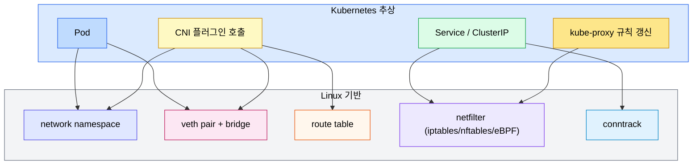
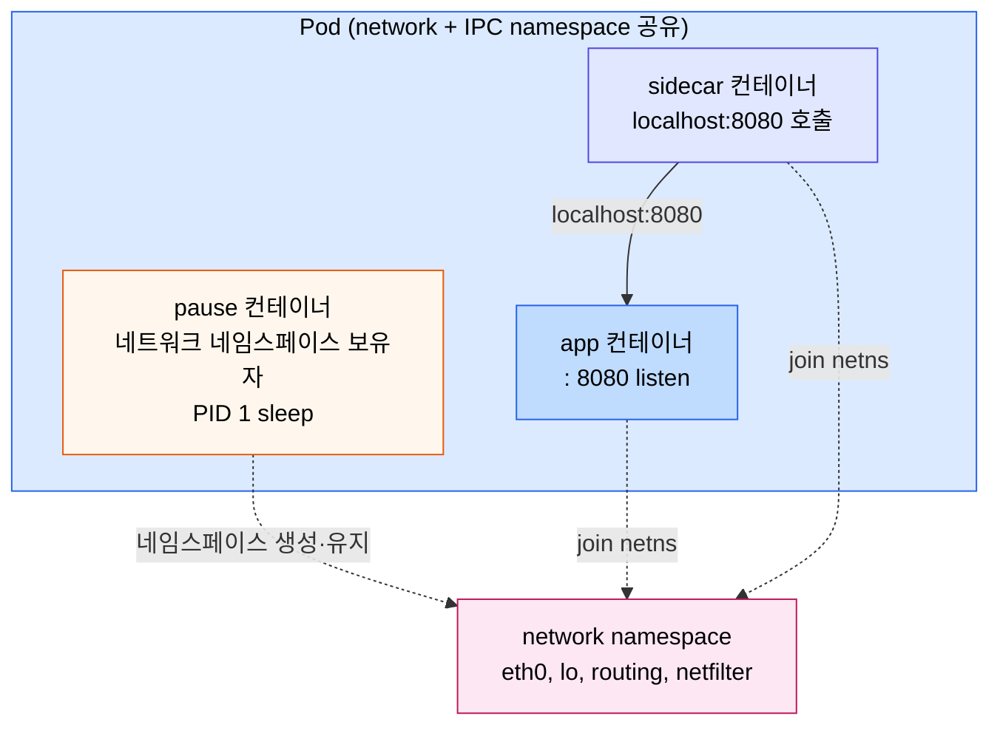
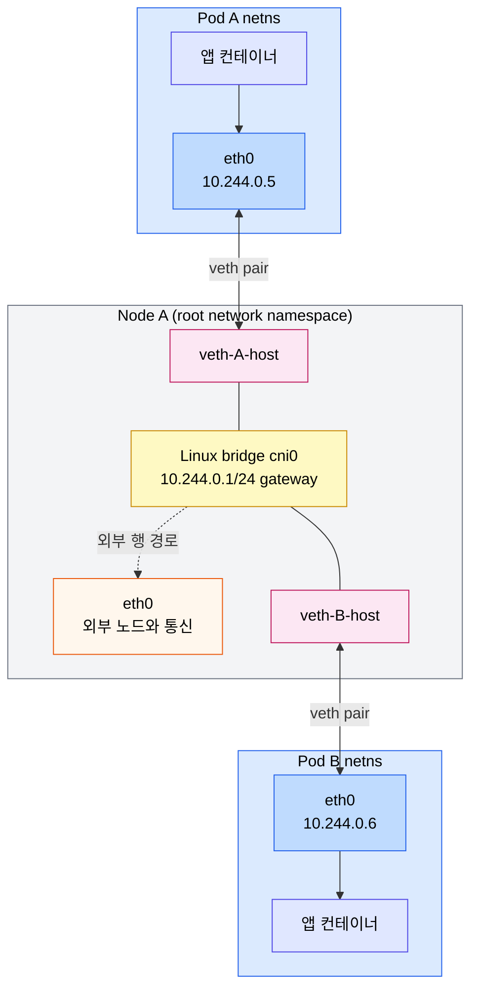
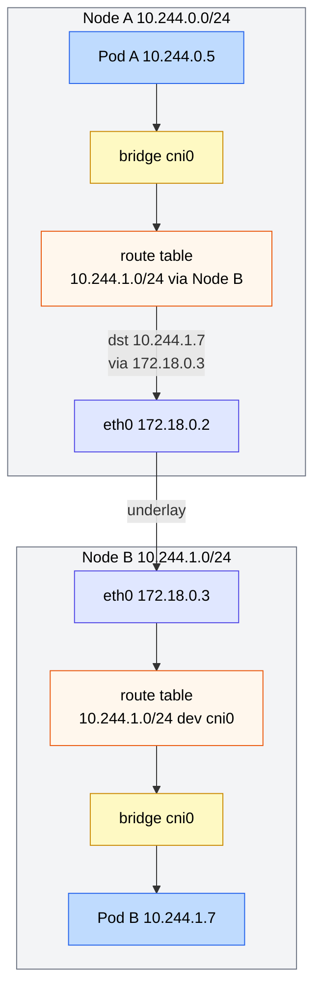
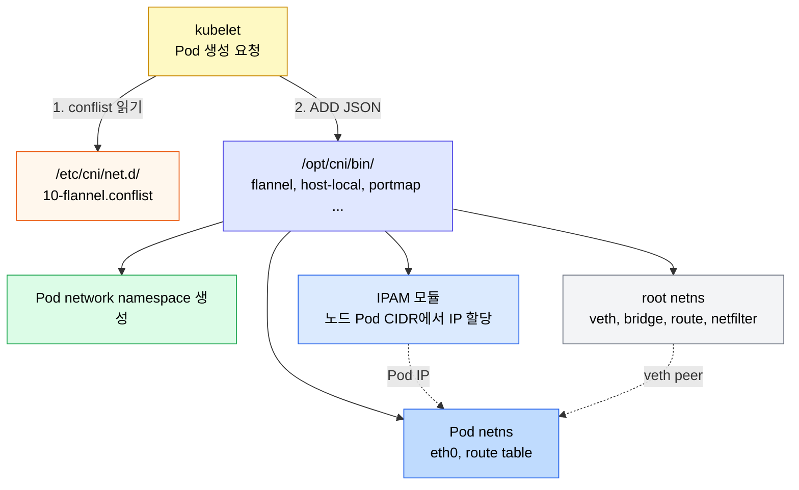
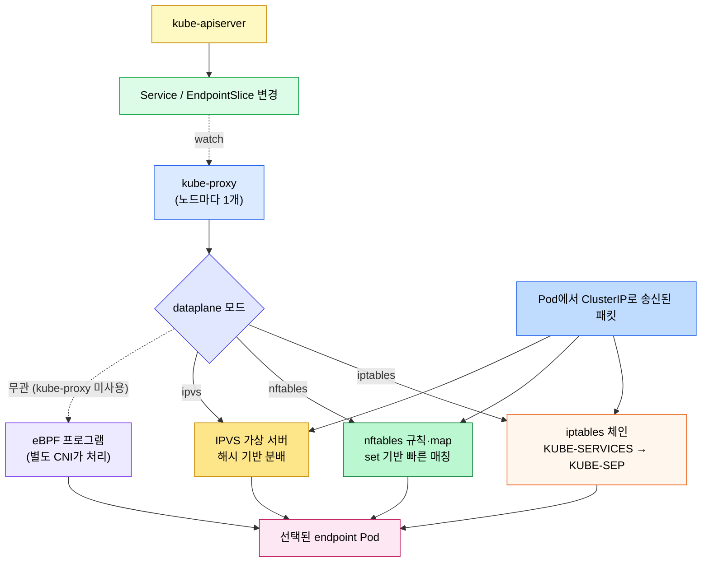
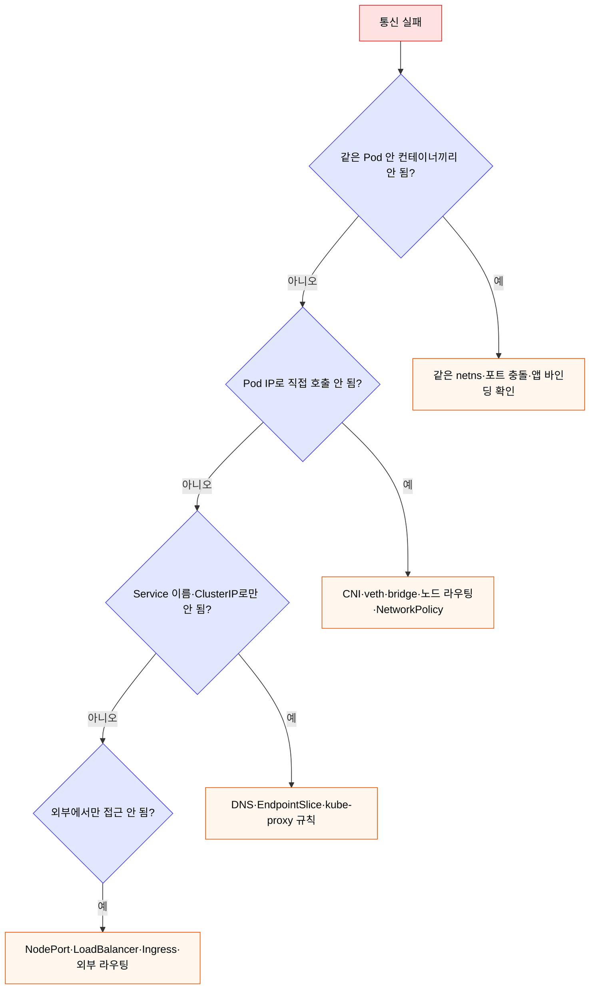

# Pod 네트워크와 Linux 기반

---
> Kubernetes 네트워킹은 새로운 기술이 아니라 Linux 네트워크 네임스페이스, veth pair, bridge, 라우팅 테이블, netfilter를 묶어 놓은 추상이다. Pause 컨테이너부터 Pod CIDR, kube-proxy의 dataplane까지 한 줄기로 따라가면 Service나 DNS 같은 상위 추상이 어디서 시작되는지 보인다.

[인터랙티브 시각화](04-02-pod-network.html)에서 같은 흐름을 노드 토폴로지 위에서 단계별로 따라갈 수 있다. 본 장은 Kubernetes 추상이 닿는 깊이까지만 다룬다. 한 단계 더 내려가 커널 자료구조·netfilter hook·conntrack까지 보고 싶으면 [02_os/networking/01-01.네트워킹 기초](../../../02_os/networking/01-01.%EB%84%A4%ED%8A%B8%EC%9B%8C%ED%82%B9%20%EA%B8%B0%EC%B4%88.md)로 넘어간다.


## 학습 목표
> Pod 네트워크의 Linux 기반 메커니즘을 보고, Service 위에서만 머무르던 디버깅 시야를 한 단계 아래로 넓힌다.

이 장에서 확인할 목표는 다음과 같다:

1. "Kubernetes는 그냥 Linux다"라는 명제가 네트워크 영역에서 무엇을 의미하는지 설명할 수 있다.
2. Pause 컨테이너가 왜 존재하는지, Pod 안 다른 컨테이너와 어떻게 네트워크 네임스페이스를 공유하는지 설명할 수 있다.
3. Pod 네트워크 네임스페이스와 root 네임스페이스를 veth pair와 bridge가 어떻게 연결하는지 그릴 수 있다.
4. Pod CIDR이 노드별로 분할되어 있을 때 노드 간 Pod 통신이 어떤 라우팅 경로를 따르는지 설명할 수 있다.
5. CNI 플러그인과 kube-proxy의 dataplane(iptables, nftables, IPVS, eBPF)이 각각 어디까지 책임지는지 구분할 수 있다.


## 1. Linux 네트워킹 스택과 Kubernetes의 관계
> Pod 네트워킹은 새로운 프로토콜이 아니라 Linux의 네임스페이스, 라우팅, netfilter를 그대로 쓴다.

노드 한 대를 떼어 놓고 보면 일반적인 Linux 서버다. 외부와 통신하는 NIC(`eth0`), 라우팅 테이블, netfilter(iptables 또는 nftables) 규칙, conntrack 연결 추적이 그대로 있다. Kubernetes는 이 위에 컨테이너용 네트워크 네임스페이스를 만들고, 그 사이를 가상 인터페이스로 잇는 자동화 계층을 얹은 것에 가깝다.

KubeCon 발표에서도 강조하듯이 Pod 네트워크 트러블슈팅은 결국 두 질문으로 좁혀진다.

1. 패킷이 어느 네임스페이스에서 어떤 인터페이스를 거쳐 어디로 가야 하는가.
2. 그 경로 위에서 netfilter가 어떤 NAT 또는 drop 규칙을 적용하는가.

두 질문은 모두 Linux 도구(`ip`, `iptables`, `nft`, `conntrack`)로 검증할 수 있다.

이 장의 모든 추상은 다음 매핑으로 환원된다:




## 2. Pause 컨테이너 — Pod의 네트워크 네임스페이스 보유자
> 노드에서 `crictl ps`나 `docker ps`를 처음 보면 정체불명의 `pause` 컨테이너가 잔뜩 있다. 이 컨테이너가 Pod의 네트워크와 IPC 네임스페이스를 붙잡아 두는 핵심 역할을 한다.

Pod는 "여러 컨테이너가 같은 네트워크와 같은 IPC를 공유한다"는 추상이다. Linux에서 이 공유는 같은 네트워크 네임스페이스에 join하는 방식으로 구현된다. 그런데 앱 컨테이너가 직접 네임스페이스를 만들면 그 컨테이너가 죽는 순간 네임스페이스도 사라진다. 사이드카가 살아 있어도 네트워크가 끊긴다는 뜻이다.

Pause 컨테이너는 이 문제를 해결하기 위해 Pod마다 가장 먼저 만들어진다. 하는 일은 단순하다. PID 1 자리에서 시그널을 받아 자식 프로세스를 reap하고, 자기 자신은 무한 sleep 상태로 남는다. 죽지 않으니 네임스페이스가 사라지지 않고, 다른 컨테이너는 이 네임스페이스에 join 하기만 하면 된다.

이 구조 덕분에 같은 Pod 안 두 컨테이너는 `localhost`로 서로를 호출할 수 있다. 동일한 네트워크 스택을 공유하므로 한쪽 컨테이너의 8080 포트는 다른 컨테이너에서도 같은 8080으로 보인다. 반대로 한 Pod 안에서 두 컨테이너가 같은 포트를 쓰려고 하면 충돌한다.

Pod 내부 구조를 그리면 다음과 같다:



확인 명령은 간단하다. 노드에 들어가 `crictl ps -a | grep pause`로 Pause 컨테이너 목록을 보고, `lsns -t net`으로 네트워크 네임스페이스가 Pod 단위로 묶여 있는 모습을 확인할 수 있다.


## 3. 네트워크 네임스페이스 — Linux 네트워크 스택의 격리된 복사본
> 네트워크 네임스페이스는 가상 머신이 아니라 Linux 커널이 제공하는 "스택 한 벌의 격리"다. 이 격리 덕분에 같은 노드 안에서도 여러 Pod가 8080 포트를 동시에 쓸 수 있다.

네트워크 네임스페이스는 이름 그대로 네트워크 자원의 이름공간이다. 인터페이스 목록, 라우팅 테이블, ARP 캐시, netfilter 룰셋, 그리고 포트 점유 상태가 네임스페이스마다 별도로 존재한다. `ip netns add demo` 한 번이면 새 네임스페이스가 만들어지고, 그 안에서는 외부 노드의 `eth0`가 보이지 않는다.

이 모델이 컨테이너 네트워크의 핵심이다. Nginx 컨테이너 5개를 같은 노드에서 띄워도 각자 다른 네임스페이스에 있으면 모두 80 포트를 점유할 수 있다. 노드의 root 네임스페이스 입장에서는 그냥 5개의 격리된 가상 인터페이스가 추가된 것일 뿐이다.

네임스페이스 안에는 보통 두 인터페이스가 있다:

- `lo`: 루프백. `localhost` 통신용
- `eth0`: 이 네임스페이스의 외부 통신용 가상 NIC. veth pair의 한쪽이 여기 붙는다

Pod 안에서 `ip addr`을 실행하면 보통 `eth0`에 `10.244.x.y/24` 같은 Pod CIDR 주소가 잡혀 있고, 라우팅 테이블에는 기본 게이트웨이가 노드의 bridge IP로 잡혀 있다. 이 시점에서 컨테이너 입장에서는 자기가 작은 Linux 호스트에 들어와 있는 것처럼 보인다.


## 4. veth pair와 Linux bridge — Pod netns와 root netns 연결
> Pod 안 `eth0`는 veth(virtual ethernet) pair의 한쪽이고, 반대쪽은 노드 root 네임스페이스의 bridge에 꽂힌다. 패킷이 두 네임스페이스를 건너가는 통로가 이 한 쌍이다.

veth pair는 양 끝이 가상 NIC인 케이블 같은 자료구조다. 한쪽으로 들어간 패킷은 곧바로 반대쪽으로 나온다. CNI 플러그인이 Pod를 만들 때 하는 핵심 작업 중 하나가 이 pair를 만들고, 한쪽을 Pod 네임스페이스로 옮기고, 반대쪽을 노드의 Linux bridge(`cni0`, `weave`, `cilium_host` 등 구현마다 이름은 다르다)에 붙이는 일이다.

Linux bridge는 노드 root 네임스페이스에 있는 가상 L2 스위치다. 같은 bridge에 꽂힌 veth들은 ARP를 통해 서로 직접 통신할 수 있다. 즉, 같은 노드의 두 Pod 사이 트래픽은 노드 NIC을 거치지 않고 bridge 안에서 끝난다. 노드 외부로 나가야 하는 트래픽만 노드의 라우팅 테이블과 `eth0`를 탄다.

같은 노드 두 Pod 사이의 패킷 흐름을 그리면 다음과 같다:



이 그림이 Pod-to-Pod 경로의 본 모습이다. Service나 DNS는 아직 등장하지 않았다. 두 Pod가 IP만 알면 bridge를 통해 그대로 닿는다.


## 5. Pod CIDR과 노드 라우팅 — 노드를 라우터로 쓰는 모델
> 클러스터에는 보통 `10.244.0.0/16` 같은 큰 Pod 네트워크가 있고, 이 공간을 노드 수만큼 `/24`로 잘라 각 노드에 분배한다. 노드 자신이 자기 /24의 라우터가 되고, 다른 노드의 /24는 자기 라우팅 테이블에 등록된 다른 노드 IP로 보낸다.

`kubectl get nodes -o yaml`을 보면 각 노드에 `spec.podCIDR`이 박혀 있다. 예를 들어 worker-1은 `10.244.0.0/24`, worker-2는 `10.244.1.0/24`, worker-3은 `10.244.2.0/24`처럼 분할된다. CNI 플러그인은 그 노드 위 Pod에게 IP를 줄 때 자기 /24 안에서만 분배하므로, IP만 보고도 어느 노드의 Pod인지 즉시 알 수 있다.

노드 간 Pod 통신은 이 분할을 이용한다. 패킷의 목적지가 자기 /24 안이면 bridge로 보내고, 다른 노드의 /24면 라우팅 테이블이 그 노드의 외부 IP로 패킷을 보낸다. KubeCon 발표가 보여 준 `ip route` 출력이 이 구조를 한눈에 드러낸다.

```text
default via 172.18.0.1 dev eth0
10.244.0.0/24 dev cni0 scope link        # 자기 노드 Pod CIDR
10.244.1.0/24 via 172.18.0.3 dev eth0    # worker-2를 통해
10.244.2.0/24 via 172.18.0.4 dev eth0    # worker-3을 통해
```

여기서 핵심은 "노드 간 라우팅을 노드 자신이 한다"는 점이다. 클라우드의 별도 라우터가 끼는 모델도 있고, VXLAN으로 오버레이하는 모델도 있고, BGP로 광고하는 모델도 있다. 어떤 구현이든 "한 노드의 라우팅 테이블이 다른 노드의 Pod CIDR을 어떻게 찾는가"가 결정된다.

노드 간 흐름을 그리면 다음과 같다:



이 모델이 깨지는 가장 흔한 사례 두 가지를 기억해 두면 디버깅이 빠르다.

1. 노드 간 underlay에서 Pod CIDR 트래픽이 막힌 경우. 클라우드 보안 그룹, 사내 방화벽, MTU 문제일 때가 많다.
2. Pod CIDR이 사내망과 겹치는 경우. Pod에서 사내 서비스 IP를 호출했는데 클러스터 내부로만 라우팅돼 사내 망에 가지 못하는 식이다.


## 6. CNI 플러그인의 실제 동작
> CNI는 표준이고, 그 표준에 따라 kubelet이 호출하는 실행 파일이 노드 위 네트워크를 만든다.

CNI(Container Network Interface)는 OCI에서 분리된 작은 표준이다. 핵심은 두 가지뿐이다.

1. 노드 위 `/etc/cni/net.d/*.conflist` 같은 설정 파일에서 사용할 플러그인 체인을 정한다.
2. kubelet이 Pod를 만들 때 이 체인의 실행 파일에 stdin으로 JSON을 넘겨 호출한다.

플러그인이 받는 명령은 `ADD`, `DEL`, `CHECK`, `VERSION`처럼 단순하다. `ADD`가 들어오면 플러그인은 다음 작업을 한다:

1. Pod 네트워크 네임스페이스에 가상 인터페이스를 만들어 넣는다 (보통 veth pair).
2. IPAM 모듈을 호출해 그 노드의 Pod CIDR에서 Pod IP를 하나 받아 인터페이스에 붙인다.
3. Pod 안 라우팅 테이블에 기본 게이트웨이(예: bridge IP)를 박는다.
4. 필요하면 노드 root 네임스페이스의 라우팅·netfilter도 손본다 (오버레이 헤더 추가 등).

이 흐름은 어떤 플러그인을 쓰든 같다. Calico는 BGP로 노드 간 라우팅을 광고하고, Flannel은 VXLAN 오버레이를 만들고, Cilium은 eBPF로 datapath를 처리한다. 구현 차이는 크지만 kubelet에서 봤을 때는 다 같은 CNI 호출이다.

kubelet과 CNI의 관계를 그리면 다음과 같다:



CNI 디버깅이 필요할 때 가장 먼저 보는 것은 다음 셋이다:

```bash
ls /etc/cni/net.d/
cat /etc/cni/net.d/10-*.conflist
journalctl -u kubelet | grep -i cni
```

플러그인 바이너리가 `/opt/cni/bin/`에 빠져 있거나, conflist의 IPAM 설정이 노드 Pod CIDR과 어긋나면 새 Pod가 `ContainerCreating`에서 멈춘다.


## 7. kube-proxy의 dataplane — iptables, nftables, IPVS, eBPF
> CNI는 Pod끼리 닿게 만들고, kube-proxy는 그 위에서 Service VIP 트래픽을 endpoint로 라우팅한다. 같은 일을 어떤 Linux 도구로 구현하느냐가 dataplane 모드 선택이다.

kube-proxy는 노드마다 떠 있는 단순한 프로세스다. API 서버를 watch해 Service와 EndpointSlice 변경을 받고, 각 노드의 netfilter 규칙을 그 변경에 맞게 갱신한다. Pod에서 ClusterIP로 보낸 패킷이 실제 Pod IP로 DNAT 되는 그 규칙이 여기서 만들어진다.

dataplane 구현 모드는 네 가지를 같은 자리에서 비교해 두면 좋다:

| 모드 | 메커니즘 | 규칙 매칭 | 노트 |
|------|----------|----------|------|
| iptables | netfilter (xtables) 규칙 체인 | O(n) 선형 | 작은 클러스터의 오랜 기본값 |
| nftables | netfilter (nft) 규칙 + map | 해시 기반 O(1) | 1.31에서 beta, 1.33 GA. iptables 대체로 권장 |
| IPVS | 커널 IP Virtual Server | 해시 기반 O(1) | 큰 클러스터에서 검증된 옵션, NodePort/NetworkPolicy는 여전히 iptables |
| eBPF | 커널 훅에서 직접 처리 | 프로그램 가능 | Cilium 등 CNI가 kube-proxy 자체를 대체할 때 사용 |

KubeCon 발표 이후 가장 큰 변화는 nftables 모드의 부상이다. iptables 모드는 Service 수가 늘면 `iptables-save | wc -l`이 수만 줄까지 커지고, 규칙 체인 선형 탐색 때문에 첫 패킷 지연이 올라간다. nftables 모드는 같은 의미를 새로운 nft 표현으로 다시 적되 map과 set 자료구조를 활용해 Service 수가 늘어도 매칭 시간을 일정하게 유지한다.

운영 판단 기준은 단순하다. 신규 클러스터라면 nftables 모드가 기본이고, 큰 클러스터에서 iptables 비용이 문제로 보였다면 nftables로 옮기는 것이 자연스러운 다음 단계다. eBPF는 단순히 "kube-proxy 모드를 바꾸는" 수준이 아니라 CNI를 통째로 바꾸는 결정이라 별도 검토가 필요하다.

kube-proxy 동작 모형은 다음과 같다:




## 8. Kubernetes 네트워킹 4규칙 정리
> KubeCon 발표는 Kubernetes 네트워크의 모든 통신 패턴을 네 가지 규칙으로 압축해 보여 준다. 디버깅 진입점 선택에 그대로 쓸 수 있다.

규칙 자체는 단순하지만, 각 규칙 뒤에 어떤 Linux 메커니즘이 깔려 있는지 같이 알면 장애 분리가 빨라진다.

| 규칙 | 통신 패턴 | Linux 기반 | 진단 진입점 |
|------|----------|-----------|------------|
| 1 | 같은 Pod 안 컨테이너 끼리 | 같은 netns + `lo` | Pod 안에서 `localhost:port` 동작 확인 |
| 2 | Pod ↔ Pod | veth + bridge + 노드 라우팅 | Pod IP 직접 ping/curl |
| 3 | Pod ↔ Service | DNS + netfilter (DNAT) + conntrack | DNS 분리 검증, EndpointSlice 확인 |
| 4 | 외부 ↔ Service | NodePort/LoadBalancer + Ingress + netfilter (SNAT/DNAT) | 노드 NIC에서 패킷 캡처, Ingress 로그 |

세 번째와 네 번째 규칙에서 처음으로 Service라는 추상이 등장한다. 그 이전(1, 2)은 모두 CNI와 Linux 자체 기능만으로 끝난다. "통신이 안 된다"고 할 때 어느 규칙에서 깨졌는지 결정하지 않으면 디버깅이 무한히 길어진다.

진단 순서를 그림으로 잡으면 다음과 같다:




## 다음 단계
> Pod 네트워크의 Linux 기반을 잡았으면, 그 위에서 Service와 DNS가 어떻게 추상을 얹는지 다시 읽으면 흐름이 다르게 보인다.

- Service VIP가 어떻게 endpoint로 풀리는지: [Service와 EndpointSlice](04-04.Service%EC%99%80%20EndpointSlice.md)
- Service 이름 해석과 CoreDNS 운영: [DNS와 CoreDNS](04-05.DNS%EC%99%80%20CoreDNS.md)
- 외부 진입과 라우팅: [Ingress와 Gateway API](04-06.Ingress%EC%99%80%20Gateway%20API.md)
- 단계별 패킷 흐름을 직접 따라가고 싶다면: [인터랙티브 시각화](04-02-pod-network.html)


## 관련 문서
> 본 장과 짝을 이루는 점검 문서, 그리고 한 단계 위 메시 계층 문서를 함께 둔다.

- [네트워킹](04-01.%EB%84%A4%ED%8A%B8%EC%9B%8C%ED%82%B9.md) — Ch04 전체 지도
- [네트워킹 점검](04-01.%EB%84%A4%ED%8A%B8%EC%9B%8C%ED%82%B9%20%EC%A0%90%EA%B2%80.md) — Pause/veth/Pod CIDR/nftables Q&A 포함
- [서비스 메시 기초](../../service-mesh/01-01.%EC%84%9C%EB%B9%84%EC%8A%A4%20%EB%A9%94%EC%8B%9C%20%EA%B8%B0%EC%B4%88.md) — 본 장 위에서 L7 정책이 추가될 때 어디가 바뀌는지
