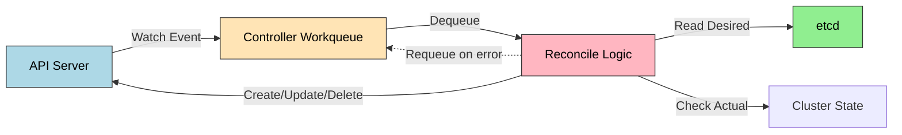

# Operator 패턴

> Operator는 CRD(Custom Resource Definition) + Custom Controller의 조합으로, 애플리케이션 운영 지식을 코드로 자동화하는 패턴이다. 선언적 API로 "원하는 상태"만 명시하면 Reconciliation Loop가 실제 상태를 자동으로 맞춰 나간다.

## 학습 목표
> Operator를 설치 자동화 이후의 운영 자동화 계층으로 이해한다.

이 장에서 확인할 목표는 다음과 같다:

1. Operator가 해결하는 문제와 기본 K8s 리소스만으로 부족한 이유를 설명할 수 있다.
2. `CRD`의 역할과 Reconciliation Loop 동작 원리를 이해할 수 있다.
3. Operator 성숙도 모델(Level 1~5)의 자동화 범위를 단계별로 구분할 수 있다.
4. Operator SDK와 Kubebuilder의 차이, OLM의 필요성을 설명할 수 있다.

## 1. 왜 Operator가 필요한가
> 설치 이후 반복되는 운영 작업을 왜 코드화해야 하는지 설명한다.

### 1.1 기본 리소스의 한계

Kubernetes는 Stateless 애플리케이션을 쉽게 관리한다. Deployment는 레플리카 수를 유지하고 Service는 로드밸런싱을 제공한다. 하지만 PostgreSQL 클러스터 같은 Stateful 애플리케이션은 다르다.

StatefulSet으로 초기 배포는 가능하지만 그 이후가 문제다. 백업은 누가 언제 실행하는가. Primary가 죽으면 누가 Standby를 승격시키는가. 버전 업그레이드 시 데이터 마이그레이션은 어떻게 처리하는가. 이 모든 작업은 운영 지식(operational knowledge)이 필요하고, 기존에는 사람이 kubectl과 스크립트로 수동 실행했다.

### 1.2 Day-1 vs Day-2 Operation

| 단계 | 작업 예시 | 기본 K8s | Operator |
|------|----------|---------|----------|
| Day-1 | 애플리케이션 배포 | 가능 | 자동화 가능 |
| Day-2 | 백업, 복구, 업그레이드, Failover | 수동 스크립트 | 자동화 |

Operator는 특히 Day-2 Operation을 자동화한다. 백업 CronJob 자동 생성, Primary 장애 시 자동 Failover, 버전 업그레이드 시 마이그레이션 Job 실행이 대표적이다.

## 2. CRD: Kubernetes API 확장
> Kubernetes API를 도메인 리소스로 확장하는 방법을 정리한다.

### 2.1 CRD란 무엇인가

Kubernetes API는 기본적으로 Pod, Service, Deployment 등을 제공한다. CRD는 이 API를 확장해 새로운 리소스 타입을 추가한다. `PostgresCluster`라는 CRD를 정의하면 `kubectl get postgrescluster`로 조회하고 `kubectl apply -f`로 생성할 수 있다.

### 2.2 CRD vs ConfigMap

| 항목 | ConfigMap | CRD |
|------|-----------|-----|
| 용도 | 설정 데이터 저장 | API 확장, 리소스 정의 |
| 스키마 검증 | 없음 | OpenAPI v3 스키마 |
| kubectl 통합 | `get configmap` | `get postgrescluster` (타입별 조회) |
| 버전 관리 | 없음 | v1, v1alpha1 등 |
| RBAC | 범용 ConfigMap 권한 | 리소스별 세밀한 권한 |

CRD는 Kubernetes API의 일급 시민(first-class citizen)이다. RBAC, 버전 관리, admission webhook 등 K8s API의 모든 기능을 사용할 수 있다.

여기서 많이 헷갈리는 점이 있다. CRD는 새로운 타입을 추가할 뿐 자동화를 보장하지 않는다. 실제 복구, 생성, 정리 로직은 Controller가 담당한다. 그래서 Operator는 "CRD만 있는 상태"가 아니라 "CRD를 해석해 desired state를 actual state로 맞추는 Controller까지 포함된 패턴"으로 보는 편이 정확하다.

## 3. Reconciliation Loop
> 원하는 상태와 실제 상태의 차이를 줄이는 핵심 반복 구조를 설명한다.

### 3.1 동작 원리

Controller는 API Server에 특정 리소스를 watch 요청한다. 리소스가 생성·수정·삭제되면 이벤트가 Workqueue에 쌓인다. Worker goroutine이 큐에서 하나씩 꺼내 Reconcile 로직을 실행한다. etcd에서 desired state를 읽고 클러스터 actual state와 비교해 차이를 해소한다.

### 3.2 핵심 특성

Reconciliation Loop는 **Level-driven**이다. "Pod가 추가되었다"(edge)가 아니라 "현재 총 몇 개인가"(level)를 확인한다. 이벤트를 놓쳐도 다음 reconcile에서 상태를 맞춘다.

**멱등성**이 핵심이다. 같은 입력에 여러 번 호출해도 결과가 같아야 한다. "Pod 1개 추가"가 아니라 "총 3개여야 함"으로 판단하는 방식이다.

에러 발생 시 exponential backoff로 재시도한다. 일시적 에러(네트워크 장애)와 영구 에러(잘못된 설정)를 구분해 영구 에러는 status에 기록하고 재시도를 중단해야 한다.

## 4. Operator 성숙도 모델
> 단순 설치 자동화부터 완전한 자가 복구까지 성숙도 단계를 구분한다.

| Level | 자동화 범위 | 예시 |
|-------|-----------|------|
| 1 Basic Install | 초기 배포 | Helm Chart를 CRD로 감싼 형태 |
| 2 Seamless Upgrades | 버전 업그레이드 + 데이터 마이그레이션 | Postgres Operator (Zalando) |
| 3 Full Lifecycle | 백업, 복원, 모니터링 자동화 | Percona XtraDB Cluster Operator |
| 4 Deep Insights | 메트릭 기반 이상 탐지 + 알림 | CockroachDB Operator |
| 5 Auto Pilot | 완전 자율 운영 (자동 Failover, 자동 스케일링) | Google Cloud SQL Operator 개념 |

대부분의 Operator는 Level 2~3에 머문다. Level 5는 예측 불가능성과 디버깅 난이도가 높아 신중하게 접근해야 한다.

## 5. 개발 프레임워크
> 직접 구현할 때 어떤 프레임워크를 고를지 판단 기준을 정리한다.

**Operator SDK**는 Red Hat이 유지 보수하며 Go, Ansible, Helm 세 가지 개발 방식을 제공한다. 기존 Ansible playbook이나 Helm Chart를 재사용하거나 OLM 통합이 필요한 경우에 적합하다.

**Kubebuilder**는 Kubernetes SIG가 유지 보수하며 Go 전용이다. 두 프레임워크 모두 Controller Runtime 라이브러리를 공유하므로 코드 구조가 거의 같다.

선택 기준은 단순하다. 기존 Ansible/Helm 자산이 많으면 Operator SDK, 순수 Go 개발이면 Kubebuilder를 선택한다. 복잡한 Day-2 로직은 반드시 Go 기반으로 작성해야 한다. Ansible과 Helm 기반 Operator는 Level 1~2에만 적합하다.

## 6. OLM(Operator Lifecycle Manager)
> Operator 배포와 업그레이드 관리를 위한 별도 계층을 짚는다.

Operator를 수동으로 설치하려면 CRD, Controller Deployment, RBAC를 파일 여러 개에 나눠 순서대로 적용해야 한다. OLM은 Subscription 리소스 하나로 이 과정을 자동화한다. 업그레이드 순서 관리, 의존성 자동 해결, 멀티 테넌트 지원이 장점이다.

Air-gapped 환경이나 자동 업그레이드를 원하지 않는 프로덕션에서는 수동 설치가 더 적합할 수 있다.

## 7. Operator가 적합한 경우
> 모든 워크로드에 Operator가 필요한 것은 아니라는 점을 경계한다.

Operator가 적합한 상황과 그렇지 않은 상황을 구분하는 것이 중요하다.

적합한 경우는 복잡한 상태 저장 애플리케이션(DB, 메시지 큐), 반복적인 운영 작업(백업, 인증서 갱신), 도메인 특화 자동화(ML 파이프라인)다.

부적합한 경우는 단순 Stateless 애플리케이션(Deployment로 충분), 일회성 작업(Job/CronJob), 운영 로직이 없는 단순 배포다. 이런 경우 Operator를 만드는 것은 과잉 설계다.

## 관련 문서
> Helm 다음 단계와 실제 Operator 사례 장들로 이어 준다.

- [Operator 패턴 점검](03-05.Operator%20%ED%8C%A8%ED%84%B4%20%EC%A0%90%EA%B2%80.md) — 본 장의 점검 편, OperatorHub 탐색과 ServiceMonitor 실습
- [Helm 고급](03-02.Helm%20%EA%B3%A0%EA%B8%89.md) — 이전 장, 차트 개발과 템플릿 설계
- [MySQL Operator](03-06.MySQL%20Operator.md) — 다음 절, MySQL HA 자동화
