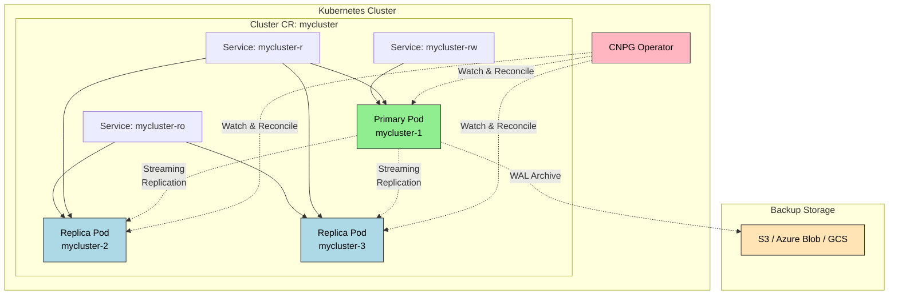

# PostgreSQL Operator

> CloudNativePG(CNPG)는 PostgreSQL을 K8s 위에서 선언적으로 관리하는 Operator로, CNCF Sandbox 프로젝트입니다. Streaming Replication으로 Primary와 Replica를 동기화하고, 자동 페일오버로 고가용성을 보장하며, Barman 기반 백업과 WAL 아카이빙으로 PITR을 지원합니다.


## 학습 목표
> PostgreSQL 운영 지식이 Operator에 어떻게 캡슐화되는지 보는 장입니다.

이 장에서 확인할 목표는 다음과 같다:

1. PostgreSQL Operator 선택지(CloudNativePG, Zalando, CrunchyData)를 비교하고 선택 기준을 세울 수 있습니다.
2. CloudNativePG의 아키텍처(Primary/Replica, Streaming Replication, 자동 페일오버)를 이해할 수 있습니다.
3. `Cluster` CR로 PostgreSQL 클러스터를 선언적으로 정의하고 배포할 수 있습니다.
4. Primary Pod 삭제 시 Replica 승격과 자동 페일오버를 운영 관점에서 해석할 수 있습니다.
5. Barman 기반 백업과 WAL 아카이빙으로 PITR을 구현하는 흐름을 설명할 수 있습니다.
6. Prometheus 메트릭으로 PostgreSQL을 모니터링하는 방법을 정리할 수 있습니다.


## 1. PostgreSQL Operator 선택지 비교
> PostgreSQL Operator 생태계에서 어떤 선택지가 있고 무엇이 갈리는지 먼저 봅니다.

K8s 위에서 PostgreSQL을 운영하려면 Replication 설정, 페일오버, 백업 관리의 복잡도 때문에 Operator가 사실상 필수입니다. 2025년 현재 주요 Operator는 세 가지입니다.

**CloudNativePG(CNPG)** 는 EDB(EnterpriseDB)가 개발하고 CNCF Sandbox 프로젝트로 승격된 경량 Operator다. Go로 작성된 단일 바이너리로 외부 의존성이 없고, Barman을 내장하여 백업과 WAL 아카이빙을 자동화합니다. 2023년 CNCF에 편입된 이후 릴리스 주기가 빠르고 커뮤니티가 성장하고 있습니다.

**Zalando Postgres Operator** 는 Zalando가 내부용으로 개발하고 공개한 Operator다. 수년간 프로덕션에서 검증되었고 대규모 배포 사례가 많습니다. Patroni를 기반으로 하여 복잡한 HA 시나리오에 강하지만, etcd 같은 추가 컴포넌트가 필요하여 아키텍처가 복잡합니다.

**Crunchy Data PGO** 는 PostgreSQL 전문 회사 Crunchy Data가 개발한 Operator다. 고급 모니터링, 감사 로그, 암호화 같은 엔터프라이즈 기능이 강력하고 상업 지원을 받을 수 있지만, 학습 곡선이 가파릅니다.

이 장에서는 CloudNativePG를 선택합니다. CNCF 프로젝트라 벤더 중립적이고, 설치와 설정이 간단하며, 최신 PostgreSQL 버전을 빠르게 지원합니다.

| 항목 | CloudNativePG | Zalando | Crunchy PGO |
|------|---------------|---------|-------------|
| 설치 복잡도 | 낮음 (kubectl apply) | 중간 (Patroni 필요) | 높음 |
| 의존성 | 없음 | etcd/Consul | pgBackRest |
| 백업 도구 | Barman | WAL-G | pgBackRest |
| CNCF 프로젝트 | Yes (Sandbox) | No | No |
| 권장 사용처 | 새 프로젝트, 간결함 우선 | 대규모 검증된 환경 | 엔터프라이즈 요구사항 |


## 2. CloudNativePG 소개
> 현재 문서의 기준 도구인 CloudNativePG의 설계 방향을 정리합니다.

CNPG는 "PostgreSQL을 K8s의 일급 시민(First-Class Citizen)으로 만들자"는 철학으로 설계되었습니다. 전통적인 Operator들이 PostgreSQL을 "K8s 위에 올린 VM"처럼 다루는 반면, CNPG는 "K8s 네이티브 리소스"로 다룹니다.

Cluster CR 하나로 PostgreSQL 클러스터의 모든 설정을 정의하고, Operator가 감시하면서 Primary 장애 시 Replica를 자동 승격시키고, WAL을 자동 아카이빙하며, 백업을 자동 실행합니다. 복잡한 외부 도구 없이 PostgreSQL 자체 기능(Streaming Replication, Physical Replication Slots)을 최대한 활용합니다.



Operator가 Pod를 직접 관리한다는 점이 중요합니다. StatefulSet이 아닌 개별 Pod들을 Operator가 직접 생성하고 관리합니다. WAL은 S3 같은 외부 스토리지에 아카이빙됩니다.


## 3. 아키텍처 상세
> 인스턴스 역할과 복제 흐름이 어떻게 구성되는지 봅니다.

### 3.1 Streaming Replication

PostgreSQL의 Streaming Replication은 WAL(Write-Ahead Log)을 실시간으로 전송하는 방식입니다. Primary에서 트랜잭션이 커밋되면 WAL 레코드가 디스크에 쓰이고, Replica로 스트리밍되어 Replica가 자신의 데이터베이스에 적용합니다.

비동기(async) 모드에서는 Primary가 Replica의 확인을 기다리지 않고 커밋합니다. 빠르지만 Primary가 죽으면 일부 데이터가 손실될 수 있습니다. 동기(sync) 모드에서는 Primary가 최소 N개 Replica가 WAL을 받았음을 확인한 후 커밋합니다. CNPG는 기본값으로 비동기를 사용하지만 `synchronous_standby_names` 설정으로 동기 모드를 활성화할 수 있습니다.

### 3.2 자동 페일오버

Primary Pod가 죽으면 CNPG Operator가 즉시 감지하고 Replica 중 하나를 새 Primary로 승격시킵니다.

승격 과정은 다음과 같이 진행됩니다. Operator가 Primary Pod를 주기적으로 체크하다가 응답이 없으면 장애로 판단합니다. Replica 중 LSN(Log Sequence Number)이 가장 앞선 것을 선택한 뒤 `pg_ctl promote` 명령을 실행합니다. 선택된 Replica가 Primary로 승격되면 나머지 Replica들은 새 Primary를 따라가도록 재설정되고, `-rw` Service의 엔드포인트가 새 Primary로 업데이트됩니다. 이 과정은 보통 10~30초 안에 완료됩니다.

PostgreSQL은 페일오버마다 새로운 Timeline을 시작합니다. 이전 Primary가 복구되어 돌아오면 자신의 Timeline이 구버전임을 알고 새 Primary의 Timeline을 따라갑니다. 이렇게 스플릿 브레인을 방지합니다.

### 3.3 세 가지 Service

CNPG는 Cluster CR마다 세 가지 Service를 자동 생성합니다.

| Service | Selector | 용도 |
|---------|----------|------|
| `{cluster}-rw` | Primary만 | 쓰기 트랜잭션. 항상 Primary로 연결 |
| `{cluster}-ro` | Replica만 | 읽기 전용. Replica로만 분산 |
| `{cluster}-r` | Primary + Replica | 읽기. Primary와 Replica 모두 포함 |

`-ro`는 Replica에만 연결하므로 Primary의 쓰기 부하에 영향을 받지 않습니다. 대시보드나 분석 쿼리 같은 무거운 읽기에 적합합니다. `-r`은 Primary도 포함하므로 Replica가 부족할 때 Primary가 읽기도 처리합니다. 대부분의 애플리케이션은 `-rw`(쓰기)와 `-ro`(읽기)를 사용합니다.

### 3.4 Replication Slots

CNPG는 Physical Replication Slots을 사용하여 Primary가 Replica가 아직 받지 않은 WAL을 삭제하지 않도록 합니다. Replica가 일시적으로 중단되어도 복구가 가능하지만, Replica가 오래 중단되면 Primary 디스크가 WAL로 가득 찰 수 있어 CNPG가 이를 모니터링하여 알림을 보냅니다.


## 4. Operator 설치
> 운영 기능을 쓰기 위한 초기 설치 경로를 간단히 정리합니다.

```bash
# 설치 경로는 릴리스가 자주 바뀌므로
# 공식 설치 문서에서 현재 지원 릴리스 버전을 확인한 뒤 적용하는 편이 안전하다.
kubectl apply -f \
  https://raw.githubusercontent.com/cloudnative-pg/cloudnative-pg/release-<CURRENT_RELEASE>/releases/cnpg-<CURRENT_RELEASE>.yaml

# 설치 확인
kubectl get deployment -n cnpg-system cnpg-controller-manager
kubectl get crd | grep postgresql
```

CRD가 4개 생성된다: Cluster, Backup, ScheduledBackup, Pooler.

현재 문서에서 중요한 운영 포인트는 "설치 YAML 버전을 문서에 박아두지 않는다"는 점입니다. CloudNativePG는 릴리스 주기가 빠른 편이라 학습 문서에는 설치 방식과 확인 포인트를 남기고, 실제 버전 문자열은 공식 문서에서 확인하는 흐름이 더 안전합니다.


## 5. Cluster CR 정의
> PostgreSQL 클러스터를 선언형으로 표현하는 주요 필드를 살핍니다.

### 5.1 최소 설정

```yaml
apiVersion: postgresql.cnpg.io/v1
kind: Cluster
metadata:
  name: mycluster
  namespace: default
spec:
  instances: 3
  storage:
    size: 5Gi
```

이것만으로도 3개 인스턴스(Primary 1 + Replica 2) 클러스터가 생성됩니다.

### 5.2 주요 필드

| 필드 | 설명 | 기본값 |
|------|------|--------|
| `instances` | PostgreSQL 인스턴스 개수 | 1 |
| `postgresql.parameters` | postgresql.conf 설정 | 기본 설정 |
| `bootstrap.initdb` | 초기 DB 생성. database, owner, 비밀번호 지정 | postgres/postgres |
| `storage.size` | PVC 크기 | 필수 |
| `storage.storageClass` | StorageClass 이름 | 클러스터 기본값 |
| `backup.barmanObjectStore` | Barman 백업 대상 (S3, Azure Blob, GCS) | — |
| `backup.retentionPolicy` | 백업 보관 기간 (예: 30d, 7d) | — |
| `monitoring.enablePodMonitor` | Prometheus PodMonitor 생성 여부 | false |

### 5.3 상태 확인

```bash
kubectl get cluster mycluster
# NAME        AGE   INSTANCES   READY   STATUS                     PRIMARY
# mycluster   2m    3           3       Cluster in healthy state   mycluster-1
```

`READY` 컬럼이 `3`이고 `STATUS`가 `Cluster in healthy state`면 성공입니다.


## 6. 페일오버 테스트
> 장애 시 승격과 서비스 전환이 어떻게 일어나는지 확인합니다.

### 6.1 현재 Primary 확인

```bash
kubectl get cluster mycluster -o jsonpath='{.status.currentPrimary}'
# mycluster-1
```

### 6.2 Primary Pod 삭제

```bash
kubectl delete pod mycluster-1
```

CloudNativePG의 강점은 복제만이 아니라 복구 경로까지 함께 설계된다는 점입니다. 공식 문서 기준으로 base backup과 WAL archiving을 함께 운용해 PITR을 지원하므로, 단순 고가용성 클러스터를 넘어서 운영 복구 전략까지 Operator 안에서 일관되게 가져갈 수 있습니다.

### 6.3 새 Primary 확인 (30초 후)

```bash
kubectl get cluster mycluster -o jsonpath='{.status.currentPrimary}'
# mycluster-2

kubectl exec -it mycluster-2 -- psql -U postgres -c \
  "SELECT client_addr, state, sync_state FROM pg_stat_replication;"
# client_addr | state     | sync_state
# 10.244.0.10 | streaming | async
# 10.244.0.11 | streaming | async
```

`mycluster-1`이 재생성되어 이번에는 Replica로 합류합니다. 애플리케이션이 `-rw` Service로 연결되어 있다면 Primary Pod 삭제 후 10~30초 동안 쓰기가 실패하고, 새 Primary가 승격되면 Service 엔드포인트가 자동 업데이트되어 재연결됩니다.


## 7. 백업 (Barman 기반)
> PostgreSQL 백업과 복원 전략을 장기 보관 관점에서 다룹니다.

### 7.1 WAL 아카이빙

WAL을 아카이빙하면 특정 시점으로 복원(PITR)이 가능합니다. Primary에서 생성된 WAL 파일을 자동으로 S3에 업로드합니다.

```yaml
spec:
  backup:
    barmanObjectStore:
      destinationPath: s3://my-backup-bucket/mycluster
      s3Credentials:
        accessKeyId:
          name: s3-credentials
          key: ACCESS_KEY_ID
        secretAccessKey:
          name: s3-credentials
          key: SECRET_ACCESS_KEY
      wal:
        compression: gzip
        maxParallel: 2
    retentionPolicy: "30d"
```

### 7.2 On-Demand 백업

```yaml
apiVersion: postgresql.cnpg.io/v1
kind: Backup
metadata:
  name: mycluster-backup-20260213
spec:
  cluster:
    name: mycluster
```

### 7.3 PITR 복원

```yaml
apiVersion: postgresql.cnpg.io/v1
kind: Cluster
metadata:
  name: mycluster-restored
spec:
  instances: 3
  bootstrap:
    recovery:
      source: mycluster
      recoveryTarget:
        targetTime: "2026-02-13 14:30:00+00:00"
  externalClusters:
    - name: mycluster
      barmanObjectStore:
        destinationPath: s3://my-backup-bucket/mycluster
        s3Credentials:
          accessKeyId:
            name: s3-credentials
            key: ACCESS_KEY_ID
          secretAccessKey:
            name: s3-credentials
            key: SECRET_ACCESS_KEY
  storage:
    size: 10Gi
```

Operator가 Base Backup을 다운로드하고 WAL을 재생하여 지정된 시점까지 복원합니다. 복원된 클러스터는 원본 클러스터와 독립적으로 동작합니다.


## 8. 모니터링
> PostgreSQL 운영 상태를 어떤 지표로 읽을지 정리합니다.

`monitoring.enablePodMonitor: true`로 설정하면 Operator가 자동으로 PodMonitor 리소스를 생성하고, Prometheus가 설치되어 있으면 자동으로 메트릭을 수집합니다.

주요 메트릭은 다음과 같습니다.

| 메트릭 | 설명 |
|--------|------|
| `cnpg_pg_stat_replication_lag_bytes` | Replica의 복제 지연 |
| `cnpg_pg_database_size_bytes` | 데이터베이스 크기 |
| `cnpg_pg_stat_database_xact_commit` | 커밋된 트랜잭션 수 |
| `cnpg_pg_stat_database_blks_hit` | 캐시 히트 수 |
| `cnpg_pg_stat_activity_count` | 활성 연결 수 |

CNPG 공식 Grafana 대시보드 ID는 `20417`입니다.


## 9. MySQL Operator와 비교
> 두 데이터베이스 Operator가 같은 문제를 어디서 다르게 푸는지 비교합니다.

| 항목 | MySQL Operator | CloudNativePG |
|------|----------------|---------------|
| 복제 방식 | Group Replication (Paxos 기반) | Streaming Replication (WAL 전송) |
| 페일오버 시간 | 5~10초 | 10~30초 |
| 백업 도구 | mysqldump / Clone Plugin | Barman (WAL 기반) |
| PITR | 제한적 | 완전 지원 (WAL 재생) |
| Router | MySQL Router (별도 Deployment) | Service로 충분 |
| 동기 복제 | 기본 지원 (Quorum 기반) | 선택적 (synchronous_standby_names) |


## 10. 정리
> PostgreSQL Operator 학습에서 가져가야 할 운영 판단만 짧게 묶습니다.

CloudNativePG는 PostgreSQL을 K8s 위에서 간단하게 운영할 수 있도록 설계된 경량 Operator다. Streaming Replication으로 데이터를 동기화하고, 자동 페일오버로 고가용성을 보장하며, Barman 기반 백업으로 PITR을 지원합니다.

핵심 개념 체크리스트:

- CNPG는 CNCF Sandbox 프로젝트로 K8s 네이티브 설계를 따릅니다
- Primary 1개 + Replica N개 구성, Streaming Replication으로 동기화
- 세 가지 Service: `-rw`(Primary), `-ro`(Replica), `-r`(Primary+Replica)
- Primary 장애 시 Operator가 10~30초 내에 Replica를 승격시킵니다
- Barman으로 WAL을 S3에 자동 아카이빙하고 PITR을 지원합니다
- `postgresql.parameters`로 postgresql.conf를 CR에서 관리합니다
- Superuser(postgres)와 App User를 분리하여 권한을 최소화합니다


## 관련 문서
> 앞선 MySQL 장, 다음 Redis 장, 점검 문서를 함께 둡니다.

- [PostgreSQL Operator 점검](03-07.PostgreSQL%20Operator%20%EC%A0%90%EA%B2%80.md) — 본 장의 점검 편
- [MySQL Operator](03-06.MySQL%20Operator.md) — 이전 절, InnoDB Cluster 기반 HA
- [Redis Operator](03-08.Redis%20Operator.md) — 다음 절, Sentinel/Cluster 모드
