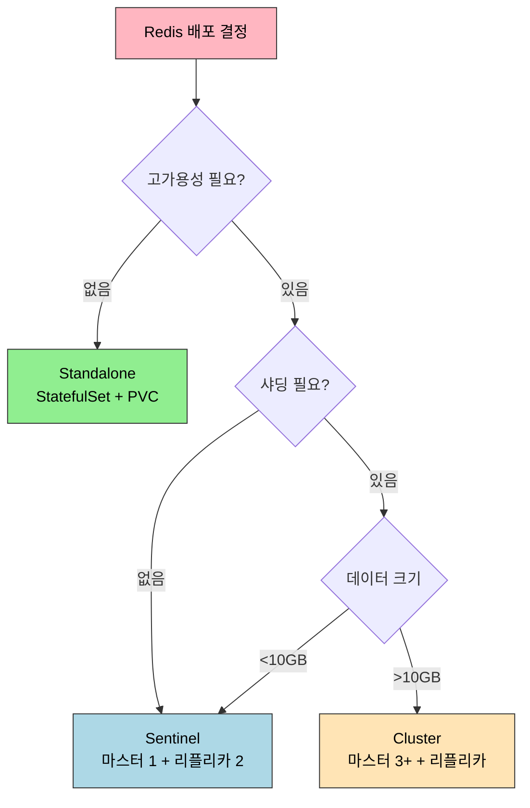

# Redis Operator

> Redis Operator는 Redis Cluster/Sentinel을 Kubernetes 네이티브 방식으로 관리하는 도구다. Standalone 배포는 StatefulSet만으로 가능하지만, 프로덕션 고가용성 환경에서는 Sentinel(마스터 1개 + 자동 페일오버) 또는 Cluster(샤딩 + 고가용성)가 필요하다. OpsTree Redis Operator는 CR로 Redis 인스턴스를 선언하면 Pod, Service, ConfigMap을 자동으로 생성하고 장애 발생 시 페일오버를 처리한다.


## 학습 목표
> Redis 배포 모드와 Operator 관리 방식을 함께 이해하는 장이다.

이 장에서 확인할 목표는 다음과 같다:

1. Redis Standalone, Sentinel, Cluster 모드의 차이를 설명할 수 있다.
2. OpsTree Redis Operator를 Helm으로 설치하고 Redis Sentinel CR을 배포할 수 있다.
3. Redis 마스터 Pod를 삭제했을 때 Sentinel이 자동으로 페일오버하는 과정을 해석할 수 있다.
4. Redis Cluster CR을 정의하고 해시 슬롯 분배를 이해할 수 있다.
5. 클라이언트에서 Sentinel discovery 또는 Cluster 모드로 연결하는 방법을 설명할 수 있다.


## 1. 왜 Redis를 Kubernetes에 올리는가
> 캐시와 세션 저장소로서 Redis를 K8s 위에 올릴 때 기대와 제약을 먼저 본다.

Redis는 캐시, 세션 스토어, Pub/Sub, Rate Limiting 등 다양한 용도로 사용된다. Kubernetes 환경에서 올리면 애플리케이션 Pod와 동일한 네임스페이스에서 네트워크 정책, Secret, ConfigMap을 일관되게 관리할 수 있다. Pod의 CPU/메모리 제한과 QoS로 멀티테넌시 환경에서 인스턴스를 안전하게 격리하고, Helm Chart로 설치하면 환경 간 설정 차이를 최소화할 수 있다.

다만 고려사항이 있다. AOF/RDB 백업을 사용하면 PersistentVolume이 필요하고, Pod 네트워크를 거쳐 약간의 레이턴시가 추가된다. Sentinel/Cluster 모드는 여러 Pod를 조율해야 하므로 Standalone보다 설정이 복잡하다.


## 2. Redis 배포 모드 비교
> Sentinel과 Cluster가 해결하는 문제가 어떻게 다른지 구분한다.

| 모드 | 구조 | 고가용성 | 샤딩 | 사용 사례 |
|------|------|---------|------|----------|
| Standalone | 단일 인스턴스 | 없음 | 없음 | 개발 환경, 간단한 캐시 |
| Sentinel | 마스터 1 + 리플리카 N + Sentinel 3 | 자동 페일오버 | 없음 | 세션 스토어, 중소규모 캐시 |
| Cluster | 마스터 3+ + 리플리카 N | 샤드별 페일오버 | 16384 슬롯 | 대규모 캐시, 샤딩 필요 |



**Sentinel** 모드는 마스터 1개 + 리플리카 N개 + Sentinel 3개로 구성된다. Sentinel이 마스터를 모니터링하고 장애 시 리플리카를 마스터로 승격시킨다. 데이터는 단일 마스터에 집중되므로 샤딩은 불가능하다.

**Cluster** 모드는 최소 마스터 3개가 필요하고 각 마스터는 16384개 슬롯 중 일부를 담당한다. 클라이언트는 키의 해시를 계산하여 해당 슬롯을 담당하는 마스터에 요청을 보낸다. 멀티키 연산(MGET, 트랜잭션)이 제한되고 클라이언트가 Cluster 프로토콜을 지원해야 한다.


## 3. OpsTree Redis Operator 선택 이유
> 현재 문서가 이 Operator를 기준으로 삼는 이유를 정리한다.

Kubernetes에서 Redis를 운영하는 방법은 Bitnami Helm Chart, Spotahome Redis Operator, OpsTree Redis Operator 세 가지가 있다. Bitnami Helm Chart는 Day-2 Operation이 수동이고, Spotahome은 Sentinel 모드만 지원하며 업데이트가 적다.

OpsTree Redis Operator를 선택한다. CR 기반 선언적 관리로 `kind: Redis` CR만 작성하면 StatefulSet, Service, ConfigMap이 자동 생성된다. Sentinel/Cluster 모두 지원하고 장애 복구를 자동화하며, GitHub 2k+ stars로 활발히 유지보수된다.

다만 Redis는 데이터 성격에 따라 판단이 달라진다. 캐시라면 빠른 복구와 단순성이 더 중요하고, 영속 데이터를 담는다면 AOF/RDB, PVC 성능, 네트워크 지연을 더 엄격하게 봐야 한다. Operator는 페일오버를 자동화하지만 데이터 손실 허용 범위를 대신 결정해 주지는 않는다.


## 4. OpsTree Redis Operator 설치
> 선언형 운영을 위한 설치 단계와 핵심 구성 요소를 본다.

```bash
helm repo add ot-helm https://ot-container-kit.github.io/helm-charts/
helm repo update

kubectl create namespace redis-operator
helm install redis-operator ot-helm/redis-operator \
  --namespace redis-operator \
  --set redisOperator.replicas=1
```

CRD가 세 개 생성된다: `redis.redis.redis.opstreelabs.in`, `redisclusters.redis.redis.opstreelabs.in`, `redisreplications.redis.redis.opstreelabs.in`.


## 5. Redis Sentinel CR 배포
> Sentinel 모드에서 primary/replica와 감시 구성이 어떻게 표현되는지 설명한다.

### 5.1 Secret 생성

```bash
kubectl create secret generic redis-secret \
  --from-literal=password=my-redis-password \
  --namespace default
```

### 5.2 CR 정의

```yaml
apiVersion: redis.redis.opstreelabs.in/v1beta2
kind: Redis
metadata:
  name: redis-sentinel
  namespace: default
spec:
  kubernetesConfig:
    image: quay.io/opstree/redis:v7.0.12
    imagePullPolicy: IfNotPresent
    resources:
      requests:
        cpu: 100m
        memory: 128Mi
      limits:
        cpu: 200m
        memory: 256Mi
    redisSecret:
      name: redis-secret
      key: password
  storage:
    volumeClaimTemplate:
      spec:
        accessModes: ["ReadWriteOnce"]
        resources:
          requests:
            storage: 1Gi
  redisExporter:
    enabled: true
    image: quay.io/opstree/redis-exporter:v1.44.0
  redisConfig:
    additionalRedisConfig: |
      maxmemory 200mb
      maxmemory-policy allkeys-lru
  redisSentinel:
    enabled: true
    replicas: 3
    quorum: 2
    sentinelConfig:
      downAfterMilliseconds: 30000
      failoverTimeout: 180000
      parallelSyncs: 1
```

`redisSentinel.quorum: 2`는 Sentinel 2개 이상이 동의해야 페일오버를 시작한다는 의미다. `downAfterMilliseconds: 30000`은 마스터가 30초 응답 없으면 장애로 판단한다.

### 5.3 생성된 리소스

Operator가 다음을 생성한다.

- **StatefulSet** `redis-sentinel`: 마스터 1 + 리플리카 2 (총 3 Pod)
- **Deployment** `redis-sentinel-sentinel`: Sentinel 3 Pod
- **Service** `redis-sentinel`: 마스터 Service (6379 포트)
- **Service** `redis-sentinel-sentinel`: Sentinel Service (26379 포트)
- **Service** `redis-sentinel-additional`: 헤드리스 Service (Pod discovery)

각 Redis Pod는 redis 컨테이너(6379)와 redis-exporter 컨테이너(9121) 두 개를 실행한다.


## 6. Redis Cluster CR 배포
> 슬롯 기반 분산 구성이 선언형 CR로 어떻게 관리되는지 본다.

```yaml
apiVersion: redis.redis.opstreelabs.in/v1beta2
kind: RedisCluster
metadata:
  name: redis-cluster
  namespace: default
spec:
  clusterSize: 3
  clusterReplicas: 1
  kubernetesConfig:
    image: quay.io/opstree/redis:v7.0.12
    resources:
      requests:
        cpu: 100m
        memory: 128Mi
      limits:
        cpu: 200m
        memory: 256Mi
    redisSecret:
      name: redis-secret
      key: password
  storage:
    volumeClaimTemplate:
      spec:
        accessModes: ["ReadWriteOnce"]
        resources:
          requests:
            storage: 1Gi
```

`clusterSize: 3`은 마스터 3개를, `clusterReplicas: 1`은 마스터당 리플리카 1개를 의미한다. 총 6 Pod(마스터 3 + 리플리카 3)가 생성된다.

Operator가 자동으로 `redis-cli --cluster create`를 실행하여 슬롯을 초기화한다. 마스터 3개가 각각 5461, 5462, 5461 슬롯을 담당한다.

해시 슬롯 동작 원리는 이렇다. Redis Cluster는 키를 CRC16 해시로 변환하고 16384로 나눈 나머지를 슬롯 번호로 사용한다. 클라이언트는 첫 요청 시 `CLUSTER SLOTS` 명령으로 슬롯 매핑을 받아오고, 잘못된 노드에 요청하면 `-MOVED 12345 redis-cluster-leader-2:6379` 응답으로 리다이렉트된다.


## 7. 클라이언트 연결
> Redis 배포 모드별로 애플리케이션 연결 전략이 어떻게 달라지는지 정리한다.

### 7.1 Sentinel 모드 (Go 예시)

```go
client := redis.NewFailoverClient(&redis.FailoverOptions{
    MasterName:    "mymaster",
    SentinelAddrs: []string{
        "redis-sentinel-sentinel.default.svc.cluster.local:26379",
    },
    Password: "my-redis-password",
})
```

클라이언트가 Sentinel에게 `SENTINEL get-master-addr-by-name mymaster`를 요청하면 현재 마스터 주소가 반환된다. 마스터가 죽으면 Sentinel이 페일오버를 수행하고 클라이언트가 자동으로 새 마스터를 발견한다.

### 7.2 Cluster 모드 (Go 예시)

```go
client := redis.NewClusterClient(&redis.ClusterOptions{
    Addrs: []string{
        "redis-cluster-leader-0.redis-cluster-leader-headless.default.svc.cluster.local:6379",
        "redis-cluster-leader-1.redis-cluster-leader-headless.default.svc.cluster.local:6379",
        "redis-cluster-leader-2.redis-cluster-leader-headless.default.svc.cluster.local:6379",
    },
    Password: "my-redis-password",
})
```

Sentinel/Cluster 모드에서 클라이언트가 특정 마스터에 연결해야 하므로 Headless Service DNS 이름을 사용한다.


## 8. 장애 테스트: Sentinel 자동 페일오버
> 장애 시 Sentinel 기반 승격이 실제로 어떻게 일어나는지 확인한다.

```bash
# 현재 마스터 확인
kubectl exec -it redis-sentinel-sentinel-<pod> -- redis-cli -p 26379 \
  sentinel master mymaster | grep -E "^(name|ip|port)"
# redis-sentinel-0이 마스터

# 마스터 Pod 삭제
kubectl delete pod redis-sentinel-0

# Sentinel 로그 관찰
kubectl logs redis-sentinel-sentinel-<pod> -f
```

페일오버 로그에서 다음 이벤트가 순서대로 나타난다.

```
+sdown master mymaster redis-sentinel-0... 6379
+odown master mymaster ...  #quorum 2/2
+failover-triggered master mymaster ...
+selected-slave slave redis-sentinel-1...
+failover-state-send-slaveof-noone slave redis-sentinel-1...
+promoted-slave slave redis-sentinel-1...
+slave-reconf-sent slave redis-sentinel-2...
+failover-end master mymaster ...
+switch-master mymaster redis-sentinel-0... redis-sentinel-1...
```

`+sdown`은 단일 Sentinel의 주관적 판단이고, `+odown`은 quorum 충족 후 객관적 장애 확정이다. `+switch-master`에서 마스터가 `redis-sentinel-1`으로 변경되었음을 알린다.

StatefulSet이 `redis-sentinel-0`을 자동으로 재생성하고, 이 Pod는 새 마스터(`redis-sentinel-1`)의 리플리카로 합류한다.


## 9. minikube 고려사항
> 학습 환경과 운영 환경 사이의 차이를 명확히 구분한다.

minikube에서는 Sentinel 모드를 권장한다. Cluster 모드와 Pod 수는 비슷하지만 Sentinel이 더 가볍고, 클라이언트 라이브러리가 Sentinel discovery를 더 잘 지원하며, 개발 환경에서는 샤딩이 필요 없다.

리소스가 부족하면 Redis Pod의 제한을 줄인다.

```yaml
resources:
  requests:
    cpu: 50m
    memory: 64Mi
  limits:
    cpu: 100m
    memory: 128Mi
```

Redis Exporter를 비활성화(`redisExporter.enabled: false`)하면 각 Redis Pod가 단일 컨테이너만 실행하여 메모리 사용량이 50% 감소한다. PVC를 프로비저닝할 수 없는 환경에서는 `emptyDir`로 대체하되 Pod 재시작 시 데이터가 사라진다는 점을 감수해야 한다.


## 10. 정리
> Redis Operator 학습에서 가져가야 할 핵심 판단만 짧게 묶는다.

핵심 개념 체크리스트:

- Redis 배포 모드: Standalone(개발), Sentinel(자동 페일오버), Cluster(샤딩 + 고가용성)
- OpsTree Redis Operator: CR 기반 선언적 관리, Sentinel/Cluster 모두 지원
- Sentinel 모드: 마스터 1 + 리플리카 2 + Sentinel 3. quorum 충족 시 페일오버
- Cluster 모드: 마스터 3 + 리플리카 3. 16384 슬롯을 마스터가 분담
- 클라이언트 연결: Sentinel discovery(26379) 또는 Cluster slots(6379)
- minikube: Sentinel 모드 추천, 리소스 제한 완화, Ephemeral storage 가능


## 관련 문서
> 앞선 PostgreSQL 장, 다음 Kafka 장, 점검 문서를 함께 둔다.

- [Redis Operator 점검](03-08.Redis%20Operator%20%EC%A0%90%EA%B2%80.md) — 본 장의 점검 편
- [PostgreSQL Operator](03-07.PostgreSQL%20Operator.md) — 이전 절
- [Kafka Operator](03-09.Kafka%20Operator.md) — 다음 절, Strimzi 기반 Kafka 운영
