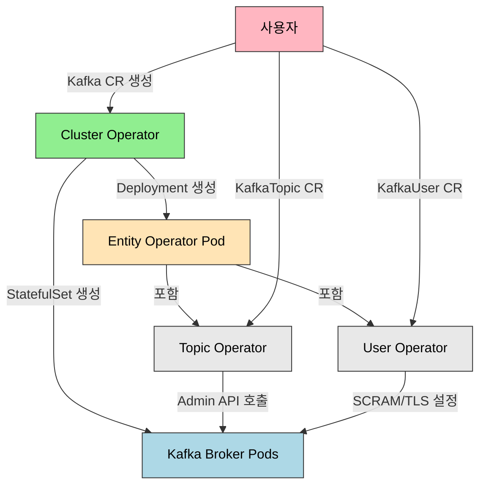

# Kafka Operator

> Strimzi는 Kafka를 Kubernetes 네이티브 방식으로 운영하는 CNCF Sandbox 프로젝트입니다. Kafka CR로 브로커 수, 리스너, 스토리지, 리소스를 선언하면 Cluster Operator가 StatefulSet, Service, ConfigMap을 자동 생성합니다. Kafka 4.0부터 기본이 될 KRaft 모드는 ZooKeeper를 제거하고 Kafka 자체가 Raft 프로토콜로 메타데이터를 관리하여 아키텍처를 단순화합니다.


## 학습 목표
> Kafka 운영 지식을 Strimzi가 어떤 리소스로 추상화하는지 이해하는 장입니다.

이 장에서 확인할 목표는 다음과 같다:

1. Strimzi Operator 아키텍처(Cluster, Entity, Topic, User Operator)를 설명할 수 있습니다.
2. Kafka CR을 KRaft 모드로 정의하고 클러스터를 배포하는 흐름을 이해할 수 있습니다.
3. `KafkaTopic` CR로 토픽을 생성하고 메시지를 송수신하는 방식을 설명할 수 있습니다.
4. Kafka listener 타입(`internal`, `route`, `nodeport`, `loadbalancer`)의 차이를 설명할 수 있습니다.
5. KRaft 모드와 ZooKeeper 모드의 차이를 이해할 수 있습니다.
6. minikube에서 1 broker Kafka의 한계를 파악하고 프로덕션 설정과 비교할 수 있습니다.


## 1. 왜 Kafka를 Kubernetes에 올리는가
> 메시지 브로커를 K8s에 올릴 때 기대하는 자동화와 부담을 함께 봅니다.

Apache Kafka는 대규모 메시지 처리, 이벤트 소싱, CDC(Change Data Capture), 로그 수집에 사용됩니다. Kubernetes 환경에서는 Kafka 브로커, Kafka Connect, Schema Registry를 Kubernetes Pod로 관리하면 스케일링, 재시작, 롤링 업데이트를 Kubernetes API로 통합할 수 있습니다. Kafka 클러스터를 YAML로 정의하고 GitOps로 버전 관리하면 환경 간 설정 차이를 최소화할 수 있습니다.

다만 고려사항이 있습니다. Kafka는 디스크 I/O가 중요하므로 PersistentVolume의 IOPS와 처리량이 프로덕션 요구사항을 충족하는지 확인해야 합니다. StatefulSet으로 배포하므로 Pod가 재스케줄될 때 동일 PVC를 재사용해야 합니다.

이 장에서는 **Strimzi**를 선택합니다. Apache 2.0 라이선스의 오픈소스이고, Apache Kafka 공식 배포판을 사용하며, CNCF Sandbox 프로젝트로 Red Hat, IBM 등이 기여하고 있습니다.


## 2. Strimzi 아키텍처
> Strimzi가 어떤 Operator들로 Kafka 생명주기를 나누어 관리하는지 설명합니다.

Strimzi는 여러 Operator로 구성되어 있으며 각 Operator가 특정 리소스를 관리합니다.



**Cluster Operator** 는 Kafka CR을 읽고 StatefulSet, Service, ConfigMap, PVC, Secret을 생성합니다. KafkaConnect, KafkaMirrorMaker2, KafkaBridge CR도 관리합니다. 여러 Namespace를 감시할 수 있습니다.

**Entity Operator** 는 단일 Pod에서 Topic Operator와 User Operator를 실행합니다. Cluster Operator가 Kafka CR을 배포할 때 자동으로 생성됩니다.

**Topic Operator** 는 KafkaTopic CR을 감시하고 Kafka Admin API로 토픽을 생성/수정/삭제합니다. 양방향 동기화를 수행하므로, Strimzi 사용 시 `kafka-topics.sh`로 직접 토픽을 생성하면 CR과 충돌할 수 있습니다.

**User Operator** 는 KafkaUser CR을 감시하고 SCRAM-SHA-512 또는 TLS mTLS 인증을 설정합니다. SCRAM 사용자 생성 시 비밀번호를 Secret으로 저장합니다.

| Operator | 관리 대상 | 생성 리소스 | CR 예시 |
|----------|----------|------------|---------|
| Cluster Operator | Kafka 클러스터 | StatefulSet, Service | `Kafka`, `KafkaConnect` |
| Topic Operator | Kafka 토픽 | (Kafka 내부 토픽) | `KafkaTopic` |
| User Operator | Kafka 사용자 | Secret (SCRAM 비밀번호) | `KafkaUser` |


## 3. KRaft 모드와 ZooKeeper 모드 비교
> 최신 Kafka 운영에서 왜 KRaft가 기본 흐름이 되었는지 정리합니다.

| 항목 | ZooKeeper 모드 | KRaft 모드 |
|------|---------------|-----------|
| 메타데이터 저장 | ZooKeeper (별도 클러스터) | Kafka 자체 (Raft 로그) |
| 아키텍처 | Kafka 브로커 + ZooKeeper 앙상블 | 브로커/컨트롤러 통합 |
| 복잡도 | 높음 (2개 시스템 운영) | 낮음 (단일 시스템) |
| 파티션 수 제한 | ~20만 (ZooKeeper 메모리 제약) | 수백만 (Raft 로그) |
| 리더 선출 속도 | 느림 (수초) | 빠름 (수백ms) |
| Kafka 버전 | 3.x 이하 기본 | 3.3+ (실험), 4.0+ (기본) |

KRaft 모드의 핵심 장점은 단일 시스템 운영입니다. ZooKeeper 3개 Pod를 제거하여 리소스를 절약하고 운영 복잡도를 낮춥니다. Raft 로그는 디스크 기반이므로 ZooKeeper 대비 파티션 수 제한이 없고, 리더 선출이 수백ms로 단축됩니다.

KRaft 모드는 Combined 모드(브로커 + 컨트롤러 통합)와 Dedicated 모드(컨트롤러 전용 Pod)를 지원합니다. 학습 환경에서는 Combined가 단순하지만, 프로덕션에서는 컨트롤러 역할과 브로커 역할을 분리해 장애 반경과 리소스 경합을 줄이는 구성이 더 자연스럽습니다.

`spec.zookeeper` 섹션이 없으면 Strimzi 0.32+ 버전에서 자동으로 KRaft 모드로 동작합니다.

실무에서는 "이제 ZooKeeper를 완전히 잊어도 된다"로 단순화하면 안 됩니다. 새 클러스터는 KRaft가 자연스럽지만, 기존 ZooKeeper 기반 클러스터는 마이그레이션 전략, 운영 도구 호환성, 버전 조합을 함께 검토해야 합니다.


## 4. Strimzi 설치
> Kafka 운영을 시작하기 위한 컨트롤 플레인 설치 단계를 간단히 봅니다.

```bash
helm repo add strimzi https://strimzi.io/charts/
helm repo update

kubectl create namespace kafka
helm install strimzi-kafka-operator strimzi/strimzi-kafka-operator \
  --namespace kafka \
  --set watchNamespaces="{kafka}" \
  --set logLevel=INFO
```

설치되는 주요 리소스는 `strimzi-cluster-operator` Deployment와 `kafkas.kafka.strimzi.io`, `kafkatopics.kafka.strimzi.io` 등 다수의 CRD다.


## 5. Kafka CR 정의 (KRaft 모드)
> 클러스터 토폴로지와 저장소, 자원 설정을 선언형으로 표현하는 방식을 설명합니다.

```yaml
apiVersion: kafka.strimzi.io/v1beta2
kind: Kafka
metadata:
  name: my-cluster
  namespace: kafka
spec:
  kafka:
    version: 3.8.0
    replicas: 1
    listeners:
      - name: plain
        port: 9092
        type: internal
        tls: false
      - name: tls
        port: 9093
        type: internal
        tls: true
    config:
      offsets.topic.replication.factor: 1
      transaction.state.log.replication.factor: 1
      transaction.state.log.min.isr: 1
      default.replication.factor: 1
      min.insync.replicas: 1
      log.retention.hours: 168
    storage:
      type: ephemeral
    resources:
      requests:
        memory: 512Mi
        cpu: 250m
      limits:
        memory: 1Gi
        cpu: 500m
  entityOperator:
    topicOperator: {}
    userOperator: {}
```

주요 필드 설명입니다. `kafka.replicas`는 브로커 수로 minikube에서는 1, 프로덕션에서는 3 이상 권장합니다. `kafka.storage.type: ephemeral`은 emptyDir을 사용하여 Pod 재시작 시 데이터가 사라집니다. 프로덕션에서는 `persistent-claim`으로 변경해야 합니다. `offsets.topic.replication.factor: 1`은 1 broker이므로 반드시 1로 설정해야 합니다.

Cluster Operator가 다음 리소스를 생성합니다.

- **StatefulSet** `my-cluster-kafka`: 브로커 1 Pod
- **Service** `my-cluster-kafka-bootstrap`: ClusterIP (9092, 9093 포트, 클라이언트 연결)
- **Service** `my-cluster-kafka-brokers`: 헤드리스 Service (브로커 간 통신)
- **Deployment** `my-cluster-entity-operator`: Topic + User Operator


## 6. Listener 타입
> 내부 통신과 외부 통신을 어떤 Listener 조합으로 나눌지 정리합니다.

| 타입 | 설명 | 사용 사례 | 프로덕션 |
|------|------|----------|---------|
| internal | ClusterIP Service | Pod 간 통신 | 권장 |
| route | OpenShift Route | 외부 접근 (OpenShift 전용) | OpenShift 한정 |
| nodeport | NodePort Service | 외부 접근 (개발용) | 비권장 |
| loadbalancer | LoadBalancer Service | 외부 접근 (Cloud LB) | 권장 |
| ingress | Ingress + TLS Passthrough | 외부 접근 | 조건부 권장 |

**internal** 은 가장 낮은 레이턴시를 제공하며 클러스터 내부 Pod만 접근 가능합니다. `my-cluster-kafka-bootstrap.kafka.svc.cluster.local:9092`로 연결합니다.

**loadbalancer** 는 클라우드 로드밸런서를 통해 외부 접근이 가능합니다. Strimzi가 브로커당 LoadBalancer Service를 생성하므로 각 브로커에 고정 외부 IP가 부여됩니다. TLS 필수 권장입니다.

minikube에서는 **internal** 만 사용합니다. 외부 접근이 필요하면 `kubectl port-forward`를 사용합니다.

```bash
kubectl port-forward svc/my-cluster-kafka-bootstrap 9092:9092 -n kafka
```


## 7. KafkaTopic CR
> 토픽을 운영 산출물이 아니라 선언형 리소스로 다루는 방법을 설명합니다.

```yaml
apiVersion: kafka.strimzi.io/v1beta2
kind: KafkaTopic
metadata:
  name: my-topic
  namespace: kafka
  labels:
    strimzi.io/cluster: my-cluster
spec:
  partitions: 3
  replicas: 1
  config:
    retention.ms: 604800000
    segment.bytes: 1073741824
    compression.type: producer
```

`labels.strimzi.io/cluster`는 어떤 Kafka 클러스터에 속하는지 명시하는 필수 레이블입니다. Topic Operator가 이 레이블을 보고 해당 Kafka 클러스터에 토픽을 생성합니다.

```bash
kubectl get kafkatopic -n kafka
# NAME       CLUSTER      PARTITIONS   REPLICATION FACTOR   READY
# my-topic   my-cluster   3            1                    True
```

Strimzi 사용 시 `kafka-topics.sh`로 직접 토픽을 생성하면 Topic Operator가 이를 감지하고 CR을 생성하려 시도하는데 충돌이 발생할 수 있습니다. KafkaTopic CR만 사용하는 것이 권장됩니다.


## 8. KafkaUser CR (SCRAM 인증)
> 사용자와 인증 정보를 클러스터 안에서 어떻게 관리하는지 봅니다.

```yaml
apiVersion: kafka.strimzi.io/v1beta2
kind: KafkaUser
metadata:
  name: my-user
  namespace: kafka
  labels:
    strimzi.io/cluster: my-cluster
spec:
  authentication:
    type: scram-sha-512
  authorization:
    type: simple
    acls:
      - resource:
          type: topic
          name: my-topic
        operations: [Read, Write, Describe]
      - resource:
          type: group
          name: my-consumer-group
        operations: [Read]
```

User Operator가 SCRAM 사용자를 생성하고 비밀번호를 Secret(`my-user`)에 저장합니다. 이 Secret을 클라이언트 Pod에 마운트하여 인증합니다.


## 9. 프로듀서/컨슈머 테스트
> 선언형 구성이 실제 애플리케이션 연결까지 이어지는지 확인합니다.

```bash
# 프로듀서
kubectl exec -it my-cluster-kafka-0 -n kafka -- bin/kafka-console-producer.sh \
  --bootstrap-server localhost:9092 \
  --topic my-topic
# > Hello Kafka
# > (Ctrl+C 종료)

# 컨슈머 (별도 터미널)
kubectl exec -it my-cluster-kafka-0 -n kafka -- bin/kafka-console-consumer.sh \
  --bootstrap-server localhost:9092 \
  --topic my-topic \
  --from-beginning
# Hello Kafka
```


## 10. minikube 고려사항
> 단일 노드 학습 환경에서 Kafka를 다룰 때 생기는 제약을 분명히 합니다.

minikube에서는 1 broker + KRaft + ephemeral storage + replication factor 1을 권장합니다. ZooKeeper를 제거하면 총 2 Pod(Kafka 1 + Entity Operator 1)만 필요합니다.

| 항목 | minikube | 프로덕션 |
|------|----------|---------|
| 브로커 수 | 1 | 3 이상 |
| 스토리지 | ephemeral | persistent-claim (10GB 이상) |
| Replication Factor | 1 | 3 |
| Min ISR | 1 | 2 |
| 리소스 | 250m/512Mi | 1000m/4Gi |
| Listener | internal | loadbalancer/ingress |

메모리 부족 시 Kafka Pod의 리소스 제한을 줄이되, 256Mi 이하로 내리면 OOMKilled가 발생할 수 있습니다. JMX Exporter를 비활성화하면 메모리 사용량이 약 100Mi 감소합니다.


## 11. 정리
> Kafka Operator 학습에서 가져가야 할 운영 판단을 짧게 묶습니다.

핵심 개념 체크리스트:

- Strimzi: Kafka on Kubernetes를 위한 CNCF Sandbox 프로젝트
- Cluster Operator(인프라), Topic Operator(토픽), User Operator(사용자/ACL) 역할 분리
- KRaft 모드: ZooKeeper 제거, Kafka 자체가 Raft 프로토콜로 메타데이터 관리. Kafka 4.0부터 기본
- KafkaTopic CR: 선언적 토픽 관리. `kafka-topics.sh` 직접 사용과 혼용 금지
- KafkaUser CR: SCRAM/TLS 인증, ACL 관리
- minikube: 1 broker + KRaft + ephemeral + replication factor 1


## 관련 문서
> 앞선 Redis 장, 다음 Redpanda 장, 점검 문서를 함께 둡니다.

- [Kafka Operator 점검](03-09.Kafka%20Operator%20%EC%A0%90%EA%B2%80.md) — 본 장의 점검 편
- [Redis Operator](03-08.Redis%20Operator.md) — 이전 절
- [Redpanda Operator](03-10.Redpanda%20Operator.md) — 다음 절, Strimzi 대안 비교
