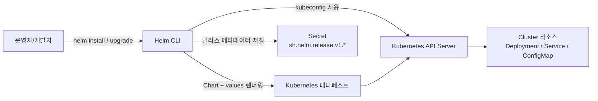
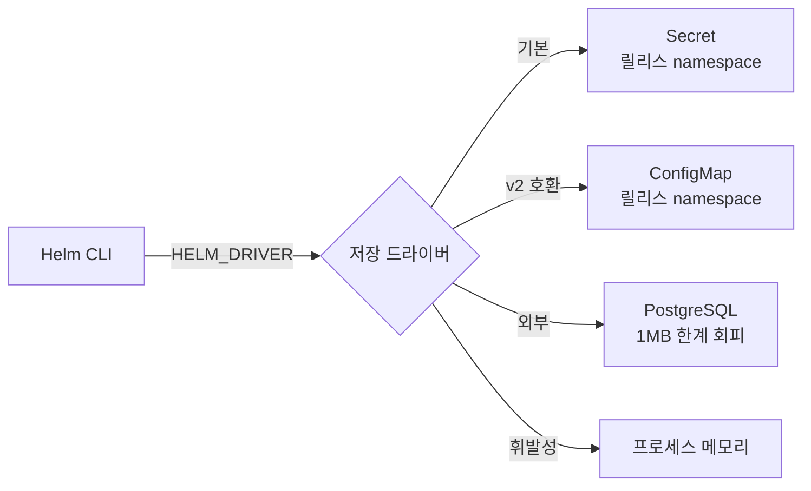
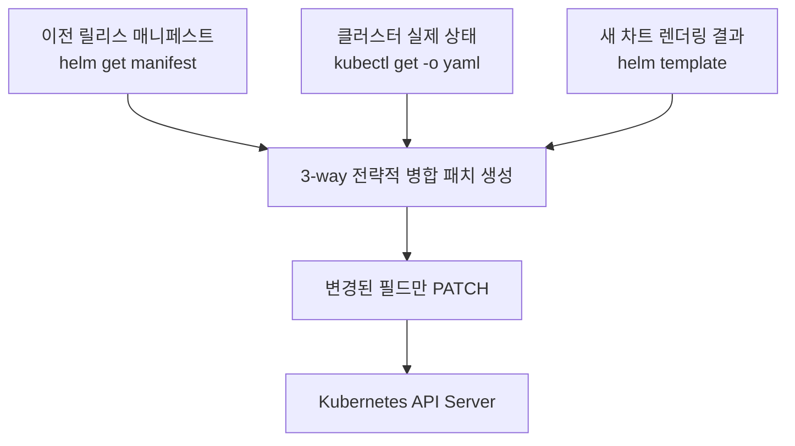
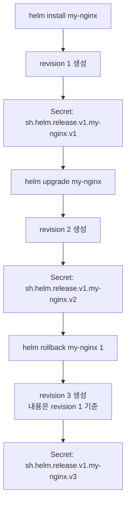
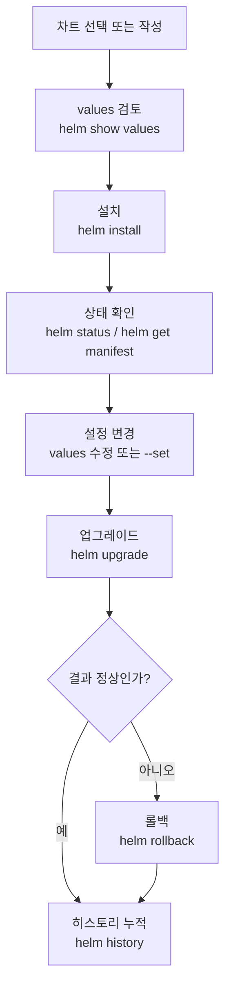

# Helm 기초

> Helm은 Kubernetes의 패키지 관리자다. 수십 개의 YAML 매니페스트를 하나의 차트로 관리하고, 환경별 설정을 values 파일로 분리하며, 릴리스 히스토리를 통해 안전한 배포와 롤백을 제공한다.


## 학습 목표
> 매니페스트 집합을 배포 가능한 패키지로 바꾸는 Helm의 역할을 본다.

이 장에서 확인할 목표는 다음과 같다:

1. Helm이 `kubectl apply` 방식보다 어떤 운영 이점을 주는지 설명할 수 있다.
2. Helm v3의 3-way merge와 릴리스 관리 메커니즘을 이해할 수 있다.
3. 저장소 관리, 차트 검색, 설치, 업그레이드, 롤백의 기본 명령어를 한 흐름으로 사용할 수 있다.
4. `--set`과 `-f` 플래그로 환경별 설정을 분리하는 방식을 설명할 수 있다.


## 1. 왜 Helm이 필요한가
> raw YAML만으로 운영할 때 생기는 반복과 드리프트 문제를 짚는다.

### 1.1 YAML 관리의 복잡성

단일 애플리케이션을 배포하려면 Deployment, Service, ConfigMap, Secret, Ingress, PVC 등 여러 리소스가 필요하다. 이를 개별 파일로 관리하면 파일 수가 폭증하고, ConfigMap을 먼저 만들어야 Deployment가 시작되는 의존성 순서를 사람이 직접 챙겨야 한다.

환경별 설정 중복도 문제다. 개발과 프로덕션이 replicas 수, 이미지 태그, 리소스 제한만 다를 때 거의 같은 YAML을 복사해서 값만 바꾸면 DRY 원칙을 위반하게 된다. 어느 한 파일을 수정할 때 나머지도 함께 업데이트해야 하는데 하나라도 빠뜨리면 환경 간 불일치가 발생한다.

버전 관리와 롤백도 `kubectl apply`만으로는 어렵다. Deployment는 `kubectl rollout undo`로 롤백할 수 있지만 Service나 ConfigMap은 수동으로 이전 버전을 재적용해야 한다.

### 1.2 Helm의 해결책

| 문제 | Helm 솔루션 |
|------|------------|
| YAML 관리 복잡성 | 차트: 관련 리소스를 하나의 패키지로 묶어 버전 관리 |
| 환경별 설정 중복 | Values: 템플릿 + values 파일로 설정 분리 |
| 버전/롤백 부재 | 릴리스: 배포 히스토리 자동 추적, 명령어 하나로 롤백 |
| 재사용/공유 어려움 | 레포지토리: 차트를 저장소에 퍼블리시해 공유 |


## 2. Helm 아키텍처
> Chart와 Release가 어떤 계층으로 나뉘는지 간단히 정리한다.

Helm이 차트를 실제 클러스터 상태로 바꾸는 흐름은 다음과 같다:



### 2.1 Helm v3: Tiller 제거

**Helm v2에서는 클러스터 내부에 Tiller라는 서버 컴포넌트가 필요했다.** 

- Tiller가 cluster-admin 권한을 가지므로 Tiller에 접근할 수 있는 모든 사용자가 사실상 클러스터 전체 권한을 가지는 보안 취약점이 있었다.

**Helm v3는 Tiller를 제거했다.** 

- Helm CLI가 kubeconfig를 직접 사용해 API 서버와 통신하므로 사용자의 kubectl 권한이 그대로 Helm에 적용된다. 
- 릴리스 정보는 ConfigMap에서 Secret으로 바꿔 보안을 강화했다.

### 2.2 릴리스 저장 백엔드

Helm v3는 릴리스 메타데이터를 클러스터의 어떤 객체에 저장할지 드라이버로 고를 수 있다. 기본은 `secret`이지만 큰 차트나 통합 이력 관리가 필요하면 다른 드라이버로 바꿔야 한다.



| 드라이버 | 저장소 | 기본 여부 | 사용 시나리오 |
|----------|--------|-----------|--------------|
| `secret` | 릴리스 namespace의 Secret | v3 기본 | 일반 운영 |
| `configmap` | 릴리스 namespace의 ConfigMap | 아니오 | v2 호환, 평문 가시성 필요 시 |
| `sql` | 외부 PostgreSQL | 아니오(beta) | 1 MB 초과, 멀티 클러스터 통합 이력 |
| `memory` | 프로세스 메모리 | 아니오 | CI/단위 테스트 |

운영에서 자주 쓰는 환경변수는 다음과 같다:

- `HELM_DRIVER` — 드라이버 선택 (`secret`/`configmap`/`sql`/`memory`)
- `HELM_DRIVER_SQL_CONNECTION_STRING` — `sql` 드라이버의 PostgreSQL 접속 문자열
- `HELM_MAX_HISTORY` — 릴리스당 보관할 revision 상한 (CLI `--history-max`와 같은 의미)

특히 Kubernetes 객체는 한 개당 1 MB 제한이 있어서, 차트 매니페스트가 커지거나 history가 많아지면 Secret 저장 자체가 실패할 수 있다. 이 한계에 가까워지면 `sql` 드라이버 전환을 검토한다.

### 2.3 3-Way Merge

Helm v3의 업그레이드는 세 가지 상태를 비교해 변경된 필드만 패치한다. 이전 릴리스 매니페스트, 클러스터 실제 상태, 새 차트 렌더링 결과를 한자리에 모은 다음 strategic merge patch를 만들어 API 서버에 보낸다.



`kubectl apply`는 이전 적용 내용과 새 매니페스트만 비교해 수동 변경을 덮어쓰는 반면, Helm v3는 라이브 상태를 함께 본다. 그래서 운영자가 `kubectl scale`로 바꿔 둔 replicas나 서비스 메시 사이드카가 주입한 annotation처럼 "Helm이 소유하지 않은 필드"는 보존된다.

다만 다음 두 가지 함정은 미리 알아둬야 한다.

- **Immutable 필드 충돌**: `Deployment.spec.selector`, `Service.spec.clusterIP` 같은 변경 불가 필드를 차트에서 바꾸면 패치가 실패한다. 이때는 `helm upgrade --force`로 재생성하거나 수동 삭제 후 재설치가 필요하다.
- **Orphaned field**: 직전 릴리스가 `failed`/`pending-upgrade`로 남으면 Helm이 더 이상 추적하지 못하는 필드가 생겨 다음 업그레이드가 꼬인다. `helm history`에서 비정상 revision이 보이면 `helm rollback`으로 정상 상태로 정렬한 뒤 다시 시도하는 편이 안전하다.

### 2.4 릴리스 관리

릴리스는 Helm이 클러스터에 차트를 설치한 인스턴스다. 하나의 차트로 여러 릴리스를 만들 수 있다. 각 릴리스는 클러스터의 Secret으로 저장된다(`sh.helm.release.v1.<name>.v<revision>`). Secret에는 렌더링된 매니페스트, 사용된 values, 차트 메타데이터가 포함된다.

Helm이 이력을 남기는 방식은 "릴리스 이름별 revision 누적"으로 이해하면 된다:



- 중요한 점은 `rollback`이 기존 revision을 덮어쓰지 않는다는 것이다. 
- revision 1로 되돌리더라도 "현재 상태를 revision 1 내용으로 재적용한 새 revision"이 하나 더 생긴다. 
- 그래서 이력은 선형으로 계속 누적되고, 운영자는 언제 어떤 설정으로 바뀌었는지 추적할 수 있다.

실제 조회는 다음 명령으로 한다:

```bash
helm history my-nginx
helm get values my-nginx --revision 2
helm get manifest my-nginx --revision 2
kubectl get secret -n default | grep 'sh.helm.release.v1.my-nginx'
```

- `helm history`는 revision 번호, 상태(`deployed`, `superseded`, `failed`, `pending-upgrade`), 차트 버전, 앱 버전, 변경 시각을 보여준다. 
- `helm get values`는 그 revision에 사용된 설정값을, `helm get manifest`는 최종 렌더링 결과를 보여준다. 
- 마지막 `kubectl get secret`은 Helm이 실제로 이력을 Secret으로 저장했다는 사실을 클러스터 관점에서 확인하는 용도다.

여기서 Helm과 ArgoCD를 분리해서 이해해야 한다. 

- Helm으로 직접 배포하면 이 revision 이력이 Helm release의 일부로 남는다. 
- 반면 ArgoCD가 Helm chart를 배포할 때는 보통 `helm install`이 아니라 `helm template`로 매니페스트만 생성하고, 이후 적용 이력과 롤백은 ArgoCD가 자체적으로 관리한다. 
- 따라서 ArgoCD가 Helm의 revision Secret(`sh.helm.release.v1.*`)을 그대로 이어받거나 `helm history`를 재사용하는 구조는 아니다.

이력은 무한정 두는 것이 아니라 필요에 따라 관리한다. 기본적으로 revision이 계속 쌓이므로 장기간 운영 릴리스는 개수를 제한하는 편이 낫다.

```bash
helm upgrade --install my-nginx bitnami/nginx -f values.yaml --history-max 10
```

`--history-max`를 주면 오래된 revision은 정리되고 최신 이력만 유지된다. 운영에서는 "롤백 가능한 개수"와 "Secret 누적량" 사이에서 적절한 숫자를 정한다.


## 3. 기본 명령어
> 실제 운영에서 자주 쓰는 배포·업그레이드·롤백 명령을 한 흐름으로 본다.

### 3.1 레포지토리 관리

```bash
helm repo add bitnami https://charts.bitnami.com/bitnami
helm repo add ingress-nginx https://kubernetes.github.io/ingress-nginx
helm repo add prometheus-community https://prometheus-community.github.io/helm-charts
helm repo update
helm repo list
```

Helm 3.8부터는 OCI 호환 레지스트리(Harbor, ECR, GHCR, GitLab Registry)를 차트 저장소로 직접 쓸 수 있다. 별도의 HTTP 인덱스 없이 컨테이너 이미지와 같은 인증·스캔·서명 도구를 그대로 재사용할 수 있다는 장점이 있다.

```bash
helm registry login registry.example.com
helm push my-chart-0.1.0.tgz oci://registry.example.com/charts
helm install my-app oci://registry.example.com/charts/my-chart --version 0.1.0
```

OCI 경로는 `helm repo add` 단계가 필요 없고 `oci://` URL을 명령어에 직접 넘긴다. `helm pull`/`helm show values`도 동일하게 동작한다.

### 3.2 차트 탐색

```bash
helm search repo nginx
helm search repo bitnami/nginx --versions   # 버전 목록
helm show values bitnami/nginx              # 기본 values 확인 (중요)
helm show chart bitnami/nginx               # 차트 메타데이터
```

설치 전에 반드시 `helm show values`로 기본 값을 확인하고 필요한 항목만 오버라이드한다.

### 3.3 설치·업그레이드·롤백

```bash
# 기본 설치
helm install my-nginx bitnami/nginx

# values 오버라이드 (--set은 단순값, -f는 복잡한 설정에 권장)
helm install my-nginx bitnami/nginx \
  -f base-values.yaml \
  -f prod-values.yaml \
  --set image.tag=1.25.0

# CI/CD 멱등 패턴: 설치 없으면 install, 있으면 upgrade
helm upgrade --install my-nginx bitnami/nginx -f values.yaml

# 업그레이드
helm upgrade my-nginx bitnami/nginx -f updated-values.yaml

# 히스토리 및 롤백
helm history my-nginx
helm rollback my-nginx 2      # 특정 리비전으로
helm rollback my-nginx        # 직전 리비전으로
```

운영 관점의 기본 사이클은 다음 순서로 이해하면 된다:



values 우선순위는 낮은 순서로 차트 기본값 → `-f` 첫 번째 파일 → `-f` 두 번째 파일 → `--set`이다. 항상 `-f values.yaml`로 모든 설정을 명시하는 것이 `--reuse-values`보다 안전하다.

### 3.4 릴리스 조회

```bash
helm list -A                           # 모든 네임스페이스 릴리스
helm status my-nginx                   # 릴리스 상태
helm get values my-nginx               # 사용된 values
helm get manifest my-nginx             # 렌더링된 최종 매니페스트
helm get values my-nginx --revision 2  # 특정 리비전의 values
helm get notes my-nginx                # NOTES.txt 출력 (설치 후 안내문)
helm get hooks my-nginx                # 등록된 Hook 매니페스트
helm get all my-nginx --revision 2     # values+manifest+notes+hooks 한꺼번에
```

`helm get all`은 디버깅 시 한 revision의 모든 컨텍스트를 한 번에 끌어오기에 유용하다. `helm get hooks`는 어떤 Hook이 어느 시점에 동작하는지 잊었을 때 차트를 다시 읽지 않아도 빠르게 확인할 수 있다.


## 4. 주요 레포지토리
> 공용 차트를 가져올 때 어떤 기준으로 신뢰도를 판단할지 정리한다.

| 레포지토리 | 주요 차트 |
|-----------|-----------|
| Bitnami | nginx, postgresql, redis, kafka, mongodb |
| ingress-nginx | ingress-nginx |
| prometheus-community | kube-prometheus-stack |
| jetstack | cert-manager |
| argo | argo-cd, argo-workflows |

차트 선택 기준은 다음과 같다. 대부분의 오픈소스 소프트웨어는 Bitnami 버전이 가장 잘 유지보수된다. Ingress-Nginx, Prometheus 등은 각 프로젝트의 공식 레포지토리를 사용한다. Artifact Hub에서 다운로드 수와 최근 업데이트 날짜를 확인하는 것이 좋다.


## 5. 다음 단계
> 차트를 소비하는 단계에서 직접 만드는 단계로 넘어간다.

Ch06에서는 직접 Helm 차트를 작성한다. Go 템플릿 언어로 values를 동적으로 주입하고, Hooks로 배포 라이프사이클을 제어하며, 차트 의존성으로 서브차트를 통합하는 방법을 다룬다.


## 관련 문서
> 앞선 네트워킹 장과 다음 Helm 심화 장을 함께 연결한다.

- [Helm 기초 점검](05-01.Helm%20%EA%B8%B0%EC%B4%88%20%EC%A0%90%EA%B2%80.md) — 본 장의 점검 편, bitnami/nginx로 install→upgrade→rollback 사이클
- [Ingress와 Gateway API](../02_networking/04-06.Ingress%EC%99%80%20Gateway%20API.md) — 이전 장, 외부 트래픽 진입 계층
- [Helm 고급](05-02.Helm%20%EA%B3%A0%EA%B8%89.md) — 다음 절, 차트 개발과 템플릿 설계
