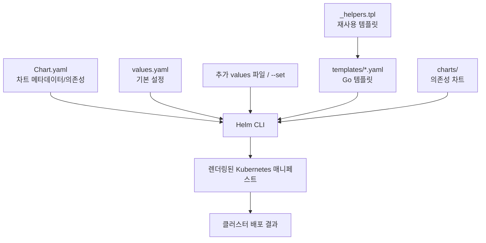
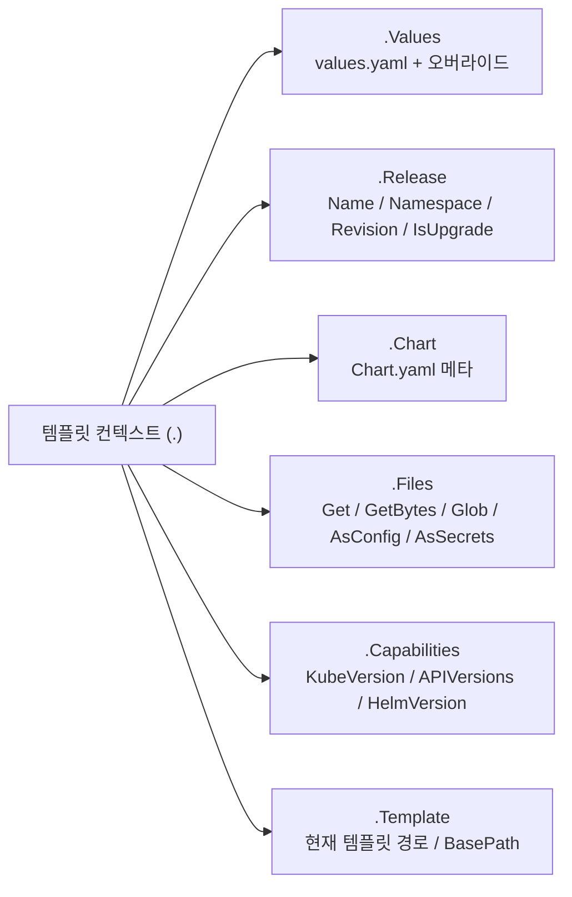
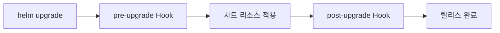
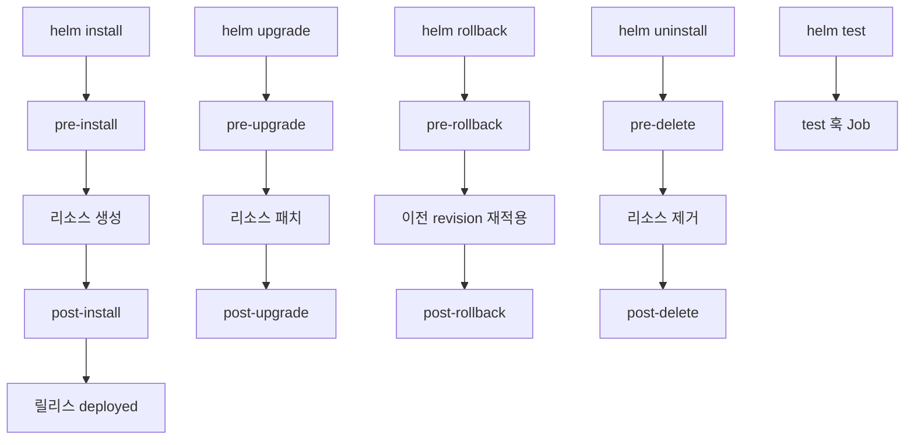
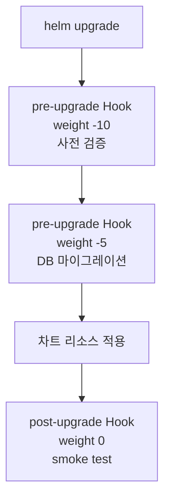
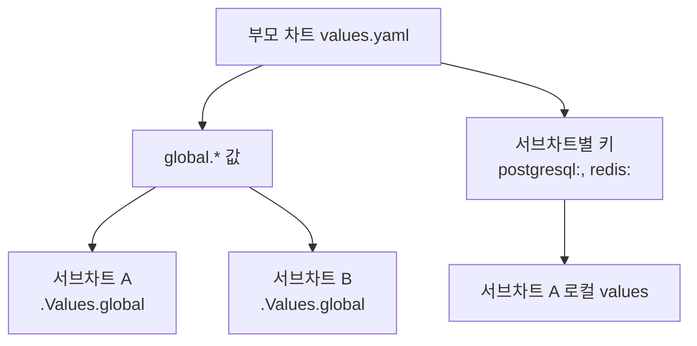

# Helm 고급

> Helm 차트를 직접 만들면 애플리케이션을 재사용 가능한 패키지로 배포할 수 있다. Go 템플릿 언어로 values를 동적으로 주입하고, Named Templates로 중복을 제거하며, Hooks로 배포 라이프사이클을 제어한다.


## 학습 목표
> Helm을 설치 도구가 아니라 패키징 도구로 쓰는 방법을 본다.

이 장에서 확인할 목표는 다음과 같다:

1. 차트 구조(`Chart.yaml`, `values.yaml`, `templates/`)의 역할을 설명할 수 있다.
2. `.Values`, `.Release` 등의 내장 객체와 템플릿 함수를 사용할 수 있다.
3. `if/else`, `range`로 환경별 리소스를 동적으로 생성하고 `_helpers.tpl`로 중복을 줄일 수 있다.
4. `pre-install`, `post-upgrade` 같은 Hook으로 배포 라이프사이클 작업을 자동화할 수 있다.
5. 차트 의존성으로 서브차트를 통합하고 검증 도구로 품질을 점검할 수 있다.


## 1. Helm 차트 구조
> 차트 디렉터리 안에서 어떤 파일이 어떤 책임을 가지는지 정리한다.

차트 디렉터리의 각 파일은 렌더링 파이프라인에서 다음처럼 연결된다:



```
sample-app/
├── Chart.yaml             # 차트 메타데이터 (이름, 버전, appVersion)
├── values.yaml            # 기본 설정값
├── values.schema.json     # values 입력 검증용 JSON Schema (선택)
├── LICENSE                # 라이선스 (선택)
├── README.md              # 차트 사용 안내 (선택)
├── charts/                # 의존성 차트 (서브차트)
├── crds/                  # CRD 매니페스트 (templates와 별개로 먼저 설치)
├── templates/             # K8s 매니페스트 템플릿
│   ├── NOTES.txt          # helm install 후 출력 메시지
│   ├── _helpers.tpl       # Named Templates (재사용 함수)
│   ├── deployment.yaml
│   ├── service.yaml
│   ├── ingress.yaml
│   └── tests/
│       └── test-connection.yaml
└── .helmignore            # helm package 시 제외할 파일 패턴
```

`crds/` 디렉토리는 일반 템플릿과 분리된 특별 영역이다. Helm은 본 리소스 적용 전에 이 디렉토리의 매니페스트를 먼저 클러스터에 설치한다. 다만 한 번 설치된 CRD는 `helm upgrade`로 갱신되지 않고 `helm uninstall`로도 삭제되지 않는다는 점은 운영 사고의 단골 원인이라 미리 알아둬야 한다. CRD 스키마 변경은 별도 절차로 적용한다.

`.helmignore`는 `helm package`가 차트를 tgz로 묶을 때 제외할 파일을 지정한다. `.gitignore`와 비슷해 보이지만 다음 차이가 있다:

- `**` 와일드카드를 지원하지 않는다(Go `filepath.Match` 기반).
- `!` 프리픽스로 negation 가능, 한 줄에 한 패턴.
- `.helmignore` 자기 자신은 자동 제외 대상이 아니라 직접 명시해야 한다.

### 1.1 Chart.yaml

```yaml
apiVersion: v2
name: sample-app
version: 0.1.0        # 차트 버전 (SemVer)
appVersion: "1.0.0"   # 애플리케이션 버전
type: application     # application 또는 library
kubeVersion: ">=1.24.0-0"
description: Sample application chart
dependencies:
  - name: postgresql
    version: "12.5.0"
    repository: https://charts.bitnami.com/bitnami
    condition: postgresql.enabled
```

`Chart.yaml`이 받을 수 있는 필드는 다음과 같다. 빠뜨리기 쉬운 것은 `kubeVersion`(호환 K8s 범위)과 `annotations`(Artifact Hub용 메타데이터)다.

| 필드 | 필수 | 의미 |
|------|------|------|
| `apiVersion` | ✅ | `v2`(Helm 3+), `v1`은 레거시 |
| `name` | ✅ | 차트 이름 |
| `version` | ✅ | 차트 버전(SemVer 2) |
| `type` | ❌ | `application`(기본) 또는 `library` |
| `appVersion` | ❌ | 패키징된 애플리케이션 버전. SemVer 권장이지만 `"1.0.0"` 같은 문자열도 허용 |
| `description` | ❌ | 한 문장 설명 |
| `kubeVersion` | ❌ | 호환 Kubernetes 버전의 SemVer 범위 |
| `dependencies` | ❌ | 서브차트 목록(v2 신규 — v1에서는 `requirements.yaml` 별도 파일) |
| `annotations` | ❌ | Artifact Hub 등이 사용하는 임의 메타데이터 |
| `deprecated` | ❌ | `true`이면 Hub에서 deprecated 표시 |
| `icon` | ❌ | 차트 아이콘 URL |
| `home` / `sources` / `maintainers` | ❌ | 프로젝트 홈, 소스 리포지토리, 메인테이너 정보 |

`version`은 차트 자체 버전이고 `appVersion`은 차트가 감싸는 애플리케이션 버전이다. 둘은 독립적으로 관리한다 — 차트 템플릿만 고치면 `version`만 올리고 `appVersion`은 그대로 둔다.


## 2. 템플릿 언어
> 값 치환을 넘어 조건문과 반복문으로 차트를 일반화하는 방식을 설명한다.

### 2.1 내장 객체

템플릿 컨텍스트(`.`) 아래에는 여섯 종류의 내장 객체가 매달려 있다. 차트 작성자는 이 객체에서 필요한 정보를 꺼내 매니페스트를 조립한다.



자주 쓰는 패턴은 다음과 같다.

```yaml
# .Values: values.yaml 또는 오버라이드 값
image: {{ .Values.image.repository }}:{{ .Values.image.tag }}

# .Release: 릴리스 정보
name: {{ .Release.Name }}-deployment
namespace: {{ .Release.Namespace }}

# .Chart: Chart.yaml 정보
app.kubernetes.io/version: {{ .Chart.AppVersion }}

# .Files: 비템플릿 파일을 ConfigMap에 통째로 주입
data:
{{ (.Files.Glob "config/*").AsConfig | indent 2 }}

# .Capabilities: 클러스터 K8s 버전에 따라 API 분기
{{- if .Capabilities.APIVersions.Has "networking.k8s.io/v1/Ingress" }}
apiVersion: networking.k8s.io/v1
{{- else }}
apiVersion: networking.k8s.io/v1beta1
{{- end }}

# .Template: 디버깅 시 현재 템플릿 경로 노출
# {{ .Template.Name }} → sample-app/templates/deployment.yaml
```

`.Release.IsInstall`과 `.Release.IsUpgrade`는 첫 설치 시점에만 시드 데이터 Job을 만들거나, 업그레이드에서만 동작할 마이그레이션을 분기할 때 쓴다. `.Capabilities.APIVersions.Has`는 K8s 버전 호환 분기에 자주 등장하고, `.Files.AsSecrets`는 인증서·키 같은 바이너리 파일을 base64로 묶어 Secret에 넣을 때 쓴다.

### 2.2 템플릿 함수

```yaml
# 기본값 지정
replicas: {{ .Values.replicaCount | default 1 }}

# 인용
image: {{ .Values.image.repository | quote }}

# 형식화
date: {{ now | date "2006-01-02" }}

# 조건: 값이 없으면 빈 문자열
{{ .Values.ingress.hostname | default "" }}
```

### 2.3 조건문과 반복문

```yaml
# 조건부 렌더링
{{- if .Values.ingress.enabled }}
apiVersion: networking.k8s.io/v1
kind: Ingress
metadata:
  name: {{ .Release.Name }}-ingress
{{- end }}

# 반복
env:
{{- range .Values.extraEnvVars }}
  - name: {{ .name }}
    value: {{ .value | quote }}
{{- end }}
```

- `{{-`는 앞의 공백·줄바꿈을 제거하고, `-}}`는 뒤의 공백·줄바꿈을 제거한다. YAML 들여쓰기를 맞추는 데 필수적이다.

`with`는 점 컨텍스트를 좁혀 같은 키를 반복해서 쓰지 않게 해 준다. 중첩된 옵션 블록을 다룰 때 가독성이 좋아진다.

```yaml
{{- with .Values.podSecurityContext }}
securityContext:
  runAsUser: {{ .runAsUser }}
  fsGroup: {{ .fsGroup }}
{{- end }}
```

`range`는 슬라이스뿐 아니라 map 반복도 가능하다. 키와 값이 모두 필요하면 변수 두 개를 받는다.

```yaml
data:
{{- range $key, $val := .Values.config }}
  {{ $key }}: {{ $val | quote }}
{{- end }}
```

화이트스페이스 제어를 잘못 넣으면 YAML 들여쓰기가 어긋난다. 다음 두 예는 결과 들여쓰기가 다르다.

```yaml
# 결과: env 항목이 deployment 키 깊이로 빠져 들여쓰기 깨짐
env:
{{ range .Values.envVars }}
- name: {{ .name }}
{{ end }}

# 결과: env 항목이 spec.containers[].env 깊이에 정확히 정렬
env:
  {{- range .Values.envVars }}
  - name: {{ .name }}
  {{- end }}
```


## 3. Named Templates (_helpers.tpl)
> 반복되는 이름과 라벨 규칙을 한 곳으로 모으는 이유를 다룬다.

`_`로 시작하는 파일은 렌더링 결과를 생성하지 않고 재사용 가능한 템플릿을 정의하는 용도로 사용한다.

```yaml
# _helpers.tpl
{{- define "myapp.labels" -}}
app.kubernetes.io/name: {{ .Chart.Name }}
app.kubernetes.io/instance: {{ .Release.Name }}
app.kubernetes.io/version: {{ .Chart.AppVersion }}
{{- end }}

{{- define "myapp.selectorLabels" -}}
app.kubernetes.io/name: {{ .Chart.Name }}
app.kubernetes.io/instance: {{ .Release.Name }}
{{- end }}
```

`template`은 레거시 방식으로 파이프라인을 지원하지 않아 들여쓰기 제어가 어렵다. `include`는 결과를 문자열로 반환해 `nindent`와 결합할 수 있다. 모든 Named Template 호출에 `include` + `nindent`를 사용하는 것이 권장 패턴이다.

```yaml
# deployment.yaml
metadata:
  labels:
    {{- include "myapp.labels" . | nindent 4 }}
spec:
  selector:
    matchLabels:
      {{- include "myapp.selectorLabels" . | nindent 6 }}
```


## 4. Helm Hooks
> 배포 전후 작업을 차트 안에 포함시키는 방법을 설명한다.

Hook은 일반 리소스 배포 흐름 사이에 작업을 삽입하는 장치다:



핵심은 "최종 상태를 구성하는 리소스"와 "배포 과정에서 잠깐 실행되는 작업"을 분리하는 데 있다. Deployment, Service, ConfigMap은 설치 후에도 계속 남아 있어야 하는 리소스다. 반면 DB 마이그레이션, 설치 직후 smoke test, 삭제 직전 외부 정리 작업은 특정 시점에만 필요하다. Hook은 이런 작업을 차트 안으로 가져와 Helm이 정해진 타이밍에 실행하게 만든다.

### 4.1 Hook이 필요한 이유

배포에는 순서 의존성이 자주 등장한다. 새 애플리케이션 버전이 새 스키마를 요구한다면 DB 마이그레이션이 먼저 끝나야 한다. 설치 직후 관리 계정 생성이나 초기 데이터 적재가 필요할 수도 있다. 삭제 직전에는 외부 DNS, 메시 큐, 라이선스 등록 해제 같은 정리 작업이 남을 수 있다.

이 절차를 CI 스크립트에 흩어 놓으면 차트만 봐서는 전체 배포 절차를 이해하기 어렵다. 누가 어떤 순서로 무엇을 실행해야 하는지도 도구 밖으로 새어 나간다. Hook은 "배포와 강하게 결합된 절차"를 차트 안에 포함시켜, `helm install`이나 `helm upgrade` 한 번으로 전체 흐름을 재현 가능하게 만든다.

### 4.2 언제 어떤 Hook을 쓰는가

공식 문서가 정의하는 Hook은 다음과 같다. 운영에서 가장 자주 보이는 다섯 개 외에도 롤백·삭제 시점 Hook과 `helm test` 전용 Hook이 있다.

| Hook | 실행 시점 |
|------|----------|
| `pre-install` | 템플릿 렌더 후 / 리소스 생성 전 |
| `post-install` | 모든 리소스 로드 후 |
| `pre-delete` | 삭제 요청 후 / 리소스 제거 전 |
| `post-delete` | 모든 리소스 삭제 후 |
| `pre-upgrade` | 템플릿 렌더 후 / 업그레이드 전 |
| `post-upgrade` | 모든 리소스 업그레이드 후 |
| `pre-rollback` | 롤백 요청 후 / 리소스 롤백 전 |
| `post-rollback` | 모든 리소스 롤백 후 |
| `test` | `helm test` 실행 시 |

명령어별 Hook 라이프사이클을 한 장으로 정리하면 다음과 같다.



실무에서 자주 쓰는 용도는 다음과 같다:

- `pre-install`: 초기 스키마 생성, 설치 전 연결/권한 검증
- `post-install`: 관리자 계정 생성, 샘플 데이터 적재, 설치 직후 smoke test
- `pre-upgrade`: DB 마이그레이션, 비호환 설정 사전 검사
- `post-upgrade`: 캐시 워밍, 배포 후 검증 Job
- `pre-delete`: 외부 시스템 정리, 등록 해제, 백업 트리거

가장 대표적인 예는 `pre-upgrade` DB 마이그레이션이다. 애플리케이션이 새 스키마를 전제로 동작하는데 Deployment가 먼저 롤아웃되면, 애플리케이션은 부팅 직후 실패하거나 요청 처리 중 예외를 낼 수 있다. Hook으로 마이그레이션을 먼저 끝내면 순서 의존성을 차트 수준에서 강제할 수 있다.

### 4.3 기본 예시: pre-upgrade 마이그레이션

```yaml
apiVersion: batch/v1
kind: Job
metadata:
  name: {{ .Release.Name }}-db-migrate
  annotations:
    "helm.sh/hook": pre-upgrade
    "helm.sh/hook-weight": "-5"
    "helm.sh/hook-delete-policy": hook-succeeded
spec:
  template:
    spec:
      restartPolicy: Never
      containers:
      - name: migrate
        image: {{ .Values.image.repository }}:{{ .Values.image.tag }}
        command: ["./migrate", "--up"]
```

이 Job은 업그레이드 직전에 실행된다. 성공하면 그 다음에 Deployment, Service 같은 본 리소스가 적용된다. 실패하면 업그레이드 전체가 실패 상태가 되므로, "마이그레이션은 실패했는데 애플리케이션만 반쯤 올라간 상태"를 피할 수 있다.

### 4.4 Hook끼리도 순서가 있다

Hook이 하나만 있는 경우는 단순하지만, 실제 운영에서는 사전 검증과 마이그레이션을 둘 다 `pre-upgrade`에 두는 식으로 여러 Hook이 섞이기도 한다. 이때 Helm은 같은 Hook 타입 안에서 `hook-weight`가 낮은 것부터 먼저 실행한다. weight가 같으면 이름 순으로 정렬된다.



- `hook-weight`는 같은 Hook 타입 내 실행 순서를 결정한다(낮을수록 먼저).

### 4.5 Hook 리소스는 어떻게 정리되는가

Hook은 대개 한 번 실행하고 끝나는 Job이므로, 실행 후 남겨 둘지 자동 삭제할지 결정해야 한다. 삭제 정책을 정하지 않으면 완료된 Job과 Pod가 계속 누적돼 클러스터를 지저분하게 만들 수 있다.

자주 쓰는 정책은 다음과 같다:

- `hook-succeeded`: 성공한 Hook 리소스를 삭제한다
- `hook-failed`: 실패한 Hook 리소스를 삭제한다
- `before-hook-creation`: 새 Hook 실행 전에 같은 이름의 이전 Hook 리소스를 먼저 지운다 (정책 미지정 시 기본 동작)

운영에서는 `before-hook-creation,hook-succeeded` 조합을 자주 쓴다. 이전 Job 흔적 때문에 이름 충돌이 나는 것을 막고, 성공한 Hook은 자동 정리할 수 있기 때문이다. 반대로 실패 분석이 중요하면 `hook-failed`는 넣지 않고 실패 Job을 남겨 로그를 확인하는 편이 낫다.

- `hook-delete-policy: hook-succeeded`는 성공 후 Job을 자동 삭제해 클러스터를 깔끔하게 유지한다.

### 4.6 Hook 실패는 곧 배포 실패다

Hook은 보조 기능처럼 보이지만 실제로는 릴리스 성공 여부를 좌우한다. `pre-install`이나 `pre-upgrade` Hook이 실패하면 Helm install/upgrade 자체가 실패한다. 이 동작은 의도적으로 강한 제약이다. 마이그레이션이나 사전 검증이 실패했는데도 애플리케이션만 먼저 올리는 것은 더 위험하기 때문이다.

반대로 이 점 때문에 Hook은 신중하게 써야 한다. 오래 걸리거나 외부 의존성이 불안정한 Job을 Hook으로 넣으면 배포 전체가 자주 실패한다. "배포와 강하게 결합된, 짧고 멱등적인 작업"에 우선 적용하는 것이 안전하다.

### 4.7 Hook을 어디까지 써야 하는가

모든 운영 절차를 Hook에 넣는 것은 좋은 설계가 아니다. 수십 분 걸리는 대용량 데이터 백필, 사람 승인 절차, 외부 API에 크게 의존하는 작업은 Hook보다 별도 운영 워크플로우가 나은 경우가 많다. Hook은 "이 작업이 실패하면 본 리소스를 적용하면 안 되는가?"라는 질문에 답이 예일 때 가장 잘 맞는다.

예를 들면 DB 마이그레이션은 Hook에 적합하다. 하지만 대용량 리인덱싱이나 장시간 백필은 배포와 분리하는 편이 안정적이다.

### 4.8 운영 규칙

Hook을 사용할 때는 다음 원칙을 지키는 편이 좋다:

- `Job`으로 작성해 성공/실패 판정을 분명히 한다
- 멱등성을 보장해 재실행돼도 같은 결과가 나오게 한다
- 실행 시간을 짧게 유지해 배포 전체를 오래 묶지 않는다
- 실패 로그를 남겨 원인 분석이 가능하게 한다
- 삭제 정책을 의도적으로 정해 성공 흔적과 실패 흔적을 구분해 관리한다


## 5. 차트 의존성
> 여러 차트를 함께 배포할 때 의존성을 어떻게 관리할지 정리한다.

```yaml
# Chart.yaml
dependencies:
  - name: postgresql
    version: "12.5.0"
    repository: https://charts.bitnami.com/bitnami
    condition: postgresql.enabled  # values.yaml에서 토글 가능
  - name: redis
    version: "17.3.0"
    repository: https://charts.bitnami.com/bitnami
    condition: redis.enabled
```

```bash
helm dependency update ./sample-app   # charts/ 디렉토리에 서브차트 다운로드
helm dependency list ./sample-app     # 의존성 상태 확인
```

서브차트 values는 부모 차트의 `values.yaml`에서 서브차트 이름을 키로 설정한다.

```yaml
# 부모 차트의 values.yaml
postgresql:
  enabled: true
  auth:
    database: myapp
    username: myapp
```

### 5.1 부모-자식 값 흐름

부모와 자식이 값을 주고받는 경로는 두 갈래다. 첫째는 서브차트 키 아래의 로컬 오버라이드이고, 둘째는 모두에게 보이는 `global` 값이다. 방향성을 잘못 이해하면 "부모에서 바꿨는데 자식이 못 받는다" 같은 함정에 빠진다.



값 흐름의 규칙은 다음과 같다.

- **글로벌 값**은 부모에서 자식 방향으로만 흐른다. 자식이 정의해도 부모는 보지 못하고, 부모와 자식 모두 정의하면 부모 값이 우선이다.
- **로컬 오버라이드**는 부모 `values.yaml`에 서브차트 이름을 키로 두면 서브차트 안의 `.Values`에 그대로 합쳐진다.
- **`import-values`**는 자식이 정의한 값을 부모 root로 끌어올리는 장치다. 자식이 `exports.<key>` 아래로 노출한 값을 부모가 받는 형식과, 자식의 임의 경로를 부모의 임의 경로로 매핑하는 child-parent 형식 두 가지가 있다.

```yaml
# 부모 Chart.yaml
dependencies:
  - name: common-config
    version: "0.1.0"
    repository: file://../common-config
    import-values:
      - child: defaults
        parent: appConfig
```

이렇게 두면 서브차트 `common-config`의 `defaults` 키 아래 값들이 부모 차트의 `.Values.appConfig`로 들어와 다른 서브차트에서도 참조할 수 있다.

### 5.2 Application 차트와 Library 차트

`Chart.yaml`의 `type` 필드는 `application`(기본)과 `library` 두 종류다. Library 차트는 단독으로 설치되지 않고 헬퍼 템플릿만 모아 두는 용도다. 마이크로서비스가 많아져 차트마다 같은 라벨·헬스체크 헬퍼가 복사되는 상황을 막고 싶을 때 도입한다.

| 항목 | Application | Library |
|------|-------------|---------|
| 단독 설치 | `helm install` 가능 | 불가 (의존성 전용) |
| `templates/` 렌더 결과 | 매니페스트 생성 | 매니페스트 0개, helper 정의만 |
| 용도 | 실제 배포 단위 | 공통 helper / 라벨 / 보일러플레이트 |
| 다수 마이크로서비스 운영 | 차트 N개 → 정의 표류 위험 | 라이브러리 1개 + 얇은 차트 N개 |

Library 차트는 `Chart.yaml`에 `type: library`만 명시하고 `templates/_helpers.tpl`에 `define`으로 헬퍼를 모은다. 사용처에서는 `dependencies`로 가져와 `include`로 호출한다.


## 6. 차트 검증
> 설치 전에 렌더 결과와 차트 품질을 확인하는 습관을 정리한다.

```bash
helm lint ./sample-app           # 문법 검사 및 베스트 프랙티스 경고
helm template myapp ./sample-app # 클라이언트 사이드 렌더링 (API 서버 불필요)
helm install myapp ./sample-app --dry-run --debug  # 서버 사이드 validation
helm test myapp                  # 설치 후 테스트 실행
```

`helm template`은 오프라인에서 렌더링 결과를 파일로 저장할 때 유용하다. `--dry-run`은 실제 클러스터 정보를 사용해 deprecated API나 스키마 오류를 잡아낸다.

### 6.1 values.schema.json으로 입력 검증

차트 루트에 `values.schema.json`을 두면 사용자가 넘긴 values를 JSON Schema로 검증할 수 있다. `helm install`/`helm upgrade`/`helm template`/`helm lint` 모두 이 파일을 자동으로 읽어 타입·필수값·범위를 점검한다. 잘못된 값은 매니페스트가 생성되기 전에 차단되므로, 값 오타 때문에 클러스터에 깨진 리소스가 올라가는 사고를 줄일 수 있다.

```json
{
  "$schema": "https://json-schema.org/draft-07/schema#",
  "type": "object",
  "required": ["image", "replicaCount"],
  "properties": {
    "replicaCount": {
      "type": "integer",
      "minimum": 1
    },
    "image": {
      "type": "object",
      "required": ["repository", "tag"],
      "properties": {
        "repository": { "type": "string" },
        "tag": { "type": "string" }
      }
    }
  }
}
```

이 스키마가 적용된 차트에 `replicaCount: "three"` 같은 잘못된 타입을 넘기면 `helm install`이 렌더링 단계에서 멈춘다. 운영 차트에 추가하면 PR 단계에서 잘못된 values를 거를 수 있어 비용 대비 효과가 큰 안전장치가 된다.


## 7. 다음 단계
> 패키징 다음 단계로 Day-2 운영 자동화인 Operator 패턴으로 넘어간다.

Ch07에서는 Operator 패턴을 다룬다. Helm이 배포 패키지화를 담당한다면, Operator는 CRD와 Custom Controller로 Day-2 운영(백업, 장애 복구, 업그레이드)을 자동화하는 더 깊은 수준의 추상화를 제공한다.


## 관련 문서
> 기초 장, 다음 장, 점검 문서를 함께 둔다.

- [Helm 고급 점검](05-02.Helm%20%EA%B3%A0%EA%B8%89%20%EC%A0%90%EA%B2%80.md) — 본 장의 점검 편, 차트 생성·템플릿·Hook 실습
- [Helm 기초](05-01.Helm%20%EA%B8%B0%EC%B4%88.md) — 이전 장, install·upgrade·rollback 워크플로우
- [Operator 패턴](06-01.Operator%20%ED%8C%A8%ED%84%B4.md) — 다음 장, CRD + Controller로 운영 자동화
