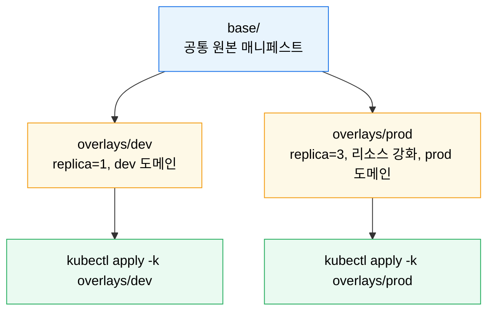
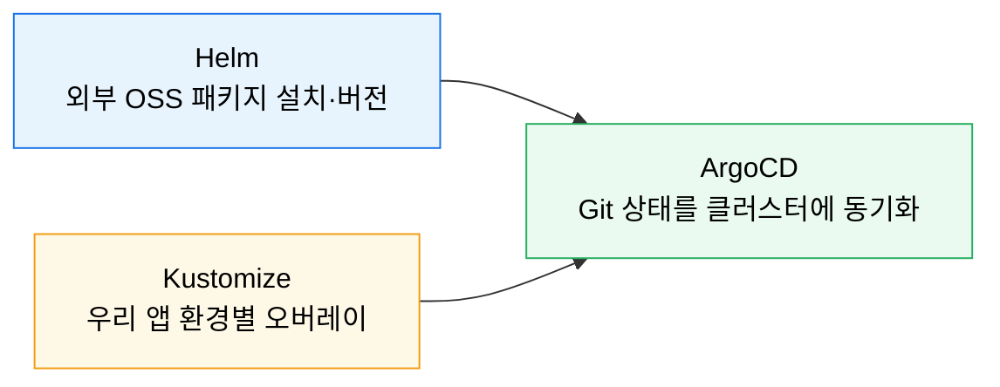

# Kustomize

---

> Kustomize 는 템플릿 없이 순수 YAML 위에서 환경별 차이를 조합하는 도구입니다. Helm 이 패키지와 버전 관리에 강하다면, Kustomize 는 같은 매니페스트를 dev·staging·prod 로 안전하게 변형하는 데 강합니다.

## 학습 목표

> Helm 과 Kustomize 를 경쟁 도구가 아니라 다른 계층의 도구로 구분합니다.

이 장을 끝내면 다음에 답할 수 있습니다.

1. Kustomize 가 템플릿 없이 오브젝트를 조합하는 방식을 설명할 수 있습니다.
2. `base` 와 `overlay` 구조로 환경별 차이를 어떻게 관리하는지 설명할 수 있습니다.
3. `kubectl apply -k` 와 `kubectl kustomize` 미리보기 흐름을 설명할 수 있습니다.
4. generator 의 장점과 해시 주의점, Helm·ArgoCD 와의 조합을 설명할 수 있습니다.

## 사전 지식

> 이 장은 다음을 안다고 가정합니다.

1. Deployment·Service 매니페스트를 직접 작성·`apply` 해 본 경험이 있습니다.
2. [Helm 기초](05-01.Helm%20%EA%B8%B0%EC%B4%88.md)의 템플릿·values 개념을 이해합니다.
3. dev/prod 처럼 환경별로 설정이 달라지는 상황을 겪어 봤습니다.


## 1. 왜 Kustomize인가

> 값 치환보다 "원본 유지 + 차이만 선언" 이 중요할 때 Kustomize 가 빛납니다.

Helm 은 강력하지만 템플릿 로직이 복잡해질수록 차트 읽기가 어려워집니다. 반대로 Kustomize 는 원본 매니페스트를 그대로 두고 이름 접두사·레이블·이미지 태그·패치만 덧씌웁니다. 그래서 "같은 앱을 dev 와 prod 에 배포하되 replica 수와 도메인만 다르다" 같은 문제에 특히 잘 맞습니다.

공식 문서 기준으로 Kustomize 는 `kubectl` 에 내장돼 있어 추가 설치 없이 `kubectl apply -k` 로 쓸 수 있습니다. CI/CD 와 GitOps 에서 별도 렌더링 서버 없이 바로 적용할 수 있다는 뜻입니다.


## 2. base와 overlay

> Kustomize 의 핵심 구조는 원본과 환경별 차이를 분리하는 것입니다.

```text
my-app/
├── base/
│   ├── deployment.yaml
│   ├── service.yaml
│   └── kustomization.yaml
└── overlays/
    ├── dev/
    │   └── kustomization.yaml
    └── prod/
        └── kustomization.yaml
```



`base` 는 공통 원본이고 `overlay` 는 환경별 차이입니다. 예를 들어 `prod` overlay 는 replica 수를 늘리고, 리소스 제한을 강화하고, Ingress 호스트를 교체할 수 있습니다.

```yaml
# overlays/prod/kustomization.yaml
resources:
  - ../../base

images:
  - name: my-app
    newTag: "1.2.3"

replicas:
  - name: my-app
    count: 3

commonLabels:
  env: prod
```


## 3. 자주 쓰는 기능

> 실제로 많이 쓰는 것은 이미지 교체·패치·공통 라벨·generator 네 가지입니다.

| 기능 | 용도 |
|------|------|
| `resources` | 다른 YAML 이나 base 포함 |
| `images` | 이미지 태그/레포지토리 치환 |
| `patches` | 특정 필드만 덮어쓰기 |
| `commonLabels` / `commonAnnotations` | 공통 메타데이터 주입 |
| `configMapGenerator` / `secretGenerator` | 외부 파일에서 설정 리소스 생성 |

```yaml
configMapGenerator:
  - name: my-app-config
    files:
      - application.properties
```

generator 는 편리하지만 이름에 해시가 붙을 수 있습니다. 이 해시는 설정이 바뀌면 새 이름이 되어 rollout 을 유도하는 데 유리하지만, 이름이 고정돼야 하는 참조 구조에서는 의도와 다를 수 있습니다. 그래서 팀마다 해시 사용 여부(`generatorOptions.disableNameSuffixHash`)를 먼저 정해 두는 편이 좋습니다.


## 4. Helm과의 관계

> Helm 과 Kustomize 는 대체재보다 조합 대상에 가깝습니다.

Helm 은 외부 애플리케이션을 패키지 단위로 설치하고 버전 이력을 관리하는 데 강하고, Kustomize 는 이미 존재하는 YAML 을 환경별로 조정하는 데 강합니다. 실무에서는 두 패턴이 같이 쓰입니다.



- 외부 오픈소스 설치: Helm
- 우리 팀 앱의 환경별 배포 차이: Kustomize
- Git 상태를 계속 클러스터에 맞추기: ArgoCD

ArgoCD 는 Helm 소스와 Kustomize 소스를 모두 지원합니다. 그래서 "공용 플랫폼은 Helm, 애플리케이션 오버레이는 Kustomize" 같은 구조가 자연스럽습니다.


## 5. 실습 기록

> 개인 GCP K8s 클러스터에서 base/overlay 를 만들어 dev·prod 차이를 확인합니다.

### 실습 1: 렌더링 미리보기 후 적용

```bash
# 항상 먼저 렌더링 결과를 본다 (템플릿이 없어도 실수는 생긴다)
kubectl kustomize overlays/dev

# 결과의 이름·라벨·이미지 태그를 확인한 뒤 적용
kubectl apply -k overlays/dev
```

**예상 결과(미리보기 일부):**

```yaml
apiVersion: apps/v1
kind: Deployment
metadata:
  labels:
    env: dev
  name: my-app
spec:
  replicas: 1
  ...
```

**분석:** `kubectl kustomize` 로 먼저 렌더링하면 overlay 가 base 에 실제로 어떻게 합쳐졌는지(라벨 주입·이미지 태그·replica) 적용 전에 눈으로 확인할 수 있습니다. dev 와 prod 를 각각 렌더해 차이를 대조해 보는 것이 overlay 학습의 핵심입니다.


## 6. 면접 대비 요약

### 한 줄 정의

Kustomize 는 템플릿 없이 base 원본에 overlay 로 환경별 차이만 덧씌우는 `kubectl` 내장 도구로, Helm 의 패키지 관리와 역할이 다릅니다.

### 핵심 포인트 3가지

1. base(공통) + overlay(환경 차이) 구조로 원본을 보존한 채 차이만 선언합니다.
2. `kubectl apply -k` 로 추가 도구 없이 적용, `kubectl kustomize` 로 미리보기합니다.
3. Helm=패키지 설치, Kustomize=환경 오버레이, ArgoCD=동기화로 역할이 갈립니다.

### 자주 묻는 질문

- **Q. Helm 과 Kustomize 중 무엇을 씁니까?** 대체재가 아니라 조합입니다. 외부 OSS 는 Helm, 우리 앱 환경 차이는 Kustomize.
- **Q. configMapGenerator 의 이름 해시는 왜 붙습니까?** 설정 변경 시 새 이름으로 rollout 을 유도하기 위함이며, 고정 참조가 필요하면 해시를 끕니다.
- **Q. 적용 전 무엇을 확인합니까?** `kubectl kustomize` 로 렌더링 결과(이름·라벨·이미지)를 먼저 봅니다.


## 관련 문서

> Helm 다음 단계와 GitOps 연결 지점을 함께 봅니다.

- [Helm 고급](05-02.Helm%20%EA%B3%A0%EA%B8%89.md) — 차트 패키징과 Hook, 템플릿 설계
- [Kustomize 점검](05-03.Kustomize%20%EC%A0%90%EA%B2%80.md) — base/overlay·generator·patch 실전 점검
- [ArgoCD와 GitOps](../04_devtools/07-03.ArgoCD%EC%99%80%20GitOps.md) — Kustomize 소스를 GitOps 로 지속 반영
