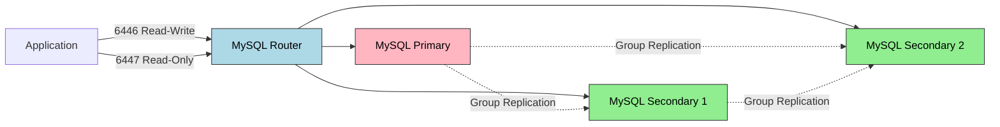
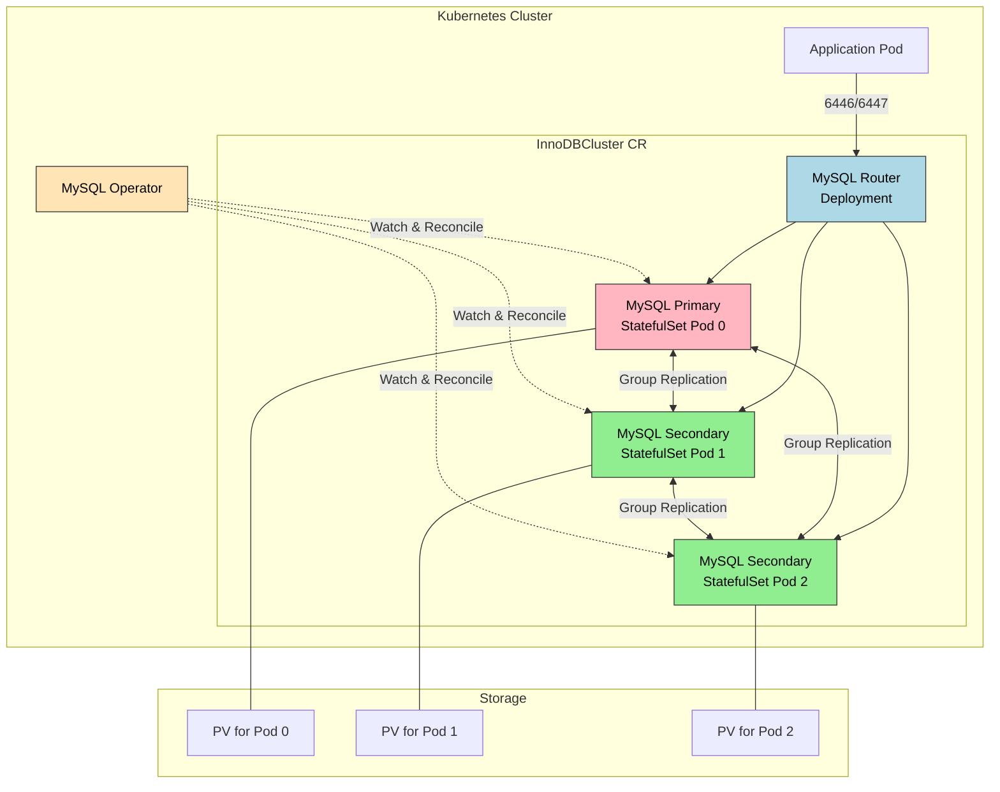

# MySQL Operator

> MySQL Operator for Kubernetes는 InnoDB Cluster 기반의 고가용성 MySQL 환경을 K8s 위에서 자동으로 관리한다. Group Replication으로 데이터를 동기화하고, MySQL Router가 애플리케이션의 연결을 Primary/Secondary로 자동 라우팅하며, Operator가 장애 복구와 백업을 선언적으로 관리한다.


## 학습 목표
> MySQL HA를 Operator가 어떻게 선언형으로 관리하는지 파악하는 장이다.

이 장에서 확인할 목표는 다음과 같다:

1. Kubernetes 위에서 데이터베이스를 운영하는 장점과 한계를 설명할 수 있다.
2. InnoDB Cluster의 아키텍처와 Group Replication 기반 HA 구조를 이해할 수 있다.
3. `InnoDBCluster` CR을 정의하고 클러스터를 생성하는 흐름을 설명할 수 있다.
4. Primary 장애 시 자동 페일오버 동작을 운영 관점에서 해석할 수 있다.
5. `MySQLBackup` CR로 백업과 복원을 선언적으로 관리하는 방식을 이해할 수 있다.
6. 리소스 제약 환경에서 DB 클러스터를 테스트하는 전략을 세울 수 있다.


## 1. 왜 데이터베이스를 K8s 위에 올리는가
> 상태 저장 데이터베이스를 Kubernetes에 올릴 때 기대하는 이점과 비용을 먼저 본다.

### 1.1 Day-2 Operation의 자동화

"데이터베이스는 K8s에 올리지 말라"는 말을 들어봤을 것이다. 초기 K8s는 Stateless 애플리케이션을 위해 설계되었고, StatefulSet이 안정화되기까지 시간이 걸렸다. 하지만 현재는 K8s 위에서 데이터베이스를 운영하는 것이 더 이상 금기가 아니다.

데이터베이스 운영에서 가장 고통스러운 부분은 초기 설치가 아니라 "어제 잘 돌던 DB가 오늘 왜 안 돌아가는가"에 대응하는 것이다. Operator 패턴은 이런 Day-2 Operation을 코드로 만든다. Primary가 죽으면 Replica를 승격시키고, 백업이 실패하면 재시도하는 로직이 Go 코드로 구현되어 24시간 감시한다. 운영자는 선언적 명세(CR)만 작성하면 된다.

### 1.2 인프라 통합과 비용

애플리케이션은 K8s에서 돌고 DB는 별도 VM이나 RDS에서 돌면, 네트워크 설정, 인증서 관리, 모니터링 스택이 이원화된다. DB를 K8s로 가져오면 Helm Chart로 배포하고, kubectl로 관리하고, Prometheus로 모니터링하는 것이 일관된 방식으로 가능해진다.

클라우드 RDS는 편리하지만 개발/테스트 환경에서는 과도한 비용이다. K8s 위에서 돌리면 노드의 자원을 효율적으로 공유할 수 있고, 필요할 때 스케일 아웃하고 필요 없을 때 스케일 인할 수 있다.

### 1.3 여전히 논쟁은 있다

"프로덕션 DB는 K8s 밖에 두는 것이 안전하다"는 의견도 타당하다. Storage 레이어의 복잡도, Network 레이어의 복잡도, 그리고 운영 숙련도 세 가지가 주된 이유다. Operator가 자동화를 제공하지만, 문제가 생겼을 때 디버깅하려면 K8s와 DB와 Operator를 모두 이해해야 한다. 결론은 상황에 따라 다르다는 것이다.


## 2. MySQL Operator for Kubernetes
> MySQL 전용 Operator가 어떤 운영 작업을 추상화하는지 정리한다.

MySQL Operator for Kubernetes는 Oracle이 공식으로 개발하고 유지보수하는 오픈소스 Operator다. 핵심 특징은 세 가지다.

1. InnoDB Cluster 기반이다. MySQL InnoDB Cluster는 Group Replication + MySQL Router + MySQL Shell을 결합한 고가용성 솔루션으로, 이미 MySQL 생태계에서 검증된 기술을 K8s 위로 가져온 것이다.
2. 선언적 관리다. `InnoDBCluster` CR을 작성하면 Operator가 StatefulSet, Service, Secret, ConfigMap을 생성한다.
3. 자동 복구다. Primary Pod가 죽으면 Secondary 중 하나를 승격시키고, Quorum을 재계산해 스플릿 브레인을 방지한다.

```bash
# Helm으로 설치 (권장)
helm repo add mysql-operator https://mysql.github.io/mysql-operator/
helm install mysql-operator mysql-operator/mysql-operator --namespace mysql-operator --create-namespace
```

공식 문서 기준으로 `InnoDBCluster`를 배포하면 Operator는 MySQL 인스턴스용 StatefulSet뿐 아니라 메인 서비스, 인스턴스별 접근 서비스, 초기 설정용 ConfigMap, 여러 Secret까지 함께 관리한다. 따라서 생성된 하위 리소스를 직접 수정하기보다 `InnoDBCluster` 스펙을 수정해 원하는 상태를 반영하는 편이 안전하다.


## 3. InnoDB Cluster 아키텍처
> Group Replication, Router, 인스턴스 구성이 어떻게 HA를 만드는지 설명한다.

### 3.1 Group Replication

Group Replication은 Paxos 기반의 합의 알고리즘을 사용해 데이터 일관성을 보장한다. 클라이언트가 Primary에 쓰기 요청을 보내면, Primary는 변경 내용을 Group에 브로드캐스트하고, 과반수(Quorum)가 승인하면 트랜잭션이 커밋된다. 모든 멤버가 동일한 순서로 트랜잭션을 적용한다.

Single-Primary 모드가 기본값이다. 하나의 Primary만 쓰기를 받고 나머지는 Secondary로 읽기 전용이며, 장애 시 Secondary 중 하나가 자동으로 Primary로 승격된다. Multi-Primary 모드는 모든 멤버가 쓰기를 받을 수 있지만 충돌 감지 로직이 복잡해 대부분의 경우 Single-Primary가 더 안전하다.

### 3.2 MySQL Router

MySQL Router는 애플리케이션과 MySQL 클러스터 사이에서 프록시 역할을 한다. Primary는 언제든지 바뀔 수 있으므로, 애플리케이션이 직접 Pod에 연결하면 현재 Primary를 추적해야 하는 부담이 생긴다. Router가 이를 대신한다.

Router는 두 가지 포트를 제공한다. 6446은 Read-Write 포트로 Primary로만 라우팅하고, 6447은 Read-Only 포트로 Primary와 Secondary 중에서 라운드 로빈으로 라우팅한다. Primary가 바뀌어도 Router가 자동으로 추적한다.



### 3.3 전체 아키텍처




## 4. InnoDBCluster CR 정의
> 실제 운영자가 조정하는 선언형 인터페이스를 필드 단위로 본다.

```yaml
apiVersion: mysql.oracle.com/v2
kind: InnoDBCluster
metadata:
  name: mycluster
  namespace: default
spec:
  secretName: mycluster-secret
  instances: 3
  router:
    instances: 1
  tlsUseSelfSigned: true
  version: "8.0.35"
  podSpec:
    resources:
      requests:
        memory: "512Mi"
        cpu: "500m"
      limits:
        memory: "1Gi"
        cpu: "1000m"
  datadirVolumeClaimTemplate:
    accessModes:
      - ReadWriteOnce
    resources:
      requests:
        storage: 2Gi
```

| 필드 | 설명 | 기본값 |
|------|------|--------|
| `secretName` | root 비밀번호가 저장된 Secret 이름 | 필수 |
| `instances` | MySQL 인스턴스 개수 | 1 (최소 3 권장) |
| `router.instances` | MySQL Router 개수 | 1 |
| `tlsUseSelfSigned` | 자체 서명 인증서 사용 여부 | false |
| `datadirVolumeClaimTemplate` | PVC 템플릿 | - |

Secret을 먼저 생성한 후 CR을 적용한다.

```bash
kubectl create secret generic mycluster-secret \
  --from-literal=rootUser=root \
  --from-literal=rootPassword=MySecretPassword123 \
  --from-literal=rootHost=%

kubectl apply -f mycluster.yaml
```

`STATUS`가 `ONLINE`이고 `ONLINE` 컬럼이 `3`이면 성공이다.

접속 경로도 용도별로 나뉜다. 애플리케이션은 보통 Router나 대표 서비스를 사용하고, 개별 인스턴스 서비스는 점검이나 유지보수 용도로만 직접 접근하는 편이 좋다. 이렇게 경로를 분리해야 Primary 전환 시 애플리케이션이 현재 리더를 추적하는 부담을 줄일 수 있다.


## 5. 장애 테스트
> 장애가 났을 때 Operator가 어떤 순서로 복구를 진행하는지 확인한다.

### 5.1 Primary Pod 삭제 시나리오

Primary Pod를 삭제하면 StatefulSet이 즉시 새 Pod를 생성하지만, 클러스터 재합류에는 시간이 걸린다. 그동안 Group Replication이 새 Primary를 선출한다. 보통 5~10초 안에 Secondary 중 하나가 승격되고, 2분 후 원래 Pod가 Secondary로 재합류한다.

### 5.2 Quorum 손실 시나리오

3개 클러스터에서 2개 Pod가 동시에 죽으면 Quorum이 깨진다. 남은 1개는 읽기 전용 모드로 전환되고, Pod들이 복구되면 Operator가 자동으로 클러스터를 재구성한다.

| 장애 유형 | Quorum | 복구 시간 | 쓰기 가용성 |
|-----------|--------|-----------|-------------|
| Primary Pod 삭제 | 유지 (2/3) | 5~10초 | 5~10초 중단 |
| Secondary 1개 삭제 | 유지 (2/3) | 즉시 | 영향 없음 |
| Secondary 2개 삭제 | 손실 (1/3) | Pod 복구 후 자동 | 완전 중단 |


## 6. 백업과 복원
> Day-2 운영에서 빠질 수 없는 백업 흐름을 정리한다.

### 6.1 On-Demand 백업

```yaml
apiVersion: mysql.oracle.com/v2
kind: MySQLBackup
metadata:
  name: mycluster-backup-20260213
spec:
  clusterName: mycluster
  backupProfileName: dump-instance
  storage:
    persistentVolumeClaim:
      claimName: backup-pvc
```

`backupProfileName`은 `dump-instance`(mysqldump 논리 백업)와 `clone-instance`(Clone Plugin 물리 백업) 중에서 선택한다.

### 6.2 스케줄 백업과 복원

`MySQLBackupSchedule` CR로 주기적 백업을 설정한다. 복원은 새 InnoDBCluster를 생성하면서 `initDB.dump`로 백업 리소스를 지정한다. 기존 클러스터는 영향을 받지 않는다.


## 7. 리소스 고려사항
> 로컬과 실제 클러스터에서 요구 자원이 어떻게 달라지는지 짚는다.

3개 MySQL 인스턴스와 Router를 돌리려면 최소 8GB 메모리가 필요하다. 리소스가 부족하면 인스턴스 수를 줄이거나 메모리 제한을 낮출 수 있지만, 프로덕션에서는 최소 3개 인스턴스와 충분한 메모리, Router 사용이 필수다.

| 컴포넌트 | CPU 요청 | 메모리 요청 |
|----------|----------|-------------|
| MySQL Pod (각) | 500m | 512Mi |
| Router Pod | 100m | 128Mi |
| 합계 (3 MySQL + 1 Router) | 1600m | 1664Mi |


## 8. 정리
> MySQL Operator를 도입할 때 기억해야 할 운영 포인트를 짧게 묶는다.

MySQL Operator는 InnoDB Cluster를 K8s 위에서 선언적으로 관리하는 도구다. 중소 규모 MySQL 클러스터를 운영하거나 Day-2 Operation을 자동화하고 싶을 때, 그리고 K8s 생태계로 인프라를 통합하고 싶을 때 적합하다. 반면 대규모 샤딩이 필요하거나 초저지연이 필수인 경우, 또는 팀이 K8s와 MySQL을 모두 깊이 이해하지 못한 경우에는 다른 방안을 고려해야 한다.

다음 장에서는 PostgreSQL의 CloudNativePG Operator를 살펴본다.


## 관련 문서
> 개념 장, 다음 장, 점검 문서를 함께 둔다.

- [MySQL Operator 점검](06-02.MySQL%20Operator%20%EC%A0%90%EA%B2%80.md) — 본 장의 점검 편, GCP K8s 클러스터 기준
- [Operator 패턴](06-01.Operator%20%ED%8C%A8%ED%84%B4.md) — 이전 절, CRD와 컨트롤러 연동 원리
- [PostgreSQL Operator](06-03.PostgreSQL%20Operator.md) — 다음 절, CloudNativePG 비교
