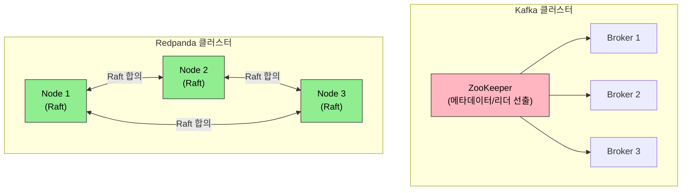

# Redpanda Operator

> Redpanda는 C++/Seastar로 구현된 Kafka 호환 스트리밍 플랫폼이다. JVM 없이 동작하며, Schema Registry와 REST Proxy를 내장한다. Kubernetes에서는 Operator 패턴으로 배포와 운영을 자동화한다.


## 학습 목표
> Kafka 호환 메시징을 더 가볍게 운영하는 Redpanda 관점을 다루는 장이다.

이 장에서 확인할 목표는 다음과 같다:

1. Redpanda가 JVM 기반 Kafka와 설계 철학에서 어떻게 다른지 이해할 수 있다.
2. Strimzi와의 비교를 통해 두 Operator의 운영 철학 차이를 설명할 수 있다.
3. `Redpanda` CR의 핵심 필드를 읽고 배포 결과를 예측할 수 있다.
4. Schema Registry 내장의 의미와 트레이드오프를 이해할 수 있다.
5. minikube에서 Redpanda를 실행하기 위한 리소스 조정 전략을 세울 수 있다.


## 1. Redpanda 설계 철학
> Redpanda가 왜 Kafka 대안으로 주목받는지 구조적 차이를 먼저 본다.

### 1.1 C++/Seastar 기반 아키텍처

Redpanda는 처음부터 JVM 없이 C++로 작성됐다. 동시성 모델로 Seastar 프레임워크를 사용한다. Seastar는 CPU 코어 하나에 스레드 하나를 고정 배치하고(Shared-Nothing), 코어 간 데이터 이동을 최소화해 컨텍스트 스위칭 오버헤드를 제거한다. 메모리도 코어별로 파티셔닝한다.

이 설계의 실질적 효과는 두 가지다. GC 중단이 없어 tail latency가 안정적이다. JVM Kafka에서 p99 응답 시간이 GC 주기에 따라 튀는 현상이 Redpanda에서는 나타나지 않는다. 메모리 사용도 예측 가능하다. JVM Heap 크기와 GC 튜닝 없이 컨테이너 메모리 Limits를 예측대로 설정할 수 있다.

### 1.2 Raft 기반 복제

Kafka는 ZooKeeper(또는 KRaft)로 메타데이터를 관리하고, 파티션 리더를 선출한다. Redpanda는 ZooKeeper가 없다. 파티션 단위로 Raft 합의 알고리즘을 직접 구현해 리더 선출과 데이터 복제를 모두 처리한다. 외부 코디네이터 의존성이 없어 배포 구성이 단순하고, 노드 장애 시 복구 시간이 빠르다.



### 1.3 내장 Schema Registry

Redpanda는 Schema Registry를 별도 프로세스 없이 내장한다. Confluent Schema Registry는 Kafka 클러스터와 별도로 배포해야 하며 JVM 프로세스다. Redpanda에서는 같은 브로커 포트로 Kafka API와 Schema Registry API를 동시에 사용할 수 있다.

내장의 장점은 운영 단순화다. Schema Registry 장애가 브로커 장애와 분리되지 않는다는 점은 트레이드오프다. 대규모 환경에서 Schema Registry만 독립적으로 스케일할 수 없다. 사용 규모와 격리 요구에 따라 선택이 달라진다.


## 2. Strimzi vs Redpanda Operator
> 두 Operator가 같은 문제를 어떤 방식으로 다르게 푸는지 비교한다.

두 Operator는 대상 워크로드와 설계 철학이 다르다.

| 기준 | Strimzi | Redpanda Operator |
|------|---------|-------------------|
| 대상 | Apache Kafka (JVM) | Redpanda (C++) |
| CRD 수 | Kafka, KafkaTopic, KafkaUser 등 다수 | Redpanda, Topic |
| 업그레이드 | 롤링 업그레이드, 버전 간 마이그레이션 자동화 | StatefulSet 롤링 업데이트 |
| 네트워크 | 내부/외부 리스너 세분화 | Kafka API, Schema Registry, Admin API, REST Proxy 포트 통합 |
| 기존 Kafka 호환 | 기존 클러스터 이관에 유리 | Kafka 클라이언트 호환, 브로커는 Redpanda |

Strimzi는 기존 Kafka 워크로드를 Kubernetes로 옮기는 시나리오에 적합하다. Redpanda Operator는 새로운 스트리밍 플랫폼을 Kubernetes 네이티브로 시작하는 시나리오에 어울린다.


## 3. Redpanda CR 구조
> Redpanda 클러스터를 선언형으로 표현하는 주요 필드를 살핀다.

`Redpanda` CR로 클러스터 전체를 선언한다.

```yaml
apiVersion: cluster.redpanda.com/v1alpha2
kind: Redpanda
metadata:
  name: redpanda
  namespace: redpanda
spec:
  clusterSpec:
    statefulset:
      replicas: 3
    resources:
      cpu:
        cores: 1
      memory:
        container:
          max: 2Gi
    storage:
      persistentVolume:
        size: 20Gi
    listeners:
      kafka:
        port: 9092
      schemaRegistry:
        port: 8081
      adminApi:
        port: 9644
```

`Topic` CR은 토픽을 선언적으로 관리한다. `kubectl apply`로 토픽을 생성하고 `kubectl delete`로 삭제한다. 파티션 수와 복제 인수를 스펙으로 정의하므로 토픽 설정이 Git에 기록된다.

공식 문서에서는 Helm과 Operator를 분리해 안내한다. Helm은 단순 배포에 적합하고, Operator는 설치 이후 업데이트와 정리까지 포함한 생명주기 관리에 적합하다. 그래서 학습용 단일 노드는 Helm도 충분하지만, GitOps와 운영 자동화를 연결하려면 Operator 쪽이 더 자연스럽다.


## 4. minikube에서의 실행 전략
> 학습 환경에서 Redpanda를 무리 없이 띄우기 위한 현실적 전략을 정리한다.

Redpanda는 기본값이 프로덕션 워크로드를 위해 설계됐다. 기본 메모리 요구사항(2.5GB 이상)이 로컬 환경에서 부담이 된다. 학습 목적으로 실행할 때는 두 가지를 조정한다.

1. 리소스를 최소화한다. `cpu.cores: 1`, `memory.container.max: 2Gi`, `storage.size: 5Gi`로 줄인다.
2. `developerMode: true`를 활성화한다. 이 모드는 프로덕션 안전 검사(fsync, 최소 복제본 수 검증 등)를 완화해 단일 노드로도 기동할 수 있게 한다.

```yaml
spec:
  clusterSpec:
    config:
      developerMode: true
    resources:
      cpu:
        cores: 1
      memory:
        container:
          max: 2Gi
```

minikube에는 최소 4GB 메모리를 할당(`minikube start --memory=4096`)해야 Redpanda 단일 노드와 시스템 Pod가 공존할 수 있다.


## 5. Tiered Storage
> 스토리지 비용과 보관 기간 문제를 완화하는 Redpanda의 차별점을 다룬다.

Tiered Storage는 오래된 세그먼트를 S3나 GCS 같은 오브젝트 스토리지로 자동으로 내보내는 기능이다. 브로커 디스크는 최신 데이터만 유지하고, 클라이언트는 투명하게 오래된 데이터도 읽을 수 있다. 보존 기간을 늘리면서 브로커 스토리지 비용을 줄이는 데 효과적이다. Kafka에서 동일 기능은 Confluent Tiered Storage(유료) 또는 커뮤니티 플러그인으로 제한적으로 지원한다.


## 6. 다음 단계
> 데이터 플랫폼 사례를 마무리하고 DevTools 장으로 넘어간다.

Ch17에서는 RBAC과 보안을 다룬다. Redpanda 클러스터에 접근하는 사용자와 서비스 계정의 권한을 최소화하는 Kubernetes RBAC 설계가 이어진다.


## 관련 문서
> Kafka 장과 다음 Jenkins 장, 점검 문서를 함께 둔다.

- [Redpanda Operator 점검](06-06.Redpanda%20Operator%20%EC%A0%90%EA%B2%80.md) — 본 장의 점검 편
- [Kafka Operator](06-05.Kafka%20Operator.md) — 이전 절, Strimzi 기반 Kafka 운영
- [Jenkins on K8s](../04_devtools/07-01.Jenkins%20on%20K8s.md) — 다음 장, CI/CD 자동화
