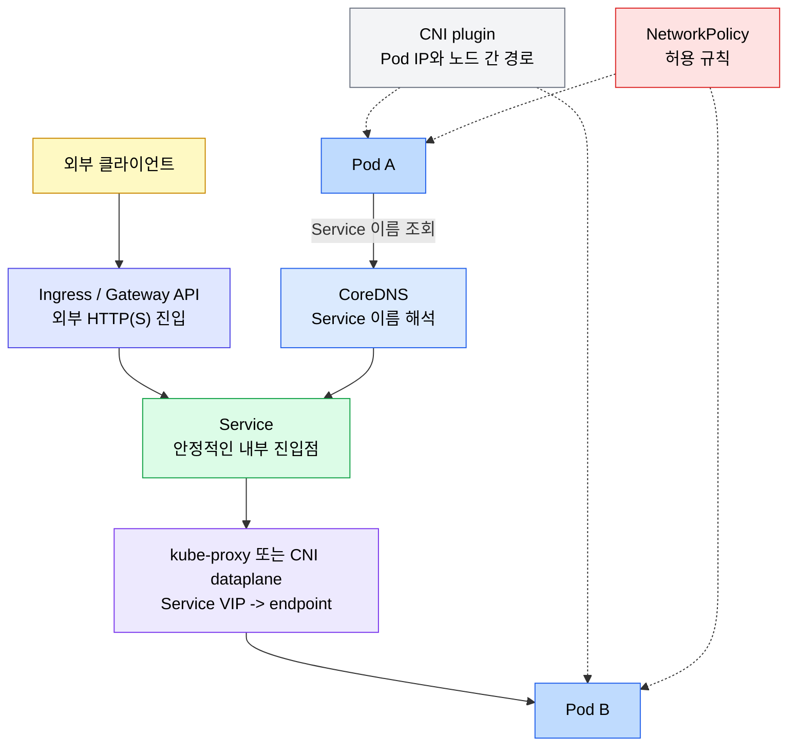
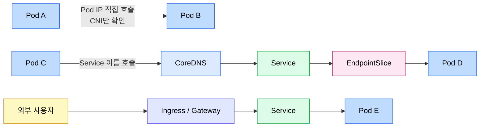

# 네트워킹

> Kubernetes 네트워킹은 Pod IP 모델 위에 Service, DNS, Ingress/Gateway API, NetworkPolicy가 층을 이루는 구조다. 이 문서는 전체 지도를 잡고, 세부 구현은 04-02부터 04-06까지의 문서로 나눠 읽는다. 파일 번호 순서가 곧 권장 학습 순서다 — 04-02 Pod·Linux 기반, 04-03 오버레이·BGP, 04-04 Service, 04-05 DNS, 04-06 Ingress/Gateway 순으로 한 단씩 위로 올라간다.


## 학습 목표
> 네트워크 장애를 계층별로 분리해서 볼 수 있도록 큰 흐름을 먼저 고정한다.

이 장에서 확인할 목표는 다음과 같다:

1. Kubernetes 네트워킹의 기본 요구사항을 Pod IP 모델과 연결해 설명할 수 있다.
2. CNI, CoreDNS, Service dataplane, Ingress Controller의 책임을 구분할 수 있다.
3. Pod-to-Pod, Pod-to-Service, External-to-Service 요청 경로를 구분할 수 있다.
4. NetworkPolicy가 연결성 위에 얹히는 정책 계층임을 이해할 수 있다.
5. Service Mesh가 Kubernetes 기본 네트워킹 위에서 어떤 문제를 추가로 푸는지 선을 그을 수 있다.


## 1. 네트워크 모델
> Kubernetes는 Pod가 클러스터 안에서 직접 통신할 수 있다는 전제를 모든 네트워크 기능의 기반으로 삼는다.

Kubernetes 공식 문서가 제시하는 핵심 요구사항은 단순하다. 모든 Pod는 고유한 IP를 가져야 하고, Pod끼리는 NAT 없이 서로 통신할 수 있어야 하며, 노드의 에이전트도 해당 Pod와 통신할 수 있어야 한다. 이 요구사항 덕분에 애플리케이션은 "내가 어느 노드에 떠 있는가"보다 "상대 Pod 또는 Service가 어디에 있는가"에 집중할 수 있다.

이 모델의 구현은 CNI(Container Network Interface) 플러그인에 맡겨진다. Calico, Cilium, Flannel 같은 구현체가 Pod IP 할당, 노드 간 라우팅, 오버레이/언더레이 네트워크 구성을 담당한다. 즉 CNI는 Pod 네트워크를 만드는 계층이고, Service 라우팅이나 DNS 이름 해석을 전부 담당하는 계층은 아니다.

Pod IP는 안정적인 주소가 아니다. Pod가 재생성되면 IP가 바뀔 수 있고, Deployment가 롤링 업데이트되면 백엔드 Pod 집합도 계속 변한다. 그래서 Kubernetes는 Service, EndpointSlice, DNS를 함께 사용해 "변하는 Pod 집합"을 "안정적인 이름과 가상 IP" 뒤에 숨긴다.


## 2. 책임 분리 지도
> 네트워크 장애를 빠르게 좁히려면 컴포넌트가 맡은 일을 섞지 않아야 한다.

Kubernetes 네트워크 계층은 다음처럼 나눠서 보는 것이 가장 안전하다:

- CNI: Pod IP를 만들고 노드 간 Pod-to-Pod 경로를 구성한다.
- CoreDNS: Service와 Pod 이름을 DNS 질의에 응답한다.
- Service dataplane: Service VIP 또는 ClusterIP로 들어온 트래픽을 Ready endpoint로 전달한다.
- Ingress Controller: 외부 HTTP/HTTPS 요청을 host/path 규칙에 따라 Service로 보낸다.
- Gateway API Controller: GatewayClass, Gateway, Route 리소스를 읽어 더 확장된 진입 계층을 구현한다.
- NetworkPolicy 구현체: Pod 간 ingress/egress 허용 규칙을 적용한다.

전체 관계는 다음과 같다:



장애를 볼 때도 이 그림의 순서로 쪼갠다. Pod IP끼리 직접 통신이 안 되면 CNI와 노드 라우팅을 먼저 본다. IP로는 붙는데 이름이 안 풀리면 CoreDNS를 본다. 이름은 ClusterIP로 풀리는데 Pod로 가지 않으면 Service, EndpointSlice, kube-proxy 또는 dataplane을 본다. 경로는 있는데 특정 Pod 사이만 막히면 NetworkPolicy를 본다.


## 3. 대표 트래픽 경로
> 같은 "통신 실패"라도 어떤 경로인지에 따라 봐야 할 리소스가 달라진다.

Pod-to-Pod 직접 통신은 CNI 경로만 탄다. 가장 단순하지만 Pod IP가 바뀌기 쉬워 애플리케이션 간 통신의 기본 방식으로는 적합하지 않다. 디버깅할 때 "CNI 자체가 살아 있는가"를 확인하는 용도로 유용하다.

Pod-to-Service 통신은 DNS와 Service dataplane을 함께 탄다. 클라이언트 Pod가 `backend.default.svc.cluster.local`을 조회하면 CoreDNS가 Service의 ClusterIP를 반환하고, kube-proxy 또는 CNI dataplane이 해당 VIP를 실제 EndpointSlice의 Ready Pod로 연결한다.

External-to-Service 통신은 Ingress, Gateway API, NodePort, LoadBalancer 같은 외부 진입 계층을 거친다. HTTP/HTTPS 라우팅은 보통 Ingress 또는 Gateway API에서 처리하고, 최종 backend는 다시 Service다.

흐름을 비교하면 다음과 같다:




## 4. 세부 문서로 나누어 읽기
> 공식 문서처럼 Service, Ingress, DNS를 분리해 읽는 편이 개념이 덜 섞인다.

네트워킹 세부 주제는 다음 문서에서 따로 다룬다:

| 주제 | 문서 | 다루는 범위 |
|------|------|-------------|
| Pod 네트워크와 Linux 기반 | [Pod 네트워크와 Linux 기반](./04-02.Pod%20%EB%84%A4%ED%8A%B8%EC%9B%8C%ED%81%AC%EC%99%80%20Linux%20%EA%B8%B0%EB%B0%98.md) | Pause 컨테이너, network namespace, veth, bridge, Pod CIDR, CNI, kube-proxy dataplane(iptables/nftables/IPVS/eBPF) |
| 오버레이와 노드 간 트래픽 | [오버레이와 노드 간 트래픽](./04-03.%EC%98%A4%EB%B2%84%EB%A0%88%EC%9D%B4%EC%99%80%20%EB%85%B8%EB%93%9C%20%EA%B0%84%20%ED%8A%B8%EB%9E%98%ED%94%BD.md) | VXLAN 캡슐화, 네이티브 라우팅, Cilium BGP·IPAM 모드, MetalLB L2/BGP, ECMP 경로 제한 |
| Service와 EndpointSlice | [Service와 EndpointSlice](./04-04.Service%EC%99%80%20EndpointSlice.md) | ClusterIP, VIP, EndpointSlice, kube-proxy/dataplane, Service 타입, 트래픽 정책 |
| DNS와 CoreDNS | [DNS와 CoreDNS](./04-05.DNS%EC%99%80%20CoreDNS.md) | Service/Pod DNS 레코드, Headless Service, `dnsPolicy`, `dnsConfig`, CoreDNS ConfigMap |
| Ingress와 Gateway API | [Ingress와 Gateway API](./04-06.Ingress%EC%99%80%20Gateway%20API.md) | Ingress 리소스, Ingress Controller, Gateway API 역할 분리, TLS 진입 |
| NetworkPolicy | [RBAC과 보안](./10-02.RBAC%EA%B3%BC%20%EB%B3%B4%EC%95%88.md) | default-deny, ingress/egress 허용, namespace 경계와 보안 정책 |

Pod IP가 어떻게 할당되고 패킷이 노드 사이를 어떻게 건너가는지에 관한 Linux 기반 메커니즘은 04-02 문서에서 별도로 다룬다. Service나 DNS 같은 상위 추상이 헷갈리기 시작할 때 그 문서로 한 단계 내려가면 디버깅 진입점이 분명해진다.

이 문서에는 세부 YAML과 구현 차이를 길게 두지 않는다. 대신 어느 계층을 먼저 봐야 하는지, 그리고 더 깊은 설명이 어느 문서에 있는지를 연결하는 역할을 한다.


## 5. 디버깅 진입 순서
> "네트워크가 안 된다"를 구체적인 실패 지점으로 쪼개야 한다.

내부 통신이 안 되면 다음 순서로 확인한다:

1. Pod IP끼리 직접 통신되는지 확인한다. 실패하면 CNI, 노드 라우팅, NetworkPolicy를 먼저 본다.
2. Service 이름이 ClusterIP로 해석되는지 확인한다. 실패하면 CoreDNS와 Pod의 `resolv.conf`를 본다.
3. Service에 Ready endpoint가 있는지 확인한다. 없으면 selector, readiness probe, EndpointSlice를 본다.
4. ClusterIP로 접근되는지 확인한다. 실패하면 kube-proxy, CNI dataplane, Service port/targetPort를 본다.
5. 외부 요청만 실패하면 Ingress Controller, Ingress/Gateway 규칙, LoadBalancer/NodePort 노출을 본다.

자주 쓰는 확인 명령은 다음과 같다:

```bash
kubectl get pods -o wide
kubectl get svc
kubectl get endpointslices
kubectl get ingress
kubectl run dns-test --image=busybox:1.36 -it --rm -- nslookup kubernetes.default
```


## 6. Service Mesh와의 경계
> Kubernetes 네트워킹은 "붙을 수 있는가"를, Service Mesh는 "어떤 정책으로 호출할 것인가"를 더 깊게 다룬다.

Kubernetes 기본 네트워킹은 연결성과 기본 노출을 책임진다. CNI는 Pod 네트워크를 만들고, Service와 EndpointSlice는 변하는 Pod 집합에 안정적인 진입점을 제공하고, Ingress와 Gateway API는 외부 진입을 다루며, NetworkPolicy는 L3/L4 수준의 접근 제어를 제공한다.

Service Mesh는 그 위에서 서비스 간 호출 정책을 다룬다. 예를 들어 가중치 기반 트래픽 분할, 재시도와 타임아웃의 공통화, 서비스 간 mTLS, L7 관측성은 기본 Kubernetes 네트워킹만으로는 충분하지 않다.

따라서 장애 분석도 순서가 중요하다. Service로도 연결이 안 되면 메시를 보기 전에 CNI, DNS, Service, EndpointSlice를 먼저 확인한다. 연결은 되지만 트래픽 정책, 보안, 관측성이 문제라면 Service Mesh 문서로 넘어간다.


## 다음 단계
> 세부 주제는 Service와 EndpointSlice, Ingress와 Gateway API, DNS와 CoreDNS 문서로 이어진다.

다음으로는 Service가 실제 Pod 집합을 어떻게 추적하고, Ingress/Gateway가 외부 요청을 Service로 어떻게 연결하며, CoreDNS가 Service discovery를 어떻게 제공하는지 각각 분리해서 본다.


## 관련 문서
> 네트워크 세부 문서와 서비스 메시 문서를 함께 둔다.

- [네트워킹 점검](./deepdive/04-01.%EB%84%A4%ED%8A%B8%EC%9B%8C%ED%82%B9%20점검.md) — 본 장의 점검 편
- [Pod 네트워크와 Linux 기반](./04-02.Pod%20%EB%84%A4%ED%8A%B8%EC%9B%8C%ED%81%AC%EC%99%80%20Linux%20%EA%B8%B0%EB%B0%98.md) — Pause·netns·veth·Pod CIDR·CNI·kube-proxy dataplane
- [오버레이와 노드 간 트래픽](./04-03.%EC%98%A4%EB%B2%84%EB%A0%88%EC%9D%B4%EC%99%80%20%EB%85%B8%EB%93%9C%20%EA%B0%84%20%ED%8A%B8%EB%9E%98%ED%94%BD.md) — VXLAN·네이티브 라우팅·BGP·MetalLB·ECMP
- [Service와 EndpointSlice](./04-04.Service%EC%99%80%20EndpointSlice.md) — Service 내부 동작과 백엔드 추적
- [DNS와 CoreDNS](./04-05.DNS%EC%99%80%20CoreDNS.md) — 서비스 디스커버리와 DNS 운영
- [Ingress와 Gateway API](./04-06.Ingress%EC%99%80%20Gateway%20API.md) — 외부 트래픽 진입 계층
- [서비스 메시 기초](../service-mesh/01-01.%EC%84%9C%EB%B9%84%EC%8A%A4%20%EB%A9%94%EC%8B%9C%20%EA%B8%B0%EC%B4%88.md) — 서비스 간 L7 정책과 보안
