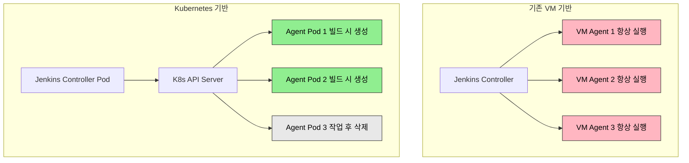

# Jenkins on K8s

> Jenkins를 Kubernetes 위에 올리면 CI/CD 인프라의 운영 방식이 바뀝니다. VM 기반 고정 에이전트 대신 빌드마다 새로운 Pod를 생성하고 작업이 끝나면 삭제합니다. Helm 차트로 설치하고, Configuration as Code(JCasC)로 설정을 버전 관리하며, Kubernetes Plugin으로 동적 에이전트를 관리합니다.


## 학습 목표
> Jenkins를 Kubernetes 네이티브 CI 엔진으로 운영하는 관점을 다루는 장입니다.

이 장에서 확인할 목표는 다음과 같다:

1. Jenkins를 Kubernetes에 배포하는 이유와 아키텍처 변화를 설명할 수 있습니다.
2. Helm 차트를 사용한 설치 및 구성 방법을 이해할 수 있습니다.
3. JCasC로 Jenkins 설정을 자동화하는 방식을 설명할 수 있습니다.
4. Kubernetes Plugin과 동적 에이전트 Pod 운영 방식을 이해할 수 있습니다.
5. Jenkinsfile에서 Kubernetes agent를 사용하는 파이프라인을 작성하는 흐름을 설명할 수 있습니다.
6. PVC를 통해 Jenkins Home을 영속화하는 이유를 설명할 수 있습니다.
7. RBAC과 ServiceAccount로 Jenkins 권한을 최소화하는 방법을 이해할 수 있습니다.


## 1. 왜 Jenkins를 Kubernetes에 올리는가
> 정적인 VM 에이전트와 비교해 Kubernetes가 주는 운영 이점을 먼저 봅니다.

전통적인 Jenkins 운영 방식은 고정된 VM 에이전트를 미리 프로비저닝하고, 빌드 작업이 들어오면 idle 상태의 에이전트에 할당하는 구조입니다. 이 방식은 여러 문제를 안고 있습니다. 피크 타임을 대비해 에이전트를 많이 띄워두면 대부분의 시간 동안 idle 상태로 리소스를 낭비합니다. 같은 에이전트에서 여러 빌드가 실행되면서 파일 시스템이 오염되고, 트래픽이 갑자기 증가해도 에이전트를 수동으로 추가해야 합니다.

Kubernetes에 Jenkins를 올리면 이 문제들이 자연스럽게 해결됩니다. 빌드가 시작되면 새로운 Pod를 생성하고 끝나면 삭제하므로 매번 깨끗한 환경에서 시작합니다. 필요할 때만 Pod를 생성하므로 평균 리소스 사용량이 크게 줄어들며, Pod Template에 컨테이너 이미지와 리소스를 선언하면 모든 에이전트가 동일한 환경을 갖습니다. Kubernetes Cluster Autoscaler와 결합하면 빌드 트래픽이 급증할 때 노드 자체를 자동으로 추가할 수도 있습니다.




## 2. Jenkins Helm 차트 구조
> Jenkins 설치와 운영에 필요한 배포 단위를 어떤 값으로 제어하는지 정리합니다.

Jenkins를 Kubernetes에 수동으로 배포하려면 Deployment, Service, ConfigMap, Secret, PVC, ServiceAccount, RBAC 등 수십 개의 리소스를 작성해야 합니다. 공식 Jenkins Helm 차트(`jenkinsci/jenkins`)는 이 모든 것을 패키징하고 `values.yaml`로 커스터마이징할 수 있게 해줍니다.

주요 구성 요소는 다음과 같습니다. **Controller**는 Jenkins 마스터 노드를 Deployment로 배포하고, 웹 UI, 작업 스케줄링, 플러그인 관리를 담당합니다. **PVC**는 Jenkins Home 디렉토리(`/var/jenkins_home`)를 영속화하여 작업 기록, 플러그인, 자격 증명을 보존합니다. **ServiceAccount**와 **RBAC**은 Jenkins Controller가 Kubernetes API를 호출할 때 사용할 권한을 최소 범위로 제한합니다. **ConfigMap(JCasC)**은 `jenkins.yaml` 파일로 Jenkins 전체 설정을 자동화합니다.

| 파라미터 | 설명 | 기본값 |
|----------|------|--------|
| `controller.resources` | CPU/메모리 요청/제한 | requests: 256Mi/50m |
| `controller.serviceType` | Service 타입 | `ClusterIP` |
| `controller.installPlugins` | 설치할 플러그인 목록 | kubernetes, workflow 등 |
| `controller.JCasC.configScripts` | JCasC 설정 | `{}` |
| `persistence.enabled` | PVC 사용 여부 | `true` |
| `persistence.size` | PVC 크기 | `8Gi` |
| `rbac.create` | RBAC 리소스 생성 | `true` |


## 3. Configuration as Code (JCasC)
> UI 클릭 대신 설정 파일로 Jenkins를 관리하는 방식을 설명합니다.

Jenkins는 전통적으로 웹 UI에서 수동으로 설정합니다. 이 방식은 재현이 불가능하고, 버전 관리가 어려우며, 환경마다 다르게 설정하는 실수가 발생하기 쉽습니다.

JCasC 플러그인은 이 문제를 해결합니다. `jenkins.yaml` 파일 하나에 모든 설정을 선언하면 Jenkins가 시작할 때 자동으로 적용합니다. 예를 들어, Kubernetes Plugin 설정을 JCasC로 작성하면 다음과 같습니다.

```yaml
jenkins:
  clouds:
    - kubernetes:
        name: "kubernetes"
        serverUrl: "https://kubernetes.default"
        namespace: "jenkins"
        jenkinsUrl: "http://jenkins:8080"
        jenkinsTunnel: "jenkins-agent:50000"
        templates:
          - name: "default-agent"
            label: "default"
            containers:
              - name: "jnlp"
                image: "jenkins/inbound-agent:latest"
                resourceRequestCpu: "100m"
                resourceRequestMemory: "256Mi"
```

이 설정을 `values.yaml`의 `controller.JCasC.configScripts`에 넣으면 Helm install 시 Jenkins가 시작할 때 Kubernetes 클라우드가 자동으로 설정됩니다. 설정을 Git에 커밋하고 PR 리뷰를 거쳐 변경할 수 있으므로 GitOps 방식으로 Jenkins 전체를 관리할 수 있습니다.

공식 설치 문서 기준으로 Jenkins on Kubernetes의 핵심은 "Controller는 오래 살아남고, Agent는 짧게 생성됐습니다 사라진다"는 역할 분리입니다. 따라서 JCasC와 PVC는 Controller 쪽 상태를 안정화하는 장치이고, 에이전트 Pod는 최대한 무상태에 가깝게 유지하는 것이 운영 난도를 낮춥니다.

| 섹션 | 설명 |
|------|------|
| `jenkins.clouds` | Kubernetes, Docker 등 클라우드 프로바이더 설정 |
| `jenkins.securityRealm` | Local, LDAP, GitHub OAuth 인증 방식 |
| `credentials.system` | SSH 키, API 토큰, Secret text |
| `tool` | JDK, Maven, Git 도구 자동 설치 |


## 4. Kubernetes Plugin과 동적 에이전트
> 빌드마다 에이전트를 만들고 버리는 실행 모델을 정리합니다.

Jenkins Kubernetes Plugin은 Jenkins와 Kubernetes API를 연결합니다. Controller가 빌드를 스케줄링하면, 플러그인이 Kubernetes API에 Pod 생성 요청을 보내고 새로운 에이전트 Pod가 뜹니다. 빌드가 끝나면 Pod는 자동으로 삭제됩니다.

핵심 개념은 **Pod Template**입니다. Pod Template은 에이전트 Pod의 명세를 정의하며, 컨테이너 이미지, 리소스 요청/제한, 볼륨, 환경 변수, Label을 포함합니다. Pod Template은 두 가지 방식으로 정의할 수 있습니다.

1. JCasC에서 정적으로 정의합니다. 웹 UI에서 레이블을 선택하면 해당 Pod Template이 사용됩니다.
2. Jenkinsfile에서 동적으로 정의합니다. 프로젝트마다 다른 환경을 사용할 수 있어서 유연합니다.

```groovy
pipeline {
  agent {
    kubernetes {
      yaml """
apiVersion: v1
kind: Pod
spec:
  containers:
  - name: maven
    image: maven:3.8-jdk11
    command: ['sleep']
    args: ['infinity']
"""
    }
  }
  stages {
    stage('Build') {
      steps {
        container('maven') {
          sh 'mvn clean package'
        }
      }
    }
  }
}
```

동작 흐름은 이렇습니다. Controller가 빌드를 스케줄링하면 Kubernetes Plugin이 Pod Template을 읽고 Kubernetes API에 Pod 생성을 요청합니다. Kubernetes가 이미지를 pull하고 Pod를 시작하면 Pod 안의 JNLP 에이전트가 Controller의 50000 포트로 연결합니다. Controller가 빌드 명령을 전달하고, 빌드가 끝나면 Pod가 삭제됩니다.


## 5. 설치 과정
> 실제 배포 흐름과 확인 포인트를 한 번에 묶습니다.

**Step 1: Helm 차트 저장소 추가**

```bash
helm repo add jenkinsci https://charts.jenkins.io
helm repo update
```

**Step 2: values.yaml 작성 (minikube 기준)**

```yaml
controller:
  image: "jenkins/jenkins"
  tag: "2.440-jdk17"
  resources:
    requests:
      cpu: "100m"
      memory: "512Mi"
    limits:
      cpu: "500m"
      memory: "1Gi"
  serviceType: NodePort
  nodePort: 32000
  installPlugins:
    - kubernetes:4253.v7700d91739e5
    - workflow-aggregator:600.vb_57cdd26fdd7
    - git:5.6.0
    - configuration-as-code:1810.v9b_c30a_249a_4c
  JCasC:
    defaultConfig: true
    configScripts:
      kubernetes-cloud: |
        jenkins:
          clouds:
            - kubernetes:
                name: "kubernetes"
                serverUrl: "https://kubernetes.default"
                namespace: "jenkins"
                jenkinsUrl: "http://jenkins:8080"
                jenkinsTunnel: "jenkins-agent:50000"

persistence:
  enabled: true
  size: "5Gi"
  storageClass: "standard"

rbac:
  create: true

serviceAccount:
  create: true
  name: jenkins
```

차트와 Jenkins 본체 버전은 분리해서 생각해야 합니다. 공식 차트는 기본적으로 LTS 라인을 겨냥하고 있으므로, 문서에 고정된 이미지 태그를 오래 유지하기보다 설치 시점의 차트 릴리스와 LTS 이미지 조합을 다시 확인하는 편이 안전합니다.

**Step 3: 설치**

```bash
kubectl create namespace jenkins

helm install jenkins jenkinsci/jenkins \
  --namespace jenkins \
  --values values.yaml \
  --wait
```

**Step 4: 초기 Admin 비밀번호 확인**

```bash
kubectl exec -n jenkins jenkins-0 -- \
  cat /run/secrets/additional/chart-admin-password && echo
```

프로덕션에서는 NodePort보다 `Ingress + ClusterIP` 조합이 일반적입니다. NodePort는 학습용으로 단순하지만 인증서, 외부 노출, URL 고정성을 고려하면 Ingress가 더 자연스럽습니다. 반대로 minikube나 단일 노드 학습 환경에서는 NodePort가 가장 설명하기 쉽습니다.


## 6. 멀티 컨테이너 파이프라인
> 하나의 빌드 안에서 여러 도구 이미지를 조합하는 방식을 보여 줍니다.

한 Pod에 여러 컨테이너를 띄우면 각 컨테이너가 특정 도구를 담당합니다. Maven과 Docker를 분리하면 이미지 크기가 작아지고 캐싱 효율이 좋아집니다.

```groovy
pipeline {
  agent {
    kubernetes {
      yaml """
apiVersion: v1
kind: Pod
spec:
  containers:
  - name: maven
    image: maven:3.8-jdk11
    command: ['sleep']
    args: ['infinity']
  - name: docker
    image: docker:24-dind
    securityContext:
      privileged: true
"""
    }
  }
  stages {
    stage('Build') {
      steps {
        container('maven') {
          sh 'mvn clean package'
        }
      }
    }
    stage('Docker Build') {
      steps {
        container('docker') {
          sh 'docker build -t myapp:latest .'
        }
      }
    }
  }
}
```


## 7. 보안 고려사항
> Jenkins가 강한 권한을 가지기 쉬운 도구라는 점을 먼저 경계합니다.

Jenkins Controller는 Kubernetes API를 호출해서 Pod를 생성하고 삭제합니다. Helm 차트는 `rbac.create: true`로 자동으로 Role과 RoleBinding을 생성하며, 기본 권한은 Pod 생성/삭제/조회, pods/exec, pods/log 읽기로 최소화되어 있습니다.

```yaml
rules:
  - apiGroups: [""]
    resources: ["pods"]
    verbs: ["create", "delete", "get", "list", "watch"]
  - apiGroups: [""]
    resources: ["pods/exec"]
    verbs: ["create", "get"]
  - apiGroups: [""]
    resources: ["pods/log"]
    verbs: ["get", "list"]
```

자격 증명은 Kubernetes Secret으로 관리하고, JCasC에서 환경 변수를 통해 참조하는 것이 안전합니다. `rbac.readSecrets: true`는 모든 Secret 읽기를 허용하므로, 특정 Secret만 지정하는 방식이 권장됩니다.


## 8. minikube 리소스 설정
> 학습 환경에서 Jenkins가 차지하는 자원 규모를 현실적으로 잡습니다.

| 구성 요소 | Requests | Limits |
|----------|----------|--------|
| Jenkins Controller | CPU 100m, Memory 512Mi | CPU 500m, Memory 1Gi |
| Default Agent | CPU 100m, Memory 256Mi | CPU 200m, Memory 512Mi |
| Maven Agent | CPU 200m, Memory 512Mi | CPU 500m, Memory 1Gi |

Pod가 Pending 상태로 머물면서 "Insufficient memory" 이벤트가 발생하면 `kubectl describe pod -n jenkins <pod-name>`으로 이벤트를 확인합니다. 동시 빌드 수를 제한할 때는 `options { disableConcurrentBuilds() }`를 Jenkinsfile에 추가합니다.


## 9. 정리
> Jenkins on K8s에서 기억해야 할 운영 포인트를 짧게 묶습니다.

핵심 개념 체크리스트:

- Jenkins on K8s: 빌드마다 새 Pod를 생성하고 작업 후 삭제하는 동적 에이전트 구조
- Helm 차트: `jenkinsci/jenkins`, `values.yaml`로 전체 스택 커스터마이징
- JCasC: `jenkins.yaml`로 설정을 코드화, GitOps와 자연스럽게 통합
- Pod Template: JCasC 정적 정의 또는 Jenkinsfile 동적 정의, Jenkinsfile이 우선
- JNLP: 에이전트가 Controller에 먼저 연결하는 inbound 방식, 50000 포트
- PVC: Jenkins Home 영속화 필수, 데이터 손실 방지
- RBAC: 최소 권한 원칙, Role로 Namespace 범위 제한


## 관련 문서
> Operator 사례 이후 DevTools 흐름으로 넘어가는 연결을 정리합니다.

- [Jenkins on K8s 점검](04-01.Jenkins%20on%20K8s%20%EC%A0%90%EA%B2%80.md) — 본 장의 점검 편
- [Redpanda Operator](../03_platform/03-10.Redpanda%20Operator.md) — 이전 장, Operator 패턴 마무리
- [SonarQube on K8s](04-02.SonarQube%20on%20K8s.md) — 다음 장, 코드 품질 자동화
