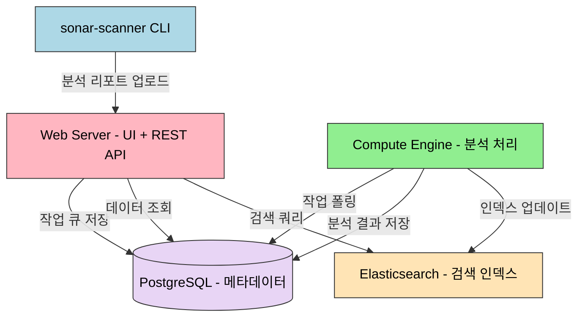

# SonarQube on K8s

> SonarQube는 정적 분석으로 코드 품질을 측정하고, Quality Gate로 배포 가부를 자동 판단한다. Helm 차트로 Kubernetes에 설치하고, PostgreSQL과 연동하며, Jenkins 파이프라인에 통합한다. 코드 커버리지, 버그, 보안 취약점, 코드 스멜을 추적하고 팀의 품질 기준을 강제할 수 있다.


## 학습 목표
> SonarQube를 Kubernetes 위에서 품질 게이트 엔진으로 운영하는 장이다.

이 장에서 확인할 목표는 다음과 같다:

1. SonarQube의 가치와 정적 분석의 필요성을 설명할 수 있다.
2. 아키텍처(Web Server, Compute Engine, Elasticsearch, DB)를 파악할 수 있다.
3. Edition 간 차이를 비교하고 팀에 맞는 선택 기준을 세울 수 있다.
4. Helm 차트로 설치하고 PostgreSQL을 연동하는 흐름을 이해할 수 있다.
5. `sonar-scanner`로 프로젝트 분석을 실행하는 방법을 설명할 수 있다.
6. Quality Gate와 Quality Profile을 설정하는 이유를 설명할 수 있다.
7. Jenkins 파이프라인과 통합해 배포 가부를 자동 판단하는 흐름을 이해할 수 있다.
8. 리소스 제약 환경에서 SonarQube를 안정적으로 운영하는 포인트를 정리할 수 있다.


## 1. 왜 SonarQube인가
> 정적 분석이 CI/CD 안에서 어떤 역할을 하는지 먼저 정리한다.

코드 리뷰는 버그를 잡고 품질을 높이는 강력한 방법이지만, 리뷰어는 비즈니스 로직과 아키텍처에 집중해야 한다. "이 변수는 안 쓰이네요", "null 체크가 없어요" 같은 기계적인 지적에 시간을 쓰는 것은 비효율적이다.

정적 분석은 코드를 실행하지 않고 소스코드를 읽어서 잠재적 버그, 보안 취약점, 코드 스멜을 찾는다. SonarQube는 이 분석을 자동화하고, 결과를 시각화하며, 품질 기준을 강제하는 플랫폼이다. Quality Gate는 "커버리지 80% 미만이면 배포 금지" 같은 기준을 설정하고 CI/CD 파이프라인에서 자동으로 체크한다. 시간에 따른 버그 수, 커버리지, 기술 부채를 그래프로 보여주므로 팀의 품질 개선을 객관적으로 측정할 수 있다.


## 2. SonarQube 아키텍처
> SonarQube가 어떤 구성 요소로 동작하는지 운영 관점에서 본다.

SonarQube는 단일 바이너리가 아니라 여러 컴포넌트로 구성된 분산 시스템이다.



**Web Server**는 UI와 REST API를 제공하며 기본 포트는 9000이다. **Compute Engine**은 백그라운드 워커로, sonar-scanner가 분석 리포트를 업로드하면 DB 큐에서 작업을 가져와 처리한다. 이슈 생성, 메트릭 계산, Elasticsearch 인덱싱이 이 단계에서 이루어진다. **Elasticsearch**는 코드와 이슈 검색에 사용되며 SonarQube 7.x부터 내장되어 있다. **PostgreSQL**은 모든 프로젝트 메타데이터, 이슈, 측정값을 영속화한다. 내장 H2는 테스트 용도일 뿐 프로덕션에서는 사용하면 안 된다.

| 구성 요소 | 역할 | 메모리 사용 |
|----------|------|-------------|
| Web Server | UI + REST API | 512Mi~1Gi |
| Compute Engine | 백그라운드 분석 처리 | 512Mi~2Gi |
| Elasticsearch | 코드/이슈 검색 인덱스 | 512Mi~1Gi |
| PostgreSQL | 메타데이터 영속화 | 256Mi~512Mi |


## 3. Edition 비교
> 기능 차이를 통해 어떤 배포 모델이 팀에 맞는지 판단한다.

| 기능 | Community | Developer | Enterprise | Data Center |
|------|-----------|-----------|------------|-------------|
| 가격 | 무료 | 유료 | 유료 | 유료 |
| 브랜치 분석 | main만 | 전체 브랜치 | 전체 브랜치 | 전체 브랜치 |
| PR 데코레이션 | 없음 | GitHub/GitLab 코멘트 | 동일 | 동일 |
| 보안 리포트 | 기본 | OWASP, CWE | + PCI-DSS | 동일 |
| 고가용성 | 없음 | 없음 | 없음 | 클러스터 |

Community Edition의 가장 큰 한계는 브랜치 분석 불가다. Feature 브랜치나 PR을 분석하려면 Developer 이상이 필요하다. 소규모 팀이나 개인 프로젝트라면 Community Edition으로 충분하지만, Git Flow를 적극 사용하는 팀은 Developer Edition을 고려해야 한다.


## 4. Helm 차트로 설치
> 선언형 설치와 영속성 구성을 한 번에 정리한다.

```bash
helm repo add sonarqube https://SonarSource.github.io/helm-chart-sonarqube
helm repo update
```

공식 문서 기준으로 SonarQube Helm chart는 최신 SonarQube 버전과 지원되는 Kubernetes 버전 조합을 기준으로 관리된다. 따라서 예시처럼 이미지 태그를 고정해 두더라도, 실제 설치 시에는 차트 지원 범위와 LTS 전용 차트 여부를 먼저 확인하는 편이 안전하다.

minikube 기준 `values.yaml` 핵심 설정이다.

```yaml
image:
  repository: sonarqube
  tag: "10.3.0-community"

resources:
  requests:
    cpu: "200m"
    memory: "1Gi"
  limits:
    cpu: "1000m"
    memory: "2Gi"

jvmOpts: "-Xmx1024m -Xms512m"
elasticsearch:
  javaOpts: "-Xmx512m -Xms512m"

service:
  type: NodePort
  nodePort: 32001

persistence:
  enabled: true
  size: 5Gi
  storageClass: "standard"

postgresql:
  enabled: false

jdbcOverwrite:
  enable: true
  jdbcUrl: "jdbc:postgresql://postgres-postgresql:5432/sonarqube"
  jdbcUsername: "sonarqube"
  jdbcSecretName: "sonarqube-postgres-secret"
  jdbcSecretPasswordKey: "password"

readinessProbe:
  initialDelaySeconds: 60
  periodSeconds: 30
  failureThreshold: 6
```

SonarQube의 특이점은 내장 Elasticsearch다. 공식 문서에서도 인덱스 영속화 옵션은 신중히 보라고 안내한다. 시작 시간은 줄일 수 있지만, Kubernetes의 반복적인 재스케줄링이나 강제 종료와 결합되면 인덱스 손상 위험이 있다. 그래서 학습 문서에서는 "DB 영속화는 필수, Elasticsearch 영속화는 장단점을 따져 결정"으로 정리하는 편이 현실적이다.

PostgreSQL을 별도로 설치하고 Secret을 생성한 뒤 SonarQube를 설치한다.

```bash
helm repo add bitnami https://charts.bitnami.com/bitnami

helm install postgres bitnami/postgresql \
  --namespace sonarqube \
  --create-namespace \
  --set auth.username=sonarqube \
  --set auth.password=sonarqube123 \
  --set auth.database=sonarqube

kubectl create secret generic sonarqube-postgres-secret \
  --from-literal=password=sonarqube123 \
  -n sonarqube

helm install sonarqube sonarqube/sonarqube \
  --namespace sonarqube \
  --values values.yaml \
  --wait --timeout 10m
```

첫 시작은 DB 스키마 생성과 Elasticsearch 초기화로 2~3분 걸린다. 기본 자격 증명은 `admin/admin`이며 첫 로그인 시 비밀번호 변경 프롬프트가 나온다.

현재 운영 문서에서는 단일 인스턴스 SonarQube를 전제로 설명하는 것이 맞다. 고가용성 자체가 필요하면 Data Center Edition과 별도 아키텍처를 봐야 하므로, Community/Developer/Enterprise 일반판을 Kubernetes에 올린다고 해서 자동으로 HA가 생긴다고 이해하면 안 된다.


## 5. 프로젝트 분석 실행
> 실제 코드 분석이 파이프라인 안에서 어떻게 실행되는지 본다.

sonar-scanner CLI로 프로젝트를 분석한다. 프로젝트 루트에 `sonar-project.properties`를 작성한다.

```properties
sonar.projectKey=my-app
sonar.projectName=My Application
sonar.projectVersion=1.0
sonar.sources=src
sonar.tests=src/test
sonar.java.binaries=target/classes
sonar.host.url=http://localhost:32001
sonar.login=<토큰>
```

Maven이나 Gradle을 사용하면 `sonar-project.properties` 없이 플러그인이 경로를 자동 인식한다.

```bash
# Maven
mvn clean verify sonar:sonar \
  -Dsonar.projectKey=my-app \
  -Dsonar.host.url=http://localhost:32001 \
  -Dsonar.login=<토큰>
```


## 6. Quality Gate와 Quality Profile
> 품질 기준을 팀 규칙으로 고정하는 방법을 설명한다.

Quality Gate는 "이 코드를 배포해도 되는가?"를 판단하는 기준이다. 기본 Gate(Sonar way)의 조건은 다음과 같다.

| 조건 | 기준 | 적용 대상 |
|------|------|----------|
| Coverage | < 80% → Failed | New Code |
| Duplications | > 3% → Failed | New Code |
| Maintainability Rating | worse than A | New Code |
| Reliability Rating | worse than A | New Code |
| Security Rating | worse than A | New Code |

신규 코드(New Code)에만 조건을 적용하는 것이 핵심이다. 레거시 프로젝트는 기술 부채가 쌓여 있어서 전체 코드를 기준으로 하면 항상 실패한다. "과거는 용서하되, 미래는 깨끗하게"라는 현실적인 접근이 가능하다.

Quality Profile은 어떤 규칙을 활성화할지 정의한다. "Quality Profiles" 메뉴에서 기본 프로필을 복사하고, 규칙을 추가/제거하거나 심각도를 조정한다. 규칙의 임계값도 커스터마이징할 수 있다. 예를 들어 Cognitive Complexity 기본값 15를 팀 사정에 맞게 조정한다. Quality Profile은 XML로 백업하고 Git에 커밋하여 다른 인스턴스에 복원할 수 있다.


## 7. Jenkins 통합
> 분석 결과를 배포 결정으로 연결하는 자동화 흐름을 다룬다.

SonarQube의 진가는 CI/CD 파이프라인에 통합했을 때 나타난다. Jenkins에 "SonarQube Scanner" 플러그인을 설치하고, 시스템 설정에서 서버를 등록한 뒤 Webhook을 설정한다.

```groovy
pipeline {
  agent {
    kubernetes {
      yaml """
apiVersion: v1
kind: Pod
spec:
  containers:
  - name: maven
    image: maven:3.8-jdk11
    command: ['sleep']
    args: ['infinity']
"""
    }
  }

  environment {
    SONAR_TOKEN = credentials('sonarqube-token')
  }

  stages {
    stage('Build') {
      steps {
        container('maven') {
          sh 'mvn clean package'
        }
      }
    }

    stage('SonarQube Analysis') {
      steps {
        container('maven') {
          withSonarQubeEnv('sonarqube') {
            sh 'mvn sonar:sonar -Dsonar.projectKey=my-app'
          }
        }
      }
    }

    stage('Quality Gate') {
      steps {
        timeout(time: 5, unit: 'MINUTES') {
          waitForQualityGate abortPipeline: true
        }
      }
    }

    stage('Deploy') {
      steps {
        echo 'Deploying...'
      }
    }
  }
}
```

`waitForQualityGate`는 Quality Gate 결과를 폴링한다. "Failed"가 리턴되면 파이프라인을 중단하고, "Passed"면 배포 단계로 진행한다. Webhook을 설정하면 폴링 대신 이벤트를 받으므로 대기 시간이 줄어든다. Webhook URL은 `http://jenkins:8080/sonarqube-webhook/`이다.


## 8. minikube 리소스 설정
> 학습 환경에서 SonarQube가 요구하는 자원 규모를 현실적으로 잡는다.

| 구성 요소 | Requests | Limits |
|----------|----------|--------|
| SonarQube | CPU 200m, Memory 1Gi | CPU 1000m, Memory 2Gi |
| Elasticsearch (내장) | CPU 100m, Memory 512Mi | CPU 500m, Memory 1Gi |
| PostgreSQL | CPU 100m, Memory 256Mi | CPU 500m, Memory 512Mi |

JVM 힙은 컨테이너 메모리 limits의 50~75%를 할당하는 것이 일반적이다. 리소스가 제한되면 시작이 느려지므로 `initialDelaySeconds`와 `failureThreshold`를 늘려 최대 240초(4분)를 기다리도록 설정한다.


## 9. 정리
> SonarQube on K8s에서 기억해야 할 도입 포인트를 짧게 묶는다.

핵심 개념 체크리스트:

- 정적 분석: 코드를 실행하지 않고 버그, 취약점, 코드 스멜을 자동으로 탐지
- Web Server + Compute Engine + Elasticsearch + PostgreSQL 4개 컴포넌트
- H2는 테스트 전용, 프로덕션은 PostgreSQL 필수
- Quality Gate: 신규 코드 기준으로 배포 가부를 자동 판단
- Quality Profile: 팀의 품질 규칙 집합, XML로 백업/복원 가능
- Community Edition 한계: 브랜치 분석 불가, PR 데코레이션 없음
- Jenkins 통합: `withSonarQubeEnv` + `waitForQualityGate` + Webhook


## 관련 문서
> CI 품질 분석 흐름의 앞뒤 장과 점검 문서를 함께 둔다.

- [SonarQube on K8s 점검](04-02.SonarQube%20on%20K8s%20%EC%A0%90%EA%B2%80.md) — 본 장의 점검 편
- [Jenkins on K8s](04-01.Jenkins%20on%20K8s.md) — 이전 장, CI/CD 자동화
- [ArgoCD와 GitOps](04-03.ArgoCD%EC%99%80%20GitOps.md) — 다음 장
