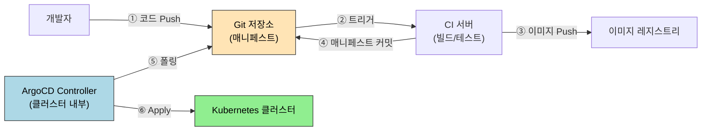
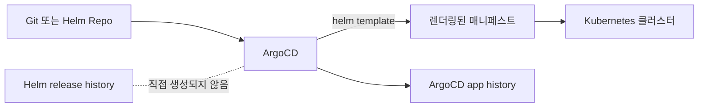

# ArgoCD와 GitOps

> GitOps는 "Git이 인프라의 단일 진실 공급원"이라는 원칙 위에 선다. ArgoCD는 이 원칙을 Kubernetes 위에서 구현한 CD 도구로, Git 상태를 클러스터에 지속적으로 반영한다.

이 문서는 Kubernetes 흐름 안의 입문/브리지 문서다. ArgoCD 전체 설치, AppProject, App of Apps, ApplicationSet, Image Updater, 운영 심화는 별도 [`argocd` 카테고리](../../argocd/README.md)에서 상세히 다룬다.


## 학습 목표
> Git을 배포의 기준 상태로 삼는 흐름을 ArgoCD 중심으로 정리한다.

이 장에서 확인할 목표는 다음과 같다:

1. Push 모델과 Pull 모델의 차이를 이해하고 GitOps가 Pull 모델을 택한 이유를 설명할 수 있다.
2. ArgoCD `Application` CR의 핵심 필드를 읽고 어떤 동작을 유발하는지 설명할 수 있다.
3. Sync 상태와 Health 상태를 구분해 장애 원인을 추론할 수 있다.
4. App of Apps 패턴으로 다수 애플리케이션을 구조화하는 방법을 이해할 수 있다.
5. ArgoCD를 RBAC과 SSO와 연동하는 기본 전략을 설명할 수 있다.


## 1. GitOps란 무엇인가
> Git을 단일 진실 공급원으로 삼는다는 말이 실제 운영에서 무엇을 뜻하는지 정리한다.

### 1.1 Push 모델의 한계

전통적인 CI/CD 파이프라인은 Push 모델이다. CI 서버(Jenkins, GitHub Actions)가 빌드를 마치면 `kubectl apply`나 Helm을 직접 실행해 클러스터에 변경을 밀어 넣는다. 이 구조에는 세 가지 취약점이 있다.

1. CI 서버에 클러스터 자격증명이 반드시 존재해야 한다. CI 서버가 탈취되면 클러스터 전체가 위협받는다.
2. 파이프라인 밖에서 누군가 직접 `kubectl apply`를 실행하면 Git과 클러스터 상태가 어긋난다.
3. 감사 추적이 어렵다. "언제 누가 무엇을 배포했는가"라는 질문에 답하려면 CI 로그와 클러스터 이벤트를 교차 검증해야 한다.

### 1.2 Pull 모델: ArgoCD의 접근법

ArgoCD는 Pull 모델로 동작한다. 클러스터 안에 ArgoCD Controller가 상주하며 Git 저장소를 주기적으로 폴링한다. Git에 변경이 생기면 Controller가 이를 감지하고 클러스터에 동기화한다. CI 서버는 이미지를 빌드하고 Git에 매니페스트를 커밋하는 역할만 한다. 클러스터 자격증명이 외부에 노출되지 않으며, Git 커밋 히스토리가 배포 감사 로그를 겸한다. 드리프트(drift) — Git과 클러스터 상태의 불일치 — 도 ArgoCD가 지속 감시해 자동으로 수정하거나 경고할 수 있다.




## 2. ArgoCD 핵심 개념
> ArgoCD가 Git 상태와 클러스터 상태를 어떻게 비교하고 동기화하는지 설명한다.

### 2.1 Application CR

ArgoCD의 핵심은 `Application` Custom Resource다. 이 CR이 "어떤 Git 저장소의 어떤 경로를, 어떤 클러스터의 어떤 네임스페이스에 배포할지"를 선언한다.

```yaml
apiVersion: argoproj.io/v1alpha1
kind: Application
metadata:
  name: my-app
  namespace: argocd
spec:
  project: default
  source:
    repoURL: https://github.com/org/k8s-manifests
    targetRevision: HEAD
    path: apps/my-app
  destination:
    server: https://kubernetes.default.svc
    namespace: production
  syncPolicy:
    automated:
      prune: true       # Git에서 삭제된 리소스를 클러스터에서도 삭제
      selfHeal: true    # 드리프트 감지 시 자동 복구
```

### 2.2 Sync 상태와 Health 상태

두 상태는 독립적으로 관리된다. Sync 상태는 Git과 클러스터의 일치 여부다. `Synced`는 일치, `OutOfSync`는 불일치를 의미한다. Health 상태는 클러스터 리소스가 실제로 정상 동작하는지를 나타낸다. `Healthy`, `Progressing`, `Degraded`, `Suspended` 네 가지다.

두 상태의 조합이 진단에 중요하다. `Synced + Degraded`는 Git 내용이 그대로 반영됐으나 Pod가 뜨지 않는 상황이다. 이미지 오류나 설정 실수일 가능성이 높다. `OutOfSync + Healthy`는 클러스터는 잘 돌아가지만 Git과 달라진 상태다. 수동으로 직접 변경이 가해졌을 때 자주 나타난다.

### 2.3 Sync Waves와 Hook

복잡한 배포에서는 리소스 생성 순서가 중요하다. 데이터베이스 스키마 마이그레이션이 완료된 뒤 애플리케이션이 기동해야 하는 경우가 대표적이다. ArgoCD는 두 가지 메커니즘을 제공한다.

`sync-wave` 어노테이션은 리소스에 정수 순서를 부여한다. 낮은 wave 번호의 리소스가 Healthy 상태가 돼야 다음 wave로 넘어간다.

```yaml
metadata:
  annotations:
    argocd.argoproj.io/sync-wave: "1"   # 먼저 실행
```

Sync Hook은 배포 전후에 Job을 실행한다. `PreSync`는 배포 전 마이그레이션, `PostSync`는 배포 후 스모크 테스트에 활용한다.

### 2.4 Helm과의 관계: 템플릿 엔진 vs 배포 이력

ArgoCD는 Helm chart를 소스로 사용할 수 있지만, Helm release를 직접 운영하는 방식과는 다르다. 공식 문서 기준으로 ArgoCD는 Helm을 `helm template` 단계에만 사용하고, 애플리케이션의 라이프사이클은 ArgoCD가 관리한다. 그래서 ArgoCD로 배포한 Helm 기반 애플리케이션은 일반적으로 `helm ls`, `helm history` 같은 명령으로 추적되지 않는다.



이 차이는 롤백 방식에서도 그대로 드러난다. Helm 직접 배포는 release revision 기준으로 `helm rollback`을 수행한다. ArgoCD는 `argocd app history`와 `argocd app rollback` 또는 Git의 이전 커밋/태그로 되돌리는 방식으로 롤백한다. 즉 "Helm의 버전 관리를 ArgoCD가 그대로 가져간다"기보다 "ArgoCD가 자기 이력 체계로 대체한다"에 가깝다.


## 3. App of Apps 패턴
> 애플리케이션 수가 늘어날 때 GitOps 구조를 어떻게 계층화할지 다룬다.

애플리케이션이 10개, 20개로 늘어나면 각각을 수동으로 등록하는 방식이 한계에 달한다. App of Apps 패턴은 이를 해결한다. 최상위 Application CR이 여러 하위 Application CR을 가리키는 Git 경로를 소스로 지정한다. ArgoCD가 최상위를 Sync하면 하위 Application들이 자동으로 생성되고, 각 하위 Application이 실제 서비스를 배포한다.

```
apps/
  app-of-apps.yaml          # 최상위 Application (ArgoCD에 직접 등록)
  apps/
    frontend.yaml           # 하위 Application
    backend.yaml
    database.yaml
```

ArgoCD ApplicationSet은 App of Apps를 더 선언적으로 확장한다. Generator(List, Git Directory, Cluster)를 통해 패턴에 맞는 Application을 동적으로 생성한다. 예를 들어 Git의 `apps/` 디렉토리 아래 새 폴더가 생기면 자동으로 Application CR이 만들어진다.


## 4. 롤백 전략
> Git revert와 클러스터 동기화가 결합된 롤백 흐름을 정리한다.

ArgoCD의 롤백은 Git 히스토리를 기반으로 한다. 특정 커밋 SHA나 태그로 `targetRevision`을 변경하면 ArgoCD가 해당 시점의 매니페스트로 클러스터를 복원한다. `automated syncPolicy`가 활성화된 경우, 롤백 후 다시 HEAD로 Sync되지 않도록 잠시 비활성화하거나 별도 브랜치를 사용해야 한다.

CLI 기준으로는 다음 흐름을 사용한다:

```bash
argocd app history my-app
argocd app rollback my-app 3
```

여기서 `3`은 Helm release revision이 아니라 ArgoCD가 기록한 application history ID다. 따라서 이전에 Helm으로 직접 배포했던 revision 2, revision 5 같은 이력을 ArgoCD가 읽어와 그대로 롤백하는 방식은 기대하면 안 된다. Helm의 이력은 Helm release에, ArgoCD의 이력은 ArgoCD Application에 각각 따로 남는다.

Blue-Green 배포와 Canary 배포는 ArgoCD Rollouts를 별도로 설치해 활용한다. `Rollout` CR이 Deployment를 대체하며, 트래픽 가중치를 단계적으로 조정하면서 새 버전을 검증한다. 이상 감지 시 자동 롤백 트리거를 설정할 수 있다.


## 5. RBAC과 SSO 연동
> GitOps 도구도 결국 조직 권한 체계 안에 들어가야 한다는 점을 설명한다.

ArgoCD는 자체 RBAC 시스템을 가진다. `argocd-rbac-cm` ConfigMap에 역할과 정책을 정의한다. 정책은 `p, <role>, <resource>, <action>, <scope>, <allow|deny>` 형태다.

실무에서는 Dex를 통해 GitHub/Google/LDAP SSO와 연동한다. 조직의 팀이나 그룹을 ArgoCD 역할에 매핑하면 별도의 계정 관리가 필요 없다. `admin` 역할은 모든 애플리케이션을 관리하고, `readonly` 역할은 조회만 허용하며, 팀별 역할은 자신의 네임스페이스 애플리케이션만 제어하도록 범위를 제한한다.


## 6. 다음 단계
> 배포 자동화 다음 단계로 관측과 장애 대응 흐름으로 넘어간다.

Ch15에서는 클러스터 모니터링과 트러블슈팅을 다룬다. ArgoCD의 Health 상태가 `Degraded`로 떨어졌을 때 Prometheus와 Grafana로 원인을 추적하는 흐름이 이어진다.

실제 운영 흐름에서는 GitOps 앞뒤에 두 가지가 자주 붙는다. 하나는 Kustomize로 환경별 매니페스트 차이를 정리하는 단계이고, 다른 하나는 Harbor 같은 OCI 레지스트리로 이미지와 Helm chart를 함께 관리하는 단계다. 그래서 Helm 다음에 Kustomize, ArgoCD 옆에 Harbor를 두면 도구 간 연결이 더 자연스럽다.


## 관련 문서
> DevTools 흐름의 마지막 장과 운영 장의 첫 진입점을 연결한다.

- [ArgoCD와 GitOps 점검](07-03.ArgoCD%EC%99%80%20GitOps%20%EC%A0%90%EA%B2%80.md) — 본 장의 점검 편
- [argocd MOC](../../argocd/README.md) — ArgoCD 상세 시리즈 전체
- [App of Apps와 ApplicationSet](../../argocd/02-03.App%20of%20Apps%EC%99%80%20ApplicationSet.md) — 여러 애플리케이션 구조화
- [CI 연동과 Image Updater](../../argocd/04-02.CI%20%EC%97%B0%EB%8F%99%EA%B3%BC%20Image%20Updater.md) — 자주 쓰는 자동화 확장
- [SonarQube on K8s](07-02.SonarQube%20on%20K8s.md) — 이전 장
- [Harbor](07-04.Harbor.md) — 이미지와 OCI Helm chart를 함께 관리하는 레지스트리
- [모니터링과 트러블슈팅](../05_operations/10-01.%EB%AA%A8%EB%8B%88%ED%84%B0%EB%A7%81%EA%B3%BC%20%ED%8A%B8%EB%9F%AC%EB%B8%94%EC%8A%88%ED%8C%85.md) — 다음 장
