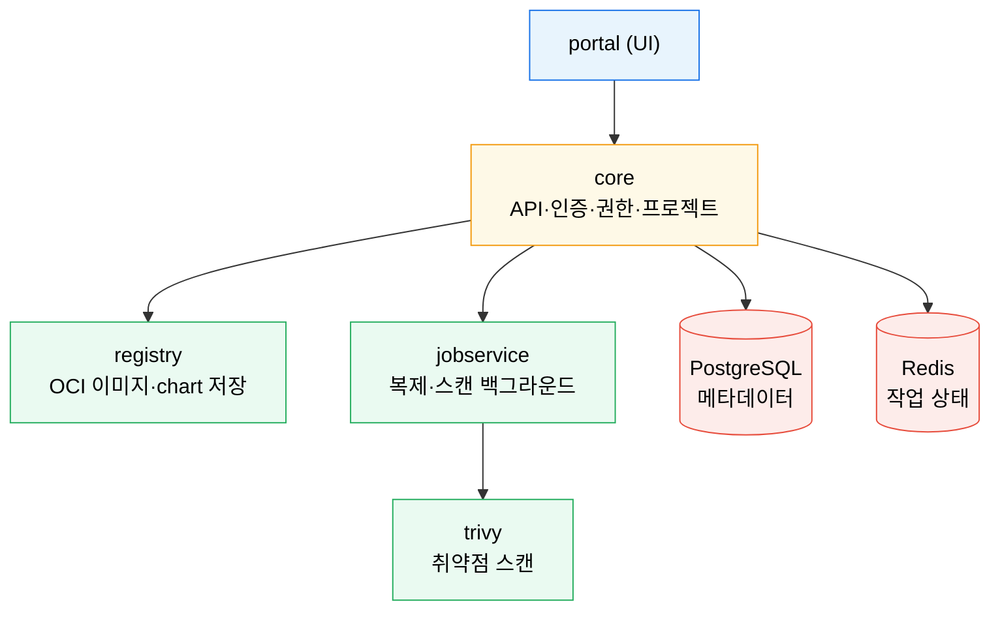
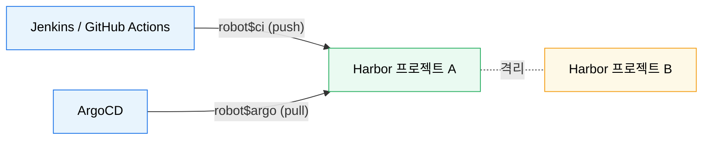

# Harbor

---

> Harbor 는 단순 Docker 이미지 저장소가 아니라 프로젝트·권한·취약점 스캔·복제·OCI Helm chart 를 함께 관리하는 클라우드 네이티브 레지스트리입니다. GitOps 흐름에서는 이미지와 chart 의 공급원 역할을 맡습니다.

## 학습 목표

> 이미지 레지스트리와 OCI chart 저장소를 하나의 운영 계층으로 묶어 이해합니다.

이 장을 끝내면 다음에 답할 수 있습니다.

1. Harbor 가 일반 이미지 레지스트리보다 어떤 운영 기능을 더 제공하는지 설명할 수 있습니다.
2. 프로젝트·로봇 계정·권한 모델이 자동화 배포와 어떻게 연결되는지 설명할 수 있습니다.
3. Helm chart 를 OCI 방식으로 Harbor 에 저장하고 사용하는 흐름을 설명할 수 있습니다.
4. Trivy 스캔·복제가 왜 중요한지, ArgoCD 와의 공급원 구조를 설명할 수 있습니다.

## 사전 지식

> 이 장은 다음을 안다고 가정합니다.

1. Docker 이미지 push/pull 과 레지스트리 개념을 압니다.
2. [Helm 기초](../03_platform/05-01.Helm%20%EA%B8%B0%EC%B4%88.md)의 Chart·Release 를 이해합니다.
3. [ArgoCD와 GitOps](07-03.ArgoCD%EC%99%80%20GitOps.md)의 "Git = 단일 진실 공급원" 개념을 압니다.


## 1. 왜 Harbor인가

> 프로덕션에서는 "푸시/풀 된다" 보다 "누가 무엇을 어디까지 쓸 수 있는가" 가 더 중요합니다.

일반 Docker Registry 는 이미지를 저장하고 내려받는 기능에 집중합니다. Harbor 는 여기에 프로젝트 단위 RBAC·취약점 스캔·이미지 서명·복제·로봇 계정·감사 로그를 얹어, 레지스트리를 보안과 거버넌스가 있는 플랫폼으로 바꿔 줍니다.

GitOps 관점에서 Harbor 의 장점은 두 가지입니다. 첫째, 팀별 프로젝트로 이미지를 격리해 Jenkins·GitHub Actions·ArgoCD 가 같은 레지스트리를 써도 권한을 분리하기 쉽습니다. 둘째, OCI 레지스트리로 Helm chart 까지 함께 저장해 이미지와 chart 공급원을 한 도메인 아래로 모을 수 있습니다.


## 2. 핵심 구성 요소

> Harbor 는 단일 컨테이너가 아니라 여러 컴포넌트의 조합입니다.



| 구성 요소 | 역할 |
|----------|------|
| `core` | API·인증·권한·프로젝트 관리 |
| `registry` | OCI 이미지와 chart 저장 |
| `jobservice` | 복제·스캔 같은 백그라운드 작업 |
| `trivy` | 취약점 스캔 |
| PostgreSQL / Redis | 메타데이터와 작업 상태 저장 |

공식 문서 기준으로 고가용성 설치에서는 애플리케이션 컴포넌트는 무상태에 가깝게 두고, 데이터 계층(PostgreSQL·Redis·오브젝트 스토리지)은 외부로 분리하는 구성이 일반적입니다.


## 3. Helm과 OCI chart

> Harbor 를 이미지 저장소이자 Helm chart 저장소로 함께 보는 편이 자연스럽습니다.

과거 Harbor 는 ChartMuseum 방식 Helm 저장소를 지원했지만, Helm 3.8 이후 OCI chart 지원이 일반화되면서 현재는 OCI 방식이 표준입니다.

```bash
# 로그인은 스킴(https://)·경로 없이 호스트명만
helm registry login <harbor-host>
helm push my-chart-0.1.0.tgz oci://<harbor-host>/<project>
helm pull oci://<harbor-host>/<project>/my-chart --version 0.1.0
helm install my-rel oci://<harbor-host>/<project>/my-chart --version 0.1.0
```

이 구조의 장점은 단순합니다. 이미지와 chart 가 모두 같은 프로젝트·같은 권한 체계·같은 복제 정책 아래 들어가, Helm 전용 저장소와 이미지 저장소를 따로 운영할 때보다 흐름이 짧아집니다.


## 4. 자동화 계정과 권한

> CI/CD 에서는 사람 계정보다 로봇 계정이 기본이어야 합니다.

Harbor 는 단일 프로젝트로 제한되는 **Project Robot Account** 와 여러 프로젝트를 덮는 **System Robot Account** 를 제공합니다. 사용자명은 `robot$` 접두사를 가지며, 토큰으로 OCI 클라이언트·API 인증만 하고 UI 로그인은 못 합니다. 권한도 `push`·`pull`·`scanner`·`project admin` 처럼 필요한 범위만 줄 수 있습니다.



이 구조를 쓰면 어떤 파이프라인이 어느 프로젝트에 이미지를 올렸는지 추적하기 쉽고, 토큰을 개별 폐기하기도 쉽습니다.


## 5. ArgoCD와의 연결

> GitOps 에서 Harbor 는 "배포할 것을 저장하는 곳", ArgoCD 는 "배포 상태를 맞추는 곳" 입니다.

권장 흐름은 다음과 같습니다.

1. CI 가 이미지를 빌드해 Harbor 프로젝트에 push 합니다.
2. 필요하면 Helm chart 도 OCI chart 로 Harbor 에 push 합니다.
3. Git 에는 Harbor 이미지 태그 또는 chart 버전이 기록됩니다.
4. ArgoCD 가 Git 을 보고 Harbor 의 artifact 를 참조해 클러스터에 반영합니다.

Harbor 는 artifact 저장소, ArgoCD 는 상태 동기화 도구입니다. 둘의 역할을 분리해야 GitOps 흐름이 깔끔해집니다.


## 6. 실습 기록

> 개인 GCP K8s 클러스터의 Harbor(`_practice/poc/harbor`)에서 OCI chart push/pull 을 확인합니다.

### 실습 1: OCI Helm chart push/pull

```bash
helm registry login harbor.example.local
helm package ./my-chart            # my-chart-0.1.0.tgz 생성
helm push my-chart-0.1.0.tgz oci://harbor.example.local/study
helm pull oci://harbor.example.local/study/my-chart --version 0.1.0
```

**예상 결과:**

```
Pushed: harbor.example.local/study/my-chart:0.1.0
Digest: sha256:...
```

**분석:** push 후 Harbor UI 의 해당 프로젝트에 chart 가 이미지와 같은 목록에 나타납니다. 이미지·chart 가 한 프로젝트·한 권한 체계로 모이는 것이 OCI 통합의 핵심 이점입니다.


## 7. 면접 대비 요약

### 한 줄 정의

Harbor 는 RBAC·Trivy 스캔·복제·OCI Helm chart 를 갖춘 클라우드 네이티브 레지스트리로, GitOps 에서 이미지와 chart 의 단일 공급원 역할을 합니다.

### 핵심 포인트 3가지

1. 일반 레지스트리에 프로젝트 RBAC·스캔·복제·로봇 계정·감사 로그를 더한 플랫폼입니다.
2. Helm 3.8+ OCI 로 이미지와 chart 를 한 프로젝트·권한 아래 통합합니다.
3. CI/CD 는 `robot$` 로봇 계정으로 최소 권한만 받아 접근합니다.

### 자주 묻는 질문

- **Q. Harbor 가 Docker Registry 와 다른 점은?** 프로젝트 RBAC·Trivy 스캔·복제·로봇 계정·감사 로그를 더한 점입니다.
- **Q. Helm chart 를 어떻게 저장합니까?** Helm 3.8+ OCI 로 `oci://harbor/<project>` 에 push/pull 합니다.
- **Q. CI 파이프라인은 어떤 계정으로 접근합니까?** 프로젝트 단위 `robot$` 로봇 계정으로 최소 권한만 받습니다.


## 관련 문서

> Helm 과 GitOps 사이를 이어 주는 공급원 계층으로 읽습니다.

- [Helm 기초](../03_platform/05-01.Helm%20%EA%B8%B0%EC%B4%88.md) — 차트 패키징과 릴리스 관리
- [Harbor 점검](07-04.Harbor%20%EC%A0%90%EA%B2%80.md) — 프로젝트·로봇 계정·OCI chart 실전 점검
- [ArgoCD와 GitOps](07-03.ArgoCD%EC%99%80%20GitOps.md) — Git 과 Harbor artifact 를 연결
