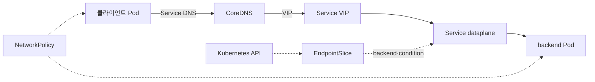

# 네트워킹 점검
---
> 개별 API 암기보다 패킷 경로의 책임 경계와 장애 진입점을 자신의 말로 설명할 수 있는지 확인합니다.

## 점검 방법
> 정답을 읽기 전에 관찰 대상, 가설, 다음 확인 순서를 먼저 말해야 기억 인출과 장애 판단을 함께 연습할 수 있습니다.

각 질문에 답한 뒤 해설을 읽습니다. 세부 필드나 구현 차이를 더 자세히 설명해야 하면 해설에 연결된 04-02~04-10 정본과 개별 점검 문서로 넘어갑니다.

질문을 풀 때 다음 구조에서 실선은 패킷 경로, 점선은 컨트롤 데이터와 정책 관계로 읽습니다:

장애 진단에서는 실선을 따라 첫 실패 지점을 찾습니다. EndpointSlice는 패킷이 통과하는 중간 hop이 아니므로, dataplane이 점선 관계를 통해 올바른 backend 데이터를 소비했는지 별도로 확인합니다.

## 1. 책임 경계 점검
> CNI, DNS, Service, 외부 진입, 접근 정책을 하나의 “네트워크” 문제로 뭉치지 않고 나누어 설명합니다.

### Q1. CNI, CoreDNS, Service dataplane은 각각 무엇을 만듭니까?

CNI는 Pod IP와 Pod 사이의 경로를 구성합니다. CoreDNS는 Service와 Pod 이름을 DNS 레코드로 해석합니다. kube-proxy 또는 CNI의 Service dataplane은 Service VIP와 NodePort 트래픽을 EndpointSlice의 가용 backend로 전달합니다.

Pod IP로도 통신하지 못하면 DNS와 Service를 보기 전에 CNI와 노드 라우팅을 확인합니다. IP로는 연결되지만 이름이 풀리지 않으면 CoreDNS, 이름이 ClusterIP로 풀리지만 Service로 연결하지 못하면 EndpointSlice와 dataplane이 다음 검사 대상입니다.

### Q2. Ingress·Gateway API와 Service의 책임은 어디서 갈립니까?

Ingress와 Gateway API는 주로 외부 HTTP(S) 요청의 host·path·TLS 규칙을 선언합니다. Controller가 이 선언을 로드 밸런서나 프록시 설정으로 구현하고, 선택된 backend는 다시 Service와 EndpointSlice를 통해 Pod로 연결됩니다. 외부에서만 실패하면 진입 계층을, 클러스터 내부 Service 접속도 실패하면 Service 하위 계층을 먼저 검사합니다.

### Q3. NetworkPolicy와 Service Mesh는 어떤 문제를 다르게 풉니까?

NetworkPolicy는 CNI가 집행하는 L3·L4 허용 모델이며, Pod의 ingress와 egress 연결 가능 여부를 제한합니다. Service Mesh는 이미 연결된 서비스 사이에서 L7 재시도·타임아웃·가중치 라우팅·mTLS·관측성을 제어합니다. 따라서 기본 Service 연결이 실패하면 Mesh 설정보다 CNI·DNS·Service·NetworkPolicy를 먼저 확인합니다.

## 2. 경로 추적 점검
> 출발지와 목적지를 바꾸어 실패 범위를 줄이고 정확한 로컬 정본으로 이동합니다.

### Q4. Pod IP는 되지만 Service 이름으로는 연결하지 못합니다. 어떻게 좁힙니까?

Service 이름이 ClusterIP로 해석되는지 먼저 확인합니다. 해석되지 않으면 Pod의 `resolv.conf`, `dnsPolicy`, CoreDNS Pod와 ConfigMap을 확인하고 [04-05 DNS와 CoreDNS](04-05.DNS%EC%99%80%20CoreDNS.md)로 이동합니다.

이름이 풀리면 Service의 selector·port·`targetPort`와 EndpointSlice의 endpoint·condition을 확인합니다. 가용 backend가 있어도 ClusterIP 연결이 실패하면 Service dataplane을 확인하고 [04-04 Service와 EndpointSlice](04-04.Service%EC%99%80%20EndpointSlice.md)로 이동합니다.

### Q5. 외부 요청만 404 또는 503으로 실패합니다. 내부 Service 성공 여부가 왜 중요합니까?

내부 Service 접속이 성공하면 backend 선택과 기본 dataplane은 정상이므로 IngressClass·Ingress, GatewayClass·Gateway·Route, controller, LoadBalancer 설정으로 범위를 줄일 수 있습니다. 내부 Service도 실패하면 외부 진입 규칙을 먼저 바꿔도 해결되지 않습니다. 세부 상태와 진단은 [04-06 Ingress와 Gateway API](04-06.Ingress%EC%99%80%20Gateway%20API.md)에서 다룹니다.

## 3. 확장 주제 점검
> NetworkPolicy, dual-stack, topology-aware routing, Windows 네트워킹이 기본 경로에 추가하는 서로 다른 제약을 구분합니다.

### Q6. client egress는 db를 허용하는데 연결이 실패합니다. NetworkPolicy에서 무엇을 더 확인합니까?

출발 client의 egress와 도착 db의 ingress가 모두 연결을 허용해야 합니다. 정책은 순서나 우선순위로 덮어쓰지 않고, 같은 Pod·방향에 적용되는 허용 규칙의 합집합으로 계산됩니다. selector 조합과 운영 예외는 [04-07 NetworkPolicy](04-07.NetworkPolicy.md)와 [점검](04-07.NetworkPolicy%20%EC%A0%90%EA%B2%80.md)에서 다룹니다.

### Q7. dual-stack Service에서 IPv4는 성공하지만 IPv6는 실패합니다. 어떤 계층을 비교합니까?

Service의 `ipFamilyPolicy`, `ipFamilies`, `clusterIPs`를 확인하고 A·AAAA DNS 응답이 해당 순서와 맞는지 비교합니다. 다음으로 Node에 해당 family의 Pod CIDR·Service CIDR·라우팅이 구성됐는지, CNI와 Service dataplane이 두 family를 처리하는지 확인합니다. 세부 정책과 전환 제약은 [04-08 IPv4와 IPv6 이중 스택](04-08.IPv4%EC%99%80%20IPv6%20%EC%9D%B4%EC%A4%91%20%EC%8A%A4%ED%83%9D.md)에서 다룹니다.

### Q8. topology-aware routing은 `internalTrafficPolicy: Local`과 어떻게 다릅니까?

Topology Aware Routing은 EndpointSlice의 zone hint를 사용해 같은 zone endpoint를 선호하는 최적화입니다. hint가 안전한 분포를 만들지 못하면 전체 endpoint 후보로 fallback할 수 있습니다. `internalTrafficPolicy: Local`은 같은 Node endpoint만 허용하는 엄격한 정책이므로 로컬 endpoint가 없으면 건강한 원격 endpoint가 있어도 실패합니다. 휴리스틱과 fallback은 [04-09 토폴로지 인지 라우팅](04-09.%ED%86%A0%ED%8F%B4%EB%A1%9C%EC%A7%80%20%EC%9D%B8%EC%A7%80%20%EB%9D%BC%EC%9A%B0%ED%8C%85.md)에서 다룹니다.

### Q9. Linux Node에서 정상인 진단 명령과 가설을 Windows Node에 그대로 적용하면 왜 실패합니까?

Windows Pod 네트워크는 Linux netns·veth·bridge·iptables 대신 HNS, HCS, vNIC, Hyper-V vSwitch, Windows용 CNI와 kube-proxy를 중심으로 구성합니다. 따라서 `ip netns`, `iptables`, `nft`만으로는 Windows 데이터플레인을 관찰할 수 없습니다. 네트워크 모드, DSR, Service 제약, 혼합 클러스터 조건은 [04-10 Windows 네트워킹](04-10.Windows%20%EB%84%A4%ED%8A%B8%EC%9B%8C%ED%82%B9.md)에서 확인합니다.

## 4. 백지 복기
> 정답을 보지 않고 전체 경로와 예외 한 가지를 재구성해 보면 개별 용어 암기와 구조 이해를 분리할 수 있습니다.

5분 동안 외부 클라이언트에서 backend Pod까지의 경로를 그립니다. Ingress·Gateway, Service, EndpointSlice, dataplane, CNI, NetworkPolicy의 위치를 표시하고 DNS 조회 경로를 따로 연결합니다.

다음 조건 중 하나를 선택해 그림을 보정합니다:

- IPv4와 IPv6를 모두 사용하는 Service로 변경합니다.
- zone 사이의 트래픽을 줄이도록 EndpointSlice hint를 추가합니다.
- backend 중 하나를 Windows Node의 Pod로 변경합니다.

빈칸을 말로 채우며 마무리합니다:

- Service 이름은 ______가 해석하고, VIP 트래픽은 ______가 EndpointSlice를 근거로 전달합니다.
- 출발 Pod와 도착 Pod가 모두 격리됐다면 새 연결은 출발의 ______와 도착의 ______가 모두 허용해야 합니다.
