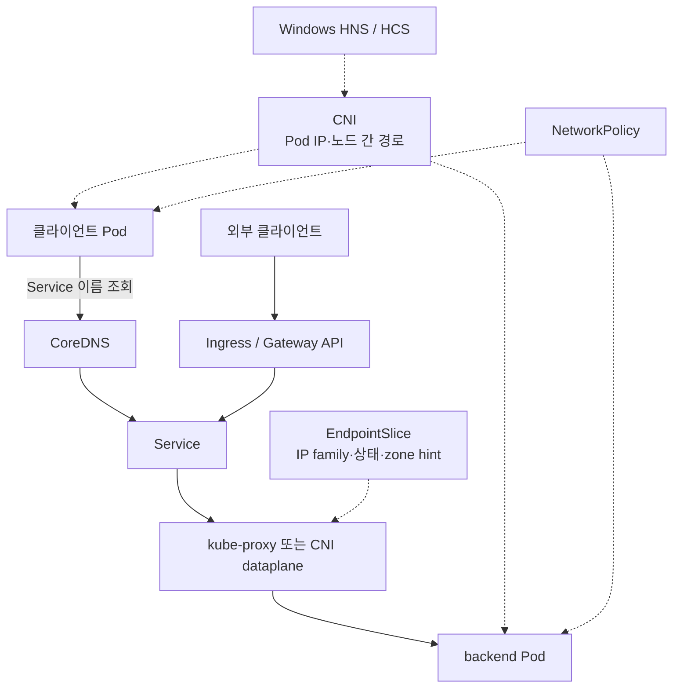
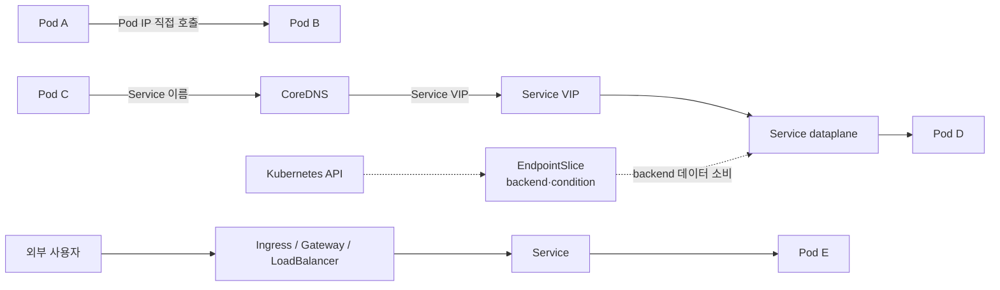

# 네트워킹
---
> Kubernetes 네트워킹은 Pod IP 모델 위에 Service discovery, 진입 제어, 가용 대상 선택, 접근 정책이 층을 이루는 구조입니다. 이 문서는 04-01~04-10의 전체 지도와 장애 진입점을 제공하고, 개별 API와 운영 제약은 각 정본으로 연결합니다.


## 학습 목표
> 네트워크 장애를 책임 계층별로 분리하고, 다음에 읽을 정본을 선택할 수 있어야 합니다.

이 장을 읽고 나면 다음을 할 수 있습니다:

1. Kubernetes Pod IP 모델이 CNI, Service, DNS의 기반이 되는 이유를 설명할 수 있습니다.
2. Pod-to-Pod, Pod-to-Service, External-to-Service 요청의 경로를 구분할 수 있습니다.
3. CNI, CoreDNS, Service dataplane, Ingress·Gateway controller, NetworkPolicy의 책임을 나눌 수 있습니다.
4. dual-stack, topology-aware routing, Windows 네트워킹이 기존 Service 경로에 추가하는 운영 조건을 판단할 수 있습니다.
5. 관찰 결과에 따라 04-02~04-10 중 어느 문서로 내려갈지 선택할 수 있습니다.


## 1. Pod IP 모델이 출발점입니다
> 모든 Pod에 고유 IP를 부여하고 Pod 사이의 NAT 없는 통신을 요구하는 모델이 상위 추상화의 기준점입니다.

Kubernetes에서 Pod는 고유한 IP를 가지며, Pod는 노드와 무관하게 다른 Pod와 통신할 수 있어야 합니다. CNI(Container Network Interface) 플러그인은 IP 할당, 노드 간 라우팅, 오버레이 또는 언더레이 연결을 구현합니다. Pod IP로 직접 연결하지 못하면 Service나 DNS를 보기 전에 이 계층부터 확인해야 합니다.

Pod IP는 Pod와 생명주기를 함께합니다. Deployment가 Pod를 교체하면 backend 주소와 집합이 바뀌므로, Service와 EndpointSlice가 안정적인 이름·VIP와 현재 backend 목록을 분리합니다. DNS는 이 안정적인 이름을 주소로 변환합니다.


## 2. 책임 분리 지도
> 각 구성 요소가 만드는 경로와 적용하는 정책을 섞지 않아야 장애 범위를 빠르게 좁힐 수 있습니다.

Kubernetes 네트워크의 책임은 다음처럼 나눉니다:

- CNI는 Pod IP와 Pod-to-Pod 경로를 구성합니다.
- CoreDNS는 Service와 Pod 이름에 대한 DNS 응답을 제공합니다.
- Service dataplane은 ClusterIP·NodePort로 들어온 트래픽을 EndpointSlice의 가용 backend로 전달합니다.
- Ingress·Gateway controller는 외부 HTTP(S) 진입 규칙을 실제 로드 밸런서나 프록시 설정으로 구현합니다.
- NetworkPolicy 구현체는 선택된 Pod의 ingress·egress 허용 범위를 집행합니다.
- EndpointSlice controller와 dataplane은 zone hint를 이용해 가까운 endpoint를 선호할 수 있습니다.
- Windows CNI와 HNS·HCS는 Linux netns·veth와 다른 운영 체계로 Windows Pod 경로를 구성합니다.

전체 관계는 다음과 같습니다:



이 그림에서 Service는 backend를 직접 저장하는 대신 EndpointSlice를 통해 현재 상태를 소비합니다. dual-stack은 Service와 EndpointSlice가 IPv4·IPv6 family를 어떻게 표현할지를 확장하고, topology-aware routing은 가용 backend 중 어느 endpoint를 선호할지를 확장합니다.


## 3. 대표 트래픽 경로
> 같은 통신 실패라도 Pod IP, Service 이름, 외부 진입점 중 어디서 시작했는지에 따라 확인 대상이 달라집니다.

Pod-to-Pod 직접 통신은 CNI 경로를 확인하는 가장 짧은 검사입니다. Pod-to-Service에서 CoreDNS는 Service 이름을 VIP로 해석하고, dataplane은 VIP 트래픽을 backend Pod로 전달합니다. EndpointSlice는 패킷이 거치는 hop이 아니라 dataplane이 backend 주소와 상태를 파악하도록 소비하는 컨트롤 플레인 API 데이터입니다. External-to-Service는 LoadBalancer·NodePort 또는 Ingress·Gateway API로 진입한 뒤 다시 Service VIP와 dataplane을 통해 backend로 이어집니다.



NetworkPolicy는 이 경로 밖의 별도 우회로가 아니라, 출발 Pod의 egress와 도착 Pod의 ingress에서 연결을 허용할지 판정하는 정책 계층입니다. topology-aware routing은 Service 후보 중 zone에 맞는 endpoint를 선호하지만 필요한 조건을 충족하지 못하면 안전한 후보 집합으로 fallback합니다.


## 4. 04-02~04-10 학습 지도
> Linux 기반에서 시작해 Service discovery와 외부 진입을 지나 정책·주소 family·위치·OS 제약으로 확장합니다.

| 단계 | 정본 | 이 문서로 넘어갈 질문 |
|------|------|--------------------------|
| 04-02 | [Pod 네트워크와 Linux 기반](04-02.Pod%20%EB%84%A4%ED%8A%B8%EC%9B%8C%ED%81%AC%EC%99%80%20Linux%20%EA%B8%B0%EB%B0%98.md) | Pod netns·veth·Pod CIDR·Service dataplane은 어떻게 만들어지나? |
| 04-03 | [오버레이와 노드 간 트래픽](04-03.%EC%98%A4%EB%B2%84%EB%A0%88%EC%9D%B4%EC%99%80%20%EB%85%B8%EB%93%9C%20%EA%B0%84%20%ED%8A%B8%EB%9E%98%ED%94%BD.md) | 패킷이 노드 사이와 클러스터 밖을 어떻게 건너나? |
| 04-04 | [Service와 EndpointSlice](04-04.Service%EC%99%80%20EndpointSlice.md) | 변하는 backend를 어떻게 안정적인 주소 뒤에 두나? |
| 04-05 | [DNS와 CoreDNS](04-05.DNS%EC%99%80%20CoreDNS.md) | Service와 Pod 이름을 어떻게 해석하나? |
| 04-06 | [Ingress와 Gateway API](04-06.Ingress%EC%99%80%20Gateway%20API.md) | 외부 HTTP(S) 트래픽을 어떻게 노출하고 책임을 나누나? |
| 04-07 | [NetworkPolicy](04-07.NetworkPolicy.md) | Pod 간 연결을 어떤 selector와 방향으로 허용하나? |
| 04-08 | [IPv4와 IPv6 이중 스택](04-08.IPv4%EC%99%80%20IPv6%20%EC%9D%B4%EC%A4%91%20%EC%8A%A4%ED%83%9D.md) | Pod와 Service가 두 IP family를 어떻게 요청하고 배열하나? |
| 04-09 | [토폴로지 인지 라우팅](04-09.%ED%86%A0%ED%8F%B4%EB%A1%9C%EC%A7%80%20%EC%9D%B8%EC%A7%80%20%EB%9D%BC%EC%9A%B0%ED%8C%85.md) | 가용 endpoint 중 가까운 zone을 선호하되 언제 fallback하나? |
| 04-10 | [Windows 네트워킹](04-10.Windows%20%EB%84%A4%ED%8A%B8%EC%9B%8C%ED%82%B9.md) | Linux 지식을 Windows HNS·HCS·CNI에 어디까지 적용할 수 있나? |

이 개요는 각 주제의 API 필드와 제약을 반복하지 않습니다. 예를 들어 `ipFamilyPolicy`의 값별 동작은 04-08, EndpointSlice hint의 휴리스틱은 04-09, HNS 네트워크 모드는 04-10을 정본으로 삼습니다.


## 5. 디버깅 진입 순서
> “네트워크가 안 된다”를 주소, 이름, backend, 전달, 정책, 외부 진입의 관찰 결과로 쪼개야 합니다.

내부 통신 실패는 다음 순서로 좁힙니다:

1. Pod IP로 직접 통신하여 CNI와 노드 라우팅을 검사합니다.
2. Service 이름을 조회하여 CoreDNS와 Pod의 resolver 설정을 검사합니다.
3. Service와 EndpointSlice의 selector, port, `ready`·`serving`·`terminating` 상태를 검사합니다.
4. ClusterIP로 접속하여 kube-proxy 또는 CNI Service dataplane을 검사합니다.
5. 특정 Pod 간 경로만 막히면 출발 egress와 도착 ingress NetworkPolicy를 함께 검사합니다.
6. 한 IP family만 실패하면 Pod·Service CIDR, `ipFamilies`, DNS A·AAAA 응답을 비교합니다.
7. 특정 zone이나 Windows Node에서만 실패하면 EndpointSlice hint와 OS별 CNI·kube-proxy 제약을 검사합니다.
8. 외부 요청만 실패하면 Ingress·Gateway controller, Route, LoadBalancer·NodePort를 검사합니다.

첫 관찰에 사용할 명령은 다음과 같습니다:

```bash
kubectl get pods -A -o wide
kubectl get services,endpointslices -A
kubectl get networkpolicies -A
kubectl get ingressclasses,ingresses -A
kubectl get gateways,httproutes -A
kubectl run dns-test --image=busybox:1.36 -it --rm -- nslookup kubernetes.default
```

이 명령은 실행 결과를 기록한 실습이 아니라 장애 진입점을 보여 주는 참조 명령입니다. 현재 환경에 Gateway API CRD가 없다면 해당 명령은 resource type 오류를 반환할 수 있습니다.


## 6. Service Mesh와의 경계
> Kubernetes 네트워킹은 연결성과 기본 노출을, Service Mesh는 연결 위의 L7 호출 정책을 다룹니다.

CNI, Service, DNS, Ingress·Gateway API, NetworkPolicy는 “어디로 연결할 수 있는가”의 기반을 만듭니다. Service Mesh는 그 위에서 가중치 라우팅, 재시도, 타임아웃, 서비스 간 mTLS, L7 관측성을 공통 정책으로 다룹니다.

따라서 Service로도 연결하지 못하면 Service Mesh를 보기 전에 CNI, DNS, Service, EndpointSlice, NetworkPolicy를 확인합니다. 기본 연결은 성공하지만 서비스 간 보안·재시도·트래픽 분할이 문제라면 [서비스 메시 기초](../../service-mesh/01_foundation/01-01.%EC%84%9C%EB%B9%84%EC%8A%A4%20%EB%A9%94%EC%8B%9C%20%EA%B8%B0%EC%B4%88.md)로 넘어갑니다.


## 7. 점검과 다음 단계
> 개요를 자신의 말로 재구성한 뒤, 막힌 계층의 개별 정본과 점검 문서로 내려갑니다.

[네트워킹 점검](04-01.%EB%84%A4%ED%8A%B8%EC%9B%8C%ED%82%B9%20%EC%A0%90%EA%B2%80.md)은 책임 경계와 전체 경로를 점검합니다. YAML 필드, 기능 상태, 운영 제약을 깊게 답해야 하면 README의 학습 순서에 따라 04-04~04-10 개별 점검 문서를 사용합니다.

이 장을 종료하기 전에 다음 빈칸을 말로 채웁니다:

- Service 이름은 ______가 해석하고, VIP 트래픽은 ______가 EndpointSlice를 근거로 전달합니다.
- NetworkPolicy로 격리된 두 Pod의 새 연결은 출발의 ______와 도착의 ______가 모두 허용해야 합니다.

5분 백지 복기에서 외부 클라이언트부터 backend Pod까지의 경로를 그리고, DNS·Service·EndpointSlice·NetworkPolicy의 검사 위치를 표시합니다. 다음으로 IPv4·IPv6 family, zone hint, Windows Node 중 하나를 추가했을 때 어느 계층을 더 확인해야 하는지 설명합니다.


## 관련 문서
> 전체 지도에서 확인한 장애 계층에 따라 가장 가까운 정본으로 내려갑니다.

- [04_networking MOC](README.md) — 04-01~04-10 학습 순서와 공식 문서 커버리지를 확인합니다.
- [Pod 네트워크와 Linux 기반](04-02.Pod%20%EB%84%A4%ED%8A%B8%EC%9B%8C%ED%81%AC%EC%99%80%20Linux%20%EA%B8%B0%EB%B0%98.md) — Pod IP와 Service dataplane의 Linux 구현을 다룹니다.
- [Service와 EndpointSlice](04-04.Service%EC%99%80%20EndpointSlice.md) — VIP 전달과 backend 컨트롤 데이터의 책임을 나눕니다.
- [NetworkPolicy](04-07.NetworkPolicy.md) — Pod 사이의 ingress·egress 허용 판정을 다룹니다.
- [네트워킹 점검](04-01.%EB%84%A4%ED%8A%B8%EC%9B%8C%ED%82%B9%20%EC%A0%90%EA%B2%80.md) — 전체 경로와 장애 진입점을 기억 인출로 검증합니다.
